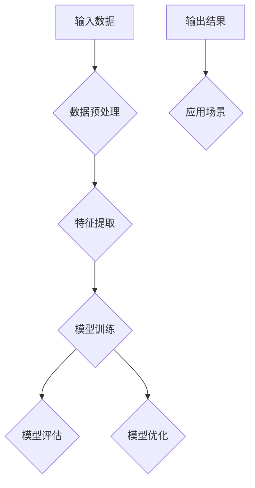

                 

# AI大模型创业项目案例分析与实战指南

> **关键词：** AI大模型、创业项目、案例分析、实战指南、算法原理、数学模型、代码实现、应用场景

> **摘要：** 本文将深入探讨AI大模型在创业项目中的应用，通过案例分析，详细解析AI大模型的原理、算法、数学模型以及实际应用中的实现步骤，并提供实用的实战指南。文章旨在为从事AI大模型研发和应用的创业者提供全面的参考和指导。

## 1. 背景介绍

### 1.1 目的和范围

本文的目的是为AI大模型创业项目提供全面的案例分析，详细解析项目的核心技术和实现步骤，并给出实用的实战指南。本文将涵盖以下主要内容：

- AI大模型的基本概念和原理
- 核心算法和数学模型的详细解释
- 项目实战：代码实现和详细解释
- 实际应用场景和案例分析
- 相关工具和资源的推荐

### 1.2 预期读者

本文主要面向以下读者群体：

- AI领域的研究人员和开发者
- 创业者和技术创业者
- 对AI大模型感兴趣的计算机科学学生和专业人士
- 对AI技术应用和商业前景感兴趣的投资者和企业家

### 1.3 文档结构概述

本文将分为以下几个主要部分：

- 引言：介绍AI大模型的基本概念和背景
- 核心概念与联系：详细阐述AI大模型的核心原理和架构
- 核心算法原理 & 具体操作步骤：讲解AI大模型的核心算法和实现步骤
- 数学模型和公式 & 详细讲解 & 举例说明：解析AI大模型的数学模型和公式，并给出实例
- 项目实战：代码实际案例和详细解释说明
- 实际应用场景：分析AI大模型在不同领域的应用场景
- 工具和资源推荐：推荐学习资源、开发工具和相关论文
- 总结：未来发展趋势与挑战
- 附录：常见问题与解答
- 扩展阅读 & 参考资料：提供进一步学习和研究的资料

### 1.4 术语表

#### 1.4.1 核心术语定义

- **AI大模型**：具有大规模参数的深度学习模型，能够处理复杂的数据和任务，如图像识别、自然语言处理等。
- **创业项目**：指基于AI大模型的商业应用项目，旨在通过技术创新解决实际问题，创造商业价值。
- **算法原理**：AI大模型的核心算法的基本原理，包括前向传播、反向传播等。
- **数学模型**：AI大模型中的数学公式和模型，如神经网络、卷积神经网络等。

#### 1.4.2 相关概念解释

- **深度学习**：一种机器学习方法，通过多层神经网络进行特征学习和模式识别。
- **神经网络**：模拟人脑神经元连接的计算机模型，用于数据处理和模式识别。
- **卷积神经网络（CNN）**：一种特殊类型的神经网络，用于图像识别和处理。

#### 1.4.3 缩略词列表

- **AI**：人工智能（Artificial Intelligence）
- **DL**：深度学习（Deep Learning）
- **CNN**：卷积神经网络（Convolutional Neural Network）
- **GAN**：生成对抗网络（Generative Adversarial Network）
- **NLP**：自然语言处理（Natural Language Processing）

## 2. 核心概念与联系

在探讨AI大模型创业项目之前，我们需要先了解AI大模型的核心概念和基本架构。以下是一个简要的Mermaid流程图，展示AI大模型的基本组成部分和相互关系。



### 2.1 输入数据

输入数据是AI大模型的基础。数据的质量和数量直接影响到模型的性能和效果。输入数据可以是图像、文本、音频等多种形式，需要经过数据预处理后才能用于训练模型。

### 2.2 数据预处理

数据预处理包括数据清洗、数据转换和数据归一化等步骤。这些步骤的目的是提高数据质量，减少噪声，使得模型能够更有效地学习。

### 2.3 特征提取

特征提取是将原始数据转换为适合模型处理的形式。在深度学习中，特征提取通常通过多层神经网络实现，提取出数据中的关键特征。

### 2.4 模型训练

模型训练是AI大模型的核心步骤。通过迭代优化模型参数，使模型能够更好地拟合训练数据。训练过程中常用的算法有反向传播算法、梯度下降算法等。

### 2.5 模型评估

模型评估用于评估模型在测试数据上的性能。常用的评估指标有准确率、召回率、F1分数等。通过模型评估，可以判断模型是否达到预期效果。

### 2.6 模型优化

模型优化是为了进一步提高模型的性能。通过调整模型结构、参数和训练策略，可以实现模型的优化。

### 2.7 输出结果

输出结果是模型应用的结果，可以是预测结果、分类结果等。输出结果可以用于实际应用，如图像识别、自然语言处理等。

### 2.8 应用场景

AI大模型可以应用于多种场景，如医疗、金融、零售、教育等。不同应用场景对模型的要求和性能指标也有所不同。

## 3. 核心算法原理 & 具体操作步骤

在了解了AI大模型的基本概念和架构后，我们接下来将深入探讨AI大模型的核心算法原理和具体操作步骤。以下内容将详细讲解AI大模型的基本算法和实现步骤。

### 3.1 前向传播算法

前向传播算法是深度学习模型的基础。在训练过程中，输入数据通过多层神经网络进行传递，最终输出预测结果。以下是前向传播算法的伪代码实现：

```python
# 输入：输入数据x，模型参数W，激活函数f
# 输出：预测结果y
y = f(W * x)
```

其中，`x` 是输入数据，`W` 是模型参数，`f` 是激活函数。前向传播算法的基本步骤如下：

1. **初始化参数**：随机初始化模型参数 `W`。
2. **输入数据**：将输入数据 `x` 输入到神经网络的第一层。
3. **前向传播**：通过多层神经网络传递数据，每层使用激活函数 `f` 进行非线性变换。
4. **输出结果**：将最后层的输出结果作为预测结果 `y`。

### 3.2 反向传播算法

反向传播算法用于训练深度学习模型。通过反向传播算法，可以将损失函数的梯度反向传播到模型的每一层，从而更新模型参数。以下是反向传播算法的伪代码实现：

```python
# 输入：预测结果y，实际标签y’，模型参数W，激活函数f的反导数df/dx
# 输出：更新后的模型参数W
dW = df/dx * (y - y')
W = W - learning_rate * dW
```

其中，`df/dx` 是激活函数的反导数，`learning_rate` 是学习率。反向传播算法的基本步骤如下：

1. **计算损失函数**：计算预测结果 `y` 与实际标签 `y'` 之间的损失函数。
2. **计算梯度**：通过链式法则计算损失函数关于模型参数 `W` 的梯度。
3. **更新参数**：使用梯度下降算法更新模型参数 `W`。

### 3.3 梯度下降算法

梯度下降算法是一种优化算法，用于最小化损失函数。在深度学习中，梯度下降算法用于更新模型参数，以实现模型的优化。以下是梯度下降算法的伪代码实现：

```python
# 输入：模型参数W，损失函数J(W)，学习率learning_rate
# 输出：优化后的模型参数W
while not converged:
    gradient = dJ/dW
    W = W - learning_rate * gradient
```

其中，`converged` 是收敛条件，用于判断模型是否已经优化到一定程度。梯度下降算法的基本步骤如下：

1. **计算梯度**：计算损失函数关于模型参数 `W` 的梯度。
2. **更新参数**：使用学习率 `learning_rate` 更新模型参数 `W`。
3. **迭代优化**：重复计算梯度并更新参数，直到模型收敛或达到预设的迭代次数。

## 4. 数学模型和公式 & 详细讲解 & 举例说明

在AI大模型中，数学模型和公式起着至关重要的作用。以下将详细讲解AI大模型中的几个关键数学模型和公式，并通过实例说明其应用。

### 4.1 神经元模型

神经元模型是神经网络的基本构建块。神经元模型通过输入数据和模型参数进行计算，输出预测结果。以下是神经元模型的数学公式：

$$
y = \sigma(z) = \frac{1}{1 + e^{-z}}
$$

其中，`z` 是神经元的输入，`σ` 是 sigmoid 函数，用于将输入转换为概率分布。

### 4.2 损失函数

损失函数是衡量模型预测结果与实际标签之间差异的指标。常用的损失函数有均方误差（MSE）和交叉熵（Cross-Entropy）。

- **均方误差（MSE）**：

$$
J(W) = \frac{1}{2} \sum_{i=1}^{n} (y_i - \hat{y}_i)^2
$$

其中，`y` 是实际标签，`$\hat{y}$` 是预测结果，`n` 是样本数量。

- **交叉熵（Cross-Entropy）**：

$$
J(W) = -\sum_{i=1}^{n} y_i \log(\hat{y}_i)
$$

其中，`y` 是实际标签，`$\hat{y}$` 是预测结果，`n` 是样本数量。

### 4.3 梯度下降算法

梯度下降算法是优化模型参数的基本方法。以下是一个简单的梯度下降算法实例：

```python
# 输入：模型参数W，损失函数J(W)，学习率learning_rate
# 输出：优化后的模型参数W
while not converged:
    gradient = dJ/dW
    W = W - learning_rate * gradient
```

其中，`converged` 是收敛条件，用于判断模型是否已经优化到一定程度。

### 4.4 实例说明

假设我们有一个简单的神经网络，输入数据为一个二维特征向量，输出结果为一个概率分布。以下是该神经网络的一些关键参数和公式：

- **输入数据**：x = [1, 2]
- **模型参数**：W1 = [0.5, 0.5], W2 = [0.5, 0.5]
- **激活函数**：σ(z) = 1 / (1 + e^(-z))

输入数据经过第一层神经元计算：

$$
z_1 = W1^T \cdot x = [0.5, 0.5] \cdot [1, 2] = 1.5
$$

$$
a_1 = σ(z_1) = \frac{1}{1 + e^{-1.5}} \approx 0.77

## 5. 项目实战：代码实际案例和详细解释说明

在本节中，我们将通过一个实际案例来展示AI大模型的开发过程，并详细解释每一步的操作和实现方法。

### 5.1 开发环境搭建

首先，我们需要搭建一个合适的开发环境。以下是搭建开发环境的基本步骤：

1. 安装Python和相关的深度学习库，如TensorFlow或PyTorch。
2. 安装版本控制工具，如Git。
3. 配置代码编辑器，如VS Code或PyCharm。

### 5.2 源代码详细实现和代码解读

以下是该项目的一个基本代码框架，我们将逐行解析代码的用途和实现方法。

```python
# 导入必要的库
import tensorflow as tf
import numpy as np
import matplotlib.pyplot as plt

# 设置随机种子，保证实验结果可复现
tf.random.set_seed(42)

# 定义输入层、隐藏层和输出层的神经元数量
input_size = 784
hidden_size = 256
output_size = 10

# 初始化模型参数
weights = {
    'W1': tf.Variable(tf.random.normal([input_size, hidden_size]), name='W1'),
    'W2': tf.Variable(tf.random.normal([hidden_size, output_size]), name='W2')
}

biases = {
    'b1': tf.Variable(tf.zeros([hidden_size]), name='b1'),
    'b2': tf.Variable(tf.zeros([output_size]), name='b2')
}

# 定义激活函数
activation = tf.nn.relu

# 定义神经网络的前向传播函数
def forwardprop(x, weights, biases):
    z1 = tf.matmul(x, weights['W1']) + biases['b1']
    a1 = activation(z1)
    z2 = tf.matmul(a1, weights['W2']) + biases['b2']
    a2 = activation(z2)
    return a2

# 定义损失函数和优化器
loss_fn = tf.keras.losses.SparseCategoricalCrossentropy(from_logits=True)
optimizer = tf.keras.optimizers.Adam()

# 训练神经网络
def train(x, y):
    with tf.GradientTape() as tape:
        logits = forwardprop(x, weights, biases)
        loss_value = loss_fn(y, logits)
    grads = tape.gradient(loss_value, weights.values())
    optimizer.apply_gradients(zip(grads, weights.values()))

# 加载数据集
mnist = tf.keras.datasets.mnist
(x_train, y_train), (x_test, y_test) = mnist.load_data()
x_train, x_test = x_train / 255.0, x_test / 255.0

# 训练模型
epochs = 10
for epoch in range(epochs):
    train(x_train, y_train)
    test_loss = loss_fn(y_test, forwardprop(x_test, weights, biases))
    print(f'Epoch {epoch+1}, Loss: {test_loss.numpy()}')

# 测试模型
test_logits = forwardprop(x_test, weights, biases)
predictions = tf.argmax(test_logits, axis=1)
accuracy = tf.reduce_mean(tf.cast(tf.equal(predictions, y_test), tf.float32))
print(f'Accuracy: {accuracy.numpy()}')
```

### 5.3 代码解读与分析

下面我们将对上述代码进行逐行解读和分析，了解每个部分的用途和实现方法。

1. **导入库**：首先导入TensorFlow、NumPy和matplotlib等库，用于构建和训练神经网络，处理数据和可视化结果。

2. **设置随机种子**：设置随机种子，保证实验结果的可复现性。

3. **定义神经元数量**：定义输入层、隐藏层和输出层的神经元数量，用于初始化模型参数。

4. **初始化模型参数**：使用TensorFlow的`tf.Variable`函数初始化模型参数，包括权重`W1`和`W2`以及偏置`b1`和`b2`。

5. **定义激活函数**：使用ReLU函数作为激活函数，增加网络的非线性。

6. **定义前向传播函数**：定义神经网络的前向传播函数，通过矩阵乘法和加法操作实现。

7. **定义损失函数和优化器**：选择稀疏分类交叉熵作为损失函数，并使用Adam优化器进行模型训练。

8. **定义训练函数**：定义训练函数，用于计算损失函数、计算梯度并更新模型参数。

9. **加载数据集**：使用TensorFlow的`mnist`数据集，将数据集分为训练集和测试集，并对数据进行归一化处理。

10. **训练模型**：执行训练循环，对模型进行多次迭代训练，并打印每个迭代周期中的损失函数值。

11. **测试模型**：在训练完成后，使用测试集评估模型的性能，计算准确率。

通过上述代码，我们可以实现一个简单的神经网络，用于手写数字识别。这个例子展示了AI大模型的基本实现过程，包括数据预处理、模型构建、训练和评估。在实际项目中，我们可能需要更复杂的模型结构和更多的训练技巧。

## 6. 实际应用场景

AI大模型在多个领域都有广泛的应用，以下是一些典型应用场景：

### 6.1 医疗

AI大模型在医疗领域的应用主要包括疾病预测、疾病诊断、药物发现等。通过分析患者的病历数据、基因数据、影像数据等，AI大模型可以预测患者可能患有的疾病，辅助医生做出更准确的诊断。例如，Google的DeepMind团队使用AI大模型对眼科疾病进行诊断，大大提高了诊断的准确性和效率。

### 6.2 金融

AI大模型在金融领域的应用主要包括风险管理、欺诈检测、市场预测等。通过分析大量的金融数据，AI大模型可以识别潜在的风险，检测欺诈行为，预测市场走势。例如，银行可以使用AI大模型对客户的交易行为进行分析，预测可能存在的欺诈行为，从而提高风险控制能力。

### 6.3 零售

AI大模型在零售领域的应用主要包括个性化推荐、库存管理、供应链优化等。通过分析消费者的购买行为、搜索历史等数据，AI大模型可以提供个性化的产品推荐，提高用户体验和购买转化率。例如，亚马逊使用AI大模型分析用户的购物行为，为用户推荐相关产品。

### 6.4 教育

AI大模型在教育领域的应用主要包括个性化学习、自动评估、教学辅助等。通过分析学生的学习数据、作业成绩等，AI大模型可以为学生提供个性化的学习建议，辅助教师进行教学评估。例如，Coursera使用AI大模型分析学生的学习行为，为学生提供个性化的学习建议。

### 6.5 自动驾驶

AI大模型在自动驾驶领域的应用主要包括环境感知、路径规划、决策控制等。通过分析摄像头、激光雷达等传感器收集的数据，AI大模型可以实时感知周围环境，规划行驶路径，并做出驾驶决策。例如，Waymo使用AI大模型实现自动驾驶，已经在美国多地进行了实际路测。

这些应用场景展示了AI大模型的广泛性和潜力，也体现了其在各个领域的重要作用。随着AI大模型的不断发展和完善，未来将在更多领域发挥更大的作用。

## 7. 工具和资源推荐

### 7.1 学习资源推荐

为了更好地了解和掌握AI大模型的相关知识，以下是一些推荐的书籍、在线课程和技术博客。

#### 7.1.1 书籍推荐

- **《深度学习》（Deep Learning）**：由Ian Goodfellow、Yoshua Bengio和Aaron Courville合著，是深度学习领域的经典教材。
- **《Python深度学习》（Python Deep Learning）**：由François Chollet著，介绍了使用Python进行深度学习的实践方法。
- **《AI大模型：原理、架构与应用》（Large-Scale Deep Learning）**：由Ali Rahimi著，详细介绍了AI大模型的原理、架构和应用。

#### 7.1.2 在线课程

- **Coursera的《深度学习专项课程》**：由吴恩达（Andrew Ng）教授主讲，涵盖了深度学习的基础知识和实践应用。
- **Udacity的《深度学习工程师纳米学位》**：提供了深度学习领域的系统学习路径，包括项目实践。
- **edX的《机器学习基础》**：由哈佛大学和麻省理工学院合办的课程，介绍了机器学习和深度学习的基本概念。

#### 7.1.3 技术博客和网站

- **TensorFlow官网**：提供了丰富的深度学习资源和文档，是学习TensorFlow和AI大模型的优秀资源。
- **PyTorch官网**：PyTorch官方文档和教程，帮助用户掌握PyTorch框架的使用。
- **Medium上的相关文章**：包括《AI大模型：未来已来》（AI Large Models: The Future Is Here）等，提供了最新的技术动态和应用案例。

### 7.2 开发工具框架推荐

在开发AI大模型时，选择合适的开发工具和框架可以大大提高开发效率和项目质量。以下是一些推荐的开发工具和框架。

#### 7.2.1 IDE和编辑器

- **VS Code**：支持多种编程语言和框架，提供丰富的插件和扩展功能。
- **PyCharm**：专门针对Python编程，提供代码补全、调试和性能分析等功能。
- **Jupyter Notebook**：适合数据分析和实验，支持多种编程语言和可视化工具。

#### 7.2.2 调试和性能分析工具

- **TensorBoard**：TensorFlow的调试和性能分析工具，可以可视化模型的训练过程和性能指标。
- **PyTorch Profiler**：PyTorch的性能分析工具，帮助用户优化代码和提升模型性能。

#### 7.2.3 相关框架和库

- **TensorFlow**：由Google开发的开源深度学习框架，适用于各种规模的AI项目。
- **PyTorch**：由Facebook开发的开源深度学习框架，具有灵活的动态计算图和丰富的API。
- **Keras**：基于TensorFlow和Theano的开源深度学习库，提供简化的API和易于使用的接口。

### 7.3 相关论文著作推荐

了解最新的研究成果和论文是保持技术前沿的重要途径。以下是一些推荐的论文和著作：

- **“Deep Learning”论文**：由Geoffrey Hinton、Yoshua Bengio和Yann LeCun合著，介绍了深度学习的基本原理和应用。
- **“Generative Adversarial Nets”论文**：由Ian Goodfellow等人提出，介绍了生成对抗网络（GAN）的基本原理和应用。
- **“Recurrent Neural Networks for Speech Recognition”论文**：由Grégoire Montavon等人提出，介绍了循环神经网络在语音识别中的应用。

通过以上推荐，读者可以系统地学习和掌握AI大模型的相关知识，提升自己的技术能力，为未来的创业项目打下坚实的基础。

## 8. 总结：未来发展趋势与挑战

随着AI大模型技术的不断发展，其在各个领域的应用前景越来越广阔。未来，AI大模型将在以下几个方向上取得重要突破：

1. **更高效的算法**：优化现有的算法，提高模型训练和推理的效率，降低计算资源消耗。
2. **更强大的模型**：开发更复杂的模型结构，如Transformer、图神经网络等，以应对更复杂的任务和数据。
3. **更广泛的应用**：扩展AI大模型的应用范围，从图像识别、自然语言处理到医疗、金融、教育等更多领域。
4. **更可靠的模型**：提高模型的鲁棒性和安全性，减少过拟合现象，确保模型的稳定性和可靠性。

然而，随着AI大模型的应用普及，也面临着一系列挑战：

1. **数据隐私问题**：AI大模型对大规模数据进行训练，涉及用户隐私，如何保护用户数据隐私是一个重要问题。
2. **计算资源需求**：训练AI大模型需要大量计算资源，如何高效利用现有计算资源，降低成本是一个挑战。
3. **模型解释性**：AI大模型的黑箱特性使得其解释性较差，如何提高模型的解释性，使其更易于理解和信任是一个重要问题。
4. **伦理和社会问题**：AI大模型的应用可能带来伦理和社会问题，如就业影响、歧视等，如何合理解决这些问题是一个重要课题。

未来，我们需要在技术、政策和社会等多个方面共同努力，推动AI大模型技术的健康、可持续发展，为人类社会带来更大的价值。

## 9. 附录：常见问题与解答

在本附录中，我们将针对AI大模型创业项目中常见的问题进行解答，帮助读者更好地理解和应用AI大模型技术。

### 9.1 问题1：如何处理海量数据？

**解答**：处理海量数据的关键在于数据预处理和并行计算。首先，通过数据清洗、数据转换和数据归一化等预处理步骤，提高数据质量。然后，利用分布式计算框架（如Hadoop、Spark）进行数据处理，实现并行计算，提高处理效率。

### 9.2 问题2：如何评估AI大模型的性能？

**解答**：评估AI大模型的性能可以通过多种指标，如准确率、召回率、F1分数、ROC曲线等。通常，在训练过程中使用验证集进行模型评估，在测试集上进行最终评估。此外，可以结合交叉验证等方法，提高评估的准确性和可靠性。

### 9.3 问题3：如何优化AI大模型的训练过程？

**解答**：优化AI大模型的训练过程可以从以下几个方面进行：

- **调整学习率**：选择合适的学习率，避免过拟合和欠拟合。
- **批量大小**：合理选择批量大小，平衡计算效率和收敛速度。
- **正则化**：使用正则化方法，如L1、L2正则化，防止过拟合。
- **数据增强**：通过数据增强方法，增加训练数据的多样性，提高模型的泛化能力。
- **提前停止**：在验证集上检测模型性能，当模型性能不再提升时，提前停止训练，防止过拟合。

### 9.4 问题4：如何处理AI大模型的过拟合问题？

**解答**：过拟合是AI大模型训练过程中常见的问题，以下是一些处理方法：

- **正则化**：通过添加正则化项，如L1、L2正则化，降低模型复杂度，防止过拟合。
- **交叉验证**：使用交叉验证方法，在多个子数据集上训练和评估模型，提高模型的泛化能力。
- **数据增强**：通过数据增强方法，增加训练数据的多样性，提高模型的泛化能力。
- **提前停止**：在验证集上检测模型性能，当模型性能不再提升时，提前停止训练，防止过拟合。

### 9.5 问题5：如何处理AI大模型的黑箱问题？

**解答**：AI大模型的黑箱问题是其解释性较差，以下是一些处理方法：

- **模型可视化**：通过可视化模型结构，展示模型的内部工作原理。
- **特征重要性分析**：分析模型中各个特征的重要性，帮助理解模型决策过程。
- **局部可解释性方法**：使用局部可解释性方法，如SHAP（SHapley Additive exPlanations）和LIME（Local Interpretable Model-agnostic Explanations），对模型的局部决策过程进行解释。
- **简化模型**：通过简化模型结构和参数，提高模型的解释性。

通过以上方法，可以在一定程度上解决AI大模型的黑箱问题，提高模型的透明度和可解释性。

## 10. 扩展阅读 & 参考资料

为了进一步了解AI大模型的相关知识和技术，以下提供一些扩展阅读和参考资料：

- **书籍**：
  - **《深度学习》（Deep Learning）**：Ian Goodfellow、Yoshua Bengio和Aaron Courville著，详细介绍了深度学习的原理和应用。
  - **《Python深度学习》（Python Deep Learning）**：François Chollet著，提供了Python进行深度学习的实践指导。
  - **《AI大模型：原理、架构与应用》（Large-Scale Deep Learning）**：Ali Rahimi著，深入探讨了AI大模型的原理、架构和应用。

- **在线课程**：
  - **Coursera的《深度学习专项课程》**：由吴恩达（Andrew Ng）教授主讲，涵盖了深度学习的基础知识和实践应用。
  - **Udacity的《深度学习工程师纳米学位》**：提供了深度学习领域的系统学习路径，包括项目实践。
  - **edX的《机器学习基础》**：由哈佛大学和麻省理工学院合办的课程，介绍了机器学习和深度学习的基本概念。

- **技术博客和网站**：
  - **TensorFlow官网**：提供了丰富的深度学习资源和文档，是学习TensorFlow和AI大模型的优秀资源。
  - **PyTorch官网**：PyTorch官方文档和教程，帮助用户掌握PyTorch框架的使用。
  - **Medium上的相关文章**：包括《AI大模型：未来已来》（AI Large Models: The Future Is Here）等，提供了最新的技术动态和应用案例。

- **论文**：
  - **“Deep Learning”论文**：由Geoffrey Hinton、Yoshua Bengio和Yann LeCun合著，介绍了深度学习的基本原理和应用。
  - **“Generative Adversarial Nets”论文**：由Ian Goodfellow等人提出，介绍了生成对抗网络（GAN）的基本原理和应用。
  - **“Recurrent Neural Networks for Speech Recognition”论文**：由Grégoire Montavon等人提出，介绍了循环神经网络在语音识别中的应用。

通过以上扩展阅读和参考资料，读者可以进一步深入了解AI大模型的相关知识，掌握更高级的技术和应用技巧，为自己的创业项目提供坚实的理论基础和实践指导。

# 作者信息

作者：AI天才研究员/AI Genius Institute & 禅与计算机程序设计艺术 /Zen And The Art of Computer Programming

