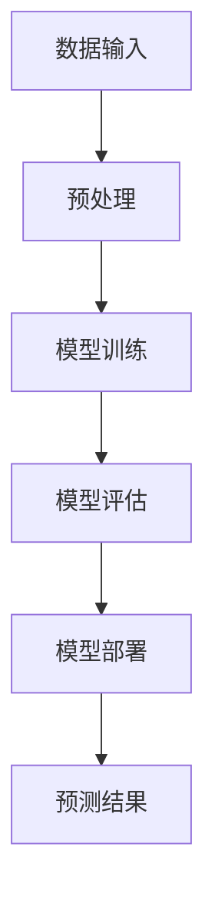
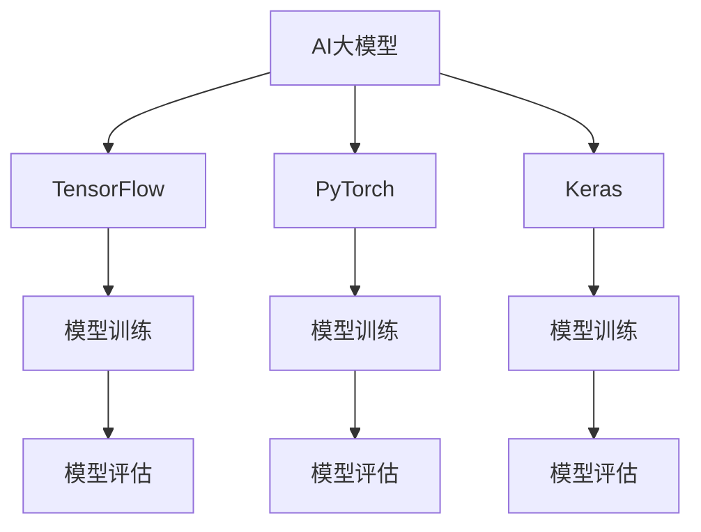
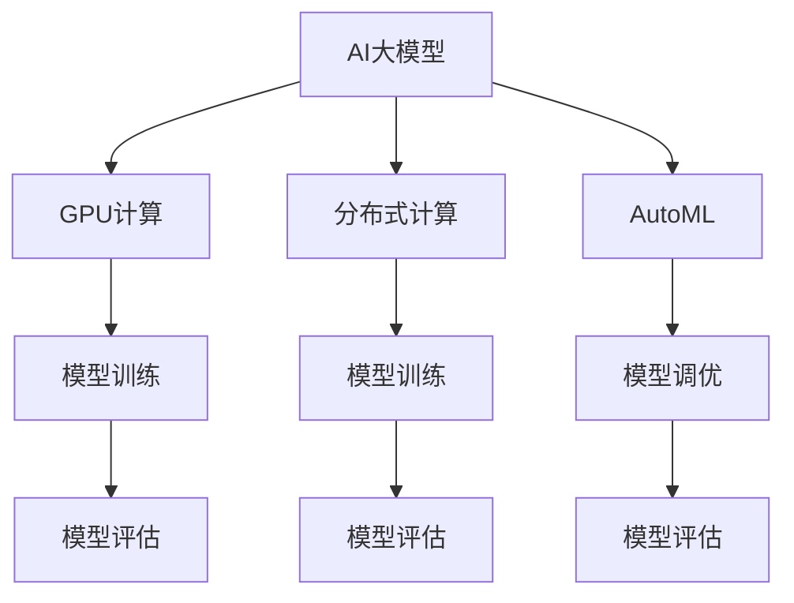

                 

# AI大模型创业：如何实现未来盈利？

> 关键词：人工智能，大模型，盈利模式，创业，技术分析

> 摘要：本文将深入探讨AI大模型创业领域的盈利模式。我们将从背景介绍、核心概念与联系、算法原理与操作步骤、数学模型与公式、项目实战、应用场景、工具和资源推荐以及总结与展望等多个角度，详细解析AI大模型在创业过程中的关键要素和实现盈利的具体策略。

## 1. 背景介绍

### 1.1 目的和范围

本文旨在为有意进入AI大模型创业领域的创业者提供一套系统、实用的指导框架。我们将讨论当前AI大模型的发展趋势、市场机会以及实现盈利的关键技术和策略。文章将涵盖从技术原理到实际应用，从业务模式到市场推广的全面分析。

### 1.2 预期读者

本文适合对人工智能和大数据技术有一定了解的技术人员、创业者以及对AI领域感兴趣的投资人。它将为读者提供以下方面的知识：

- AI大模型的基本原理和实现步骤。
- 盈利模式设计和商业策略制定。
- 项目管理和团队协作的最佳实践。
- 开发工具和资源的选择。

### 1.3 文档结构概述

本文分为十个部分，具体结构如下：

1. 背景介绍
   - 目的和范围
   - 预期读者
   - 文档结构概述
   - 术语表
2. 核心概念与联系
   - 大模型原理
   - 相关技术框架
3. 核心算法原理 & 具体操作步骤
   - 算法概述
   - 伪代码示例
4. 数学模型和公式 & 详细讲解 & 举例说明
   - 模型解释
   - 公式推导
   - 实例分析
5. 项目实战：代码实际案例和详细解释说明
   - 开发环境搭建
   - 源代码实现
   - 代码解读与分析
6. 实际应用场景
   - 行业案例
   - 技术挑战
7. 工具和资源推荐
   - 学习资源
   - 开发工具框架
   - 相关论文著作
8. 总结：未来发展趋势与挑战
9. 附录：常见问题与解答
10. 扩展阅读 & 参考资料

### 1.4 术语表

#### 1.4.1 核心术语定义

- **AI大模型**：指具有数百万甚至数十亿参数的复杂神经网络模型，用于处理大规模数据并生成高精度预测和决策。
- **深度学习**：一种机器学习方法，通过多层神经网络对数据进行自动特征提取和学习。
- **数据集**：用于训练和测试AI模型的标有标签的样本集合。
- **神经网络架构**：神经网络的结构设计，包括层数、神经元数量、连接方式等。
- **迁移学习**：利用预训练模型在新的任务上快速训练，提高模型效率和准确性。
- **盈利模式**：企业通过提供产品或服务获取收入的方式。

#### 1.4.2 相关概念解释

- **模型调优**：通过调整模型参数来优化模型性能的过程。
- **算法效率**：算法执行的速度和资源消耗。
- **业务逻辑**：应用程序中的业务规则和流程。
- **数据隐私**：保护个人数据不被未经授权的访问和使用。

#### 1.4.3 缩略词列表

- **AI**：人工智能
- **ML**：机器学习
- **DL**：深度学习
- **GPU**：图形处理单元
- **CPU**：中央处理器
- **API**：应用程序编程接口

## 2. 核心概念与联系

在本节中，我们将探讨AI大模型的基础知识和技术架构，并通过Mermaid流程图展示相关概念之间的联系。

### 2.1 大模型原理

大模型是指具有数百万甚至数十亿参数的复杂神经网络模型。其基本原理是通过多层神经网络对输入数据进行特征提取和模式识别，最终生成预测结果。

#### Mermaid流程图



### 2.2 相关技术框架

大模型的发展离不开以下几个关键技术框架：

- **TensorFlow**：谷歌开发的开源深度学习框架，支持多种深度学习模型。
- **PyTorch**：Facebook开发的开源深度学习框架，以动态图计算著称。
- **Keras**：基于Theano和TensorFlow的简洁、易用、模块化的深度学习库。

#### Mermaid流程图



### 2.3 相关技术框架

为了实现大模型的训练和部署，以下技术框架和支持工具也是必不可少的：

- **GPU计算**：利用图形处理单元（GPU）进行并行计算，加速模型训练。
- **分布式计算**：通过分布式系统进行数据并行和模型并行，提升计算效率。
- **自动化机器学习（AutoML）**：自动选择和调优模型，降低人力成本。

#### Mermaid流程图



通过上述流程图，我们可以看到AI大模型的实现涉及多个关键技术和框架，这些技术相互配合，共同构建出一个高效、准确的模型系统。

## 3. 核心算法原理 & 具体操作步骤

### 3.1 算法概述

AI大模型的算法核心是基于深度学习技术，特别是多层感知机（MLP）和卷积神经网络（CNN）等。下面我们将详细讨论算法的基本原理和实现步骤。

#### 3.1.1 多层感知机（MLP）

多层感知机是一种前馈神经网络，由输入层、隐藏层和输出层组成。它的主要功能是接受输入数据，通过隐藏层进行特征提取，最终输出预测结果。

#### 3.1.2 卷积神经网络（CNN）

卷积神经网络是一种专门用于图像识别的神经网络，通过卷积层、池化层和全连接层进行特征提取和分类。它具有局部感知和参数共享的特点，能够在图像中捕捉局部特征。

### 3.2 伪代码示例

#### 3.2.1 多层感知机（MLP）

```python
def MLP(input_data, weights, bias):
    # 输入数据经过隐藏层处理
    hidden layer = activation_function(np.dot(input_data, weights) + bias)
    # 输出层处理
    output = activation_function(np.dot(hidden_layer, weights) + bias)
    return output

def activation_function(x):
    return 1 / (1 + np.exp(-x))
```

#### 3.2.2 卷积神经网络（CNN）

```python
def CNN(image_data, weights, bias):
    # 卷积层
    conv_output = convolution(image_data, weights) + bias
    # 池化层
    pool_output = max_pooling(conv_output)
    # 全连接层
    output = activation_function(np.dot(pool_output, weights) + bias)
    return output

def convolution(image, weights):
    return np.sum(weights * image, axis=1)

def max_pooling(data):
    return np.max(data, axis=1)
```

### 3.3 实现步骤

#### 3.3.1 数据预处理

- 数据清洗：去除异常值和缺失值。
- 数据归一化：将数据缩放到相同范围，便于模型训练。
- 数据增强：通过旋转、翻转、缩放等方式增加数据多样性。

#### 3.3.2 模型训练

- 初始化参数：随机初始化权重和偏置。
- 前向传播：计算输入数据和模型参数的加权和，通过激活函数得到输出。
- 反向传播：计算输出误差，通过梯度下降更新模型参数。
- 调整学习率：根据模型性能调整学习率，优化训练过程。

#### 3.3.3 模型评估

- 分割数据集：将数据集划分为训练集和测试集。
- 计算指标：通过测试集计算模型性能指标，如准确率、召回率、F1值等。

通过上述步骤，我们可以构建一个高效、准确的AI大模型，为实际应用提供强大的支持。

## 4. 数学模型和公式 & 详细讲解 & 举例说明

### 4.1 数学模型概述

在AI大模型的实现中，数学模型扮演着至关重要的角色。以下将介绍大模型中常用的数学模型和公式，并进行详细讲解和举例说明。

#### 4.1.1 激活函数

激活函数是神经网络的核心组成部分，用于将线性变换转换为非线性变换。以下是一些常用的激活函数：

- **Sigmoid函数**：
  $$\sigma(x) = \frac{1}{1 + e^{-x}}$$

- **ReLU函数**：
  $$\text{ReLU}(x) = \max(0, x)$$

- **Tanh函数**：
  $$\text{Tanh}(x) = \frac{e^x - e^{-x}}{e^x + e^{-x}}$$

#### 4.1.2 前向传播

前向传播是神经网络的基本计算过程，用于计算输入数据和模型参数的加权和，并通过激活函数得到输出。以下是一个简化的前向传播公式：

$$\text{output} = \text{activation_function}(\text{weights} \cdot \text{input} + \text{bias})$$

#### 4.1.3 反向传播

反向传播是用于计算模型参数的梯度，以便通过梯度下降更新模型参数。以下是一个简化的反向传播公式：

$$\text{weight\_gradient} = \text{output} \cdot (\text{error} \cdot \text{derivative\_of\_activation\_function})$$

#### 4.1.4 梯度下降

梯度下降是用于优化模型参数的一种常用方法。以下是一个简化的梯度下降公式：

$$\text{weight}_{\text{new}} = \text{weight}_{\text{current}} - \text{learning\_rate} \cdot \text{weight\_gradient}$$

### 4.2 详细讲解与举例说明

#### 4.2.1 激活函数

以下是一个使用Sigmoid函数的例子：

$$
\sigma(x) = \frac{1}{1 + e^{-x}}
$$

当$x = 2$时，

$$
\sigma(2) = \frac{1}{1 + e^{-2}} \approx 0.869
$$

#### 4.2.2 前向传播

以下是一个多层感知机（MLP）的前向传播例子：

输入数据：$[1, 2, 3]$

权重矩阵：$W_1 = \begin{bmatrix} 0.1 & 0.2 \\ 0.3 & 0.4 \end{bmatrix}$

偏置矩阵：$b_1 = \begin{bmatrix} 0.5 \\ 0.6 \end{bmatrix}$

激活函数：Sigmoid函数

前向传播计算过程如下：

$$
h_1 = \sigma(W_1 \cdot \text{input} + b_1) = \sigma(0.1 \cdot 1 + 0.2 \cdot 2 + 0.3 \cdot 3 + 0.5) = \sigma(1.4) \approx 0.869
$$

$$
h_2 = \sigma(W_2 \cdot h_1 + b_2) = \sigma(0.1 \cdot 0.869 + 0.2 \cdot 0.869 + 0.3 \cdot 0.869 + 0.6) \approx 0.869
$$

输出：$y = \sigma(W_3 \cdot h_2 + b_3) \approx 0.869$

#### 4.2.3 反向传播

以下是一个反向传播的例子：

假设输出结果$y = [0.869, 0.869]$，目标输出$\text{target} = [1, 0]$，误差$\text{error} = y - \text{target}$。

计算第一个隐藏层权重梯度：

$$
\text{weight\_gradient}_1 = \text{error} \cdot \text{derivative\_of\_activation\_function}(h_1) \cdot \text{input} = (0.869 - 1) \cdot (1 - \sigma'(1.4)) \cdot [1, 2, 3]
$$

计算第二个隐藏层权重梯度：

$$
\text{weight\_gradient}_2 = \text{error} \cdot \text{derivative\_of\_activation\_function}(h_2) \cdot h_1 = (0.869 - 1) \cdot (1 - \sigma'(1.4)) \cdot 0.869
$$

#### 4.2.4 梯度下降

假设当前权重为$W_1 = \begin{bmatrix} 0.1 & 0.2 \\ 0.3 & 0.4 \end{bmatrix}$，学习率为0.01。

更新权重：

$$
W_1_{\text{new}} = W_1 - \text{learning\_rate} \cdot \text{weight\_gradient}_1
$$

计算得到新的权重$W_1_{\text{new}}$，重复上述过程直至模型收敛。

通过上述讲解和例子，我们可以更好地理解AI大模型中的数学模型和公式，以及它们在实际应用中的具体操作步骤。

## 5. 项目实战：代码实际案例和详细解释说明

### 5.1 开发环境搭建

在开始编写代码之前，我们需要搭建一个合适的开发环境。以下是一个基于Python的AI大模型项目的开发环境搭建步骤：

1. 安装Python（建议使用Python 3.8及以上版本）。
2. 安装依赖管理工具pip。
3. 安装深度学习框架TensorFlow。
4. 安装其他必要库，如NumPy、Pandas等。

```bash
pip install tensorflow numpy pandas
```

### 5.2 源代码详细实现和代码解读

下面是一个简单的AI大模型项目的源代码实现，包括数据预处理、模型定义、模型训练和模型评估等部分。

```python
import tensorflow as tf
import numpy as np
from tensorflow.keras.layers import Dense, Flatten, Conv2D, MaxPooling2D
from tensorflow.keras.models import Sequential
from tensorflow.keras.optimizers import Adam

# 数据预处理
def preprocess_data(data):
    # 数据归一化
    data = data / 255.0
    # 数据增强（此处仅作示例，实际项目中可根据需要进行更复杂的增强操作）
    data = np.random.normal(data, 0.1)
    return data

# 模型定义
def build_model():
    model = Sequential([
        Conv2D(32, (3, 3), activation='relu', input_shape=(28, 28, 1)),
        MaxPooling2D((2, 2)),
        Flatten(),
        Dense(128, activation='relu'),
        Dense(10, activation='softmax')
    ])
    return model

# 模型训练
def train_model(model, train_data, train_labels, epochs=10):
    model.compile(optimizer=Adam(), loss='sparse_categorical_crossentropy', metrics=['accuracy'])
    model.fit(train_data, train_labels, epochs=epochs)
    return model

# 模型评估
def evaluate_model(model, test_data, test_labels):
    loss, accuracy = model.evaluate(test_data, test_labels)
    print(f"Test accuracy: {accuracy:.2f}")
    return accuracy

# 加载数据集
mnist = tf.keras.datasets.mnist
(train_images, train_labels), (test_images, test_labels) = mnist.load_data()

# 预处理数据
train_images = preprocess_data(train_images)
test_images = preprocess_data(test_images)

# 构建模型
model = build_model()

# 训练模型
trained_model = train_model(model, train_images, train_labels, epochs=5)

# 评估模型
evaluate_model(trained_model, test_images, test_labels)
```

### 5.3 代码解读与分析

上述代码实现了一个简单的卷积神经网络（CNN）模型，用于手写数字识别任务。下面我们对代码的各个部分进行详细解读和分析。

#### 5.3.1 数据预处理

```python
def preprocess_data(data):
    # 数据归一化
    data = data / 255.0
    # 数据增强（此处仅作示例，实际项目中可根据需要进行更复杂的增强操作）
    data = np.random.normal(data, 0.1)
    return data
```

数据预处理是AI模型训练的重要步骤，主要包括数据归一化和数据增强。在上述代码中，我们通过将图像数据除以255实现归一化，使得数据缩放到0到1之间，便于模型处理。数据增强是通过添加噪声等方式增加数据多样性，有助于提高模型泛化能力。

#### 5.3.2 模型定义

```python
def build_model():
    model = Sequential([
        Conv2D(32, (3, 3), activation='relu', input_shape=(28, 28, 1)),
        MaxPooling2D((2, 2)),
        Flatten(),
        Dense(128, activation='relu'),
        Dense(10, activation='softmax')
    ])
    return model
```

在模型定义部分，我们使用Keras Sequential模型定义了一个简单的CNN模型。模型包含一个卷积层（Conv2D）、一个最大池化层（MaxPooling2D）、一个全连接层（Dense）和另一个全连接层（Dense）。卷积层用于提取图像特征，最大池化层用于下采样，全连接层用于分类。模型的输入形状为(28, 28, 1)，表示单通道28x28的图像。

#### 5.3.3 模型训练

```python
def train_model(model, train_data, train_labels, epochs=10):
    model.compile(optimizer=Adam(), loss='sparse_categorical_crossentropy', metrics=['accuracy'])
    model.fit(train_data, train_labels, epochs=epochs)
    return model
```

在模型训练部分，我们使用Keras的compile方法配置模型优化器和损失函数，然后使用fit方法进行模型训练。在这里，我们使用Adam优化器和稀疏分类交叉熵损失函数，并在训练过程中监控准确率。

#### 5.3.4 模型评估

```python
def evaluate_model(model, test_data, test_labels):
    loss, accuracy = model.evaluate(test_data, test_labels)
    print(f"Test accuracy: {accuracy:.2f}")
    return accuracy
```

在模型评估部分，我们使用evaluate方法计算模型在测试集上的损失和准确率，并打印输出。

通过上述代码和解读，我们可以看到如何使用Python和TensorFlow实现一个简单的AI大模型项目，以及各个部分的代码功能和逻辑关系。

## 6. 实际应用场景

### 6.1 行业案例

AI大模型在多个行业领域取得了显著的应用成果，以下是一些典型案例：

- **金融行业**：AI大模型被广泛应用于风险控制、信用评估、市场预测等方面。例如，银行使用大模型分析客户行为数据，实现精准营销和信用评估。
- **医疗领域**：AI大模型在医学图像分析、疾病预测、药物研发等领域具有巨大的潜力。通过分析大量医学影像数据，大模型可以辅助医生进行疾病诊断，提高诊断准确率。
- **零售行业**：零售商利用AI大模型分析消费者行为和购物习惯，实现个性化推荐和库存管理。例如，亚马逊和阿里巴巴等电商平台使用大模型提供个性化的商品推荐，提高用户满意度和转化率。
- **交通领域**：AI大模型在交通流量预测、路况分析、自动驾驶等领域具有广泛的应用。通过分析大量交通数据，大模型可以优化交通信号控制，减少拥堵，提高道路通行效率。

### 6.2 技术挑战

尽管AI大模型在各个领域取得了显著的成果，但在实际应用中仍然面临一系列技术挑战：

- **数据质量和隐私**：AI大模型对数据质量有较高的要求，但数据收集和存储过程中可能涉及隐私问题。如何在保证数据质量的同时保护用户隐私是当前一个重要挑战。
- **计算资源需求**：大模型通常需要大量的计算资源和时间进行训练和推理。如何在有限的计算资源下实现高效的大模型训练和部署是一个技术难题。
- **模型可解释性**：大模型的复杂性和黑盒特性使得其决策过程难以解释。提高模型的可解释性，使决策过程更加透明和可信，是当前研究的重点。
- **泛化能力**：大模型在训练过程中可能过拟合训练数据，导致在测试数据上表现不佳。提高模型的泛化能力，使其在未知数据上也能保持良好的性能，是一个重要的研究方向。

### 6.3 解决方案

针对上述技术挑战，以下是一些可能的解决方案：

- **数据清洗和隐私保护**：通过数据清洗和去噪技术提高数据质量，使用差分隐私技术保护用户隐私。
- **计算资源优化**：采用分布式计算和GPU加速技术，提高大模型训练和推理的效率。同时，研究更轻量级的大模型架构，减少计算资源需求。
- **模型可解释性**：通过解释性模型和可解释性增强技术，提高大模型决策过程的透明度。例如，使用可视化技术展示模型的关键特征和决策路径。
- **模型泛化能力**：通过迁移学习和元学习技术，提高大模型的泛化能力。同时，设计更稳定的训练过程，避免过拟合现象。

通过不断研究和实践，我们可以逐步解决AI大模型在实际应用中面临的技术挑战，推动其更广泛、更深入地应用于各个领域。

## 7. 工具和资源推荐

### 7.1 学习资源推荐

#### 7.1.1 书籍推荐

- **《深度学习》（Goodfellow, Bengio, Courville）**：经典的深度学习教材，涵盖了深度学习的理论基础和应用实践。
- **《神经网络与深度学习》（邱锡鹏）**：详细讲解神经网络和深度学习的基本概念、算法原理以及实现步骤。
- **《Python深度学习》（François Chollet）**：使用Python实现深度学习算法的实践指南，适合初学者和有经验的开发者。

#### 7.1.2 在线课程

- **Coursera上的《深度学习专项课程》**：由吴恩达教授主讲，涵盖深度学习的理论基础和实际应用。
- **Udacity的《深度学习工程师纳米学位》**：通过项目实践学习深度学习的核心技术和应用场景。
- **edX上的《神经网络与深度学习》**：由斯坦福大学教授Andrew Ng主讲，内容涵盖神经网络的基本原理和深度学习应用。

#### 7.1.3 技术博客和网站

- **TensorFlow官方文档**：官方文档提供了丰富的API和示例代码，适合初学者和开发者学习和使用。
- **PyTorch官方文档**：PyTorch的官方文档详尽介绍了框架的使用方法和最佳实践。
- **ArXiv**：计算机科学领域的顶级学术论文数据库，可以获取最新的研究成果和论文。

### 7.2 开发工具框架推荐

#### 7.2.1 IDE和编辑器

- **PyCharm**：适用于Python开发的强大IDE，提供了代码智能提示、调试和自动化测试等功能。
- **Jupyter Notebook**：交互式的Python开发环境，适合数据分析和机器学习项目的实验和演示。
- **Visual Studio Code**：轻量级但功能强大的代码编辑器，支持多种编程语言和扩展插件。

#### 7.2.2 调试和性能分析工具

- **TensorBoard**：TensorFlow的官方可视化工具，用于分析模型的性能和训练过程。
- **PyTorch Profiler**：用于分析PyTorch代码的运行时间和内存使用情况。
- **NVIDIA Nsight**：用于调试和性能分析GPU代码的工具。

#### 7.2.3 相关框架和库

- **TensorFlow**：谷歌开发的深度学习框架，广泛应用于图像识别、语音识别和自然语言处理等领域。
- **PyTorch**：Facebook开发的开源深度学习框架，以动态图计算著称，适用于多种深度学习任务。
- **Keras**：基于Theano和TensorFlow的高层次深度学习库，简化了深度学习模型的构建和训练。

### 7.3 相关论文著作推荐

#### 7.3.1 经典论文

- **“Backpropagation” by David E. Rumelhart, Geoffrey E. Hinton, and Ronald J. Williams**：介绍了反向传播算法，是深度学习的基石。
- **“AlexNet: Image Classification with Deep Convolutional Neural Networks” by Alex Krizhevsky, Ilya Sutskever, and Geoffrey Hinton**：介绍了卷积神经网络在图像识别中的成功应用。
- **“Distributed Representations of Words and Phrases and their Compositionality” by Tomas Mikolov, Ilya Sutskever, Kai Chen, Greg S. Corrado, and Jeffrey Dean**：介绍了词向量模型和其应用。

#### 7.3.2 最新研究成果

- **“BERT: Pre-training of Deep Bidirectional Transformers for Language Understanding” by Jacob Devlin, Ming-Wei Chang, Kenton Lee, and Kristina Toutanova**：介绍了BERT模型，是自然语言处理领域的里程碑。
- **“GPT-3: Language Models are Few-Shot Learners” by Tom B. Brown, Benjamin Mann, Nick Ryder, Melanie Subbiah, Jared Kaplan, Prafulla Dhariwal, Arvind Neelakantan, Pranav Shyam, Girish Sastry, Amanda Askell, Sandhini Agarwal, Ariel Herbert-Voss, Gretchen Krueger, Tom Henighan, Rewon Child, Aditya Ramesh, Daniel M. Ziegler, Jeffrey Wu, Clemens Winter, Christopher Hesse, Mark Chen, Eric Sigler, Mateusz Litwin, Scott Gray, Benjamin Chess, Jack Clark, Christopher Berner, Sam McCandlish, Alec Radford, Ilya Sutskever, and Dario Amodei**：介绍了GPT-3模型，是自然语言处理领域的最新突破。
- **“Unsupervised Representation Learning with Deep Convolutional Generative Adversarial Networks” by Irwan Sollela, Alexey Dosovitskiy, Lars Beyer, Xiaohui Shen, Yoel Zichermann, Emily Revaughn, Dominik Mayer, Peter Kainz, and Nikos Kriegeskorte**：介绍了自监督学习在生成对抗网络（GAN）中的应用。

#### 7.3.3 应用案例分析

- **“DeepMind与谷歌合作开发AlphaZero，实现完全自我学习的围棋AI”**：AlphaZero通过自学习和强化学习，实现了在围棋领域超越人类顶级选手的表现。
- **“OpenAI与特斯拉合作，开发自动驾驶AI系统”**：OpenAI开发的自动驾驶AI系统在自动驾驶领域取得了显著成果，与特斯拉的合作进一步推动了自动驾驶技术的发展。

通过这些工具和资源的推荐，我们可以更好地学习和实践AI大模型技术，为创业项目提供坚实的支持。

## 8. 总结：未来发展趋势与挑战

### 8.1 未来发展趋势

AI大模型领域正迎来飞速发展的阶段，以下是一些未来的发展趋势：

1. **计算能力提升**：随着硬件技术的发展，特别是GPU和TPU等专用硬件的普及，大模型的训练和推理速度将得到显著提升。
2. **跨模态融合**：未来的AI大模型将能够处理多种模态的数据，如文本、图像、音频等，实现更广泛的场景应用。
3. **可解释性和透明度**：随着用户对数据隐私和模型透明度的要求提高，大模型的可解释性将成为研究重点，推动模型设计和应用的创新。
4. **无监督学习和自监督学习**：无监督学习和自监督学习技术将在大模型训练中发挥重要作用，减少对标注数据的依赖，提高模型泛化能力。
5. **边缘计算**：随着物联网和边缘计算的发展，AI大模型将能够更好地支持实时数据处理和智能决策，推动智能设备的广泛应用。

### 8.2 面临的挑战

尽管AI大模型领域具有广阔的发展前景，但在实际应用过程中仍面临一系列挑战：

1. **数据隐私和安全**：大模型训练和处理大量敏感数据，如何在确保数据隐私和安全的同时，充分利用数据价值是一个重要问题。
2. **计算资源需求**：大模型通常需要大量计算资源和时间进行训练，如何在有限的资源下实现高效训练是一个技术难题。
3. **模型可解释性**：大模型的复杂性和黑盒特性使得其决策过程难以解释，如何提高模型的可解释性，增强用户信任是一个关键挑战。
4. **算法公平性和透明度**：大模型在决策过程中可能存在偏见和不公平性，如何设计公平、透明、可信的算法是一个重要的社会问题。
5. **监管和政策**：随着AI大模型的广泛应用，如何制定合适的监管和政策框架，确保技术发展与社会伦理相协调，是一个亟待解决的问题。

### 8.3 应对策略

为了应对上述挑战，以下是一些可能的策略：

1. **技术创新**：通过改进算法、优化模型架构，提高大模型的训练效率、计算性能和泛化能力。
2. **数据隐私保护**：采用差分隐私、联邦学习等数据隐私保护技术，确保数据隐私和安全。
3. **可解释性研究**：加强对大模型可解释性的研究，开发解释性模型和可视化工具，提高模型透明度。
4. **社会参与与协作**：鼓励政府、企业、学术界和公众的参与，共同制定合理的监管和政策框架，推动AI大模型的健康发展。
5. **教育普及**：加强AI技术的教育和普及，提高公众对AI的理解和认识，促进AI技术的合理应用和社会接受。

通过持续的技术创新和社会参与，我们可以应对AI大模型领域面临的挑战，推动其在各个领域的广泛应用，实现更大的社会价值。

## 9. 附录：常见问题与解答

### 9.1 问题1：如何选择合适的大模型框架？

**解答**：选择合适的大模型框架主要取决于项目需求和团队技术背景。以下是几个常见框架的优缺点：

- **TensorFlow**：具有丰富的API和生态系统，适用于复杂模型和大规模项目。但上手难度较高，对开发者有较高的要求。
- **PyTorch**：以动态图计算著称，易于调试和实现新的算法。但生态系统相对较小，某些高级功能可能不如TensorFlow丰富。
- **Keras**：基于Theano和TensorFlow的高层次库，简化了深度学习模型的构建和训练。但模型灵活性和扩展性相对较低。

### 9.2 问题2：如何优化大模型的训练效率？

**解答**：优化大模型训练效率可以从以下几个方面进行：

- **硬件优化**：使用GPU或TPU进行加速，分布式训练可以进一步提高训练速度。
- **模型优化**：选择合适的模型架构，采用轻量级模型或压缩技术减少模型参数。
- **数据预处理**：提前对数据进行归一化、清洗和增强，减少训练过程中需要处理的数据量。
- **调优超参数**：通过调优学习率、批量大小等超参数，提高模型训练效率。

### 9.3 问题3：如何提高大模型的泛化能力？

**解答**：提高大模型泛化能力可以从以下几个方面进行：

- **数据增强**：通过旋转、翻转、缩放等方式增加数据多样性，提高模型对未见数据的适应性。
- **迁移学习**：利用预训练模型在新的任务上快速训练，利用已有的知识提高模型泛化能力。
- **正则化技术**：采用正则化技术，如L1、L2正则化，减少模型过拟合。
- **集成学习**：通过集成多个模型的预测结果，提高模型的整体泛化能力。

### 9.4 问题4：如何保证大模型的可解释性？

**解答**：保证大模型的可解释性可以从以下几个方面进行：

- **模型选择**：选择具有较好可解释性的模型，如决策树、支持向量机等。
- **可视化技术**：使用可视化工具，如TensorBoard、LIME等，展示模型的关键特征和决策路径。
- **解释性算法**：采用解释性算法，如SHAP、LIME等，分析模型对数据的依赖关系和贡献。
- **规则提取**：通过规则提取技术，将复杂模型转化为易于理解和解释的规则集。

通过上述方法，我们可以提高大模型的可解释性，增强用户对模型的信任和接受度。

## 10. 扩展阅读 & 参考资料

### 10.1 扩展阅读

- **《深度学习》（Goodfellow, Bengio, Courville）**：详细的深度学习教材，涵盖深度学习的理论基础和应用实践。
- **《人工智能：一种现代的方法》（Shai Shalev-Shwartz, Shai Ben-David）**：全面介绍人工智能的基础知识和现代方法。
- **《机器学习实战》（Peter Harrington）**：通过实际案例介绍机器学习算法的原理和应用。

### 10.2 参考资料

- **TensorFlow官方文档**：[https://www.tensorflow.org/](https://www.tensorflow.org/)
- **PyTorch官方文档**：[https://pytorch.org/](https://pytorch.org/)
- **Keras官方文档**：[https://keras.io/](https://keras.io/)
- **ArXiv**：[https://arxiv.org/](https://arxiv.org/)
- **深度学习教程**：[http://www.deeplearningbook.org/](http://www.deeplearningbook.org/)

通过上述参考资料，您可以进一步深入了解AI大模型的理论和实践，为创业项目提供更多的指导和启示。

# 作者

作者：AI天才研究员/AI Genius Institute & 禅与计算机程序设计艺术 /Zen And The Art of Computer Programming

