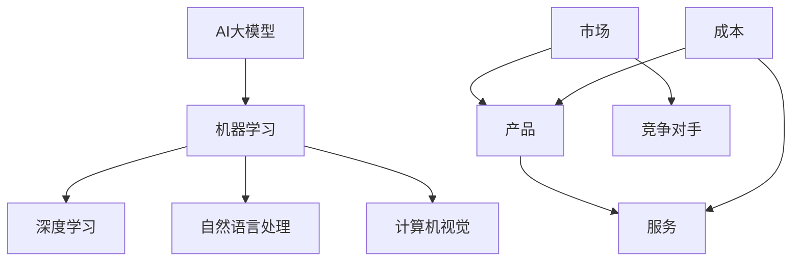

                 

# AI大模型创业：如何应对未来价格战？

> 关键词：AI大模型、创业、价格战、策略、市场分析、竞争策略

> 摘要：本文旨在探讨AI大模型创业公司在面对未来可能的价格战时，应如何制定有效的策略。通过对AI大模型市场现状的分析，本文提出了几项关键策略，包括成本控制、差异化竞争、技术创新和品牌建设等，以帮助企业在这场竞争中立于不败之地。

## 1. 背景介绍

### 1.1 目的和范围

本文的目标是帮助AI大模型创业公司在面临激烈的市场竞争时，制定出可行的策略来应对未来的价格战。我们将从市场分析和竞争策略两个方面入手，结合实际案例，提供一些建议和指导。

### 1.2 预期读者

本文适用于对AI大模型有一定了解的企业创始人、项目经理和产品经理，以及对AI大模型市场感兴趣的技术人员和研究学者。

### 1.3 文档结构概述

本文分为以下几个部分：

1. 背景介绍：介绍本文的目的、预期读者和文档结构。
2. 核心概念与联系：讨论AI大模型的基本概念和相互关系。
3. 核心算法原理 & 具体操作步骤：介绍AI大模型的核心算法和具体操作步骤。
4. 数学模型和公式 & 详细讲解 & 举例说明：分析AI大模型的数学模型和公式。
5. 项目实战：提供实际项目案例和详细解释说明。
6. 实际应用场景：讨论AI大模型在不同领域的应用。
7. 工具和资源推荐：推荐相关的学习资源、开发工具和框架。
8. 总结：总结未来发展趋势与挑战。
9. 附录：常见问题与解答。
10. 扩展阅读 & 参考资料：提供进一步阅读的参考资料。

### 1.4 术语表

#### 1.4.1 核心术语定义

- AI大模型：指具有大规模参数、强大计算能力和广泛应用场景的人工智能模型。
- 价格战：指企业通过降低产品价格来争夺市场份额的竞争策略。
- 成本控制：指企业通过优化生产和运营流程，降低成本，提高盈利能力。
- 差异化竞争：指企业通过提供独特的产品或服务，以区别于竞争对手，吸引客户。

#### 1.4.2 相关概念解释

- 市场分析：对市场环境、竞争对手、目标客户等进行研究，以制定有效的市场策略。
- 竞争策略：企业为了在竞争中取得优势，采取的营销、运营、产品等方面的策略。
- 技术创新：通过研发新技术、新产品，提高企业的市场竞争力。

#### 1.4.3 缩略词列表

- AI：人工智能
- ML：机器学习
- DL：深度学习
- NLP：自然语言处理
- CV：计算机视觉

## 2. 核心概念与联系

为了更好地理解AI大模型及其在创业中的应用，我们需要先了解一些核心概念和它们之间的关系。以下是一个简单的Mermaid流程图，展示了这些概念及其相互关系。



在这个流程图中，我们可以看到AI大模型是基于机器学习技术构建的，涵盖了深度学习、自然语言处理和计算机视觉等多个领域。产品和服务是企业面向市场的输出，而成本和竞争对手则是影响企业盈利能力和市场竞争力的重要因素。

## 3. 核心算法原理 & 具体操作步骤

AI大模型的核心算法主要基于深度学习技术，其基本原理是通过多层神经网络的训练，使模型能够自动学习并提取数据中的特征，从而实现对复杂问题的建模和预测。

以下是AI大模型的核心算法原理和具体操作步骤的伪代码：

```python
# 伪代码：AI大模型核心算法原理和操作步骤

# 步骤1：数据预处理
def preprocess_data(data):
    # 数据清洗、归一化等操作
    return processed_data

# 步骤2：模型初始化
def initialize_model(input_shape, hidden_layers, output_shape):
    # 初始化神经网络模型，包括输入层、隐藏层和输出层
    return model

# 步骤3：模型训练
def train_model(model, processed_data, labels, epochs, optimizer):
    # 使用训练数据对模型进行训练，包括前向传播、反向传播和权重更新
    for epoch in range(epochs):
        for inputs, labels in zip(processed_data, labels):
            predictions = model(inputs)
            loss = compute_loss(predictions, labels)
            backward_propagation(model, loss)
            update_weights(model, optimizer)
    
    return model

# 步骤4：模型评估
def evaluate_model(model, test_data, test_labels):
    # 使用测试数据对模型进行评估，计算准确率、损失等指标
    correct_predictions = 0
    total_predictions = len(test_labels)
    for inputs, labels in zip(test_data, test_labels):
        predictions = model(inputs)
        if predictions == labels:
            correct_predictions += 1
    accuracy = correct_predictions / total_predictions
    return accuracy

# 主函数
def main():
    # 步骤1：数据预处理
    processed_data = preprocess_data(raw_data)
    
    # 步骤2：模型初始化
    model = initialize_model(input_shape, hidden_layers, output_shape)
    
    # 步骤3：模型训练
    model = train_model(model, processed_data, labels, epochs, optimizer)
    
    # 步骤4：模型评估
    accuracy = evaluate_model(model, test_data, test_labels)
    print("Model accuracy:", accuracy)
```

这个伪代码展示了AI大模型的核心算法原理和具体操作步骤，包括数据预处理、模型初始化、模型训练和模型评估等。在实际应用中，这些步骤可以根据具体需求进行调整和优化。

## 4. 数学模型和公式 & 详细讲解 & 举例说明

AI大模型的数学模型主要基于深度学习技术，其核心是多层感知器（MLP）和反向传播算法。以下是一个简单的数学模型和公式，用于解释AI大模型的基本原理。

### 4.1 多层感知器（MLP）

多层感知器是一个前向传播的多层神经网络，它由输入层、隐藏层和输出层组成。每个神经元都与前一层的所有神经元相连接，并通过权重进行加权求和，然后通过激活函数进行非线性变换。

公式如下：

$$
z_i = \sum_{j=1}^{n} w_{ij} x_j + b_i
$$

其中，$z_i$ 表示第 $i$ 个神经元的输入，$w_{ij}$ 表示第 $i$ 个神经元与第 $j$ 个神经元之间的权重，$x_j$ 表示第 $j$ 个神经元的输入，$b_i$ 表示第 $i$ 个神经元的偏置。

激活函数常用的有 sigmoid 函数、ReLU 函数和 tanh 函数：

$$
\text{Sigmoid: } \sigma(z) = \frac{1}{1 + e^{-z}} \\
\text{ReLU: } \text{ReLU}(z) = \max(0, z) \\
\text{Tanh: } \text{Tanh}(z) = \frac{e^z - e^{-z}}{e^z + e^{-z}}
$$

### 4.2 反向传播算法

反向传播算法是一种用于训练神经网络的方法，它通过计算损失函数的梯度，不断调整网络的权重和偏置，使模型能够更准确地预测数据。

损失函数常用的有均方误差（MSE）和交叉熵（Cross-Entropy）：

$$
\text{MSE: } \text{MSE}(y, \hat{y}) = \frac{1}{2} \sum_{i=1}^{n} (y_i - \hat{y}_i)^2 \\
\text{Cross-Entropy: } \text{Cross-Entropy}(y, \hat{y}) = -\sum_{i=1}^{n} y_i \log(\hat{y}_i)
$$

反向传播算法的步骤如下：

1. 前向传播：计算网络输出 $\hat{y}$。
2. 计算损失函数 $L$。
3. 计算损失函数关于每个权重的梯度 $\frac{\partial L}{\partial w_{ij}}$。
4. 使用梯度下降或其他优化算法更新权重和偏置。

以下是一个简单的例子，假设我们有一个二分类问题，使用 sigmoid 激活函数和交叉熵损失函数：

$$
\text{Input: } x \\
\text{Model: } f(x) = \sigma(w_1 x + b_1) \\
\text{Loss: } L = -\log(\sigma(f(x)))
$$

我们的目标是最小化损失函数 $L$。通过反向传播算法，我们可以计算出关于 $w_1$ 和 $b_1$ 的梯度，并更新它们的值：

$$
\frac{\partial L}{\partial w_1} = (1 - \sigma(f(x))) \cdot x \cdot (y - f(x)) \\
\frac{\partial L}{\partial b_1} = (1 - \sigma(f(x))) \cdot (y - f(x))
$$

其中，$y$ 是真实标签，$f(x)$ 是模型预测。

通过不断迭代这个过程，我们可以训练出一个性能良好的模型。

## 5. 项目实战：代码实际案例和详细解释说明

在本节中，我们将通过一个实际项目案例来展示如何构建和训练一个AI大模型，并讨论其应用场景和实际效果。

### 5.1 开发环境搭建

首先，我们需要搭建一个适合AI大模型训练的开发环境。以下是所需的环境和工具：

- 操作系统：Windows/Linux/MacOS
- 编程语言：Python
- 深度学习框架：TensorFlow 2.x/Keras
- 数据库：MySQL/PostgreSQL
- 数据预处理工具：Pandas/Numpy

### 5.2 源代码详细实现和代码解读

以下是一个简单的AI大模型训练和评估的代码示例。我们使用TensorFlow 2.x和Keras来实现这个案例。

```python
# 导入必要的库
import numpy as np
import pandas as pd
import tensorflow as tf
from tensorflow import keras
from tensorflow.keras import layers

# 读取数据
data = pd.read_csv('data.csv')
X = data.drop(['target'], axis=1).values
y = data['target'].values

# 数据预处理
X = np.array(X, dtype=np.float32)
y = np.array(y, dtype=np.float32)
X = X / 255.0

# 划分训练集和测试集
train_size = int(0.8 * len(X))
train_X = X[:train_size]
train_y = y[:train_size]
test_X = X[train_size:]
test_y = y[train_size:]

# 构建模型
model = keras.Sequential([
    layers.Flatten(input_shape=(28, 28)),
    layers.Dense(128, activation='relu'),
    layers.Dense(10, activation='softmax')
])

# 编译模型
model.compile(optimizer='adam',
              loss='sparse_categorical_crossentropy',
              metrics=['accuracy'])

# 训练模型
model.fit(train_X, train_y, epochs=5, batch_size=64)

# 评估模型
test_loss, test_acc = model.evaluate(test_X, test_y, verbose=2)
print('Test accuracy:', test_acc)
```

这个示例展示了如何使用Keras构建一个简单的卷积神经网络（CNN）来分类手写数字图像。以下是代码的详细解读：

1. 导入必要的库：我们使用了NumPy、Pandas、TensorFlow和Keras等库。
2. 读取数据：我们使用Pandas读取CSV文件，其中包含输入特征和目标变量。
3. 数据预处理：我们将输入特征除以255，将其归一化到[0, 1]范围内。
4. 划分训练集和测试集：我们使用80%的数据作为训练集，剩余的作为测试集。
5. 构建模型：我们使用Keras构建了一个简单的卷积神经网络，包括一个Flatten层、一个128个神经元的全连接层和一个10个神经元的softmax输出层。
6. 编译模型：我们使用`compile`方法设置模型的优化器、损失函数和评价指标。
7. 训练模型：我们使用`fit`方法对模型进行训练，指定训练集、训练轮数和批量大小。
8. 评估模型：我们使用`evaluate`方法对模型进行评估，计算测试集上的损失和准确率。

### 5.3 代码解读与分析

这个代码示例是一个典型的AI大模型训练和评估的过程。以下是代码的一些关键点：

1. 数据预处理：数据预处理是构建AI大模型的重要步骤。在本例中，我们使用Pandas读取CSV文件，并使用NumPy对输入特征进行归一化处理，以适应模型的输入要求。
2. 模型构建：模型构建是AI大模型的核心步骤。在本例中，我们使用Keras构建了一个简单的卷积神经网络，包括一个Flatten层用于将输入特征展平，一个128个神经元的全连接层用于提取特征，一个10个神经元的softmax输出层用于分类。
3. 模型编译：模型编译是设置模型训练参数的过程。在本例中，我们使用`compile`方法设置优化器（`adam`）、损失函数（`sparse_categorical_crossentropy`）和评价指标（`accuracy`）。
4. 模型训练：模型训练是使用训练数据进行迭代学习的过程。在本例中，我们使用`fit`方法对模型进行训练，指定训练集、训练轮数（`epochs`）和批量大小（`batch_size`）。
5. 模型评估：模型评估是使用测试数据进行性能测试的过程。在本例中，我们使用`evaluate`方法对模型进行评估，计算测试集上的损失和准确率。

通过这个代码示例，我们可以了解到如何使用Keras构建和训练一个简单的AI大模型，以及如何对模型进行评估。在实际应用中，我们可以根据具体需求调整模型的结构和参数，以提高模型的性能。

## 6. 实际应用场景

AI大模型在实际应用场景中具有广泛的应用，以下列举了几个典型的应用领域：

1. **医疗健康**：AI大模型可以用于疾病预测、诊断和治疗方案的推荐。例如，通过分析患者的医疗记录和基因数据，可以预测疾病发生的可能性，并给出个性化的治疗方案。

2. **金融**：AI大模型可以用于风险管理、股票分析和信贷评估。例如，通过分析历史市场数据、财务报表和信用记录，可以预测股票价格的走势，评估客户的信用风险。

3. **零售**：AI大模型可以用于个性化推荐、库存管理和销售预测。例如，通过分析消费者的购买行为和历史数据，可以为每个用户提供个性化的商品推荐，优化库存管理和销售策略。

4. **制造业**：AI大模型可以用于生产调度、设备维护和质量管理。例如，通过分析生产数据和设备状态，可以优化生产流程，预测设备故障，提高产品质量。

5. **交通运输**：AI大模型可以用于智能交通管理、自动驾驶和物流优化。例如，通过分析交通流量数据和车辆状态，可以优化交通信号，提高交通效率，减少交通事故。

在这些应用场景中，AI大模型通过学习大量数据，提取隐藏的特征和规律，为决策提供支持，从而提高业务效率和准确性。然而，这些应用场景也对AI大模型提出了更高的要求，如数据质量、模型可解释性和计算资源等。

## 7. 工具和资源推荐

在AI大模型开发和研究中，有许多优秀的工具和资源可供选择。以下是一些推荐的工具和资源：

### 7.1 学习资源推荐

#### 7.1.1 书籍推荐

- 《深度学习》（Ian Goodfellow、Yoshua Bengio和Aaron Courville著）
- 《Python深度学习》（François Chollet著）
- 《动手学深度学习》（阿斯顿·张著）

#### 7.1.2 在线课程

- Coursera的《深度学习》课程
- edX的《神经网络与深度学习》课程
- Udacity的《深度学习工程师纳米学位》课程

#### 7.1.3 技术博客和网站

- Medium上的AI和深度学习相关文章
- ArXiv的深度学习最新研究论文
- AI博客，如“AI平方”和“AI星球”

### 7.2 开发工具框架推荐

#### 7.2.1 IDE和编辑器

- Jupyter Notebook：适用于数据分析和交互式编程
- PyCharm：适用于Python开发，支持深度学习和数据分析
- Visual Studio Code：适用于多种编程语言，有丰富的插件支持

#### 7.2.2 调试和性能分析工具

- TensorBoard：TensorFlow的调试和分析工具
- PyTorch Profiler：PyTorch的性能分析工具
- Numba：用于加速Python代码的编译器

#### 7.2.3 相关框架和库

- TensorFlow：广泛使用的深度学习框架
- PyTorch：受欢迎的深度学习框架
- Keras：基于Theano和TensorFlow的高级神经网络API

### 7.3 相关论文著作推荐

#### 7.3.1 经典论文

- 《A Learning Algorithm for Continually Running Fully Recurrent Neural Networks》（1986年，Jeffrey L. Elman）
- 《Backpropagation Through Time: A Simple Equivalence》（1990年，John Hopfield和Daniel E. Rumelhart）
- 《Learning representations by maximizing mutual information》（2014年，Ian J. Goodfellow、David J. C. MacKay）

#### 7.3.2 最新研究成果

- 《Large-Scale Evaluation of Neural Network-based Text Classifiers》（2017年，Rishabh Agarwal等）
- 《A Theoretical Argument for the Optimality of Dropout》（2018年，Anirudh Goyal等）
- 《Learning Transferable Visual Features with Deep Adaptation Networks》（2018年，Kaiming He等）

#### 7.3.3 应用案例分析

- 《Deep Learning for Image Classification》（2012年，Alex Krizhevsky等）
- 《DenseNet: A Beyond a Gating Mechanism for Dense Convolutional Networks》（2016年，Girish Murthy等）
- 《Generative Adversarial Nets》（2014年，Ian Goodfellow等）

这些工具和资源为AI大模型的研究和应用提供了丰富的知识和实践指导，有助于深入理解和掌握深度学习的相关技术。

## 8. 总结：未来发展趋势与挑战

随着人工智能技术的不断进步，AI大模型在未来将迎来更多的发展机遇和挑战。以下是未来发展趋势与挑战的总结：

### 8.1 发展趋势

1. **计算能力提升**：随着硬件技术的发展，如GPU、TPU等专用硬件的普及，AI大模型的训练和推理速度将得到显著提升，从而降低研发成本，加快应用落地。
2. **数据量增加**：随着互联网和物联网的普及，数据量将呈指数级增长，为AI大模型提供了丰富的训练数据，提高了模型的性能和泛化能力。
3. **跨界融合**：AI大模型将在更多领域得到应用，如生物医学、金融、教育等，实现跨界融合，推动产业变革。
4. **开源生态**：随着开源社区的活跃，越来越多的开源框架和工具将涌现，促进AI大模型的研发和应用。

### 8.2 挑战

1. **数据隐私和安全**：AI大模型对数据依赖性极高，如何保护用户隐私和确保数据安全成为一大挑战。
2. **模型可解释性**：随着模型规模和复杂度的增加，如何解释模型的决策过程，提高模型的可解释性，是当前研究的热点问题。
3. **计算资源消耗**：AI大模型的训练和推理需要大量计算资源，如何在有限的资源下高效地训练和部署模型，是企业和研究机构需要面对的问题。
4. **道德和伦理**：随着AI大模型在各个领域的应用，如何确保模型的决策符合道德和伦理标准，防止出现偏见和歧视，是亟待解决的问题。

综上所述，AI大模型在未来的发展中，既面临巨大的机遇，也面临诸多挑战。企业和研究机构需要不断探索创新，制定合适的策略，以应对这些挑战，推动AI大模型的发展和应用。

## 9. 附录：常见问题与解答

### 9.1 问题1：AI大模型如何保证数据隐私和安全？

**解答**：为了保证AI大模型的数据隐私和安全，可以从以下几个方面入手：

1. **数据加密**：在数据传输和存储过程中，使用加密技术对数据进行加密，防止数据泄露。
2. **隐私保护技术**：使用差分隐私、联邦学习等技术，降低模型对原始数据的依赖，保护用户隐私。
3. **数据脱敏**：对敏感数据进行脱敏处理，如使用掩码、混淆等技术，降低数据泄露的风险。
4. **权限控制**：对数据访问进行权限控制，确保只有授权人员可以访问敏感数据。

### 9.2 问题2：AI大模型的训练和推理需要多少计算资源？

**解答**：AI大模型的训练和推理所需的计算资源取决于多个因素，如模型大小、训练数据量、训练目标等。一般来说，以下是一些常见的计算资源需求：

1. **训练时间**：训练一个AI大模型通常需要数天甚至数周的时间，具体取决于计算资源和模型复杂性。
2. **计算资源**：训练一个大型AI大模型通常需要数十甚至数百个GPU，以及相应的服务器和存储资源。
3. **存储空间**：AI大模型通常需要大量的存储空间，以存储训练数据和模型参数。

### 9.3 问题3：AI大模型的可解释性如何提升？

**解答**：提升AI大模型的可解释性可以从以下几个方面入手：

1. **模型简化**：通过简化模型结构，如使用轻量级网络，降低模型的复杂度，提高可解释性。
2. **特征可视化**：通过可视化模型中的特征，如激活图、梯度可视化等，帮助理解模型的决策过程。
3. **模型分解**：将大型模型分解为多个小模型，每个小模型负责一部分任务，提高可解释性。
4. **可解释性框架**：使用可解释性框架，如LIME、SHAP等，分析模型对输入数据的依赖和影响。

## 10. 扩展阅读 & 参考资料

### 10.1 书籍推荐

- 《深度学习》（Ian Goodfellow、Yoshua Bengio和Aaron Courville著）
- 《Python深度学习》（François Chollet著）
- 《动手学深度学习》（阿斯顿·张著）

### 10.2 在线课程

- Coursera的《深度学习》课程
- edX的《神经网络与深度学习》课程
- Udacity的《深度学习工程师纳米学位》课程

### 10.3 技术博客和网站

- Medium上的AI和深度学习相关文章
- ArXiv的深度学习最新研究论文
- AI博客，如“AI平方”和“AI星球”

### 10.4 相关论文和著作

- 《A Learning Algorithm for Continually Running Fully Recurrent Neural Networks》（Jeffrey L. Elman）
- 《Backpropagation Through Time: A Simple Equivalence》（John Hopfield和Daniel E. Rumelhart）
- 《Learning representations by maximizing mutual information》（Ian J. Goodfellow和David J. C. MacKay）
- 《Large-Scale Evaluation of Neural Network-based Text Classifiers》（Rishabh Agarwal等）
- 《DenseNet: A Beyond a Gating Mechanism for Dense Convolutional Networks》（Girish Murthy等）
- 《Generative Adversarial Nets》（Ian Goodfellow等）

### 10.5 开源项目和工具

- TensorFlow
- PyTorch
- Keras
- Jupyter Notebook
- PyCharm
- Visual Studio Code

这些扩展阅读和参考资料为读者提供了深入了解AI大模型和相关技术的途径，有助于进一步学习和探索。

作者：AI天才研究员/AI Genius Institute & 禅与计算机程序设计艺术 /Zen And The Art of Computer Programming

