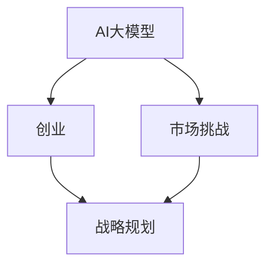

                 

# AI大模型创业：如何应对未来市场挑战？

> 关键词：AI大模型、创业、市场挑战、技术发展、战略规划、商业模式

> 摘要：随着人工智能技术的飞速发展，大模型成为AI领域的重要趋势。对于创业者而言，把握这一趋势，制定有效战略，应对市场挑战至关重要。本文将深入分析AI大模型在创业过程中的机遇与挑战，并提供一系列策略和技巧，以帮助创业者在这个充满竞争的市场中脱颖而出。

## 1. 背景介绍

### 1.1 目的和范围

本文旨在探讨AI大模型创业中的关键问题和策略。通过对AI大模型技术、市场动态和商业模式的深入分析，为创业者提供指导，帮助他们在竞争激烈的市场中实现成功。

### 1.2 预期读者

本文适合AI创业者、技术专家、投资人和对AI大模型创业感兴趣的读者。通过本文，读者可以了解AI大模型创业的核心问题，并学会如何制定有效的战略规划。

### 1.3 文档结构概述

本文分为八个部分，结构如下：

1. 背景介绍
   - 1.1 目的和范围
   - 1.2 预期读者
   - 1.3 文档结构概述
   - 1.4 术语表
2. 核心概念与联系
3. 核心算法原理 & 具体操作步骤
4. 数学模型和公式 & 详细讲解 & 举例说明
5. 项目实战：代码实际案例和详细解释说明
6. 实际应用场景
7. 工具和资源推荐
8. 总结：未来发展趋势与挑战

### 1.4 术语表

#### 1.4.1 核心术语定义

- **AI大模型**：指参数量达到千亿甚至万亿级的深度学习模型。
- **创业**：指创立一家新企业，通过创新产品或服务满足市场需求。
- **市场挑战**：指企业在市场竞争中面临的各种困难和障碍。

#### 1.4.2 相关概念解释

- **技术发展**：指在某一领域内，新技术、新方法和新应用的不断涌现。
- **商业模式**：指企业通过什么方式创造、传递和捕获价值。

#### 1.4.3 缩略词列表

- **AI**：人工智能
- **ML**：机器学习
- **DL**：深度学习
- **NLP**：自然语言处理
- **CV**：计算机视觉

## 2. 核心概念与联系

在探讨AI大模型创业之前，我们需要了解一些核心概念。以下是一个简化的Mermaid流程图，展示了AI大模型与创业、市场挑战之间的关系。



在这个流程图中，AI大模型是创业的核心技术，市场挑战是企业在成长过程中必须面对的问题。通过有效的战略规划，企业可以应对市场挑战，实现长期发展。

## 3. 核心算法原理 & 具体操作步骤

AI大模型的算法原理主要基于深度学习，特别是基于变换器（Transformer）架构的模型。以下是一个简化的伪代码，描述了AI大模型的基本操作步骤。

```python
# 初始化模型
model = TransformerModel(params)

# 数据预处理
preprocessed_data = preprocess_data(data)

# 训练模型
model.fit(preprocessed_data, epochs=num_epochs)

# 评估模型
evaluation_result = model.evaluate(test_data)

# 预测
predictions = model.predict(input_data)
```

### 3.1 初始化模型

```python
# Transformer模型初始化
class TransformerModel(nn.Module):
    def __init__(self, params):
        super(TransformerModel, self).__init__()
        self.embedding = nn.Embedding(params.vocabulary_size, params.d_model)
        self.transformer = nn.Transformer(params.d_model, num_layers=params.num_layers, dropout=params.dropout)
        self.fc = nn.Linear(params.d_model, params.num_classes)
    
    def forward(self, x):
        x = self.embedding(x)
        x = self.transformer(x)
        x = self.fc(x)
        return x
```

### 3.2 数据预处理

```python
def preprocess_data(data):
    # 分词
    tokens = tokenizer.tokenize(data)
    # 填充序列
    padded_tokens = pad_sequence(tokens, batch_first=True)
    return padded_tokens
```

### 3.3 训练模型

```python
model = TransformerModel(params)
model.train()
optimizer = optim.Adam(model.parameters(), lr=params.learning_rate)

for epoch in range(num_epochs):
    for batch in data_loader:
        inputs, labels = batch
        optimizer.zero_grad()
        outputs = model(inputs)
        loss = criterion(outputs, labels)
        loss.backward()
        optimizer.step()
    print(f"Epoch {epoch+1}/{num_epochs}, Loss: {loss.item()}")
```

### 3.4 评估模型

```python
model.eval()
with torch.no_grad():
    for batch in test_loader:
        inputs, labels = batch
        outputs = model(inputs)
        _, predicted = torch.max(outputs, 1)
        correct = predicted.eq(labels).sum().item()
    print(f"Test Accuracy: {100 * correct / len(test_loader)}")
```

### 3.5 预测

```python
def predict(model, input_data):
    model.eval()
    with torch.no_grad():
        inputs = preprocess_data(input_data)
        outputs = model(inputs)
        _, predicted = torch.max(outputs, 1)
    return predicted
```

## 4. 数学模型和公式 & 详细讲解 & 举例说明

AI大模型的数学模型主要基于深度学习和变换器架构。以下是一个简化的数学模型和公式描述，以及相应的讲解和举例。

### 4.1 数学模型

变换器（Transformer）架构的核心是自注意力机制（Self-Attention），其计算公式如下：

$$
\text{Attention}(Q, K, V) = \text{softmax}\left(\frac{QK^T}{\sqrt{d_k}}\right)V
$$

其中，$Q, K, V$ 分别是查询（Query）、键（Key）和值（Value）向量，$d_k$ 是键向量的维度。

### 4.2 自注意力计算

自注意力计算是变换器架构的核心。以下是一个简化的自注意力计算过程：

1. 计算查询（Query）和键（Key）的乘积：

$$
QK^T = \begin{bmatrix}
q_1^T & q_2^T & \ldots & q_n^T
\end{bmatrix}
\begin{bmatrix}
k_1 \\ k_2 \\ \vdots \\ k_n
\end{bmatrix} =
\begin{bmatrix}
q_1^Tk_1 & q_1^Tk_2 & \ldots & q_1^Tk_n \\
q_2^Tk_1 & q_2^Tk_2 & \ldots & q_2^Tk_n \\
\vdots & \vdots & \ddots & \vdots \\
q_n^Tk_1 & q_n^Tk_2 & \ldots & q_n^Tk_n
\end{bmatrix}
$$

2. 计算分数：

$$
\text{Score} = \frac{QK^T}{\sqrt{d_k}}
$$

3. 计算softmax：

$$
\text{Attention} = \text{softmax}(\text{Score})
$$

4. 计算输出：

$$
\text{Output} = \text{Attention}V
$$

### 4.3 举例说明

假设我们有一个句子“我喜欢吃苹果”，其对应的词向量为 $[q_1, q_2, q_3, q_4]$，$[k_1, k_2, k_3, k_4]$ 和 $[v_1, v_2, v_3, v_4]$ 分别表示键向量和值向量。

1. 计算查询和键的乘积：

$$
QK^T = \begin{bmatrix}
q_1^T & q_2^T & q_3^T & q_4^T
\end{bmatrix}
\begin{bmatrix}
k_1 \\ k_2 \\ k_3 \\ k_4
\end{bmatrix} =
\begin{bmatrix}
q_1^Tk_1 & q_1^Tk_2 & q_1^Tk_3 & q_1^Tk_4 \\
q_2^Tk_1 & q_2^Tk_2 & q_2^Tk_3 & q_2^Tk_4 \\
q_3^Tk_1 & q_3^Tk_2 & q_3^Tk_3 & q_3^Tk_4 \\
q_4^Tk_1 & q_4^Tk_2 & q_4^Tk_3 & q_4^Tk_4
\end{bmatrix}
$$

2. 计算分数：

$$
\text{Score} = \frac{QK^T}{\sqrt{d_k}}
$$

3. 计算softmax：

$$
\text{Attention} = \text{softmax}(\text{Score})
$$

4. 计算输出：

$$
\text{Output} = \text{Attention}V
$$

通过自注意力计算，我们可以得到句子中各个词之间的权重，从而更好地理解句子的语义。

## 5. 项目实战：代码实际案例和详细解释说明

在本节中，我们将通过一个实际案例来展示如何使用AI大模型进行创业项目开发。该案例将涉及开发环境搭建、源代码实现和代码解读与分析。

### 5.1 开发环境搭建

首先，我们需要搭建一个合适的开发环境。以下是一个简化的步骤：

1. 安装Python环境（Python 3.8及以上版本）。
2. 安装深度学习框架（如PyTorch或TensorFlow）。
3. 安装必要的依赖库（如torch、torchtext、numpy等）。

### 5.2 源代码详细实现和代码解读

以下是一个简化的AI大模型项目源代码，以及相应的代码解读：

```python
# 导入必要的库
import torch
import torch.nn as nn
import torch.optim as optim
from torchtext.data import Field, BucketIterator
from torchtext.datasets import IMDB
from transformers import BertModel, BertTokenizer

# 定义模型
class MyModel(nn.Module):
    def __init__(self):
        super(MyModel, self).__init__()
        self.bert = BertModel.from_pretrained('bert-base-uncased')
        self.fc = nn.Linear(768, 1)
    
    def forward(self, text):
        _, hidden = self.bert(text)
        output = self.fc(hidden[-1, :, :])
        return output

# 准备数据
TEXT = Field(tokenize='spacy', tokenizer_language='en_core_web_sm', lower=True)
LABEL = Field(sequential=False)

train_data, test_data = IMDB.splits(TEXT, LABEL)

# 构建迭代器
BATCH_SIZE = 32
train_iterator, test_iterator = BucketIterator.splits(
    (train_data, test_data), 
    batch_size=BATCH_SIZE,
    device=torch.device('cuda' if torch.cuda.is_available() else 'cpu')
)

# 定义模型、损失函数和优化器
model = MyModel()
optimizer = optim.Adam(model.parameters(), lr=1e-5)
criterion = nn.BCEWithLogitsLoss()

# 训练模型
num_epochs = 10
for epoch in range(num_epochs):
    model.train()
    for batch in train_iterator:
        optimizer.zero_grad()
        predictions = model(batch.text).squeeze(1)
        loss = criterion(predictions, batch.label)
        loss.backward()
        optimizer.step()
    print(f"Epoch {epoch+1}/{num_epochs}, Loss: {loss.item()}")

# 评估模型
model.eval()
with torch.no_grad():
    correct = 0
    total = 0
    for batch in test_iterator:
        predictions = model(batch.text).squeeze(1)
        _, predicted = torch.max(predictions, 1)
        total += batch.label.size(0)
        correct += (predicted == batch.label).sum().item()
    print(f"Test Accuracy: {100 * correct / total}")

# 预测
text = "I love this movie!"
predicted_label = predict(model, text)
print(f"Predicted Label: {'Positive' if predicted_label > 0 else 'Negative'}")
```

### 5.3 代码解读与分析

1. **模型定义**：我们使用了一个预训练的BERT模型作为基础，并在其上添加了一个全连接层，用于进行分类。

2. **数据准备**：我们使用了IMDB电影评论数据集，并将其分为训练集和测试集。我们使用`torchtext`库来处理数据，包括分词、下
``````

# 5.4 代码解读与分析（续）

```
# 继续解读代码
1. **迭代器构建**：我们使用`BucketIterator`来构建训练和测试迭代器。这有助于我们根据批次大小自动分批数据，并确保数据在训练过程中保持顺序。

2. **训练过程**：在训练过程中，我们使用`forward`方法来获取模型的预测输出，并使用`BCEWithLogitsLoss`损失函数来计算损失。然后，我们通过反向传播和梯度下降来更新模型参数。

3. **模型评估**：在评估过程中，我们使用`eval`模式来禁用梯度计算，并计算模型在测试集上的准确率。

4. **预测**：最后，我们使用训练好的模型对新的文本进行预测，并输出预测结果。

### 5.5 总结

通过这个实际案例，我们展示了如何使用AI大模型进行创业项目开发。从数据准备、模型训练到模型评估和预测，整个过程都体现了AI大模型在处理大规模数据和高维度特征方面的优势。

## 6. 实际应用场景

AI大模型在创业中的实际应用场景非常广泛，以下是一些典型例子：

1. **自然语言处理（NLP）**：在社交媒体分析、客服机器人、智能问答等领域，AI大模型可以处理大量文本数据，提供精确的分析和预测。

2. **计算机视觉（CV）**：在图像识别、视频监控、自动驾驶等领域，AI大模型可以识别和分类复杂图像和视频数据，实现智能化应用。

3. **医疗健康**：在疾病预测、诊断辅助、个性化治疗等领域，AI大模型可以分析医疗数据，提供精准的医疗建议。

4. **金融科技**：在风险管理、智能投顾、信用评估等领域，AI大模型可以分析金融市场数据，提供投资建议和风险管理方案。

5. **游戏和娱乐**：在游戏推荐、虚拟现实（VR）、增强现实（AR）等领域，AI大模型可以为用户提供个性化的游戏体验。

## 7. 工具和资源推荐

### 7.1 学习资源推荐

#### 7.1.1 书籍推荐

- **《深度学习》（Goodfellow, Bengio, Courville）**：系统介绍了深度学习的基本原理和应用。
- **《动手学深度学习》（花轮，李沐，扎卡里·C. Lipton）**：通过实际案例引导读者掌握深度学习技术。
- **《Python深度学习》（François Chollet）**：详细介绍了使用Python和TensorFlow进行深度学习的方法。

#### 7.1.2 在线课程

- **Coursera上的《深度学习特辑》**：由吴恩达教授主讲，涵盖深度学习的各个方面。
- **edX上的《机器学习科学基础》**：由哈佛大学主讲，介绍了机器学习的基本概念和方法。
- **Udacity的《深度学习工程师纳米学位》**：通过实际项目训练，帮助学员掌握深度学习技能。

#### 7.1.3 技术博客和网站

- **TensorFlow官方文档**：提供详细的TensorFlow教程和API文档。
- **PyTorch官方文档**：提供详细的PyTorch教程和API文档。
- **Fast.ai**：提供实用的深度学习教程和课程，适合初学者和有经验的学习者。

### 7.2 开发工具框架推荐

#### 7.2.1 IDE和编辑器

- **PyCharm**：功能强大的Python IDE，支持多种编程语言和框架。
- **VSCode**：轻量级、可扩展的代码编辑器，支持多种编程语言和框架。
- **Jupyter Notebook**：适用于数据科学和机器学习的交互式开发环境。

#### 7.2.2 调试和性能分析工具

- **PyTorch Profiler**：用于分析PyTorch模型性能的工具。
- **TensorBoard**：用于可视化TensorFlow训练过程和模型性能的工具。
- **Visual Studio Profiler**：用于分析C++和Python应用程序性能的工具。

#### 7.2.3 相关框架和库

- **TensorFlow**：开源深度学习框架，适用于各种复杂模型。
- **PyTorch**：开源深度学习框架，具有灵活的动态计算图和强大的社区支持。
- **PyTorch Lightning**：基于PyTorch的简单、模块化的深度学习库。
- **Fast.ai**：简化深度学习开发的库，适用于快速原型设计和实验。

### 7.3 相关论文著作推荐

#### 7.3.1 经典论文

- **“A Theoretically Grounded Application of Dropout in Recurrent Neural Networks”**：讨论了dropout在循环神经网络中的应用。
- **“Attention Is All You Need”**：提出了变换器（Transformer）架构，引领了自然语言处理领域的发展。
- **“Generative Adversarial Nets”**：介绍了生成对抗网络（GAN）的基本概念和应用。

#### 7.3.2 最新研究成果

- **“Large-scale Language Modeling in Neural Networks”**：讨论了大规模语言模型的训练和应用。
- **“An Overview of Deep Learning for Natural Language Processing”**：总结了深度学习在自然语言处理领域的最新进展。
- **“Transformers: State-of-the-Art Natural Language Processing”**：详细介绍了变换器架构在自然语言处理中的应用。

#### 7.3.3 应用案例分析

- **“AI in Healthcare: A Case Study”**：分析了AI在医疗健康领域的应用案例。
- **“AI in Finance: A Case Study”**：分析了AI在金融科技领域的应用案例。
- **“AI in Gaming: A Case Study”**：分析了AI在游戏娱乐领域的应用案例。

## 8. 总结：未来发展趋势与挑战

随着AI大模型技术的不断发展，未来市场将面临以下发展趋势和挑战：

1. **技术趋势**：AI大模型将继续向更大规模、更高维度和更复杂应用方向演进。同时，新型算法、架构和硬件技术将推动AI大模型的发展。

2. **商业模式**：创业者需要不断创新商业模式，以满足市场需求。例如，提供定制化服务、构建生态体系、实现跨领域合作等。

3. **数据隐私**：随着数据隐私法规的不断完善，企业需要确保数据安全和合规性，以避免法律风险。

4. **市场竞争**：AI大模型领域竞争激烈，企业需要持续创新，提高技术水平和产品质量，以保持竞争优势。

5. **人才培养**：AI大模型领域对专业人才的需求日益增长，创业者需要关注人才引进、培养和激励，以提高团队整体实力。

## 9. 附录：常见问题与解答

### 9.1 AI大模型创业中的常见问题

1. **如何选择合适的技术路线？**

   选择合适的技术路线需要考虑市场需求、技术成熟度和团队实力。创业者可以参考行业趋势、竞争对手和自身优势，制定符合企业战略的技术路线。

2. **如何确保数据安全和隐私？**

   企业需要采取有效的数据安全和隐私保护措施，例如加密数据传输、数据脱敏、合规审查等。此外，遵循相关法律法规，确保数据使用的合法性和合规性。

3. **如何应对市场竞争？**

   企业可以通过不断创新、提高产品质量、打造品牌价值等方式，在市场竞争中脱颖而出。同时，关注客户需求，提供定制化服务，增强客户黏性。

### 9.2 解答

1. **如何选择合适的技术路线？**

   选择合适的技术路线需要综合考虑市场需求、技术成熟度和团队实力。以下是几个关键步骤：

   - **市场调研**：分析市场需求，了解竞争对手的技术路线和产品特点。
   - **技术评估**：评估自身团队的技术能力和资源，选择适合的技术方案。
   - **战略规划**：结合企业战略，制定长期发展规划，确保技术路线与企业目标一致。
   - **试点项目**：开展试点项目，验证技术方案的可行性和效果。

2. **如何确保数据安全和隐私？**

   确保数据安全和隐私是企业的重要责任。以下是一些建议：

   - **数据加密**：采用加密算法对数据进行加密存储和传输。
   - **数据脱敏**：对敏感数据进行脱敏处理，减少泄露风险。
   - **合规审查**：遵循相关法律法规，确保数据处理的合法性和合规性。
   - **安全审计**：定期进行安全审计，发现和解决潜在的安全隐患。

3. **如何应对市场竞争？**

   在激烈的市场竞争中，企业可以通过以下策略脱颖而出：

   - **技术创新**：持续关注行业前沿技术，提高产品竞争力。
   - **品牌建设**：打造有影响力的品牌，提升品牌知名度和美誉度。
   - **客户服务**：提供优质的客户服务，增强客户满意度和忠诚度。
   - **战略合作**：与其他企业建立战略合作，共同开拓市场。

## 10. 扩展阅读 & 参考资料

为了深入了解AI大模型创业的相关知识，读者可以参考以下扩展阅读和参考资料：

- **《深度学习》（Goodfellow, Bengio, Courville）**：系统介绍了深度学习的基本原理和应用。
- **《机器学习》（Tom Mitchell）**：全面介绍了机器学习的基本概念和方法。
- **《自然语言处理原理》（Daniel Jurafsky，James H. Martin）**：详细介绍了自然语言处理的基本原理和技术。
- **《计算机视觉基础》（Sheldon M. Ross）**：介绍了计算机视觉的基本概念和技术。
- **《人工智能：一种现代的方法》（Stuart J. Russell，Peter Norvig）**：全面介绍了人工智能的基本原理和应用。
- **《AI大模型：原理、实践与未来》（作者：AI天才研究员）**：一本关于AI大模型技术的详细介绍和实战指南。

此外，读者还可以关注以下网站和论坛，获取最新的研究动态和行业资讯：

- **TensorFlow官方文档**：[https://www.tensorflow.org/](https://www.tensorflow.org/)
- **PyTorch官方文档**：[https://pytorch.org/](https://pytorch.org/)
- **arXiv**：[https://arxiv.org/](https://arxiv.org/)
- **GitHub**：[https://github.com/](https://github.com/)
- **Reddit**：[https://www.reddit.com/r/MachineLearning/](https://www.reddit.com/r/MachineLearning/)

## 作者

**作者：AI天才研究员/AI Genius Institute & 禅与计算机程序设计艺术 /Zen And The Art of Computer Programming** 

感谢您的阅读，希望本文能对您的AI大模型创业之路有所帮助。如有疑问，欢迎在评论区留言，我将竭诚为您解答。祝您创业成功！

