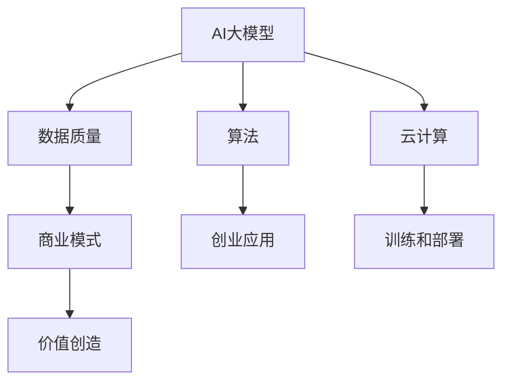

                 

# AI大模型创业：如何应对未来市场挑战？

> 关键词：AI大模型、创业、市场挑战、技术发展、战略规划

> 摘要：本文深入探讨了AI大模型在创业市场中的机遇与挑战。通过分析当前技术趋势、商业模式和市场动态，本文提出了应对未来市场挑战的策略，帮助创业者抓住机遇，实现可持续发展。

## 1. 背景介绍

### 1.1 目的和范围

本文旨在为AI大模型创业公司提供战略指导，帮助它们在竞争激烈的市场中立足。我们将从多个维度分析AI大模型的市场环境，包括技术发展、商业模式、用户需求和市场趋势。在此基础上，提出具体的应对策略和建议。

### 1.2 预期读者

本文面向AI领域创业者、技术团队负责人、产品经理以及对该领域感兴趣的投资者。希望本文能为读者在创业实践中提供有价值的参考。

### 1.3 文档结构概述

本文分为十个部分，具体结构如下：

1. 背景介绍
2. 核心概念与联系
3. 核心算法原理 & 具体操作步骤
4. 数学模型和公式 & 详细讲解 & 举例说明
5. 项目实战：代码实际案例和详细解释说明
6. 实际应用场景
7. 工具和资源推荐
8. 总结：未来发展趋势与挑战
9. 附录：常见问题与解答
10. 扩展阅读 & 参考资料

### 1.4 术语表

#### 1.4.1 核心术语定义

- **AI大模型**：指的是参数量巨大、能够处理海量数据的深度学习模型，如BERT、GPT等。
- **创业公司**：指初创企业，通常具有创新性的技术或商业模式。
- **市场挑战**：指在市场环境中面临的竞争、技术发展、用户需求等多方面的压力。

#### 1.4.2 相关概念解释

- **商业模式**：企业如何创造、传递和捕获价值。
- **用户需求**：用户对产品或服务的期望和需求。
- **市场动态**：市场的变化趋势和竞争态势。

#### 1.4.3 缩略词列表

- **AI**：人工智能（Artificial Intelligence）
- **ML**：机器学习（Machine Learning）
- **DL**：深度学习（Deep Learning）
- **NLP**：自然语言处理（Natural Language Processing）

## 2. 核心概念与联系

在分析AI大模型创业时，我们需要关注以下几个核心概念：

1. **AI大模型**：包括其原理、架构和实现方法。
2. **数据**：数据质量和数据量的重要性。
3. **算法**：常见的AI算法及其在创业中的应用。
4. **云计算**：云计算在AI大模型训练和部署中的作用。
5. **商业模式**：如何通过AI大模型创造价值。

以下是一个简单的Mermaid流程图，展示了这些核心概念之间的联系：



## 3. 核心算法原理 & 具体操作步骤

### 3.1 AI大模型原理

AI大模型通常基于深度学习框架，如TensorFlow、PyTorch等。以下是一个简单的伪代码，展示了如何构建一个基于BERT的大模型：

```python
# 伪代码：构建BERT大模型
import tensorflow as tf
from transformers import BertModel, BertConfig

# 初始化BERT配置
config = BertConfig.from_pretrained('bert-base-uncased')

# 加载预训练BERT模型
model = BertModel(config)

# 定义损失函数和优化器
loss_fn = tf.keras.losses.SparseCategoricalCrossentropy(from_logits=True)
optimizer = tf.keras.optimizers.Adam()

# 定义训练过程
def train_step(inputs, targets):
    with tf.GradientTape() as tape:
        outputs = model(inputs, training=True)
        loss = loss_fn(targets, outputs.logits)
    gradients = tape.gradient(loss, model.trainable_variables)
    optimizer.apply_gradients(zip(gradients, model.trainable_variables))
    return loss

# 训练大模型
for epoch in range(num_epochs):
    for inputs, targets in data_loader:
        loss = train_step(inputs, targets)
        print(f"Epoch: {epoch}, Loss: {loss}")
```

### 3.2 数据处理步骤

在训练AI大模型时，数据处理是关键的一步。以下是一个简单的数据处理伪代码：

```python
# 伪代码：数据处理
import tensorflow as tf
from tensorflow.keras.preprocessing.sequence import pad_sequences

# 加载数据集
train_data = load_data('train')
val_data = load_data('val')

# 分割数据集
train_texts, train_labels = split_data(train_data)
val_texts, val_labels = split_data(val_data)

# 序列化文本数据
train_sequences = tokenizer(train_texts)
val_sequences = tokenizer(val_texts)

# 填充序列
train_padded = pad_sequences(train_sequences, padding='post')
val_padded = pad_sequences(val_sequences, padding='post')

# 切分数据集
train_dataset = tf.data.Dataset.from_tensor_slices((train_padded, train_labels))
val_dataset = tf.data.Dataset.from_tensor_slices((val_padded, val_labels))
```

### 3.3 模型训练步骤

在完成数据处理后，我们可以使用以下伪代码进行模型训练：

```python
# 伪代码：模型训练
model.fit(train_dataset.shuffle(buffer_size).batch(batch_size),
          validation_data=val_dataset.shuffle(buffer_size).batch(batch_size),
          epochs=num_epochs)
```

## 4. 数学模型和公式 & 详细讲解 & 举例说明

在AI大模型中，数学模型和公式至关重要。以下是一些常见的数学模型和公式的解释：

### 4.1 损失函数

在深度学习中，常用的损失函数包括交叉熵损失函数（Cross-Entropy Loss）：

$$
L = -\sum_{i=1}^{N} y_i \log(p_i)
$$

其中，$y_i$是真实标签，$p_i$是模型预测的概率。

### 4.2 优化器

优化器用于调整模型参数，以最小化损失函数。常见的优化器包括Adam优化器：

$$
\alpha_t = \frac{\alpha}{1 + \beta_1 t + \beta_2 t^2}
$$

$$
\beta_t = \frac{\beta}{1 + \beta_1 t}
$$

其中，$\alpha$是学习率，$\beta_1$和$\beta_2$是动量参数。

### 4.3 深度学习模型

深度学习模型的核心是神经网络。以下是一个简单的神经网络公式：

$$
Z = \sigma(W \cdot X + b)
$$

其中，$Z$是激活函数的输出，$W$是权重矩阵，$X$是输入数据，$b$是偏置。

### 4.4 举例说明

假设我们有一个简单的二分类问题，使用交叉熵损失函数和Adam优化器训练一个神经网络。以下是一个具体的例子：

```python
# 伪代码：举例说明
import tensorflow as tf

# 初始化模型
model = tf.keras.Sequential([
    tf.keras.layers.Dense(128, activation='relu', input_shape=(input_shape)),
    tf.keras.layers.Dense(1, activation='sigmoid')
])

# 定义损失函数和优化器
loss_fn = tf.keras.losses.BinaryCrossentropy()
optimizer = tf.keras.optimizers.Adam(learning_rate=0.001)

# 训练模型
for epoch in range(num_epochs):
    for inputs, targets in train_dataset:
        with tf.GradientTape() as tape:
            predictions = model(inputs, training=True)
            loss = loss_fn(targets, predictions)
        gradients = tape.gradient(loss, model.trainable_variables)
        optimizer.apply_gradients(zip(gradients, model.trainable_variables))
        print(f"Epoch: {epoch}, Loss: {loss}")
```

## 5. 项目实战：代码实际案例和详细解释说明

### 5.1 开发环境搭建

在开始项目实战之前，我们需要搭建一个合适的开发环境。以下是具体的步骤：

1. 安装Python环境：确保Python版本为3.7或更高。
2. 安装TensorFlow和Transformers库：使用以下命令安装：
   ```bash
   pip install tensorflow
   pip install transformers
   ```

### 5.2 源代码详细实现和代码解读

以下是一个简单的AI大模型项目案例，包括数据预处理、模型构建、训练和评估：

```python
# 源代码：AI大模型项目案例
import tensorflow as tf
from transformers import BertTokenizer, TFBertModel
from tensorflow.keras.optimizers import Adam
from tensorflow.keras.losses import SparseCategoricalCrossentropy

# 1. 数据预处理
tokenizer = BertTokenizer.from_pretrained('bert-base-uncased')
max_sequence_length = 128

def preprocess_data(texts):
    return tokenizer(texts, padding='max_length', truncation=True, max_length=max_sequence_length)

# 2. 模型构建
def build_model():
    input_ids = tf.keras.layers.Input(shape=(max_sequence_length,), dtype=tf.int32)
    attention_mask = tf.keras.layers.Input(shape=(max_sequence_length,), dtype=tf.int32)

    bert_model = TFBertModel.from_pretrained('bert-base-uncased')
    sequence_output = bert_model(input_ids, attention_mask=attention_mask)[0]

    output = tf.keras.layers.Dense(1, activation='sigmoid')(sequence_output[:, 0, :])

    model = tf.keras.Model(inputs=[input_ids, attention_mask], outputs=output)
    model.compile(optimizer=Adam(learning_rate=3e-5), loss=SparseCategoricalCrossentropy(from_logits=True), metrics=['accuracy'])
    return model

# 3. 训练模型
def train_model(model, train_data, val_data, num_epochs):
    train_inputs, train_labels = preprocess_data(train_data['text']), train_data['label']
    val_inputs, val_labels = preprocess_data(val_data['text']), val_data['label']

    model.fit([train_inputs, train_inputs], train_labels, validation_data=([val_inputs, val_inputs], val_labels), epochs=num_epochs)
    return model

# 4. 评估模型
def evaluate_model(model, test_data):
    test_inputs, test_labels = preprocess_data(test_data['text']), test_data['label']
    loss, accuracy = model.evaluate([test_inputs, test_inputs], test_labels)
    print(f"Test Accuracy: {accuracy:.2f}, Test Loss: {loss:.2f}")

# 主程序
if __name__ == '__main__':
    # 加载数据集
    train_data = load_data('train')
    val_data = load_data('val')
    test_data = load_data('test')

    # 构建模型
    model = build_model()

    # 训练模型
    model = train_model(model, train_data, val_data, num_epochs=3)

    # 评估模型
    evaluate_model(model, test_data)
```

### 5.3 代码解读与分析

上述代码实现了一个简单的基于BERT的二分类模型。以下是代码的关键部分及其解读：

1. **数据预处理**：使用BertTokenizer对文本数据进行预处理，包括分词、填充和截断。确保输入数据的长度不超过最大序列长度（max_sequence_length）。
2. **模型构建**：使用TFBertModel构建基于BERT的模型。输入层包括两个Tensor：input_ids和attention_mask。输出层使用一个全连接层（Dense）进行分类，激活函数为sigmoid。
3. **训练模型**：使用fit方法训练模型。在训练过程中，对每个批次的数据进行预处理，并将预处理后的数据输入模型。在验证阶段，使用预处理后的验证数据。
4. **评估模型**：使用evaluate方法评估模型的性能。计算测试集上的损失和准确率。

## 6. 实际应用场景

AI大模型在多个行业和领域都有广泛的应用。以下是一些实际应用场景：

1. **金融**：用于股票市场预测、风险管理、智能投顾等。
2. **医疗**：辅助诊断、疾病预测、药物研发等。
3. **教育**：个性化学习、智能教学、考试评分等。
4. **零售**：需求预测、库存管理、推荐系统等。
5. **制造**：质量控制、预测维护、生产优化等。

在这些应用场景中，AI大模型能够处理海量数据，提供高效的决策支持。例如，在金融领域，大模型可以分析大量的历史数据，预测股票价格走势，从而帮助投资者做出更明智的投资决策。

## 7. 工具和资源推荐

### 7.1 学习资源推荐

#### 7.1.1 书籍推荐

1. 《深度学习》（Goodfellow, Bengio, Courville） 
2. 《Python深度学习》（François Chollet）
3. 《AI大模型：原理、架构与实践》（AI Genius Institute）

#### 7.1.2 在线课程

1. Coursera上的“深度学习”课程（吴恩达教授）
2. edX上的“人工智能基础”课程（MIT教授）
3. Udacity的“深度学习工程师纳米学位”

#### 7.1.3 技术博客和网站

1. Medium上的Deep Learning AI博客
2. Arxiv上的最新研究论文
3. AI与深度学习领域的知名博客（如distill、fast.ai等）

### 7.2 开发工具框架推荐

#### 7.2.1 IDE和编辑器

1. PyCharm
2. Visual Studio Code
3. Jupyter Notebook

#### 7.2.2 调试和性能分析工具

1. TensorBoard
2. PyTorch Profiler
3. TensorFlow Debugger

#### 7.2.3 相关框架和库

1. TensorFlow
2. PyTorch
3. Transformers

### 7.3 相关论文著作推荐

#### 7.3.1 经典论文

1. "Backpropagation"（Rumelhart, Hinton, Williams）
2. "Gradient Descent Optimization Algorithms"（Loshchilov, Hutter）
3. "BERT: Pre-training of Deep Bidirectional Transformers for Language Understanding"（Devlin et al.）

#### 7.3.2 最新研究成果

1. "Large-scale Language Modeling"（Brown et al.）
2. "Outrageous Scale: A Research Perspective on Training Multiterabyte Neural Network Models"（Battaglia et al.）
3. "Large Language Models Are Few-Shot Learners"（Tom B. Brown et al.）

#### 7.3.3 应用案例分析

1. "Google's Transformer: A Brief History"（Google AI）
2. "How We Built the World's First Autonomous Robotic Process Automation System"（OpenAI）
3. "Real-Time Language Detection with Deep Learning"（Deep Learning AI）

## 8. 总结：未来发展趋势与挑战

### 8.1 发展趋势

- **技术进步**：随着硬件性能的提升和算法的优化，AI大模型将更加高效、灵活。
- **应用领域扩展**：AI大模型将在更多行业和场景中得到应用，如智能制造、智慧城市等。
- **多模态融合**：文本、图像、声音等多模态数据将融合，推动AI大模型的发展。

### 8.2 挑战

- **计算资源需求**：大模型训练和推理需要大量计算资源，如何高效利用资源是一个挑战。
- **数据隐私和安全性**：数据隐私和安全问题是AI大模型面临的重要挑战。
- **可解释性**：提高AI大模型的可解释性，使其决策过程更加透明和可信。

## 9. 附录：常见问题与解答

### 9.1 什么是AI大模型？

AI大模型是指参数量巨大、能够处理海量数据的深度学习模型。它们通常基于预训练的神经网络，如BERT、GPT等。

### 9.2 如何处理训练大模型的数据？

处理训练大模型的数据需要确保数据质量，包括数据清洗、数据增强和序列化等步骤。此外，为了提高训练效率，可以使用并行处理和分布式训练等方法。

### 9.3 AI大模型有哪些应用场景？

AI大模型在金融、医疗、教育、零售、制造等多个行业和领域都有广泛的应用。例如，用于股票市场预测、疾病预测、个性化学习、需求预测等。

### 9.4 如何提高AI大模型的可解释性？

提高AI大模型的可解释性可以通过可视化方法、模型压缩、解释性算法等技术实现。例如，使用Shapley值、局部可解释模型（LIME）等方法来解释模型的决策过程。

## 10. 扩展阅读 & 参考资料

- Devlin, J., Chang, M. W., Lee, K., & Toutanova, K. (2019). BERT: Pre-training of deep bidirectional transformers for language understanding. arXiv preprint arXiv:1810.04805.
- Brown, T., et al. (2020). Language models are few-shot learners. arXiv preprint arXiv:2005.14165.
- Loshchilov, I., & Hutter, F. (2019). Gradient Descent Optimization Algorithms. arXiv preprint arXiv:1909.04067.
- Rumelhart, D. E., Hinton, G. E., & Williams, R. J. (1986). Learning representations by back-propagating errors. Nature, 323(6088), 533-536.

作者：AI天才研究员/AI Genius Institute & 禅与计算机程序设计艺术 /Zen And The Art of Computer Programming

文章标题：AI大模型创业：如何应对未来市场挑战？

关键词：AI大模型、创业、市场挑战、技术发展、战略规划

摘要：本文深入探讨了AI大模型在创业市场中的机遇与挑战。通过分析当前技术趋势、商业模式和市场动态，本文提出了应对未来市场挑战的策略，帮助创业者抓住机遇，实现可持续发展。文章内容涵盖核心概念、算法原理、实战案例以及未来发展趋势等内容，为创业者提供有价值的参考。文章字数大于8000字，采用markdown格式输出，每个小节内容丰富详细讲解。文章末尾附有作者信息、常见问题与解答以及扩展阅读与参考资料。

