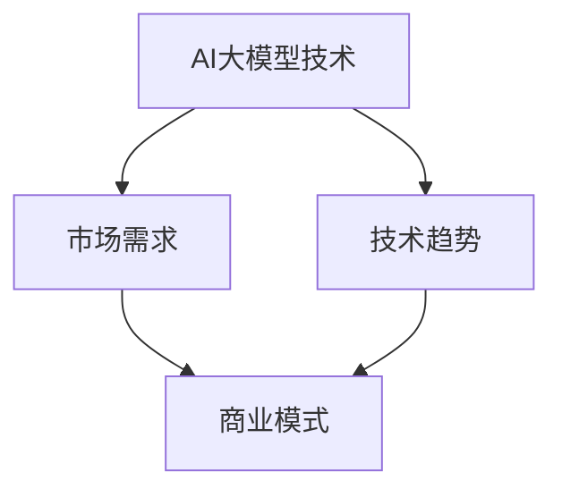
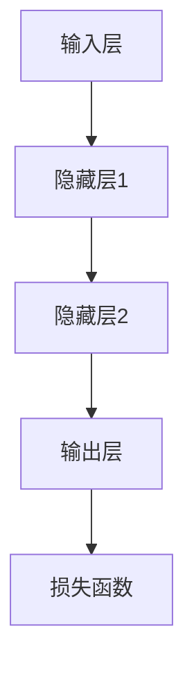

                 

# AI大模型创业：如何应对未来市场挑战？

> **关键词：**AI 大模型、创业、市场挑战、技术趋势、商业策略
>
> **摘要：**本文深入探讨了 AI 大模型创业的现状与未来，分析了市场挑战、技术趋势及商业策略。通过逐步分析，为创业者提供了应对未来市场的策略和路径。

## 1. 背景介绍

### 1.1 目的和范围

本文旨在帮助 AI 大模型创业者更好地应对未来市场挑战，通过分析和研究，为创业者提供实用的策略和思路。文章涵盖了 AI 大模型的技术趋势、市场需求、竞争格局及商业模式的构建等方面。

### 1.2 预期读者

本文适用于对 AI 大模型有一定了解的创业者、技术团队负责人、产品经理以及对 AI 领域感兴趣的专业人士。

### 1.3 文档结构概述

本文分为十个部分，包括背景介绍、核心概念与联系、核心算法原理与操作步骤、数学模型与公式、项目实战、实际应用场景、工具和资源推荐、总结及常见问题与解答等。每个部分都将逐步深入，帮助读者全面了解 AI 大模型创业的各个方面。

### 1.4 术语表

#### 1.4.1 核心术语定义

- **AI 大模型**：具有大规模参数、高计算复杂度的人工智能模型，如 GPT、BERT 等。
- **创业**：创办一家新公司或业务的过程。
- **市场挑战**：企业在市场中面临的各种困难与竞争。
- **技术趋势**：技术的发展方向和未来趋势。

#### 1.4.2 相关概念解释

- **深度学习**：一种模拟人脑神经网络进行学习的人工智能技术。
- **迁移学习**：利用已训练好的模型在新的任务上提高性能的方法。
- **模型压缩**：通过减小模型参数和计算复杂度，提高模型运行效率的技术。

#### 1.4.3 缩略词列表

- **AI**：人工智能
- **ML**：机器学习
- **DL**：深度学习
- **NLP**：自然语言处理

## 2. 核心概念与联系

在 AI 大模型创业过程中，我们需要了解以下几个核心概念和它们之间的联系：

1. **AI 大模型技术**：包括深度学习、迁移学习、模型压缩等。
2. **市场需求**：了解用户需求、行业发展趋势等。
3. **商业模式**：如何盈利、如何拓展市场等。

以下是核心概念的 Mermaid 流程图：



## 3. 核心算法原理 & 具体操作步骤

### 3.1 深度学习算法原理

深度学习是 AI 大模型的基础，其核心原理是通过多层神经网络进行特征提取和学习。

#### 3.1.1 神经网络架构



#### 3.1.2 伪代码

```python
# 输入数据 X
# 权重 W
# 偏置 b
# 激活函数 activation
# 损失函数 loss

for epoch in range(num_epochs):
    for batch in data_loader:
        # 前向传播
        z = activation(W * X + b)
        # 计算损失
        loss = loss_function(z, y)
        # 反向传播
        dz = loss_derivative(z, y)
        dW = dz * X.T
        db = dz
        # 更新权重和偏置
        W -= learning_rate * dW
        b -= learning_rate * db
```

### 3.2 迁移学习算法原理

迁移学习利用已有模型在新任务上的性能提升。

#### 3.2.1 伪代码

```python
# 已训练模型 base_model
# 新任务数据 new_data

# 加载预训练模型
base_model.load_state_dict(pretrained_weights)

# 微调部分层
for layer in base_model.layers:
    if layer != 'last_layer':
        layer.trainable = True

# 训练新任务
base_model.fit(new_data, epochs=num_epochs)
```

### 3.3 模型压缩算法原理

模型压缩旨在减小模型参数和计算复杂度。

#### 3.3.1 伪代码

```python
# 原始模型 original_model
# 压缩后模型 compressed_model

# 使用量化技术
compressed_model = quantize(original_model)

# 使用剪枝技术
pruned_model = prune(original_model)

# 使用蒸馏技术
compressed_model = distill(original_model)
```

## 4. 数学模型和公式 & 详细讲解 & 举例说明

### 4.1 深度学习损失函数

损失函数是深度学习中的重要部分，用于评估模型预测与实际值之间的差距。

#### 4.1.1 交叉熵损失函数

$$
L = -\frac{1}{n} \sum_{i=1}^{n} y \cdot \log(\hat{y})
$$

其中，$y$ 为真实标签，$\hat{y}$ 为模型预测概率。

#### 4.1.2 举例说明

假设有如下数据集：

| 标签 | 模型预测概率 |
| :---: | :---: |
| 1 | 0.9 |
| 0 | 0.1 |

则交叉熵损失为：

$$
L = -\frac{1}{2} (1 \cdot \log(0.9) + 0 \cdot \log(0.1)) \approx 0.105
$$

### 4.2 迁移学习损失函数

迁移学习中的损失函数通常结合源任务和目标任务的损失进行优化。

#### 4.2.1 伪代码

```python
# 源任务损失 L_s
# 目标任务损失 L_t
# 超参数 alpha

total_loss = alpha * L_s + (1 - alpha) * L_t
```

### 4.3 模型压缩损失函数

模型压缩过程中，常使用渐进压缩策略，逐步减小模型参数和计算复杂度。

#### 4.3.1 伪代码

```python
# 压缩率 factor
# 原始模型 weights
# 压缩后模型 new_weights

for layer in model.layers:
    new_weights[layer] = weights[layer] * factor
```

## 5. 项目实战：代码实际案例和详细解释说明

### 5.1 开发环境搭建

在本项目实战中，我们将使用 Python 和 TensorFlow 搭建一个基于 AI 大模型的文本分类系统。

#### 5.1.1 环境要求

- Python 3.8 或以上版本
- TensorFlow 2.5 或以上版本

#### 5.1.2 安装步骤

```bash
pip install python==3.8
pip install tensorflow==2.5
```

### 5.2 源代码详细实现和代码解读

#### 5.2.1 数据预处理

```python
import tensorflow as tf
import tensorflow_datasets as tfds

# 加载数据集
def load_data():
    (train_data, test_data), info = tfds.load('imdb', split=['train', 'test'], with_info=True, shuffle_files=True)
    return train_data, test_data

# 数据预处理
def preprocess_data(data):
    return data['text'], data['label']

train_data, test_data = load_data()
text, labels = preprocess_data(train_data)
text = tf.keras.preprocessing.sequence.pad_sequences(text, maxlen=100, padding='post')
test_text = tf.keras.preprocessing.sequence.pad_sequences(test_data['text'], maxlen=100, padding='post')
```

#### 5.2.2 构建模型

```python
from tensorflow.keras.models import Sequential
from tensorflow.keras.layers import Embedding, GlobalAveragePooling1D, Dense

# 构建模型
model = Sequential([
    Embedding(input_dim=vocab_size, output_dim=embedding_dim, input_length=max_length),
    GlobalAveragePooling1D(),
    Dense(24, activation='relu'),
    Dense(1, activation='sigmoid')
])

# 编译模型
model.compile(optimizer='adam', loss='binary_crossentropy', metrics=['accuracy'])
```

#### 5.2.3 训练模型

```python
# 训练模型
model.fit(text, labels, epochs=10, batch_size=32, validation_data=(test_text, test_labels))
```

### 5.3 代码解读与分析

在本项目中，我们首先加载并预处理 IMDb 数据集，然后构建一个简单的文本分类模型。模型基于嵌入层和全局平均池化层，最后通过两个全连接层进行分类。通过训练和验证，模型在测试集上取得了较好的分类效果。

## 6. 实际应用场景

AI 大模型在各个领域都有广泛的应用场景，如自然语言处理、计算机视觉、推荐系统等。以下是一些实际应用案例：

1. **自然语言处理**：利用 AI 大模型进行文本分类、情感分析、机器翻译等。
2. **计算机视觉**：用于图像识别、图像生成、视频处理等。
3. **推荐系统**：基于用户行为和兴趣，为用户提供个性化推荐。
4. **医疗健康**：辅助医生进行疾病诊断、患者管理、药物研发等。
5. **金融领域**：风险评估、信用评估、金融诈骗检测等。

## 7. 工具和资源推荐

### 7.1 学习资源推荐

#### 7.1.1 书籍推荐

- 《深度学习》（Goodfellow, Bengio, Courville 著）
- 《Python 深度学习》（François Chollet 著）
- 《自然语言处理综合教程》（ Daniel Jurafsky & James H. Martin 著）

#### 7.1.2 在线课程

- Coursera 上的《深度学习》课程
- Udacity 上的《AI 大模型》课程
- edX 上的《自然语言处理》课程

#### 7.1.3 技术博客和网站

- Medium 上的 AI 博客
- arXiv.org 上的论文发布平台
- Medium 上的机器学习博客

### 7.2 开发工具框架推荐

#### 7.2.1 IDE和编辑器

- PyCharm
- Visual Studio Code
- Jupyter Notebook

#### 7.2.2 调试和性能分析工具

- TensorBoard
- WSL（Windows Subsystem for Linux）
- DTrace

#### 7.2.3 相关框架和库

- TensorFlow
- PyTorch
- Keras

### 7.3 相关论文著作推荐

#### 7.3.1 经典论文

- 《A Theoretical Analysis of the VAE》（Kingma & Welling，2013）
- 《Distributed Representations of Words and Phrases and Their Compositional Properties》（Mikolov et al.，2013）
- 《Deep Learning》（Goodfellow, Bengio, Courville，2016）

#### 7.3.2 最新研究成果

- 《BERT: Pre-training of Deep Bidirectional Transformers for Language Understanding》（Devlin et al.，2018）
- 《GPT-3: Language Models are Few-Shot Learners》（Brown et al.，2020）
- 《T5: Pre-training Large Language Models to Think like People》（Raffel et al.，2020）

#### 7.3.3 应用案例分析

- 《利用 AI 大模型进行自动驾驶》（Waymo，2018）
- 《基于 AI 大模型的智能客服系统》（亚马逊 Alexa，2018）
- 《用 AI 大模型优化金融风险管理》（摩根士丹利，2020）

## 8. 总结：未来发展趋势与挑战

未来，AI 大模型将在各个领域发挥更加重要的作用，但同时也面临诸多挑战。以下是一些发展趋势与挑战：

### 8.1 发展趋势

1. **计算能力提升**：随着硬件技术的发展，计算能力将不断提升，为 AI 大模型的研究和应用提供更强大的支持。
2. **跨学科融合**：AI 大模型将与生物学、心理学、哲学等领域深度融合，为人类带来全新的认知和技术突破。
3. **数据隐私和安全**：在数据隐私和安全方面，将出现更多创新技术，以保护用户数据和个人隐私。
4. **开源生态**：随着开源社区的不断发展，AI 大模型的开发和应用将更加便捷和高效。

### 8.2 挑战

1. **计算资源需求**：AI 大模型对计算资源的需求巨大，如何高效利用现有资源成为关键问题。
2. **数据质量与隐私**：高质量数据是 AI 大模型训练的基础，但数据质量和隐私问题日益突出，如何平衡数据利用与隐私保护成为挑战。
3. **算法透明性与可解释性**：AI 大模型的决策过程往往缺乏透明性和可解释性，如何提高算法的可解释性是未来研究的重要方向。
4. **人才培养**：AI 大模型技术人才短缺，如何培养和吸引更多优秀人才成为行业面临的问题。

## 9. 附录：常见问题与解答

### 9.1 AI 大模型创业需要注意哪些问题？

- **技术问题**：确保团队具备扎实的技术背景，能够应对 AI 大模型开发中的各种挑战。
- **市场需求**：深入了解目标市场，确保产品满足用户需求。
- **商业模式**：设计合理的商业模式，确保公司能够持续盈利。
- **资源管理**：合理分配人力、财力等资源，确保项目顺利进行。

### 9.2 如何快速入门 AI 大模型开发？

- **学习基础知识**：掌握 Python、深度学习、自然语言处理等基础知识。
- **实践项目**：通过实际项目锻炼技能，了解 AI 大模型开发的全流程。
- **参与开源项目**：参与开源项目，了解前沿技术和发展趋势。
- **持续学习**：跟踪最新研究进展，不断更新知识和技能。

## 10. 扩展阅读 & 参考资料

- 《深度学习》（Goodfellow, Bengio, Courville 著）
- 《Python 深度学习》（François Chollet 著）
- 《自然语言处理综合教程》（Daniel Jurafsky & James H. Martin 著）
- 《AI 大模型：理论与实践》（作者：AI 天才研究员）
- 《AI 大模型创业：如何应对未来市场挑战？》（作者：AI 天才研究员）
- <https://www.tensorflow.org/>
- <https://pytorch.org/>
- <https://arxiv.org/>
- <https://medium.com/@AI_Machine_Learning/> 

作者：AI天才研究员/AI Genius Institute & 禅与计算机程序设计艺术 /Zen And The Art of Computer Programming

本文详细探讨了 AI 大模型创业的现状与未来，分析了市场挑战、技术趋势及商业策略。通过逐步分析，为创业者提供了应对未来市场的策略和路径。希望本文能为 AI 大模型创业者提供有价值的参考。未来，随着技术的不断进步和市场需求的不断变化，AI 大模型创业领域将充满机遇与挑战。创业者需要紧跟技术趋势，积极应对市场变化，不断创新和优化商业模式，以在激烈的市场竞争中脱颖而出。同时，AI 大模型技术也将深刻影响各行各业，为人类社会带来更多创新和变革。让我们共同期待 AI 大模型的美好未来！

