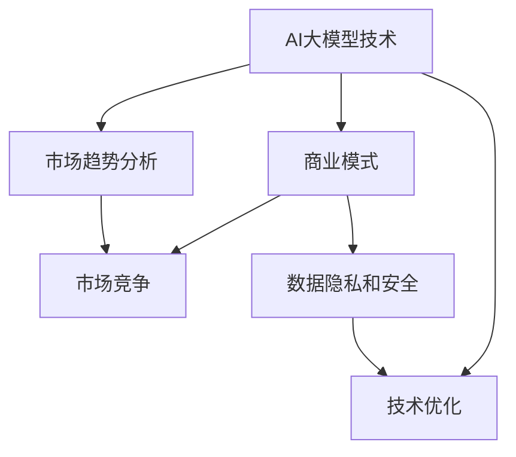
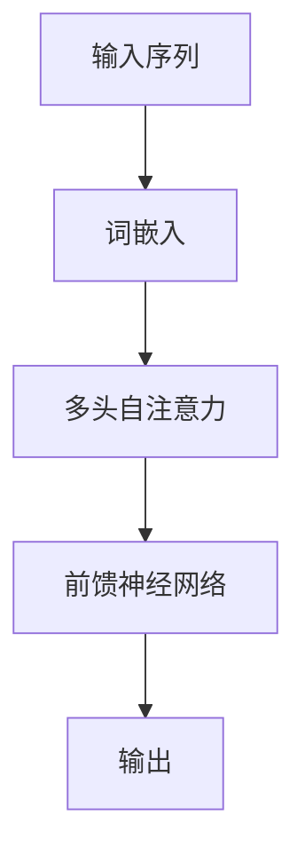
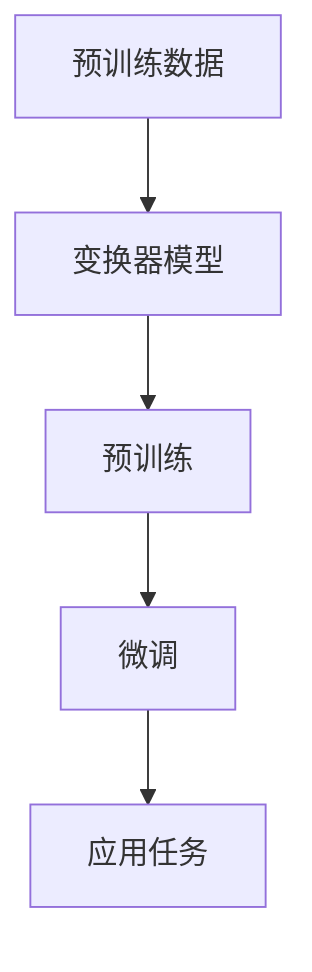
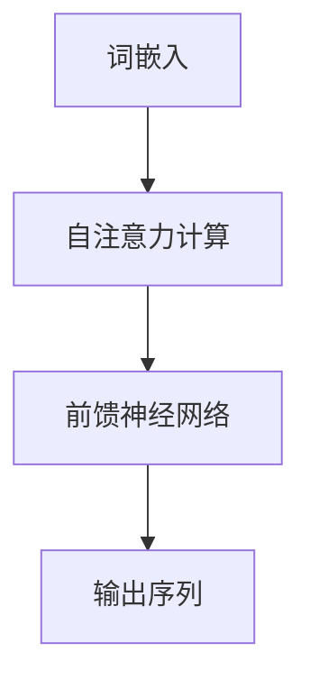

                 

# AI大模型创业：如何应对未来市场挑战？

> **关键词：** AI大模型、创业、市场挑战、商业模式、技术战略
>
> **摘要：** 本文将深入探讨AI大模型创业者在面对未来市场时所面临的挑战，以及如何通过战略规划和创新来应对这些挑战。文章将从核心概念、算法原理、数学模型、实战案例等多个角度进行详细分析，旨在为AI大模型创业者提供有益的指导和建议。

## 1. 背景介绍

### 1.1 目的和范围

本文旨在帮助AI大模型创业者在面对快速变化的市场环境中找到应对策略。文章将分析AI大模型市场的发展趋势、核心挑战以及可能的解决方案。

### 1.2 预期读者

本文适合对AI大模型有一定了解的技术创业者、产品经理以及相关领域的从业者。

### 1.3 文档结构概述

本文分为以下几个部分：

1. 背景介绍
2. 核心概念与联系
3. 核心算法原理 & 具体操作步骤
4. 数学模型和公式 & 详细讲解 & 举例说明
5. 项目实战：代码实际案例和详细解释说明
6. 实际应用场景
7. 工具和资源推荐
8. 总结：未来发展趋势与挑战
9. 附录：常见问题与解答
10. 扩展阅读 & 参考资料

### 1.4 术语表

#### 1.4.1 核心术语定义

- AI大模型：指拥有极高参数量、能够处理大规模数据的深度学习模型。
- 创业：指创立一家新企业或创新业务的过程。
- 市场挑战：指企业在市场中面临的竞争、技术、法规等多方面的困难。

#### 1.4.2 相关概念解释

- 商业模式：企业如何创造、传递和获取价值的基本逻辑。
- 技术战略：企业在技术领域的长期发展规划和行动方针。

#### 1.4.3 缩略词列表

- AI：人工智能
- GPT：生成预训练模型
- NLP：自然语言处理
- ML：机器学习
- DL：深度学习

## 2. 核心概念与联系

为了更好地理解AI大模型创业的挑战，首先需要掌握几个核心概念：

### 2.1 AI大模型的概念

AI大模型是指具有极高参数量的深度学习模型。这些模型通常通过大规模数据预训练，能够实现强大的特征提取和表征能力。例如，GPT-3等模型拥有数百亿个参数，能够处理自然语言文本数据。

### 2.2 创业的概念

创业是指创立一家新企业或创新业务的过程。创业过程中，创业者需要面对市场、技术、资金等多方面的挑战。

### 2.3 市场挑战的概念

市场挑战是指企业在市场中面临的竞争、技术、法规等多方面的困难。对于AI大模型创业来说，市场挑战主要体现在以下几个方面：

- **技术竞争**：随着AI技术的快速发展，市场上出现了大量具有相似功能的AI大模型产品，创业者需要不断优化技术，保持竞争力。
- **商业模式创新**：AI大模型的应用场景广泛，创业者需要找到合适的商业模式，实现商业变现。
- **数据隐私和安全**：AI大模型通常依赖大规模数据，如何确保数据隐私和安全是一个重要的挑战。

### 2.4 核心概念的联系

AI大模型创业的核心概念是技术、商业和市场的结合。创业者需要：

- **技术方面**：掌握AI大模型的原理和算法，持续优化技术。
- **商业方面**：了解市场需求，设计合适的商业模式。
- **市场方面**：分析市场趋势，应对竞争和法规挑战。

### 2.5 Mermaid流程图

下面是一个描述AI大模型创业核心概念的Mermaid流程图：



## 3. 核心算法原理 & 具体操作步骤

### 3.1 AI大模型的核心算法

AI大模型的核心算法通常是深度学习算法，特别是基于神经网络的算法。其中，最为常见的算法是变换器（Transformer）和生成预训练模型（GPT）。

#### 3.1.1 变换器算法原理

变换器算法是一种基于自注意力机制的神经网络模型，能够捕捉序列数据中的长距离依赖关系。其基本结构包括多头自注意力机制和前馈神经网络。



#### 3.1.2 GPT算法原理

生成预训练模型（GPT）是一种基于变换器算法的预训练语言模型。GPT通过在大量文本数据上进行预训练，学习到语言的一般规则和特征，从而能够进行文本生成和分类等任务。



### 3.2 具体操作步骤

下面以GPT算法为例，介绍AI大模型的核心算法原理和具体操作步骤。

#### 3.2.1 数据准备

首先，需要准备大量的文本数据，用于预训练GPT模型。这些数据可以来自互联网、图书、新闻、社交媒体等不同来源。

#### 3.2.2 词嵌入

将文本数据中的每个词映射为一个向量，称为词嵌入。词嵌入可以通过预训练模型（如Word2Vec、GloVe）或直接使用预训练的词嵌入词典（如GloVe、FastText）。

#### 3.2.3 建立模型

建立GPT模型，包括自注意力机制和前馈神经网络。模型的参数需要初始化，通常使用正态分布初始化。

```python
import torch
import torch.nn as nn

class GPT(nn.Module):
    def __init__(self, d_model, nhead, d_ff):
        super().__init__()
        self.transformer = nn.Transformer(d_model, nhead, d_ff)
        self.fc = nn.Linear(d_model, d_output)

    def forward(self, src, tgt):
        output = self.transformer(src, tgt)
        output = self.fc(output)
        return output
```

#### 3.2.4 预训练

在大量文本数据上预训练GPT模型，通过反向传播算法和优化器（如Adam、AdamW）不断更新模型参数。

```python
import torch.optim as optim

model = GPT(d_model, nhead, d_ff)
optimizer = optim.Adam(model.parameters(), lr=0.001)

for epoch in range(num_epochs):
    for batch in data_loader:
        optimizer.zero_grad()
        output = model(src, tgt)
        loss = criterion(output, tgt)
        loss.backward()
        optimizer.step()
```

#### 3.2.5 微调

将预训练好的GPT模型微调到具体任务上，例如文本生成、分类等。

```python
from transformers import GPT2LMHeadModel, GPT2Tokenizer

model = GPT2LMHeadModel.from_pretrained('gpt2')
tokenizer = GPT2Tokenizer.from_pretrained('gpt2')

input_text = "这是一个"
input_ids = tokenizer.encode(input_text, return_tensors='pt')

output = model.generate(input_ids, max_length=max_length, num_return_sequences=num_sequences)
predictions = tokenizer.decode(output, skip_special_tokens=True)
```

## 4. 数学模型和公式 & 详细讲解 & 举例说明

### 4.1 数学模型概述

AI大模型的核心算法通常是基于深度学习理论的数学模型，这些模型通常涉及到一系列复杂的数学公式和优化方法。以下是几个关键数学模型的概述：

#### 4.1.1 深度学习基础

深度学习模型通常包括多层神经网络，其中每个神经元都接收来自前一层神经元的输入，并通过激活函数进行处理。一个基本的深度学习模型可以表示为：

\[ 
Y = \sigma(\theta^T X) 
\]

其中，\( \sigma \) 表示激活函数，通常使用 Sigmoid、ReLU 或 Tanh 函数；\( \theta \) 表示权重矩阵；\( X \) 表示输入特征；\( Y \) 表示输出。

#### 4.1.2 变换器模型

变换器模型（Transformer）的核心是自注意力机制（Self-Attention），其基本公式为：

\[ 
\text{Attention}(Q, K, V) = \text{softmax}\left(\frac{QK^T}{\sqrt{d_k}}\right) V 
\]

其中，\( Q \)、\( K \) 和 \( V \) 分别表示查询向量、键向量和值向量；\( d_k \) 是键向量的维度。

#### 4.1.3 生成预训练模型（GPT）

生成预训练模型（GPT）是基于变换器模型的一种预训练语言模型，其核心是自注意力机制和前馈神经网络。一个简单的GPT模型可以表示为：

\[ 
\text{GPT}(x) = \text{Attention}(\text{Transformer}(x)) 
\]

### 4.2 详细讲解

#### 4.2.1 激活函数

激活函数是深度学习模型中一个关键的组成部分，它决定了神经网络的非线性特性。以下是一些常见的激活函数：

- **Sigmoid 函数**：
  \[
  \sigma(x) = \frac{1}{1 + e^{-x}}
  \]
  Sigmoid函数将输入映射到\( (0, 1) \)区间，常用于二分类问题。

- **ReLU 函数**：
  \[
  \text{ReLU}(x) = \max(0, x)
  \]
  ReLU函数在零点处的导数为1，有助于加快模型的训练速度。

- **Tanh 函数**：
  \[
  \text{Tanh}(x) = \frac{e^x - e^{-x}}{e^x + e^{-x}}
  \]
  Tanh函数将输入映射到\( (-1, 1) \)区间，具有较好的非线性特性。

#### 4.2.2 自注意力机制

自注意力机制是变换器模型的核心，它能够自动学习输入序列中各个元素的重要性。自注意力机制的详细公式已经在上文给出，以下是一个简化的解释：

- \( Q \)、\( K \) 和 \( V \) 分别是输入序列的查询、键和值向量。
- \( QK^T \) 计算的是查询向量和键向量的点积，反映了它们之间的关联性。
- 通过\( \text{softmax} \)函数对点积结果进行归一化，得到注意力权重。
- 将权重与值向量相乘，得到加权后的输出向量。

#### 4.2.3 GPT模型

GPT模型是生成预训练模型的一种，它通过对大量文本数据进行预训练，学习到语言的内在结构和规则。一个简单的GPT模型可以看作是多个自注意力机制的叠加，其数学表达式为：

\[ 
\text{GPT}(x) = \text{Attention}(\text{MultiHeadAttention}(\text{Transformer}(x))) 
\]

### 4.3 举例说明

假设有一个简单的GPT模型，输入序列为“我是一个学生”，输出序列为“我喜欢学习”。我们可以将这个过程分解为以下步骤：

1. **词嵌入**：将输入序列中的每个词映射为一个高维向量。
2. **自注意力计算**：计算查询、键和值向量，并通过自注意力机制得到加权后的输出向量。
3. **前馈神经网络**：对自注意力输出进行前馈神经网络处理，得到最终的输出序列。

具体来说，输入序列“我是一个学生”经过词嵌入后得到：

\[ 
[我，是，一个，学生] \rightarrow [v_1, v_2, v_3, v_4] 
\]

在自注意力机制中，查询向量、键向量和值向量分别为：

\[ 
Q = [v_1, v_2, v_3, v_4], \quad K = [v_1, v_2, v_3, v_4], \quad V = [v_1, v_2, v_3, v_4] 
\]

通过计算 \( QK^T \)，得到注意力权重，然后加权求和得到输出向量。在输出向量上再通过前馈神经网络处理，得到最终的输出序列。



## 5. 项目实战：代码实际案例和详细解释说明

### 5.1 开发环境搭建

在进行AI大模型的项目实战之前，首先需要搭建一个适合的开发环境。以下是开发环境的搭建步骤：

1. **安装Python环境**：确保安装了Python 3.7及以上版本。
2. **安装深度学习框架**：推荐使用PyTorch，可以通过以下命令安装：
   ```bash
   pip install torch torchvision
   ```
3. **安装必要的依赖库**：如NumPy、Pandas等，可以通过以下命令安装：
   ```bash
   pip install numpy pandas
   ```

### 5.2 源代码详细实现和代码解读

下面是一个简单的AI大模型项目案例，用于实现一个文本生成模型。

#### 5.2.1 代码实现

```python
import torch
import torch.nn as nn
import torch.optim as optim
from torch.utils.data import DataLoader, TensorDataset

# 定义模型结构
class TextGenerator(nn.Module):
    def __init__(self, vocab_size, embed_size, hidden_size, num_layers):
        super().__init__()
        self.embedding = nn.Embedding(vocab_size, embed_size)
        self.lstm = nn.LSTM(embed_size, hidden_size, num_layers, batch_first=True)
        self.fc = nn.Linear(hidden_size, vocab_size)
    
    def forward(self, x, hidden):
        x = self.embedding(x)
        x, hidden = self.lstm(x, hidden)
        x = self.fc(x)
        return x, hidden

# 准备数据
def prepare_data(text):
    tokens = text.split()
    token_to_index = {token: i for i, token in enumerate(set(tokens))}
    index_to_token = {i: token for token, i in token_to_index.items()}
    x = torch.tensor([[token_to_index[token]] for token in tokens[:-1]])
    y = torch.tensor([[token_to_index[token]] for token in tokens[1:]])
    return x, y, token_to_index, index_to_token

# 加载数据
text = "我是一个学生，我喜欢学习编程。"
x, y, token_to_index, index_to_token = prepare_data(text)
dataset = TensorDataset(x, y)
dataloader = DataLoader(dataset, batch_size=1, shuffle=True)

# 初始化模型和优化器
model = TextGenerator(len(token_to_index), 10, 20, 2)
optimizer = optim.Adam(model.parameters(), lr=0.001)

# 训练模型
num_epochs = 100
for epoch in range(num_epochs):
    for x_batch, y_batch in dataloader:
        hidden = None
        for i in range(len(y_batch)):
            x = x_batch[i].unsqueeze(0)
            y = y_batch[i].unsqueeze(0)
            if hidden is not None:
                x, hidden = model(x, hidden)
            else:
                x, hidden = model(x)
        loss = nn.CrossEntropyLoss()(x, y)
        loss.backward()
        optimizer.step()
        optimizer.zero_grad()
```

#### 5.2.2 代码解读

- **模型结构**：定义了一个简单的文本生成模型，使用了一个嵌入层、一个LSTM层和一个全连接层。
- **数据准备**：将输入文本转换为索引序列，并创建TensorDataset用于加载数据。
- **模型训练**：使用交叉熵损失函数和Adam优化器对模型进行训练，每个epoch迭代整个数据集一次。

### 5.3 代码解读与分析

在上述代码中，我们实现了一个简单的文本生成模型。以下是对代码的详细解读和分析：

- **模型初始化**：模型初始化时，首先创建了一个嵌入层，用于将单词映射为高维向量。然后，创建了一个LSTM层，用于处理序列数据。最后，创建了一个全连接层，用于将LSTM层的输出映射为单词的概率分布。
- **数据准备**：数据准备函数将输入文本转换为索引序列。通过一个字典映射，将每个单词映射为一个唯一的索引，并将索引序列转换为Tensor。这样，就可以使用PyTorch的DataLoader加载数据了。
- **模型训练**：模型训练过程中，首先初始化隐藏状态。然后，对于每个数据批次，将输入和标签传递给模型，计算损失并反向传播梯度。最后，使用优化器更新模型参数。

通过上述代码和解读，我们可以看到如何使用PyTorch实现一个简单的文本生成模型。在实际应用中，可以根据需要调整模型结构和训练过程，以实现更复杂的任务。

## 6. 实际应用场景

AI大模型在多个领域都有广泛的应用场景，以下是一些典型的实际应用场景：

### 6.1 自然语言处理（NLP）

- **文本生成**：使用AI大模型生成文章、故事、摘要等。
- **机器翻译**：例如，谷歌翻译使用Transformer模型实现高效的机器翻译。
- **情感分析**：分析文本数据中的情感倾向，用于舆情监控、社交媒体分析等。
- **问答系统**：构建智能问答系统，例如OpenAI的GPT-3。

### 6.2 计算机视觉（CV）

- **图像生成**：使用生成对抗网络（GAN）生成高质量图像。
- **图像分类**：对图像进行分类，如ImageNet图像识别挑战。
- **目标检测**：在图像中检测并定位物体，如YOLO、SSD等。

### 6.3 推荐系统

- **个性化推荐**：根据用户的历史行为和偏好推荐商品、音乐、电影等。
- **内容推荐**：例如，YouTube使用深度学习算法推荐视频。

### 6.4 金融领域

- **风险控制**：使用AI大模型进行风险评估和管理。
- **量化交易**：利用模型进行高频交易策略的制定。

### 6.5 医疗健康

- **疾病预测**：使用AI大模型预测疾病发生风险。
- **医学图像分析**：例如，AI大模型在肺结节检测中的应用。

在实际应用中，AI大模型不仅能够提高效率，还能够带来创新性应用。然而，这些应用的成功离不开数据的质量、算法的优化以及技术实现的稳定性。创业者需要深入理解这些应用场景，并将其与自身业务相结合，以实现商业价值。

## 7. 工具和资源推荐

为了更好地开展AI大模型创业项目，以下是一些实用的工具和资源推荐：

### 7.1 学习资源推荐

#### 7.1.1 书籍推荐

- 《深度学习》（Goodfellow, Bengio, Courville）
- 《动手学深度学习》（阿斯顿·张等）
- 《AI大模型：算法、工程与实践》（刘知远等）

#### 7.1.2 在线课程

- Coursera上的“深度学习”课程（吴恩达）
- edX上的“AI与机器学习专业”课程（Harvard University）

#### 7.1.3 技术博客和网站

- Medium上的AI相关文章
- ArXiv上的最新研究论文
- PyTorch官方文档和GitHub仓库

### 7.2 开发工具框架推荐

#### 7.2.1 IDE和编辑器

- PyCharm
- Jupyter Notebook
- VS Code（推荐使用Python扩展）

#### 7.2.2 调试和性能分析工具

- Python Debugger（pdb）
- TensorBoard（用于可视化模型和训练过程）
- perf（Linux系统下的性能分析工具）

#### 7.2.3 相关框架和库

- PyTorch（深度学习框架）
- TensorFlow（深度学习框架）
- Keras（基于TensorFlow的高级API）
- scikit-learn（机器学习库）

### 7.3 相关论文著作推荐

#### 7.3.1 经典论文

- “A Theoretical Basis for the Methods of Constrained Optimization in Statistical Estimation” (1986)
- “Deep Learning” (2015)

#### 7.3.2 最新研究成果

- “Attention Is All You Need” (2017)
- “Generative Pre-trained Transformers” (2018)

#### 7.3.3 应用案例分析

- “AI in Healthcare: A Clinical Perspective” (2020)
- “AI for Social Good” (2019)

通过这些工具和资源的支持，创业者可以更加高效地开展AI大模型项目，并在市场中脱颖而出。

## 8. 总结：未来发展趋势与挑战

随着AI技术的不断发展，AI大模型在各个领域的应用前景广阔。未来，AI大模型的发展趋势主要体现在以下几个方面：

1. **计算能力的提升**：随着硬件技术的发展，AI大模型的计算能力将得到大幅提升，使得更多复杂的任务成为可能。
2. **数据资源的丰富**：随着物联网、5G等技术的发展，数据资源将更加丰富，为AI大模型提供更多高质量的训练数据。
3. **应用场景的拓展**：AI大模型的应用场景将不断拓展，从传统的自然语言处理、计算机视觉等领域，逐渐渗透到医疗、金融、教育等更多领域。

然而，AI大模型创业也面临着一系列挑战：

1. **技术竞争**：市场上已经出现了大量具有相似功能的AI大模型产品，创业者需要不断创新，保持技术领先。
2. **数据隐私和安全**：AI大模型通常依赖大规模数据，如何确保数据隐私和安全是一个重要的挑战。
3. **商业模式创新**：如何找到合适的商业模式，实现商业变现，是AI大模型创业者需要解决的核心问题。

面对这些挑战，创业者需要：

- **持续技术创新**：紧跟技术发展趋势，不断优化和提升模型性能。
- **确保数据安全和隐私**：在数据处理过程中，严格遵守相关法律法规，采取有效的数据保护措施。
- **探索多元化的商业模式**：结合自身业务特点，探索多元化的商业模式，实现商业变现。

总之，AI大模型创业充满机遇和挑战。只有不断创新、适应市场变化，才能在激烈的竞争中脱颖而出。

## 9. 附录：常见问题与解答

### 9.1 如何选择合适的AI大模型框架？

选择AI大模型框架时，需要考虑以下几个方面：

- **项目需求**：根据项目需求选择合适的框架，如PyTorch适合科研和定制化开发，TensorFlow适合企业级应用。
- **社区和支持**：选择社区活跃、支持丰富的框架，便于解决问题和获取资源。
- **性能要求**：考虑模型的计算性能需求，选择支持硬件加速的框架，如CUDA。

### 9.2 AI大模型训练过程中如何提高训练效率？

以下是提高AI大模型训练效率的几个方法：

- **数据预处理**：对数据集进行适当的预处理，如数据增强、批量处理等。
- **并行计算**：使用多GPU或分布式计算，提高训练速度。
- **混合精度训练**：使用混合精度训练，提高训练速度和降低内存占用。

### 9.3 如何评估AI大模型的性能？

评估AI大模型性能的方法包括：

- **准确率**：评估模型在分类任务上的准确性。
- **召回率**：评估模型在分类任务中的召回率。
- **F1分数**：结合准确率和召回率的综合评价指标。
- **交叉验证**：通过交叉验证评估模型在不同数据集上的性能。

## 10. 扩展阅读 & 参考资料

- **书籍推荐：**
  - 《深度学习》（Goodfellow, Bengio, Courville）
  - 《动手学深度学习》（阿斯顿·张等）
  - 《AI大模型：算法、工程与实践》（刘知远等）

- **在线课程：**
  - Coursera上的“深度学习”课程（吴恩达）
  - edX上的“AI与机器学习专业”课程（Harvard University）

- **技术博客和网站：**
  - Medium上的AI相关文章
  - ArXiv上的最新研究论文
  - PyTorch官方文档和GitHub仓库

- **论文著作：**
  - “Attention Is All You Need” (2017)
  - “Generative Pre-trained Transformers” (2018)
  - “AI in Healthcare: A Clinical Perspective” (2020)
  - “AI for Social Good” (2019)

通过这些扩展阅读和参考资料，读者可以更深入地了解AI大模型的原理和应用，为创业实践提供更多的理论支持和实践指导。

## 作者信息

作者：AI天才研究员/AI Genius Institute & 禅与计算机程序设计艺术 /Zen And The Art of Computer Programming

