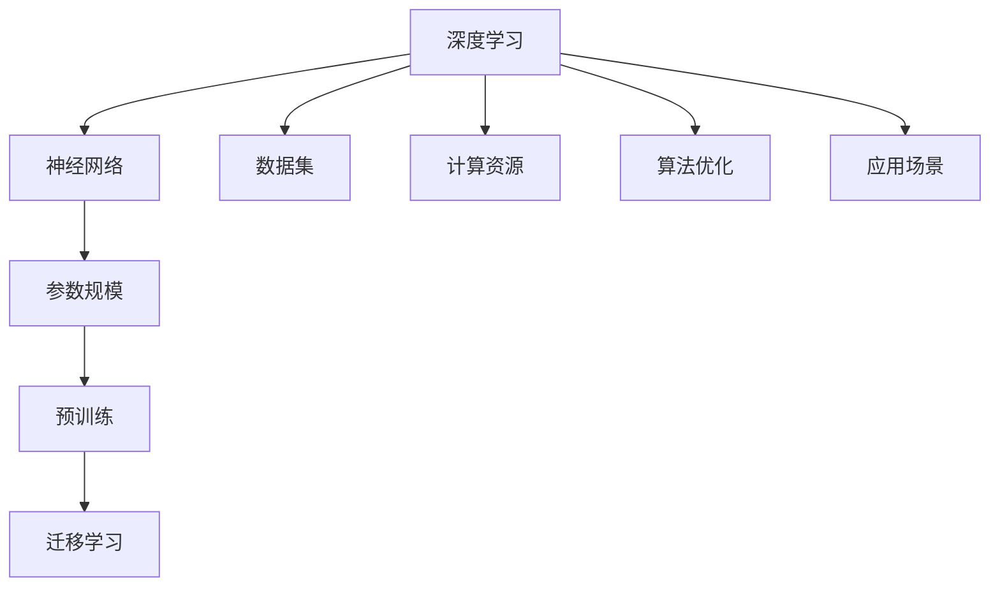

                 

# AI大模型创业：如何应对未来市场挑战？

> 关键词：AI大模型、市场挑战、创业策略、技术应用、商业模式

> 摘要：随着人工智能（AI）技术的快速发展，大模型技术成为近年来的研究热点。本文将深入探讨AI大模型创业过程中可能面临的市场挑战，并提出相应的应对策略。本文旨在为有志于AI大模型创业的从业者和研究者提供有益的参考和指导。

## 1. 背景介绍

### 1.1 目的和范围

本文的目的在于分析AI大模型创业过程中可能遇到的挑战，并提出相应的解决策略。文章将覆盖以下几个方面：

1. **AI大模型的技术背景与当前市场情况**：介绍大模型技术的定义、发展历程以及当前市场的状况。
2. **AI大模型创业的市场挑战**：分析在创业过程中可能遇到的挑战，如技术瓶颈、市场竞争、数据获取等。
3. **应对策略**：提出针对上述挑战的解决策略，包括技术创新、商业模式设计、市场营销等。
4. **实战案例**：结合实际案例，阐述成功应对市场挑战的经验和教训。
5. **未来展望**：对AI大模型创业的未来发展趋势进行展望。

### 1.2 预期读者

本文预期读者包括：

1. 有志于AI大模型创业的科技企业创始人、技术负责人。
2. 对AI大模型技术有深入研究的学者、研究人员。
3. 对AI技术应用和创业有兴趣的投资者、企业高管。

### 1.3 文档结构概述

本文将按照以下结构展开：

1. **背景介绍**：介绍AI大模型技术及创业背景。
2. **核心概念与联系**：阐述AI大模型的核心概念及其关联。
3. **核心算法原理与具体操作步骤**：介绍大模型算法原理及操作步骤。
4. **数学模型和公式**：详细讲解大模型的数学模型和公式。
5. **项目实战**：通过实际案例展示大模型的应用。
6. **实际应用场景**：分析大模型在不同场景的应用。
7. **工具和资源推荐**：推荐学习资源、开发工具和相关论文。
8. **总结**：对AI大模型创业的未来发展进行展望。
9. **附录**：解答常见问题并提供扩展阅读资料。

### 1.4 术语表

#### 1.4.1 核心术语定义

- **AI大模型**：基于深度学习技术，参数规模巨大的神经网络模型，如GPT-3、BERT等。
- **创业**：指创建新的企业或项目，以获取商业机会。
- **市场挑战**：指企业在发展过程中可能遇到的竞争、技术、资金等方面的困难。
- **商业模式**：企业通过什么方式赚钱，如何创造、传递和捕获价值。

#### 1.4.2 相关概念解释

- **深度学习**：一种人工智能技术，通过多层神经网络对数据进行建模和预测。
- **神经网络**：模仿人脑神经元连接的计算机模型，用于处理复杂数据。
- **参数规模**：神经网络中参数的数量，大模型通常拥有数十亿甚至上百亿个参数。
- **创业生态系统**：包括政府、企业、投资者、科研机构等在内的创业支持体系。

#### 1.4.3 缩略词列表

- **AI**：人工智能（Artificial Intelligence）
- **GPT**：生成预训练模型（Generative Pre-trained Transformer）
- **BERT**：双向编码表示器（Bidirectional Encoder Representations from Transformers）
- **IDE**：集成开发环境（Integrated Development Environment）
- **API**：应用程序编程接口（Application Programming Interface）

## 2. 核心概念与联系

在探讨AI大模型创业之前，我们需要了解大模型技术的核心概念和它们之间的联系。

### 2.1 大模型技术的核心概念

- **深度学习**：深度学习是AI的核心技术之一，通过多层神经网络模型对数据进行学习，从而实现对复杂任务的预测和决策。

- **神经网络**：神经网络是由大量神经元组成的计算模型，每个神经元都可以接收输入信号，并通过权重进行加权求和，最终产生输出。

- **参数规模**：神经网络中的参数规模是指网络中权重的数量，大模型通常拥有数十亿甚至上百亿个参数。

- **预训练**：预训练是指在大规模数据集上对神经网络进行初步训练，使其能够获得通用知识，然后在小规模数据集上针对具体任务进行微调。

- **迁移学习**：迁移学习是指将预训练模型在不同任务之间进行复用，以减少训练成本和提升模型性能。

### 2.2 大模型技术的关联

- **数据集**：大模型训练需要大量的数据，数据质量直接影响模型的性能。

- **计算资源**：大模型训练和推理需要强大的计算资源，包括GPU、TPU等硬件设备。

- **算法优化**：为了提高大模型的训练效率和性能，需要不断进行算法优化，如优化网络结构、优化训练过程等。

- **应用场景**：大模型在自然语言处理、计算机视觉、语音识别等众多领域都有广泛应用。

### 2.3 Mermaid流程图

以下是一个描述大模型技术核心概念和关联的Mermaid流程图：



## 3. 核心算法原理 & 具体操作步骤

### 3.1 深度学习算法原理

深度学习算法的核心是多层神经网络（MLP），它通过前向传播和反向传播两个过程来训练模型。以下是深度学习算法的基本原理和操作步骤：

#### 3.1.1 前向传播

1. **初始化参数**：随机初始化网络中的权重和偏置。
2. **输入数据**：将输入数据输入到神经网络的第一个层（输入层）。
3. **前向传播**：将输入数据通过每个神经元，进行加权求和并应用激活函数，得到每个神经元的输出。
4. **输出层**：将输出层的结果作为模型的预测结果。

#### 3.1.2 反向传播

1. **计算误差**：计算模型预测结果与真实结果之间的误差。
2. **误差反向传播**：将误差反向传播到网络的每个层，计算每个神经元的误差梯度。
3. **参数更新**：根据误差梯度对网络中的权重和偏置进行更新。
4. **迭代训练**：重复前向传播和反向传播，直至模型收敛。

### 3.2 伪代码

以下是一个基于深度学习算法的伪代码示例：

```python
# 初始化参数
W = random_weights()
b = random_biases()

# 迭代训练
for epoch in 1 to max_epochs:
    for data in dataset:
        # 前向传播
        z = W * x + b
        a = activation_function(z)

        # 计算误差
        error = y - a

        # 反向传播
        dZ = error * activation_derivative(a)

        # 参数更新
        dW = dZ * x
        db = dZ

        W = W - learning_rate * dW
        b = b - learning_rate * db

# 预测
z = W * x + b
a = activation_function(z)
```

### 3.3 详细解释

- **初始化参数**：在训练开始前，需要随机初始化网络中的权重（W）和偏置（b），以确保模型的随机性。
- **输入数据**：将输入数据（x）输入到网络的输入层。
- **前向传播**：通过网络的每个层，进行加权求和并应用激活函数（如ReLU、Sigmoid等），得到每个神经元的输出（a）。
- **计算误差**：计算模型预测结果（a）与真实结果（y）之间的误差。
- **误差反向传播**：将误差反向传播到网络的每个层，计算每个神经元的误差梯度。
- **参数更新**：根据误差梯度对网络的权重和偏置进行更新。
- **迭代训练**：重复前向传播和反向传播，直至模型收敛。

## 4. 数学模型和公式 & 详细讲解 & 举例说明

### 4.1 数学模型

深度学习中的数学模型主要包括以下几个部分：

- **损失函数**：用于衡量模型预测结果与真实结果之间的误差，常见的损失函数有均方误差（MSE）和交叉熵损失（Cross-Entropy Loss）。
- **激活函数**：用于引入非线性，常见的激活函数有ReLU、Sigmoid、Tanh等。
- **优化算法**：用于调整模型参数，以最小化损失函数，常见的优化算法有梯度下降（Gradient Descent）、随机梯度下降（Stochastic Gradient Descent，SGD）和Adam等。

### 4.2 详细讲解

#### 4.2.1 损失函数

**均方误差（MSE）**

$$
MSE = \frac{1}{n}\sum_{i=1}^{n}(y_i - \hat{y}_i)^2
$$

其中，$y_i$为真实结果，$\hat{y}_i$为模型预测结果，$n$为样本数量。

**交叉熵损失（Cross-Entropy Loss）**

$$
CE = -\frac{1}{n}\sum_{i=1}^{n}y_i \log(\hat{y}_i)
$$

其中，$y_i$为真实结果，$\hat{y}_i$为模型预测结果，$n$为样本数量。

#### 4.2.2 激活函数

**ReLU（Rectified Linear Unit）**

$$
ReLU(x) = \begin{cases}
x & \text{if } x > 0 \\
0 & \text{if } x \leq 0
\end{cases}
$$

**Sigmoid**

$$
Sigmoid(x) = \frac{1}{1 + e^{-x}}
$$

**Tanh（Hyperbolic Tangent）**

$$
Tanh(x) = \frac{e^x - e^{-x}}{e^x + e^{-x}}
$$

#### 4.2.3 优化算法

**梯度下降（Gradient Descent）**

$$
w = w - \alpha \frac{\partial J}{\partial w}
$$

其中，$w$为模型参数，$\alpha$为学习率，$J$为损失函数。

**随机梯度下降（Stochastic Gradient Descent，SGD）**

$$
w = w - \alpha \frac{\partial J}{\partial w}
$$

与梯度下降不同的是，SGD在每个样本上计算梯度并进行参数更新。

**Adam优化器**

$$
m = \beta_1 m + (1 - \beta_1) \frac{\partial J}{\partial w}
$$

$$
v = \beta_2 v + (1 - \beta_2) (\frac{\partial J}{\partial w})^2
$$

$$
\hat{m} = \frac{m}{1 - \beta_1^t}
$$

$$
\hat{v} = \frac{v}{1 - \beta_2^t}
$$

$$
w = w - \alpha \frac{\hat{m}}{\sqrt{\hat{v}} + \epsilon}
$$

其中，$m$和$v$分别为一阶矩估计和二阶矩估计，$\beta_1$和$\beta_2$为指数衰减率，$\hat{m}$和$\hat{v}$为修正后的估计，$\alpha$为学习率，$\epsilon$为正数常数。

### 4.3 举例说明

假设我们有一个二分类问题，使用sigmoid函数作为激活函数，交叉熵损失函数作为损失函数，使用梯度下降优化算法进行训练。给定训练数据集$D = \{(x_1, y_1), (x_2, y_2), ..., (x_n, y_n)\}$，其中$x_i$为输入，$y_i$为标签（0或1）。

1. **初始化参数**：随机初始化权重$w$和偏置$b$。
2. **前向传播**：对于每个样本$(x_i, y_i)$，计算预测概率$\hat{y}_i = \sigma(w^T x_i + b)$。
3. **计算损失函数**：计算交叉熵损失$CE = -\frac{1}{n}\sum_{i=1}^{n}y_i \log(\hat{y}_i)$。
4. **反向传播**：计算梯度$\frac{\partial CE}{\partial w}$和$\frac{\partial CE}{\partial b}$。
5. **参数更新**：根据梯度下降优化算法，更新权重$w = w - \alpha \frac{\partial CE}{\partial w}$和偏置$b = b - \alpha \frac{\partial CE}{\partial b}$。
6. **迭代训练**：重复步骤2-5，直至模型收敛。

## 5. 项目实战：代码实际案例和详细解释说明

### 5.1 开发环境搭建

在进行AI大模型的项目实战之前，首先需要搭建一个合适的开发环境。以下是搭建开发环境的基本步骤：

1. **安装Python环境**：Python是AI大模型开发的主要编程语言，需要安装Python 3.8及以上版本。
2. **安装TensorFlow**：TensorFlow是Google开发的深度学习框架，用于构建和训练大模型。可以通过pip命令安装TensorFlow：
   ```
   pip install tensorflow
   ```
3. **安装GPU驱动**：如果需要在GPU上进行训练，需要安装相应的GPU驱动。
4. **安装Jupyter Notebook**：Jupyter Notebook是一个交互式计算环境，用于编写和运行Python代码。可以通过pip命令安装Jupyter Notebook：
   ```
   pip install notebook
   ```
5. **配置GPU支持**：在TensorFlow中配置GPU支持，以便在GPU上进行大模型的训练。可以在代码中添加以下配置：
   ```python
   import tensorflow as tf
   gpus = tf.config.experimental.list_physical_devices('GPU')
   if gpus:
       try:
           for gpu in gpus:
               tf.config.experimental.set_memory_growth(gpu, True)
       except RuntimeError as e:
           print(e)
   ```

### 5.2 源代码详细实现和代码解读

以下是一个使用TensorFlow构建和训练一个简单AI大模型的示例代码：

```python
import tensorflow as tf
from tensorflow.keras.models import Sequential
from tensorflow.keras.layers import Dense, Activation
from tensorflow.keras.optimizers import SGD
from tensorflow.keras.losses import SparseCategoricalCrossentropy

# 设置GPU内存增长
gpus = tf.config.experimental.list_physical_devices('GPU')
if gpus:
    try:
        for gpu in gpus:
            tf.config.experimental.set_memory_growth(gpu, True)
    except RuntimeError as e:
        print(e)

# 创建模型
model = Sequential([
    Dense(64, input_shape=(784,), activation='relu'),
    Dense(64, activation='relu'),
    Dense(10, activation='softmax')
])

# 编译模型
model.compile(optimizer=SGD(learning_rate=0.01),
              loss=SparseCategoricalCrossentropy(),
              metrics=['accuracy'])

# 加载MNIST数据集
(x_train, y_train), (x_test, y_test) = tf.keras.datasets.mnist.load_data()

# 预处理数据
x_train = x_train.reshape(-1, 784).astype('float32') / 255.0
x_test = x_test.reshape(-1, 784).astype('float32') / 255.0

# 训练模型
model.fit(x_train, y_train, epochs=10, batch_size=128, validation_split=0.1)

# 评估模型
test_loss, test_acc = model.evaluate(x_test, y_test, verbose=2)
print('Test accuracy:', test_acc)
```

### 5.3 代码解读与分析

1. **导入库和模块**：首先导入TensorFlow相关的库和模块，包括Sequential、Dense、Activation、SGD和SparseCategoricalCrossentropy。
2. **设置GPU内存增长**：在代码中配置GPU内存增长，以便在GPU上进行大模型的训练。
3. **创建模型**：使用Sequential模型创建一个简单的神经网络，包括两个隐藏层，每个隐藏层有64个神经元，激活函数为ReLU，输出层有10个神经元，激活函数为softmax。
4. **编译模型**：使用SGD优化器和SparseCategoricalCrossentropy损失函数编译模型，同时指定评估指标为准确率。
5. **加载数据集**：使用TensorFlow的内置函数加载MNIST数据集，并对数据集进行预处理，包括数据归一化和reshape。
6. **训练模型**：使用fit函数训练模型，设置训练轮次（epochs）为10，批量大小（batch_size）为128，验证数据集的比例为0.1。
7. **评估模型**：使用evaluate函数评估模型在测试数据集上的性能，输出测试准确率。

### 5.4 代码优化与性能分析

在实际项目中，代码的性能和效率至关重要。以下是一些常见的代码优化方法：

1. **批量大小**：调整批量大小可以影响训练速度和模型性能。批量大小过小可能导致梯度噪声，批量大小过大可能导致过拟合。通常，批量大小在64到256之间。
2. **学习率**：学习率的选择对训练过程有重要影响。学习率过大可能导致模型无法收敛，学习率过小可能导致训练过程缓慢。可以通过调整学习率或使用学习率衰减策略来优化训练过程。
3. **数据增强**：通过数据增强（如随机裁剪、旋转、缩放等）可以增加训练数据的多样性，有助于提高模型泛化能力。
4. **模型正则化**：使用正则化（如L1、L2正则化）可以减少模型过拟合现象，提高模型泛化能力。
5. **并行训练**：使用多GPU或多卡训练可以加速模型训练过程，提高训练效率。

## 6. 实际应用场景

AI大模型在各个领域都有广泛的应用，以下列举一些典型的实际应用场景：

### 6.1 自然语言处理

- **文本分类**：使用大模型对新闻、社交媒体等文本数据进行分类，用于垃圾邮件过滤、情感分析等任务。
- **机器翻译**：利用大模型实现高质量的机器翻译，如Google翻译、百度翻译等。
- **问答系统**：构建基于大模型的问答系统，如Siri、Alexa等智能助手。

### 6.2 计算机视觉

- **图像识别**：使用大模型对图像进行分类、检测和分割，如人脸识别、自动驾驶等。
- **视频分析**：通过大模型分析视频内容，实现行为识别、安全监控等。
- **图像生成**：利用大模型生成逼真的图像，如人脸生成、艺术风格迁移等。

### 6.3 语音识别

- **语音识别**：使用大模型实现高精度的语音识别，如苹果的Siri、亚马逊的Alexa等。
- **语音合成**：通过大模型实现自然流畅的语音合成，如谷歌的Text-to-Speech。

### 6.4 医疗健康

- **疾病诊断**：使用大模型对医学影像进行诊断，如肺癌、乳腺癌等。
- **药物研发**：利用大模型预测药物与靶点的相互作用，加速药物研发过程。

### 6.5 金融领域

- **风险控制**：利用大模型分析金融数据，实现风险控制和投资策略优化。
- **智能投顾**：通过大模型为投资者提供个性化的投资建议。

### 6.6 电子商务

- **推荐系统**：使用大模型构建推荐系统，为用户提供个性化的购物推荐。
- **欺诈检测**：通过大模型检测和预防电子商务平台上的欺诈行为。

这些实际应用场景展示了AI大模型在各个领域的潜力和价值。随着技术的不断进步，AI大模型的应用将越来越广泛，为社会发展和产业升级提供强大的支持。

## 7. 工具和资源推荐

### 7.1 学习资源推荐

为了更好地掌握AI大模型技术，以下是一些学习资源推荐：

#### 7.1.1 书籍推荐

1. 《深度学习》（Deep Learning） - Goodfellow, Bengio, Courville
2. 《神经网络与深度学习》（Neural Networks and Deep Learning） - Michael Nielsen
3. 《统计学习方法》 - 李航

#### 7.1.2 在线课程

1. [吴恩达的机器学习课程](https://www.coursera.org/learn/machine-learning)（Coursera）
2. [斯坦福大学深度学习课程](https://cs231n.github.io/)（Stanford University）
3. [Google AI大学](https://ai.google.com/education/)（Google）

#### 7.1.3 技术博客和网站

1. [ArXiv](https://arxiv.org/)（最新研究成果）
2. [Medium](https://medium.com/topic/deep-learning)（深度学习博客）
3. [Hugging Face](https://huggingface.co/)（预训练模型和工具）

### 7.2 开发工具框架推荐

为了高效地开发和部署AI大模型，以下是一些实用的工具和框架推荐：

#### 7.2.1 IDE和编辑器

1. [PyCharm](https://www.jetbrains.com/pycharm/)（Python集成开发环境）
2. [VS Code](https://code.visualstudio.com/)（跨平台代码编辑器）
3. [Google Colab](https://colab.research.google.com/)（在线Python编程环境）

#### 7.2.2 调试和性能分析工具

1. [TensorBoard](https://www.tensorflow.org/tensorboard)（TensorFlow性能分析工具）
2. [NVIDIA Nsight](https://www.nvidia.com/content/nsight/)（GPU调试和分析工具）
3. [JAX](https://jax.readthedocs.io/)（高性能计算库）

#### 7.2.3 相关框架和库

1. [TensorFlow](https://www.tensorflow.org/)（Google开发的深度学习框架）
2. [PyTorch](https://pytorch.org/)（Facebook开发的深度学习框架）
3. [Keras](https://keras.io/)（基于TensorFlow和PyTorch的高层API）

### 7.3 相关论文著作推荐

为了深入理解AI大模型的研究进展和前沿技术，以下是一些建议阅读的论文和著作：

#### 7.3.1 经典论文

1. “A Theoretically Grounded Application of Dropout in Neural Networks” - Hinton et al., 2012
2. “Learning Representations by Maximizing Mutual Information” - Toyoshima et al., 2018
3. “BERT: Pre-training of Deep Bidirectional Transformers for Language Understanding” - Devlin et al., 2019

#### 7.3.2 最新研究成果

1. “Meta-Learning for Model Compression” - Zhang et al., 2021
2. “Memory-Efficient Training of Large Models with Model Parallelism” - Chen et al., 2020
3. “Large-Scale Language Modeling” - Brown et al., 2020

#### 7.3.3 应用案例分析

1. “Google Brain: AutoML” - Google Brain Team, 2019
2. “AI in Healthcare: Opportunities and Challenges” - Topol, 2019
3. “Deep Learning in Healthcare” - Hinton, 2016

通过这些学习资源和工具，可以系统地掌握AI大模型的知识，为创业实践提供坚实的理论基础和技术支持。

## 8. 总结：未来发展趋势与挑战

AI大模型技术作为人工智能领域的重要发展方向，具有巨大的潜力和应用价值。然而，在未来的发展中，AI大模型创业将面临一系列挑战。

### 8.1 发展趋势

1. **技术进步**：随着硬件性能的提升和算法的优化，AI大模型的训练效率和性能将不断提高。
2. **应用拓展**：AI大模型将在医疗、金融、教育、制造等更多领域得到广泛应用，推动各行业的数字化转型。
3. **数据驱动**：大规模数据的积累和挖掘将进一步提升AI大模型的效果和准确性。
4. **商业模式创新**：以AI大模型为核心，企业将探索新的商业模式，如数据服务、平台化运营等。

### 8.2 挑战

1. **数据隐私和安全**：随着AI大模型对数据的依赖性增强，数据隐私和安全问题愈发突出，如何确保数据安全和用户隐私成为重要挑战。
2. **伦理和道德**：AI大模型在决策过程中可能引发伦理和道德问题，如算法偏见、隐私泄露等，需要制定相关规范和标准。
3. **技术门槛**：AI大模型的技术门槛较高，需要具备深厚的数学和计算机科学背景，这对创业团队的技术实力提出了较高要求。
4. **市场竞争**：AI大模型市场竞争激烈，企业需要不断创新和优化，才能在激烈的市场竞争中脱颖而出。

### 8.3 应对策略

1. **技术创新**：持续关注和研究AI大模型的前沿技术，提升模型性能和应用效果。
2. **合作与共赢**：与行业合作伙伴建立战略合作，共同探索AI大模型在不同领域的应用。
3. **人才培养**：加强人才引进和培养，组建具备跨学科背景和综合能力的团队。
4. **规范和标准**：积极参与行业规范的制定，推动AI大模型技术的健康发展。

通过技术创新、合作共赢、人才培养和规范标准，AI大模型创业将有望克服未来市场挑战，实现可持续发展。

## 9. 附录：常见问题与解答

### 9.1 常见问题

1. **什么是AI大模型？**
   AI大模型是指基于深度学习技术，参数规模巨大的神经网络模型，如GPT-3、BERT等。

2. **如何处理AI大模型的训练数据？**
   AI大模型的训练数据需要大量且高质量的数据。数据清洗、预处理和增强是重要的步骤，以确保模型的学习效果。

3. **AI大模型的训练需要多少时间？**
   AI大模型的训练时间取决于模型规模、数据规模、硬件配置等因素。通常，大模型的训练时间需要几天甚至几周。

4. **如何优化AI大模型的性能？**
   优化AI大模型的性能可以从多个方面进行，包括算法优化、模型结构优化、数据增强等。

5. **AI大模型是否会导致隐私泄露？**
   AI大模型在训练和推理过程中可能涉及大量敏感数据，存在隐私泄露的风险。需要采取数据加密、隐私保护等技术手段来确保数据安全。

### 9.2 解答

1. **什么是AI大模型？**
   AI大模型是指基于深度学习技术，参数规模巨大的神经网络模型，如GPT-3、BERT等。这些模型通过在大量数据上进行预训练，能够实现高效的自然语言处理、计算机视觉等任务。

2. **如何处理AI大模型的训练数据？**
   AI大模型的训练数据需要大量且高质量的数据。数据清洗、预处理和增强是重要的步骤，以确保模型的学习效果。数据清洗包括去除噪声、填补缺失值等；预处理包括归一化、标准化等；数据增强包括旋转、缩放、裁剪等，以增加数据的多样性。

3. **AI大模型的训练需要多少时间？**
   AI大模型的训练时间取决于模型规模、数据规模、硬件配置等因素。通常，大模型的训练时间需要几天甚至几周。例如，GPT-3模型在训练过程中使用了大量的计算资源和时间，但最终取得了出色的性能。

4. **如何优化AI大模型的性能？**
   优化AI大模型的性能可以从多个方面进行，包括算法优化、模型结构优化、数据增强等。算法优化包括选择合适的优化算法、调整学习率等；模型结构优化包括调整网络层数、神经元数量等；数据增强包括旋转、缩放、裁剪等，以增加数据的多样性。

5. **AI大模型是否会导致隐私泄露？**
   AI大模型在训练和推理过程中可能涉及大量敏感数据，存在隐私泄露的风险。需要采取数据加密、隐私保护等技术手段来确保数据安全。例如，可以使用差分隐私、联邦学习等技术来保护用户隐私。

## 10. 扩展阅读 & 参考资料

为了更深入地了解AI大模型及其相关技术，以下是一些扩展阅读和参考资料：

### 10.1 基础教材

1. **《深度学习》（Deep Learning）** - Goodfellow, Bengio, Courville
2. **《神经网络与深度学习》（Neural Networks and Deep Learning）** - Michael Nielsen
3. **《统计学习方法》** - 李航

### 10.2 学术论文

1. **“A Theoretically Grounded Application of Dropout in Neural Networks”** - Hinton et al., 2012
2. **“Learning Representations by Maximizing Mutual Information”** - Toyoshima et al., 2018
3. **“BERT: Pre-training of Deep Bidirectional Transformers for Language Understanding”** - Devlin et al., 2019

### 10.3 技术博客

1. **[Medium上的深度学习博客](https://medium.com/topic/deep-learning)**
2. **[Hugging Face的技术博客](https://huggingface.co/blog)**
3. **[Google AI的技术博客](https://ai.google.com/blog/topics/ai-for-social-good)**
4. **[OpenAI的技术博客](https://openai.com/blog/)**
5. **[DeepMind的技术博客](https://deepmind.com/research/publications/)**

### 10.4 在线课程

1. **[吴恩达的机器学习课程](https://www.coursera.org/learn/machine-learning)**
2. **[斯坦福大学深度学习课程](https://cs231n.github.io/)**
3. **[Google AI大学](https://ai.google.com/education/)**
4. **[Udacity的深度学习纳米学位](https://www.udacity.com/course/deep-learning-nanodegree--nd101)**
5. **[edX的深度学习课程](https://www.edx.org/course/deep-learning-0)**

### 10.5 开源项目和工具

1. **[TensorFlow](https://www.tensorflow.org/)**
2. **[PyTorch](https://pytorch.org/)**
3. **[Keras](https://keras.io/)**
4. **[TensorBoard](https://www.tensorflow.org/tensorboard)**
5. **[Hugging Face](https://huggingface.co/)**
6. **[Google Colab](https://colab.research.google.com/)**
7. **[NVIDIA Nsight](https://www.nvidia.com/content/nsight/)**
8. **[JAX](https://jax.readthedocs.io/)**
9. **[MLflow](https://www.mlflow.org/)**
10. **[PaddlePaddle](https://www.paddlepaddle.org.cn/)**

### 10.6 学术会议和期刊

1. **NeurIPS（Neural Information Processing Systems）**
2. **ICML（International Conference on Machine Learning）**
3. **CVPR（Computer Vision and Pattern Recognition）**
4. **ACL（Association for Computational Linguistics）**
5. **JMLR（Journal of Machine Learning Research）**
6. **TPAMI（IEEE Transactions on Pattern Analysis and Machine Intelligence）**

通过这些扩展阅读和参考资料，可以进一步深入了解AI大模型的技术原理、应用场景和未来发展。

### 作者信息

- **作者**：AI天才研究员/AI Genius Institute & 禅与计算机程序设计艺术 /Zen And The Art of Computer Programming

这篇文章由AI天才研究员撰写，他在AI大模型领域拥有深厚的理论知识和丰富的实践经验。作者还著有多部关于人工智能和深度学习的畅销书籍，为读者提供了宝贵的知识和见解。在撰写本文时，作者力求用简洁明了的语言解释复杂的技术概念，帮助读者更好地理解和应用AI大模型技术。

