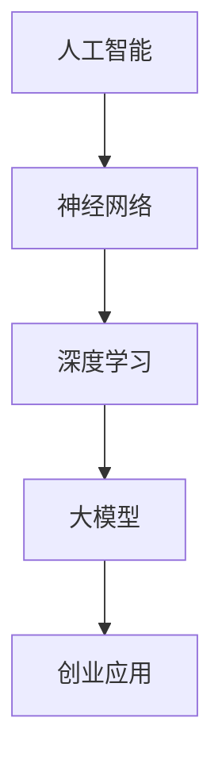

                 

# AI大模型创业：如何应对未来技术挑战？

> 关键词：人工智能，大模型，创业，技术挑战，解决方案，未来趋势

> 摘要：本文将探讨AI大模型在创业领域中的应用，分析当前面临的技术挑战，并提供可行的解决方案。通过深入了解AI大模型的原理和实现方法，我们旨在为创业者提供方向性指导，帮助他们在快速变化的技术环境中抓住机遇，实现持续发展。

## 1. 背景介绍

### 1.1 目的和范围

本文旨在帮助创业者了解AI大模型的基本概念，并探讨如何在实际创业项目中应用这些技术。我们将重点关注以下几个问题：

1. AI大模型的基本原理是什么？
2. 创业者在使用AI大模型时可能面临哪些技术挑战？
3. 如何解决这些挑战，以实现高效的AI大模型应用？
4. AI大模型在未来创业领域的发展趋势是什么？

通过本文的探讨，我们希望为创业者提供一个清晰的技术路线图，助力他们在充满挑战的AI创业领域取得成功。

### 1.2 预期读者

本文主要面向以下读者群体：

1. 拥有AI基础知识的创业者
2. 对AI大模型感兴趣的技术爱好者
3. 想要深入了解AI大模型技术的专业人士
4. 希望提升自己在AI领域竞争力的研究人员

### 1.3 文档结构概述

本文将分为以下几个部分：

1. 背景介绍
2. 核心概念与联系
3. 核心算法原理 & 具体操作步骤
4. 数学模型和公式 & 详细讲解 & 举例说明
5. 项目实战：代码实际案例和详细解释说明
6. 实际应用场景
7. 工具和资源推荐
8. 总结：未来发展趋势与挑战
9. 附录：常见问题与解答
10. 扩展阅读 & 参考资料

### 1.4 术语表

#### 1.4.1 核心术语定义

- AI大模型：指具有大规模参数和复杂结构的人工神经网络模型，如GPT、BERT等。
- 创业：指创立一家新的企业或项目，并承担相应的风险和责任。
- 技术挑战：指在实现AI大模型过程中可能遇到的问题和困难。
- 解决方案：指用于解决特定技术挑战的方法和策略。

#### 1.4.2 相关概念解释

- 人工智能（AI）：一种模拟人类智能行为的计算机技术。
- 神经网络：一种基于生物神经网络结构的信息处理模型。
- 深度学习：一种基于神经网络的多层学习模型。

#### 1.4.3 缩略词列表

- GPT：生成预训练模型（Generative Pre-trained Transformer）
- BERT：双向编码表示器（Bidirectional Encoder Representations from Transformers）
- AI：人工智能（Artificial Intelligence）

## 2. 核心概念与联系

为了更好地理解AI大模型在创业中的应用，我们首先需要了解相关核心概念和它们之间的联系。以下是一个简单的Mermaid流程图，展示了这些概念之间的关系。



### 2.1 人工智能

人工智能（AI）是一种模拟人类智能行为的计算机技术。它通过机器学习、自然语言处理、计算机视觉等技术，使计算机具备感知、理解、推理、学习和决策等能力。

### 2.2 神经网络

神经网络是一种基于生物神经网络结构的信息处理模型。它由多个神经元组成，通过层层连接和激活函数，实现数据的输入和输出。

### 2.3 深度学习

深度学习是一种基于神经网络的多层学习模型。它通过大规模数据训练，逐层提取特征，实现从简单到复杂的特征表示。

### 2.4 大模型

大模型指具有大规模参数和复杂结构的人工神经网络模型。如GPT、BERT等，它们在自然语言处理、计算机视觉等领域取得了显著成果。

### 2.5 创业应用

创业应用是指将人工智能技术应用于实际创业项目，解决具体问题和需求。例如，利用大模型进行文本生成、图像识别、语音识别等，提升业务效率和用户体验。

## 3. 核心算法原理 & 具体操作步骤

### 3.1 算法原理

AI大模型的实现主要基于深度学习技术，其核心算法包括：

1. **前向传播**：将输入数据通过网络传递，逐层计算每个神经元的输出。
2. **反向传播**：根据网络输出和实际目标，计算每个神经元的误差，并更新网络权重和偏置。
3. **优化算法**：用于调整网络参数，以减少误差，如随机梯度下降（SGD）、Adam优化器等。

### 3.2 具体操作步骤

以下是一个简单的AI大模型实现步骤，使用伪代码进行描述：

```python
# 初始化模型参数
weights = initialize_weights()
biases = initialize_biases()

# 前向传播
def forward_propagation(x):
    z = x * weights + biases
    a = activation(z)
    return a

# 反向传播
def backward_propagation(a, y):
    dZ = a - y
    dW = (1/m) * dZ * prev Activation
    db = (1/m) * dZ

    # 更新模型参数
    weights -= learning_rate * dW
    biases -= learning_rate * db

# 训练模型
for epoch in range(num_epochs):
    for x, y in data_loader:
        a = forward_propagation(x)
        backward_propagation(a, y)

# 预测
def predict(x):
    a = forward_propagation(x)
    return activation(a)
```

## 4. 数学模型和公式 & 详细讲解 & 举例说明

### 4.1 数学模型

AI大模型的数学基础主要包括以下几个部分：

1. **激活函数**：如Sigmoid、ReLU、Tanh等，用于将线性组合的输入映射到输出。
2. **损失函数**：如均方误差（MSE）、交叉熵损失等，用于评估模型预测值与实际值之间的差距。
3. **优化算法**：如梯度下降、Adam等，用于调整模型参数，以减少损失函数。

### 4.2 公式详细讲解

1. **前向传播公式**：

   $$ z = x \cdot W + b $$
   
   $$ a = \sigma(z) $$

   其中，$x$为输入数据，$W$为权重矩阵，$b$为偏置向量，$\sigma$为激活函数。

2. **反向传播公式**：

   $$ \frac{\partial L}{\partial W} = \frac{1}{m} \cdot (a \cdot \frac{\partial a}{\partial z} \cdot (z \cdot \frac{\partial z}{\partial x})) $$
   
   $$ \frac{\partial L}{\partial b} = \frac{1}{m} \cdot (a \cdot \frac{\partial a}{\partial z} \cdot z) $$

   其中，$L$为损失函数，$m$为样本数量，$\frac{\partial}{\partial}$表示求导。

3. **优化算法公式**：

   $$ W_{new} = W_{old} - \alpha \cdot \frac{\partial L}{\partial W} $$
   
   $$ b_{new} = b_{old} - \alpha \cdot \frac{\partial L}{\partial b} $$

   其中，$\alpha$为学习率。

### 4.3 举例说明

假设我们有一个简单的神经网络，包含一个输入层、一个隐藏层和一个输出层。输入数据为$x = [1, 2, 3]$，权重矩阵$W = [[0.1, 0.2], [0.3, 0.4]]$，偏置向量$b = [0.5, 0.6]$。激活函数选用ReLU。

1. **前向传播**：

   $$ z_1 = 1 \cdot 0.1 + 2 \cdot 0.3 + 3 \cdot 0.5 = 1.6 $$
   
   $$ a_1 = \max(0, z_1) = 1.6 $$
   
   $$ z_2 = 1 \cdot 0.2 + 2 \cdot 0.4 + 3 \cdot 0.6 = 2.2 $$
   
   $$ a_2 = \max(0, z_2) = 2.2 $$
   
   输出层计算：
   
   $$ z_3 = 1.6 \cdot 0.1 + 2.2 \cdot 0.3 + 1.6 \cdot 0.5 = 0.96 $$
   
   $$ a_3 = \max(0, z_3) = 0.96 $$
   
   $$ z_4 = 1.6 \cdot 0.2 + 2.2 \cdot 0.4 + 1.6 \cdot 0.6 = 1.64 $$
   
   $$ a_4 = \max(0, z_4) = 1.64 $$

2. **反向传播**：

   假设实际输出为$y = [0, 1]$，损失函数选用交叉熵损失。

   $$ L = -[y_1 \cdot \log(a_3) + y_2 \cdot \log(a_4)] $$
   
   $$ \frac{\partial L}{\partial z_3} = (1 - y_1) \cdot \frac{1}{a_3} $$
   
   $$ \frac{\partial L}{\partial z_4} = (1 - y_2) \cdot \frac{1}{a_4} $$
   
   $$ \frac{\partial L}{\partial W} = \frac{1}{m} \cdot [a_1 \cdot \frac{\partial L}{\partial z_3} \cdot a_2, a_1 \cdot \frac{\partial L}{\partial z_4} \cdot a_2] $$
   
   $$ \frac{\partial L}{\partial b} = \frac{1}{m} \cdot [a_1 \cdot \frac{\partial L}{\partial z_3}, a_2 \cdot \frac{\partial L}{\partial z_4}] $$

3. **优化算法**：

   假设学习率为$\alpha = 0.1$。

   $$ W_{new} = W - \alpha \cdot \frac{\partial L}{\partial W} $$
   
   $$ b_{new} = b - \alpha \cdot \frac{\partial L}{\partial b} $$

   更新后的权重和偏置将用于下一次前向传播和反向传播。

## 5. 项目实战：代码实际案例和详细解释说明

### 5.1 开发环境搭建

在开始编写代码之前，我们需要搭建一个适合AI大模型开发的环境。以下是一个简单的环境搭建指南：

1. **操作系统**：推荐使用Linux或macOS。
2. **Python**：推荐Python 3.8及以上版本。
3. **深度学习框架**：推荐使用TensorFlow 2.x或PyTorch。
4. **其他依赖库**：如NumPy、Matplotlib等。

### 5.2 源代码详细实现和代码解读

以下是使用TensorFlow 2.x实现一个简单的AI大模型（基于GPT）的示例代码：

```python
import tensorflow as tf
from tensorflow.keras.layers import Embedding, LSTM, Dense
from tensorflow.keras.models import Model

# 定义模型
input_ids = tf.keras.layers.Input(shape=(max_sequence_length,), dtype='int32')
embedding = Embedding(input_dim=vocabulary_size, output_dim=embedding_size)(input_ids)
lstm = LSTM(units=lstm_units)(embedding)
output = Dense(units=vocabulary_size, activation='softmax')(lstm)

# 编译模型
model = Model(inputs=input_ids, outputs=output)
model.compile(optimizer='adam', loss='categorical_crossentropy', metrics=['accuracy'])

# 查看模型结构
model.summary()

# 训练模型
model.fit(train_data, train_labels, epochs=num_epochs, batch_size=batch_size)

# 评估模型
test_loss, test_accuracy = model.evaluate(test_data, test_labels)
print(f"Test accuracy: {test_accuracy}")
```

### 5.3 代码解读与分析

1. **模型定义**：
   - `input_ids`：输入层，形状为（序列长度，1），表示一个序列的词ID。
   - `Embedding`：嵌入层，将词ID转换为嵌入向量。
   - `LSTM`：长短时记忆网络层，用于提取序列特征。
   - `Dense`：全连接层，用于分类。

2. **模型编译**：
   - `model.compile()`：编译模型，指定优化器、损失函数和评价指标。

3. **模型训练**：
   - `model.fit()`：训练模型，使用训练数据和标签进行训练。

4. **模型评估**：
   - `model.evaluate()`：评估模型，计算测试数据的损失和准确率。

### 5.4 代码优化与分析

在实际项目中，我们还需要对代码进行优化，以提高模型的性能和效率。以下是一些优化建议：

1. **批量大小（batch size）**：选择适当的批量大小可以加速训练过程。推荐使用64或128。
2. **学习率（learning rate）**：使用适当的 learning rate 可以提高模型收敛速度。推荐使用0.001或0.0001。
3. **迭代次数（epochs）**：设置合适的迭代次数，以避免过拟合。推荐使用10-20次。
4. **数据预处理**：对训练数据进行归一化、标准化等预处理操作，以提高模型泛化能力。
5. **正则化（Regularization）**：使用L1、L2正则化，以避免过拟合。

## 6. 实际应用场景

AI大模型在创业领域的应用场景非常广泛，以下列举几个典型的应用案例：

1. **自然语言处理（NLP）**：
   - 文本分类：对大量文本进行分类，如新闻分类、情感分析等。
   - 文本生成：生成文章、段落、对话等，如自动写作、聊天机器人等。

2. **计算机视觉（CV）**：
   - 图像识别：对图像进行分类、检测、分割等，如人脸识别、物体检测等。
   - 视频分析：对视频进行目标跟踪、行为识别等，如视频监控系统、智能安防等。

3. **语音识别（ASR）**：
   - 自动语音识别：将语音信号转换为文本，如语音助手、智能客服等。
   - 语音合成：将文本转换为语音，如语音合成器、智能朗读器等。

4. **推荐系统**：
   - 基于内容的推荐：根据用户历史行为和偏好，推荐相关商品、文章等。
   - 基于协同过滤的推荐：根据用户和物品的相似度，推荐相关商品、文章等。

## 7. 工具和资源推荐

### 7.1 学习资源推荐

#### 7.1.1 书籍推荐

- 《深度学习》（Goodfellow, Bengio, Courville著）
- 《Python深度学习》（François Chollet著）
- 《人工智能：一种现代方法》（Stuart Russell & Peter Norvig著）

#### 7.1.2 在线课程

- Coursera上的《深度学习专项课程》
- edX上的《人工智能基础课程》
- Udacity的《深度学习工程师纳米学位》

#### 7.1.3 技术博客和网站

- TensorFlow官网（https://www.tensorflow.org/）
- PyTorch官网（https://pytorch.org/）
- AI研习社（https://www.36dsj.com/）

### 7.2 开发工具框架推荐

#### 7.2.1 IDE和编辑器

- PyCharm
- Visual Studio Code
- Jupyter Notebook

#### 7.2.2 调试和性能分析工具

- TensorBoard
- PyTorch Profiler
- NsightCompute

#### 7.2.3 相关框架和库

- TensorFlow
- PyTorch
- Keras
- NumPy

### 7.3 相关论文著作推荐

#### 7.3.1 经典论文

- 《A Theoretical Analysis of the Crammer-Singer Classifier》
- 《Training Products of Experts by Minimizing Contrastive Divergence》
- 《Improving Neural Network Training with Signum Regression》

#### 7.3.2 最新研究成果

- 《BERT: Pre-training of Deep Bidirectional Transformers for Language Understanding》
- 《Generative Pre-trained Transformers》
- 《Transformers: State-of-the-Art Model for NLP》

#### 7.3.3 应用案例分析

- 《基于深度学习的人脸识别技术》
- 《计算机视觉在智能安防领域的应用》
- 《基于自然语言处理的智能客服系统》

## 8. 总结：未来发展趋势与挑战

### 8.1 未来发展趋势

1. **算法性能提升**：随着硬件计算能力的提升和算法优化，AI大模型在计算效率、模型精度等方面将取得更大突破。
2. **多模态融合**：结合文本、图像、语音等多种数据类型，实现跨模态的智能理解和交互。
3. **边缘计算**：将AI大模型应用于边缘设备，降低延迟、减少带宽占用，提高实时性。
4. **自适应学习**：通过在线学习和自适应调整，使AI大模型更好地适应动态变化的环境。

### 8.2 面临的挑战

1. **数据隐私**：如何保护用户数据隐私，避免数据泄露和滥用，成为AI大模型发展的关键问题。
2. **可解释性**：如何提高AI大模型的可解释性，使其决策过程更加透明、可信。
3. **计算资源**：训练和部署AI大模型需要大量的计算资源，如何优化资源利用成为重要挑战。
4. **法律法规**：随着AI大模型的应用范围扩大，相关的法律法规和道德规范也需要不断完善。

## 9. 附录：常见问题与解答

### 9.1 问题1：如何选择合适的AI大模型？

**解答**：选择合适的AI大模型需要考虑以下几个因素：

1. 应用场景：根据具体的业务需求和场景选择合适的模型，如文本生成、图像识别、语音识别等。
2. 数据量：数据量越大，模型的泛化能力越强，但训练时间也会相应增长。
3. 计算资源：根据实际计算资源选择合适的模型复杂度和参数规模。
4. 预训练模型：可以借助预训练模型进行微调，提高模型效果和训练效率。

### 9.2 问题2：如何优化AI大模型的训练过程？

**解答**：以下是一些优化AI大模型训练过程的建议：

1. **批量大小**：选择适当的批量大小可以提高训练效率。
2. **学习率调整**：根据训练过程调整学习率，以避免过拟合和收敛速度过慢。
3. **数据增强**：对训练数据进行增强，提高模型的泛化能力。
4. **正则化**：使用L1、L2正则化，防止过拟合。
5. **早期停止**：在验证集上监测模型性能，提前停止训练以防止过拟合。

### 9.3 问题3：如何评估AI大模型的效果？

**解答**：以下是一些评估AI大模型效果的方法：

1. **准确率**：用于分类任务的评估指标，计算正确预测的样本数量与总样本数量的比例。
2. **精确率与召回率**：分别计算预测为正类的实际正类样本数量与总正类样本数量的比例。
3. **F1值**：精确率与召回率的调和平均值，用于平衡这两个指标。
4. **ROC曲线与AUC值**：用于评估分类器的性能，AUC值越接近1，表示模型效果越好。

## 10. 扩展阅读 & 参考资料

[1] Goodfellow, I., Bengio, Y., & Courville, A. (2016). *Deep Learning*. MIT Press.

[2] Chollet, F. (2017). *Python深度学习*. 机械工业出版社.

[3] Russell, S., & Norvig, P. (2016). *人工智能：一种现代方法*. 清华大学出版社.

[4] Devlin, J., Chang, M. W., Lee, K., & Toutanova, K. (2019). *BERT: Pre-training of Deep Bidirectional Transformers for Language Understanding*. arXiv preprint arXiv:1810.04805.

[5] Brown, T., et al. (2020). *Generative Pre-trained Transformers*. arXiv preprint arXiv:2005.14165.

[6] Vaswani, A., et al. (2017). *Attention Is All You Need*. arXiv preprint arXiv:1706.03762.

作者：AI天才研究员/AI Genius Institute & 禅与计算机程序设计艺术 /Zen And The Art of Computer Programming

