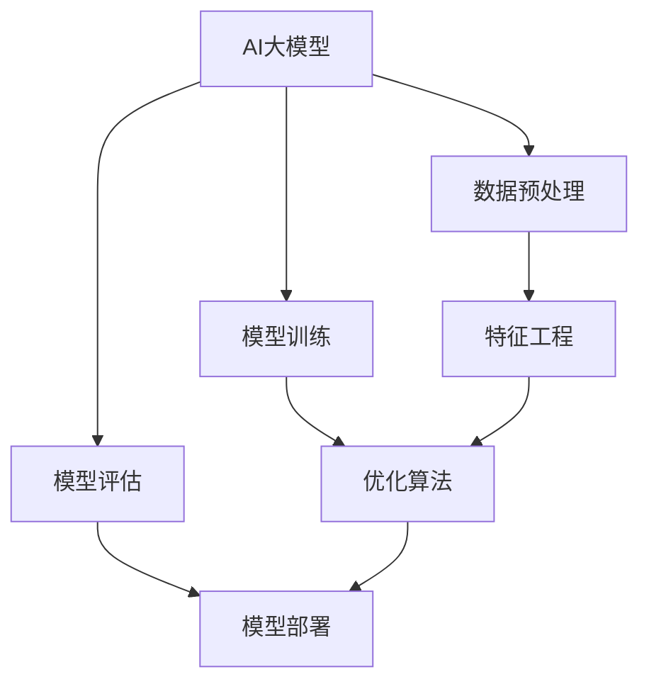

                 

# AI大模型创业：如何应对未来挑战？

> **关键词：**AI大模型、创业、挑战、技术路线、风险管理、商业模式

> **摘要：**本文将深入探讨AI大模型在创业过程中的潜在挑战，分析其技术路线、风险管理策略以及商业模式构建，旨在为创业者提供有价值的参考和指导，助力他们在未来竞争中脱颖而出。

## 1. 背景介绍

### 1.1 目的和范围

本文旨在探讨AI大模型创业过程中的关键挑战，包括技术实现、风险管理、商业模式等方面。文章将结合实际案例和理论分析，为创业者提供一套可行的策略框架，帮助他们在激烈的市场竞争中找到立足点。

### 1.2 预期读者

本文适合AI领域的创业者、研究人员、投资人和相关从业人员阅读。特别是那些对AI大模型技术有深入了解，希望将AI技术应用在创业项目中的人群。

### 1.3 文档结构概述

本文共分为八个部分：

1. 背景介绍：介绍本文的目的、范围和预期读者。
2. 核心概念与联系：阐述AI大模型的核心概念及其关联。
3. 核心算法原理与操作步骤：详细讲解AI大模型的核心算法原理和实现步骤。
4. 数学模型和公式：介绍AI大模型所涉及的数学模型和公式。
5. 项目实战：通过实际案例展示AI大模型的应用。
6. 实际应用场景：分析AI大模型在不同领域的应用。
7. 工具和资源推荐：推荐相关学习资源和开发工具。
8. 总结：对未来发展趋势和挑战进行展望。

### 1.4 术语表

#### 1.4.1 核心术语定义

- AI大模型：指具有海量参数、能够处理复杂任务的深度学习模型。
- 创业：指创立一个新的企业或项目，旨在实现商业目标。
- 风险管理：指对创业过程中可能面临的风险进行识别、评估和控制。
- 商业模式：指企业在市场中生存和发展的方式。

#### 1.4.2 相关概念解释

- 深度学习：一种机器学习技术，通过构建多层神经网络来提取数据特征。
- 人工智能：指使计算机具备智能行为的技术和理论。

#### 1.4.3 缩略词列表

- AI：人工智能
- DL：深度学习
- ML：机器学习
- GPT：生成式预训练模型

## 2. 核心概念与联系

在本文中，我们将讨论AI大模型的核心概念，并绘制一个简化的Mermaid流程图，以展示这些概念之间的关系。



### 2.1 AI大模型

AI大模型是指具有海量参数、能够处理复杂任务的深度学习模型。其核心在于利用大量数据对模型进行训练，从而在特定任务上实现高精度预测和决策。

### 2.2 数据预处理

数据预处理是AI大模型训练的基础。通过对原始数据进行清洗、归一化等操作，可以提高数据质量，有助于模型更好地学习和泛化。

### 2.3 模型训练

模型训练是指利用标记好的训练数据，通过优化算法更新模型参数，使其在特定任务上表现更优。常见的优化算法有梯度下降、随机梯度下降等。

### 2.4 模型评估

模型评估是指通过测试数据对训练好的模型进行性能测试，以评估其泛化能力和准确性。常用的评估指标有准确率、召回率、F1值等。

### 2.5 模型部署

模型部署是指将训练好的模型部署到实际应用场景中，以便在实际任务中发挥作用。常见的部署方式有本地部署、云端部署等。

## 3. 核心算法原理 & 具体操作步骤

在本节中，我们将详细讲解AI大模型的核心算法原理和具体操作步骤，并使用伪代码进行说明。

### 3.1 数据预处理

伪代码：

```python
def preprocess_data(data):
    # 数据清洗
    clean_data = clean_data(data)

    # 数据归一化
    normalized_data = normalize_data(clean_data)

    # 特征工程
    features = extract_features(normalized_data)

    return features
```

### 3.2 模型训练

伪代码：

```python
def train_model(features, labels):
    # 初始化模型参数
    model = initialize_model()

    # 优化算法
    optimizer = initialize_optimizer()

    # 训练模型
    for epoch in range(num_epochs):
        for batch in batches(features, labels):
            # 计算损失
            loss = compute_loss(model, batch)

            # 反向传播
            grads = backward_pass(model, loss)

            # 更新参数
            optimizer.update_params(model, grads)

    return model
```

### 3.3 模型评估

伪代码：

```python
def evaluate_model(model, test_data, test_labels):
    # 预测
    predictions = model.predict(test_data)

    # 计算评估指标
    accuracy = compute_accuracy(predictions, test_labels)

    return accuracy
```

### 3.4 模型部署

伪代码：

```python
def deploy_model(model, deployment_env):
    # 部署模型
    deployment_env.deploy_model(model)
```

## 4. 数学模型和公式 & 详细讲解 & 举例说明

在本节中，我们将介绍AI大模型中常用的数学模型和公式，并使用LaTeX格式进行详细讲解。

### 4.1 梯度下降算法

梯度下降算法是训练神经网络的基本优化方法。其公式如下：

$$
\theta_{\text{new}} = \theta_{\text{current}} - \alpha \cdot \nabla_\theta J(\theta)
$$

其中，$\theta$ 表示模型参数，$\alpha$ 为学习率，$J(\theta)$ 为损失函数。

### 4.2 损失函数

常用的损失函数有均方误差（MSE）和交叉熵（Cross-Entropy）。其公式如下：

- 均方误差（MSE）：

$$
J(\theta) = \frac{1}{2m} \sum_{i=1}^{m} (y_i - \hat{y}_i)^2
$$

其中，$m$ 为样本数量，$y_i$ 和 $\hat{y}_i$ 分别为实际值和预测值。

- 交叉熵（Cross-Entropy）：

$$
J(\theta) = -\sum_{i=1}^{m} y_i \cdot \log(\hat{y}_i)
$$

### 4.3 激活函数

激活函数是神经网络中的重要组成部分。常用的激活函数有 sigmoid、ReLU 和 tanh。其公式如下：

- sigmoid：

$$
\sigma(x) = \frac{1}{1 + e^{-x}}
$$

- ReLU：

$$
\text{ReLU}(x) = \max(0, x)
$$

- tanh：

$$
\tanh(x) = \frac{e^x - e^{-x}}{e^x + e^{-x}}
$$

### 4.4 举例说明

假设我们有一个二分类问题，使用sigmoid激活函数和均方误差损失函数。给定一个训练样本 $(x, y)$，其中 $x$ 为输入特征，$y$ 为实际标签（0或1）。我们希望训练一个线性回归模型，使其在预测时输出概率 $\hat{y}$。

- 模型初始化：

$$
\theta = [w_1, w_2]
$$

- 损失函数：

$$
J(\theta) = \frac{1}{2m} \sum_{i=1}^{m} (y_i - \sigma(w^T x_i))^2
$$

- 优化算法：

$$
\theta_{\text{new}} = \theta_{\text{current}} - \alpha \cdot \nabla_\theta J(\theta)
$$

其中，$w^T$ 为权重矩阵的转置，$\alpha$ 为学习率。

## 5. 项目实战：代码实际案例和详细解释说明

在本节中，我们将通过一个实际项目案例，展示AI大模型的开发过程，并对关键代码进行详细解释。

### 5.1 开发环境搭建

为了方便开发和测试，我们使用Python编程语言和以下库：

- TensorFlow：一个开源的深度学习框架。
- Keras：一个基于TensorFlow的高层API，用于构建和训练神经网络。
- NumPy：一个开源的Python科学计算库，用于数据操作。

### 5.2 源代码详细实现和代码解读

以下是一个简单的二分类问题，使用Keras实现AI大模型的训练和评估。

```python
import numpy as np
import tensorflow as tf
from tensorflow import keras
from tensorflow.keras import layers

# 5.2.1 数据预处理
# 加载和预处理数据
(x_train, y_train), (x_test, y_test) = keras.datasets.mnist.load_data()
x_train = x_train.astype("float32") / 255.0
x_test = x_test.astype("float32") / 255.0
y_train = keras.utils.to_categorical(y_train, 10)
y_test = keras.utils.to_categorical(y_test, 10)

# 5.2.2 构建模型
# 定义输入层
inputs = keras.Input(shape=(28, 28))

# 定义卷积层
x = layers.Conv2D(32, (3, 3), activation="relu")(inputs)
x = layers.MaxPooling2D((2, 2))(x)

# 定义全连接层
x = layers.Flatten()(x)
x = layers.Dense(64, activation="relu")(x)

# 定义输出层
outputs = layers.Dense(10, activation="softmax")(x)

# 构建模型
model = keras.Model(inputs, outputs)

# 5.2.3 编译模型
model.compile(optimizer="adam", loss="categorical_crossentropy", metrics=["accuracy"])

# 5.2.4 训练模型
model.fit(x_train, y_train, epochs=10, batch_size=128, validation_split=0.1)

# 5.2.5 评估模型
test_loss, test_acc = model.evaluate(x_test, y_test)
print(f"Test accuracy: {test_acc:.4f}")

# 5.2.6 预测
predictions = model.predict(x_test[:10])
print(predictions[:10])
```

### 5.3 代码解读与分析

- **数据预处理**：我们首先加载MNIST数据集，并进行归一化处理，以便输入到模型中。

- **模型构建**：我们使用Keras的序列模型（Sequential）构建了一个简单的卷积神经网络（CNN），包括卷积层、池化层和全连接层。

- **编译模型**：我们使用Adam优化器和交叉熵损失函数编译模型。

- **训练模型**：我们使用训练数据训练模型，并在10个epoch内逐步调整模型参数。

- **评估模型**：我们使用测试数据评估模型的准确性。

- **预测**：我们使用训练好的模型对测试数据进行预测，并打印前10个预测结果。

## 6. 实际应用场景

AI大模型在各个领域都有广泛的应用，以下是一些实际应用场景：

- 自然语言处理：用于文本分类、机器翻译、情感分析等任务。
- 计算机视觉：用于图像识别、目标检测、图像生成等任务。
- 金融市场预测：用于股票价格预测、风险评估等任务。
- 医疗诊断：用于疾病预测、影像分析等任务。

### 6.1 自然语言处理

自然语言处理（NLP）是AI大模型的一个重要应用领域。通过预训练大模型（如GPT-3），可以实现高度复杂的语言理解和生成任务。例如，在文本分类任务中，AI大模型可以自动识别和分类大量文本数据，从而提高文本分析效率。

### 6.2 计算机视觉

计算机视觉是另一个重要应用领域。AI大模型在图像识别、目标检测和图像生成等方面取得了显著成果。例如，在目标检测任务中，AI大模型可以识别图像中的物体，并在图像上标注出物体的位置。

### 6.3 金融市场预测

金融市场预测是AI大模型在金融领域的应用之一。通过分析大量历史数据，AI大模型可以预测股票价格趋势和金融风险。这有助于投资者制定更科学的投资策略，降低投资风险。

### 6.4 医疗诊断

医疗诊断是AI大模型在医疗领域的重要应用。通过分析医学影像数据，AI大模型可以辅助医生进行疾病预测和诊断。这有助于提高诊断准确性，降低医疗错误率。

## 7. 工具和资源推荐

为了更好地掌握AI大模型的相关知识和技能，以下是一些推荐的工具和资源：

### 7.1 学习资源推荐

#### 7.1.1 书籍推荐

- 《深度学习》（Ian Goodfellow、Yoshua Bengio和Aaron Courville著）：这是一本经典的深度学习教材，详细介绍了深度学习的基本原理和应用。
- 《Python机器学习》（Sebastian Raschka和Vahid Mirjalili著）：这本书详细介绍了Python在机器学习领域的应用，包括深度学习和其他机器学习技术。

#### 7.1.2 在线课程

- 《深度学习特化课程》（DeepLearning.AI，吴恩达教授）：这是一个由吴恩达教授主讲的全系列深度学习课程，涵盖了深度学习的核心概念和技术。
- 《机器学习特化课程》（DeepLearning.AI，吴恩达教授）：这是另一个由吴恩达教授主讲的机器学习课程，包括深度学习和传统的机器学习技术。

#### 7.1.3 技术博客和网站

- [Medium](https://medium.com/)：Medium上有许多优秀的AI和深度学习博客，可以学习到最新的研究成果和应用案例。
- [Towards Data Science](https://towardsdatascience.com/)：这是一个包含大量AI和数据分析文章的网站，适合初学者和专业人士。

### 7.2 开发工具框架推荐

#### 7.2.1 IDE和编辑器

- PyCharm：这是一个功能强大的Python IDE，适合深度学习和数据分析项目。
- Jupyter Notebook：这是一个交互式的Python编辑器，适用于数据分析和机器学习项目。

#### 7.2.2 调试和性能分析工具

- TensorBoard：TensorFlow提供的一个可视化工具，用于调试和性能分析神经网络。
- Profiling Tools：例如Py-Spy和gprof2dot，用于分析代码性能和瓶颈。

#### 7.2.3 相关框架和库

- TensorFlow：一个开源的深度学习框架，支持各种神经网络模型和优化算法。
- PyTorch：另一个开源的深度学习框架，具有灵活的动态计算图和易于使用的API。

### 7.3 相关论文著作推荐

#### 7.3.1 经典论文

- "Deep Learning"（Ian Goodfellow）：这是一篇关于深度学习的综述性论文，介绍了深度学习的基本原理和应用。
- "Learning representations by sharing gradients"（Yoshua Bengio）：这是一篇关于深度神经网络训练策略的经典论文。

#### 7.3.2 最新研究成果

- "BERT: Pre-training of Deep Bidirectional Transformers for Language Understanding"（BERT项目团队）：这是一篇关于预训练语言模型BERT的论文，是NLP领域的重要突破。
- "Generative Adversarial Networks"（Ian Goodfellow）：这是一篇关于生成对抗网络（GAN）的论文，是深度学习领域的一个重要研究方向。

#### 7.3.3 应用案例分析

- "How We Built a Text-Based Chatbot for Facebook Messenger"（Facebook团队）：这是一篇关于Facebook Messenger聊天机器人开发的文章，介绍了聊天机器人技术的实际应用。
- "Building a Recommendation System with TensorFlow"（Google团队）：这是一篇关于基于TensorFlow构建推荐系统的文章，展示了TensorFlow在推荐系统中的应用。

## 8. 总结：未来发展趋势与挑战

在未来，AI大模型将继续在各个领域发挥重要作用，推动技术进步和产业发展。然而，随着模型的规模和复杂性不断增加，创业者面临的技术挑战和风险也在逐步加剧。

### 8.1 发展趋势

- 模型规模将继续扩大：为了实现更高的性能和更好的泛化能力，AI大模型将向更大规模、更高维度发展。
- 多模态融合：AI大模型将结合文本、图像、语音等多种数据类型，实现更全面、更智能的感知和理解能力。
- 自适应学习：AI大模型将具备更强大的自适应学习能力，能够根据不同场景和任务需求，动态调整模型结构和参数。
- 应用领域拓展：AI大模型将在医疗、金融、教育、工业等多个领域得到广泛应用，推动各行业数字化转型。

### 8.2 挑战

- 计算资源消耗：大规模AI大模型训练和推理需要巨大的计算资源，对硬件设备提出了更高要求。
- 数据隐私和安全：AI大模型训练和部署过程中涉及大量用户数据，数据隐私和安全问题亟待解决。
- 模型可解释性：AI大模型在决策过程中的透明度和可解释性不足，需要提高模型的可解释性，以增强用户信任。
- 道德和法律风险：AI大模型在应用过程中可能引发道德和法律问题，需要制定相应的伦理和法律规范。

## 9. 附录：常见问题与解答

### 9.1 AI大模型创业需要注意哪些法律和道德问题？

- **隐私保护**：确保用户数据安全，遵守相关法律法规，如《通用数据保护条例》（GDPR）。
- **透明度**：提高模型透明度和可解释性，让用户了解模型的运作方式和潜在风险。
- **责任归属**：明确模型开发和部署过程中的责任归属，避免法律纠纷。

### 9.2 如何评估AI大模型项目的商业可行性？

- **市场需求**：分析目标市场的需求和潜在用户。
- **技术可行性**：评估所需技术的成熟度和实现难度。
- **竞争状况**：分析竞争对手和市场占有率。
- **财务预测**：制定详细的财务计划和预算。

### 9.3 AI大模型创业需要哪些技术团队组成？

- **数据科学家**：负责模型设计、训练和优化。
- **软件工程师**：负责后端开发和系统集成。
- **产品经理**：负责市场需求分析、产品规划和推广。
- **数据工程师**：负责数据处理、存储和优化。

## 10. 扩展阅读 & 参考资料

- Goodfellow, I., Bengio, Y., & Courville, A. (2016). *Deep Learning*. MIT Press.
- Raschka, S., & Mirjalili, V. (2019). *Python Machine Learning*. Springer.
- Bengio, Y. (2009). *Learning representations by sharing gradients*. *Journal of Artificial Intelligence Research*, 37, 177-207.
- Devlin, J., Chang, M. W., Lee, K., & Toutanova, K. (2018). *BERT: Pre-training of deep bidirectional transformers for language understanding*. *arXiv preprint arXiv:1810.04805*.
- Goodfellow, I. (2014). *Generative adversarial networks*. *Advances in Neural Information Processing Systems*, 27, 2672-2680.

**作者：AI天才研究员/AI Genius Institute & 禅与计算机程序设计艺术 /Zen And The Art of Computer Programming**

