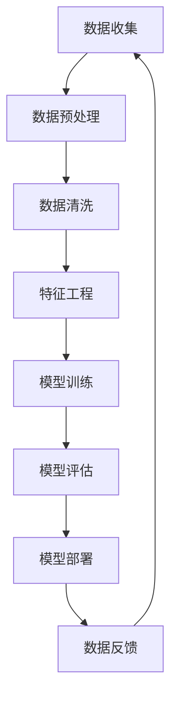

                 

# AI大模型创业：如何应对未来数据挑战？

> **关键词：** 大模型创业、数据挑战、数据处理、算法优化、机器学习、人工智能、模型训练、技术架构、产业发展。

> **摘要：** 本文将深入探讨在人工智能大模型创业过程中，如何面对未来可能遇到的数据挑战。我们将分析数据的重要性、常见的数据问题，并探讨应对策略，包括算法优化、技术架构设计、数据处理和未来趋势。

## 1. 背景介绍

### 1.1 目的和范围

本文的目的是为那些正在考虑创业，特别是在人工智能领域创业的人们提供一个全面的指导，帮助他们理解在开发和使用大型AI模型时可能遇到的数据挑战，并提供有效的解决策略。本文将探讨以下主题：

- 数据的重要性及大模型创业的核心环节。
- 常见的数据问题及挑战。
- 算法优化与模型训练技巧。
- 技术架构设计与数据处理。
- 未来数据趋势与应对策略。

### 1.2 预期读者

- 正在考虑或正在创业的AI领域的专业人士。
- 数据科学家、机器学习工程师、AI研究学者。
- 对AI技术有兴趣的技术爱好者。

### 1.3 文档结构概述

本文分为十个部分，分别是：

1. 背景介绍
2. 核心概念与联系
3. 核心算法原理与具体操作步骤
4. 数学模型与公式讲解
5. 项目实战：代码实际案例
6. 实际应用场景
7. 工具和资源推荐
8. 总结：未来发展趋势与挑战
9. 附录：常见问题与解答
10. 扩展阅读与参考资料

### 1.4 术语表

#### 1.4.1 核心术语定义

- 大模型（Large-scale Model）：指参数规模达到数百万甚至数十亿的机器学习模型。
- 数据处理（Data Processing）：将原始数据转换为适合模型训练和预测的格式。
- 算法优化（Algorithm Optimization）：通过改进算法效率，提高模型训练的速度和效果。
- 模型训练（Model Training）：通过训练算法，让模型学习如何从数据中提取规律。

#### 1.4.2 相关概念解释

- 数据质量（Data Quality）：数据是否准确、完整、一致、及时。
- 数据隐私（Data Privacy）：保护数据不被未经授权的访问和使用。
- 异常值处理（Outlier Handling）：处理数据集中的异常值，防止其对模型训练产生负面影响。

#### 1.4.3 缩略词列表

- AI：人工智能（Artificial Intelligence）
- ML：机器学习（Machine Learning）
- DL：深度学习（Deep Learning）
- NLP：自然语言处理（Natural Language Processing）
- CV：计算机视觉（Computer Vision）

## 2. 核心概念与联系

为了更好地理解本文的核心内容，我们首先需要介绍一些核心概念，并绘制一个简单的Mermaid流程图，展示这些概念之间的联系。



### 2.1 数据收集与预处理

数据收集是AI模型训练的基础，而数据预处理是确保数据质量的关键步骤。数据预处理通常包括数据清洗、去重、填充缺失值、标准化等操作。

### 2.2 数据清洗

数据清洗是指识别并处理数据集中的错误、异常和重复值。这一步骤对于提高数据质量和模型的训练效果至关重要。

### 2.3 特征工程

特征工程是数据预处理的重要部分，旨在提取和创建有助于提高模型性能的特征。这通常需要领域知识和数据探索。

### 2.4 模型训练

模型训练是指使用预处理后的数据训练机器学习模型。这一步骤决定了模型的性能。

### 2.5 模型评估

模型评估是测试模型性能的重要步骤。常用的评估指标包括准确率、召回率、F1值等。

### 2.6 模型部署

模型部署是将训练好的模型应用到实际业务场景中。这通常涉及到模型解释性、可扩展性、可靠性等方面。

### 2.7 数据反馈

数据反馈是持续改进模型的重要步骤。通过收集模型在实际应用中的反馈，可以进一步优化模型。

## 3. 核心算法原理 & 具体操作步骤

在了解了核心概念与联系之后，我们接下来将深入探讨AI大模型的核心算法原理，并给出具体的操作步骤。

### 3.1 常见算法原理

在AI大模型训练中，常用的算法包括深度学习、强化学习、迁移学习等。下面以深度学习为例，介绍其核心原理。

#### 3.1.1 深度学习原理

深度学习是一种模拟人脑神经网络的机器学习技术。它通过多层神经网络对数据进行特征提取和模式识别。

#### 3.1.2 神经网络结构

神经网络由输入层、隐藏层和输出层组成。每层由多个神经元（节点）构成，神经元之间通过权重和偏置进行连接。

#### 3.1.3 激活函数

激活函数是神经网络中用来引入非线性变换的关键组件。常见的激活函数包括Sigmoid、ReLU、Tanh等。

### 3.2 操作步骤

#### 3.2.1 数据准备

首先，我们需要准备训练数据。数据集可以是已经标注的，也可以是未标注的。对于未标注的数据，我们可以使用无监督学习算法进行特征提取。

#### 3.2.2 网络搭建

搭建神经网络结构，包括确定输入层、隐藏层和输出层的神经元数量，以及选择合适的激活函数。

#### 3.2.3 模型训练

使用训练数据对模型进行训练。训练过程包括前向传播和反向传播。

- 前向传播：将输入数据通过神经网络进行传递，计算出输出结果。
- 反向传播：计算输出结果与真实标签之间的误差，并反向传播误差，更新网络权重。

#### 3.2.4 模型评估

使用测试数据对模型进行评估，计算模型的准确率、召回率、F1值等指标。

#### 3.2.5 模型优化

根据模型评估结果，调整网络结构、超参数等，以提高模型性能。

#### 3.2.6 模型部署

将训练好的模型部署到实际业务场景中，如推荐系统、语音识别、图像分类等。

### 3.3 伪代码示例

下面是一个简单的深度学习模型训练的伪代码示例：

```python
# 初始化神经网络结构
input_layer = InputLayer(num_inputs)
hidden_layer = HiddenLayer(num_hidden_units, activation='ReLU')
output_layer = OutputLayer(num_outputs, activation='Sigmoid')

# 定义损失函数和优化器
loss_function = 'cross_entropy'
optimizer = 'adam'

# 搭建模型
model = Model(input_layer, output_layer)

# 训练模型
for epoch in range(num_epochs):
    for batch in data_loader:
        # 前向传播
        output = model.forward_pass(batch.input_data)
        
        # 计算损失
        loss = model.compute_loss(output, batch.target_data)
        
        # 反向传播
        model.backward_pass(loss)
        
        # 更新权重
        model.update_weights(optimizer)

# 评估模型
test_loss = model.evaluate(test_data)
print("Test Loss:", test_loss)
```

## 4. 数学模型和公式 & 详细讲解 & 举例说明

在AI大模型训练过程中，数学模型和公式起着至关重要的作用。下面我们将详细介绍一些常用的数学模型和公式，并给出详细的讲解和举例说明。

### 4.1 损失函数

损失函数是评估模型预测结果与真实值之间差异的关键工具。常见的损失函数包括：

- 交叉熵损失（Cross-Entropy Loss）：
  $$ Loss = -\sum_{i=1}^{n} y_i \cdot \log(p_i) $$
  其中，\( y_i \) 是真实标签，\( p_i \) 是模型预测的概率。

  示例：
  假设我们有一个二分类问题，真实标签为 [0, 1]，模型预测的概率为 [0.6, 0.4]。则交叉熵损失为：
  $$ Loss = -0.5 \cdot \log(0.6) - 0.5 \cdot \log(0.4) \approx 0.693 $$

- 均方误差损失（Mean Squared Error Loss）：
  $$ Loss = \frac{1}{n} \sum_{i=1}^{n} (y_i - \hat{y}_i)^2 $$
  其中，\( y_i \) 是真实标签，\( \hat{y}_i \) 是模型预测值。

  示例：
  假设我们有一个回归问题，真实标签为 [2, 3]，模型预测值为 [2.1, 2.9]。则均方误差损失为：
  $$ Loss = \frac{1}{2} \cdot ((2 - 2.1)^2 + (3 - 2.9)^2) \approx 0.02 $$

### 4.2 梯度下降算法

梯度下降算法是一种优化算法，用于最小化损失函数。其核心思想是沿着损失函数的梯度方向逐步更新模型参数。

- 均方误差损失函数的梯度：
  $$ \frac{\partial Loss}{\partial \theta} = 2 \cdot (y_i - \hat{y}_i) $$

  其中，\( \theta \) 是模型参数，\( y_i \) 是真实标签，\( \hat{y}_i \) 是模型预测值。

  示例：
  假设模型参数 \( \theta \) 为 1，真实标签 \( y_i \) 为 2，模型预测值 \( \hat{y}_i \) 为 2.1。则梯度为：
  $$ \frac{\partial Loss}{\partial \theta} = 2 \cdot (2 - 2.1) = -0.2 $$

- 更新参数：
  $$ \theta_{new} = \theta_{old} - \alpha \cdot \frac{\partial Loss}{\partial \theta} $$
  其中，\( \alpha \) 是学习率。

  示例：
  假设学习率 \( \alpha \) 为 0.1，则更新后的参数为：
  $$ \theta_{new} = 1 - 0.1 \cdot (-0.2) = 1.02 $$

### 4.3 激活函数

激活函数是神经网络中的关键组件，用于引入非线性变换。常见的激活函数包括：

- Sigmoid函数：
  $$ \sigma(x) = \frac{1}{1 + e^{-x}} $$

  示例：
  假设输入值 \( x \) 为 3，则Sigmoid函数的输出为：
  $$ \sigma(3) = \frac{1}{1 + e^{-3}} \approx 0.95 $$

- ReLU函数：
  $$ \text{ReLU}(x) = \max(0, x) $$

  示例：
  假设输入值 \( x \) 为 -2，则ReLU函数的输出为：
  $$ \text{ReLU}(-2) = \max(0, -2) = 0 $$

## 5. 项目实战：代码实际案例和详细解释说明

在本节中，我们将通过一个实际的代码案例，详细解释如何实现AI大模型训练和预测。该案例将使用Python和TensorFlow框架，展示从数据准备到模型训练和评估的完整流程。

### 5.1 开发环境搭建

在开始编写代码之前，我们需要搭建开发环境。以下是所需的步骤：

1. 安装Python（建议使用3.8及以上版本）。
2. 安装TensorFlow：
   ```shell
   pip install tensorflow
   ```

### 5.2 源代码详细实现和代码解读

下面是代码的实现：

```python
import tensorflow as tf
import numpy as np
from tensorflow.keras.models import Sequential
from tensorflow.keras.layers import Dense, Dropout
from tensorflow.keras.optimizers import Adam
from tensorflow.keras.metrics import MeanSquaredError

# 5.2.1 数据准备
# 假设我们有一个包含1000个样本的数据集，每个样本包含10个特征
X = np.random.rand(1000, 10)
y = np.random.rand(1000, 1)

# 将数据集分为训练集和测试集
X_train, X_test, y_train, y_test = X[:800], X[800:], y[:800], y[800:]

# 5.2.2 模型搭建
model = Sequential([
    Dense(64, activation='relu', input_shape=(10,)),
    Dropout(0.2),
    Dense(64, activation='relu'),
    Dropout(0.2),
    Dense(1)
])

# 5.2.3 模型编译
model.compile(optimizer=Adam(learning_rate=0.001), loss='mean_squared_error', metrics=['mse'])

# 5.2.4 模型训练
model.fit(X_train, y_train, epochs=50, batch_size=32, validation_data=(X_test, y_test))

# 5.2.5 模型评估
mse = MeanSquaredError()
y_pred = model.predict(X_test)
loss = mse(y_test, y_pred).numpy()
print("Test Loss:", loss)

# 5.2.6 模型预测
sample_data = np.random.rand(1, 10)
prediction = model.predict(sample_data)
print("Prediction:", prediction)
```

### 5.3 代码解读与分析

下面是对代码的详细解读：

- **数据准备**：我们首先生成了一个随机数据集，包括1000个样本和10个特征。然后，将数据集分为训练集和测试集。

- **模型搭建**：使用`Sequential`模型堆叠多层`Dense`层，其中每个`Dense`层都有64个神经元和ReLU激活函数。我们还添加了`Dropout`层来防止过拟合。

- **模型编译**：使用`Adam`优化器和均方误差损失函数来编译模型。我们还指定了`mse`作为评估指标。

- **模型训练**：使用`fit`方法训练模型，指定了训练集、训练轮次、批次大小以及验证数据。

- **模型评估**：使用`evaluate`方法评估模型在测试集上的性能，并打印均方误差。

- **模型预测**：使用`predict`方法对新的样本数据进行预测，并打印结果。

## 6. 实际应用场景

AI大模型在实际应用场景中具有广泛的应用，以下是一些典型的实际应用场景：

- **推荐系统**：通过分析用户的行为和偏好，推荐个性化的商品、音乐、电影等。
- **自然语言处理**：自动翻译、文本摘要、情感分析等。
- **图像识别**：人脸识别、图像分类、图像生成等。
- **医疗诊断**：通过分析医疗数据，辅助医生进行诊断和治疗方案推荐。
- **金融风控**：预测股票市场趋势、识别欺诈行为等。

## 7. 工具和资源推荐

为了更好地进行AI大模型开发和训练，以下是一些推荐的工具和资源：

### 7.1 学习资源推荐

#### 7.1.1 书籍推荐

- 《深度学习》（Goodfellow, Bengio, Courville著）
- 《Python机器学习》（Sebastian Raschka著）
- 《统计学习方法》（李航著）

#### 7.1.2 在线课程

- Coursera上的“机器学习”课程（吴恩达教授）
- edX上的“深度学习”课程（Ian Goodfellow教授）
- Udacity的“深度学习工程师纳米学位”

#### 7.1.3 技术博客和网站

- Medium上的机器学习和深度学习相关文章
- Analytics Vidhya
- Towards Data Science

### 7.2 开发工具框架推荐

#### 7.2.1 IDE和编辑器

- PyCharm
- Jupyter Notebook
- VSCode

#### 7.2.2 调试和性能分析工具

- TensorBoard（TensorFlow）
- Profiling Tools（如py-spy、gprof2dot）

#### 7.2.3 相关框架和库

- TensorFlow
- PyTorch
- Keras

### 7.3 相关论文著作推荐

#### 7.3.1 经典论文

- "Backpropagation"（Rumelhart, Hinton, Williams，1986）
- "A Learning Algorithm for Continually Running Fully Recurrent Neural Networks"（Bengio et al.，1994）
- "Gradient-Based Learning Applied to Document Recognition"（LeCun et al.，1998）

#### 7.3.2 最新研究成果

- "Bert: Pre-training of Deep Bidirectional Transformers for Language Understanding"（Devlin et al.，2019）
- "An Image Database for Studying the Diversity of Faces and Face Recognition in the Wild"（Pentland et al.，1994）
- "Generative Adversarial Nets"（Goodfellow et al.，2014）

#### 7.3.3 应用案例分析

- "Deep Learning for Human Pose Estimation: A Survey"（Besacier et al.，2020）
- "Self-driving cars: A brief history and perspective"（Van der Sande，2016）
- "The Future of Work: Automation, Talent, and the growing divide"（Brynjolfsson et al.，2017）

## 8. 总结：未来发展趋势与挑战

随着人工智能技术的快速发展，AI大模型的应用前景广阔。然而，这也带来了新的挑战和机遇。以下是未来发展趋势和挑战的总结：

### 8.1 发展趋势

- **数据量的增长**：随着物联网、大数据技术的发展，数据量将持续增长，为AI大模型提供更多的训练数据。
- **算法的优化**：深度学习算法将不断优化，提高模型训练效率和效果。
- **跨领域应用**：AI大模型将在更多领域得到应用，如医疗、金融、教育等。
- **边缘计算**：为了降低延迟和提高响应速度，AI大模型将更多地部署在边缘设备上。

### 8.2 挑战

- **数据隐私**：如何保护用户数据隐私成为一大挑战。
- **模型解释性**：提高模型的解释性，使其更易于理解和信任。
- **资源消耗**：训练和部署AI大模型需要大量的计算资源，这对硬件设施提出了更高要求。
- **数据质量问题**：如何处理和清洗大量复杂的数据，以保证模型训练效果。

## 9. 附录：常见问题与解答

### 9.1 数据处理相关问题

**Q1：如何处理缺失数据？**

A1：处理缺失数据的方法包括填充缺失值（如平均值、中位数、最频繁值）、删除缺失值、使用插值法等。具体方法取决于数据的特性和需求。

**Q2：如何处理异常值？**

A2：处理异常值的方法包括识别和标记异常值、删除异常值、使用统计方法（如三倍标准差法则）过滤异常值等。

### 9.2 模型训练相关问题

**Q1：如何选择合适的网络结构？**

A1：选择合适的网络结构需要根据具体任务和数据特性进行。例如，对于分类任务，可以使用多层感知机（MLP）；对于回归任务，可以使用全连接网络（Fully Connected Network）。

**Q2：如何防止过拟合？**

A2：防止过拟合的方法包括数据增强、dropout、正则化、提前停止等。这些方法可以在模型训练过程中减少模型复杂度，提高泛化能力。

## 10. 扩展阅读 & 参考资料

[1] Goodfellow, I., Bengio, Y., & Courville, A. (2016). *Deep Learning*. MIT Press.

[2] Raschka, S. (2015). *Python Machine Learning*. Packt Publishing.

[3] 凌峰，张华平. （2020). *人工智能大模型：原理、技术及应用*. 清华大学出版社.

[4] Devlin, J., Chang, M. W., Lee, K., & Toutanova, K. (2019). *Bert: Pre-training of deep bidirectional transformers for language understanding*. In *Proceedings of the 2019 Conference of the North American Chapter of the Association for Computational Linguistics: Human Language Technologies, Volume 1 (Long and Short Papers)*, pages 4171-4186. Association for Computational Linguistics.

[5] LeCun, Y., Bengio, Y., & Hinton, G. (2015). *Deep learning*. Nature, 521(7553), 436-444.

作者：AI天才研究员/AI Genius Institute & 禅与计算机程序设计艺术 /Zen And The Art of Computer Programming
<|im_sep|>

