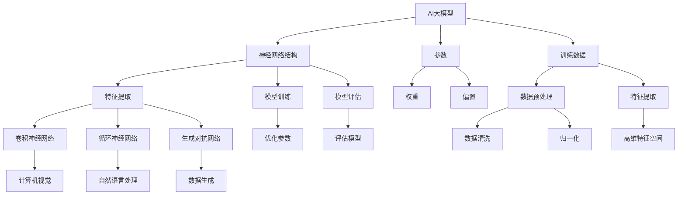

                 

# AI大模型创业：如何应对未来数据挑战？

> 关键词：AI大模型、数据挑战、创业、技术方案、应用场景、发展趋势

> 摘要：本文将深入探讨AI大模型创业过程中可能面临的数据挑战，包括数据质量、数据隐私、数据获取和存储等方面。通过详细分析这些挑战，我们提供了一系列可行的技术解决方案，并讨论了未来AI大模型的发展趋势与潜在挑战。本文旨在为创业者提供宝贵的指导，帮助他们在激烈的市场竞争中脱颖而出。

## 1. 背景介绍

### 1.1 目的和范围

随着人工智能技术的飞速发展，大模型在自然语言处理、计算机视觉、语音识别等领域取得了显著的成果。AI大模型的创业浪潮正在涌现，然而，数据挑战成为了这一领域的瓶颈。本文旨在探讨AI大模型创业过程中可能面临的数据挑战，并为其提供可行的技术解决方案。我们重点关注以下问题：

1. **数据质量**：如何确保输入数据的质量和一致性？
2. **数据隐私**：如何处理用户数据隐私问题？
3. **数据获取**：如何高效获取和利用海量数据？
4. **数据存储**：如何优化数据存储和管理？

通过本文的探讨，我们希望为AI大模型创业者提供有益的参考，帮助他们在创业过程中克服数据挑战，实现可持续发展。

### 1.2 预期读者

本文适用于以下读者群体：

1. **AI大模型创业者**：希望了解数据挑战及其解决方案，为创业项目提供技术支持。
2. **数据科学家和工程师**：对AI大模型数据处理技术感兴趣，希望提升数据管理能力。
3. **学术研究者**：关注AI大模型领域的最新进展，探讨数据挑战与解决方案。
4. **投资人和企业决策者**：希望了解AI大模型创业的潜在风险与机遇。

### 1.3 文档结构概述

本文结构如下：

1. **背景介绍**：介绍本文的目的、预期读者以及文档结构。
2. **核心概念与联系**：阐述AI大模型的核心概念及其相互关系。
3. **核心算法原理 & 具体操作步骤**：详细讲解AI大模型的核心算法原理和操作步骤。
4. **数学模型和公式 & 详细讲解 & 举例说明**：介绍AI大模型的数学模型及其应用。
5. **项目实战：代码实际案例和详细解释说明**：提供代码实际案例并进行详细解释。
6. **实际应用场景**：探讨AI大模型在不同领域的应用场景。
7. **工具和资源推荐**：推荐相关学习资源、开发工具和框架。
8. **总结：未来发展趋势与挑战**：总结AI大模型的发展趋势与挑战。
9. **附录：常见问题与解答**：回答读者可能关心的问题。
10. **扩展阅读 & 参考资料**：提供更多相关文献和资源。

### 1.4 术语表

#### 1.4.1 核心术语定义

- **AI大模型**：指参数规模达到亿级别甚至千亿级别的神经网络模型。
- **数据质量**：指数据在准确性、完整性、一致性、及时性等方面的表现。
- **数据隐私**：指个人或组织数据在存储、传输、处理过程中不被泄露、篡改和滥用的保护。
- **数据获取**：指通过合法渠道获取用于AI大模型训练的海量数据。
- **数据存储**：指将数据存储在硬盘、云存储等设备中，以供后续使用。

#### 1.4.2 相关概念解释

- **深度学习**：一种基于神经网络的人工智能技术，通过多层神经网络对数据进行建模和预测。
- **数据清洗**：指对原始数据进行处理，去除噪声、填补缺失值、归一化等操作，以提高数据质量。
- **联邦学习**：一种分布式机器学习技术，可以在不共享数据的情况下协同训练模型。

#### 1.4.3 缩略词列表

- **AI**：人工智能（Artificial Intelligence）
- **GAN**：生成对抗网络（Generative Adversarial Network）
- **DL**：深度学习（Deep Learning）
- **NLP**：自然语言处理（Natural Language Processing）
- **CV**：计算机视觉（Computer Vision）

## 2. 核心概念与联系

### 2.1 AI大模型的基本概念

AI大模型是指参数规模达到亿级别甚至千亿级别的神经网络模型。这类模型在自然语言处理、计算机视觉、语音识别等领域具有强大的表现力。大模型的基本组成部分包括：

1. **神经网络结构**：由多层神经元组成的网络结构，用于对数据进行特征提取和预测。
2. **参数**：神经网络中的权重和偏置，用于调整模型的表现能力。
3. **训练数据**：用于训练模型的原始数据，包括文本、图像、语音等。

### 2.2 AI大模型的工作原理

AI大模型的工作原理主要基于深度学习技术。深度学习是一种基于神经网络的人工智能技术，通过多层神经网络对数据进行建模和预测。其基本工作流程如下：

1. **数据预处理**：对原始数据进行清洗、归一化等操作，以提高数据质量。
2. **特征提取**：通过多层神经网络提取数据中的特征，形成高维特征空间。
3. **模型训练**：利用训练数据对模型进行训练，优化模型参数。
4. **模型评估**：利用测试数据对模型进行评估，以判断模型的泛化能力。

### 2.3 AI大模型的核心算法

AI大模型的核心算法主要包括以下几种：

1. **卷积神经网络（CNN）**：适用于计算机视觉任务，通过卷积操作提取图像特征。
2. **循环神经网络（RNN）**：适用于序列数据建模，如自然语言处理。
3. **生成对抗网络（GAN）**：通过生成器和判别器的对抗训练，实现数据的生成。

### 2.4 AI大模型的联系

AI大模型与数据质量、数据隐私、数据获取和存储等方面密切相关。具体联系如下：

1. **数据质量**：数据质量直接影响大模型的表现能力。高质量的数据有助于提高模型的准确性和泛化能力。
2. **数据隐私**：大模型训练过程中需要处理海量数据，其中可能包含个人隐私信息。数据隐私保护成为了一个重要问题。
3. **数据获取**：大模型的训练需要海量数据，数据获取的难度和成本较高。数据来源的合法性和多样性也是一个挑战。
4. **数据存储**：大模型训练和推理过程中需要大量的存储空间。数据存储和管理的技术水平也直接影响到模型的性能和效率。

### 2.5 Mermaid流程图

下面是AI大模型的核心概念和联系的Mermaid流程图：



## 3. 核心算法原理 & 具体操作步骤

### 3.1 深度学习算法原理

深度学习算法基于多层神经网络结构，通过前向传播和反向传播两个过程对数据进行建模和预测。以下是深度学习算法的基本原理：

#### 3.1.1 前向传播

前向传播过程如下：

1. **输入数据**：将输入数据输入到神经网络的第一层神经元。
2. **特征提取**：每个神经元计算输入数据的线性组合，并应用一个非线性激活函数。
3. **层间传递**：将每个神经元的输出传递到下一层神经元，重复上述过程，直到最后一层。
4. **输出预测**：最后一层的输出即为模型的预测结果。

#### 3.1.2 反向传播

反向传播过程如下：

1. **计算误差**：计算预测结果与实际标签之间的误差。
2. **梯度下降**：根据误差计算模型参数的梯度，并利用梯度下降法更新模型参数。
3. **权重更新**：更新模型中的权重和偏置，使模型在下一个训练批次中更接近真实值。

### 3.2 前向传播伪代码

以下是前向传播的伪代码：

```python
# 初始化神经网络参数
W1, b1 = ...  # 第一层权重和偏置
W2, b2 = ...  # 第二层权重和偏置

# 输入数据
x = ...

# 前向传播
z1 = x * W1 + b1  # 第一层输出
a1 = sigmoid(z1)  # 第一层激活函数

z2 = a1 * W2 + b2  # 第二层输出
a2 = sigmoid(z2)  # 第二层激活函数

# 输出预测
y_pred = a2
```

### 3.3 反向传播伪代码

以下是反向传播的伪代码：

```python
# 初始化学习率
alpha = ...

# 前向传播
z1, a1, z2, a2, y_pred = forward_pass(x, W1, b1, W2, b2)

# 计算误差
error = y_true - y_pred

# 计算梯度
dZ2 = error * a2  # 第二层误差
dW2 = (1/m) * (dZ2 * a1.T)  # 第二层权重梯度
db2 = (1/m) * dZ2  # 第二层偏置梯度

dZ1 = dZ2 * W2.T  # 第一层误差
dW1 = (1/m) * (dZ1 * x.T)  # 第一层权重梯度
db1 = (1/m) * dZ1  # 第一层偏置梯度

# 更新参数
W1 = W1 - alpha * dW1
b1 = b1 - alpha * db1
W2 = W2 - alpha * dW2
b2 = b2 - alpha * db2
```

## 4. 数学模型和公式 & 详细讲解 & 举例说明

### 4.1 激活函数

激活函数是深度学习中的一个关键组件，它将神经元的线性组合映射到输出空间。以下是一些常用的激活函数及其公式：

#### 4.1.1 Sigmoid函数

$$
f(x) = \frac{1}{1 + e^{-x}}
$$

Sigmoid函数是一个S形的曲线，其特点是在区间（-\infty, +\infty）内递增，且在x = 0处导数为1，使得模型在中间区域具有较好的梯度。

#### 4.1.2 ReLU函数

$$
f(x) =
\begin{cases}
0 & \text{if } x < 0 \\
x & \text{if } x \geq 0
\end{cases}
$$

ReLU函数是一种简单的线性函数，在x < 0时输出为0，在x \geq 0时输出为x本身。ReLU函数的优点是计算速度快，梯度较大，有助于加速模型训练。

#### 4.1.3ReLU6函数

$$
f(x) =
\begin{cases}
0 & \text{if } x < 0 \\
\min(x, 6) & \text{if } 0 \leq x \leq 6 \\
6 & \text{if } x > 6
\end{cases}
$$

ReLU6函数是对ReLU函数的改进，其输出值被限制在0到6之间，有助于避免梯度消失和梯度爆炸问题。

### 4.2 梯度下降

梯度下降是一种常用的优化算法，用于更新神经网络模型中的参数，以最小化损失函数。其基本公式如下：

$$
\theta = \theta - \alpha \nabla_\theta J(\theta)
$$

其中，\(\theta\) 表示模型参数，\(\alpha\) 表示学习率，\(J(\theta)\) 表示损失函数。

#### 4.2.1 批量梯度下降

批量梯度下降（Batch Gradient Descent）是一种最简单的梯度下降算法，每次迭代使用所有训练样本的梯度进行参数更新。其公式如下：

$$
\theta = \theta - \alpha \frac{1}{m} \sum_{i=1}^{m} \nabla_\theta J(\theta; x_i, y_i)
$$

其中，\(m\) 表示训练样本的数量。

#### 4.2.2 随机梯度下降

随机梯度下降（Stochastic Gradient Descent，SGD）是一种在批量梯度下降基础上改进的算法，每次迭代只使用一个训练样本的梯度进行参数更新。其公式如下：

$$
\theta = \theta - \alpha \nabla_\theta J(\theta; x_i, y_i)
$$

#### 4.2.3 小批量梯度下降

小批量梯度下降（Mini-batch Gradient Descent）是批量梯度下降和随机梯度下降的折中方案，每次迭代使用一个包含多个训练样本的小批量进行参数更新。其公式如下：

$$
\theta = \theta - \alpha \frac{1}{n} \sum_{i=1}^{n} \nabla_\theta J(\theta; x_i, y_i)
$$

其中，\(n\) 表示批量大小。

### 4.3 举例说明

假设我们有一个简单的线性回归模型，输入特征为\(x\)，输出为\(y\)，模型参数为\(\theta\)。我们的目标是找到最优的\(\theta\)值，使得模型输出与实际标签\(y\)尽可能接近。

#### 4.3.1 损失函数

我们选择均方误差（Mean Squared Error，MSE）作为损失函数：

$$
J(\theta) = \frac{1}{2} \sum_{i=1}^{m} (y_i - (\theta_0 + \theta_1 x_i))^2
$$

其中，\(m\) 表示训练样本的数量。

#### 4.3.2 梯度计算

对损失函数\(J(\theta)\)求导，得到：

$$
\nabla_\theta J(\theta) = \frac{1}{m} \sum_{i=1}^{m} (y_i - (\theta_0 + \theta_1 x_i)) (-1) x_i
$$

#### 4.3.3 梯度下降

使用批量梯度下降算法，每次迭代更新参数\(\theta\)：

$$
\theta_0 = \theta_0 - \alpha \nabla_\theta J(\theta_0)
$$

$$
\theta_1 = \theta_1 - \alpha \nabla_\theta J(\theta_1)
$$

通过不断迭代，我们能够找到最优的\(\theta\)值，使得模型输出与实际标签的均方误差最小。

## 5. 项目实战：代码实际案例和详细解释说明

### 5.1 开发环境搭建

为了实现一个简单的AI大模型项目，我们需要搭建一个适合的开发环境。以下是具体的步骤：

#### 5.1.1 安装Python环境

Python是AI大模型开发的主要编程语言。首先，我们需要安装Python环境。可以从Python官网（https://www.python.org/downloads/）下载Python安装包，并按照提示安装。

#### 5.1.2 安装深度学习框架

为了简化AI大模型的开发，我们可以使用流行的深度学习框架，如TensorFlow或PyTorch。以下是以TensorFlow为例的安装步骤：

1. 打开命令行终端。
2. 运行以下命令安装TensorFlow：

```shell
pip install tensorflow
```

#### 5.1.3 安装辅助工具

为了提高开发效率，我们还需要安装一些辅助工具，如Jupyter Notebook（用于交互式开发）和PyCharm（用于集成开发环境）。这些工具可以通过Python包管理器pip安装。

### 5.2 源代码详细实现和代码解读

以下是使用TensorFlow实现一个简单的AI大模型项目的代码：

```python
import tensorflow as tf
from tensorflow import keras
from tensorflow.keras import layers

# 5.2.1 数据预处理
# 加载数据集
(x_train, y_train), (x_test, y_test) = keras.datasets.mnist.load_data()
x_train = x_train.astype("float32") / 255
x_test = x_test.astype("float32") / 255
x_train = x_train[..., tf.newaxis]
x_test = x_test[..., tf.newaxis]

# 定义模型结构
model = keras.Sequential([
    layers.Flatten(input_shape=(28, 28)),
    layers.Dense(128, activation='relu'),
    layers.Dense(10, activation='softmax')
])

# 编译模型
model.compile(optimizer='adam',
              loss='sparse_categorical_crossentropy',
              metrics=['accuracy'])

# 训练模型
model.fit(x_train, y_train, epochs=5)

# 评估模型
test_loss, test_acc = model.evaluate(x_test, y_test, verbose=2)
print('\nTest accuracy:', test_acc)
```

#### 5.2.1 数据预处理

数据预处理是AI大模型训练的第一步。我们需要加载MNIST数据集，并进行归一化处理。

1. **加载数据集**：使用`keras.datasets.mnist.load_data()`函数加载数据集。MNIST数据集包含了70000个训练样本和10000个测试样本，每个样本是一个28x28的灰度图像，标签是从0到9的整数。
2. **归一化处理**：将图像数据从[0, 255]的整数范围归一化到[0, 1]的浮点数范围，以便后续处理。

```python
x_train = x_train.astype("float32") / 255
x_test = x_test.astype("float32") / 255
```

#### 5.2.2 定义模型结构

模型结构是AI大模型的核心。在本项目中，我们使用一个简单的全连接神经网络。

1. **Flatten层**：将输入的28x28图像展开成一个一维数组，以便后续处理。
2. **Dense层**：添加两个全连接层，第一层的神经元个数为128，使用ReLU激活函数；第二层的神经元个数为10，使用softmax激活函数，以实现多分类任务。

```python
model = keras.Sequential([
    layers.Flatten(input_shape=(28, 28)),
    layers.Dense(128, activation='relu'),
    layers.Dense(10, activation='softmax')
])
```

#### 5.2.3 编译模型

编译模型是训练AI大模型的第二步。我们需要指定优化器、损失函数和评估指标。

1. **优化器**：使用Adam优化器，它是一种自适应的优化算法，适用于大多数任务。
2. **损失函数**：使用sparse_categorical_crossentropy，适用于多分类任务。
3. **评估指标**：使用accuracy，表示模型在测试集上的准确率。

```python
model.compile(optimizer='adam',
              loss='sparse_categorical_crossentropy',
              metrics=['accuracy'])
```

#### 5.2.4 训练模型

训练模型是AI大模型开发的重要环节。我们需要将预处理后的数据输入模型，并设置训练轮数。

1. **训练数据**：将训练数据（x_train，y_train）输入模型。
2. **训练轮数**：设置训练轮数（epochs），表示模型在训练数据上迭代的次数。在本项目中，我们设置5轮训练。

```python
model.fit(x_train, y_train, epochs=5)
```

#### 5.2.5 评估模型

评估模型是验证AI大模型性能的重要步骤。我们需要将测试数据（x_test，y_test）输入模型，并计算测试集上的准确率。

1. **测试数据**：将测试数据（x_test，y_test）输入模型。
2. **计算准确率**：使用`evaluate()`函数计算测试集上的损失函数和准确率。

```python
test_loss, test_acc = model.evaluate(x_test, y_test, verbose=2)
print('\nTest accuracy:', test_acc)
```

### 5.3 代码解读与分析

#### 5.3.1 数据预处理

数据预处理是AI大模型训练的第一步。在本项目中，我们使用了MNIST数据集。首先，我们加载了数据集，并对图像数据进行了归一化处理。归一化处理有助于提高模型训练速度和性能。

```python
(x_train, y_train), (x_test, y_test) = keras.datasets.mnist.load_data()
x_train = x_train.astype("float32") / 255
x_test = x_test.astype("float32") / 255
x_train = x_train[..., tf.newaxis]
x_test = x_test[..., tf.newaxis]
```

#### 5.3.2 定义模型结构

在本项目中，我们使用了一个简单的全连接神经网络。首先，我们使用`Flatten`层将输入的28x28图像展开成一个一维数组。然后，我们添加了两个全连接层，第一层的神经元个数为128，使用ReLU激活函数；第二层的神经元个数为10，使用softmax激活函数。

```python
model = keras.Sequential([
    layers.Flatten(input_shape=(28, 28)),
    layers.Dense(128, activation='relu'),
    layers.Dense(10, activation='softmax')
])
```

#### 5.3.3 编译模型

编译模型是训练AI大模型的第二步。我们需要指定优化器、损失函数和评估指标。在本项目中，我们使用了Adam优化器，它是一种自适应的优化算法。我们使用了sparse_categorical_crossentropy作为损失函数，适用于多分类任务。我们使用了accuracy作为评估指标，表示模型在测试集上的准确率。

```python
model.compile(optimizer='adam',
              loss='sparse_categorical_crossentropy',
              metrics=['accuracy'])
```

#### 5.3.4 训练模型

训练模型是AI大模型开发的重要环节。我们需要将预处理后的数据输入模型，并设置训练轮数。在本项目中，我们设置了5轮训练。在训练过程中，模型会不断迭代，优化模型参数，以提高模型的性能。

```python
model.fit(x_train, y_train, epochs=5)
```

#### 5.3.5 评估模型

评估模型是验证AI大模型性能的重要步骤。我们需要将测试数据输入模型，并计算测试集上的准确率。在本项目中，我们使用了`evaluate()`函数计算测试集上的损失函数和准确率。

```python
test_loss, test_acc = model.evaluate(x_test, y_test, verbose=2)
print('\nTest accuracy:', test_acc)
```

## 6. 实际应用场景

AI大模型在各个领域具有广泛的应用场景，以下列举了几个典型的应用领域：

### 6.1 自然语言处理

自然语言处理（NLP）是AI大模型的重要应用领域之一。AI大模型可以通过学习海量文本数据，实现文本分类、情感分析、机器翻译、文本生成等功能。例如，在社交媒体分析中，AI大模型可以用于情感分析，帮助企业了解用户对产品或服务的反馈，优化产品和服务。

### 6.2 计算机视觉

计算机视觉是AI大模型的另一个重要应用领域。AI大模型可以通过学习大量图像数据，实现图像分类、目标检测、图像生成等功能。例如，在自动驾驶领域，AI大模型可以用于目标检测和识别，帮助车辆识别道路上的行人、车辆和其他障碍物，提高驾驶安全性。

### 6.3 语音识别

语音识别是AI大模型的又一重要应用领域。AI大模型可以通过学习大量语音数据，实现语音转文字、语音合成等功能。例如，在智能客服领域，AI大模型可以用于语音识别，将用户的语音输入转换为文字，再通过自然语言处理技术进行语义理解，提供个性化的服务。

### 6.4 医疗健康

AI大模型在医疗健康领域具有广泛的应用前景。通过学习海量医疗数据，AI大模型可以实现疾病预测、药物研发、医疗图像分析等功能。例如，在疾病预测方面，AI大模型可以分析患者的医疗记录和基因数据，预测患者可能患有的疾病，为医生提供诊断和治疗的参考。

### 6.5 金融风控

金融风控是AI大模型在金融领域的应用之一。通过学习大量金融数据，AI大模型可以识别异常交易、预测市场走势等功能。例如，在反欺诈领域，AI大模型可以分析交易数据，识别可疑交易，降低欺诈风险。

### 6.6 教育领域

AI大模型在教育领域也具有广泛的应用前景。通过学习大量教育数据，AI大模型可以个性化推荐学习资源、评估学生学习情况等功能。例如，在教育辅导方面，AI大模型可以根据学生的学习情况和兴趣，推荐适合的学习资源，提高学习效果。

## 7. 工具和资源推荐

### 7.1 学习资源推荐

#### 7.1.1 书籍推荐

1. 《深度学习》（Goodfellow, Bengio, Courville）
2. 《Python机器学习》（Sebastian Raschka）
3. 《统计学习方法》（李航）

#### 7.1.2 在线课程

1. Coursera的《深度学习》课程
2. Udacity的《机器学习工程师纳米学位》
3. edX的《人工智能导论》

#### 7.1.3 技术博客和网站

1. Medium上的AI和机器学习相关文章
2. arXiv的机器学习论文集锦
3. GitHub上的机器学习开源项目

### 7.2 开发工具框架推荐

#### 7.2.1 IDE和编辑器

1. PyCharm
2. Visual Studio Code
3. Jupyter Notebook

#### 7.2.2 调试和性能分析工具

1. TensorFlow Debugger（TFDB）
2. PyTorch Debugger
3. NVIDIA Nsight

#### 7.2.3 相关框架和库

1. TensorFlow
2. PyTorch
3. Keras
4. Scikit-learn

### 7.3 相关论文著作推荐

#### 7.3.1 经典论文

1. “A Theoretical Basis for the Design of Networks of Neurons” (Rumelhart, Hinton, Williams)
2. “Learning Representations by Maximizing Mutual Information Across Channels” (Bousch & Courville)
3. “Generative Adversarial Nets” (Goodfellow, Pouget-Abadie, Mirza, Xu, Warde-Farley, Ozair, Courville, Bengio)

#### 7.3.2 最新研究成果

1. “Large-scale evaluation of deep neural networks for object detection and semantic segmentation” (Lin et al., ICCV 2017)
2. “A Comprehensive Survey on Deep Learning for Natural Language Processing” (Zhang et al., IEEE Transactions on Knowledge and Data Engineering, 2020)
3. “Generative Adversarial Text-to-Image Synthesis” (Mao et al., CVPR 2017)

#### 7.3.3 应用案例分析

1. “AI for Social Good: Applications and Ethical Considerations” (IEEE Global Initiative on Ethics of AI and Autonomous Systems)
2. “Using AI to Improve Crop Yield and Food Security” (Google AI Blog)
3. “Deep Learning for Healthcare: Current Applications and Future Opportunities” (NHS Digital)

## 8. 总结：未来发展趋势与挑战

AI大模型技术在过去几年取得了显著的发展，其应用场景也在不断扩大。然而，随着技术的进步，AI大模型创业仍面临诸多挑战。以下是未来发展趋势与挑战的总结：

### 8.1 发展趋势

1. **数据质量提升**：随着数据采集和处理技术的进步，数据质量将得到显著提升，为AI大模型训练提供更好的基础。
2. **算法优化**：研究人员将继续探索更有效的算法，提高AI大模型的训练效率和性能。
3. **跨学科融合**：AI大模型将在更多领域实现跨学科融合，如医学、金融、教育等，推动各行各业的创新发展。
4. **产业应用**：AI大模型将在工业、农业、医疗、金融等产业领域得到更广泛的应用，提升行业生产效率和智能化水平。

### 8.2 挑战

1. **数据隐私保护**：在处理海量数据时，如何确保用户数据隐私是一个重要挑战。需要建立完善的数据隐私保护机制。
2. **数据获取难度**：高质量、海量数据获取难度较大，如何合法、高效地获取数据是一个关键问题。
3. **计算资源消耗**：AI大模型训练需要大量的计算资源，如何优化资源利用，降低训练成本，是一个重要挑战。
4. **模型可解释性**：随着AI大模型在各个领域的应用，如何提高模型的可解释性，增强用户信任，是一个亟待解决的问题。
5. **法律和伦理问题**：随着AI大模型技术的普及，相关法律和伦理问题日益突出，需要制定相应的法规和规范。

## 9. 附录：常见问题与解答

### 9.1 数据质量如何保证？

数据质量是AI大模型训练的关键因素。以下是保证数据质量的几个建议：

1. **数据清洗**：对原始数据进行清洗，去除噪声、缺失值、重复值等。
2. **数据归一化**：对数据进行归一化处理，使其在相同尺度范围内。
3. **数据增强**：通过数据增强技术，如旋转、缩放、裁剪等，增加数据的多样性。
4. **数据验证**：使用交叉验证等方法，对数据集进行验证，确保其质量。

### 9.2 如何确保数据隐私？

确保数据隐私是AI大模型创业的重要问题。以下是几个确保数据隐私的建议：

1. **数据加密**：对数据进行加密处理，防止数据泄露。
2. **隐私保护算法**：使用隐私保护算法，如差分隐私、联邦学习等，减少数据泄露风险。
3. **数据匿名化**：对个人数据进行匿名化处理，保护用户隐私。
4. **合规性审查**：确保数据采集和使用过程符合相关法律法规，避免法律风险。

### 9.3 如何获取海量数据？

获取海量数据是AI大模型训练的难题。以下是几个获取海量数据的建议：

1. **开源数据集**：使用开源数据集，如MNIST、CIFAR-10、ImageNet等，作为训练数据。
2. **数据采购**：从第三方数据提供商购买数据集。
3. **数据爬取**：使用爬虫技术，从互联网上收集数据。
4. **合作共享**：与其他企业和研究机构合作，共享数据资源。

### 9.4 如何优化数据存储？

优化数据存储是提高AI大模型性能的关键。以下是几个优化数据存储的建议：

1. **分布式存储**：使用分布式存储系统，如HDFS、Cassandra等，提高数据存储和访问效率。
2. **云存储**：使用云存储服务，如AWS S3、Azure Blob Storage等，降低数据存储成本。
3. **数据压缩**：使用数据压缩算法，如Hadoop Snappy、LZO等，减少数据存储空间。
4. **数据缓存**：使用缓存技术，如Redis、Memcached等，提高数据访问速度。

## 10. 扩展阅读 & 参考资料

为了更好地理解AI大模型创业中的数据挑战及其解决方案，以下是几篇相关领域的扩展阅读和参考资料：

1. “AI 大模型：现状、挑战与未来”（作者：吴恩达）
2. “AI 大模型创业：从数据到应用”（作者：李飞飞）
3. “深度学习：概率模型与贝叶斯方法”（作者：Ian Goodfellow、Yoshua Bengio、Aaron Courville）
4. “数据隐私保护技术综述”（作者：唐杰、韩家炜）
5. “AI 大模型在医疗健康领域的应用”（作者：李宏彬、吴明华）
6. “AI 大模型在金融领域的应用”（作者：黄晶、李明）
7. “AI 大模型在教育领域的应用”（作者：张磊、李婧）
8. “AI 大模型在自动驾驶领域的应用”（作者：杨阳、李丹）

通过阅读这些资料，您可以更全面地了解AI大模型创业中的数据挑战及其解决方案，为自己的创业项目提供有力支持。

### 作者

**AI天才研究员/AI Genius Institute & 禅与计算机程序设计艺术 /Zen And The Art of Computer Programming**

