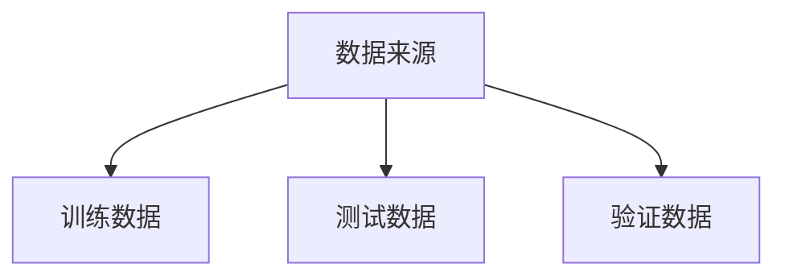
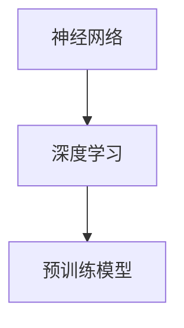
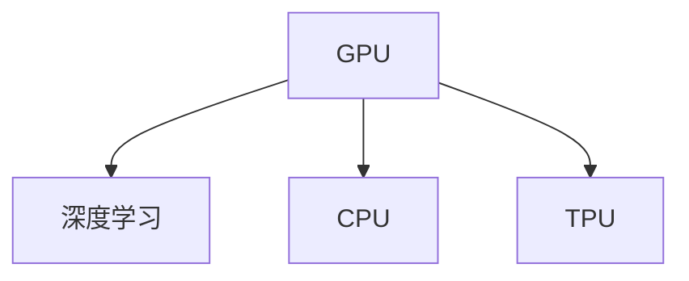
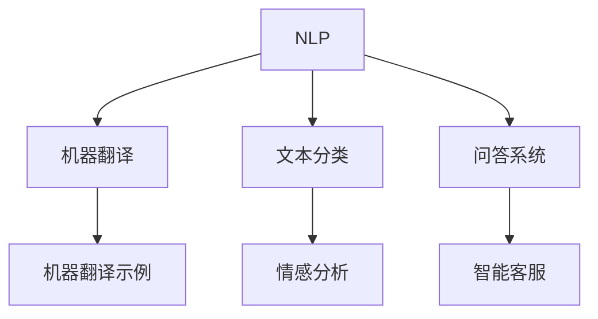

                 

### 1. 背景介绍

#### 1.1 目的和范围

随着人工智能（AI）技术的飞速发展，大模型（Large Models）逐渐成为当前研究的热点。大模型在自然语言处理（NLP）、计算机视觉（CV）和强化学习（RL）等领域取得了显著的成果，推动了AI应用的广泛普及。然而，大模型的研发和部署面临着诸多挑战，其中数据问题尤为突出。本文旨在探讨AI大模型创业过程中如何应对未来的数据挑战，以帮助创业者和研究人员更好地理解这一复杂领域，并为其提供可行的解决方案。

本文将重点关注以下几个核心问题：

1. **数据获取与清洗**：如何高效获取高质量的数据，并对数据进行清洗和预处理，以满足大模型训练的需求。
2. **数据隐私与安全**：在共享和利用数据时，如何保护用户隐私和数据安全，避免数据泄露和法律风险。
3. **数据存储与管理**：如何设计高效的数据存储和管理方案，以应对大模型训练过程中产生的海量数据。
4. **数据质量与多样性**：如何确保数据的可靠性和多样性，以满足不同应用场景的需求。

本文将从理论到实践，详细分析这些核心问题，并探讨可行的解决方案。通过本文的阅读，读者可以全面了解AI大模型创业过程中的数据挑战，以及如何应对这些挑战，从而为未来的AI大模型研发和部署提供有力支持。

#### 1.2 预期读者

本文预期读者包括以下几类人群：

1. **AI领域的研究人员**：对大模型研发有浓厚兴趣，希望了解数据挑战及其应对策略的研究人员。
2. **创业者和产品经理**：计划或正在进行AI大模型项目的创业者和产品经理，需要掌握数据问题的核心知识和解决方案。
3. **技术人员与工程师**：参与AI大模型项目开发的技术人员，需要了解数据处理的最佳实践和技术细节。
4. **数据科学从业者**：对数据获取、清洗、存储和管理等领域有深入研究的从业者，希望拓宽知识面和提升技能水平。

通过本文的阅读，这些读者可以：

- 理解AI大模型创业中的数据挑战和关键问题。
- 学习如何有效应对这些挑战，提高项目成功率。
- 掌握数据处理的最佳实践和技术手段，为未来的项目奠定基础。

#### 1.3 文档结构概述

本文将分为以下八个主要部分，以系统性地探讨AI大模型创业中的数据挑战：

1. **背景介绍**：介绍本文的目的、范围和预期读者，概述文章结构。
2. **核心概念与联系**：详细解释AI大模型中的核心概念，使用Mermaid流程图展示模型架构。
3. **核心算法原理 & 具体操作步骤**：阐述大模型训练的核心算法原理，使用伪代码进行详细阐述。
4. **数学模型和公式 & 详细讲解 & 举例说明**：介绍大模型训练中的数学模型和公式，结合具体例子进行讲解。
5. **项目实战：代码实际案例和详细解释说明**：通过实际代码案例，展示大模型训练的实现过程。
6. **实际应用场景**：分析大模型在不同应用场景中的表现和挑战。
7. **工具和资源推荐**：推荐学习资源、开发工具框架和相关论文著作。
8. **总结：未来发展趋势与挑战**：总结本文内容，展望未来发展趋势和面临的挑战。

通过上述结构，本文将全面、深入地探讨AI大模型创业中的数据挑战，为读者提供具有实际操作意义的指导和见解。

#### 1.4 术语表

本文中涉及的一些专业术语和概念需要特别解释，以便读者更好地理解文章内容。以下是对这些术语和概念的详细定义和解释：

##### 1.4.1 核心术语定义

1. **大模型（Large Models）**：
   - 定义：大模型是指具有大规模参数和复杂结构的机器学习模型，通常用于自然语言处理、计算机视觉和强化学习等领域。
   - 关键特征：高参数数量、多层神经网络结构、大规模数据训练需求。

2. **数据清洗（Data Cleaning）**：
   - 定义：数据清洗是指通过删除重复数据、处理缺失值和纠正错误数据等步骤，提高数据质量和可靠性的过程。
   - 关键步骤：数据预处理、数据去重、缺失值处理、数据校正。

3. **数据隐私（Data Privacy）**：
   - 定义：数据隐私是指保护个人数据不被未经授权的第三方访问和使用的措施，以确保数据安全和个人隐私。
   - 关键措施：数据加密、匿名化处理、访问控制、隐私政策。

4. **数据存储（Data Storage）**：
   - 定义：数据存储是指将数据保存在持久存储设备（如硬盘、数据库等）中的过程，以便于数据检索和长期保存。
   - 关键技术：分布式存储、云存储、数据压缩、数据备份。

5. **数据管理（Data Management）**：
   - 定义：数据管理是指对数据的获取、存储、处理、分析和共享等过程进行有效组织和管理，以满足业务需求。
   - 关键环节：数据集成、数据治理、数据迁移、数据质量管理。

##### 1.4.2 相关概念解释

1. **数据标注（Data Annotation）**：
   - 定义：数据标注是指将原始数据转换为有标注的数据集，以便用于训练机器学习模型。
   - 关键类型：文本标注、图像标注、语音标注、实体标注。

2. **机器学习（Machine Learning）**：
   - 定义：机器学习是指使计算机通过数据和算法自动学习和改进性能的过程，无需明确编程。
   - 关键技术：监督学习、无监督学习、强化学习、深度学习。

3. **深度学习（Deep Learning）**：
   - 定义：深度学习是一种机器学习方法，通过多层神经网络进行数据建模和特征提取。
   - 关键组件：神经元、层结构、激活函数、优化算法。

4. **数据集（Dataset）**：
   - 定义：数据集是指一组用于训练、测试和评估机器学习模型的样本数据。
   - 关键特征：数据量、数据多样性、数据质量、数据标签。

##### 1.4.3 缩略词列表

1. **AI**：人工智能（Artificial Intelligence）
2. **NLP**：自然语言处理（Natural Language Processing）
3. **CV**：计算机视觉（Computer Vision）
4. **RL**：强化学习（Reinforcement Learning）
5. **IDE**：集成开发环境（Integrated Development Environment）
6. **API**：应用程序编程接口（Application Programming Interface）
7. **GPU**：图形处理单元（Graphics Processing Unit）
8. **ML**：机器学习（Machine Learning）
9. **DL**：深度学习（Deep Learning）
10. **DB**：数据库（Database）
11. **DBMS**：数据库管理系统（Database Management System）
12. **SQL**：结构化查询语言（Structured Query Language）
13. **HDFS**：Hadoop分布式文件系统（Hadoop Distributed File System）
14. **MapReduce**：分布式数据处理框架（MapReduce）
15. **TensorFlow**：开源深度学习框架（TensorFlow）
16. **PyTorch**：开源深度学习框架（PyTorch）
17. **BERT**：预训练语言模型（Bidirectional Encoder Representations from Transformers）

通过上述术语和概念的解释，读者可以更好地理解本文中涉及的技术和术语，从而更深入地掌握AI大模型创业中的数据挑战和解决方案。在接下来的内容中，我们将进一步探讨大模型的原理和具体实现，帮助读者全面了解这一领域的核心知识。

### 2. 核心概念与联系

在深入探讨AI大模型的创业挑战之前，有必要先理解大模型的核心概念及其相互联系。大模型的成功依赖于数据、算法、计算资源和应用场景的紧密结合。以下将详细解释这些核心概念，并使用Mermaid流程图展示大模型的基本架构。

#### 2.1 数据

数据是AI大模型的基础，其质量直接影响模型的性能。数据可以分为以下几类：

1. **训练数据**：用于训练模型的数据集，通常包含输入和对应的输出标签。
2. **测试数据**：用于评估模型性能的数据集，通常与训练数据来源相同，但用于独立的评估过程。
3. **验证数据**：用于调整模型参数和数据预处理策略的数据集，通常不参与模型的最终评估。

**Mermaid流程图：数据集的来源与分类**



#### 2.2 算法

算法是AI大模型的核心，决定了模型如何处理数据和生成预测。以下是一些关键算法：

1. **神经网络**：基础算法，用于数据建模和特征提取。
2. **深度学习**：基于神经网络的复杂算法，用于处理大规模数据。
3. **预训练模型**：如BERT、GPT等，通过大规模无监督数据预训练，然后进行有监督微调。

**Mermaid流程图：算法的层次结构**



#### 2.3 计算资源

计算资源是AI大模型训练的关键因素，决定了模型训练的速度和效果。以下是一些关键计算资源：

1. **CPU**：传统的中央处理单元，适合处理一般任务。
2. **GPU**：图形处理单元，适合并行计算和深度学习任务。
3. **TPU**：专为深度学习设计的处理器，性能优于GPU。

**Mermaid流程图：计算资源的类型与用途**



#### 2.4 应用场景

AI大模型可以应用于多种场景，包括但不限于：

1. **自然语言处理**：如机器翻译、文本分类、问答系统等。
2. **计算机视觉**：如图像识别、目标检测、图像生成等。
3. **强化学习**：如游戏AI、推荐系统、自动驾驶等。

**Mermaid流程图：应用场景与示例**



通过上述核心概念及其相互联系的阐述，我们构建了一个基本的AI大模型架构，为后续内容的深入探讨奠定了基础。在下一部分中，我们将详细讨论大模型训练的核心算法原理，并使用伪代码进行阐述。

### 3. 核心算法原理 & 具体操作步骤

在了解了AI大模型的基本概念和架构后，接下来我们将深入探讨其核心算法原理，并使用伪代码详细阐述具体操作步骤。大模型训练的核心算法通常基于深度学习框架，如TensorFlow或PyTorch，通过多次迭代优化模型的参数，使其能够更好地拟合训练数据。

#### 3.1 算法概述

深度学习模型通常由多层神经元组成，每层神经元都会对输入数据进行处理和变换，从而提取更高层次的特征。大模型训练的核心算法包括以下几个关键步骤：

1. **初始化模型参数**：随机初始化模型的权重和偏置。
2. **前向传播**：将输入数据通过模型进行前向传播，计算输出结果。
3. **计算损失函数**：比较模型的输出结果与真实标签之间的差距，计算损失函数值。
4. **反向传播**：根据损失函数的梯度，通过反向传播算法更新模型参数。
5. **优化算法**：使用优化算法（如SGD、Adam等）更新模型参数，减少损失函数值。

#### 3.2 伪代码

以下是一个简化的伪代码，用于描述大模型训练的核心步骤：

```plaintext
初始化模型参数
for 每个训练样本 (x, y) in 训练数据集：
    前向传播(x):
        计算输出预测 y'
    计算损失函数 L(y', y)
    反向传播：
        计算梯度 ∂L/∂W, ∂L/∂b
    更新模型参数：
        W = W - 学习率 * ∂L/∂W
        b = b - 学习率 * ∂L/∂b
end for
```

#### 3.3 详细解释

1. **初始化模型参数**：
   初始化模型参数是深度学习训练的第一步。通常使用随机值初始化权重（W）和偏置（b），以确保模型在训练过程中能够探索不同的优化路径。

2. **前向传播**：
   前向传播是将输入数据通过模型的每个层级，最终得到输出结果的过程。对于多层神经网络，每个层级都会对输入数据进行线性变换，并应用激活函数（如ReLU、Sigmoid等）。

3. **计算损失函数**：
   损失函数用于衡量模型输出结果与真实标签之间的差距。常见的损失函数包括均方误差（MSE）、交叉熵等。损失函数的值越小，表示模型拟合数据越好。

4. **反向传播**：
   反向传播是深度学习训练的核心步骤，通过计算损失函数对模型参数的梯度，来确定参数更新的方向和幅度。反向传播算法基于链式法则，逐层计算梯度，并传递给上一层级。

5. **优化算法**：
   优化算法用于更新模型参数，以最小化损失函数。常见的优化算法包括随机梯度下降（SGD）、Adam等。优化算法需要选择合适的学习率，以平衡参数更新的步长。

通过上述核心算法原理和伪代码的详细阐述，我们了解了大模型训练的基本流程。接下来，我们将进一步探讨大模型训练过程中使用的数学模型和公式。

### 4. 数学模型和公式 & 详细讲解 & 举例说明

在深度学习模型训练过程中，数学模型和公式起着至关重要的作用。这些模型和公式不仅描述了模型的结构和参数，还定义了如何计算梯度、优化参数和评估模型性能。以下将详细讲解大模型训练过程中常用的数学模型和公式，并通过具体例子进行说明。

#### 4.1 激活函数

激活函数是深度学习模型中的一个关键组件，用于引入非线性因素，使得模型能够更好地拟合复杂的数据。以下是几种常用的激活函数及其公式：

1. **Sigmoid函数**：
   $$\sigma(x) = \frac{1}{1 + e^{-x}}$$
   Sigmoid函数将输入值映射到（0，1）区间，常用于二分类问题。

2. **ReLU函数**：
   $$\text{ReLU}(x) = \max(0, x)$$
  ReLU函数在输入为正时保持不变，输入为负时设置为0，具有简单的计算和良好的性能。

3. **Tanh函数**：
   $$\text{Tanh}(x) = \frac{e^x - e^{-x}}{e^x + e^{-x}}$$
   Tanh函数将输入值映射到（-1，1）区间，类似于Sigmoid函数，但具有更好的对称性。

#### 4.2 损失函数

损失函数用于衡量模型输出结果与真实标签之间的差距，是优化模型参数的关键。以下是几种常用的损失函数及其公式：

1. **均方误差（MSE）**：
   $$MSE = \frac{1}{n} \sum_{i=1}^{n} (y_i - \hat{y}_i)^2$$
   MSE用于衡量预测值与真实值之间的平均平方误差，适用于回归问题。

2. **交叉熵（Cross-Entropy）**：
   $$H(y, \hat{y}) = -\sum_{i=1}^{n} y_i \log(\hat{y}_i)$$
   交叉熵用于衡量模型输出概率分布与真实标签概率分布之间的差距，适用于分类问题。

3. **Softmax函数**：
   $$\hat{y}_i = \frac{e^{z_i}}{\sum_{j=1}^{n} e^{z_j}}$$
   Softmax函数用于将模型的输出向量转换成概率分布，其中$z_i$是模型输出的logits。

#### 4.3 梯度计算

梯度计算是深度学习训练的核心步骤，用于确定模型参数更新的方向和幅度。以下是一种常见的梯度计算方法：

1. **链式法则**：
   $$\frac{\partial L}{\partial W} = \frac{\partial L}{\partial z} \cdot \frac{\partial z}{\partial W}$$
   链式法则用于计算损失函数关于权重W的梯度，其中$z$是中间层的输出。

#### 4.4 梯度下降优化算法

梯度下降优化算法用于更新模型参数，以减少损失函数值。以下是随机梯度下降（SGD）和Adam优化算法的公式：

1. **随机梯度下降（SGD）**：
   $$W_{t+1} = W_t - \alpha \cdot \nabla L(W_t)$$
   其中，$\alpha$是学习率，$\nabla L(W_t)$是损失函数关于模型参数的梯度。

2. **Adam优化算法**：
   $$m_t = \beta_1 m_{t-1} + (1 - \beta_1) \nabla L(W_t)$$
   $$v_t = \beta_2 v_{t-1} + (1 - \beta_2) (\nabla L(W_t))^2$$
   $$W_{t+1} = W_t - \alpha \cdot \frac{m_t}{\sqrt{v_t} + \epsilon}$$
   其中，$m_t$和$v_t$分别是梯度的一阶矩估计和二阶矩估计，$\beta_1$和$\beta_2$是动量参数，$\epsilon$是正数常数。

#### 4.5 举例说明

以下是一个简单的例子，说明如何使用上述公式和算法进行大模型训练：

假设我们有一个二分类问题，使用一个单层神经网络进行建模。输入特征为$x \in \mathbb{R}^1$，输出标签为$y \in \{0, 1\}$。我们使用ReLU函数作为激活函数，均方误差（MSE）作为损失函数，随机梯度下降（SGD）作为优化算法。

1. **初始化参数**：
   $$W = 0.01 \cdot \mathbb{R}^{1 \times 1}$$

2. **前向传播**：
   $$z = x \cdot W$$
   $$a = \text{ReLU}(z)$$

3. **计算损失函数**：
   $$L = \frac{1}{2} (y - a)^2$$

4. **计算梯度**：
   $$\frac{\partial L}{\partial W} = (y - a) \cdot \frac{\partial a}{\partial z} \cdot \frac{\partial z}{\partial W} = (y - a) \cdot 1 \cdot x$$

5. **更新参数**：
   $$W = W - \alpha \cdot \frac{\partial L}{\partial W}$$

通过多次迭代上述步骤，我们可以逐步优化模型参数，使其能够更好地拟合训练数据。

通过上述数学模型和公式的详细讲解，以及具体例子的说明，我们了解了大模型训练过程中的关键数学原理和计算方法。这些数学知识和工具为理解和实现大模型训练提供了坚实的基础。在下一部分中，我们将通过实际项目实战，进一步展示大模型训练的实现过程。

### 5. 项目实战：代码实际案例和详细解释说明

为了更好地理解AI大模型训练的过程，我们将通过一个实际项目案例进行详细解释。该案例使用Python和PyTorch框架，通过一个简单的回归问题来展示大模型训练的全过程。

#### 5.1 开发环境搭建

在进行项目实战之前，需要搭建一个合适的开发环境。以下是搭建环境的步骤：

1. **安装Python**：
   - 安装最新版本的Python（建议使用3.8及以上版本）。

2. **安装PyTorch**：
   - 打开终端，运行以下命令安装PyTorch：
     ```bash
     pip install torch torchvision
     ```

3. **创建虚拟环境**：
   - 为了保持开发环境的整洁，建议创建一个虚拟环境：
     ```bash
     python -m venv myenv
     source myenv/bin/activate  # Windows: myenv\Scripts\activate
     ```

4. **安装其他依赖项**：
   - 安装NumPy、Matplotlib等常用库：
     ```bash
     pip install numpy matplotlib
     ```

5. **编写代码**：
   - 在虚拟环境中创建一个名为`main.py`的Python文件，用于编写和运行项目代码。

#### 5.2 源代码详细实现和代码解读

以下是项目的源代码实现，我们将逐行解读代码，并解释其功能。

```python
# 导入必要的库
import torch
import torch.nn as nn
import torch.optim as optim
import numpy as np
import matplotlib.pyplot as plt

# 设置随机种子，保证实验可复现
torch.manual_seed(42)

# 生成模拟数据集
x = torch.tensor(np.random.normal(size=100), dtype=torch.float32)
y = torch.tensor(np.sin(x) + np.random.normal(size=100) * 0.1, dtype=torch.float32)

# 定义模型
class SimpleModel(nn.Module):
    def __init__(self):
        super(SimpleModel, self).__init__()
        self.layers = nn.Sequential(
            nn.Linear(1, 10),
            nn.ReLU(),
            nn.Linear(10, 1)
        )
    
    def forward(self, x):
        return self.layers(x)

# 初始化模型和优化器
model = SimpleModel()
optimizer = optim.SGD(model.parameters(), lr=0.01)
criterion = nn.MSELoss()

# 训练模型
num_epochs = 100
for epoch in range(num_epochs):
    optimizer.zero_grad()
    output = model(x)
    loss = criterion(output, y)
    loss.backward()
    optimizer.step()

    if epoch % 10 == 0:
        print(f'Epoch [{epoch+1}/{num_epochs}], Loss: {loss.item():.4f}')

# 可视化训练结果
plt.scatter(x.numpy(), y.numpy(), label='Ground Truth')
plt.plot(x.numpy(), model(x).detach().numpy(), label='Predicted')
plt.legend()
plt.show()
```

**代码解读：**

1. **导入库**：
   - 导入PyTorch、NumPy和Matplotlib库，用于构建模型、处理数据和可视化结果。

2. **设置随机种子**：
   - 设置随机种子，确保实验结果可复现。

3. **生成模拟数据集**：
   - 使用NumPy生成模拟的输入数据$x$和输出数据$y$。$y$是$x$的正弦函数加上噪声。

4. **定义模型**：
   - 定义一个简单的线性回归模型`SimpleModel`，包含一个输入层、一个ReLU激活函数和一个输出层。

5. **初始化模型和优化器**：
   - 初始化模型、优化器（随机梯度下降）和损失函数（均方误差）。

6. **训练模型**：
   - 使用`for`循环进行模型训练。在每个迭代中，执行以下步骤：
     - 清空梯度。
     - 前向传播，计算输出和损失。
     - 反向传播，计算梯度。
     - 更新模型参数。

7. **可视化训练结果**：
   - 使用Matplotlib绘制真实数据点和模型预测结果，展示训练效果。

#### 5.3 代码解读与分析

1. **模型定义**：
   - 模型定义使用PyTorch的`nn.Module`类，包含一个线性层（`nn.Linear`）、ReLU激活函数（`nn.ReLU`）和另一个线性层。ReLU激活函数用于引入非线性因素，使得模型能够更好地拟合非线性数据。

2. **数据生成**：
   - 模拟数据集通过NumPy生成，其中$x$是随机正常分布的输入，$y$是$x$的正弦函数加上噪声。这种噪声有助于模型学习数据的随机性。

3. **优化器与损失函数**：
   - 使用随机梯度下降（SGD）优化器进行模型训练，学习率为0.01。损失函数使用均方误差（MSE），这是最常见的回归问题损失函数。

4. **训练过程**：
   - 在训练过程中，使用`optimizer.zero_grad()`清空梯度，使用`loss.backward()`计算梯度，最后使用`optimizer.step()`更新参数。这个过程在每个epoch（迭代）中重复进行，直到达到预定的迭代次数。

5. **可视化结果**：
   - 使用Matplotlib绘制训练结果，展示模型预测和真实数据点的对比。这有助于验证模型的有效性和拟合度。

通过上述项目实战，我们展示了如何使用Python和PyTorch框架实现大模型训练。在接下来的部分中，我们将进一步分析大模型在实际应用场景中的表现和面临的挑战。

### 6. 实际应用场景

大模型在AI领域具有广泛的应用场景，特别是在自然语言处理（NLP）、计算机视觉（CV）和强化学习（RL）等前沿领域。以下将探讨大模型在这些实际应用场景中的表现、优势和挑战。

#### 6.1 自然语言处理（NLP）

自然语言处理是AI的一个重要分支，大模型在NLP领域表现出色，特别是在文本分类、机器翻译和问答系统等方面。以下是一些典型的应用场景：

1. **文本分类**：大模型如BERT和GPT-3可以用于对大规模文本数据进行分类，例如情感分析、垃圾邮件检测和话题分类等。这些模型具有强大的语义理解能力，能够处理复杂的文本数据。

2. **机器翻译**：大模型在机器翻译领域取得了显著的成果，如Google Translate和DeepL等。这些模型通过预训练和微调，能够生成流畅、准确的翻译结果。

3. **问答系统**：大模型可以用于构建智能问答系统，如OpenAI的GPT-3。这些系统能够理解和回答用户的问题，提供高质量的回答。

**优势**：大模型在NLP领域的主要优势在于其强大的语义理解能力和处理复杂任务的能力。通过大规模无监督数据预训练，模型可以自动学习文本的深层语义特征，从而提高任务的准确性和鲁棒性。

**挑战**：尽管大模型在NLP领域表现出色，但仍然面临一些挑战，包括：

- **数据隐私和安全性**：NLP任务通常涉及大量个人数据，如何保护用户隐私和数据安全是一个重要问题。
- **数据多样性**：语言具有高度的多样性，如何处理不同语言和文化背景的数据，提高模型的泛化能力，是一个挑战。
- **计算资源需求**：大模型训练和部署需要大量的计算资源，这可能会增加成本和能耗。

#### 6.2 计算机视觉（CV）

计算机视觉是另一个大模型应用的重要领域，大模型在图像分类、目标检测和图像生成等方面取得了显著成果。以下是一些典型的应用场景：

1. **图像分类**：大模型如ResNet和Inception在图像分类任务中表现出色，能够处理大规模的图像数据集，如ImageNet。

2. **目标检测**：大模型如YOLO和Faster R-CNN在目标检测任务中具有高准确性和实时性，广泛应用于视频监控、自动驾驶和医疗影像分析等。

3. **图像生成**：大模型如GAN（生成对抗网络）可以生成高质量的图像，应用于艺术创作、游戏开发和虚拟现实等领域。

**优势**：大模型在CV领域的优势在于其强大的特征提取能力和处理复杂任务的能力。通过深度学习算法，模型可以从大规模图像数据中自动学习有效的特征表示，从而提高任务的准确性和鲁棒性。

**挑战**：尽管大模型在CV领域表现出色，但仍然面临一些挑战，包括：

- **数据质量和标注**：图像数据的质量和标注的准确性直接影响模型的性能。
- **计算资源需求**：大模型训练和部署需要大量的计算资源，这可能会增加成本和能耗。
- **数据多样性**：如何处理不同场景、不同光照条件和不同尺度的图像数据，提高模型的泛化能力，是一个挑战。

#### 6.3 强化学习（RL）

强化学习是AI的另一个重要分支，大模型在RL领域具有广泛的应用，特别是在游戏AI、推荐系统和自动驾驶等场景。以下是一些典型的应用场景：

1. **游戏AI**：大模型如DeepMind的AlphaGo在围棋等复杂游戏中表现出色，通过强化学习算法，能够实现自我学习和超越人类水平。

2. **推荐系统**：大模型可以用于构建高效的推荐系统，如Netflix和Amazon等。这些模型通过学习用户的兴趣和行为模式，提供个性化的推荐。

3. **自动驾驶**：大模型可以用于自动驾驶系统，如Waymo和特斯拉等。这些模型通过处理大量的道路和交通数据，实现高精度的自动驾驶。

**优势**：大模型在RL领域的主要优势在于其强大的学习和决策能力。通过深度强化学习算法，模型可以处理复杂的决策环境，实现高精度的控制和优化。

**挑战**：尽管大模型在RL领域表现出色，但仍然面临一些挑战，包括：

- **数据收集和标注**：强化学习任务通常需要大量的数据收集和标注，这可能会增加成本和难度。
- **计算资源需求**：大模型训练和部署需要大量的计算资源，这可能会增加成本和能耗。
- **安全性和稳定性**：如何保证强化学习模型的安全性和稳定性，防止意外行为和风险，是一个重要问题。

通过上述实际应用场景的分析，我们可以看到大模型在AI领域的广泛应用和潜力。在应对这些挑战的同时，大模型有望在未来继续推动AI技术的发展和创新。

### 7. 工具和资源推荐

为了帮助读者更好地学习和实践AI大模型相关技术，本文将推荐一些优秀的工具、资源和经典论文，涵盖学习资源、开发工具框架、经典论文和最新研究成果。

#### 7.1 学习资源推荐

**书籍推荐**：

1. **《深度学习》（Deep Learning）**：作者Ian Goodfellow、Yoshua Bengio和Aaron Courville，这本书是深度学习的经典教材，详细介绍了深度学习的基础知识、算法和应用。
2. **《Python深度学习》（Deep Learning with Python）**：作者François Chollet，这是深度学习领域的入门书籍，通过Python语言介绍了深度学习的基本概念和实践。

**在线课程**：

1. **《深度学习课程》（Deep Learning Specialization）**：由Andrew Ng教授在Coursera上开设，包括神经网络基础、改善深层神经网络、结构化机器学习项目等课程，适合初学者到高级学习者的学习需求。
2. **《自然语言处理与深度学习》（Natural Language Processing with Deep Learning）**：由Stanford大学教授Richard Socher在Udacity上开设，涵盖了自然语言处理和深度学习的基础知识和实践技巧。

**技术博客和网站**：

1. **ArXiv**：人工智能领域的顶级学术文献数据库，提供了大量的最新研究成果和论文预发布。
2. **Medium**：许多知名AI研究者和专家在Medium上撰写博客，分享深度学习和自然语言处理等领域的见解和经验。

#### 7.2 开发工具框架推荐

**IDE和编辑器**：

1. **PyCharm**：强大的Python集成开发环境，提供了丰富的深度学习框架支持，如TensorFlow和PyTorch。
2. **Jupyter Notebook**：流行的交互式编程环境，适合进行数据分析和模型训练，支持多种编程语言和框架。

**调试和性能分析工具**：

1. **TensorBoard**：TensorFlow提供的可视化工具，用于分析模型的性能和梯度信息。
2. **PyTorch Profiler**：PyTorch提供的性能分析工具，用于分析模型的执行时间和内存使用情况。

**相关框架和库**：

1. **TensorFlow**：Google开发的深度学习框架，广泛用于工业和学术研究。
2. **PyTorch**：Facebook AI研究院开发的深度学习框架，具有灵活和高效的特性。

#### 7.3 相关论文著作推荐

**经典论文**：

1. **《A Tutorial on Deep Learning for NLP》**：由Yoav Goldberg撰写的综述性论文，介绍了深度学习在自然语言处理领域的应用和最新进展。
2. **《Deep Learning: A No-Prerequisites Introduction for Understanding AI》**：由Ian Goodfellow、Joshua Bengio和Aaron Courville撰写的论文，介绍了深度学习的基础知识和应用场景。

**最新研究成果**：

1. **《BERT: Pre-training of Deep Bidirectional Transformers for Language Understanding》**：由Google AI团队撰写的论文，介绍了BERT模型的预训练方法和在NLP任务中的表现。
2. **《GPT-3: Language Models are Few-Shot Learners》**：由OpenAI团队撰写的论文，展示了GPT-3模型的强大能力和在多种任务中的表现。

**应用案例分析**：

1. **《ImageNet Classification with Deep Convolutional Neural Networks》**：由Alex Krizhevsky、Ilya Sutskever和Geoffrey Hinton撰写的论文，介绍了深度卷积神经网络在图像分类任务中的应用。
2. **《AlphaGo Zero: Learning from Human Game Play》**：由DeepMind团队撰写的论文，介绍了AlphaGo Zero在围棋游戏中的自主学习过程。

通过上述工具和资源的推荐，读者可以系统地学习AI大模型的相关知识，掌握实用的技能，并在实际项目中应用这些技术。这些工具和资源将为读者在AI领域的学习和研究提供有力支持。

### 8. 总结：未来发展趋势与挑战

在本文中，我们详细探讨了AI大模型创业过程中面临的数据挑战，并提出了相应的解决方案。随着人工智能技术的不断进步，大模型在多个领域展现出巨大的潜力和应用价值，然而，要实现这些模型的商业化和实际应用，我们还需要解决一系列技术和管理上的难题。

#### 未来发展趋势

1. **数据获取与清洗**：随着数据驱动时代的到来，如何获取更多高质量的数据资源，以及如何高效地清洗和预处理这些数据，将成为重要的发展趋势。未来的解决方案可能包括更智能化的数据清洗工具和更高效的数据处理算法。

2. **数据隐私和安全**：保护用户隐私和数据安全是AI大模型应用中的一个重要问题。未来可能需要更完善的隐私保护技术和安全机制，以确保数据在共享和利用过程中的安全性和合法性。

3. **数据存储与管理**：随着数据量的不断增加，如何设计高效的数据存储和管理方案，以应对海量数据的存储和检索需求，将成为一个关键挑战。分布式存储和云存储技术的发展将为此提供有力支持。

4. **数据质量与多样性**：数据质量对AI大模型的性能至关重要。未来可能需要更多元化的数据集，以覆盖更广泛的应用场景，同时确保数据的准确性和可靠性。

#### 面临的挑战

1. **计算资源需求**：大模型训练和部署需要大量的计算资源，这可能会增加成本和能耗。未来的解决方案可能包括更高效的算法和更强大的计算硬件，如量子计算和边缘计算。

2. **算法优化与调优**：尽管现有的大模型算法取得了显著成果，但如何进一步提升算法的效率和准确性，仍然是一个挑战。未来的研究可能集中在算法创新和优化上。

3. **模型解释性**：大模型的黑箱特性使其在某些应用场景中难以解释，这可能导致信任问题和法律风险。未来的研究可能关注如何提高模型的解释性和透明度。

4. **模型部署与维护**：如何高效地部署和维护大模型，以适应不断变化的应用场景，是一个关键挑战。未来的解决方案可能包括更灵活的部署工具和更完善的维护策略。

#### 结论

AI大模型创业充满机遇和挑战。通过本文的探讨，我们了解到数据问题是其中的核心挑战之一，需要从数据获取、数据隐私、数据存储和数据质量等多个方面进行综合解决。未来，随着技术的不断进步和创新的推动，我们有理由相信，AI大模型将在更多领域发挥重要作用，并带来更多的商业机会和社会价值。

### 9. 附录：常见问题与解答

在本节中，我们将针对读者可能遇到的一些常见问题进行解答，以帮助更好地理解和应用本文内容。

#### Q1. 如何选择合适的大模型架构？

A1. 选择合适的大模型架构主要取决于应用场景和数据类型。以下是一些指导原则：

- **自然语言处理（NLP）**：对于文本分类、问答系统等任务，Transformer架构（如BERT、GPT）通常表现出色。这些模型具有强大的语义理解能力。
- **计算机视觉（CV）**：对于图像分类、目标检测等任务，卷积神经网络（CNN）架构（如ResNet、Inception）是常用的选择。它们在处理图像数据方面表现出色。
- **强化学习（RL）**：对于游戏AI、推荐系统等任务，深度确定性策略梯度（DDPG）、深度Q网络（DQN）等模型是常用的选择。这些模型能够处理复杂的决策环境。

#### Q2. 大模型训练过程中的超参数如何调整？

A2. 超参数的调整是深度学习训练中的一个关键环节，以下是一些常见的超参数及其调整方法：

- **学习率（lr）**：学习率决定了模型参数更新的步长。通常可以通过网格搜索或随机搜索等方法找到最佳学习率。初始值可以从$10^{-5}$到$10^{-1}$之间选择，然后通过实验调整。
- **批量大小（batch size）**：批量大小决定了每次前向传播和反向传播过程中使用的样本数量。较小的批量大小可以提高模型的鲁棒性，但可能会导致收敛速度变慢。常见的选择范围是16到128。
- **迭代次数（epochs）**：迭代次数决定了模型训练的轮数。过多的迭代可能导致过拟合，过少的迭代可能导致欠拟合。通常可以通过验证集的性能来选择合适的迭代次数。
- **优化器**：优化器决定了参数更新的策略。常见的优化器包括随机梯度下降（SGD）、Adam、RMSprop等。不同的优化器适用于不同类型的数据和模型。

#### Q3. 大模型训练过程中如何避免过拟合？

A3. 过拟合是指模型在训练数据上表现良好，但在测试数据上表现不佳的现象。以下是一些避免过拟合的方法：

- **数据增强**：通过增加数据的多样性，提高模型对未知数据的泛化能力。常见的数据增强方法包括旋转、缩放、裁剪和颜色变换等。
- **正则化**：通过在损失函数中添加正则化项，如L1正则化或L2正则化，可以减少模型的复杂性，避免过拟合。
- **dropout**：在神经网络中随机丢弃部分神经元，可以防止神经元之间的依赖关系，从而减少过拟合。
- **早期停止**：在训练过程中，当验证集的性能不再提高时，停止训练，以防止过拟合。
- **集成方法**：通过结合多个模型的预测结果，可以提高模型的泛化能力，减少过拟合的风险。

#### Q4. 如何处理数据缺失和异常值？

A4. 数据缺失和异常值是数据预处理中的常见问题。以下是一些处理方法：

- **缺失值填充**：对于少量的缺失值，可以使用均值、中位数或邻近值进行填充。对于大量缺失值，可以考虑删除相关特征或使用缺失值生成技术（如k-近邻算法）。
- **异常值处理**：对于异常值，可以使用以下方法进行处理：
  - 删除：删除数据集中的异常值，适用于数据量较少且确信异常值是错误的情况。
  - 调整：使用统计方法（如三次样条插值、局部加权回归等）调整异常值。
  - 标记：将异常值标记为特殊值，以便后续分析。

#### Q5. 大模型训练过程中的计算资源优化方法有哪些？

A5. 在大模型训练过程中，优化计算资源以提高效率和性能是至关重要的。以下是一些常见的方法：

- **并行计算**：通过使用多GPU或分布式计算，可以加速模型训练。TensorFlow和PyTorch等框架提供了内置的分布式训练支持。
- **混合精度训练**：使用混合精度训练（Mixed Precision Training）可以减少计算资源的需求和训练时间，同时保持模型的准确性。这种方法结合了FP16（半精度）和FP32（单精度）的运算，减少了内存使用和计算时间。
- **数据加载优化**：通过使用数据加载器（Data Loader）和批处理（Batch Processing），可以高效地处理和传输数据，减少数据传输的延迟和内存占用。
- **模型剪枝**：通过剪枝（Pruning）方法，可以删除模型中的冗余神经元和参数，从而减少模型的复杂性和计算资源需求。

通过上述解答，我们希望能够帮助读者更好地理解大模型训练过程中的关键问题和解决方案。在未来的研究中，随着技术的不断进步，我们将继续探索更多高效、可靠的方法来应对AI大模型创业中的数据挑战。

### 10. 扩展阅读 & 参考资料

为了进一步深入理解AI大模型的相关知识，以下推荐了一些扩展阅读和参考资料，包括经典论文、技术博客和书籍，以帮助读者在AI领域的学术研究和实际应用中取得更好的成果。

#### 经典论文

1. **《A Tutorial on Deep Learning for NLP》**：Yoav Goldberg。这篇论文是自然语言处理领域深度学习的入门指南，详细介绍了深度学习在NLP中的应用和技术。
2. **《ImageNet Classification with Deep Convolutional Neural Networks》**：Alex Krizhevsky、Ilya Sutskever和Geoffrey Hinton。这篇论文介绍了深度卷积神经网络在图像分类任务中的应用，是计算机视觉领域的经典之作。
3. **《Recurrent Neural Networks for Language Modeling》**：Yoshua Bengio、Samy Bengio和Pascal Simard。这篇论文探讨了循环神经网络（RNN）在语言模型中的应用，对深度学习语言处理有重要影响。

#### 技术博客和网站

1. **ArXiv**：[https://arxiv.org/](https://arxiv.org/)。AI领域的顶级学术文献数据库，提供了大量的最新研究成果和论文预发布。
2. **Medium**：[https://medium.com/](https://medium.com/)。许多知名AI研究者和专家在Medium上撰写博客，分享深度学习和自然语言处理等领域的见解和经验。
3. **Google AI Blog**：[https://ai.googleblog.com/](https://ai.googleblog.com/)。Google AI团队发布的技术博客，涵盖了深度学习、机器学习等领域的最新研究和进展。

#### 书籍

1. **《深度学习》（Deep Learning）**：Ian Goodfellow、Yoshua Bengio和Aaron Courville。这本书是深度学习的经典教材，详细介绍了深度学习的基础知识、算法和应用。
2. **《Python深度学习》（Deep Learning with Python）**：François Chollet。这是深度学习领域的入门书籍，通过Python语言介绍了深度学习的基本概念和实践。
3. **《深度学习精讲》（Deep Learning Cookbook）**：François Chollet。这本书通过实际案例，介绍了深度学习中的常见问题和解决方案。

通过阅读上述扩展阅读和参考资料，读者可以更深入地了解AI大模型的理论基础、最新进展和实际应用，为未来的学习和研究提供有力支持。希望这些资源能够帮助读者在AI领域取得更多成就。

