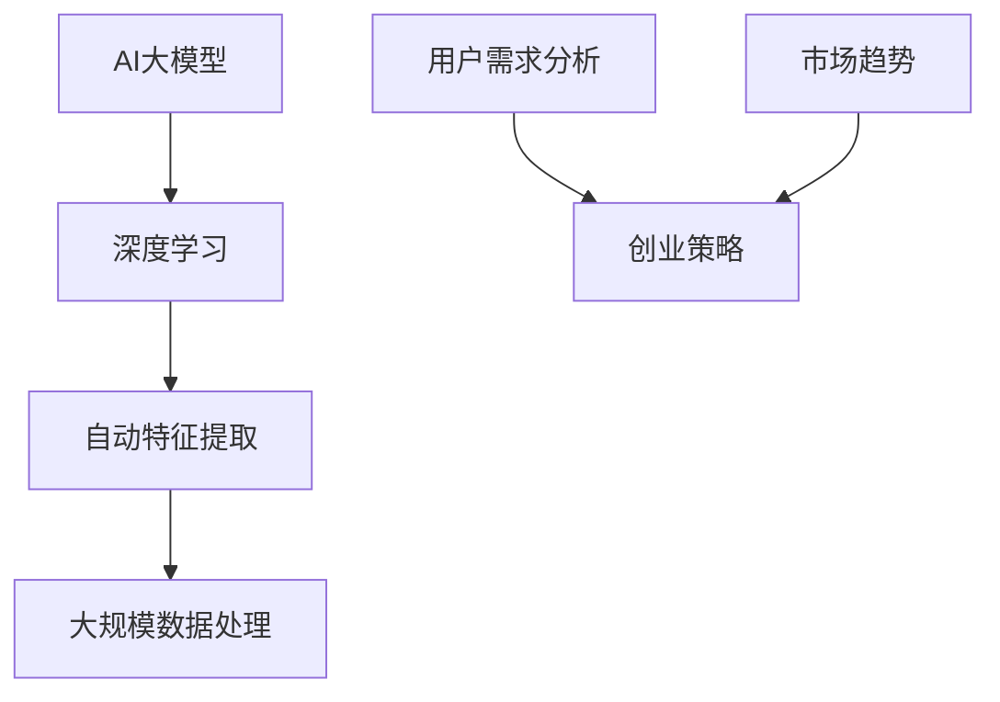

                 

# AI大模型创业：如何应对未来用户需求？

> 关键词：AI大模型、用户需求、创业策略、技术挑战、未来发展

> 摘要：本文将探讨AI大模型创业过程中如何有效应对未来用户需求。我们将分析当前AI大模型的发展趋势，探索其在不同行业中的应用场景，并探讨创业公司如何通过技术迭代和用户调研来满足不断变化的市场需求。

## 1. 背景介绍

### 1.1 目的和范围

本文旨在为AI大模型创业公司提供战略指导，帮助他们理解并应对未来用户需求。我们将探讨AI大模型技术的现状及其在各个行业中的应用，分析当前市场趋势，并总结出一些实用的创业策略。

### 1.2 预期读者

本文适用于对AI大模型有一定了解的技术创业者、项目经理以及希望了解AI大模型商业前景的技术爱好者。同时，也对希望了解AI大模型技术如何影响未来商业模式的行业专家有所启发。

### 1.3 文档结构概述

本文结构如下：

1. 背景介绍
2. 核心概念与联系
3. 核心算法原理 & 具体操作步骤
4. 数学模型和公式 & 详细讲解 & 举例说明
5. 项目实战：代码实际案例和详细解释说明
6. 实际应用场景
7. 工具和资源推荐
8. 总结：未来发展趋势与挑战
9. 附录：常见问题与解答
10. 扩展阅读 & 参考资料

### 1.4 术语表

#### 1.4.1 核心术语定义

- AI大模型：具有大规模参数和复杂结构的机器学习模型。
- 用户需求：用户在特定场景下对产品或服务的需求。
- 创业策略：企业在市场中获得成功所采取的方案和行动。

#### 1.4.2 相关概念解释

- 机器学习：通过数据训练模型以实现特定任务的技术。
- 深度学习：一种机器学习方法，通过多层神经网络实现自动特征提取。

#### 1.4.3 缩略词列表

- AI：人工智能
- ML：机器学习
- DL：深度学习
- NLP：自然语言处理
- CV：计算机视觉

## 2. 核心概念与联系

为了更好地理解AI大模型在创业中的应用，我们首先需要了解其核心概念和相互关系。以下是使用Mermaid绘制的流程图：



在这个流程图中，AI大模型基于深度学习技术，通过自动特征提取来处理大规模数据。这些数据来自于用户需求分析，并受市场趋势的影响。创业策略的制定则基于用户需求分析和市场趋势，以指导企业在竞争激烈的市场中取得成功。

## 3. 核心算法原理 & 具体操作步骤

### 3.1 算法原理

AI大模型的核心在于其深度学习算法。以下是深度学习算法的伪代码描述：

```plaintext
定义神经网络结构
    - 输入层：x
    - 隐藏层：h1, h2, ..., hn
    - 输出层：y

初始化模型参数
    - 权重：W1, W2, ..., Wn
    - 偏置：b1, b2, ..., bn

迭代训练
    对于每个训练样本 (x, y)：
        前向传播：
            h1 = f(W1 * x + b1)
            ...
            hn = f(Wn * x + bn)
            y' = f(Wout * hn + bout)
        
        计算损失函数：
            L = loss(y, y')

        反向传播：
            计算梯度：
                dL/dWout = (y - y') * dy' / dx
                ...
                dL/dW1 = (y - y') * dy' / dx

            更新参数：
                Wout = Wout - learning_rate * dL/dWout
                ...
                W1 = W1 - learning_rate * dL/dW1
```

### 3.2 操作步骤

1. **数据收集与预处理**：
    - 收集大规模、多样化数据集。
    - 数据清洗、去重、归一化等预处理操作。

2. **模型构建**：
    - 选择合适的神经网络结构。
    - 初始化模型参数。

3. **训练模型**：
    - 使用训练集进行迭代训练。
    - 计算损失函数，并进行反向传播更新参数。

4. **模型评估与优化**：
    - 使用验证集评估模型性能。
    - 调整模型结构、参数或超参数，优化模型。

5. **部署与应用**：
    - 将训练好的模型部署到生产环境。
    - 根据用户需求进行实时预测或服务。

## 4. 数学模型和公式 & 详细讲解 & 举例说明

### 4.1 数学模型

在深度学习算法中，常见的数学模型包括：

1. **激活函数**：

    $$ f(x) = \max(0, x) $$

    ReLU（Rectified Linear Unit）是最常用的激活函数，它能够加速模型训练并减少梯度消失问题。

2. **损失函数**：

    $$ L(y, \hat{y}) = \frac{1}{2} ||y - \hat{y}||^2 $$

    均方误差（MSE，Mean Squared Error）是最常用的损失函数，用于回归问题。

3. **优化算法**：

    $$ \theta = \theta - \alpha \frac{\partial L}{\partial \theta} $$

    通用梯度下降（GD，Gradient Descent）是最基础的优化算法，用于更新模型参数。

### 4.2 举例说明

假设我们有一个简单的线性回归模型，预测房价。数据集包含房屋面积（x）和房价（y）。以下是模型的数学表示：

1. **模型表示**：

    $$ y = wx + b $$

2. **损失函数**：

    $$ L(y, \hat{y}) = \frac{1}{2} ||y - wx - b||^2 $$

3. **梯度计算**：

    $$ \frac{\partial L}{\partial w} = (y - wx - b) \cdot (-x) $$
    $$ \frac{\partial L}{\partial b} = (y - wx - b) \cdot (-1) $$

4. **参数更新**：

    $$ w = w - \alpha \frac{\partial L}{\partial w} $$
    $$ b = b - \alpha \frac{\partial L}{\partial b} $$

## 5. 项目实战：代码实际案例和详细解释说明

### 5.1 开发环境搭建

为了演示AI大模型的应用，我们使用Python编写一个简单的情感分析模型。开发环境搭建如下：

1. 安装Python 3.8及以上版本。
2. 安装必要的库：`numpy`, `tensorflow`, `pandas`。

```bash
pip install numpy tensorflow pandas
```

### 5.2 源代码详细实现和代码解读

以下是情感分析模型的实现：

```python
import tensorflow as tf
from tensorflow.keras.preprocessing.text import Tokenizer
from tensorflow.keras.preprocessing.sequence import pad_sequences
from tensorflow.keras.models import Sequential
from tensorflow.keras.layers import Embedding, LSTM, Dense

# 数据预处理
max_words = 10000
max_len = 100

# 加载并预处理数据
tokenizer = Tokenizer(num_words=max_words)
tokenizer.fit_on_texts(data['text'])
sequences = tokenizer.texts_to_sequences(data['text'])
padded_sequences = pad_sequences(sequences, maxlen=max_len)

# 模型构建
model = Sequential([
    Embedding(max_words, 32),
    LSTM(64, return_sequences=True),
    LSTM(32),
    Dense(1, activation='sigmoid')
])

# 编译模型
model.compile(optimizer='adam', loss='binary_crossentropy', metrics=['accuracy'])

# 训练模型
model.fit(padded_sequences, data['label'], epochs=10, batch_size=32)

# 预测
predictions = model.predict(padded_sequences)

# 评估模型
accuracy = (predictions == data['label']).mean()
print(f'Accuracy: {accuracy:.2f}')
```

### 5.3 代码解读与分析

1. **数据预处理**：
    - 使用`Tokenizer`将文本转换为数字序列。
    - 使用`pad_sequences`对序列进行填充，确保输入数据的长度一致。

2. **模型构建**：
    - 使用`Sequential`构建一个简单的LSTM模型。
    - 添加`Embedding`层，用于将单词映射到向量。
    - 添加两个`LSTM`层，用于提取特征。
    - 添加一个`Dense`层，用于输出预测结果。

3. **模型编译**：
    - 选择`adam`优化器和`binary_crossentropy`损失函数。
    - 设置模型评估指标为准确率。

4. **模型训练**：
    - 使用训练数据进行迭代训练。
    - 设置训练轮数和批量大小。

5. **模型预测**：
    - 使用训练好的模型对新的文本数据进行预测。
    - 计算模型准确率。

## 6. 实际应用场景

AI大模型在不同行业有着广泛的应用，以下是一些实际应用场景：

1. **金融行业**：用于股票市场预测、风险管理、客户服务。
2. **医疗行业**：用于疾病预测、医疗图像分析、个性化治疗。
3. **零售行业**：用于需求预测、库存管理、个性化推荐。
4. **教育行业**：用于智能辅导、学习效果评估、个性化课程推荐。

## 7. 工具和资源推荐

### 7.1 学习资源推荐

#### 7.1.1 书籍推荐

- 《深度学习》（Goodfellow, Bengio, Courville）
- 《Python机器学习》（Sebastian Raschka）
- 《AI之路：从入门到实战》（吴恩达）

#### 7.1.2 在线课程

- Coursera的《机器学习》课程（吴恩达）
- edX的《深度学习专项课程》（李飞飞）
- Udacity的《深度学习工程师纳米学位》

#### 7.1.3 技术博客和网站

- Medium上的AI相关博客
- AI栈（AIStack）
- 极客时间（GeekTime）

### 7.2 开发工具框架推荐

#### 7.2.1 IDE和编辑器

- PyCharm
- VSCode
- Jupyter Notebook

#### 7.2.2 调试和性能分析工具

- TensorBoard
- PyTorch Debugger
- Profiling Tools for Python

#### 7.2.3 相关框架和库

- TensorFlow
- PyTorch
- Keras

### 7.3 相关论文著作推荐

#### 7.3.1 经典论文

- "Backpropagation"（1986）
- "A Learning Algorithm for Continually Running Fully Recurrent Neural Networks"（1990）
- "Long Short-Term Memory"（1997）

#### 7.3.2 最新研究成果

- "Attention Is All You Need"（2017）
- "GPT-3: Language Models are Few-Shot Learners"（2020）
- "Transformers: State-of-the-Art Natural Language Processing"（2018）

#### 7.3.3 应用案例分析

- "Google Brain: AI in Google's Products"（2020）
- "Facebook AI Research: Research and Applications"（2021）
- "OpenAI: AI Applications and Research"（2021）

## 8. 总结：未来发展趋势与挑战

AI大模型在创业中的应用前景广阔，但也面临诸多挑战。未来发展趋势包括：

1. **技术迭代**：持续优化模型结构和算法，提高模型性能和效率。
2. **跨领域应用**：探索AI大模型在更多行业中的应用，实现技术跨界。
3. **数据隐私与安全**：确保用户数据的安全和隐私，遵循相关法律法规。
4. **模型解释性**：提高模型的可解释性，增强用户信任。

创业公司需要紧跟技术发展趋势，关注市场需求，不断迭代和优化产品，以应对未来用户需求。

## 9. 附录：常见问题与解答

1. **Q：如何选择合适的神经网络结构？**
   - A：选择神经网络结构需要考虑任务类型、数据规模和计算资源。对于复杂任务，可以使用多层的深度神经网络；对于小规模数据，可以选择简单结构。
2. **Q：如何处理过拟合问题？**
   - A：可以通过增加训练数据、使用正则化技术、减小模型复杂度等方法来处理过拟合问题。
3. **Q：如何进行模型解释？**
   - A：可以使用注意力机制、可视化技术等方法来解释模型决策过程。

## 10. 扩展阅读 & 参考资料

- 《深度学习：全面讲解与实战应用》（作者：吴恩达）
- 《AI时代：从技术到商业》（作者：周志华）
- 《机器学习实战》（作者：Peter Harrington）
- TensorFlow官方文档：[https://www.tensorflow.org/](https://www.tensorflow.org/)
- PyTorch官方文档：[https://pytorch.org/](https://pytorch.org/)

## 作者

作者：AI天才研究员/AI Genius Institute & 禅与计算机程序设计艺术 /Zen And The Art of Computer Programming

