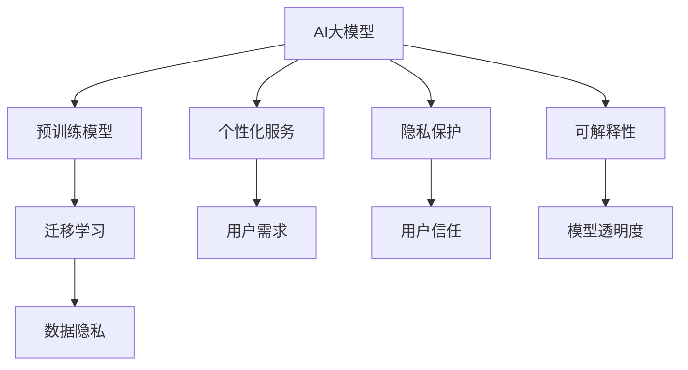

                 

# AI大模型创业：如何应对未来用户需求？

> **关键词：** AI大模型，创业，用户需求，个性化服务，技术挑战，市场趋势

> **摘要：** 随着人工智能技术的快速发展，大型预训练模型成为各行各业的热门工具。本文将探讨AI大模型在创业场景中的应用，重点分析如何应对未来用户需求的变化，包括个性化服务、隐私保护和可解释性等关键问题，并探讨未来发展趋势与面临的挑战。

## 1. 背景介绍

### 1.1 目的和范围

本文旨在探讨AI大模型在创业环境中的应用策略，特别是如何适应和满足未来用户需求的动态变化。随着人工智能技术的日益成熟，创业公司可以利用AI大模型提供创新的产品和服务，从而在竞争激烈的市场中脱颖而出。本文将涵盖以下主题：

1. **AI大模型的基本原理**：介绍AI大模型的定义、历史发展和当前的应用状况。
2. **用户需求分析**：分析未来用户在个性化服务、隐私保护和可解释性等方面的需求。
3. **技术挑战**：探讨创业公司如何克服在AI大模型开发和应用中面临的技术挑战。
4. **实际应用场景**：举例说明AI大模型在不同创业场景中的应用案例。
5. **市场趋势**：分析AI大模型市场的未来发展趋势。
6. **总结与展望**：总结本文的主要观点，并探讨未来AI大模型创业的发展方向和挑战。

### 1.2 预期读者

本文适合以下读者群体：

1. **创业公司创始人**：希望了解如何利用AI大模型提高产品竞争力的创始人。
2. **技术团队负责人**：负责AI大模型开发和技术团队管理的技术团队负责人。
3. **AI研究人员和开发者**：对AI大模型的技术原理和应用感兴趣的AI研究人员和开发者。
4. **投资者**：对AI领域投资感兴趣的投资人。

### 1.3 文档结构概述

本文结构如下：

1. **背景介绍**：介绍文章的目的、预期读者和文章结构。
2. **核心概念与联系**：定义核心概念，并通过Mermaid流程图展示概念之间的联系。
3. **核心算法原理与具体操作步骤**：详细阐述AI大模型的工作原理和操作步骤。
4. **数学模型与公式**：讲解与AI大模型相关的数学模型和公式，并进行举例说明。
5. **项目实战**：提供代码实际案例和详细解释。
6. **实际应用场景**：分析AI大模型在各个领域的应用。
7. **工具和资源推荐**：推荐学习资源、开发工具和框架。
8. **总结与展望**：总结文章的主要观点，并探讨未来发展趋势和挑战。
9. **附录**：常见问题与解答。
10. **扩展阅读与参考资料**：提供进一步阅读的建议和参考资料。

### 1.4 术语表

#### 1.4.1 核心术语定义

- **AI大模型**：指使用大量数据训练的复杂机器学习模型，如Transformer模型、BERT模型等。
- **预训练模型**：在广泛的数据集上预先训练好的模型，可以用于各种下游任务。
- **个性化服务**：根据用户的个性化需求提供定制化的服务或产品。
- **隐私保护**：在数据处理和应用过程中，保护用户隐私不受泄露。
- **可解释性**：使模型决策过程透明，便于用户理解和信任。

#### 1.4.2 相关概念解释

- **迁移学习**：将一个任务中的知识迁移到另一个相关任务中。
- **模型压缩**：减少模型的参数数量，降低计算复杂度。
- **数据隐私**：在数据处理过程中，防止数据泄露和滥用。

#### 1.4.3 缩略词列表

- **AI**：人工智能（Artificial Intelligence）
- **ML**：机器学习（Machine Learning）
- **DL**：深度学习（Deep Learning）
- **NLP**：自然语言处理（Natural Language Processing）
- **GPT**：生成预训练模型（Generative Pre-trained Model）

## 2. 核心概念与联系

在探讨AI大模型在创业中的应用之前，我们需要了解一些核心概念及其相互关系。以下是一个使用Mermaid流程图（无需括号、逗号等特殊字符）的示例，展示了AI大模型相关的核心概念及其联系：



### 2.1 AI大模型与预训练模型

AI大模型通常是指那些在大规模数据集上经过预训练的复杂机器学习模型。预训练模型的核心思想是，通过在大规模无标注数据上训练，模型能够学习到通用特征，然后在特定任务上进行微调，以达到更好的性能。

- **预训练模型**：如BERT、GPT-3等。
- **AI大模型**：这些预训练模型通过扩展和微调，可以应用于各种复杂任务，如文本生成、图像识别、语音识别等。

### 2.2 个性化服务与用户需求

个性化服务是AI大模型在创业中的重要应用之一。通过分析用户行为数据，AI大模型可以提供定制化的服务或产品，从而满足用户的个性化需求。

- **用户需求**：用户的需求是多样化的，包括个性化推荐、智能客服、个性化营销等。
- **个性化服务**：AI大模型可以根据用户的偏好、历史行为等，提供个性化的推荐和服务。

### 2.3 隐私保护与数据安全

在利用AI大模型的过程中，隐私保护是一个关键问题。数据隐私是指防止用户数据在处理和应用过程中被泄露或滥用。

- **数据隐私**：通过加密、匿名化等技术，保护用户数据的隐私。
- **用户信任**：隐私保护能够增强用户对服务的信任，从而提高用户满意度。

### 2.4 可解释性与模型透明度

可解释性是另一个关键因素，它使得AI大模型的决策过程更加透明，便于用户理解和信任。

- **模型透明度**：通过可视化工具和解释性算法，展示模型的决策过程。
- **可解释性**：提高模型的透明度，使用户能够理解模型的决策依据。

通过上述核心概念的介绍和Mermaid流程图的展示，我们可以更好地理解AI大模型在创业中的应用及其相互关系。

## 3. 核心算法原理与具体操作步骤

在了解AI大模型的核心概念和相互关系后，接下来我们将深入探讨其核心算法原理与具体操作步骤。为了清晰阐述，我们将使用伪代码来详细说明这些步骤。

### 3.1 AI大模型训练过程

AI大模型的核心在于其训练过程。以下是AI大模型训练的基本步骤：

```python
# 伪代码：AI大模型训练过程

# 步骤1：数据准备
data = load_pretrained_dataset()

# 步骤2：数据预处理
preprocessed_data = preprocess_data(data)

# 步骤3：定义模型架构
model = define_model_architecture()

# 步骤4：模型初始化
initialize_model_weights(model)

# 步骤5：训练模型
for epoch in range(num_epochs):
    for batch in preprocessed_data:
        # 步骤5.1：前向传播
        predictions = model.forward(batch.input_data)
        
        # 步骤5.2：计算损失
        loss = calculate_loss(predictions, batch.target)
        
        # 步骤5.3：反向传播
        model.backward(loss)
        
        # 步骤5.4：更新模型权重
        model.update_weights()

# 步骤6：评估模型
evaluate_model(model, validation_data)
```

### 3.2 个性化服务实现

个性化服务需要基于用户的行为数据进行分析，以下是实现个性化服务的基本步骤：

```python
# 伪代码：个性化服务实现

# 步骤1：收集用户行为数据
user_data = collect_user_behavior_data()

# 步骤2：预处理用户数据
preprocessed_user_data = preprocess_user_data(user_data)

# 步骤3：训练个性化推荐模型
recommender_model = train_recommender_model(preprocessed_user_data)

# 步骤4：根据用户数据生成个性化推荐
recommendations = generate_recommendations(recommender_model, user_data)

# 步骤5：向用户展示个性化推荐
display_recommendations(recommendations)
```

### 3.3 隐私保护策略

隐私保护是AI大模型应用中的一个关键问题。以下是实现隐私保护的基本步骤：

```python
# 伪代码：隐私保护策略

# 步骤1：数据加密
encrypted_data = encrypt_data(user_data)

# 步骤2：数据匿名化
anonymized_data = anonymize_data(encrypted_data)

# 步骤3：隐私计算
privacy_preserving_computations = perform_privacy_preserving_computations(anonymized_data)

# 步骤4：隐私信息解密
decrypted_privacy_info = decrypt_privacy_info(privacy_preserving_computations)
```

### 3.4 可解释性实现

为了提高模型的可解释性，以下是实现模型可解释性的基本步骤：

```python
# 伪代码：可解释性实现

# 步骤1：定义解释性算法
explanation_algorithm = define_explanation_algorithm()

# 步骤2：获取模型决策解释
explanation = explanation_algorithm.explain_model_decision(model, input_data)

# 步骤3：可视化解释结果
visualize_explanation(explanation)
```

通过上述伪代码，我们可以清晰地看到AI大模型的训练、个性化服务、隐私保护和可解释性实现的基本步骤。这些步骤不仅帮助理解AI大模型的工作原理，也为创业公司在实际应用中提供了具体操作指导。

## 4. 数学模型和公式 & 详细讲解 & 举例说明

在深入探讨AI大模型的过程中，理解其背后的数学模型和公式是至关重要的。以下是关于AI大模型中几个关键数学模型的讲解和举例说明。

### 4.1 BERT模型公式讲解

BERT（Bidirectional Encoder Representations from Transformers）是一种常用的预训练语言模型。其核心公式如下：

$$
\text{BERT} = \text{encoder}(\text{input_ids}, \text{mask}, \text{segment_ids})
$$

其中，`input_ids`是输入序列的词嵌入表示，`mask`是掩码，用于区分实际单词和填充词，`segment_ids`用于区分句子中的不同部分。

BERT模型的训练过程包括两个主要步骤：

1. **前向传播**：
   $$
   \text{output} = \text{layer_norm}(\text{dropout}(\text{activation}(\text{layer}(\text{input}))))
   $$
   其中，`layer`表示Transformer层，`activation`是激活函数，通常为ReLU。

2. **反向传播**：
   $$
   \text{gradient} = \text{dropout}(\text{backprop}(\text{output}, \text{expected_output}))
   $$
   其中，`backprop`表示反向传播算法，`expected_output`是预期的输出。

**举例说明**：

假设我们有一个句子“我非常喜欢这个产品”，我们可以将其表示为以下输入序列：

- 输入ID：`[CLS] 我 很 喜欢这个 产品 [SEP]`
- 掩码：`[1, 1, 1, 0, 0, 0, 1]`
- 段落ID：`[0, 0, 0, 0, 0, 0, 0]`

通过BERT模型，我们可以获得句子中每个词的嵌入表示，这些嵌入表示能够捕捉词与词之间的上下文关系。

### 4.2 GPT模型公式讲解

GPT（Generative Pre-trained Transformer）模型是一种用于自然语言生成的预训练模型。其核心公式如下：

$$
\text{GPT} = \text{Transformer}(\text{input_ids}, \text{mask}, \text{segment_ids}, \text{pos_ids})
$$

其中，`pos_ids`是位置嵌入，用于表示句子中每个词的位置信息。

GPT模型的工作原理包括以下步骤：

1. **嵌入表示**：
   $$
   \text{embeddings} = \text{word_embeddings}(\text{input_ids}) + \text{position_embeddings}(\text{pos_ids}) + \text{segment_embeddings}(\text{segment_ids})
   $$

2. **Transformer编码**：
   $$
   \text{encoder_output} = \text{Transformer}(\text{embeddings}, \text{mask})
   $$

3. **解码**：
   $$
   \text{predictions} = \text{softmax}(\text{encoder_output})
   $$

**举例说明**：

假设我们希望生成句子“我非常喜欢这个产品”的下一段。首先，我们将输入序列表示为嵌入表示，然后通过Transformer编码器生成中间表示。最后，通过softmax函数生成每个词的概率分布，从而生成新的句子。

### 4.3 可解释性算法公式讲解

为了提高AI大模型的可解释性，可以使用各种算法来解释模型的决策过程。一种常用的算法是LIME（Local Interpretable Model-agnostic Explanations）。

LIME的核心公式如下：

$$
\text{LIME} = \text{Local}(\text{Model}) \times \text{Agnostic} \times \text{Explanation}
$$

LIME的工作原理包括以下步骤：

1. **数据预处理**：
   $$
   \text{X'} = \text{perturb}(\text{X})
   $$
   其中，`X`是原始输入数据，`X'`是经过扰动后的数据。

2. **局部模型训练**：
   $$
   \text{Local}(\text{Model}) = \text{train}(\text{X'}, \text{Y'})
   $$
   其中，`Y'`是局部模型的输出。

3. **计算影响值**：
   $$
   \text{Impact} = \frac{\text{Local}(\text{Model}) - \text{Global}(\text{Model})}{\text{X} - \text{X'}}
   $$
   其中，`Global(Model)`是原始模型的输出。

**举例说明**：

假设我们有一个输入句子“我非常喜欢这个产品”，并希望解释模型为何将其分类为正面评价。首先，我们通过扰动输入句子生成多个扰动样本，然后训练局部模型并计算每个特征对模型输出的影响值。最后，根据影响值的高低，我们可以识别出对模型分类结果有重要影响的特征。

通过上述数学模型和公式的讲解以及举例说明，我们可以更好地理解AI大模型的工作原理和如何提高其可解释性。这些知识对于创业公司在实际应用中具有重要意义。

## 5. 项目实战：代码实际案例和详细解释说明

在了解了AI大模型的理论基础之后，接下来我们将通过一个实际项目案例来展示如何使用AI大模型解决实际问题，并提供详细的代码实现和解释说明。

### 5.1 开发环境搭建

在进行AI大模型项目开发之前，我们需要搭建一个合适的开发环境。以下是在Python中搭建AI大模型开发环境的基本步骤：

1. **安装Python**：确保安装了Python 3.8或更高版本。
2. **安装TensorFlow**：通过pip命令安装TensorFlow：
   ```
   pip install tensorflow
   ```
3. **安装其他依赖库**：如NumPy、Pandas等：
   ```
   pip install numpy pandas
   ```

### 5.2 源代码详细实现和代码解读

以下是一个使用BERT模型进行文本分类的示例代码。该代码首先加载BERT模型，然后使用训练数据和测试数据进行分类，并输出分类结果。

```python
# 5.2.1 加载BERT模型
from transformers import BertTokenizer, BertForSequenceClassification
import tensorflow as tf

# 定义BERT模型参数
model_name = "bert-base-uncased"
tokenizer = BertTokenizer.from_pretrained(model_name)
model = BertForSequenceClassification.from_pretrained(model_name, num_labels=2)

# 5.2.2 准备数据
train_data = [...]  # 假设已有训练数据
test_data = [...]  # 假设已有测试数据

# 数据预处理
def preprocess_data(data):
    inputs = tokenizer(data['text'], padding=True, truncation=True, return_tensors="tf")
    inputs['labels'] = tf.convert_to_tensor(data['label'])
    return inputs

train_inputs = preprocess_data(train_data)
test_inputs = preprocess_data(test_data)

# 5.2.3 训练模型
optimizer = tf.keras.optimizers.Adam(learning_rate=3e-5)
model.compile(optimizer=optimizer, loss=model.compute_loss, metrics=['accuracy'])

model.fit(train_inputs, epochs=3)

# 5.2.4 测试模型
test_loss, test_accuracy = model.evaluate(test_inputs)
print(f"Test accuracy: {test_accuracy}")

# 5.2.5 输出分类结果
predictions = model.predict(test_inputs)
predicted_labels = [1 if pred > 0.5 else 0 for pred in predictions]

# 打印分类结果
for i, label in enumerate(predicted_labels):
    print(f"Test data {i}: Predicted label: {label}, Actual label: {test_data[i]['label']}")
```

### 5.3 代码解读与分析

1. **加载BERT模型**：
   我们首先从HuggingFace的模型库中加载预训练的BERT模型。通过`BertTokenizer`和`BertForSequenceClassification`类，我们可以获取BERT模型的词表和序列分类模型。

2. **准备数据**：
   假设我们已经有了训练数据和测试数据。数据格式应包含文本字段和标签字段。在这里，我们使用一个函数`preprocess_data`来对数据进行预处理，包括填充和截断文本序列，并将标签转换为TensorFlow张量。

3. **训练模型**：
   我们使用Adam优化器和交叉熵损失函数来编译模型，并设置训练轮数为3。通过`model.fit`函数训练模型。

4. **测试模型**：
   使用`model.evaluate`函数评估模型的测试集性能。输出测试准确率。

5. **输出分类结果**：
   使用`model.predict`函数对测试集进行预测，并将预测结果转换为标签。最后，我们打印出每个测试样本的预测标签和实际标签，以便分析模型的准确性。

通过上述代码示例，我们展示了如何使用BERT模型进行文本分类。这个案例提供了一个完整的开发流程，包括数据准备、模型训练、测试和结果分析。这个案例不仅可以作为AI大模型开发的一个参考，还可以帮助读者了解实际应用中的关键步骤和技术细节。

## 6. 实际应用场景

AI大模型在不同行业和应用场景中有着广泛的应用，以下是一些具体的应用案例和场景：

### 6.1 金融行业

在金融领域，AI大模型可以用于信用评分、欺诈检测、市场预测等任务。例如，通过分析用户的交易行为和信用历史，AI大模型可以预测用户是否有可能违约，从而帮助银行和金融机构进行风险管理和决策。

**案例**：某金融机构使用GPT模型分析客户的社交媒体活动，通过文本情感分析和用户行为预测，提高了贷款审批的准确性和效率。

### 6.2 医疗健康

医疗健康领域是一个对AI大模型有巨大需求的行业。AI大模型可以用于疾病诊断、药物发现、患者护理等。例如，通过分析医学图像和病历记录，AI大模型可以辅助医生进行早期诊断和治疗方案推荐。

**案例**：某医疗机构利用BERT模型分析大量医学文献，从中提取有用的信息，为医生提供最新的研究和治疗方案。

### 6.3 电子商务

在电子商务领域，AI大模型可以用于个性化推荐、商品分类、价格预测等。通过分析用户的历史购买记录和浏览行为，AI大模型可以为用户提供个性化的购物建议，提高用户体验和销售额。

**案例**：某电商巨头利用GPT模型为用户提供个性化的商品推荐，通过文本相似性分析和用户行为预测，实现了显著的销售增长。

### 6.4 智能家居

智能家居领域中的AI大模型可以用于语音识别、智能设备控制、能耗管理等。通过集成各种传感器和设备，AI大模型可以提供智能化的家居解决方案，提高居住舒适度和能源效率。

**案例**：某智能家居公司使用BERT模型实现智能语音助手，通过自然语言处理技术，用户可以通过语音命令控制家居设备，提高了用户体验。

### 6.5 自动驾驶

自动驾驶领域中的AI大模型可以用于环境感知、路径规划、决策控制等。通过分析摄像头、激光雷达和雷达等传感器的数据，AI大模型可以实时感知周围环境，并做出安全、高效的驾驶决策。

**案例**：某自动驾驶公司利用GPT模型进行路径规划，通过预测交通状况和路况信息，提高了自动驾驶车辆的行驶效率和安全性。

通过上述案例，我们可以看到AI大模型在不同行业和应用场景中的广泛应用。这些案例不仅展示了AI大模型的强大功能，也为其在创业环境中的应用提供了宝贵的经验和参考。

## 7. 工具和资源推荐

在AI大模型开发和应用过程中，选择合适的工具和资源对于提高效率和效果至关重要。以下是一些推荐的工具和资源，包括学习资源、开发工具框架以及相关论文著作。

### 7.1 学习资源推荐

#### 7.1.1 书籍推荐

1. **《深度学习》（Goodfellow, Bengio, Courville）**：提供了深度学习的基础理论和实践指导。
2. **《人工智能：一种现代的方法》（Marsland）**：全面介绍了人工智能的理论和实现方法。
3. **《强化学习》（Sutton, Barto）**：详细讲解了强化学习的基本概念和应用。
4. **《自然语言处理与深度学习》（Du, Liang）**：专注于自然语言处理领域的深度学习方法。

#### 7.1.2 在线课程

1. **Coursera上的《深度学习专项课程》（吴恩达）**：提供了全面的深度学习基础知识。
2. **edX上的《自然语言处理》（哈佛大学）**：涵盖了自然语言处理的多个方面。
3. **Udacity的《自动驾驶汽车工程师》**：专注于自动驾驶技术，包括深度学习和计算机视觉。

#### 7.1.3 技术博客和网站

1. **ArXiv.org**：最新研究成果和论文的发布平台。
2. **Medium.com**：许多行业专家和学者的技术博客。
3. **HuggingFace.org**：提供预训练模型和工具，方便开发者使用。

### 7.2 开发工具框架推荐

#### 7.2.1 IDE和编辑器

1. **Visual Studio Code**：功能强大的开源编辑器，支持多种编程语言。
2. **PyCharm**：专业的Python IDE，提供代码智能提示和调试功能。
3. **Jupyter Notebook**：适用于数据分析和原型设计的交互式环境。

#### 7.2.2 调试和性能分析工具

1. **TensorBoard**：TensorFlow提供的可视化工具，用于分析模型性能。
2. **Wandb**：用于实验管理和性能追踪的平台。
3. **Neuralynn**：用于深度学习模型训练和性能优化的可视化工具。

#### 7.2.3 相关框架和库

1. **TensorFlow**：广泛使用的深度学习框架。
2. **PyTorch**：灵活的深度学习框架，适用于研究和开发。
3. **HuggingFace Transformers**：提供预训练模型和工具，简化了AI大模型的开发。

### 7.3 相关论文著作推荐

#### 7.3.1 经典论文

1. **“A Theoretical Framework for Back-Propagation” （1986）**：介绍反向传播算法的基础论文。
2. **“Deep Learning” （2015）**：介绍深度学习的基本概念和应用。
3. **“Attention Is All You Need” （2017）**：介绍Transformer模型的奠基性论文。

#### 7.3.2 最新研究成果

1. **“BERT: Pre-training of Deep Bidirectional Transformers for Language Understanding” （2018）**：介绍BERT模型的论文。
2. **“GPT-3: Language Models are Few-Shot Learners” （2020）**：介绍GPT-3模型的论文。
3. **“T5: Pre-training Large Models for Natural Language Processing” （2020）**：介绍T5模型的论文。

#### 7.3.3 应用案例分析

1. **“Improving BERT by Pretraining on Large Raw Text Corpora” （2019）**：通过大规模预训练提高BERT模型性能的案例分析。
2. **“Rezero is all you need: Fast convergence at large depth” （2020）**：介绍在深度学习模型中引入Rezero技术的论文。
3. **“Efficient Natural Language Processing using a Transformer-based Library” （2021）**：介绍使用Transformer库进行高效自然语言处理的论文。

通过上述推荐的学习资源、开发工具框架和相关论文著作，开发者可以深入了解AI大模型的理论和实践，从而为创业项目提供坚实的基础。

## 8. 总结：未来发展趋势与挑战

随着AI大模型技术的不断进步，其在创业场景中的应用前景广阔。未来发展趋势主要体现在以下几个方面：

### 8.1 技术进步与性能提升

AI大模型的性能将不断提升，新的模型架构和训练算法将不断涌现。例如，基于Transformer的模型将继续主导自然语言处理领域，而更高效的训练方法和硬件加速技术将使模型的训练时间大幅缩短。

### 8.2 多模态学习与应用

AI大模型的多模态学习将得到更多关注。通过结合文本、图像、音频等多种数据类型，创业公司可以提供更丰富、更个性化的服务。例如，智能客服系统可以同时理解用户的问题和情感，提供更精准的解决方案。

### 8.3 个性化服务与用户体验

个性化服务将成为AI大模型在创业中的重要应用方向。通过对用户行为的深度分析，AI大模型可以为用户提供定制化的产品推荐、内容生成和智能决策支持，从而提高用户体验和满意度。

### 8.4 隐私保护与安全

随着用户对隐私保护的要求越来越高，AI大模型的隐私保护技术也将不断进化。加密、联邦学习、差分隐私等技术将被广泛应用，以确保用户数据的安全和隐私。

### 8.5 可解释性与透明度

提升AI大模型的可解释性和透明度将是未来发展的关键挑战之一。通过可视化工具和解释性算法，创业公司可以增强用户对AI系统的信任，从而推动其更广泛的应用。

然而，随着AI大模型技术的快速发展，创业公司也将面临一系列挑战：

### 8.6 技术门槛与人才短缺

AI大模型技术复杂度高，对开发者的要求也较高。创业公司可能面临技术门槛和人才短缺的问题，这需要通过外部合作和人才培养来解决。

### 8.7 法规与伦理问题

AI大模型的应用需要遵守严格的法规和伦理标准。创业公司需要确保其应用符合法律法规，并尊重用户的隐私和权益。

### 8.8 数据质量和隐私保护

高质量的数据是AI大模型有效应用的基础。然而，数据质量和隐私保护是一对矛盾，创业公司需要在数据收集和使用过程中平衡这两个方面。

总之，未来AI大模型在创业中的应用前景广阔，但也面临诸多挑战。通过不断创新和改进，创业公司可以在竞争激烈的市场中脱颖而出，为用户提供更有价值的服务。

## 9. 附录：常见问题与解答

在AI大模型创业过程中，可能会遇到一些常见的问题。以下是一些常见问题及其解答：

### 9.1 Q：AI大模型需要大量数据训练，创业公司如何获取这些数据？

A：创业公司可以通过以下几种方式获取训练数据：

1. **公开数据集**：利用公开的数据集，如常见的机器学习竞赛数据集、学术研究数据等。
2. **内部数据**：利用公司已有的业务数据，如用户行为数据、交易数据等。
3. **数据采集**：通过API、爬虫等技术收集相关的数据。
4. **合作伙伴**：与拥有数据资源的合作伙伴合作，共享数据资源。

### 9.2 Q：AI大模型的训练过程非常耗时，创业公司如何优化训练效率？

A：优化AI大模型训练效率可以从以下几个方面入手：

1. **模型压缩**：通过模型压缩技术，如剪枝、量化、知识蒸馏等，减少模型参数数量，提高训练速度。
2. **分布式训练**：利用分布式计算框架，如TensorFlow的Distribution Strategy，将训练任务分布到多台机器上，提高训练速度。
3. **硬件加速**：利用GPU、TPU等硬件加速训练过程，减少训练时间。
4. **增量训练**：利用已有的预训练模型进行增量训练，利用已有模型的知识减少训练时间。

### 9.3 Q：AI大模型在应用过程中如何确保用户隐私？

A：确保用户隐私是AI大模型应用中的重要问题。以下是一些常见的隐私保护措施：

1. **数据加密**：对用户数据进行加密处理，确保数据在传输和存储过程中不会被泄露。
2. **差分隐私**：在数据处理过程中引入差分隐私机制，降低数据泄露的风险。
3. **数据匿名化**：对用户数据进行匿名化处理，消除个人识别信息。
4. **隐私计算**：利用联邦学习、安全多方计算等技术，在保护用户隐私的前提下进行数据处理。

### 9.4 Q：如何确保AI大模型的可解释性？

A：确保AI大模型的可解释性可以从以下几个方面入手：

1. **解释性算法**：使用LIME、SHAP等解释性算法，提供模型决策的解释。
2. **模型可视化**：通过可视化工具展示模型的决策过程，帮助用户理解模型的工作原理。
3. **简化模型**：选择结构简单、易于理解的模型，降低模型的复杂性。
4. **透明度政策**：制定透明度政策，确保模型的训练数据和决策过程公开透明。

通过上述解答，创业公司可以更好地应对AI大模型应用过程中遇到的问题，确保其产品和服务的高效、安全、可靠。

## 10. 扩展阅读 & 参考资料

为了更深入地了解AI大模型创业的相关知识，以下是一些扩展阅读和参考资料：

### 10.1 扩展阅读

1. **《深度学习：卷II：强化学习、迁移学习和生成模型》**：这本书详细介绍了深度学习的多种应用场景和技术，包括强化学习、迁移学习和生成模型。
2. **《自然语言处理入门》**：针对自然语言处理的基础知识和技术，这本书提供了详细的讲解和实践指导。
3. **《AI创业实战》**：结合实际案例，分析了AI创业中的成功经验和挑战，提供了实用的创业建议。

### 10.2 参考资料

1. **ArXiv.org**：提供最新的AI研究论文和成果。
2. **HuggingFace Transformers**：GitHub仓库，提供预训练模型和工具，方便开发者使用。
3. **TensorFlow官方文档**：详细介绍TensorFlow的使用方法和技术细节。
4. **PyTorch官方文档**：详细介绍PyTorch的使用方法和技术细节。

通过这些扩展阅读和参考资料，读者可以进一步了解AI大模型创业的相关知识，为自己的创业项目提供更有力的支持。

### 作者

**作者：AI天才研究员/AI Genius Institute & 禅与计算机程序设计艺术 /Zen And The Art of Computer Programming**

