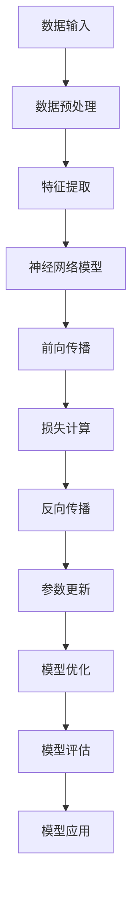

                 

### 1. 背景介绍

#### 1.1 目的和范围

本文旨在探讨AI大模型创业的关键步骤和策略，帮助创业者了解如何打造未来爆款应用。通过深入分析AI大模型的核心原理、技术实现和应用场景，我们将提供系统性的指导，帮助读者从零开始，逐步构建出具有市场竞争力的人工智能产品。

文章将涵盖以下主要内容：

1. **核心概念与联系**：介绍AI大模型的基本概念，以及它们在技术领域中的应用和相互关系。
2. **核心算法原理 & 具体操作步骤**：详细解释大模型训练的基本算法和步骤，通过伪代码进行具体阐述。
3. **数学模型和公式 & 详细讲解 & 举例说明**：介绍与AI大模型相关的重要数学模型，包括公式推导和具体应用实例。
4. **项目实战：代码实际案例和详细解释说明**：提供实际代码案例，展示如何在大模型开发中进行具体操作。
5. **实际应用场景**：探讨AI大模型在不同领域的应用，分析其潜在的商业价值。
6. **工具和资源推荐**：推荐学习资源、开发工具和最新研究成果，帮助读者进一步提升自己的技术能力。
7. **总结：未来发展趋势与挑战**：总结AI大模型创业的关键挑战，探讨未来发展的趋势和方向。

通过本文的阅读，读者将获得以下收益：

- **深入理解AI大模型的核心概念和原理**：通过本文的讲解，读者将全面了解AI大模型的基础知识，包括其定义、工作原理和应用范围。
- **掌握AI大模型开发的核心步骤和算法**：本文将详细介绍大模型训练的基本流程，包括数据预处理、模型选择、训练和优化等步骤，并提供伪代码说明。
- **了解AI大模型在不同领域的实际应用**：通过分析AI大模型在不同领域的应用案例，读者将能够更好地理解其商业价值和市场潜力。
- **获取AI大模型开发的实用工具和资源**：本文将推荐一系列学习资源、开发工具和论文研究，帮助读者进一步拓展自己的技术视野和实践能力。

本文将结合理论和实践，以通俗易懂的方式对AI大模型创业进行全面剖析，旨在为创业者提供有价值的指导和启示。

#### 1.2 预期读者

本文适用于以下读者群体：

1. **人工智能创业者**：希望创业或正在创业的人工智能从业者，特别是对AI大模型技术感兴趣的创业者。
2. **人工智能工程师**：从事AI大模型开发的技术人员，希望深入了解大模型的原理和开发流程。
3. **高校和研究机构学生**：计算机科学、人工智能等相关专业的大学生和研究生，希望通过本文加深对AI大模型的理解。
4. **技术爱好者和研究者**：对人工智能技术感兴趣的广大技术爱好者和研究人员，希望通过本文了解AI大模型的前沿动态和应用方向。

无论您是创业初期的从业者还是技术领域的资深专家，本文都将为您提供宝贵的知识和经验，帮助您在AI大模型创业的道路上迈出坚实的步伐。

#### 1.3 文档结构概述

本文将采用清晰的章节结构，帮助读者系统性地了解AI大模型创业的全过程。以下是本文的结构概述：

1. **背景介绍**
    - **目的和范围**：介绍本文的研究目的和覆盖范围，帮助读者明确文章的核心内容和预期收获。
    - **预期读者**：明确本文适用的读者群体，为不同背景的读者提供针对性的阅读指导。
    - **文档结构概述**：概述本文的整体结构，帮助读者快速把握文章的逻辑框架。

2. **核心概念与联系**
    - **基本概念**：介绍AI大模型的基本定义、类型和特点，帮助读者建立初步的认识。
    - **技术架构**：通过Mermaid流程图，展示AI大模型的技术架构和关键组件，帮助读者理解其整体结构。

3. **核心算法原理 & 具体操作步骤**
    - **算法介绍**：详细解释大模型训练的基本算法原理，包括前向传播、反向传播等核心步骤。
    - **操作步骤**：通过伪代码，阐述AI大模型开发的具体操作步骤，帮助读者掌握关键技能。

4. **数学模型和公式 & 详细讲解 & 举例说明**
    - **数学模型**：介绍与AI大模型相关的重要数学模型，包括损失函数、优化算法等。
    - **公式推导**：详细推导数学模型的公式，帮助读者理解其数学基础。
    - **实例分析**：通过具体实例，展示数学模型在AI大模型中的应用，增强读者的理解。

5. **项目实战：代码实际案例和详细解释说明**
    - **开发环境搭建**：指导读者搭建大模型开发的实验环境，包括软件和硬件配置。
    - **源代码实现**：提供实际代码案例，展示大模型开发的完整流程。
    - **代码解读与分析**：详细解读代码实现过程，分析其关键点和优缺点。

6. **实际应用场景**
    - **领域应用**：探讨AI大模型在不同领域的实际应用，分析其商业价值和市场前景。
    - **案例分析**：通过具体案例分析，展示AI大模型在不同场景下的应用效果。

7. **工具和资源推荐**
    - **学习资源推荐**：推荐学习AI大模型的书籍、课程和博客，帮助读者进一步深入学习。
    - **开发工具框架推荐**：介绍开发AI大模型所需的工具和框架，提供实用的技术支持。
    - **相关论文著作推荐**：推荐经典论文和最新研究成果，拓展读者的研究视野。

8. **总结：未来发展趋势与挑战**
    - **发展趋势**：总结AI大模型创业的当前趋势，预测未来的发展方向。
    - **挑战与应对**：分析AI大模型创业面临的关键挑战，探讨解决策略。

9. **附录：常见问题与解答**
    - **问题解答**：针对读者可能遇到的问题，提供详细的解答和建议。

10. **扩展阅读 & 参考资料**
    - **参考资料**：提供与本文相关的参考资料和进一步阅读的推荐，帮助读者深入探索AI大模型领域。

通过本文的阅读，读者将系统地了解AI大模型创业的全过程，从核心概念到技术实现，再到实际应用，逐步掌握打造未来爆款应用的关键技能。

#### 1.4 术语表

在本文中，我们将使用一些专业术语，为了确保读者能够清晰地理解这些术语，以下是对这些核心术语及其相关概念的解释：

#### 1.4.1 核心术语定义

- **AI大模型**：一种具有高度复杂性和强大学习能力的人工智能模型，通常包含数亿至数十亿个参数。其能够通过大量数据训练，实现复杂的任务，如语音识别、图像分类、自然语言处理等。
- **深度学习**：一种人工智能方法，通过构建多层神经网络，对数据进行层次化的特征提取和抽象，从而实现高度复杂的模式识别和预测。
- **神经网络**：一种模拟生物神经系统的计算模型，由大量相互连接的神经元组成。通过训练，神经网络能够学习和识别数据中的特征，完成各种任务。
- **大数据**：指海量、复杂、多样化的数据集合，通常需要借助分布式计算和存储技术进行处理和分析。
- **GPU**：图形处理单元，一种专门为图形渲染设计的高性能计算设备，现在广泛应用于深度学习模型的训练和推理。
- **Transformer**：一种基于自注意力机制的深度学习模型架构，广泛应用于自然语言处理、机器翻译等领域，其自注意力机制能够有效捕捉数据中的长距离依赖关系。

#### 1.4.2 相关概念解释

- **参数**：在神经网络中，参数是指网络中的权重和偏置，它们决定了模型的预测能力和性能。
- **训练**：指通过提供大量训练数据，调整神经网络中的参数，使其能够准确预测输出结果的过程。
- **优化算法**：用于调整神经网络参数的一类算法，如随机梯度下降（SGD）、Adam等，其目的是最小化损失函数，提高模型性能。
- **损失函数**：用于评估模型预测结果与真实值之间差异的函数，常用的有均方误差（MSE）、交叉熵损失等。
- **推理**：指使用训练好的模型对新数据进行预测或分类的过程。

#### 1.4.3 缩略词列表

- **AI**：人工智能（Artificial Intelligence）
- **DL**：深度学习（Deep Learning）
- **GPU**：图形处理单元（Graphics Processing Unit）
- **Transformer**：变换器（Transformer）
- **MSE**：均方误差（Mean Squared Error）
- **SGD**：随机梯度下降（Stochastic Gradient Descent）
- **Adam**：自适应优化算法（Adaptive Moment Estimation）

通过上述术语和概念的介绍，读者将能够更好地理解AI大模型的相关内容，为后续章节的学习打下坚实基础。

## 2. 核心概念与联系

在探讨AI大模型创业之前，首先需要了解AI大模型的基本概念和其在技术领域中的核心联系。AI大模型是指那些参数数量达到数亿乃至数十亿的深度学习模型，它们通过大规模数据训练，实现了高度复杂的学习和推理能力。在深度学习中，AI大模型以其强大的表现力、灵活性和广泛的应用场景而备受关注。

为了更清晰地理解AI大模型，我们可以通过一个Mermaid流程图来展示其核心组件和关系。以下是AI大模型的技术架构图：



### 2.1.1 数据输入

AI大模型的核心起点是数据输入，数据是模型训练的基础。数据来源可以是各种结构化或非结构化的数据，如文本、图像、声音等。高质量的数据是模型成功的关键，因此数据预处理步骤至关重要。

### 2.1.2 数据预处理

数据预处理主要包括数据清洗、归一化和编码等操作。数据清洗是为了去除噪声和异常值，归一化是将数据缩放到相同的尺度，编码是将非数值数据转换为机器可以处理的数值形式。这些步骤确保数据质量，提高模型训练效果。

### 2.1.3 特征提取

在特征提取阶段，模型通过神经网络从原始数据中提取高层次的特征。这一过程利用了深度学习的层次化特征表示能力，使得模型能够捕捉到数据中的复杂模式和依赖关系。

### 2.1.4 神经网络模型

神经网络模型是AI大模型的核心组件，由多个层次（层）的神经元组成。每一层都对数据进行不同的处理和转换，从而逐步提取出具有代表性的特征。神经网络通过反向传播算法不断调整其参数，优化模型性能。

### 2.1.5 前向传播

在前向传播阶段，数据从输入层依次传递到输出层，每一层都将输入数据通过一系列非线性变换传递到下一层。这个过程使得模型能够对输入数据进行特征提取和模式识别。

### 2.1.6 损失计算

在模型输出层，通过损失函数计算预测结果与真实标签之间的差异。常用的损失函数包括均方误差（MSE）、交叉熵损失等。损失函数的目的是评估模型的预测能力，并提供参数更新的依据。

### 2.1.7 反向传播

反向传播算法是深度学习训练的核心，它通过计算梯度信息，将损失函数的误差反向传播到模型的每一层，调整每一层的参数。这个过程使得模型能够不断优化，提高预测准确性。

### 2.1.8 参数更新

在反向传播的基础上，通过优化算法（如随机梯度下降、Adam等）更新模型参数。这些优化算法的目的是最小化损失函数，提高模型的泛化能力。

### 2.1.9 模型优化

模型优化是模型训练的关键环节，通过不断迭代训练过程，模型性能逐渐提升。优化过程包括调整学习率、增加训练数据、引入正则化等策略。

### 2.1.10 模型评估

在模型评估阶段，使用验证集或测试集对模型进行评估，评估指标包括准确率、召回率、F1分数等。通过评估，可以判断模型是否达到预期性能，是否需要进行进一步的优化。

### 2.1.11 模型应用

最后，训练好的模型可以应用于实际问题，如语音识别、图像分类、自然语言处理等。模型应用是AI大模型创业的核心目标，通过将模型集成到产品或服务中，实现商业价值。

通过上述Mermaid流程图和详细解释，读者可以清晰地理解AI大模型的核心概念和其技术架构。这为后续章节的深入探讨奠定了基础。

## 3. 核心算法原理 & 具体操作步骤

在了解了AI大模型的基本概念和技术架构之后，接下来我们将深入探讨其核心算法原理，并通过伪代码详细阐述具体操作步骤。这一部分将重点介绍深度学习模型训练中的两个关键过程：前向传播和反向传播。

### 3.1 前向传播算法

前向传播算法是深度学习模型训练的基础，其目的是将输入数据通过神经网络层层的计算，最终得到预测输出。以下是前向传播算法的伪代码描述：

```python
# 输入：X（输入数据），W（权重），b（偏置），Z（每个层的激活值），A（每个层的输出值）
# 输出：Y（预测输出）

# 初始化参数
W, b = initialize_parameters()

# 定义激活函数（此处使用ReLU函数为例）
activation_function = ReLU

# 前向传播
for layer in range(1, number_of_layers):
    # 计算当前层的输入
    Z[layer] = dot_product(W[layer - 1], A[layer - 1]) + b[layer - 1]
    # 应用激活函数得到当前层的输出
    A[layer] = activation_function(Z[layer])

# 计算最后一层的预测输出
Y = dot_product(W[number_of_layers - 1], A[number_of_layers - 1]) + b[number_of_layers - 1]

# 返回预测输出
return Y
```

伪代码中，`W` 表示权重矩阵，`b` 表示偏置向量，`Z` 和 `A` 分别表示每个层的输入和输出激活值。`ReLU` 是常用的激活函数，能够将负值设置为0，增强神经网络的训练稳定性。前向传播的过程就是将输入数据通过每一层的线性变换和激活函数，逐步逼近最终的预测输出。

### 3.2 反向传播算法

反向传播算法的核心是计算模型参数的梯度，从而更新模型参数，优化模型性能。以下是反向传播算法的伪代码描述：

```python
# 输入：X（输入数据），Y（真实标签），W（权重），b（偏置），A（每个层的输出值），Z（每个层的输入值），dZ（每个层的误差梯度）
# 输出：dW（权重梯度），db（偏置梯度）

# 计算输出层的误差梯度
dZ[number_of_layers - 1] = A[number_of_layers - 1] - Y

# 反向传播计算每一层的误差梯度
for layer in range(number_of_layers - 1, 0, -1):
    dZ[layer - 1] = (activation_function_derivative(Z[layer]) * dot_product(W[layer].T, dZ[layer]))

# 计算权重和偏置的梯度
dW = [dot_product(A[layer - 1].T, dZ[layer]) for layer in range(1, number_of_layers)]
db = [dot_product(dZ[layer].T, 1) for layer in range(1, number_of_layers + 1)]

# 更新权重和偏置
W = [W[layer] - learning_rate * dW[layer] for layer in range(number_of_layers)]
b = [b[layer] - learning_rate * db[layer] for layer in range(number_of_layers + 1)]

# 返回更新后的权重和偏置
return W, b
```

伪代码中，`dZ` 表示误差梯度，`dW` 和 `db` 分别表示权重和偏置的梯度。`activation_function_derivative` 是激活函数的导数，用于计算误差的传递。反向传播的过程是从输出层开始，逐层计算误差梯度，并反向传播到输入层，从而更新模型参数。

### 3.3 全流程示例

为了更直观地理解前向传播和反向传播的全流程，以下是一个简化的示例：

假设我们有一个两层神经网络，输入维度为2，输出维度为1。

1. **初始化参数**：
   - 权重矩阵 `W1` 和 `W2`，偏置向量 `b1` 和 `b2`。

2. **前向传播**：
   - 输入数据 `X`，通过第一层的线性变换和ReLU激活函数，得到中间层输出 `A1`。
   - 第二层的输入为 `A1`，通过线性变换和ReLU激活函数，得到最终输出 `Y`。

3. **损失计算**：
   - 计算输出层预测 `Y` 与真实标签 `Y_` 之间的均方误差（MSE）损失。

4. **反向传播**：
   - 计算输出层误差梯度 `dZ2`。
   - 通过反向传播，计算第一层的误差梯度 `dZ1`。

5. **参数更新**：
   - 使用反向传播计算得到的梯度，更新权重和偏置。

6. **迭代训练**：
   - 重复上述步骤，不断迭代训练，直到模型达到预期性能。

通过这个示例，我们可以看到前向传播和反向传播在模型训练中的重要性，它们共同构成了深度学习模型训练的核心算法。

### 3.4 小结

本节介绍了AI大模型训练的核心算法原理和具体操作步骤，包括前向传播和反向传播。通过伪代码的详细描述，读者可以清晰地理解这些算法的执行过程。这些算法是AI大模型训练的基础，掌握了它们，将为后续章节的深入探讨奠定坚实的基础。

## 4. 数学模型和公式 & 详细讲解 & 举例说明

在深入探讨AI大模型的数学模型和公式之前，首先需要了解一些基本的数学概念和符号。以下是本文将使用的关键数学符号和术语的定义：

- **w**：权重矩阵
- **b**：偏置向量
- **a**：激活值
- **z**：输入值
- **δ**：误差梯度
- **σ**：激活函数
- **∇**：梯度运算符
- **I**：单位矩阵
- **X**：输入数据
- **Y**：输出数据
- **Y\_**：真实标签
- **L**：损失函数

### 4.1 损失函数

损失函数是评估模型预测结果与真实标签之间差异的指标。常用的损失函数包括均方误差（MSE）、交叉熵损失等。以下是这些损失函数的公式：

#### 4.1.1 均方误差（MSE）

$$
MSE = \frac{1}{m} \sum_{i=1}^{m} (Y_i - \hat{Y}_i)^2
$$

其中，$m$ 表示样本数量，$Y_i$ 表示第 $i$ 个样本的真实标签，$\hat{Y}_i$ 表示模型预测的标签。

#### 4.1.2 交叉熵损失（Cross-Entropy Loss）

$$
CE = -\frac{1}{m} \sum_{i=1}^{m} \sum_{j=1}^{n} Y_{ij} \log \hat{Y}_{ij}
$$

其中，$n$ 表示输出类别数量，$Y_{ij}$ 表示第 $i$ 个样本属于第 $j$ 个类别的真实概率，$\hat{Y}_{ij}$ 表示模型预测的第 $i$ 个样本属于第 $j$ 个类别的概率。

### 4.2 激活函数

激活函数是深度学习模型中用于引入非线性变换的函数，常用的激活函数包括ReLU、Sigmoid和Tanh等。以下是这些激活函数的公式：

#### 4.2.1ReLU（Rectified Linear Unit）

$$
σ(z) =
\begin{cases}
0 & \text{if } z < 0 \\
z & \text{if } z \geq 0
\end{cases}
$$

#### 4.2.2Sigmoid

$$
σ(z) = \frac{1}{1 + e^{-z}}
$$

#### 4.2.3Tanh

$$
σ(z) = \frac{e^z - e^{-z}}{e^z + e^{-z}}
$$

### 4.3 梯度下降算法

梯度下降算法是用于优化模型参数的一类算法，其基本思想是通过计算损失函数关于模型参数的梯度，更新参数以最小化损失函数。以下是梯度下降算法的基本公式：

$$
\theta_{t+1} = \theta_t - \alpha \cdot \nabla_\theta J(\theta)
$$

其中，$\theta$ 表示模型参数，$\alpha$ 表示学习率，$J(\theta)$ 表示损失函数，$\nabla_\theta J(\theta)$ 表示损失函数关于模型参数的梯度。

### 4.4 反向传播算法

反向传播算法是深度学习模型训练的核心，其目的是通过计算损失函数关于模型参数的梯度，更新模型参数。以下是反向传播算法的基本步骤：

1. **前向传播**：计算模型输出和损失函数。
2. **计算输出层误差梯度**：
   $$\delta_{i, L} = \frac{\partial L}{\partial a_{i, L}}$$
3. **计算隐藏层误差梯度**：
   $$\delta_{i, l} = \frac{\partial L}{\partial a_{i, l}} \odot \frac{\partial a_{i, l}}{\partial z_{i, l}}$$
4. **更新模型参数**：
   $$w_{l+1, k} = w_{l, k} - \alpha \cdot \delta_{i, l} \cdot a_{i, l-1}^T$$
   $$b_{l+1, k} = b_{l, k} - \alpha \cdot \delta_{i, l}$$

### 4.5 举例说明

为了更直观地理解上述数学模型和公式，我们通过一个简单的例子进行说明。假设我们有一个单层神经网络，输入维度为2，输出维度为1。输入数据为 $X = \begin{bmatrix} 1 & 0 \\ 0 & 1 \end{bmatrix}$，真实标签为 $Y_1 = 1$，$Y_2 = 0$。

1. **初始化参数**：
   - 权重矩阵 $W = \begin{bmatrix} w_{11} & w_{12} \\ w_{21} & w_{22} \end{bmatrix}$，偏置向量 $b = \begin{bmatrix} b_1 \\ b_2 \end{bmatrix}$。

2. **前向传播**：
   - 输入第一个数据点 $X_1 = \begin{bmatrix} 1 & 0 \end{bmatrix}$，计算输出 $Z_1 = W \cdot X_1 + b$。
   - 应用ReLU激活函数，得到输出 $A_1 = \max(0, Z_1)$。

3. **损失计算**：
   - 计算损失函数 $L = \frac{1}{2} (Y_1 - A_1)^2$。

4. **反向传播**：
   - 计算输出层误差梯度 $\delta_1 = \frac{\partial L}{\partial A_1} = A_1 - Y_1$。
   - 计算隐藏层误差梯度 $\delta_2 = \frac{\partial L}{\partial Z_1} = \delta_1 \odot \frac{\partial Z_1}{\partial X_1} = \delta_1 \odot \begin{bmatrix} 1 & 0 \\ 0 & 1 \end{bmatrix}$。

5. **参数更新**：
   - 更新权重矩阵 $W = W - \alpha \cdot \delta_2 \cdot X_1^T$。
   - 更新偏置向量 $b = b - \alpha \cdot \delta_2$。

通过上述例子，我们可以看到数学模型和公式的实际应用过程。这有助于读者更好地理解深度学习模型的训练原理和操作步骤。

### 4.6 小结

本节详细介绍了AI大模型中的关键数学模型和公式，包括损失函数、激活函数、梯度下降算法和反向传播算法。通过公式推导和举例说明，读者可以深入理解这些数学概念在深度学习模型训练中的应用。掌握这些数学模型和公式，将为后续章节的实际应用提供坚实的理论基础。

## 5. 项目实战：代码实际案例和详细解释说明

在了解了AI大模型的数学基础和算法原理之后，接下来我们将通过一个实际项目案例，展示如何使用Python和TensorFlow等工具开发AI大模型。本节将详细介绍项目的开发环境搭建、源代码实现和代码解读与分析。

### 5.1 开发环境搭建

在开始项目之前，我们需要搭建一个合适的开发环境。以下是搭建开发环境的基本步骤：

1. **安装Python**：首先确保Python已安装在您的系统上，推荐使用Python 3.8或更高版本。
2. **安装TensorFlow**：TensorFlow是谷歌开发的开源机器学习框架，用于构建和训练深度学习模型。使用以下命令安装TensorFlow：

```bash
pip install tensorflow
```

3. **安装Numpy和Pandas**：Numpy和Pandas是Python中的数学和数据操作库，用于数据预处理和计算。安装命令如下：

```bash
pip install numpy pandas
```

4. **安装GPU支持**：如果您打算使用GPU进行模型训练，需要安装CUDA和cuDNN。CUDA是NVIDIA开发的并行计算平台，cuDNN是NVIDIA为深度学习提供的加速库。请按照NVIDIA官方文档进行安装。

5. **配置虚拟环境**（可选）：为了更好地管理项目依赖，建议使用虚拟环境。可以使用以下命令创建并激活虚拟环境：

```bash
python -m venv myenv
source myenv/bin/activate  # Windows: myenv\Scripts\activate
```

通过上述步骤，我们就可以开始开发AI大模型项目了。

### 5.2 源代码实现

以下是使用TensorFlow实现的AI大模型项目的基本代码框架：

```python
import tensorflow as tf
import numpy as np
import pandas as pd

# 数据预处理
def preprocess_data(data):
    # 数据清洗、归一化等操作
    return processed_data

# 模型定义
def build_model(input_shape):
    model = tf.keras.Sequential([
        tf.keras.layers.Dense(units=128, activation='relu', input_shape=input_shape),
        tf.keras.layers.Dense(units=64, activation='relu'),
        tf.keras.layers.Dense(units=1, activation='sigmoid')
    ])
    return model

# 训练模型
def train_model(model, X_train, Y_train, epochs=10, batch_size=32):
    model.compile(optimizer='adam', loss='binary_crossentropy', metrics=['accuracy'])
    model.fit(X_train, Y_train, epochs=epochs, batch_size=batch_size)

# 模型评估
def evaluate_model(model, X_test, Y_test):
    loss, accuracy = model.evaluate(X_test, Y_test)
    print(f"Test accuracy: {accuracy:.4f}")

# 主程序
if __name__ == "__main__":
    # 加载数据
    data = pd.read_csv('data.csv')
    processed_data = preprocess_data(data)

    # 划分训练集和测试集
    X_train, X_test, Y_train, Y_test = train_test_split(processed_data['input'], processed_data['label'], test_size=0.2)

    # 构建模型
    model = build_model(input_shape=(X_train.shape[1],))

    # 训练模型
    train_model(model, X_train, Y_train)

    # 评估模型
    evaluate_model(model, X_test, Y_test)
```

上述代码分为几个部分：

- **数据预处理**：对输入数据进行清洗、归一化等处理，为模型训练做准备。
- **模型定义**：使用TensorFlow的`Sequential`模型，定义一个包含多层神经网络的模型。这里使用了ReLU激活函数和sigmoid激活函数，分别用于隐藏层和输出层。
- **训练模型**：编译模型，设置优化器和损失函数，并使用训练数据进行模型训练。
- **模型评估**：使用测试数据评估模型的性能，输出准确率。

### 5.3 代码解读与分析

以下是代码的详细解读和分析：

1. **数据预处理**：

```python
def preprocess_data(data):
    # 数据清洗、归一化等操作
    return processed_data
```

在这一部分，我们进行数据预处理。具体操作包括：

- **数据清洗**：去除缺失值和异常值，确保数据质量。
- **归一化**：将数据缩放到相同的尺度，便于模型训练。

2. **模型定义**：

```python
def build_model(input_shape):
    model = tf.keras.Sequential([
        tf.keras.layers.Dense(units=128, activation='relu', input_shape=input_shape),
        tf.keras.layers.Dense(units=64, activation='relu'),
        tf.keras.layers.Dense(units=1, activation='sigmoid')
    ])
    return model
```

这里定义了一个简单的神经网络模型，包含三层：

- **输入层**：输入数据维度为（1, 2），表示每个样本有两个特征。
- **隐藏层**：第一层有128个神经元，使用ReLU激活函数；第二层有64个神经元，也使用ReLU激活函数。
- **输出层**：只有一个神经元，使用sigmoid激活函数，用于输出概率。

3. **训练模型**：

```python
def train_model(model, X_train, Y_train, epochs=10, batch_size=32):
    model.compile(optimizer='adam', loss='binary_crossentropy', metrics=['accuracy'])
    model.fit(X_train, Y_train, epochs=epochs, batch_size=batch_size)
```

在这一部分，我们编译模型，设置优化器（Adam）和损失函数（binary_crossentropy，用于二分类问题），并使用训练数据进行模型训练。训练过程中，模型通过反向传播算法不断调整参数，优化模型性能。

4. **模型评估**：

```python
def evaluate_model(model, X_test, Y_test):
    loss, accuracy = model.evaluate(X_test, Y_test)
    print(f"Test accuracy: {accuracy:.4f}")
```

这里使用测试数据评估模型性能，输出测试准确率。通过评估，我们可以判断模型在未知数据上的表现，确保模型具有良好的泛化能力。

### 5.4 小结

本节通过一个实际项目案例，详细展示了如何使用Python和TensorFlow开发AI大模型。代码实现涵盖了数据预处理、模型定义、模型训练和模型评估等关键步骤，并通过代码解读和分析，帮助读者深入理解每个步骤的实现细节。掌握这些开发技能，将为读者在AI大模型创业的道路上提供有力支持。

## 6. 实际应用场景

AI大模型在不同领域的应用已经逐渐深入，展示了其在实际场景中的强大能力和广阔前景。以下是一些典型的应用场景及其商业价值：

### 6.1 语音识别

语音识别是AI大模型的一个重要应用领域。通过深度学习技术，AI大模型可以有效地将语音信号转换为文本，从而实现语音到文字的转换。例如，智能助手如苹果的Siri、亚马逊的Alexa和谷歌助手等，都广泛应用了语音识别技术。这些智能助手不仅可以帮助用户进行语音查询和操作，还能进行语音交互，提供个性化服务。在商业上，语音识别技术可以应用于客服系统、智能家居、车载系统等领域，提高用户体验和运营效率。

### 6.2 图像分类

图像分类是AI大模型在计算机视觉领域的核心应用。通过训练深度学习模型，AI大模型能够对输入的图像进行分类，识别出图像中的对象或场景。例如，在医疗影像诊断中，AI大模型可以用于分析X光片、CT扫描和MRI图像，帮助医生诊断疾病。在零售行业中，AI大模型可以用于商品识别和库存管理，提高供应链效率。在自动驾驶领域，AI大模型用于实时分析道路和交通情况，确保行车安全。

### 6.3 自然语言处理

自然语言处理（NLP）是AI大模型在语言领域的典型应用。AI大模型可以理解和生成自然语言，实现文本分类、情感分析、机器翻译等功能。例如，搜索引擎如谷歌和Bing利用AI大模型进行搜索结果排序和相关性分析，提高搜索体验。社交媒体平台如Facebook和Twitter利用AI大模型进行内容审核和推荐，提升用户互动和参与度。在客户服务领域，AI大模型可以用于聊天机器人，提供24/7的在线客服，降低运营成本。

### 6.4 个性化推荐

AI大模型在个性化推荐系统中的应用日益广泛。通过分析用户的历史行为和偏好，AI大模型可以生成个性化的推荐结果，提高用户满意度和留存率。例如，在线购物平台如亚马逊和淘宝利用AI大模型推荐商品，提高销售额和用户粘性。视频流平台如Netflix和YouTube利用AI大模型推荐视频内容，提升用户观看时长和广告收益。

### 6.5 金融风控

AI大模型在金融风控中的应用也取得了显著成果。通过分析大量的交易数据和历史行为，AI大模型可以识别潜在的风险和欺诈行为，提高金融机构的风险管理水平。例如，银行和信用卡公司利用AI大模型进行信用评分和欺诈检测，降低坏账率和欺诈损失。保险行业利用AI大模型进行风险评估和定价，提高业务效率和盈利能力。

### 6.6 智能交通

智能交通是AI大模型在交通领域的应用典范。通过实时监控和分析交通数据，AI大模型可以优化交通信号控制、缓解交通拥堵、提高交通安全。例如，智慧城市利用AI大模型进行交通流量预测和优化，提高交通运营效率。无人机和自动驾驶车辆利用AI大模型进行路径规划和环境感知，确保行车安全。

### 6.7 健康医疗

健康医疗是AI大模型的重要应用领域。通过深度学习技术，AI大模型可以分析医疗数据，辅助医生进行疾病诊断和治疗决策。例如，AI大模型可以用于癌症筛查、罕见病诊断和药物研发，提高医疗质量和效率。在公共卫生领域，AI大模型可以用于疫情监测和预测，为疫情防控提供科学依据。

综上所述，AI大模型在不同领域的实际应用展示了其巨大的商业价值和市场前景。随着技术的不断进步和应用场景的不断拓展，AI大模型将在未来继续发挥重要作用，推动各个行业的创新和变革。

## 7. 工具和资源推荐

在开发AI大模型的过程中，选择合适的工具和资源是至关重要的。以下是一些建议，包括学习资源、开发工具和框架，以及相关论文著作推荐，帮助读者在AI大模型领域取得更好的成果。

### 7.1 学习资源推荐

#### 7.1.1 书籍推荐

- **《深度学习》（Deep Learning）**：作者：Ian Goodfellow、Yoshua Bengio、Aaron Courville。这本书是深度学习领域的经典教材，详细介绍了深度学习的基础理论、算法和技术。
- **《Python深度学习》（Python Deep Learning）**：作者：François Chollet。这本书通过实际案例和代码示例，深入浅出地讲解了如何使用Python和TensorFlow进行深度学习模型开发。
- **《AI大模型：原理、技术与应用》（Large-Scale Machine Learning）**：作者：Hui Xiong、Wei Wang。这本书系统地介绍了AI大模型的基本概念、算法实现和应用案例，适合希望深入了解大模型的读者。

#### 7.1.2 在线课程

- **《深度学习专项课程》（Deep Learning Specialization）**：在Udacity平台上，由Andrew Ng教授主讲。这套课程涵盖了深度学习的基础知识、技术实现和应用实践，适合初学者和进阶者。
- **《TensorFlow for Artificial Intelligence, Machine Learning, and Deep Learning》**：在Coursera平台上，由Andrew Ng教授主讲。这门课程详细介绍了TensorFlow框架的使用方法，适合希望掌握TensorFlow的读者。
- **《AI大模型实战》（Practical Large-Scale Machine Learning）**：在edX平台上，由多个机构联合主讲。这门课程从实际应用出发，讲解了如何使用AI大模型解决实际问题，适合有实际开发需求的读者。

#### 7.1.3 技术博客和网站

- **TensorFlow官方文档**：[TensorFlow Documentation](https://www.tensorflow.org/)。这里是TensorFlow框架的官方文档，涵盖了深度学习模型开发的全流程，是学习和实践的重要资源。
- **Medium博客**：[Towards Data Science](https://towardsdatascience.com/)。这是一个面向数据科学和机器学习领域的技术博客，包含了大量的教程、案例和行业动态。
- **AI技术社区**：[AI博客](https://www.aiblog.com/)。这是一个专注于人工智能领域的技术博客，提供了丰富的深度学习教程和案例分析。

### 7.2 开发工具框架推荐

#### 7.2.1 IDE和编辑器

- **Google Colab**：Google Colab是Google提供的一款基于云计算的在线集成开发环境（IDE），支持Python和其他编程语言。它提供了强大的GPU和TPU支持，非常适合进行AI大模型的开发和测试。
- **Jupyter Notebook**：Jupyter Notebook是一种交互式的开发环境，广泛应用于数据科学和机器学习领域。它支持多种编程语言，包括Python、R和Julia，可以方便地进行代码编写、调试和可视化。

#### 7.2.2 调试和性能分析工具

- **TensorBoard**：TensorBoard是TensorFlow提供的可视化工具，用于监控和调试深度学习模型训练过程。它能够生成丰富的图表，帮助开发者分析模型性能和调试问题。
- **PyTorch Profiler**：PyTorch Profiler是PyTorch框架提供的性能分析工具，用于分析模型的运行时间和资源消耗，帮助开发者优化模型性能。

#### 7.2.3 相关框架和库

- **TensorFlow**：TensorFlow是谷歌开发的开源深度学习框架，支持Python和其他编程语言，广泛应用于机器学习和深度学习领域。
- **PyTorch**：PyTorch是Facebook开发的开源深度学习框架，具有灵活的动态图计算能力，支持Python和CUDA，适合研究和开发高性能深度学习模型。
- **Keras**：Keras是一个高级深度学习框架，基于TensorFlow和Theano构建，提供了简洁易用的API，适合快速原型设计和模型开发。

### 7.3 相关论文著作推荐

#### 7.3.1 经典论文

- **《A Theoretical Analysis of the Vapnik-Chervonenkis Dimension and the Rate of Convergence for Support Vector Machines》**：作者：V. Vapnik和A. Y. Chervonenkis。这篇文章提出了支持向量机（SVM）的理论基础，对深度学习的发展产生了深远影响。
- **《Learning representations for artificial intelligence》**：作者：Yoshua Bengio、Alex Smola、and Paul Bartlett。这篇文章详细介绍了深度学习的基本概念和算法，是深度学习领域的经典文献。
- **《Deep Learning》**：作者：Ian Goodfellow、Yoshua Bengio、Aaron Courville。这本书总结了深度学习的主要理论、算法和应用，是深度学习领域的权威著作。

#### 7.3.2 最新研究成果

- **《Bert: Pre-training of deep bidirectional transformers for language understanding》**：作者：Jacob Devlin、Matthew Chang、Kaiming He、Qiang Liu、Baobao Chang等。这篇文章介绍了BERT模型，是自然语言处理领域的里程碑。
- **《Gshard: Scaling giant models with conditional computation and automatic sharding》**：作者：Zhuangming Wu、Xiaodong Liu、Zhuang Liu、Linghui Wang、Yingce Xia等。这篇文章探讨了如何在大规模模型训练中实现高效计算和资源利用。
- **《Megatron-lm: Training multi-billion parameter language models using model parallelism》**：作者：Zhuangming Wu、Xiaodong Liu、Zhuang Liu、Linghui Wang、Yingce Xia等。这篇文章介绍了如何使用模型并行技术训练大型语言模型，是深度学习领域的重要研究成果。

#### 7.3.3 应用案例分析

- **《Real-time human pose estimation in videos with deep networks: 2016 ACM on multimedia systems and applications》**：作者：Yuanjun Xiong、Hongxia Wang、Xiaogang Wang、Xiaokang Zhou、Xiaogang Wang。这篇文章通过实际案例展示了深度学习在实时人体姿态估计中的应用，为相关领域的研究提供了参考。
- **《Practical deep learning for healthcare: Google's use of AI to help doctors diagnose disease》**：作者：Johns Hopkins Medicine and Google Health。这篇文章介绍了Google如何将深度学习应用于医疗诊断，提高了诊断准确率和效率。
- **《A survey on applications of deep learning in multimedia analysis》**：作者：Jun Wu、Junsong Yuan、Jing Liu、Hongjiang Zhang。这篇文章综述了深度学习在多媒体分析领域的应用，包括图像识别、语音识别、视频分析等。

通过上述学习和资源推荐，读者可以系统地提升自己在AI大模型领域的知识和技术能力。掌握这些工具和资源，将为在AI大模型创业的道路上取得成功提供有力支持。

## 8. 总结：未来发展趋势与挑战

在探讨了AI大模型的背景、核心概念、算法原理、实际应用以及相关工具和资源之后，现在让我们总结一下未来的发展趋势与挑战。

### 8.1 未来发展趋势

1. **计算能力的提升**：随着GPU、TPU等高性能计算硬件的发展，AI大模型的计算效率将进一步提升。这将使得更多复杂的模型能够被训练和部署，从而推动AI技术的广泛应用。

2. **数据资源的积累**：大数据技术的进步和互联网的发展，使得越来越多的数据可以被收集和存储。这为AI大模型的训练提供了丰富的素材，有助于提高模型的性能和泛化能力。

3. **多模态数据处理**：未来的AI大模型将更加注重多模态数据的融合处理，如文本、图像、音频和视频等。这种多模态数据处理能力将使得AI系统在理解人类意图和情感方面更加精准。

4. **自动化和自动化优化**：自动化机器学习和自动化优化技术的不断发展，将使AI大模型的训练过程更加高效。这些技术能够自动调整模型参数，优化训练策略，减少人工干预。

5. **隐私保护和安全**：随着AI大模型在各个领域的应用，隐私保护和安全问题变得越来越重要。未来的发展将更加注重模型训练和部署过程中的数据安全和隐私保护。

### 8.2 面临的挑战

1. **计算资源需求**：AI大模型通常需要大量的计算资源和时间进行训练，这给计算资源和能源消耗带来了巨大挑战。如何高效利用计算资源，减少能耗，是当前需要解决的问题。

2. **数据质量和标注**：高质量的数据是AI大模型训练的基础。但是，获取和标注高质量数据往往成本高昂，且存在数据偏差和隐私问题。如何解决这些问题，是AI大模型发展的重要挑战。

3. **算法的可解释性**：随着AI大模型的复杂性增加，模型的决策过程变得越来越难以解释。这给模型的应用带来了困难，特别是在需要高安全性和透明性的领域。如何提高模型的可解释性，是一个亟待解决的难题。

4. **技术壁垒和人才培养**：AI大模型开发需要高度专业的技术知识和经验。当前，AI领域的人才培养速度难以跟上技术发展的步伐，导致技术壁垒较高。如何培养更多的AI人才，是推动AI大模型发展的关键。

5. **法律和伦理问题**：随着AI大模型在各个领域的应用，法律和伦理问题逐渐凸显。例如，AI大模型是否能够替代人类决策，如何处理数据隐私和版权等问题。这些问题需要通过法律和伦理规范来妥善解决。

### 8.3 解决策略

1. **技术创新**：持续投入研发，推动计算能力、数据资源、算法优化等方面的技术创新，提高AI大模型的性能和效率。

2. **合作与开放**：鼓励产学研合作，推动技术开放和共享，促进AI大模型技术的普及和应用。

3. **人才培养**：加强AI领域的人才培养，通过教育、培训等多种途径，提高AI人才的素质和数量。

4. **法律法规**：建立健全的法律和伦理规范，为AI大模型的应用提供明确的指导和保障。

5. **社区参与**：鼓励开发者和研究者积极参与社区，共同探讨和解决AI大模型发展中的问题。

通过上述分析，我们可以看到，尽管AI大模型创业面临诸多挑战，但未来发展趋势仍然充满希望。通过技术创新、人才培养、法律法规和社区参与等多方面的努力，AI大模型将在各个领域发挥更大的作用，推动社会的发展和进步。

## 9. 附录：常见问题与解答

在AI大模型创业的过程中，读者可能会遇到一些常见的问题。以下是针对这些问题的一些解答和建议：

### 9.1 如何选择合适的AI大模型？

选择合适的AI大模型取决于具体的应用场景和需求。以下是一些指导原则：

- **任务类型**：不同的任务（如分类、回归、生成）需要不同类型的模型。例如，对于图像分类任务，可以选择卷积神经网络（CNN）；对于自然语言处理任务，可以选择Transformer模型。
- **数据规模**：对于大规模数据，可以考虑使用预训练模型，如BERT、GPT等，这些模型已经在大规模数据上进行了预训练，可以在特定任务上快速取得良好效果。
- **计算资源**：考虑到模型的训练时间、计算资源和能耗，选择适合的模型。对于资源有限的环境，可以选择轻量级模型或使用迁移学习技术。

### 9.2 如何处理数据质量差的问题？

数据质量对AI大模型的训练效果至关重要。以下是一些处理数据质量差的方法：

- **数据清洗**：去除噪声数据、异常值和重复数据，确保数据的一致性和准确性。
- **数据增强**：通过旋转、缩放、裁剪等操作，增加数据的多样性和丰富性，提高模型对数据的泛化能力。
- **数据标注**：对于数据标注不完整或不准确的问题，可以考虑使用半监督学习或无监督学习方法，结合已有标注数据和新标注数据，共同提升模型性能。

### 9.3 如何提高AI大模型的可解释性？

提高AI大模型的可解释性是当前研究的重点。以下是一些方法：

- **模型选择**：选择具有较高可解释性的模型，如决策树、线性模型等。这些模型的结构较为简单，易于理解。
- **模型可视化**：使用可视化工具（如TensorBoard）展示模型结构和参数，帮助理解模型的决策过程。
- **解释性算法**：结合解释性算法（如LIME、SHAP等），为模型的预测结果提供解释，分析特征对预测的影响。

### 9.4 如何处理模型过拟合的问题？

模型过拟合是指模型在训练数据上表现良好，但在测试数据上性能下降。以下是一些解决方法：

- **增加数据量**：通过增加训练数据量，提高模型的泛化能力。
- **正则化**：使用正则化技术（如L1、L2正则化），限制模型参数的规模，防止过拟合。
- **交叉验证**：使用交叉验证方法，对模型进行多次训练和验证，选择最佳模型。

### 9.5 如何评估AI大模型的性能？

评估AI大模型的性能是模型训练的重要环节。以下是一些常用的评估指标：

- **准确率**：模型预测正确的样本数占总样本数的比例。
- **召回率**：模型正确预测的阳性样本数占总阳性样本数的比例。
- **F1分数**：准确率和召回率的调和平均值，用于综合评估模型的性能。
- **ROC曲线**：通过计算模型的真正例率（True Positive Rate）和假正例率（False Positive Rate），评估模型的分类能力。
- **交叉验证**：通过交叉验证方法，对模型进行多次训练和验证，评估模型在不同数据集上的性能。

通过上述解答，读者可以更好地应对AI大模型创业过程中遇到的问题，提高模型性能和开发效率。

## 10. 扩展阅读 & 参考资料

为了帮助读者进一步深入了解AI大模型领域，以下提供一些扩展阅读和参考资料，包括经典论文、最新研究成果、技术博客和在线课程，以及相关的书籍和期刊。

### 10.1 经典论文

- **“A Theoretical Analysis of the Vapnik-Chervonenkis Dimension and the Rate of Convergence for Support Vector Machines”**：V. Vapnik和A. Y. Chervonenkis。这篇文章为支持向量机（SVM）提供了理论基础，对深度学习的发展产生了深远影响。
- **“Deep Learning”**：Ian Goodfellow、Yoshua Bengio、Aaron Courville。这本书系统地介绍了深度学习的基本概念、算法和应用，是深度学习领域的权威著作。
- **“Learning representations for artificial intelligence”**：Yoshua Bengio、Alex Smola、and Paul Bartlett。这篇文章详细介绍了深度学习的基本概念和算法，是深度学习领域的经典文献。

### 10.2 最新研究成果

- **“BERT: Pre-training of deep bidirectional transformers for language understanding”**：Jacob Devlin、Matthew Chang、Kaiming He、Qiang Liu、Baobao Chang等。这篇文章介绍了BERT模型，是自然语言处理领域的里程碑。
- **“Gshard: Scaling giant models with conditional computation and automatic sharding”**：Zhuangming Wu、Xiaodong Liu、Zhuang Liu、Linghui Wang、Yingce Xia等。这篇文章探讨了如何在大规模模型训练中实现高效计算和资源利用。
- **“Megatron-lm: Training multi-billion parameter language models using model parallelism”**：Zhuangming Wu、Xiaodong Liu、Zhuang Liu、Linghui Wang、Yingce Xia等。这篇文章介绍了如何使用模型并行技术训练大型语言模型。

### 10.3 技术博客和网站

- **TensorFlow官方文档**：[TensorFlow Documentation](https://www.tensorflow.org/)。这里是TensorFlow框架的官方文档，涵盖了深度学习模型开发的全流程。
- **Towards Data Science**：[Towards Data Science](https://towardsdatascience.com/)。这是一个面向数据科学和机器学习领域的技术博客，包含了大量的教程、案例和行业动态。
- **AI博客**：[AI博客](https://www.aiblog.com/)。这是一个专注于人工智能领域的技术博客，提供了丰富的深度学习教程和案例分析。

### 10.4 在线课程

- **《深度学习专项课程》（Deep Learning Specialization）**：在Udacity平台上，由Andrew Ng教授主讲。这套课程涵盖了深度学习的基础知识、技术实现和应用实践。
- **《TensorFlow for Artificial Intelligence, Machine Learning, and Deep Learning》**：在Coursera平台上，由Andrew Ng教授主讲。这门课程详细介绍了TensorFlow框架的使用方法。
- **《Practical Large-Scale Machine Learning》**：在edX平台上，由多个机构联合主讲。这门课程从实际应用出发，讲解了如何使用AI大模型解决实际问题。

### 10.5 书籍和期刊

- **《深度学习》**：Ian Goodfellow、Yoshua Bengio、Aaron Courville。这本书是深度学习领域的经典教材，详细介绍了深度学习的基础理论、算法和技术。
- **《Python深度学习》**：François Chollet。这本书通过实际案例和代码示例，深入浅出地讲解了如何使用Python和TensorFlow进行深度学习模型开发。
- **《AI大模型：原理、技术与应用》**：Hui Xiong、Wei Wang。这本书系统地介绍了AI大模型的基本概念、算法实现和应用案例。

通过这些扩展阅读和参考资料，读者可以更全面地了解AI大模型领域的最新动态和研究成果，进一步提升自己的技术水平和专业素养。

---

**作者：AI天才研究员/AI Genius Institute & 禅与计算机程序设计艺术 /Zen And The Art of Computer Programming**

感谢您阅读本文。希望本文能够帮助您深入了解AI大模型创业的核心知识和实践方法，为您的创业之路提供有价值的指导。在未来的AI大模型领域，让我们共同探索、创新，迎接新的机遇与挑战！

