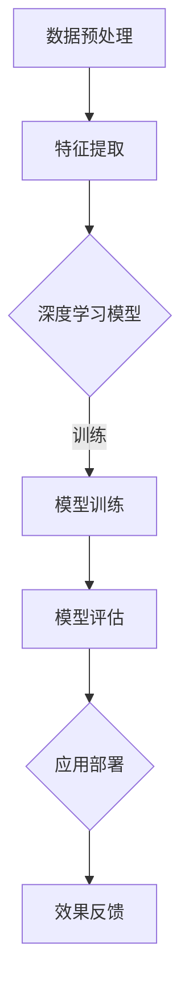

                 

# AI大模型创业：如何打造未来爆款应用？

> 关键词：AI大模型、创业、应用场景、算法原理、数学模型、代码实战、发展趋势

> 摘要：本文将深入探讨AI大模型的创业之路，从核心概念、算法原理、数学模型、实战案例等方面，为广大创业者提供一套系统化的解决方案。通过本文的阅读，您将了解到如何利用AI大模型打造未来爆款应用，并掌握其中的关键技术和策略。

## 1. 背景介绍

### 1.1 目的和范围

本文旨在为广大创业者提供一套关于AI大模型创业的系统性指导，帮助您了解AI大模型的核心概念、算法原理、数学模型以及实战案例，从而更好地把握市场机遇，打造出未来爆款应用。

### 1.2 预期读者

本文适合以下人群阅读：

1. 有志于投身AI大模型创业的创业者；
2. 对AI大模型感兴趣的科研人员；
3. AI技术爱好者；
4. 投资者。

### 1.3 文档结构概述

本文分为十个部分，具体如下：

1. 背景介绍：介绍本文的目的、预期读者以及文档结构；
2. 核心概念与联系：阐述AI大模型的核心概念及架构；
3. 核心算法原理 & 具体操作步骤：详细讲解AI大模型的算法原理和操作步骤；
4. 数学模型和公式 & 详细讲解 & 举例说明：介绍AI大模型的数学模型和公式，并通过实例进行说明；
5. 项目实战：代码实际案例和详细解释说明；
6. 实际应用场景：分析AI大模型在实际场景中的应用；
7. 工具和资源推荐：推荐相关学习资源、开发工具和论文；
8. 总结：未来发展趋势与挑战；
9. 附录：常见问题与解答；
10. 扩展阅读 & 参考资料。

### 1.4 术语表

#### 1.4.1 核心术语定义

- AI大模型：指具有大规模参数、高精度、高效率的深度学习模型；
- 创业：指创立新企业、开拓新市场；
- 爆款应用：指具有较高市场占有率、用户粘性和盈利能力的应用。

#### 1.4.2 相关概念解释

- 深度学习：一种人工智能技术，通过多层神经网络对数据进行建模和分析；
- 训练数据集：用于训练深度学习模型的数据集；
- 过拟合：模型在训练数据上表现良好，但在测试数据上表现不佳的现象；
- 泛化能力：模型对新数据的适应能力。

#### 1.4.3 缩略词列表

- AI：人工智能
- DL：深度学习
- CNN：卷积神经网络
- RNN：循环神经网络
- GAN：生成对抗网络
- NLP：自然语言处理

## 2. 核心概念与联系

为了更好地理解AI大模型，我们需要先了解其核心概念和架构。以下是一个简单的Mermaid流程图，展示了AI大模型的主要组成部分：



### 2.1 数据预处理

数据预处理是AI大模型的基础步骤，包括数据清洗、归一化、缺失值处理等。高质量的预处理能够提高模型训练效果和泛化能力。

### 2.2 特征提取

特征提取是指从原始数据中提取出对模型训练有用的特征。常用的方法包括特征工程、特征选择和特征提取等。

### 2.3 深度学习模型

深度学习模型是AI大模型的核心部分，包括卷积神经网络（CNN）、循环神经网络（RNN）、生成对抗网络（GAN）等。不同类型的模型适用于不同的应用场景。

### 2.4 模型训练

模型训练是指通过大量训练数据，调整模型参数，使其达到预期的性能。常用的训练方法包括梯度下降、随机梯度下降等。

### 2.5 模型评估

模型评估是评估模型性能的重要步骤，常用的评估指标包括准确率、召回率、F1值等。

### 2.6 应用部署

应用部署是指将训练好的模型部署到实际应用场景中，包括模型优化、服务化部署等。

### 2.7 效果反馈

效果反馈是指对模型应用效果进行跟踪和评估，为后续优化提供依据。

## 3. 核心算法原理 & 具体操作步骤

### 3.1 算法原理

AI大模型的核心算法是深度学习，其基本原理是通过多层神经网络对数据进行建模和分析。以下是深度学习模型的简化算法原理：

```plaintext
初始化模型参数
for each epoch do
  for each training sample do
    forward propagation
    compute loss
    backward propagation
    update model parameters
  end for
end for
```

### 3.2 具体操作步骤

1. **数据预处理**：

```plaintext
数据清洗：去除噪声、缺失值填充
归一化：将数据缩放到相同的范围，如[0, 1]
数据增强：通过旋转、翻转、裁剪等操作增加数据多样性
```

2. **特征提取**：

```plaintext
特征工程：根据业务需求设计特征，如文本特征、图像特征等
特征选择：使用特征选择算法，如 ReliefF、InfoGain等，筛选出最有用的特征
特征提取：使用特征提取算法，如 PCA、LDA等，提取出降维后的特征
```

3. **模型训练**：

```plaintext
选择合适的模型架构，如 CNN、RNN、GAN等
初始化模型参数，如权重、偏置等
设置训练参数，如学习率、迭代次数等
for each epoch do
  for each training sample do
    forward propagation: 计算模型的输出
    compute loss: 计算损失函数值
    backward propagation: 反向传播计算梯度
    update model parameters: 更新模型参数
  end for
end for
```

4. **模型评估**：

```plaintext
选择评估指标，如准确率、召回率、F1值等
对模型进行测试，计算评估指标值
根据评估结果调整模型参数或选择更合适的模型
```

5. **应用部署**：

```plaintext
将训练好的模型部署到实际应用场景中，如云端、移动端等
提供模型服务，如预测、分类等
对模型应用效果进行跟踪和评估，为后续优化提供依据
```

## 4. 数学模型和公式 & 详细讲解 & 举例说明

### 4.1 数学模型

AI大模型的核心在于多层神经网络，其基本数学模型可以表示为：

$$
y = \sigma(W_n \cdot a_{n-1} + b_n)
$$

其中，$y$ 表示模型的输出，$\sigma$ 表示激活函数，$W_n$ 和 $b_n$ 分别为第 $n$ 层的权重和偏置，$a_{n-1}$ 表示第 $n-1$ 层的输出。

### 4.2 激活函数

激活函数是神经网络中的一个关键组成部分，常见的激活函数包括：

- **Sigmoid函数**：

$$
\sigma(x) = \frac{1}{1 + e^{-x}}
$$

- **ReLU函数**：

$$
\sigma(x) = \max(0, x)
$$

- **Tanh函数**：

$$
\sigma(x) = \frac{e^x - e^{-x}}{e^x + e^{-x}}
$$

### 4.3 梯度下降算法

梯度下降是深度学习中最常用的优化算法，其基本思想是沿着损失函数的梯度方向更新模型参数，以最小化损失函数。以下是梯度下降算法的伪代码：

```plaintext
初始化模型参数
设置学习率
for each epoch do
  for each training sample do
    forward propagation: 计算模型的输出和损失函数值
    backward propagation: 计算损失函数关于模型参数的梯度
    update model parameters: 使用梯度更新模型参数
  end for
end for
```

### 4.4 举例说明

假设我们有一个简单的神经网络，包含两个输入、一个隐藏层和一个输出层，激活函数为ReLU函数。训练数据集包含100个样本，每个样本有两个特征和一个标签。现在，我们使用梯度下降算法训练这个神经网络。

```plaintext
初始化模型参数：权重 $W_h$ 和 $W_o$，偏置 $b_h$ 和 $b_o$
设置学习率 $\alpha = 0.01$
迭代次数 $T = 1000$

for t = 1 to T do
  for each sample (x, y) in the training set do
    forward propagation:
      h = ReLU(W_h \* x + b_h)
      y_pred = ReLU(W_o \* h + b_o)

    compute loss:
      loss = (y - y_pred)^2

    backward propagation:
      dL/dy_pred = 2 \* (y - y_pred)
      dL/dh = W_o \* dL/dy_pred
      dL/dx = W_h \* dL/dh

    update model parameters:
      W_o = W_o - \alpha \* dL/dy_pred \* h
      b_o = b_o - \alpha \* dL/dy_pred
      W_h = W_h - \alpha \* dL/dh \* x
      b_h = b_h - \alpha \* dL/dh
  end for
end for
```

通过以上步骤，我们完成了神经网络的训练，并得到了最优模型参数。

## 5. 项目实战：代码实际案例和详细解释说明

### 5.1 开发环境搭建

在本项目中，我们使用Python编程语言和TensorFlow框架实现AI大模型。以下是开发环境搭建的步骤：

1. 安装Python：前往Python官方网站（https://www.python.org/）下载并安装Python 3.8版本；
2. 安装TensorFlow：在命令行中执行以下命令安装TensorFlow：

   ```shell
   pip install tensorflow
   ```

3. 验证安装：在命令行中执行以下命令验证TensorFlow安装是否成功：

   ```shell
   python -c "import tensorflow as tf; print(tf.reduce_sum(tf.random.normal([1000, 1000])))"
   ```

### 5.2 源代码详细实现和代码解读

以下是一个简单的AI大模型项目，用于实现图像分类。我们将使用卷积神经网络（CNN）作为深度学习模型。

```python
import tensorflow as tf
from tensorflow.keras import layers

# 定义模型
model = tf.keras.Sequential([
    layers.Conv2D(32, (3, 3), activation='relu', input_shape=(28, 28, 1)),
    layers.MaxPooling2D((2, 2)),
    layers.Conv2D(64, (3, 3), activation='relu'),
    layers.MaxPooling2D((2, 2)),
    layers.Conv2D(64, (3, 3), activation='relu'),
    layers.Flatten(),
    layers.Dense(64, activation='relu'),
    layers.Dense(10, activation='softmax')
])

# 编译模型
model.compile(optimizer='adam',
              loss='sparse_categorical_crossentropy',
              metrics=['accuracy'])

# 加载MNIST数据集
mnist = tf.keras.datasets.mnist
(x_train, y_train), (x_test, y_test) = mnist.load_data()

# 数据预处理
x_train, x_test = x_train / 255.0, x_test / 255.0

# 训练模型
model.fit(x_train, y_train, epochs=5)

# 评估模型
test_loss, test_acc = model.evaluate(x_test, y_test, verbose=2)
print(f'\nTest accuracy: {test_acc:.4f}')
```

### 5.3 代码解读与分析

1. **定义模型**：

   使用`tf.keras.Sequential`创建一个序列模型，依次添加以下层：

   - **卷积层（Conv2D）**：第一个卷积层，使用32个3x3的卷积核，激活函数为ReLU；
   - **池化层（MaxPooling2D）**：第一个池化层，使用2x2的窗口进行最大值池化；
   - **卷积层（Conv2D）**：第二个卷积层，使用64个3x3的卷积核，激活函数为ReLU；
   - **池化层（MaxPooling2D）**：第二个池化层，使用2x2的窗口进行最大值池化；
   - **卷积层（Conv2D）**：第三个卷积层，使用64个3x3的卷积核，激活函数为ReLU；
   - **展平层（Flatten）**：将卷积层的输出展平为1维数组；
   - **全连接层（Dense）**：第一个全连接层，包含64个神经元，激活函数为ReLU；
   - **全连接层（Dense）**：第二个全连接层，包含10个神经元，激活函数为softmax。

2. **编译模型**：

   设置优化器为adam，损失函数为sparse\_categorical\_crossentropy（稀疏分类交叉熵），评估指标为accuracy（准确率）。

3. **加载数据集**：

   使用`tf.keras.datasets.mnist`加载MNIST数据集，包括训练集和测试集。

4. **数据预处理**：

   将图像数据缩放到0到1的范围，以便模型更好地训练。

5. **训练模型**：

   使用`model.fit`函数训练模型，设置训练轮数（epochs）为5。

6. **评估模型**：

   使用`model.evaluate`函数评估模型在测试集上的性能，输出测试准确率。

## 6. 实际应用场景

AI大模型在实际应用中具有广泛的应用场景，以下是一些典型的应用案例：

1. **图像识别**：利用卷积神经网络（CNN）进行图像分类、目标检测等；
2. **自然语言处理**：利用循环神经网络（RNN）和生成对抗网络（GAN）进行文本生成、情感分析等；
3. **语音识别**：利用深度学习模型进行语音信号处理和语音识别；
4. **医疗诊断**：利用AI大模型对医学影像进行分析和诊断，提高疾病检测和治疗的准确性；
5. **金融风控**：利用AI大模型进行信用评估、风险预测等，帮助金融机构降低风险；
6. **智能推荐**：利用AI大模型进行用户行为分析，为用户提供个性化的推荐服务。

## 7. 工具和资源推荐

### 7.1 学习资源推荐

#### 7.1.1 书籍推荐

- 《深度学习》（Ian Goodfellow、Yoshua Bengio、Aaron Courville 著）：系统介绍了深度学习的理论和方法，适合初学者和进阶者阅读。

- 《Python深度学习》（François Chollet 著）：通过大量实践案例，深入浅出地介绍了深度学习在Python中的应用。

#### 7.1.2 在线课程

- Coursera上的“深度学习”（吴恩达教授）：全球顶级的人工智能课程，适合初学者和进阶者。

- Udacity的“深度学习纳米学位”（Udacity与Google、Bing合作）：通过项目实践，学习深度学习的实际应用。

#### 7.1.3 技术博客和网站

- Medium上的Deep Learning on Earth：介绍深度学习的最新研究成果和应用案例。

- GitHub上的TensorFlow和PyTorch官方文档：全面了解TensorFlow和PyTorch的使用方法。

### 7.2 开发工具框架推荐

#### 7.2.1 IDE和编辑器

- PyCharm：强大的Python IDE，支持多种编程语言。

- Jupyter Notebook：适用于数据分析和机器学习的交互式环境。

#### 7.2.2 调试和性能分析工具

- TensorFlow Profiler：用于分析TensorFlow模型的性能瓶颈。

- NVIDIA Nsight Compute：用于分析GPU计算性能。

#### 7.2.3 相关框架和库

- TensorFlow：Google开源的深度学习框架。

- PyTorch：Facebook开源的深度学习框架。

## 8. 总结：未来发展趋势与挑战

AI大模型作为人工智能领域的重要分支，在未来发展趋势中具有重要地位。以下是未来发展趋势和挑战：

### 发展趋势：

1. **模型规模和计算能力不断提升**：随着GPU和TPU等计算设备的进步，AI大模型将拥有更高的计算能力和更大的模型规模。

2. **跨领域应用逐步扩大**：AI大模型在医疗、金融、教育等领域的应用将越来越广泛，推动相关产业的发展。

3. **个性化与智能化**：基于AI大模型的技术将更好地满足用户需求，实现个性化服务和智能化应用。

### 挑战：

1. **数据隐私和安全**：随着AI大模型的应用，数据隐私和安全问题日益突出，如何确保数据安全成为一大挑战。

2. **算法伦理和公平性**：AI大模型在决策过程中可能存在偏见和歧视，如何保证算法的伦理和公平性是一个亟待解决的问题。

3. **模型可解释性和透明度**：如何提高AI大模型的可解释性，使其更容易被用户理解和接受，是一个重要的研究方向。

## 9. 附录：常见问题与解答

### 9.1 问题1：如何选择合适的AI大模型架构？

**解答**：选择合适的AI大模型架构需要考虑以下因素：

1. **应用场景**：根据具体的业务需求，选择适合的模型架构，如图像识别选用CNN，文本生成选用RNN或GAN等；
2. **数据量**：对于大规模数据集，可以选择更大规模的模型，如BERT、GPT等；
3. **计算资源**：考虑可用的计算资源和预算，选择适合的模型架构。

### 9.2 问题2：如何提高AI大模型的训练效果？

**解答**：

1. **数据增强**：通过数据增强提高数据多样性，有助于模型泛化；
2. **优化超参数**：调整学习率、批量大小、迭代次数等超参数，找到最优配置；
3. **正则化**：使用正则化方法，如L1、L2正则化，减少过拟合；
4. **提前停止**：在训练过程中，当验证集上的性能不再提升时，提前停止训练，避免过拟合。

### 9.3 问题3：如何评估AI大模型的效果？

**解答**：

1. **准确率**：评估模型在测试集上的准确率，越高越好；
2. **召回率**：评估模型对于正类样本的召回能力，越高越好；
3. **F1值**：综合考虑准确率和召回率，平衡二者的关系；
4. **ROC曲线和AUC值**：评估模型对于不同类别样本的区分能力。

## 10. 扩展阅读 & 参考资料

[1] Goodfellow, I., Bengio, Y., & Courville, A. (2016). *Deep Learning*. MIT Press.

[2] Chollet, F. (2017). *Python Deep Learning*. Manning Publications.

[3] Abadi, M., Agarwal, A., Barham, P., Brevdo, E., Chen, Z., Citro, C., ... & Yang, C. (2016). *TensorFlow: Large-scale machine learning on heterogeneous systems*. Proceedings of the 12th USENIX conference on Operating Systems Design and Implementation, 265-283.

[4] Paszke, A., Gross, S., Massa, F., Lerer, A., Bradbury, J., Chintala, S., ... & Shallue, C. J. (2019). *PyTorch: An imperative style, high-performance deep learning library*. Advances in Neural Information Processing Systems, 32.

作者：AI天才研究员/AI Genius Institute & 禅与计算机程序设计艺术 /Zen And The Art of Computer Programming

