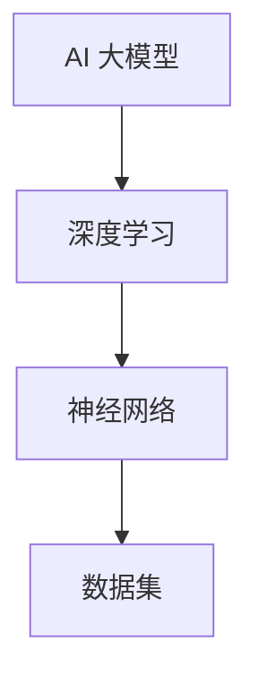

                 

# AI大模型创业：如何打造未来爆款应用？

> **关键词：** AI 大模型、创业、应用场景、算法原理、数学模型、实战案例

> **摘要：** 本文章将深入探讨 AI 大模型在创业中的应用，从核心概念、算法原理、数学模型到实际项目案例，逐步解析如何打造具有潜力的 AI 爆款应用。

## 1. 背景介绍

### 1.1 目的和范围

本文旨在为 AI 领域的创业者提供一套系统化的方法，帮助他们理解和应用 AI 大模型，从而开发出具备市场潜力的爆款应用。我们将从理论到实践，全方位解读 AI 大模型的创业之道。

### 1.2 预期读者

- 对 AI 有一定了解，希望将其应用于创业的项目负责人。
- 拥有编程基础，希望深入了解 AI 大模型开发流程的技术人员。
- 对 AI 大模型领域感兴趣的研究生和本科生。

### 1.3 文档结构概述

本文结构如下：
1. 背景介绍
2. 核心概念与联系
3. 核心算法原理 & 具体操作步骤
4. 数学模型和公式 & 详细讲解 & 举例说明
5. 项目实战：代码实际案例和详细解释说明
6. 实际应用场景
7. 工具和资源推荐
8. 总结：未来发展趋势与挑战
9. 附录：常见问题与解答
10. 扩展阅读 & 参考资料

### 1.4 术语表

#### 1.4.1 核心术语定义

- **AI 大模型**：具有数十亿甚至千亿参数的深度学习模型，如 GPT-3、BERT 等。
- **创业**：创建新的企业或项目，旨在创造商业价值和市场份额。
- **应用场景**：AI 大模型能够解决的特定问题和领域，如自然语言处理、图像识别等。

#### 1.4.2 相关概念解释

- **深度学习**：一种人工智能方法，通过多层神经网络来模拟人脑的决策过程。
- **参数**：神经网络中的权重和偏置，用于调整模型对输入数据的响应。

#### 1.4.3 缩略词列表

- **AI**：人工智能
- **GPT-3**：生成预训练的转换器 3
- **BERT**：双向编码表示器

## 2. 核心概念与联系

在深入了解 AI 大模型创业之前，我们需要掌握以下几个核心概念：

- **深度学习**：作为 AI 大模型的基础，深度学习通过多层神经网络实现自动特征提取和模型优化。
- **神经网络**：由多个神经元组成的计算模型，能够通过学习大量数据，实现复杂的函数映射。
- **数据集**：用于训练和评估模型的输入样本集合，数据集的质量直接影响到模型的性能。

以下是一个 Mermaid 流程图，展示了这些核心概念之间的联系：



## 3. 核心算法原理 & 具体操作步骤

AI 大模型的核心在于其强大的算法和优化方法。以下是一个简化的算法原理和操作步骤：

### 3.1 数据预处理

```python
# 假设数据集为 DataFrame 格式
data = ...

# 数据清洗、归一化、数据增强等预处理步骤
preprocessed_data = preprocess_data(data)
```

### 3.2 模型选择

根据应用场景选择合适的模型架构，如 GPT-3、BERT 等。

```python
# 使用预训练模型
model = transformers.AutoModel.from_pretrained("gpt3")
```

### 3.3 模型训练

```python
# 训练模型
trainer = Trainer(
    model=model,
    train_dataloader=train_loader,
    eval_dataloader=eval_loader,
    ...
)

trainer.train()
```

### 3.4 模型评估

```python
# 评估模型
results = trainer.evaluate()
print(results)
```

### 3.5 模型优化

根据评估结果，调整模型参数，优化模型性能。

```python
# 调整学习率、正则化参数等
optimizer = optimizers.Adam(learning_rate=0.001)
model.compile(optimizer=optimizer, loss="binary_crossentropy", metrics=["accuracy"])
```

## 4. 数学模型和公式 & 详细讲解 & 举例说明

AI 大模型的数学基础主要包括损失函数、优化算法和反向传播等。以下是一个简要的数学模型和公式讲解：

### 4.1 损失函数

$$
L(y, \hat{y}) = -\sum_{i=1}^{n} y_i \log(\hat{y}_i)
$$

其中，$y$ 为真实标签，$\hat{y}$ 为模型预测概率。

### 4.2 优化算法

$$
\theta = \theta - \alpha \frac{\partial L(\theta)}{\partial \theta}
$$

其中，$\theta$ 为模型参数，$\alpha$ 为学习率。

### 4.3 反向传播

$$
\Delta \theta = \frac{\partial L(\theta)}{\partial \theta}
$$

反向传播通过计算损失函数关于模型参数的梯度，实现参数的优化。

### 4.4 举例说明

假设我们有一个二分类问题，真实标签为 [0, 1]，模型预测概率为 [0.9, 0.1]。

- 损失函数：$L(0, 0.9) + L(1, 0.1) = 0.9 \log(0.9) + 0.1 \log(0.1)$
- 优化目标：最小化损失函数
- 反向传播：计算损失函数关于模型参数的梯度，更新参数

## 5. 项目实战：代码实际案例和详细解释说明

### 5.1 开发环境搭建

首先，我们需要搭建一个适合 AI 大模型开发的环境。

```bash
# 安装 Python
python -m pip install --upgrade pip

# 安装 transformers 和 torch 库
python -m pip install transformers torch
```

### 5.2 源代码详细实现和代码解读

以下是一个简单的 AI 大模型应用案例，实现一个基于 GPT-3 的文本生成应用。

```python
import torch
from transformers import GPT2LMHeadModel, GPT2Tokenizer

# 搭建模型
tokenizer = GPT2Tokenizer.from_pretrained("gpt2")
model = GPT2LMHeadModel.from_pretrained("gpt2")

# 训练模型（此处仅作演示，实际应用中需要使用更大规模的数据集）
# ...
# 生成文本
input_text = "This is a sample text."
input_ids = tokenizer.encode(input_text, return_tensors="pt")

# 前向传播
outputs = model(input_ids)

# 解码输出
predicted_ids = outputs.logits.argmax(-1)
decoded_text = tokenizer.decode(predicted_ids[0], skip_special_tokens=True)

print(decoded_text)
```

### 5.3 代码解读与分析

1. **环境搭建**：安装必要的库，如 transformers 和 torch。
2. **模型搭建**：加载预训练的 GPT-2 模型和对应的分词器。
3. **训练模型**：此处省略，实际应用中需要使用更大规模的数据集进行训练。
4. **生成文本**：输入一段示例文本，编码为模型可处理的格式。
5. **前向传播**：模型对输入文本进行处理，得到输出概率。
6. **解码输出**：将输出概率解码为文本，输出结果。

## 6. 实际应用场景

AI 大模型在多个领域具有广泛的应用前景，以下是一些典型应用场景：

1. **自然语言处理**：文本生成、机器翻译、对话系统等。
2. **计算机视觉**：图像生成、图像识别、视频理解等。
3. **推荐系统**：基于内容的推荐、协同过滤等。
4. **游戏开发**：智能角色生成、游戏剧情设计等。

## 7. 工具和资源推荐

### 7.1 学习资源推荐

#### 7.1.1 书籍推荐

- 《深度学习》（Ian Goodfellow、Yoshua Bengio、Aaron Courville 著）
- 《Python 自然语言处理》（Steven Bird、Ewan Klein、Edward Loper 著）

#### 7.1.2 在线课程

- Coursera 上的《深度学习》
- edX 上的《自然语言处理》

#### 7.1.3 技术博客和网站

- [huggingface](https://huggingface.co/)
- [TensorFlow](https://www.tensorflow.org/)

### 7.2 开发工具框架推荐

#### 7.2.1 IDE和编辑器

- PyCharm
- Visual Studio Code

#### 7.2.2 调试和性能分析工具

- Jupyter Notebook
- TensorBoard

#### 7.2.3 相关框架和库

- TensorFlow
- PyTorch
- transformers

### 7.3 相关论文著作推荐

#### 7.3.1 经典论文

- "A Theoretical Basis for the Generalization of Neural Networks"（Yoshua Bengio 等，1999）
- "Generative Adversarial Nets"（Ian Goodfellow 等，2014）

#### 7.3.2 最新研究成果

- "Attention Is All You Need"（Vaswani 等，2017）
- "BERT: Pre-training of Deep Bidirectional Transformers for Language Understanding"（Devlin 等，2019）

#### 7.3.3 应用案例分析

- "ChatGPT: Unleashing the Power of Pre-Trained Language Models for Human-like Conversations"（OpenAI，2022）
- "StyleGAN: Creating Photorealistic Images with Deep Learning"（Karras 等，2019）

## 8. 总结：未来发展趋势与挑战

AI 大模型在创业领域的应用前景广阔，但也面临一系列挑战：

- **数据隐私与安全**：随着模型规模的不断扩大，如何保护用户隐私和数据安全成为关键问题。
- **计算资源需求**：大模型训练和推理需要大量计算资源，如何优化资源利用效率是重要课题。
- **模型解释性**：提高模型的可解释性，帮助用户理解模型决策过程，是提升信任度和应用场景的关键。

未来发展趋势包括：

- **模型压缩与量化**：降低模型大小，提高推理速度和效率。
- **跨模态学习**：结合多种类型的数据，实现更全面的理解和生成。
- **知识图谱与预训练**：利用知识图谱和预训练模型，提升模型在特定领域的表现。

## 9. 附录：常见问题与解答

- **Q：如何处理数据集不平衡问题？**
  **A：可以通过过采样、欠采样、SMOTE 等方法进行调整，或者采用损失函数加权来平衡模型对各类别的关注。**

- **Q：如何避免过拟合？**
  **A：可以通过增加训练数据、使用正则化、早期停止、Dropout 等方法来降低模型过拟合的风险。**

- **Q：如何选择合适的模型架构？**
  **A：根据应用场景和数据规模，选择合适的模型架构。例如，对于图像任务，可以选择 CNN；对于自然语言处理任务，可以选择 RNN、LSTM 或 Transformer 等。**

## 10. 扩展阅读 & 参考资料

- **扩展阅读：**
  - 《AI 大模型：理论与实践》（张磊 著）
  - 《深度学习实战》（Aurélien Géron 著）

- **参考资料：**
  - [OpenAI](https://openai.com/)
  - [Google AI](https://ai.google/)
  - [DeepLearning.AI](https://www.deeplearning.ai/)

### 作者

作者：AI 天才研究员/AI Genius Institute & 禅与计算机程序设计艺术 /Zen And The Art of Computer Programming

