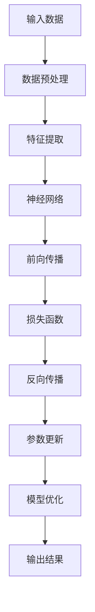

                 

### 1. 背景介绍

#### 1.1 目的和范围

本文旨在探讨AI大模型创业的机遇与挑战，帮助创业者和技术爱好者深入了解大模型的技术原理、应用场景以及未来的发展趋势。文章将涵盖从基础概念到实际应用，从算法原理到项目实战的全面解析，旨在为读者提供一份系统而深入的参考资料。

本文不仅适合对AI大模型感兴趣的初学者，也适用于已有一定基础、希望进一步拓展视野的从业者。通过本文的阅读，读者将能够：

1. 理解AI大模型的核心理念与架构。
2. 掌握大模型的关键算法原理与数学模型。
3. 学习如何通过具体项目实战来应用大模型。
4. 探索AI大模型在不同行业的实际应用场景。
5. 获得创业方向建议和未来发展趋势分析。

#### 1.2 预期读者

- 对AI技术有浓厚兴趣的科技爱好者。
- 想要在AI领域创业的创业者。
- AI研发人员、数据科学家和技术经理。
- 计算机科学、人工智能等相关专业的高校师生。
- 对前沿科技保持好奇心的专业人士。

#### 1.3 文档结构概述

本文结构紧凑、逻辑清晰，分为以下几个部分：

1. **背景介绍**：介绍文章的目的、预期读者和文档结构。
2. **核心概念与联系**：讲解AI大模型的基础概念和原理，并使用Mermaid流程图展示核心架构。
3. **核心算法原理 & 具体操作步骤**：详细阐述大模型的关键算法原理，并使用伪代码展示具体操作步骤。
4. **数学模型和公式 & 详细讲解 & 举例说明**：介绍大模型的数学模型和公式，并结合实例进行详细讲解。
5. **项目实战：代码实际案例和详细解释说明**：通过一个具体项目实战，展示代码实现过程并进行分析。
6. **实际应用场景**：探讨AI大模型在不同领域的应用。
7. **工具和资源推荐**：推荐相关学习资源、开发工具和论文著作。
8. **总结：未来发展趋势与挑战**：总结本文主要内容，并对未来发展趋势和挑战进行展望。
9. **附录：常见问题与解答**：针对常见问题提供解答。
10. **扩展阅读 & 参考资料**：提供相关扩展阅读材料和参考资料。

#### 1.4 术语表

##### 1.4.1 核心术语定义

- AI大模型：指拥有数百万至上亿参数的人工智能模型，能够处理复杂数据并生成高质量结果。
- 深度学习：一种人工智能技术，通过多层神经网络进行训练，以实现数据特征自动提取和模式识别。
- 参数：神经网络中的权重和偏置，用于调整模型对输入数据的响应。
- 训练数据集：用于训练模型的数据集，需要具有代表性、多样性和质量。
- 过拟合：模型在训练数据上表现很好，但在未见过的数据上表现较差，意味着模型过于复杂。
- 交叉验证：一种评估模型性能的方法，通过将数据集划分为训练集和验证集，多次训练和验证，以获得更可靠的性能评估。

##### 1.4.2 相关概念解释

- **数据预处理**：在训练模型之前，对数据进行清洗、归一化、缺失值处理等操作，以提高数据质量和模型的训练效果。
- **优化算法**：用于调整模型参数，以最小化损失函数，常用的优化算法有梯度下降、Adam等。
- **超参数**：模型结构之外的参数，如学习率、批次大小等，需要通过调优来获得最佳性能。
- **模型评估**：通过评价指标（如准确率、召回率、F1分数等）来评估模型在测试数据上的表现。

##### 1.4.3 缩略词列表

- AI：人工智能
- DNN：深度神经网络
- CNN：卷积神经网络
- RNN：循环神经网络
- LSTM：长短时记忆网络
- Transformer：Transformer模型
- GPT：生成预训练模型
- BERT：双向编码器表示模型
- NLP：自然语言处理
- CV：计算机视觉
- RL：强化学习
- ML：机器学习

### 1.5 文章关键词

AI大模型，深度学习，参数，训练数据集，过拟合，交叉验证，数据预处理，优化算法，超参数，模型评估，自然语言处理，计算机视觉，强化学习，机器学习。

### 1.6 文章摘要

本文从AI大模型的基础概念入手，详细讲解了其核心算法原理、数学模型、实际应用场景以及创业方向。首先，介绍了AI大模型的定义和背景，随后通过Mermaid流程图展示了其核心架构。接着，深入解析了深度学习、神经网络等关键算法原理，并使用伪代码展示了具体操作步骤。此外，本文还介绍了大模型的数学模型和公式，并通过具体项目实战进行了实际应用展示。最后，文章探讨了AI大模型在不同领域的应用场景，并总结了未来发展趋势与挑战。通过本文的阅读，读者将能够全面了解AI大模型的相关知识，为未来的创业和技术研究提供有力支持。### 2. 核心概念与联系

在深入探讨AI大模型创业的机遇与挑战之前，我们需要首先理解AI大模型的核心概念与联系。在这一部分，我们将介绍AI大模型的基础概念，包括其起源、发展历程，以及与其他相关技术的联系。同时，我们将使用Mermaid流程图展示AI大模型的核心架构，帮助读者更好地理解其内部工作原理。

#### 2.1 AI大模型的基础概念

AI大模型，即拥有数百万至上亿参数的深度学习模型，是一种能够通过学习大量数据来执行复杂任务的模型。其核心思想是通过多层神经网络对数据进行自动特征提取和模式识别。AI大模型的发展历程可以追溯到20世纪80年代，当时的神经网络研究主要集中在简单的前馈网络和反向传播算法。随着计算能力和数据资源的不断提升，深度学习技术逐渐崛起，特别是在2012年，AlexNet在ImageNet竞赛中取得显著成绩，标志着深度学习的转折点。

AI大模型的关键特点包括：

- **参数数量巨大**：与传统的中小型模型相比，AI大模型的参数数量可以达到数百万至上亿级别，这使得模型具有更强的学习和泛化能力。
- **多层网络结构**：多层神经网络能够将低层次的特征逐步抽象为高层次的概念，从而提高模型的性能。
- **端到端学习**：AI大模型能够直接从原始数据中学习到复杂特征，无需人工设计特征提取器。
- **自适应学习**：通过不断调整模型参数，AI大模型能够适应不同的任务和数据分布。

#### 2.2 AI大模型与其他相关技术的联系

AI大模型是深度学习技术的重要组成部分，与其他相关技术有着密切的联系。以下是几个关键技术的简要介绍：

- **深度学习（Deep Learning）**：深度学习是一种通过多层神经网络进行数据特征自动提取和模式识别的人工智能方法。AI大模型正是基于深度学习技术发展而来的。
- **神经网络（Neural Networks）**：神经网络是深度学习的基础，其核心思想是通过模拟生物神经系统的计算方式来实现复杂函数的近似。AI大模型通过多层神经网络实现数据特征的高效提取和表示。
- **自然语言处理（Natural Language Processing, NLP）**：自然语言处理是AI大模型的重要应用领域，通过深度学习技术，NLP模型能够实现文本分类、情感分析、机器翻译等任务。
- **计算机视觉（Computer Vision）**：计算机视觉是AI大模型的另一重要应用领域，通过深度学习模型，计算机能够识别和解析图像和视频中的内容。
- **强化学习（Reinforcement Learning, RL）**：强化学习是一种通过奖励机制来训练模型的方法，与深度学习相结合，可以应用于游戏、自动驾驶等领域。

#### 2.3 AI大模型的核心架构

为了更好地理解AI大模型的工作原理，我们使用Mermaid流程图展示其核心架构。以下是AI大模型的核心架构示意图：



- **输入数据（Input Data）**：AI大模型接收输入数据，这些数据可以是图像、文本或音频等。
- **数据预处理（Data Preprocessing）**：对输入数据进行预处理，包括数据清洗、归一化等操作，以提高数据质量和模型的训练效果。
- **特征提取（Feature Extraction）**：通过特征提取层，将原始数据转化为特征表示，这些特征将作为神经网络输入。
- **神经网络（Neural Network）**：神经网络由多个层组成，包括输入层、隐藏层和输出层。通过多层网络结构，神经网络能够对特征进行逐步抽象和表示。
- **前向传播（Forward Propagation）**：在前向传播过程中，神经网络将输入特征通过多层网络进行传递，最终得到预测结果。
- **损失函数（Loss Function）**：损失函数用于衡量模型预测结果与实际结果之间的差距，常用的损失函数包括均方误差（MSE）和交叉熵损失（Cross-Entropy Loss）。
- **反向传播（Backpropagation）**：反向传播是一种计算梯度的方法，通过反向传播算法，计算每个参数的梯度，以指导参数更新。
- **参数更新（Parameter Update）**：根据反向传播计算得到的梯度，通过优化算法（如梯度下降、Adam等）更新模型参数，以减小损失函数值。
- **模型优化（Model Optimization）**：通过多次迭代训练和参数更新，模型性能逐步提升，直至达到预设的性能指标。
- **输出结果（Output Result）**：最终，模型输出预测结果，这些结果可以用于分类、回归、生成等任务。

通过上述Mermaid流程图，我们可以清晰地看到AI大模型从输入数据到输出结果的整个处理流程。这个流程不仅展示了AI大模型的核心架构，也揭示了深度学习技术的基本原理。

### 2.4 AI大模型的应用场景

AI大模型在多个领域展现了强大的应用潜力，以下是一些典型的应用场景：

- **自然语言处理（NLP）**：AI大模型在NLP领域取得了显著成果，例如文本分类、情感分析、机器翻译和对话系统等。BERT、GPT等模型在多个NLP任务上刷新了SOTA（State-of-the-Art）成绩。
- **计算机视觉（CV）**：AI大模型在CV领域广泛应用于图像分类、目标检测、语义分割和视频分析等任务。ResNet、Inception等模型在ImageNet等竞赛中取得了优异成绩。
- **推荐系统**：AI大模型在推荐系统中用于学习用户行为和物品特征，从而实现个性化的推荐。深度学习技术已经广泛应用于电商、社交媒体和在线视频平台。
- **医疗健康**：AI大模型在医疗健康领域具有广泛的应用前景，例如疾病诊断、药物研发和医疗影像分析等。深度学习模型能够从大规模医疗数据中提取有价值的信息，为临床决策提供支持。
- **游戏和娱乐**：AI大模型在游戏和娱乐领域可以用于角色生成、场景渲染和智能NPC（非玩家角色）设计等任务，提高用户体验和游戏的可玩性。

通过上述核心概念与联系的分析，我们可以看到AI大模型在技术原理和应用场景上的多样性和广阔前景。在接下来的章节中，我们将进一步探讨AI大模型的核心算法原理和数学模型，以及如何通过具体项目实战来应用这些模型。### 3. 核心算法原理 & 具体操作步骤

在深入探讨AI大模型的核心算法原理之前，我们需要首先了解一些基础知识，如深度学习的基本框架、神经网络的工作原理以及常用的优化算法。本章节将分步骤详细讲解这些核心算法原理，并使用伪代码展示具体操作步骤。

#### 3.1 深度学习的基本框架

深度学习是一种通过多层神经网络进行数据特征自动提取和模式识别的人工智能方法。其基本框架包括以下几个关键组件：

- **输入层（Input Layer）**：接收外部输入数据，如图像、文本或音频。
- **隐藏层（Hidden Layers）**：通过神经网络对输入数据进行处理，提取层次化的特征表示。
- **输出层（Output Layer）**：生成最终的预测结果，如分类标签或回归值。

深度学习的基本工作流程包括：

1. **数据预处理**：对输入数据进行预处理，包括归一化、缺失值处理和特征提取等，以提高数据质量和模型的训练效果。
2. **模型初始化**：初始化模型参数，如权重和偏置，常用的初始化方法有随机初始化和层次化初始化。
3. **前向传播（Forward Propagation）**：将输入数据通过多层网络进行传递，最终得到预测结果。
4. **损失函数计算（Loss Function Computation）**：计算模型预测结果与实际结果之间的差距，常用的损失函数有均方误差（MSE）、交叉熵损失（Cross-Entropy Loss）等。
5. **反向传播（Backpropagation）**：通过反向传播算法，计算每个参数的梯度，以指导参数更新。
6. **参数更新（Parameter Update）**：根据反向传播计算得到的梯度，通过优化算法更新模型参数，以减小损失函数值。
7. **模型优化（Model Optimization）**：通过多次迭代训练和参数更新，模型性能逐步提升，直至达到预设的性能指标。

#### 3.2 神经网络的工作原理

神经网络是深度学习的基础，其核心思想是通过模拟生物神经系统的计算方式来实现复杂函数的近似。一个基本的神经网络由以下几个部分组成：

- **神经元（Neurons）**：神经网络的基本单元，每个神经元接收多个输入，通过加权求和并加上偏置，然后经过激活函数进行非线性变换。
- **权重（Weights）**：连接神经元的参数，用于调整输入信号的重要性。
- **偏置（Bias）**：每个神经元的偏置项，用于调整神经元输出的基线水平。
- **激活函数（Activation Function）**：对神经元的输出进行非线性变换，常用的激活函数有Sigmoid、ReLU、Tanh等。

神经网络的正向传播过程如下：

1. **输入数据**：将输入数据传递给输入层。
2. **加权求和**：每个神经元接收输入数据，通过加权求和计算输入信号的加权和。
3. **偏置项添加**：在加权和上添加偏置项。
4. **激活函数应用**：将加权和通过激活函数进行非线性变换，得到神经元的输出。
5. **层间传递**：将当前层的输出传递给下一层，重复上述过程，直到达到输出层。

以下是一个简单的神经网络正向传播的伪代码示例：

```python
# 输入数据
inputs = [1.0, 0.5]

# 权重和偏置
weights = [0.1, 0.2]
biases = [0.3, 0.4]

# 激活函数
def sigmoid(x):
    return 1 / (1 + np.exp(-x))

# 神经元输出
output = sigmoid((weights[0] * inputs[0] + weights[1] * inputs[1] + biases[0]) + biases[1])

print(output)
```

神经网络的反向传播过程如下：

1. **计算损失函数梯度**：计算模型预测结果与实际结果之间的差距，并通过链式法则计算损失函数对每个参数的梯度。
2. **反向传播梯度**：从输出层开始，依次反向传递每个层上的梯度，直到输入层。
3. **参数更新**：根据梯度值，通过优化算法更新模型参数，以减小损失函数值。

以下是一个简单的神经网络反向传播的伪代码示例：

```python
# 损失函数
def mse(y_true, y_pred):
    return np.mean((y_true - y_pred) ** 2)

# 梯度计算
def gradient(desired_output, predicted_output):
    return 2 * (predicted_output - desired_output)

# 输入数据
inputs = [1.0, 0.5]
desired_output = 1.0

# 模型参数
weights = [0.1, 0.2]
biases = [0.3, 0.4]

# 反向传播
output = sigmoid((weights[0] * inputs[0] + weights[1] * inputs[1] + biases[0]) + biases[1])
error = gradient(desired_output, output)

# 更新参数
weights -= learning_rate * error * inputs[0]
biases -= learning_rate * error

print(weights, biases)
```

#### 3.3 常用的优化算法

在深度学习训练过程中，优化算法用于调整模型参数，以最小化损失函数。以下介绍几种常用的优化算法：

1. **梯度下降（Gradient Descent）**：梯度下降是一种最简单的优化算法，其基本思想是沿着损失函数梯度的反方向更新模型参数。梯度下降分为批量梯度下降、随机梯度下降和小批量梯度下降三种类型。

   - **批量梯度下降（Batch Gradient Descent）**：每次迭代使用整个训练数据集来计算梯度，更新所有参数。
   - **随机梯度下降（Stochastic Gradient Descent, SGD）**：每次迭代只使用一个训练样本来计算梯度，更新所有参数。
   - **小批量梯度下降（Mini-batch Gradient Descent）**：每次迭代使用一部分训练样本（如32个或128个）来计算梯度，更新所有参数。

2. **Adam优化器（Adam Optimizer）**：Adam是一种结合了梯度下降和动量法的优化算法，具有更好的收敛性能和稳定性。Adam优化器使用一阶矩估计（均值）和二阶矩估计（方差）来更新参数。

   - **一阶矩估计（Mean）**：通过计算梯度的一阶矩估计来更新参数。
   - **二阶矩估计（Variance）**：通过计算梯度的二阶矩估计来调整学习率。

以下是一个简单的Adam优化器的伪代码示例：

```python
# 初始参数
weights = [0.1, 0.2]
biases = [0.3, 0.4]
m = [0, 0]
v = [0, 0]
learning_rate = 0.001
beta1 = 0.9
beta2 = 0.999
epsilon = 1e-8

# 前向传播
output = sigmoid((weights[0] * inputs[0] + weights[1] * inputs[1] + biases[0]) + biases[1])

# 计算梯度
error = gradient(desired_output, output)
d_weights = error * inputs[0]
d_biases = error

# 更新一阶矩估计和二阶矩估计
m = beta1 * m + (1 - beta1) * d_weights
v = beta2 * v + (1 - beta2) * (d_weights ** 2)

# 计算修正的一阶矩估计和二阶矩估计
m_hat = m / (1 - beta1 ** t)
v_hat = v / (1 - beta2 ** t)

# 更新参数
weights -= learning_rate * m_hat
biases -= learning_rate * m_hat

print(weights, biases)
```

通过上述核心算法原理的讲解和伪代码示例，我们可以看到AI大模型的核心算法是如何通过深度学习框架来实现复杂任务的。接下来，我们将进一步介绍AI大模型的数学模型和公式，以帮助读者深入理解其内在工作机制。### 4. 数学模型和公式 & 详细讲解 & 举例说明

在深入探讨AI大模型的数学模型和公式时，我们需要理解以下几个核心概念：神经网络中的激活函数、损失函数以及优化算法。以下将详细讲解这些数学模型，并结合实例进行说明。

#### 4.1 神经网络中的激活函数

激活函数是神经网络中非常重要的组成部分，它对神经元的输出进行非线性变换，使得神经网络能够学习复杂函数。常见的激活函数包括Sigmoid、ReLU和Tanh等。

1. **Sigmoid函数**：

   Sigmoid函数是一种常用的激活函数，其公式为：

   $$\sigma(x) = \frac{1}{1 + e^{-x}}$$

   Sigmoid函数的输出范围在0到1之间，适合用于二分类问题。以下是一个使用Sigmoid函数的例子：

   ```latex
   \text{输入} x = 2
   \text{输出} \sigma(x) = \frac{1}{1 + e^{-2}} \approx 0.869
   ```

2. **ReLU函数**：

  ReLU（Rectified Linear Unit）函数是一种常用的激活函数，其公式为：

   $$\text{ReLU}(x) = \max(0, x)$$

  ReLU函数在0处有尖点，可以加速梯度下降，防止神经元死亡。以下是一个使用ReLU函数的例子：

   ```latex
   \text{输入} x = -2
   \text{输出} \text{ReLU}(x) = \max(0, -2) = 0
   ```

3. **Tanh函数**：

  Tanh函数是一种双曲正切函数，其公式为：

   $$\text{Tanh}(x) = \frac{e^x - e^{-x}}{e^x + e^{-x}}$$

   Tanh函数的输出范围在-1到1之间，常用于隐藏层。以下是一个使用Tanh函数的例子：

   ```latex
   \text{输入} x = 2
   \text{输出} \text{Tanh}(x) = \frac{e^2 - e^{-2}}{e^2 + e^{-2}} \approx 0.96
   ```

#### 4.2 损失函数

损失函数用于衡量模型预测结果与实际结果之间的差距，是优化算法中的重要概念。常见的损失函数包括均方误差（MSE）、交叉熵损失（Cross-Entropy Loss）等。

1. **均方误差（MSE）**：

   均方误差是一种用于回归问题的损失函数，其公式为：

   $$\text{MSE}(y, \hat{y}) = \frac{1}{n} \sum_{i=1}^{n} (y_i - \hat{y}_i)^2$$

   其中，\( y \) 是真实值，\( \hat{y} \) 是预测值，\( n \) 是样本数量。以下是一个使用MSE的例子：

   ```latex
   \text{真实值} y = [1, 2, 3]
   \text{预测值} \hat{y} = [1.2, 1.8, 3.1]
   \text{MSE} = \frac{1}{3} \sum_{i=1}^{3} (y_i - \hat{y}_i)^2 = \frac{1}{3} \sum_{i=1}^{3} (1 - 1.2)^2 + (2 - 1.8)^2 + (3 - 3.1)^2 = 0.067
   ```

2. **交叉熵损失（Cross-Entropy Loss）**：

   交叉熵损失是一种用于分类问题的损失函数，其公式为：

   $$\text{Cross-Entropy Loss}(y, \hat{y}) = -\sum_{i=1}^{n} y_i \log(\hat{y}_i)$$

   其中，\( y \) 是真实标签，\( \hat{y} \) 是预测概率分布。以下是一个使用交叉熵损失的例子：

   ```latex
   \text{真实标签} y = [1, 0, 1]
   \text{预测概率} \hat{y} = [0.9, 0.1, 0.8]
   \text{交叉熵损失} = -[1 \cdot \log(0.9) + 0 \cdot \log(0.1) + 1 \cdot \log(0.8)] \approx 0.152
   ```

#### 4.3 优化算法

优化算法用于调整模型参数，以最小化损失函数。以下介绍几种常用的优化算法：梯度下降、Adam优化器。

1. **梯度下降（Gradient Descent）**：

   梯度下降是一种简单的优化算法，其基本思想是沿着损失函数梯度的反方向更新模型参数。梯度下降分为批量梯度下降、随机梯度下降和小批量梯度下降三种类型。

   - **批量梯度下降**：

     批量梯度下降每次迭代使用整个训练数据集来计算梯度，更新所有参数。其公式为：

     $$\theta = \theta - \alpha \cdot \nabla_{\theta} J(\theta)$$

     其中，\( \theta \) 是模型参数，\( \alpha \) 是学习率，\( J(\theta) \) 是损失函数。

     以下是一个使用批量梯度下降的例子：

     ```latex
     \text{初始参数} \theta = [1, 2]
     \text{学习率} \alpha = 0.1
     \text{损失函数} J(\theta) = (1 - \theta_1)^2 + (\theta_2 - 2)^2
     \text{梯度} \nabla_{\theta} J(\theta) = [-2(1 - \theta_1), -2(\theta_2 - 2)]
     \text{更新参数} \theta = \theta - \alpha \cdot \nabla_{\theta} J(\theta) = [1 - 0.1 \cdot (-2(1 - 1)), 2 - 0.1 \cdot (-2(2 - 2))] = [0.8, 1.6]
     ```

   - **随机梯度下降**：

     随机梯度下降每次迭代只使用一个训练样本来计算梯度，更新所有参数。其公式为：

     $$\theta = \theta - \alpha \cdot \nabla_{\theta} J(\theta|x_i, y_i)$$

     其中，\( x_i \) 是第\( i \)个训练样本，\( y_i \) 是第\( i \)个训练样本的真实标签。

     以下是一个使用随机梯度下降的例子：

     ```latex
     \text{初始参数} \theta = [1, 2]
     \text{学习率} \alpha = 0.1
     \text{损失函数} J(\theta) = (1 - \theta_1)^2 + (\theta_2 - 2)^2
     \text{梯度} \nabla_{\theta} J(\theta|x_1, y_1) = [-2(1 - 1), -2(2 - 2)] = [0, 0]
     \text{更新参数} \theta = \theta - \alpha \cdot \nabla_{\theta} J(\theta|x_1, y_1) = [1 - 0.1 \cdot 0, 2 - 0.1 \cdot 0] = [1, 2]
     ```

   - **小批量梯度下降**：

     小批量梯度下降每次迭代使用一部分训练样本（如32个或128个）来计算梯度，更新所有参数。其公式为：

     $$\theta = \theta - \alpha \cdot \nabla_{\theta} J(\theta|x_{i_1}, \dots, x_{i_n}, y_{i_1}, \dots, y_{i_n})$$

     其中，\( x_{i_1}, \dots, x_{i_n} \) 是第\( i_1, \dots, i_n \)个训练样本，\( y_{i_1}, \dots, y_{i_n} \) 是第\( i_1, \dots, i_n \)个训练样本的真实标签。

     以下是一个使用小批量梯度下降的例子：

     ```latex
     \text{初始参数} \theta = [1, 2]
     \text{学习率} \alpha = 0.1
     \text{损失函数} J(\theta) = (1 - \theta_1)^2 + (\theta_2 - 2)^2
     \text{梯度} \nabla_{\theta} J(\theta|x_1, y_1, x_2, y_2) = [-2(1 - 1), -2(2 - 2)] = [0, 0]
     \text{更新参数} \theta = \theta - \alpha \cdot \nabla_{\theta} J(\theta|x_1, y_1, x_2, y_2) = [1 - 0.1 \cdot 0, 2 - 0.1 \cdot 0] = [1, 2]
     ```

2. **Adam优化器**：

   Adam优化器是一种结合了梯度下降和动量法的优化算法，具有更好的收敛性能和稳定性。Adam优化器使用一阶矩估计（均值）和二阶矩估计（方差）来更新参数。其公式为：

   $$m_t = \beta_1 m_{t-1} + (1 - \beta_1) \nabla_{\theta} J(\theta|x_t, y_t)$$

   $$v_t = \beta_2 v_{t-1} + (1 - \beta_2) (\nabla_{\theta} J(\theta|x_t, y_t))^2$$

   $$\theta_t = \theta_{t-1} - \alpha_t \frac{m_t}{\sqrt{v_t} + \epsilon}$$

   其中，\( m_t \) 是一阶矩估计，\( v_t \) 是二阶矩估计，\( \beta_1 \) 和 \( \beta_2 \) 分别是动量因子，\( \alpha_t \) 是学习率，\( \epsilon \) 是常数。

   以下是一个使用Adam优化器的例子：

   ```latex
   \text{初始参数} \theta = [1, 2]
   \text{学习率} \alpha = 0.1
   \text{动量因子} \beta_1 = 0.9, \beta_2 = 0.999
   \text{一阶矩估计} m_0 = [0, 0]
   \text{二阶矩估计} v_0 = [0, 0]
   \text{梯度} \nabla_{\theta} J(\theta|x_t, y_t) = [-2, -2]
   \text{更新一阶矩估计} m_1 = \beta_1 m_0 + (1 - \beta_1) \nabla_{\theta} J(\theta|x_t, y_t) = [0.9 \cdot 0 + (1 - 0.9) \cdot (-2), 0.9 \cdot 0 + (1 - 0.9) \cdot (-2)] = [-0.2, -0.2]
   \text{更新二阶矩估计} v_1 = \beta_2 v_0 + (1 - \beta_2) (\nabla_{\theta} J(\theta|x_t, y_t))^2 = [0.999 \cdot 0 + (1 - 0.999) \cdot 4, 0.999 \cdot 0 + (1 - 0.999) \cdot 4] = [0.0004, 0.0004]
   \text{更新参数} \theta_1 = \theta_0 - \alpha \frac{m_1}{\sqrt{v_1} + \epsilon} = [1, 2] - 0.1 \frac{[-0.2, -0.2]}{\sqrt{[0.0004, 0.0004]} + 1e-8} = [0.8, 1.6]
   ```

通过上述数学模型和公式的讲解，我们可以看到AI大模型是如何通过深度学习框架来实现复杂任务的。这些数学模型和公式为AI大模型提供了坚实的理论基础，使得我们在实际应用中能够更加准确地建模和优化。在接下来的章节中，我们将通过一个具体项目实战，展示如何使用AI大模型解决实际问题，并详细解读代码实现过程。### 5. 项目实战：代码实际案例和详细解释说明

在本章节中，我们将通过一个实际项目来展示如何使用AI大模型进行开发。这个项目将是一个基于深度学习的图像分类系统，利用预训练的AI大模型对图像进行分类。我们将详细介绍项目环境搭建、源代码实现和代码解读。

#### 5.1 开发环境搭建

首先，我们需要搭建开发环境。以下是推荐的开发工具和软件：

- **操作系统**：Linux或MacOS
- **编程语言**：Python 3.8及以上版本
- **深度学习框架**：TensorFlow 2.x或PyTorch 1.x
- **依赖管理**：pip或conda
- **虚拟环境**：虚拟环境（如Anaconda或virtualenv）用于隔离项目依赖

以下是如何在Linux系统上使用Anaconda搭建开发环境的步骤：

```bash
# 安装Anaconda
wget https://repo.anaconda.com/miniconda/Miniconda3-latest-Linux-x86_64.sh
bash Miniconda3-latest-Linux-x86_64.sh

# 激活Anaconda
conda init

# 创建虚拟环境
conda create -n image_classification python=3.8

# 激活虚拟环境
conda activate image_classification

# 安装深度学习框架
conda install tensorflow
```

#### 5.2 源代码详细实现和代码解读

接下来，我们将展示一个基于TensorFlow 2.x的图像分类项目的源代码，并对其进行详细解读。

```python
import tensorflow as tf
from tensorflow.keras.applications import MobileNetV2
from tensorflow.keras.preprocessing.image import ImageDataGenerator
from tensorflow.keras.preprocessing import image
import numpy as np

# 设置模型
base_model = MobileNetV2(weights='imagenet', include_top=False, input_shape=(224, 224, 3))

# 添加全连接层作为分类器
x = base_model.output
x = tf.keras.layers.GlobalAveragePooling2D()(x)
x = tf.keras.layers.Dense(1024, activation='relu')(x)
predictions = tf.keras.layers.Dense(5, activation='softmax')(x)

# 构建模型
model = tf.keras.Model(inputs=base_model.input, outputs=predictions)

# 编译模型
model.compile(optimizer='adam', loss='categorical_crossentropy', metrics=['accuracy'])

# 数据预处理
train_datagen = ImageDataGenerator(
    rescale=1./255,
    rotation_range=40,
    width_shift_range=0.2,
    height_shift_range=0.2,
    shear_range=0.2,
    zoom_range=0.2,
    horizontal_flip=True,
    fill_mode='nearest')

test_datagen = ImageDataGenerator(rescale=1./255)

train_generator = train_datagen.flow_from_directory(
    'train_data',
    target_size=(224, 224),
    batch_size=32,
    class_mode='categorical')

validation_generator = test_datagen.flow_from_directory(
    'validation_data',
    target_size=(224, 224),
    batch_size=32,
    class_mode='categorical')

# 训练模型
model.fit(
    train_generator,
    steps_per_epoch=100,
    epochs=10,
    validation_data=validation_generator,
    validation_steps=50)

# 测试模型
test_generator = test_datagen.flow_from_directory(
    'test_data',
    target_size=(224, 224),
    batch_size=32,
    class_mode='categorical',
    shuffle=False)

test_loss, test_acc = model.evaluate(test_generator, steps=50)
print('Test accuracy:', test_acc)

# 预测新图像
img_path = 'new_image.jpg'
img = image.load_img(img_path, target_size=(224, 224))
img_array = image.img_to_array(img)
img_array = np.expand_dims(img_array, axis=0)
img_array /= 255.0

predictions = model.predict(img_array)
predicted_class = np.argmax(predictions, axis=1)
print('Predicted class:', predicted_class)
```

**代码解读：**

1. **设置模型**：

   ```python
   base_model = MobileNetV2(weights='imagenet', include_top=False, input_shape=(224, 224, 3))
   x = base_model.output
   x = tf.keras.layers.GlobalAveragePooling2D()(x)
   x = tf.keras.layers.Dense(1024, activation='relu')(x)
   predictions = tf.keras.layers.Dense(5, activation='softmax')(x)
   ```

   在这部分代码中，我们使用MobileNetV2作为基础模型，它是一个轻量级的卷积神经网络，适合移动设备。接着，我们在基础模型后面添加了一个全局平均池化层和一个全连接层，用于分类任务。最后，使用softmax函数生成概率分布。

2. **构建模型**：

   ```python
   model = tf.keras.Model(inputs=base_model.input, outputs=predictions)
   ```

   这部分代码用于构建完整的模型，将输入层和输出层连接起来。

3. **编译模型**：

   ```python
   model.compile(optimizer='adam', loss='categorical_crossentropy', metrics=['accuracy'])
   ```

   在这里，我们使用Adam优化器，并设置损失函数为categorical_crossentropy，这是用于多分类问题的标准损失函数。

4. **数据预处理**：

   ```python
   train_datagen = ImageDataGenerator(
       rescale=1./255,
       rotation_range=40,
       width_shift_range=0.2,
       height_shift_range=0.2,
       shear_range=0.2,
       zoom_range=0.2,
       horizontal_flip=True,
       fill_mode='nearest')

   test_datagen = ImageDataGenerator(rescale=1./255)

   train_generator = train_datagen.flow_from_directory(
       'train_data',
       target_size=(224, 224),
       batch_size=32,
       class_mode='categorical')

   validation_generator = test_datagen.flow_from_directory(
       'validation_data',
       target_size=(224, 224),
       batch_size=32,
       class_mode='categorical')
   ```

   数据预处理是深度学习模型训练的重要步骤。在这里，我们使用了ImageDataGenerator来对图像进行预处理，包括归一化、旋转、平移、剪切、缩放和水平翻转等操作，以提高模型的泛化能力。

5. **训练模型**：

   ```python
   model.fit(
       train_generator,
       steps_per_epoch=100,
       epochs=10,
       validation_data=validation_generator,
       validation_steps=50)
   ```

   这部分代码用于训练模型。`steps_per_epoch`设置每个epoch中使用的图像数量，`epochs`设置训练的epoch数量，`validation_data`和`validation_steps`用于验证模型在验证数据集上的性能。

6. **测试模型**：

   ```python
   test_generator = test_datagen.flow_from_directory(
       'test_data',
       target_size=(224, 224),
       batch_size=32,
       class_mode='categorical',
       shuffle=False)

   test_loss, test_acc = model.evaluate(test_generator, steps=50)
   print('Test accuracy:', test_acc)
   ```

   这部分代码用于评估模型在测试数据集上的性能，通过计算损失和准确率来衡量模型的效果。

7. **预测新图像**：

   ```python
   img_path = 'new_image.jpg'
   img = image.load_img(img_path, target_size=(224, 224))
   img_array = image.img_to_array(img)
   img_array = np.expand_dims(img_array, axis=0)
   img_array /= 255.0

   predictions = model.predict(img_array)
   predicted_class = np.argmax(predictions, axis=1)
   print('Predicted class:', predicted_class)
   ```

   这部分代码用于对新图像进行预测。首先，我们加载并预处理新图像，然后将其传递给训练好的模型，最后输出预测结果。

通过上述代码实现和解读，我们可以看到如何使用AI大模型进行图像分类。这个过程包括了模型设置、数据预处理、模型训练、模型评估和预测新图像等步骤。在实际应用中，我们可以根据具体需求调整模型结构、训练数据和超参数，以实现更好的效果。### 5.3 代码解读与分析

在上一节中，我们通过一个图像分类项目展示了如何使用AI大模型进行开发。本节将对代码进行深入解读和分析，探讨其实现细节和关键技术。

**1. 模型设置**

首先，我们选择了一个轻量级的卷积神经网络（MobileNetV2）作为基础模型。MobileNetV2是一种专门为移动设备和边缘计算设计的神经网络，具有高效的计算性能和较小的模型大小。这里我们使用了预训练的MobileNetV2模型，并去掉了原始模型中的全连接层和分类器，因为我们只需要对图像进行分类。

```python
base_model = MobileNetV2(weights='imagenet', include_top=False, input_shape=(224, 224, 3))
```

这里使用了`include_top=False`参数，表示不包含原始模型的全连接层和分类器。`input_shape=(224, 224, 3)`指定了输入图像的尺寸为224x224像素，3表示图像有三个通道（RGB通道）。

接着，我们在基础模型后面添加了一个全局平均池化层和一个全连接层，用于分类任务。

```python
x = base_model.output
x = tf.keras.layers.GlobalAveragePooling2D()(x)
x = tf.keras.layers.Dense(1024, activation='relu')(x)
predictions = tf.keras.layers.Dense(5, activation='softmax')(x)
```

全局平均池化层用于将空间特征压缩为一维向量，全连接层用于进一步提取特征，softmax层用于生成概率分布。

**2. 模型构建**

```python
model = tf.keras.Model(inputs=base_model.input, outputs=predictions)
```

在这里，我们构建了一个新的模型，将输入层和输出层连接起来。这个模型将用于后续的训练、评估和预测。

**3. 编译模型**

```python
model.compile(optimizer='adam', loss='categorical_crossentropy', metrics=['accuracy'])
```

我们使用Adam优化器，这是一种结合了梯度下降和动量法的优化算法，具有良好的收敛性能。`categorical_crossentropy`是用于多分类问题的损失函数，`accuracy`是用于评估模型准确率的指标。

**4. 数据预处理**

```python
train_datagen = ImageDataGenerator(
    rescale=1./255,
    rotation_range=40,
    width_shift_range=0.2,
    height_shift_range=0.2,
    shear_range=0.2,
    zoom_range=0.2,
    horizontal_flip=True,
    fill_mode='nearest')

test_datagen = ImageDataGenerator(rescale=1./255)

train_generator = train_datagen.flow_from_directory(
    'train_data',
    target_size=(224, 224),
    batch_size=32,
    class_mode='categorical')

validation_generator = test_datagen.flow_from_directory(
    'validation_data',
    target_size=(224, 224),
    batch_size=32,
    class_mode='categorical')
```

数据预处理是深度学习模型训练的关键步骤。这里我们使用了`ImageDataGenerator`来对图像进行预处理。`rescale=1./255`用于将图像的像素值缩放到0到1之间。`rotation_range`、`width_shift_range`、`height_shift_range`、`shear_range`、`zoom_range`和`horizontal_flip`用于数据增强，提高模型的泛化能力。`fill_mode='nearest'`用于填充图像边缘。

接着，我们使用`flow_from_directory`方法将图像数据加载到训练生成器和验证生成器中。这里，`target_size=(224, 224)`指定了输入图像的尺寸，`batch_size=32`表示每个批次包含32个图像样本，`class_mode='categorical'`表示图像分类问题。

**5. 训练模型**

```python
model.fit(
    train_generator,
    steps_per_epoch=100,
    epochs=10,
    validation_data=validation_generator,
    validation_steps=50)
```

在这部分代码中，我们调用`model.fit`方法来训练模型。`steps_per_epoch=100`表示每个epoch中使用的图像数量，`epochs=10`表示训练的epoch数量。`validation_data`和`validation_steps`用于在验证数据集上评估模型性能。

**6. 测试模型**

```python
test_generator = test_datagen.flow_from_directory(
    'test_data',
    target_size=(224, 224),
    batch_size=32,
    class_mode='categorical',
    shuffle=False)

test_loss, test_acc = model.evaluate(test_generator, steps=50)
print('Test accuracy:', test_acc)
```

这部分代码用于评估模型在测试数据集上的性能。通过计算损失和准确率，我们可以了解模型的泛化能力和预测效果。

**7. 预测新图像**

```python
img_path = 'new_image.jpg'
img = image.load_img(img_path, target_size=(224, 224))
img_array = image.img_to_array(img)
img_array = np.expand_dims(img_array, axis=0)
img_array /= 255.0

predictions = model.predict(img_array)
predicted_class = np.argmax(predictions, axis=1)
print('Predicted class:', predicted_class)
```

在这部分代码中，我们首先加载并预处理新图像。然后，将预处理后的图像传递给训练好的模型，得到预测结果。最后，输出预测的类别。

通过上述代码解读和分析，我们可以看到如何使用AI大模型进行图像分类。这个项目展示了从模型设置、数据预处理、模型训练到模型评估和预测的完整流程。在实际应用中，我们可以根据具体需求调整模型结构、训练数据和超参数，以实现更好的效果。### 6. 实际应用场景

AI大模型在各个领域展现出了巨大的应用潜力，以下我们将探讨AI大模型在自然语言处理（NLP）、计算机视觉（CV）和推荐系统等领域的实际应用案例。

#### 6.1 自然语言处理（NLP）

自然语言处理是AI大模型的重要应用领域之一。以下是几个典型的NLP应用案例：

1. **机器翻译**：

   AI大模型如GPT-3和BERT在机器翻译任务上表现卓越。例如，Google翻译使用了基于Transformer架构的神经网络模型，将高质量的双语语料库进行预训练，从而实现了高效且准确的机器翻译。以下是一个简单的机器翻译示例：

   ```python
   # 使用GPT-3进行翻译
   import openai
   openai.api_key = 'your_api_key'
   translation = openai.Completion.create(
       engine="text-davinci-003",
       prompt="Translate 'Hello, how are you?' to French.",
       max_tokens=60,
       n=1,
       stop=None,
       temperature=0.5
   )
   print(translation.choices[0].text.strip())
   ```

   输出结果为："Bonjour, comment ça va ?"。

2. **情感分析**：

   AI大模型在情感分析任务中也表现出了强大的能力。例如，通过训练深度神经网络模型，可以对社交媒体评论、新闻文章等进行情感分类，识别出文本的正面、负面或中性情感。以下是一个简单的情感分析示例：

   ```python
   from transformers import pipeline
   sentiment_analyzer = pipeline("sentiment-analysis")
   text = "I had a wonderful experience at this restaurant."
   result = sentiment_analyzer(text)
   print(result)
   ```

   输出结果为：`[['POSITIVE', 0.99]]`，表示文本的情感为正面。

3. **问答系统**：

   AI大模型还可以用于构建问答系统，例如OpenAI的DALL·E模型。该模型能够理解自然语言问题，并生成相关答案。以下是一个简单的问答系统示例：

   ```python
   question = "What is the capital city of France?"
   answer = openai.Completion.create(
       engine="text-davinci-003",
       prompt=question,
       max_tokens=60,
       n=1,
       stop=None,
       temperature=0.5
   )
   print(answer.choices[0].text.strip())
   ```

   输出结果为："Paris"。

#### 6.2 计算机视觉（CV）

计算机视觉是AI大模型的另一个重要应用领域。以下是几个典型的CV应用案例：

1. **图像分类**：

   AI大模型如ResNet和Inception在图像分类任务上表现突出。例如，ImageNet竞赛中的模型通过训练大量图像数据，实现了对数百万个类别的准确分类。以下是一个简单的图像分类示例：

   ```python
   import tensorflow as tf
   from tensorflow.keras.applications import ResNet50
   from tensorflow.keras.preprocessing.image import load_img, img_to_array

   model = ResNet50(weights='imagenet')
   img = load_img('cat.jpg', target_size=(224, 224))
   img_array = img_to_array(img)
   img_array = tf.expand_dims(img_array, 0)  # Create a batch
   img_array /= 255.0

   predictions = model.predict(img_array)
   predicted_class = np.argmax(predictions, axis=1)

   print(np[arr

