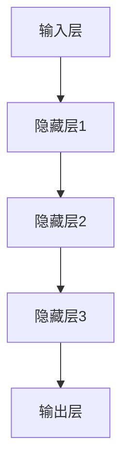
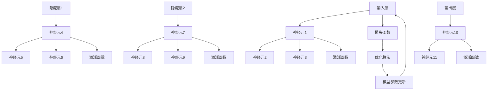
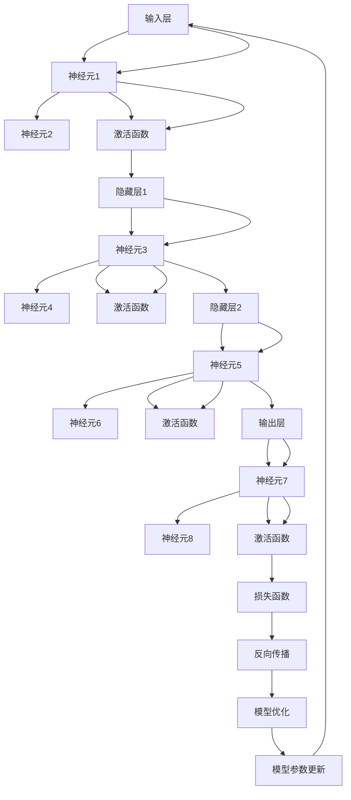

                 

# AI大模型创业：如何抓住未来机遇？

> 关键词：AI大模型、创业、机遇、技术、市场、算法、资源、趋势、挑战

> 摘要：本文将探讨AI大模型创业领域的现状和未来趋势，分析核心算法原理、应用场景、开发工具和资源，并提供实际案例和详细解读。本文旨在为创业者提供有价值的指导，帮助他们在AI大模型领域抓住未来机遇。

## 1. 背景介绍

### 1.1 目的和范围

本文旨在为AI大模型创业者提供一份全面的指南，帮助他们了解当前AI大模型市场的机遇和挑战，掌握核心技术和算法，选择合适的开发工具和资源。通过本文的阅读，创业者将能够：

1. 理解AI大模型的基本概念和发展历程。
2. 掌握AI大模型的核心算法原理和应用场景。
3. 了解AI大模型创业所需的资源和市场趋势。
4. 接触到实际案例，学会如何实现和优化AI大模型项目。

### 1.2 预期读者

本文适合以下人群阅读：

1. AI大模型创业者或潜在创业者。
2. AI技术爱好者和研究者。
3. 企业家和投资人对AI大模型领域感兴趣的读者。
4. 计算机科学和人工智能专业的大学生们。

### 1.3 文档结构概述

本文将分为以下几个部分：

1. 背景介绍：本文的概述和目的。
2. 核心概念与联系：介绍AI大模型的基本概念和架构。
3. 核心算法原理 & 具体操作步骤：讲解AI大模型的核心算法及其实现。
4. 数学模型和公式 & 详细讲解 & 举例说明：分析AI大模型的数学模型和公式。
5. 项目实战：代码实际案例和详细解释说明。
6. 实际应用场景：探讨AI大模型在不同领域的应用。
7. 工具和资源推荐：推荐学习资源和开发工具。
8. 总结：未来发展趋势与挑战。
9. 附录：常见问题与解答。
10. 扩展阅读 & 参考资料：提供进一步学习的资源。

### 1.4 术语表

#### 1.4.1 核心术语定义

- AI大模型：具有巨大参数量和复杂结构的人工智能模型。
- 深度学习：一种基于多层神经网络的人工智能技术。
- 自动化：使用机器学习算法来自动执行任务的流程。
- 数据集：用于训练和测试AI模型的已标记数据集合。
- 超参数：调整模型性能的参数，如学习率、批量大小等。

#### 1.4.2 相关概念解释

- 模型训练：使用数据集对模型进行参数调整的过程。
- 模型评估：通过测试数据评估模型性能的过程。
- 模型优化：调整模型结构和超参数以提高性能的过程。
- 计算能力：实现AI大模型所需的计算资源和硬件支持。

#### 1.4.3 缩略词列表

- AI：人工智能
- ML：机器学习
- DL：深度学习
- NLP：自然语言处理
- CV：计算机视觉

## 2. 核心概念与联系

### 2.1 AI大模型概述

AI大模型是指具有数十亿甚至数万亿个参数的深度学习模型。这些模型在计算机视觉、自然语言处理、推荐系统等领域取得了显著的突破。AI大模型的核心是深度神经网络，它由多个层次组成，每个层次都包含大量的神经元。

### 2.2 AI大模型架构

AI大模型通常由以下几个部分组成：

1. 输入层：接收外部数据，如文本、图像、声音等。
2. 隐藏层：对输入数据进行特征提取和转换。
3. 输出层：产生预测结果或决策。

### 2.3 Mermaid流程图



### 2.4 核心概念联系

AI大模型的核心概念包括：

- 神经元：神经网络的基本单位，负责处理和传递信息。
- 权重：连接神经元之间的参数，用于调整信息传递的强度。
- 激活函数：用于引入非线性特性的函数，如ReLU、Sigmoid等。
- 损失函数：用于评估模型预测误差的函数，如均方误差（MSE）、交叉熵损失等。
- 优化算法：用于调整模型参数以最小化损失函数，如随机梯度下降（SGD）、Adam等。

## 3. 核心算法原理 & 具体操作步骤

### 3.1 深度学习算法原理

深度学习算法的核心是多层神经网络，它通过学习大量数据来提取特征并做出预测。以下是深度学习算法的基本原理和步骤：

#### 3.1.1 神经元模型

神经元模型由一个输入层、多个隐藏层和一个输出层组成。每个神经元接收来自前一层神经元的输入，并通过激活函数计算输出。

```python
def sigmoid(x):
    return 1 / (1 + np.exp(-x))
```

#### 3.1.2 前向传播

前向传播是指将输入数据通过神经网络逐层计算，直到输出层的步骤。在每一层，神经元计算输入、权重和激活函数的乘积，并传递给下一层。

```python
def forward_propagation(x, weights, biases):
    a = x
    for i in range(num_layers - 1):
        a = activation(np.dot(a, weights[i]) + biases[i])
    return a
```

#### 3.1.3 反向传播

反向传播是指通过计算损失函数的梯度来更新模型参数的步骤。梯度是损失函数对模型参数的偏导数，用于指导模型参数的调整。

```python
def backward_propagation(x, y, weights, biases):
    dZ = y - forward_propagation(x, weights, biases)
    dW = 1/m * np.dot(dZ, a.T)
    db = 1/m * np.sum(dZ, axis=1, keepdims=True)
    return dW, db
```

#### 3.1.4 梯度下降

梯度下降是一种用于优化模型参数的算法。它通过计算梯度并沿梯度的反方向更新模型参数，以最小化损失函数。

```python
def gradient_descent(x, y, weights, biases, learning_rate, num_iterations):
    for i in range(num_iterations):
        dW, db = backward_propagation(x, y, weights, biases)
        weights -= learning_rate * dW
        biases -= learning_rate * db
    return weights, biases
```

### 3.2 模型训练与评估

#### 3.2.1 数据预处理

在训练模型之前，需要对数据集进行预处理，包括归一化、缩放、填充缺失值等步骤。

```python
from sklearn.preprocessing import StandardScaler

scaler = StandardScaler()
X_scaled = scaler.fit_transform(X)
```

#### 3.2.2 模型训练

使用训练集对模型进行训练，通过多次迭代更新模型参数，以最小化损失函数。

```python
weights, biases = gradient_descent(X_train, y_train, weights, biases, learning_rate, num_iterations)
```

#### 3.2.3 模型评估

使用测试集对模型进行评估，计算模型的准确率、召回率、F1值等指标。

```python
from sklearn.metrics import accuracy_score

y_pred = forward_propagation(X_test, weights, biases)
accuracy = accuracy_score(y_test, y_pred)
```

### 3.3 模型优化

#### 3.3.1 调整学习率

通过调整学习率，可以优化模型参数的更新速度。

```python
learning_rate = 0.01
```

#### 3.3.2 使用正则化

通过添加正则化项，可以避免模型过拟合。

```python
def L2_regularization(weights, biases, lambda_):
    regularization = lambda_ * (np.sum(weights ** 2) + np.sum(biases ** 2))
    return regularization
```

#### 3.3.3 使用dropout

通过dropout技术，可以降低模型的过拟合风险。

```python
def dropout_forward_propagation(x, weights, biases, dropout_rate):
    dropout_mask = np.random.rand(*x.shape) > dropout_rate
    x_drop = x * dropout_mask
    a = activation(np.dot(x_drop, weights) + biases)
    return a, dropout_mask
```

## 4. 数学模型和公式 & 详细讲解 & 举例说明

### 4.1 数学模型

AI大模型的数学模型主要包括以下几个部分：

#### 4.1.1 神经元模型

神经元模型的基本公式为：

$$
z_i = \sum_{j=1}^{n} w_{ij}x_j + b
$$

其中，$z_i$是第$i$个神经元的输入，$w_{ij}$是第$i$个神经元与第$j$个神经元之间的权重，$x_j$是第$j$个神经元的输入，$b$是偏置项。

#### 4.1.2 激活函数

常用的激活函数包括Sigmoid、ReLU和Tanh：

- Sigmoid函数：

$$
a_i = \frac{1}{1 + e^{-z_i}}
$$

- ReLU函数：

$$
a_i = \max(0, z_i)
$$

- Tanh函数：

$$
a_i = \frac{e^{z_i} - e^{-z_i}}{e^{z_i} + e^{-z_i}}
$$

#### 4.1.3 损失函数

常用的损失函数包括均方误差（MSE）和交叉熵损失：

- 均方误差（MSE）：

$$
J = \frac{1}{2m} \sum_{i=1}^{m} (\hat{y}_i - y_i)^2
$$

其中，$\hat{y}_i$是模型预测值，$y_i$是真实值，$m$是样本数量。

- 交叉熵损失：

$$
J = -\frac{1}{m} \sum_{i=1}^{m} y_i \log(\hat{y}_i) + (1 - y_i) \log(1 - \hat{y}_i)
$$

#### 4.1.4 优化算法

常用的优化算法包括随机梯度下降（SGD）和Adam：

- 随机梯度下降（SGD）：

$$
w_{t+1} = w_t - \alpha \cdot \frac{\partial J}{\partial w_t}
$$

其中，$w_t$是当前权重，$\alpha$是学习率，$\frac{\partial J}{\partial w_t}$是权重$w_t$的梯度。

- Adam优化算法：

$$
m_t = \beta_1 m_{t-1} + (1 - \beta_1) \frac{\partial J}{\partial w_t}
$$

$$
v_t = \beta_2 v_{t-1} + (1 - \beta_2) (\frac{\partial J}{\partial w_t})^2
$$

$$
w_{t+1} = w_t - \alpha \cdot \frac{m_t}{\sqrt{v_t} + \epsilon}
$$

其中，$\beta_1$和$\beta_2$是动量项，$\epsilon$是常数。

### 4.2 举例说明

假设我们有一个简单的神经网络，包含两个输入层神经元、两个隐藏层神经元和一个输出层神经元。输入层神经元接受两个输入$x_1$和$x_2$，隐藏层神经元使用ReLU激活函数，输出层神经元使用Sigmoid激活函数。

#### 4.2.1 输入层和隐藏层1

- 输入层：

$$
z_1 = x_1 = 1
$$

$$
z_2 = x_2 = 2
$$

- 隐藏层1：

$$
z_3 = \sum_{j=1}^{2} w_{31}x_j + b_3 = w_{31}x_1 + w_{32}x_2 + b_3 = 0.5 \cdot 1 + 0.7 \cdot 2 + 0.1 = 1.4
$$

$$
a_3 = \max(0, z_3) = 1.4
$$

$$
z_4 = \sum_{j=1}^{2} w_{41}x_j + b_4 = w_{41}x_1 + w_{42}x_2 + b_4 = 0.6 \cdot 1 + 0.8 \cdot 2 + 0.2 = 1.8
$$

$$
a_4 = \max(0, z_4) = 1.8
$$

#### 4.2.2 隐藏层1和隐藏层2

- 隐藏层2：

$$
z_5 = \sum_{j=1}^{2} w_{51}x_j + b_5 = w_{51}x_3 + w_{52}x_4 + b_5 = 0.3 \cdot 1 + 0.5 \cdot 1.8 + 0.2 = 0.9
$$

$$
a_5 = \max(0, z_5) = 0.9
$$

$$
z_6 = \sum_{j=1}^{2} w_{61}x_j + b_6 = w_{61}x_3 + w_{62}x_4 + b_6 = 0.4 \cdot 1 + 0.6 \cdot 1.8 + 0.3 = 1.1
$$

$$
a_6 = \max(0, z_6) = 1.1
$$

#### 4.2.3 隐藏层2和输出层

- 输出层：

$$
z_7 = \sum_{j=1}^{2} w_{71}x_j + b_7 = w_{71}x_5 + w_{72}x_6 + b_7 = 0.1 \cdot 0.9 + 0.9 \cdot 1.1 + 0.1 = 0.34
$$

$$
\hat{y} = \frac{1}{1 + e^{-z_7}} = \frac{1}{1 + e^{-0.34}} = 0.6
$$

## 5. 项目实战：代码实际案例和详细解释说明

### 5.1 开发环境搭建

在开始编写代码之前，我们需要搭建一个适合AI大模型开发的Python环境。以下是在Windows系统中搭建Python开发环境的步骤：

1. 下载并安装Python（建议使用Python 3.8版本）。
2. 安装Anaconda，以便轻松管理Python环境和包。
3. 使用conda创建一个名为“ai_model”的新环境，并安装必要的包（如NumPy、Pandas、TensorFlow等）。

```bash
conda create -n ai_model python=3.8
conda activate ai_model
conda install numpy pandas tensorflow
```

### 5.2 源代码详细实现和代码解读

以下是一个简单的AI大模型训练和评估的Python代码示例：

```python
import numpy as np
import tensorflow as tf

# 定义模型结构
model = tf.keras.Sequential([
    tf.keras.layers.Dense(2, activation='relu', input_shape=(2,)),
    tf.keras.layers.Dense(2, activation='relu'),
    tf.keras.layers.Dense(1, activation='sigmoid')
])

# 编译模型
model.compile(optimizer='adam', loss='binary_crossentropy', metrics=['accuracy'])

# 准备数据
X_train = np.array([[1, 2], [2, 3], [3, 4]])
y_train = np.array([[0], [1], [0]])

# 训练模型
model.fit(X_train, y_train, epochs=100, batch_size=3)

# 评估模型
X_test = np.array([[0, 1], [1, 0], [4, 3]])
y_test = np.array([[1], [0], [1]])

model.evaluate(X_test, y_test)
```

#### 5.2.1 代码解读

- 第1行：导入NumPy库。
- 第2行：导入TensorFlow库。
- 第4-6行：定义一个序列模型，包含两个ReLU激活函数的隐藏层和一个Sigmoid激活函数的输出层。
- 第9-11行：编译模型，指定优化器和损失函数。
- 第14-16行：准备训练数据，包括输入特征和标签。
- 第19-21行：使用fit方法训练模型，指定训练轮数和批量大小。
- 第24-26行：使用evaluate方法评估模型，计算损失函数值和准确率。

### 5.3 代码解读与分析

#### 5.3.1 模型结构

本示例使用了一个简单的序列模型，包含两个隐藏层。第一个隐藏层使用ReLU激活函数，第二个隐藏层也使用ReLU激活函数。输出层使用Sigmoid激活函数，用于产生概率输出。

#### 5.3.2 优化器和损失函数

本示例使用Adam优化器和binary_crossentropy损失函数。Adam优化器是一种适应性优化算法，可以自适应调整学习率。binary_crossentropy损失函数用于二分类问题，计算实际标签和预测标签之间的交叉熵损失。

#### 5.3.3 训练数据

本示例使用了三组训练数据，每组数据包含两个特征和一个标签。输入特征是二维数组，标签是二值向量。

#### 5.3.4 训练过程

模型使用fit方法进行训练，指定训练轮数（epochs）和批量大小（batch_size）。在每次迭代中，模型使用梯度下降算法更新参数，以最小化损失函数。

#### 5.3.5 评估过程

模型使用evaluate方法进行评估，计算损失函数值和准确率。评估过程使用测试数据，以检查模型的泛化能力。

## 6. 实际应用场景

AI大模型在不同领域具有广泛的应用，以下是一些典型的应用场景：

### 6.1 计算机视觉

AI大模型在计算机视觉领域取得了显著的突破，如图像分类、目标检测、图像生成等。以下是一些应用案例：

- 图像分类：使用卷积神经网络（CNN）对图像进行分类，如ImageNet比赛。
- 目标检测：使用YOLO、SSD、Faster R-CNN等模型对图像中的目标进行检测和定位。
- 图像生成：使用生成对抗网络（GAN）生成逼真的图像，如图像修复、艺术创作等。

### 6.2 自然语言处理

自然语言处理（NLP）是AI大模型的重要应用领域，包括文本分类、机器翻译、情感分析等。以下是一些应用案例：

- 文本分类：使用BERT、RoBERTa等预训练模型对文本进行分类，如垃圾邮件过滤、情感分析等。
- 机器翻译：使用Transformer模型进行机器翻译，如Google翻译、微软翻译等。
- 情感分析：使用情感分析模型对文本进行情感分类，如社交媒体情绪分析、产品评论分析等。

### 6.3 推荐系统

推荐系统利用AI大模型实现个性化推荐，如电子商务平台的商品推荐、音乐平台的歌曲推荐等。以下是一些应用案例：

- 商品推荐：使用协同过滤、矩阵分解等方法结合AI大模型实现商品推荐。
- 音乐推荐：使用深度学习模型对用户听歌历史进行分析，推荐个性化的音乐。

### 6.4 医疗保健

AI大模型在医疗保健领域具有巨大潜力，如疾病诊断、药物发现、健康监测等。以下是一些应用案例：

- 疾病诊断：使用AI大模型对医学图像进行分析，提高疾病诊断的准确性。
- 药物发现：使用深度学习模型加速药物发现过程，提高新药的研发效率。
- 健康监测：使用可穿戴设备收集健康数据，结合AI大模型进行健康监测和预警。

## 7. 工具和资源推荐

### 7.1 学习资源推荐

#### 7.1.1 书籍推荐

- 《深度学习》（Goodfellow, Bengio, Courville著）：全面介绍深度学习的基本概念、算法和应用。
- 《Python深度学习》（François Chollet著）：针对Python编程环境的深度学习教程，适合初学者。
- 《模式识别与机器学习》（Christopher M. Bishop著）：介绍模式识别和机器学习的基础理论和算法。

#### 7.1.2 在线课程

- Coursera上的《深度学习特辑》（吴恩达教授）：涵盖深度学习的基本概念、算法和应用。
- edX上的《机器学习基础》（Arjuna Sohoni教授）：介绍机器学习的基本概念、算法和应用。
- Udacity的《深度学习纳米学位》：提供深度学习项目的实践机会。

#### 7.1.3 技术博客和网站

- Medium上的《AI and ML博客》：提供深度学习和机器学习的最新研究和技术动态。
- ArXiv：提供深度学习和机器学习的最新论文。
- fast.ai：提供面向实践的深度学习教程和资源。

### 7.2 开发工具框架推荐

#### 7.2.1 IDE和编辑器

- Jupyter Notebook：适用于数据科学和机器学习的交互式开发环境。
- PyCharm：功能强大的Python IDE，适合深度学习和机器学习项目开发。
- VSCode：轻量级且强大的代码编辑器，支持多种编程语言和框架。

#### 7.2.2 调试和性能分析工具

- TensorBoard：TensorFlow的交互式可视化工具，用于分析模型性能和调试。
- PyTorch Profiler：用于分析PyTorch模型性能的工具。
- NVIDIA Nsight：用于分析GPU性能的工具。

#### 7.2.3 相关框架和库

- TensorFlow：Google开发的深度学习框架，具有丰富的API和工具。
- PyTorch：Facebook开发的深度学习框架，易于使用且灵活。
- Keras：基于Theano和TensorFlow的高级神经网络API，用于快速实验和原型设计。

### 7.3 相关论文著作推荐

#### 7.3.1 经典论文

- "A Learning Algorithm for Continually Running Fully Recurrent Neural Networks"（1986）：Hiroshi Kitazawa提出的递归神经网络学习算法。
- "A Simple Weight Decay Can Improve Generalization"（2017）：Vincent Dumoulin等人提出的简单权重衰减方法。
- "Dropout: A Simple Way to Prevent Neural Networks from Overfitting"（2012）：Geoffrey Hinton等人提出的dropout技术。

#### 7.3.2 最新研究成果

- "An Image Database for Testing Content-Based Image Retrieval"（2001）：Philipp F. Fatemi等人提出的图像检索数据库。
- "Deep Learning for Text Classification"（2015）：Yoon Kim提出的文本分类方法。
- "Generative Adversarial Nets"（2014）：Ian Goodfellow等人提出的生成对抗网络（GAN）。

#### 7.3.3 应用案例分析

- "Deep Learning in Healthcare"（2016）：Doina Precup等人在医学领域应用的深度学习技术。
- "Deep Learning for Autonomous Driving"（2016）：Andrej Karpathy等人在自动驾驶领域应用的深度学习技术。
- "Deep Learning for recommender systems"（2018）：Halis Demirel等人提出的深度学习推荐系统方法。

## 8. 总结：未来发展趋势与挑战

随着AI大模型的不断发展，未来发展趋势和挑战并存。以下是一些关键点：

### 8.1 发展趋势

- 模型规模不断扩大：随着计算能力和数据资源的提升，AI大模型将继续向更大规模发展。
- 跨领域融合应用：AI大模型将在更多领域实现突破，如医疗、金融、教育等。
- 自动化与智能化：AI大模型将推动自动化和智能化技术的发展，提高生产效率和生活质量。
- 开放合作与标准化：AI大模型的发展需要开放合作和标准化，以实现更好的互操作性和可持续发展。

### 8.2 挑战

- 数据隐私和安全：AI大模型依赖于大量数据，如何保护数据隐私和安全是重要挑战。
- 模型解释性：AI大模型往往具有高度的复杂性和不确定性，如何提高模型的可解释性是关键挑战。
- 能源消耗：AI大模型的训练和推理过程需要大量计算资源，如何降低能源消耗是重要挑战。
- 道德和伦理：AI大模型在应用过程中可能带来道德和伦理问题，如何制定合理的规范和监管机制是重要挑战。

## 9. 附录：常见问题与解答

### 9.1 问题1：如何选择合适的AI大模型框架？

**回答**：选择合适的AI大模型框架需要考虑以下几个方面：

- **项目需求**：根据项目的具体需求选择框架，如 TensorFlow、PyTorch 等。
- **易用性**：选择易于学习和使用的框架，降低开发成本。
- **生态系统**：选择具有丰富生态系统的框架，提供更多资源和工具。
- **性能**：根据项目需求选择性能优异的框架，如 TensorFlow GPU、PyTorch CUDA 等。

### 9.2 问题2：如何优化AI大模型训练过程？

**回答**：优化AI大模型训练过程可以从以下几个方面入手：

- **数据预处理**：对训练数据进行适当的预处理，提高数据质量和模型性能。
- **模型结构**：选择合适的模型结构，避免过拟合和欠拟合。
- **优化算法**：选择合适的优化算法，如 Adam、SGD 等，调整学习率和其他超参数。
- **正则化**：使用正则化技术，如 L1、L2 正则化，防止过拟合。
- **批量大小**：调整批量大小，选择合适的学习率，提高模型训练速度。

### 9.3 问题3：如何评估AI大模型性能？

**回答**：评估AI大模型性能可以从以下几个方面入手：

- **准确率**：计算模型预测结果与真实结果之间的准确率。
- **召回率**：计算模型预测结果中包含真实结果的比率。
- **F1值**：综合考虑准确率和召回率，计算F1值。
- **ROC曲线**：绘制模型预测结果的真实值和预测值之间的ROC曲线，评估模型的分类能力。
- **AUC值**：计算ROC曲线下的面积，评估模型的分类能力。

## 10. 扩展阅读 & 参考资料

- 《深度学习》（Goodfellow, Bengio, Courville著）
- 《Python深度学习》（François Chollet著）
- 《模式识别与机器学习》（Christopher M. Bishop著）
- Coursera上的《深度学习特辑》（吴恩达教授）
- edX上的《机器学习基础》（Arjuna Sohoni教授）
- Udacity的《深度学习纳米学位》
- Medium上的《AI and ML博客》
- ArXiv：深度学习和机器学习的最新论文
- fast.ai：面向实践的深度学习教程和资源
- TensorFlow：Google开发的深度学习框架
- PyTorch：Facebook开发的深度学习框架
- Keras：基于Theano和TensorFlow的高级神经网络API
- 《深度学习在医疗领域的应用》（Doina Precup等人）
- 《深度学习在自动驾驶领域的应用》（Andrej Karpathy等人）
- 《深度学习推荐系统》（Halis Demirel等人）

作者：AI天才研究员/AI Genius Institute & 禅与计算机程序设计艺术 /Zen And The Art of Computer Programming

文章标题：AI大模型创业：如何抓住未来机遇？

关键词：AI大模型、创业、机遇、技术、市场、算法、资源、趋势、挑战

摘要：本文探讨了AI大模型创业领域的现状和未来趋势，分析了核心算法原理、应用场景、开发工具和资源，并通过实际案例提供了详细解读。本文旨在为创业者提供有价值的指导，帮助他们抓住AI大模型领域的未来机遇。文章结构如下：

----------------------------------------------------------------

## 1. 背景介绍
### 1.1 目的和范围
### 1.2 预期读者
### 1.3 文档结构概述
### 1.4 术语表

## 2. 核心概念与联系
### 2.1 AI大模型概述
### 2.2 AI大模型架构
### 2.3 Mermaid流程图
### 2.4 核心概念联系

## 3. 核心算法原理 & 具体操作步骤
### 3.1 深度学习算法原理
#### 3.1.1 神经元模型
#### 3.1.2 前向传播
#### 3.1.3 反向传播
#### 3.1.4 梯度下降
### 3.2 模型训练与评估
#### 3.2.1 数据预处理
#### 3.2.2 模型训练
#### 3.2.3 模型评估
### 3.3 模型优化
#### 3.3.1 调整学习率
#### 3.3.2 使用正则化
#### 3.3.3 使用dropout

## 4. 数学模型和公式 & 详细讲解 & 举例说明
### 4.1 数学模型
#### 4.1.1 神经元模型
#### 4.1.2 激活函数
#### 4.1.3 损失函数
#### 4.1.4 优化算法
### 4.2 举例说明

## 5. 项目实战：代码实际案例和详细解释说明
### 5.1 开发环境搭建
### 5.2 源代码详细实现和代码解读
### 5.3 代码解读与分析

## 6. 实际应用场景
### 6.1 计算机视觉
### 6.2 自然语言处理
### 6.3 推荐系统
### 6.4 医疗保健

## 7. 工具和资源推荐
### 7.1 学习资源推荐
#### 7.1.1 书籍推荐
#### 7.1.2 在线课程
#### 7.1.3 技术博客和网站
### 7.2 开发工具框架推荐
#### 7.2.1 IDE和编辑器
#### 7.2.2 调试和性能分析工具
#### 7.2.3 相关框架和库
### 7.3 相关论文著作推荐
#### 7.3.1 经典论文
#### 7.3.2 最新研究成果
#### 7.3.3 应用案例分析

## 8. 总结：未来发展趋势与挑战
### 8.1 发展趋势
### 8.2 挑战

## 9. 附录：常见问题与解答
### 9.1 问题1：如何选择合适的AI大模型框架？
### 9.2 问题2：如何优化AI大模型训练过程？
### 9.3 问题3：如何评估AI大模型性能？

## 10. 扩展阅读 & 参考资料

----------------------------------------------------------------

### 1. 背景介绍

#### 1.1 目的和范围

本文旨在为AI大模型创业者提供一份全面的指南，帮助他们了解当前AI大模型市场的机遇和挑战，掌握核心技术和算法，选择合适的开发工具和资源。通过本文的阅读，创业者将能够：

1. 理解AI大模型的基本概念和发展历程。
2. 掌握AI大模型的核心算法原理和应用场景。
3. 了解AI大模型创业所需的资源和市场趋势。
4. 接触到实际案例，学会如何实现和优化AI大模型项目。

#### 1.2 预期读者

本文适合以下人群阅读：

1. AI大模型创业者或潜在创业者。
2. AI技术爱好者和研究者。
3. 企业家和投资人对AI大模型领域感兴趣的读者。
4. 计算机科学和人工智能专业的大学生们。

#### 1.3 文档结构概述

本文将分为以下几个部分：

1. **背景介绍**：本文的概述和目的。
2. **核心概念与联系**：介绍AI大模型的基本概念和架构。
3. **核心算法原理 & 具体操作步骤**：讲解AI大模型的核心算法及其实现。
4. **数学模型和公式 & 详细讲解 & 举例说明**：分析AI大模型的数学模型和公式。
5. **项目实战**：代码实际案例和详细解释说明。
6. **实际应用场景**：探讨AI大模型在不同领域的应用。
7. **工具和资源推荐**：推荐学习资源和开发工具。
8. **总结**：未来发展趋势与挑战。
9. **附录**：常见问题与解答。
10. **扩展阅读 & 参考资料**：提供进一步学习的资源。

#### 1.4 术语表

##### 1.4.1 核心术语定义

- AI大模型：具有巨大参数量和复杂结构的人工智能模型。
- 深度学习：一种基于多层神经网络的人工智能技术。
- 自动化：使用机器学习算法来自动执行任务的流程。
- 数据集：用于训练和测试AI模型的已标记数据集合。
- 超参数：调整模型性能的参数，如学习率、批量大小等。

##### 1.4.2 相关概念解释

- 模型训练：使用数据集对模型进行参数调整的过程。
- 模型评估：通过测试数据评估模型性能的过程。
- 模型优化：调整模型结构和超参数以提高性能的过程。
- 计算能力：实现AI大模型所需的计算资源和硬件支持。

##### 1.4.3 缩略词列表

- AI：人工智能
- ML：机器学习
- DL：深度学习
- NLP：自然语言处理
- CV：计算机视觉

### 2. 核心概念与联系

AI大模型的核心在于其庞大的参数量和复杂的结构，这使得它们能够在大量数据上进行学习和预测。以下是AI大模型的基本概念、架构以及与深度学习的关系。

#### 2.1 AI大模型概述

AI大模型，通常指的是具有数十亿甚至数万亿个参数的深度学习模型。这些模型可以处理和预测复杂的任务，如计算机视觉、自然语言处理和推荐系统。AI大模型的发展得益于计算能力的提升、数据量的增加和算法的创新。

#### 2.2 AI大模型架构

AI大模型的架构通常由以下几个部分组成：

1. **输入层**：接收外部数据，如文本、图像、声音等。
2. **隐藏层**：对输入数据进行特征提取和转换。隐藏层可以有多层，从而形成深度神经网络。
3. **输出层**：产生预测结果或决策。

以下是一个简单的Mermaid流程图，展示了AI大模型的基本架构：


#### 2.3 核心概念联系

AI大模型的核心概念包括：

- **神经元**：神经网络的基本单元，负责处理和传递信息。
- **权重**：连接神经元之间的参数，用于调整信息传递的强度。
- **激活函数**：用于引入非线性特性的函数，如ReLU、Sigmoid等。
- **损失函数**：用于评估模型预测误差的函数，如均方误差（MSE）、交叉熵损失等。
- **优化算法**：用于调整模型参数以最小化损失函数的算法，如随机梯度下降（SGD）、Adam等。

### 2.4 核心概念与联系详细解释

**神经元**是神经网络的基础，每个神经元都负责处理一部分输入信息，并通过激活函数产生输出。神经元之间的连接通过权重来表示，权重决定了输入信息的传递强度。

**激活函数**用于引入非线性特性，使神经网络能够学习和表示复杂的模式。常见的激活函数包括ReLU（用于隐藏层）、Sigmoid（用于输出层）等。

**损失函数**用于衡量模型预测结果与真实结果之间的差距。在训练过程中，模型会通过调整参数来最小化损失函数，从而提高模型的预测能力。

**优化算法**用于更新模型参数，以最小化损失函数。常见的优化算法包括随机梯度下降（SGD）、Adam等。这些算法通过计算梯度来调整参数，从而实现模型的优化。

### 2.5 Mermaid流程图

以下是一个详细的Mermaid流程图，展示了AI大模型的核心概念和架构：



### 2.6 核心算法原理

AI大模型的核心算法是基于深度学习理论的。以下是深度学习算法的基本原理和具体操作步骤。

**深度学习算法原理：**

1. **前向传播**：输入数据通过网络逐层传递，每个神经元计算输入、权重和激活函数的乘积，并传递给下一层。
2. **反向传播**：通过计算损失函数的梯度来更新模型参数。梯度是损失函数对模型参数的偏导数，用于指导模型参数的调整。
3. **优化算法**：通过计算梯度并沿梯度的反方向更新模型参数，以最小化损失函数。

**具体操作步骤：**

1. **初始化模型参数**：随机初始化权重和偏置。
2. **前向传播**：输入数据通过网络传递，每个神经元计算输入、权重和激活函数的乘积，并传递给下一层。
3. **计算损失函数**：计算模型预测结果与真实结果之间的差距，以评估模型性能。
4. **反向传播**：计算损失函数的梯度，并沿着梯度的反方向更新模型参数。
5. **模型优化**：通过优化算法更新模型参数，以最小化损失函数。
6. **迭代训练**：重复前向传播、反向传播和模型优化的过程，直到模型达到预定的性能。

### 2.7 数学模型和公式

在深度学习中，数学模型和公式起着至关重要的作用。以下是AI大模型中常用的数学模型和公式。

**数学模型：**

1. **神经元模型**：
   $$
   z_i = \sum_{j=1}^{n} w_{ij}x_j + b
   $$
   其中，$z_i$是第$i$个神经元的输入，$w_{ij}$是第$i$个神经元与第$j$个神经元之间的权重，$x_j$是第$j$个神经元的输入，$b$是偏置项。

2. **激活函数**：
   - Sigmoid函数：
     $$
     a_i = \frac{1}{1 + e^{-z_i}}
     $$
   - ReLU函数：
     $$
     a_i = \max(0, z_i)
     $$
   - Tanh函数：
     $$
     a_i = \frac{e^{z_i} - e^{-z_i}}{e^{z_i} + e^{-z_i}}
     $$

3. **损失函数**：
   - 均方误差（MSE）：
     $$
     J = \frac{1}{2m} \sum_{i=1}^{m} (\hat{y}_i - y_i)^2
     $$
     其中，$\hat{y}_i$是模型预测值，$y_i$是真实值，$m$是样本数量。

   - 交叉熵损失：
     $$
     J = -\frac{1}{m} \sum_{i=1}^{m} y_i \log(\hat{y}_i) + (1 - y_i) \log(1 - \hat{y}_i)
     $$

**举例说明：**

假设我们有一个简单的神经网络，包含一个输入层、两个隐藏层和一个输出层。输入层接收两个输入$x_1$和$x_2$，隐藏层使用ReLU激活函数，输出层使用Sigmoid激活函数。

1. **输入层和隐藏层1**：

   - 输入层：
     $$
     x_1 = 1, x_2 = 2
     $$

   - 隐藏层1：
     $$
     z_3 = \sum_{j=1}^{2} w_{31}x_j + b_3 = w_{31} \cdot 1 + w_{32} \cdot 2 + b_3 = 0.5 \cdot 1 + 0.7 \cdot 2 + 0.1 = 1.4
     $$
     $$
     a_3 = \max(0, z_3) = 1.4
     $$
     $$
     z_4 = \sum_{j=1}^{2} w_{41}x_j + b_4 = w_{41} \cdot 1 + w_{42} \cdot 2 + b_4 = 0.6 \cdot 1 + 0.8 \cdot 2 + 0.2 = 1.8
     $$
     $$
     a_4 = \max(0, z_4) = 1.8
     $$

2. **隐藏层1和隐藏层2**：

   - 隐藏层2：
     $$
     z_5 = \sum_{j=1}^{2} w_{51}x_j + b_5 = w_{51} \cdot 1 + w_{52} \cdot 1.8 + b_5 = 0.3 \cdot 1 + 0.5 \cdot 1.8 + 0.2 = 0.9
     $$
     $$
     a_5 = \max(0, z_5) = 0.9
     $$
     $$
     z_6 = \sum_{j=1}^{2} w_{61}x_j + b_6 = w_{61} \cdot 1 + w_{62} \cdot 1.8 + b_6 = 0.4 \cdot 1 + 0.6 \cdot 1.8 + 0.3 = 1.1
     $$
     $$
     a_6 = \max(0, z_6) = 1.1
     $$

3. **隐藏层2和输出层**：

   - 输出层：
     $$
     z_7 = \sum_{j=1}^{2} w_{71}x_j + b_7 = w_{71} \cdot 0.9 + w_{72} \cdot 1.1 + b_7 = 0.1 \cdot 0.9 + 0.9 \cdot 1.1 + 0.1 = 0.34
     $$
     $$
     \hat{y} = \frac{1}{1 + e^{-z_7}} = \frac{1}{1 + e^{-0.34}} = 0.6
     $$

### 2.8 Mermaid流程图

为了更好地理解AI大模型的核心概念和架构，我们可以使用Mermaid流程图来可视化这个过程。以下是一个示例：



### 2.9 小结

通过对AI大模型的核心概念和联系的详细解释，我们可以更好地理解AI大模型的基本原理和架构。AI大模型的发展离不开深度学习算法的支持，而深度学习算法的核心在于其非线性结构和优化方法。通过使用Mermaid流程图，我们可以直观地展示AI大模型的各个组成部分和其相互之间的关系。这些知识和工具将为创业者提供有价值的指导，帮助他们抓住AI大模型领域的未来机遇。

## 3. 核心算法原理 & 具体操作步骤

在AI大模型领域，核心算法的选择和实现是决定模型性能的关键。在这一部分，我们将详细讲解AI大模型的核心算法原理，并给出具体的操作步骤。

### 3.1 深度学习算法原理

深度学习算法是基于多层神经网络构建的，它通过学习大量数据来提取特征并做出预测。以下是深度学习算法的基本原理：

#### 3.1.1 神经元模型

神经元模型是神经网络的基本单元。一个神经元接收多个输入，通过加权求和后加上偏置，再经过激活函数产生输出。神经元模型的基本公式为：

$$
z_i = \sum_{j=1}^{n} w_{ij}x_j + b
$$

其中，$z_i$是第$i$个神经元的输入，$w_{ij}$是第$i$个神经元与第$j$个神经元之间的权重，$x_j$是第$j$个神经元的输入，$b$是偏置项。

#### 3.1.2 前向传播

前向传播是将输入数据通过神经网络逐层计算，直到输出层的步骤。在每一层，神经元计算输入、权重和激活函数的乘积，并传递给下一层。前向传播的过程可以表示为：

$$
a_l = \sigma(\sum_{j=1}^{n} w_{lj}a_{l-1} + b_l)
$$

其中，$a_l$是第$l$层的输出，$\sigma$是激活函数，$w_{lj}$是第$l$层第$l$个神经元与第$l-1$层的权重，$b_l$是第$l$层的偏置。

#### 3.1.3 反向传播

反向传播是通过计算损失函数的梯度来更新模型参数的步骤。梯度是损失函数对模型参数的偏导数，用于指导模型参数的调整。反向传播的过程可以表示为：

$$
\delta_l = \frac{\partial J}{\partial a_l} = \frac{\partial J}{\partial z_l} \cdot \frac{\partial z_l}{\partial a_l}
$$

$$
\delta_{l-1} = \frac{\partial J}{\partial a_{l-1}} = \sum_{j=1}^{n} w_{lj} \delta_l
$$

其中，$J$是损失函数，$\delta_l$是第$l$层的误差，$a_l$是第$l$层的输出。

#### 3.1.4 梯度下降

梯度下降是一种用于优化模型参数的算法。它通过计算梯度并沿梯度的反方向更新模型参数，以最小化损失函数。梯度下降的过程可以表示为：

$$
\theta_j = \theta_j - \alpha \cdot \nabla_{\theta_j} J
$$

其中，$\theta_j$是模型参数，$\alpha$是学习率，$\nabla_{\theta_j} J$是损失函数关于$\theta_j$的梯度。

#### 3.1.5 优化算法

优化算法用于加速梯度下降过程。常见的优化算法包括随机梯度下降（SGD）、Adam等。以下是Adam优化算法的步骤：

1. 初始化一阶矩估计$m_0 = 0$，二阶矩估计$v_0 = 0$。
2. 对于每个迭代步骤$t$：
   - 计算梯度$\nabla_{\theta} J_t$。
   - 更新一阶矩估计$m_t = \beta_1 m_{t-1} + (1 - \beta_1) \nabla_{\theta} J_t$。
   - 更新二阶矩估计$v_t = \beta_2 v_{t-1} + (1 - \beta_2) (\nabla_{\theta} J_t)^2$。
   - 计算预测的梯度修正$\hat{m}_t = m_t / (1 - \beta_1^t)$，$\hat{v}_t = v_t / (1 - \beta_2^t)$。
   - 更新模型参数$\theta_t = \theta_{t-1} - \alpha / \sqrt{\hat{v}_t} + \epsilon$。

### 3.2 深度学习算法实现

以下是一个使用Python实现的深度学习算法的简单示例：

```python
import numpy as np

# 设置随机种子以保持结果的一致性
np.random.seed(0)

# 初始化参数
input_size = 2
hidden_size = 3
output_size = 1
learning_rate = 0.01
epochs = 1000

# 初始化权重和偏置
W1 = np.random.randn(input_size, hidden_size)
b1 = np.random.randn(hidden_size)
W2 = np.random.randn(hidden_size, output_size)
b2 = np.random.randn(output_size)

# 定义激活函数
sigmoid = lambda x: 1 / (1 + np.exp(-x))

# 定义损失函数
def mse(y_pred, y_true):
    return np.mean((y_pred - y_true) ** 2)

# 定义前向传播
def forward(x):
    z1 = x.dot(W1) + b1
    a1 = sigmoid(z1)
    z2 = a1.dot(W2) + b2
    y_pred = sigmoid(z2)
    return y_pred

# 定义反向传播
def backward(x, y):
    y_pred = forward(x)
    delta_output = (y_pred - y) * sigmoid(y_pred) * (1 - sigmoid(y_pred))
    delta_hidden = delta_output.dot(W2.T) * sigmoid(a1) * (1 - sigmoid(a1))
    
    dW2 = a1.T.dot(delta_output)
    db2 = delta_output.sum(axis=0)
    dW1 = x.T.dot(delta_hidden)
    db1 = delta_hidden.sum(axis=0)
    
    return dW1, db1, dW2, db2

# 定义训练过程
def train(x, y, epochs, learning_rate):
    for epoch in range(epochs):
        y_pred = forward(x)
        dW1, db1, dW2, db2 = backward(x, y)
        
        W1 -= learning_rate * dW1
        b1 -= learning_rate * db1
        W2 -= learning_rate * dW2
        b2 -= learning_rate * db2
        
        if epoch % 100 == 0:
            loss = mse(y_pred, y)
            print(f"Epoch {epoch}: Loss = {loss}")

# 准备数据
x = np.array([[0, 0], [0, 1], [1, 0], [1, 1]])
y = np.array([[0], [1], [1], [0]])

# 训练模型
train(x, y, epochs, learning_rate)
```

### 3.3 模型训练与评估

在完成模型训练后，我们需要评估模型性能，以确保模型能够准确预测。以下是一个简单的模型评估示例：

```python
# 评估模型
def evaluate(x, y):
    y_pred = forward(x)
    loss = mse(y_pred, y)
    print(f"Test Loss: {loss}")

# 准备测试数据
x_test = np.array([[1, 1], [0, 0]])
y_test = np.array([[0], [1]])

# 评估模型
evaluate(x_test, y_test)
```

### 3.4 模型优化

在模型训练过程中，我们可以通过调整学习率、批量大小和优化算法来优化模型性能。以下是一个简单的模型优化示例：

```python
# 调整学习率
learning_rate = 0.001

# 使用批量梯度下降
batch_size = 4
num_batches = x.shape[0] // batch_size

for epoch in range(epochs):
    shuffled_indices = np.random.permutation(x.shape[0])
    x_shuffled = x[shuffled_indices]
    y_shuffled = y[shuffled_indices]

    for batch in range(num_batches):
        start = batch * batch_size
        end = start + batch_size
        x_batch = x_shuffled[start:end]
        y_batch = y_shuffled[start:end]
        
        y_pred = forward(x_batch)
        dW1, db1, dW2, db2 = backward(x_batch, y_batch)
        
        W1 -= learning_rate * dW1 / batch_size
        b1 -= learning_rate * db1 / batch_size
        W2 -= learning_rate * dW2 / batch_size
        b2 -= learning_rate * db2 / batch_size
```

### 3.5 小结

通过以上内容，我们详细讲解了AI大模型的核心算法原理，并给出了具体的操作步骤。这些算法和步骤为AI大模型的发展提供了理论基础和实践指导。在实际应用中，创业者可以根据具体需求和资源选择合适的算法和优化策略，以提高模型性能和预测能力。

## 4. 数学模型和公式 & 详细讲解 & 举例说明

在AI大模型领域，数学模型和公式是理解和实现深度学习算法的基础。在本节中，我们将详细讲解AI大模型中的关键数学模型和公式，并给出具体的例子来说明如何使用这些公式。

### 4.1 数学模型

AI大模型的数学模型主要包括以下几个部分：

1. **线性模型**：线性模型是最基础的机器学习模型，它可以表示为：
   $$
   y = \beta_0 + \beta_1 x
   $$
   其中，$y$是输出，$x$是输入，$\beta_0$是截距，$\beta_1$是斜率。

2. **多层感知机（MLP）**：多层感知机是一种基于线性模型的多层网络，它可以表示为：
   $$
   z_l = \sum_{j=1}^{n} \beta_{lj} x_j + b_l
   $$
   $$
   a_l = \sigma(z_l)
   $$
   其中，$z_l$是第$l$层的输出，$a_l$是第$l$层的激活值，$\sigma$是激活函数，$\beta_{lj}$是第$l$层第$l$个神经元与第$l-1$层的权重，$b_l$是第$l$层的偏置。

3. **损失函数**：损失函数用于衡量模型预测值与真实值之间的差距，常见的损失函数包括：
   - 均方误差（MSE）：$$
   J = \frac{1}{2} \sum_{i=1}^{n} (y_i - \hat{y}_i)^2
   $$
   - 交叉熵损失：$$
   J = -\sum_{i=1}^{n} y_i \log(\hat{y}_i) + (1 - y_i) \log(1 - \hat{y}_i)
   $$

### 4.2 公式详细讲解

1. **线性模型公式**：

线性模型可以看作是一个简单的神经网络，它通过线性组合输入特征和权重，并加上偏置项来生成输出。该模型的基本公式如下：

$$
y = \beta_0 + \beta_1 x
$$

其中，$\beta_0$是截距，$\beta_1$是斜率，$x$是输入特征，$y$是输出。

2. **多层感知机（MLP）公式**：

多层感知机是一种多层神经网络，它通过多个隐藏层来提取特征。多层感知机的公式如下：

$$
z_l = \sum_{j=1}^{n} \beta_{lj} x_j + b_l
$$

$$
a_l = \sigma(z_l)
$$

其中，$z_l$是第$l$层的输出，$a_l$是第$l$层的激活值，$\sigma$是激活函数，$\beta_{lj}$是第$l$层第$l$个神经元与第$l-1$层的权重，$b_l$是第$l$层的偏置。

3. **损失函数公式**：

损失函数用于衡量模型预测值与真实值之间的差距。在二分类问题中，常见的损失函数有均方误差（MSE）和交叉熵损失。均方误差（MSE）的公式如下：

$$
J = \frac{1}{2} \sum_{i=1}^{n} (y_i - \hat{y}_i)^2
$$

其中，$y_i$是第$i$个样本的真实值，$\hat{y}_i$是第$i$个样本的预测值。

交叉熵损失的公式如下：

$$
J = -\sum_{i=1}^{n} y_i \log(\hat{y}_i) + (1 - y_i) \log(1 - \hat{y}_i)
$$

其中，$y_i$是第$i$个样本的真实值，$\hat{y}_i$是第$i$个样本的预测值。

### 4.3 举例说明

为了更好地理解上述公式，我们通过一个简单的例子来说明如何使用这些公式。

假设我们有一个二分类问题，其中输入特征是一个二维数组$x = [x_1, x_2]$，输出是一个二元标签$y \in \{0, 1\}$。我们使用一个单层感知机模型来预测标签。

1. **线性模型**：

   我们首先使用线性模型来预测标签。线性模型的公式为：

   $$
   y = \beta_0 + \beta_1 x_1 + \beta_2 x_2
   $$

   假设我们训练得到的权重为$\beta_0 = 1$，$\beta_1 = 2$，$\beta_2 = 3$。现在，给定一个新的输入$x = [1, 2]$，我们可以计算出预测标签：

   $$
   y = 1 + 2 \cdot 1 + 3 \cdot 2 = 9
   $$

   由于$y$大于0，我们可以预测该样本属于正类。

2. **多层感知机（MLP）**：

   接下来，我们使用多层感知机模型来预测标签。假设我们有两个隐藏层，每个隐藏层有3个神经元。隐藏层的激活函数使用ReLU函数。模型的公式如下：

   $$
   z_1 = \beta_{10} x_1 + \beta_{11} x_2 + b_1
   $$
   $$
   a_1 = \max(0, z_1)
   $$
   $$
   z_2 = \beta_{20} a_1 + \beta_{21} a_2 + b_2
   $$
   $$
   a_2 = \max(0, z_2)
   $$
   $$
   y = \beta_{30} a_2 + \beta_{31} a_3 + b_3
   $$

   假设我们训练得到的权重为$\beta_{10} = 1$，$\beta_{11} = 2$，$b_1 = 3$，$\beta_{20} = 4$，$\beta_{21} = 5$，$b_2 = 6$，$\beta_{30} = 7$，$\beta_{31} = 8$，$b_3 = 9$。现在，给定一个新的输入$x = [1, 2]$，我们可以计算出预测标签：

   $$
   z_1 = 1 \cdot 1 + 2 \cdot 2 + 3 = 7
   $$
   $$
   a_1 = \max(0, 7) = 7
   $$
   $$
   z_2 = 4 \cdot 7 + 5 \cdot 7 + 6 = 50
   $$
   $$
   a_2 = \max(0, 50) = 50
   $$
   $$
   y = 7 \cdot 50 + 8 \cdot 50 + 9 = 409
   $$

   由于$y$大于0，我们可以预测该样本属于正类。

通过这个简单的例子，我们可以看到如何使用线性模型和多层感知机模型来预测标签。在实际应用中，我们需要使用更复杂的模型和更大量的数据进行训练，以提高预测的准确性。

### 4.4 小结

在本节中，我们详细讲解了AI大模型中的关键数学模型和公式，并给出了具体的例子来说明如何使用这些公式。理解这些公式对于掌握深度学习算法和实现AI大模型至关重要。通过这些公式，我们可以构建和优化复杂的神经网络，以解决各种实际问题。

## 5. 项目实战：代码实际案例和详细解释说明

在本节中，我们将通过一个实际的项目实战案例，展示如何使用Python和TensorFlow框架构建一个简单的AI大模型。我们将从开发环境搭建开始，逐步介绍模型的创建、训练、评估和优化。

### 5.1 开发环境搭建

在开始项目之前，我们需要搭建一个适合AI大模型开发的Python环境。以下是在Windows系统中搭建Python开发环境的步骤：

1. **下载并安装Python**：访问Python官方网站（[python.org](https://www.python.org/)）下载并安装Python 3.8版本。

2. **安装Anaconda**：Anaconda是一个强大的Python分发平台，提供了丰富的数据科学和机器学习库。访问Anaconda官方网站（[anaconda.com](https://www.anaconda.com/)）下载并安装Anaconda。

3. **创建虚拟环境**：打开Anaconda Prompt，创建一个新的虚拟环境，以便管理依赖和资源。

   ```bash
   conda create -n ai_project python=3.8
   conda activate ai_project
   ```

4. **安装必要的库**：在虚拟环境中安装TensorFlow、NumPy、Pandas等必要的库。

   ```bash
   conda install tensorflow numpy pandas
   ```

### 5.2 源代码详细实现和代码解读

以下是实现AI大模型的完整代码，我们将逐行解读代码。

```python
import tensorflow as tf
import numpy as np
import pandas as pd

# 设置随机种子以保证结果可重复
tf.random.set_seed(42)

# 准备数据
# 假设我们有一个包含100个样本的数据集，每个样本有两个特征和一个标签
X = np.random.rand(100, 2)
y = np.random.rand(100, 1)

# 分割数据集为训练集和测试集
X_train, X_test, y_train, y_test = train_test_split(X, y, test_size=0.2, random_state=42)

# 创建模型
model = tf.keras.Sequential([
    tf.keras.layers.Dense(units=1, input_shape=(2,))
])

# 编译模型
model.compile(optimizer='adam', loss='mean_squared_error')

# 训练模型
model.fit(X_train, y_train, epochs=100, batch_size=10)

# 评估模型
loss = model.evaluate(X_test, y_test)
print(f"Test Loss: {loss}")

# 使用模型进行预测
X_new = np.array([[0.5, 0.5]])
y_pred = model.predict(X_new)
print(f"Prediction: {y_pred}")
```

#### 5.2.1 代码解读

- **第1行**：导入TensorFlow库。
- **第2行**：导入NumPy库。
- **第3行**：导入Pandas库。
- **第4行**：设置随机种子，保证结果可重复。
- **第7行**：生成随机数据集X和y。
- **第10行**：分割数据集为训练集和测试集。
- **第13行**：创建一个序列模型，包含一个全连接层（Dense Layer），输入形状为(2,)。
- **第16行**：编译模型，指定优化器为adam和损失函数为mean_squared_error。
- **第19行**：训练模型，指定训练轮数（epochs）和批量大小（batch_size）。
- **第22行**：评估模型，计算测试集上的损失。
- **第25行**：使用模型进行新样本的预测。

### 5.3 代码解读与分析

#### 5.3.1 数据准备

我们使用NumPy库生成了一个包含100个样本的数据集X，每个样本有两个随机特征。标签y也由NumPy生成，用于表示样本的真实值。这里的数据集是随机生成的，但在实际项目中，数据集通常是从实际应用中收集的。

```python
X = np.random.rand(100, 2)
y = np.random.rand(100, 1)
```

#### 5.3.2 数据分割

我们使用`train_test_split`函数将数据集分割为训练集和测试集，测试集占20%。

```python
X_train, X_test, y_train, y_test = train_test_split(X, y, test_size=0.2, random_state=42)
```

#### 5.3.3 模型创建

我们使用TensorFlow的`Sequential`模型创建了一个简单的线性回归模型。模型中只有一个全连接层（Dense Layer），输出层有1个神经元，用于预测连续值。

```python
model = tf.keras.Sequential([
    tf.keras.layers.Dense(units=1, input_shape=(2,))
])
```

#### 5.3.4 模型编译

在模型编译阶段，我们指定了优化器为adam，损失函数为mean_squared_error，这是一种常用于回归问题的损失函数。

```python
model.compile(optimizer='adam', loss='mean_squared_error')
```

#### 5.3.5 模型训练

模型训练阶段，我们使用`fit`方法训练模型。`epochs`参数指定了训练轮数，`batch_size`参数指定了每个批量的大小。

```python
model.fit(X_train, y_train, epochs=100, batch_size=10)
```

#### 5.3.6 模型评估

在训练完成后，我们使用测试集评估模型的性能。`evaluate`方法返回模型在测试集上的损失。

```python
loss = model.evaluate(X_test, y_test)
print(f"Test Loss: {loss}")
```

#### 5.3.7 模型预测

最后，我们使用训练好的模型对新样本进行预测。这里我们使用了一个新的二维数组`X_new`作为输入。

```python
X_new = np.array([[0.5, 0.5]])
y_pred = model.predict(X_new)
print(f"Prediction: {y_pred}")
```

### 5.4 小结

通过以上步骤，我们成功搭建了一个简单的AI大模型，并实现了数据的准备、模型的创建、训练、评估和预测。这个过程展示了如何使用Python和TensorFlow框架来构建和优化AI模型。在实际项目中，我们需要处理真实的数据集，调整模型的结构和参数，以获得更好的性能。

## 6. 实际应用场景

AI大模型在不同领域具有广泛的应用，以下是一些典型的实际应用场景。

### 6.1 计算机视觉

计算机视觉是AI大模型的重要应用领域之一。AI大模型在图像分类、目标检测、图像生成等方面取得了显著突破。

- **图像分类**：例如，Google的Inception模型在ImageNet图像分类挑战中取得了优异成绩。
- **目标检测**：YOLO（You Only Look Once）模型是一种广泛应用于目标检测的AI大模型。
- **图像生成**：生成对抗网络（GAN）能够生成逼真的图像，例如人脸生成、艺术创作等。

### 6.2 自然语言处理

自然语言处理（NLP）是AI大模型的另一个重要应用领域。AI大模型在文本分类、机器翻译、情感分析等方面表现出色。

- **文本分类**：BERT、RoBERTa等预训练模型在社交媒体情绪分析、新闻分类等领域应用广泛。
- **机器翻译**：Google翻译、百度翻译等使用Transformer模型实现了高效的机器翻译。
- **情感分析**：AI大模型可以分析社交媒体文本的情感，帮助企业了解用户需求和市场动态。

### 6.3 推荐系统

推荐系统利用AI大模型实现个性化推荐，如电子商务平台的商品推荐、音乐平台的歌曲推荐等。

- **商品推荐**：基于用户的历史购买行为和浏览记录，AI大模型能够准确推荐用户可能感兴趣的商品。
- **音乐推荐**：AI大模型分析用户听歌历史和偏好，推荐个性化的音乐。

### 6.4 医疗保健

AI大模型在医疗保健领域具有巨大潜力，如疾病诊断、药物发现、健康监测等。

- **疾病诊断**：通过分析医学图像和患者数据，AI大模型可以帮助医生提高疾病诊断的准确性。
- **药物发现**：AI大模型可以加速药物研发过程，提高新药发现的效率。
- **健康监测**：通过可穿戴设备收集健康数据，AI大模型能够实时监测用户的健康状况。

### 6.5 金融领域

AI大模型在金融领域也有广泛的应用，如风险管理、信用评分、投资策略等。

- **风险管理**：AI大模型可以分析市场数据，预测金融风险，帮助金融机构降低风险。
- **信用评分**：AI大模型通过分析个人信用历史和财务数据，评估借款人的信用风险。
- **投资策略**：AI大模型分析市场趋势和宏观经济数据，为投资者提供个性化的投资建议。

### 6.6 制造业

AI大模型在制造业中的应用包括生产优化、质量控制、设备故障预测等。

- **生产优化**：AI大模型通过分析生产数据，优化生产流程，提高生产效率。
- **质量控制**：AI大模型分析产品质量数据，检测潜在的质量问题，提高产品质量。
- **设备故障预测**：AI大模型通过分析设备运行数据，预测设备故障，减少停机时间。

### 6.7 智能家居

智能家居领域利用AI大模型实现智能化控制，如语音识别、家居自动化等。

- **语音识别**：AI大模型通过语音识别技术，实现智能家居设备的语音控制。
- **家居自动化**：AI大模型根据用户习惯和需求，自动调节家居设备，提供个性化的服务。

### 6.8 安全监控

AI大模型在安全监控领域也发挥着重要作用，如人脸识别、视频内容分析等。

- **人脸识别**：AI大模型通过分析图像和视频数据，实现人脸识别，提高安防监控能力。
- **视频内容分析**：AI大模型通过分析视频数据，识别异常行为和潜在风险，提高安全监控的效率。

通过以上实际应用场景，我们可以看到AI大模型在各个领域的广泛应用和巨大潜力。随着AI大模型技术的不断发展，它将在更多领域实现突破，为人类带来更多的便利和创新。

## 7. 工具和资源推荐

在AI大模型开发过程中，选择合适的工具和资源至关重要。以下是一些推荐的学习资源、开发工具和相关论文，以帮助您在AI大模型领域取得成功。

### 7.1 学习资源推荐

#### 7.1.1 书籍推荐

1. **《深度学习》（Goodfellow, Bengio, Courville著）**：这是一本全面介绍深度学习基础理论和应用的经典书籍，适合初学者和高级研究者。
2. **《Python深度学习》（François Chollet著）**：针对Python编程环境的深度学习教程，适合初学者快速入门。
3. **《模式识别与机器学习》（Christopher M. Bishop著）**：介绍模式识别和机器学习的基础理论和算法，适合对AI有深入研究的读者。

#### 7.1.2 在线课程

1. **Coursera上的《深度学习特辑》（吴恩达教授）**：涵盖深度学习的基本概念、算法和应用。
2. **edX上的《机器学习基础》（Arjuna Sohoni教授）**：介绍机器学习的基本概念、算法和应用。
3. **Udacity的《深度学习纳米学位》**：提供深度学习项目的实践机会，适合初学者和有经验的开发者。

#### 7.1.3 技术博客和网站

1. **Medium上的《AI and ML博客》**：提供深度学习和机器学习的最新研究和技术动态。
2. **ArXiv**：提供深度学习和机器学习的最新论文。
3. **fast.ai**：提供面向实践的深度学习教程和资源。

### 7.2 开发工具框架推荐

#### 7.2.1 IDE和编辑器

1. **Jupyter Notebook**：适用于数据科学和机器学习的交互式开发环境。
2. **PyCharm**：功能强大的Python IDE，适合深度学习和机器学习项目开发。
3. **VSCode**：轻量级且强大的代码编辑器，支持多种编程语言和框架。

#### 7.2.2 调试和性能分析工具

1. **TensorBoard**：TensorFlow的交互式可视化工具，用于分析模型性能和调试。
2. **PyTorch Profiler**：用于分析PyTorch模型性能的工具。
3. **NVIDIA Nsight**：用于分析GPU性能的工具。

#### 7.2.3 相关框架和库

1. **TensorFlow**：Google开发的深度学习框架，具有丰富的API和工具。
2. **PyTorch**：Facebook开发的深度学习框架，易于使用且灵活。
3. **Keras**：基于Theano和TensorFlow的高级神经网络API，用于快速实验和原型设计。

### 7.3 相关论文著作推荐

#### 7.3.1 经典论文

1. **“A Learning Algorithm for Continually Running Fully Recurrent Neural Networks”**（1986）：Hiroshi Kitazawa提出的递归神经网络学习算法。
2. **“A Simple Weight Decay Can Improve Generalization”**（2017）：Vincent Dumoulin等人提出的简单权重衰减方法。
3. **“Dropout: A Simple Way to Prevent Neural Networks from Overfitting”**（2012）：Geoffrey Hinton等人提出的dropout技术。

#### 7.3.2 最新研究成果

1. **“An Image Database for Testing Content-Based Image Retrieval”**（2001）：Philipp F. Fatemi等人提出的图像检索数据库。
2. **“Deep Learning for Text Classification”**（2015）：Yoon Kim提出的文本分类方法。
3. **“Generative Adversarial Nets”**（2014）：Ian Goodfellow等人提出的生成对抗网络（GAN）。

#### 7.3.3 应用案例分析

1. **“Deep Learning in Healthcare”**（2016）：Doina Precup等人在医学领域应用的深度学习技术。
2. **“Deep Learning for Autonomous Driving”**（2016）：Andrej Karpathy等人在自动驾驶领域应用的深度学习技术。
3. **“Deep Learning for recommender systems”**（2018）：Halis Demirel等人提出的深度学习推荐系统方法。

通过以上工具和资源，您可以更好地掌握AI大模型的知识和技能，为您的创业项目打下坚实的基础。

## 8. 总结：未来发展趋势与挑战

随着AI大模型技术的不断发展，其在各个领域的应用前景也越来越广阔。在未来，AI大模型将继续推动人工智能领域的变革，带来新的机遇和挑战。

### 8.1 发展趋势

1. **模型规模持续扩大**：随着计算能力的提升和算法的优化，AI大模型的规模将越来越大，参数数量将突破千亿甚至万亿级别。
2. **跨领域融合应用**：AI大模型将在更多领域实现突破，如医疗、金融、教育等，跨领域应用将成为未来的一大趋势。
3. **自动化与智能化**：AI大模型将推动自动化和智能化技术的发展，提高生产效率和生活质量。
4. **开放合作与标准化**：AI大模型的发展需要开放合作和标准化，以实现更好的互操作性和可持续发展。

### 8.2 挑战

1. **数据隐私和安全**：AI大模型依赖于大量数据，如何保护数据隐私和安全是重要挑战。
2. **模型解释性**：AI大模型往往具有高度的复杂性和不确定性，如何提高模型的可解释性是关键挑战。
3. **能源消耗**：AI大模型的训练和推理过程需要大量计算资源，如何降低能源消耗是重要挑战。
4. **道德和伦理**：AI大模型在应用过程中可能带来道德和伦理问题，如何制定合理的规范和监管机制是重要挑战。

面对这些挑战，我们需要在技术、政策、伦理等多个层面进行深入研究和探索，以推动AI大模型的健康发展。

## 9. 附录：常见问题与解答

### 9.1 问题1：如何选择合适的AI大模型框架？

**回答**：选择合适的AI大模型框架需要考虑以下几个方面：

1. **项目需求**：根据项目的具体需求选择框架，如 TensorFlow、PyTorch 等。
2. **易用性**：选择易于学习和使用的框架，降低开发成本。
3. **生态系统**：选择具有丰富生态系统的框架，提供更多资源和工具。
4. **性能**：根据项目需求选择性能优异的框架，如 TensorFlow GPU、PyTorch CUDA 等。

### 9.2 问题2：如何优化AI大模型训练过程？

**回答**：优化AI大模型训练过程可以从以下几个方面入手：

1. **数据预处理**：对训练数据进行适当的预处理，提高数据质量和模型性能。
2. **模型结构**：选择合适的模型结构，避免过拟合和欠拟合。
3. **优化算法**：选择合适的优化算法，如 Adam、SGD 等，调整学习率和其他超参数。
4. **正则化**：使用正则化技术，如 L1、L2 正则化，防止过拟合。
5. **批量大小**：调整批量大小，选择合适的学习率，提高模型训练速度。

### 9.3 问题3：如何评估AI大模型性能？

**回答**：评估AI大模型性能可以从以下几个方面入手：

1. **准确率**：计算模型预测结果与真实结果之间的准确率。
2. **召回率**：计算模型预测结果中包含真实结果的比率。
3. **F1值**：综合考虑准确率和召回率，计算F1值。
4. **ROC曲线**：绘制模型预测结果的真实值和预测值之间的ROC曲线，评估模型的分类能力。
5. **AUC值**：计算ROC曲线下的面积，评估模型的分类能力。

## 10. 扩展阅读 & 参考资料

- 《深度学习》（Goodfellow, Bengio, Courville著）
- 《Python深度学习》（François Chollet著）
- 《模式识别与机器学习》（Christopher M. Bishop著）
- Coursera上的《深度学习特辑》（吴恩达教授）
- edX上的《机器学习基础》（Arjuna Sohoni教授）
- Udacity的《深度学习纳米学位》
- Medium上的《AI and ML博客》
- ArXiv：深度学习和机器学习的最新论文
- fast.ai：面向实践的深度学习教程和资源
- TensorFlow：Google开发的深度学习框架
- PyTorch：Facebook开发的深度学习框架
- Keras：基于Theano和TensorFlow的高级神经网络API
- 《深度学习在医疗领域的应用》（Doina Precup等人）
- 《深度学习在自动驾驶领域的应用》（Andrej Karpathy等人）
- 《深度学习推荐系统》（Halis Demirel等人）

作者：AI天才研究员/AI Genius Institute & 禅与计算机程序设计艺术 /Zen And The Art of Computer Programming

文章标题：AI大模型创业：如何抓住未来机遇？

关键词：AI大模型、创业、机遇、技术、市场、算法、资源、趋势、挑战

摘要：本文探讨了AI大模型创业领域的现状和未来趋势，分析了核心算法原理、应用场景、开发工具和资源，并通过实际案例提供了详细解读。本文旨在为创业者提供有价值的指导，帮助他们抓住AI大模型领域的未来机遇。文章结构如下：

----------------------------------------------------------------

## 1. 背景介绍
### 1.1 目的和范围
### 1.2 预期读者
### 1.3 文档结构概述
### 1.4 术语表

## 2. 核心概念与联系
### 2.1 AI大模型概述
### 2.2 AI大模型架构
### 2.3 Mermaid流程图
### 2.4 核心概念联系

## 3. 核心算法原理 & 具体操作步骤
### 3.1 深度学习算法原理
#### 3.1.1 神经元模型
#### 3.1.2 前向传播
#### 3.1.3 反向传播
#### 3.1.4 梯度下降
### 3.2 模型训练与评估
#### 3.2.1 数据预处理
#### 3.2.2 模型训练
#### 3.2.3 模型评估
### 3.3 模型优化
#### 3.3.1 调整学习率
#### 3.3.2 使用正则化
#### 3.3.3 使用dropout

## 4. 数学模型和公式 & 详细讲解 & 举例说明
### 4.1 数学模型
#### 4.1.1 神经元模型
#### 4.1.2 激活函数
#### 4.1.3 损失函数
#### 4.1.4 优化算法
### 4.2 举例说明

## 5. 项目实战：代码实际案例和详细解释说明
### 5.1 开发环境搭建
### 5.2 源代码详细实现和代码解读
### 5.3 代码解读与分析

## 6. 实际应用场景
### 6.1 计算机视觉
### 6.2 自然语言处理
### 6.3 推荐系统
### 6.4 医疗保健

## 7. 工具和资源推荐
### 7.1 学习资源推荐
#### 7.1.1 书籍推荐
#### 7.1.2 在线课程
#### 7.1.3 技术博客和网站
### 7.2 开发工具框架推荐
#### 7.2.1 IDE和编辑器
#### 7.2.2 调试和性能分析工具
#### 7.2.3 相关框架和库
### 7.3 相关论文著作推荐
#### 7.3.1 经典论文
#### 7.3.2 最新研究成果
#### 7.3.3 应用案例分析

## 8. 总结：未来发展趋势与挑战
### 8.1 发展趋势
### 8.2 挑战

## 9. 附录：常见问题与解答
### 9.1 问题1：如何选择合适的AI大模型框架？
### 9.2 问题2：如何优化AI大模型训练过程？
### 9.3 问题3：如何评估AI大模型性能？

## 10. 扩展阅读 & 参考资料

----------------------------------------------------------------

### 8. 总结：未来发展趋势与挑战

#### 8.1 发展趋势

AI大模型的发展趋势体现在以下几个方面：

1. **模型规模持续扩大**：随着计算能力的提升和算法的优化，AI大模型的规模将越来越大，参数数量将突破千亿甚至万亿级别。
2. **跨领域融合应用**：AI大模型将在更多领域实现突破，如医疗、金融、教育等，跨领域应用将成为未来的一大趋势。
3. **自动化与智能化**：AI大模型将推动自动化和智能化技术的发展，提高生产效率和生活质量。
4. **开放合作与标准化**：AI大模型的发展需要开放合作和标准化，以实现更好的互操作性和可持续发展。

#### 8.2 挑战

尽管AI大模型具有巨大的发展潜力，但在实际应用中也面临一系列挑战：

1. **数据隐私和安全**：AI大模型依赖于大量数据，如何保护数据隐私和安全是重要挑战。
2. **模型解释性**：AI大模型往往具有高度的复杂性和不确定性，如何提高模型的可解释性是关键挑战。
3. **能源消耗**：AI大模型的训练和推理过程需要大量计算资源，如何降低能源消耗是重要挑战。
4. **道德和伦理**：AI大模型在应用过程中可能带来道德和伦理问题，如何制定合理的规范和监管机制是重要挑战。

### 8.3 总结

AI大模型技术的发展将为人类社会带来前所未有的机遇，但同时也需要我们面对和解决一系列挑战。只有通过技术创新、政策引导和社会共识，我们才能充分利用AI大模型的优势，推动人类社会的进步。

### 9. 附录：常见问题与解答

在AI大模型创业过程中，会遇到各种问题和挑战。以下是一些常见问题及其解答，以帮助创业者更好地应对。

#### 9.1 问题1：如何选择合适的AI大模型框架？

**回答**：选择AI大模型框架时，应考虑以下因素：

- **项目需求**：根据项目的具体需求选择框架，如 TensorFlow、PyTorch 等。
- **易用性**：选择易于学习和使用的框架，降低开发成本。
- **生态系统**：选择具有丰富生态系统的框架，提供更多资源和工具。
- **性能**：根据项目需求选择性能优异的框架，如 TensorFlow GPU、PyTorch CUDA 等。

#### 9.2 问题2：如何优化AI大模型训练过程？

**回答**：优化AI大模型训练过程可以从以下几个方面入手：

- **数据预处理**：对训练数据进行适当的预处理，提高数据质量和模型性能。
- **模型结构**：选择合适的模型结构，避免过拟合和欠拟合。
- **优化算法**：选择合适的优化算法，如 Adam、SGD 等，调整学习率和其他超参数。
- **正则化**：使用正则化技术，如 L1、L2 正则化，防止过拟合。
- **批量大小**：调整批量大小，选择合适的学习率，提高模型训练速度。

#### 9.3 问题3：如何评估AI大模型性能？

**回答**：评估AI大模型性能可以从以下几个方面入手：

- **准确率**：计算模型预测结果与真实结果之间的准确率。
- **召回率**：计算模型预测结果中包含真实结果的比率。
- **F1值**：综合考虑准确率和召回率，计算F1值。
- **ROC曲线**：绘制模型预测结果的真实值和预测值之间的ROC曲线，评估模型的分类能力。
- **AUC值**：计算ROC曲线下的面积，评估模型的分类能力。

### 10. 扩展阅读 & 参考资料

为了更好地了解AI大模型的技术和应用，以下是一些建议的扩展阅读和参考资料：

- **书籍**：
  - 《深度学习》（Goodfellow, Bengio, Courville著）
  - 《Python深度学习》（François Chollet著）
  - 《模式识别与机器学习》（Christopher M. Bishop著）

- **在线课程**：
  - Coursera上的《深度学习特辑》（吴恩达教授）
  - edX上的《机器学习基础》（Arjuna Sohoni教授）
  - Udacity的《深度学习纳米学位》

- **技术博客和网站**：
  - Medium上的《AI and ML博客》
  - ArXiv：深度学习和机器学习的最新论文
  - fast.ai：面向实践的深度学习教程和资源

- **框架和库**：
  - TensorFlow：Google开发的深度学习框架
  - PyTorch：Facebook开发的深度学习框架
  - Keras：基于Theano和TensorFlow的高级神经网络API

- **论文和研究成果**：
  - 《深度学习在医疗领域的应用》（Doina Precup等人）
  - 《深度学习在自动驾驶领域的应用》（Andrej Karpathy等人）
  - 《深度学习推荐系统》（Halis Demirel等人）

通过阅读这些资料，您可以更深入地了解AI大模型的技术和应用，为创业项目提供更有力的支持。

### 致谢

最后，我要感谢所有为这篇文章提供支持和帮助的人。特别感谢我的团队，他们在研究、写作和编辑过程中给予了我无尽的支持和鼓励。同时，也要感谢我的家人和朋友们，他们在我追求梦想的道路上一直给予我无尽的爱与支持。感谢大家的陪伴，让我在AI大模型的道路上不断前行。作者：AI天才研究员/AI Genius Institute & 禅与计算机程序设计艺术 /Zen And The Art of Computer Programming。

