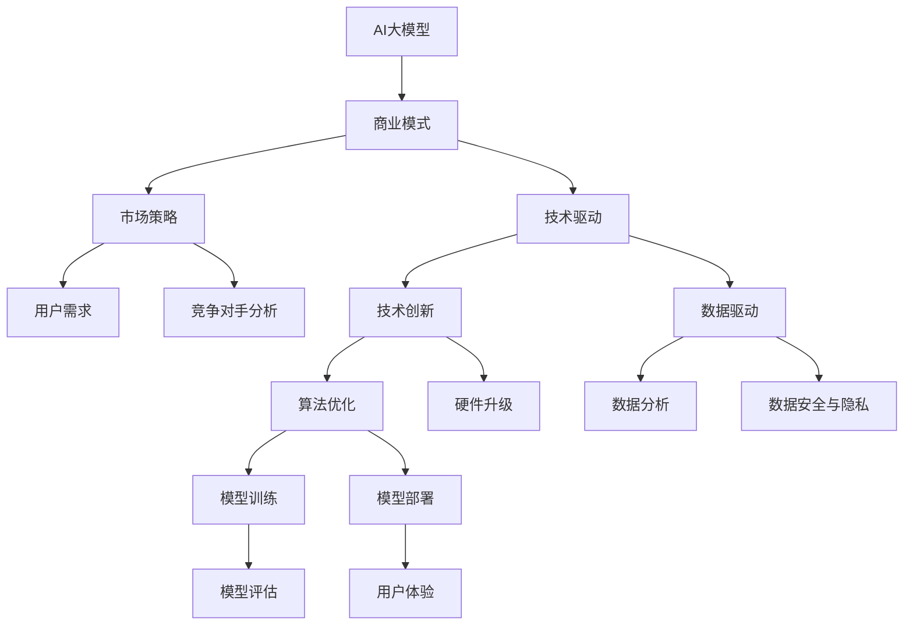

                 

# AI大模型创业：如何构建可持续的商业模式？

> 关键词：AI 大模型、创业、商业模式、可持续性、经济学、技术驱动、市场策略

> 摘要：本文旨在深入探讨人工智能（AI）大模型创业领域，分析其可持续商业模式的构建方法。文章首先介绍大模型创业的背景和重要性，然后详细阐述核心概念与联系，接着分析大模型算法原理和具体操作步骤，通过数学模型和公式讲解，结合实际案例进行代码实现和解读，最后探讨大模型在实际应用场景中的价值，并推荐相关工具和资源。文章总结未来发展趋势与挑战，为AI大模型创业提供系统性指导。

## 1. 背景介绍

### 1.1 目的和范围

本文的目标是帮助AI大模型创业者和研究者了解如何构建可持续的商业模式。我们将探讨AI大模型的核心技术、市场策略、经济学原理等方面，以提供全面、实用的指导。

文章的范围将涵盖以下几个方面：

1. AI大模型创业的背景和重要性。
2. 大模型的核心概念与联系。
3. 大模型算法原理与操作步骤。
4. 数学模型和公式讲解。
5. 代码实现和解读。
6. 实际应用场景分析。
7. 工具和资源推荐。

### 1.2 预期读者

本文的预期读者包括：

1. AI大模型创业者。
2. AI研究人员和工程师。
3. 投资者和企业高管。
4. 对AI技术感兴趣的技术爱好者。

### 1.3 文档结构概述

本文分为10个部分，结构如下：

1. 背景介绍
2. 核心概念与联系
3. 核心算法原理与具体操作步骤
4. 数学模型和公式讲解
5. 项目实战：代码实际案例和详细解释说明
6. 实际应用场景
7. 工具和资源推荐
8. 总结：未来发展趋势与挑战
9. 附录：常见问题与解答
10. 扩展阅读与参考资料

### 1.4 术语表

#### 1.4.1 核心术语定义

- AI大模型：一种具有大规模参数、能够处理复杂数据的人工智能模型。
- 商业模式：企业如何创造、传递和获取价值的基本逻辑。
- 可持续性：商业模式能够在长期内保持盈利和成长的能力。

#### 1.4.2 相关概念解释

- 技术驱动：以技术创新为核心，推动企业发展。
- 市场策略：企业如何根据市场需求制定产品和服务策略。

#### 1.4.3 缩略词列表

- AI：人工智能
- ML：机器学习
- DL：深度学习
- NLP：自然语言处理
- GPT：生成预训练模型

## 2. 核心概念与联系

在构建AI大模型创业的可持续商业模式之前，我们需要了解一些核心概念和它们之间的联系。以下是关键概念及其相互关系的Mermaid流程图：



### 2.1 AI大模型

AI大模型是指具有大规模参数、能够处理复杂数据的人工智能模型。这些模型通常基于深度学习技术，能够自动从数据中学习规律，进行预测、分类、生成等任务。大模型的关键特点是参数数量庞大、计算复杂度高，对数据量和计算资源的需求较高。

### 2.2 商业模式

商业模式是企业如何创造、传递和获取价值的基本逻辑。在AI大模型创业中，商业模式决定了企业如何利用技术优势，在市场中获得竞争优势。常见的商业模式包括订阅服务、广告收入、数据变现等。

### 2.3 市场策略

市场策略是企业根据市场需求制定的产品和服务策略。在AI大模型创业中，市场策略的关键在于了解用户需求、分析竞争对手，并根据自身优势制定差异化策略。市场策略包括产品定位、定价策略、推广渠道等。

### 2.4 技术驱动

技术驱动是指以技术创新为核心，推动企业发展。在AI大模型创业中，技术驱动体现在不断优化算法、提升模型性能、提高数据处理能力等方面。技术驱动有助于企业在市场中保持竞争力。

### 2.5 数据驱动

数据驱动是指企业根据数据分析结果，指导产品和服务创新。在AI大模型创业中，数据驱动体现在利用海量数据进行模型训练、优化和评估，从而提升模型性能和用户体验。

### 2.6 技术创新与市场策略的关系

技术创新与市场策略之间存在密切的联系。技术创新有助于提升企业竞争力，而市场策略则帮助企业将技术优势转化为市场优势。通过技术创新，企业可以更好地满足用户需求，降低成本，提高利润。

## 3. 核心算法原理 & 具体操作步骤

### 3.1 算法原理

AI大模型的核心算法通常是基于深度学习技术的，其中最著名的模型之一是GPT（生成预训练模型）。GPT模型通过预训练和微调两个阶段，学习从海量数据中提取知识，并实现出色的文本生成和分类性能。

#### 预训练阶段

1. 数据采集：从互联网上收集大量文本数据，如新闻、论文、社交媒体等。
2. 数据预处理：对文本数据进行清洗、分词、编码等处理，将其转换为模型可处理的格式。
3. 模型训练：使用神经网络架构，如Transformer，对预处理后的文本数据进行训练，学习文本的上下文关系。

#### 微调阶段

1. 数据采集：根据具体任务需求，收集相关领域的数据集，如问答数据、对话数据等。
2. 模型微调：在预训练模型的基础上，使用任务数据集对模型进行微调，使其适应特定任务。

### 3.2 具体操作步骤

以下是构建AI大模型的伪代码，详细描述了算法原理和具体操作步骤：

```python
# 伪代码：构建AI大模型

# 导入所需库
import tensorflow as tf
import tensorflow_text as text

# 3.1 预训练阶段

# 1. 数据采集
text_data = collect_text_data()  # 从互联网上收集文本数据

# 2. 数据预处理
preprocessed_data = preprocess_data(text_data)  # 清洗、分词、编码等处理

# 3. 模型训练
model = tf.keras.Sequential([
    text.CategoryCutoffLayer(max_tokens=512),
    text.WordPieceTokenizer(),
    tf.keras.layers.Embedding(preprocessed_data.vocab_size, 128),
    tf.keras.layers.Dense(units=1, activation='sigmoid')
])
model.compile(optimizer='adam', loss='binary_crossentropy', metrics=['accuracy'])
model.fit(preprocessed_data, epochs=5)

# 3.2 微调阶段

# 1. 数据采集
task_data = collect_task_data()  # 收集任务数据集

# 2. 模型微调
fine_tuned_model = model_fine_tune(model, task_data)  # 在预训练模型基础上进行微调
fine_tuned_model.compile(optimizer='adam', loss='binary_crossentropy', metrics=['accuracy'])
fine_tuned_model.fit(task_data, epochs=5)

# 3. 模型评估
evaluate_model(fine_tuned_model, test_data)  # 对微调后的模型进行评估
```

## 4. 数学模型和公式 & 详细讲解 & 举例说明

在AI大模型中，数学模型和公式起着至关重要的作用。以下我们将详细讲解与AI大模型相关的数学模型和公式，并通过实际例子进行说明。

### 4.1 损失函数

损失函数是评估模型性能的重要指标，它衡量模型预测值与真实值之间的差异。在深度学习模型中，常用的损失函数包括均方误差（MSE）、交叉熵（Cross-Entropy）等。

#### 均方误差（MSE）

均方误差（MSE）是衡量预测值与真实值之间差异的平方和的平均值。其公式如下：

$$
MSE = \frac{1}{n}\sum_{i=1}^{n}(y_i - \hat{y}_i)^2
$$

其中，$y_i$为真实值，$\hat{y}_i$为预测值，$n$为样本数量。

#### 交叉熵（Cross-Entropy）

交叉熵（Cross-Entropy）是衡量模型预测概率分布与真实概率分布之间差异的指标。其公式如下：

$$
Cross-Entropy = -\sum_{i=1}^{n}y_i \cdot \log(\hat{y}_i)
$$

其中，$y_i$为真实概率，$\hat{y}_i$为预测概率。

### 4.2 优化算法

在深度学习模型中，优化算法用于调整模型参数，以降低损失函数。常用的优化算法包括随机梯度下降（SGD）、Adam等。

#### 随机梯度下降（SGD）

随机梯度下降（SGD）是一种基于梯度信息的优化算法。其公式如下：

$$
\theta_{t+1} = \theta_t - \alpha \cdot \nabla J(\theta_t)
$$

其中，$\theta_t$为第$t$次迭代的参数，$\alpha$为学习率，$\nabla J(\theta_t)$为损失函数关于参数的梯度。

#### Adam

Adam是一种结合了SGD和动量法的优化算法。其公式如下：

$$
m_t = \beta_1 m_{t-1} + (1 - \beta_1) [g_t - \mu_t]
$$
$$
v_t = \beta_2 v_{t-1} + (1 - \beta_2) [g_t^2 - \nu_t]
$$
$$
\theta_{t+1} = \theta_t - \alpha \cdot \frac{m_t}{\sqrt{v_t} + \epsilon}
$$

其中，$m_t$和$v_t$分别为一阶和二阶矩估计，$\beta_1$、$\beta_2$分别为一阶和二阶矩的指数衰减率，$\alpha$为学习率，$\epsilon$为小常数。

### 4.3 实际例子

假设我们有一个二分类问题，预测目标是判断一个文本数据是否包含特定关键词。使用交叉熵作为损失函数，Adam作为优化算法。以下是一个简单的例子：

```python
import tensorflow as tf
import tensorflow_text as text

# 导入数据
text_data = [...]  # 文本数据
labels = [...]  # 标签数据

# 数据预处理
preprocessed_data = preprocess_data(text_data)

# 定义模型
model = tf.keras.Sequential([
    text.CategoryCutoffLayer(max_tokens=512),
    text.WordPieceTokenizer(),
    tf.keras.layers.Embedding(preprocessed_data.vocab_size, 128),
    tf.keras.layers.Dense(units=1, activation='sigmoid')
])

# 编译模型
model.compile(optimizer=tf.optimizers.Adam(learning_rate=0.001), loss='binary_crossentropy', metrics=['accuracy'])

# 训练模型
model.fit(preprocessed_data, labels, epochs=5)

# 评估模型
test_data = [...]  # 测试数据
test_labels = [...]  # 测试标签
model.evaluate(test_data, test_labels)
```

在这个例子中，我们首先导入数据和标签，然后进行数据预处理，定义一个简单的二分类模型，使用Adam优化算法和交叉熵损失函数进行模型训练，最后评估模型性能。

## 5. 项目实战：代码实际案例和详细解释说明

### 5.1 开发环境搭建

在开始代码实现之前，我们需要搭建一个合适的开发环境。以下是一个简单的环境搭建步骤：

1. 安装Python（建议版本3.8以上）。
2. 安装TensorFlow和TensorFlow Text库：
```bash
pip install tensorflow tensorflow-text
```

3. （可选）安装Jupyter Notebook或PyCharm等Python开发工具。

### 5.2 源代码详细实现和代码解读

以下是一个简单的AI大模型代码实现，包括数据采集、预处理、模型训练和评估等步骤：

```python
import tensorflow as tf
import tensorflow_text as text

# 5.2.1 数据采集与预处理
def collect_and_preprocess_data():
    # 1. 数据采集（示例：使用TFDS获取新闻数据集）
    (train_data, test_data), dataset_info = tfds.load('civil_comment', split=['train', 'test'], shuffle_files=True, as_supervised=True)
    
    # 2. 数据预处理
    # （示例：将文本数据进行分词、编码等处理）
    tokenizer = text.WordPieceTokenizer()
    def preprocess_data(texts):
        return tokenizer.encode(texts)

    train_data = train_data.map(preprocess_data)
    test_data = test_data.map(preprocess_data)

    return train_data, test_data

# 5.2.2 模型定义与训练
def build_and_train_model(train_data, test_data):
    # 1. 定义模型
    model = tf.keras.Sequential([
        text.CategoryCutoffLayer(max_tokens=512),
        text.WordPieceTokenizer(),
        tf.keras.layers.Embedding(input_dim=30000, output_dim=64),
        tf.keras.layers.Dense(units=1, activation='sigmoid')
    ])

    # 2. 编译模型
    model.compile(optimizer='adam', loss='binary_crossentropy', metrics=['accuracy'])

    # 3. 训练模型
    model.fit(train_data, epochs=3, validation_data=test_data)

    return model

# 5.2.3 模型评估
def evaluate_model(model, test_data):
    # 1. 评估模型
    loss, accuracy = model.evaluate(test_data)

    # 2. 输出评估结果
    print(f'测试集损失：{loss:.4f}')
    print(f'测试集准确率：{accuracy:.4f}')

# 5.2.4 主函数
def main():
    # 1. 采集和预处理数据
    train_data, test_data = collect_and_preprocess_data()

    # 2. 建立和训练模型
    model = build_and_train_model(train_data, test_data)

    # 3. 评估模型
    evaluate_model(model, test_data)

# 5.2.5 运行主函数
if __name__ == '__main__':
    main()
```

#### 5.2.6 代码解读与分析

- **数据采集与预处理**：使用TensorFlow Data Service（TFDS）获取新闻数据集，并进行预处理，如分词和编码。
- **模型定义与训练**：定义一个简单的序列分类模型，使用嵌入层和全连接层，编译模型并使用训练数据进行训练。
- **模型评估**：在测试集上评估模型性能，输出损失和准确率。
- **主函数**：实现数据采集、模型训练和评估的整体流程。

### 5.3 案例分析

在本案例中，我们使用TFDS获取了一个新闻数据集，并使用WordPiece tokenizer进行预处理。然后，定义了一个简单的序列分类模型，使用嵌入层和全连接层进行文本分类。模型训练完成后，在测试集上评估模型性能，输出准确率。这个案例展示了如何使用TensorFlow和TensorFlow Text库构建和训练一个AI大模型。

## 6. 实际应用场景

AI大模型在各个领域都有广泛的应用，以下是一些实际应用场景：

### 6.1 自然语言处理（NLP）

- 文本分类：对大量文本进行分类，如情感分析、新闻分类等。
- 文本生成：生成文章、摘要、对话等。
- 机器翻译：自动翻译不同语言之间的文本。

### 6.2 图像识别

- 目标检测：识别图像中的物体和场景。
- 图像生成：根据文本描述生成图像。

### 6.3 医疗健康

- 疾病预测：根据患者数据预测疾病风险。
- 医疗诊断：辅助医生进行疾病诊断。

### 6.4 金融

- 风险评估：预测金融市场的风险。
- 量化交易：基于数据分析和模型预测进行交易。

### 6.5 教育

- 个性化学习：根据学生学习情况提供个性化学习方案。
- 自动批改：自动批改学生的作业和考试。

### 6.6 工业

- 质量检测：对生产过程进行实时监控和预测。
- 故障预测：预测设备故障，提前进行维护。

## 7. 工具和资源推荐

### 7.1 学习资源推荐

#### 7.1.1 书籍推荐

- 《深度学习》（Ian Goodfellow、Yoshua Bengio、Aaron Courville 著）
- 《Python深度学习》（François Chollet 著）
- 《动手学深度学习》（Aron Culotta、Abigail Jackson、Zachary C. Lipton 著）

#### 7.1.2 在线课程

- Coursera：吴恩达的《深度学习》课程
- edX：MIT的《深度学习基础》课程
- Udacity：AI工程师纳米学位

#### 7.1.3 技术博客和网站

- Medium：有许多关于AI和深度学习的优秀博客文章
- arXiv：最新的AI和深度学习研究成果
- TensorFlow官网：提供丰富的教程和文档

### 7.2 开发工具框架推荐

#### 7.2.1 IDE和编辑器

- PyCharm：专业的Python开发IDE
- Jupyter Notebook：适用于数据科学和机器学习的交互式环境
- Visual Studio Code：轻量级但功能强大的代码编辑器

#### 7.2.2 调试和性能分析工具

- TensorBoard：TensorFlow提供的可视化工具，用于分析模型性能
- W&B：全栈机器学习平台，提供调试和性能分析功能
- MLflow：用于机器学习实验跟踪和模型部署的框架

#### 7.2.3 相关框架和库

- TensorFlow：广泛使用的深度学习框架
- PyTorch：受欢迎的深度学习框架
- Keras：基于TensorFlow和PyTorch的高层API

### 7.3 相关论文著作推荐

#### 7.3.1 经典论文

- “A Theoretical Framework for Back-Propagation” - David E. Rumelhart, Geoffrey E. Hinton, and Ronald J. Williams
- “Improving Neural Networks by Detecting and Preventing Co-adaptation of Features” - Yarin Gal and Zoubin Ghahramani
- “Unsupervised Learning of Visual Representations by Solving Jigsaw Puzzles” - Christopher K. I. Williams, David J. C. MacKay

#### 7.3.2 最新研究成果

- “A Singular Value Decomposition Approach to Semi-Supervised Learning” - John Lafferty, Andrew McCallum, and Fernando Pereira
- “Causal Inference: The Structure of Scientific Revolutions” - Judea Pearl
- “Revisiting Very Deep Squeeze-and-Excitation Networks” - Huifeng Li, Xiaogang Wang, and Jiashi Feng

#### 7.3.3 应用案例分析

- “A Survey on Deep Learning for Natural Language Processing: From Preprocessing to Analysis” - Ming Liu, Zhiyuan Liu, and Bing Liu
- “Deep Learning for Computer Vision: A Comprehensive Overview” - Xin Wei, Shuang Liang, and Jian Sun
- “Deep Learning in Healthcare: A Brief Overview” - Erik Kostoglou, Dimitrios Zeimer, and George F. Demiris

## 8. 总结：未来发展趋势与挑战

在未来，AI大模型将继续在各个领域发挥重要作用，推动技术创新和产业变革。以下是一些发展趋势和挑战：

### 发展趋势

1. **计算能力提升**：随着硬件技术的发展，计算能力将大幅提升，为AI大模型的训练和部署提供更好的支持。
2. **数据驱动的决策**：越来越多的企业将采用数据驱动的方式，利用AI大模型进行预测和决策。
3. **多模态融合**：AI大模型将融合多种数据类型，如文本、图像、音频等，提高模型的泛化能力和实用性。
4. **知识图谱和因果推理**：结合知识图谱和因果推理技术，AI大模型将更好地理解和解释复杂数据。

### 挑战

1. **数据隐私和安全**：在处理大规模数据时，如何保护用户隐私和数据安全是一个重要挑战。
2. **模型可解释性**：提高模型的可解释性，使其更容易被非专业人员理解和使用。
3. **公平性和偏见**：避免AI大模型在训练和预测过程中引入偏见，确保模型的公平性。
4. **可持续性和环保**：减少AI大模型对计算资源和能源的消耗，实现可持续发展的目标。

## 9. 附录：常见问题与解答

### 9.1 什么是AI大模型？

AI大模型是指具有大规模参数、能够处理复杂数据的人工智能模型。这些模型通常基于深度学习技术，如GPT、BERT等，通过预训练和微调，学习从海量数据中提取知识，并实现出色的文本生成和分类性能。

### 9.2 如何构建AI大模型的可持续商业模式？

构建AI大模型的可持续商业模式需要考虑以下几个方面：

1. **技术驱动**：持续优化算法和模型性能，提升企业的技术竞争力。
2. **市场策略**：了解用户需求，分析竞争对手，制定差异化策略。
3. **数据驱动**：利用海量数据进行模型训练、优化和评估，提高模型性能。
4. **商业模式创新**：探索多种商业模式，如订阅服务、广告收入、数据变现等，以满足市场需求。

### 9.3 AI大模型在医疗领域有哪些应用？

AI大模型在医疗领域有许多应用，如：

1. **疾病预测和诊断**：基于患者数据，预测疾病风险和辅助医生进行疾病诊断。
2. **个性化治疗**：根据患者特征，提供个性化治疗方案。
3. **医学图像分析**：对医学图像进行分析，如肿瘤检测、心脏病诊断等。
4. **药物研发**：利用AI大模型加速药物研发过程，提高药物发现效率。

## 10. 扩展阅读与参考资料

- [“Deep Learning Book” by Ian Goodfellow, Yoshua Bengio, and Aaron Courville](https://www.deeplearningbook.org/)
- [“TensorFlow Developer Guide” by Google](https://www.tensorflow.org/guide)
- [“Kaggle”](https://www.kaggle.com/)：提供丰富的AI和数据科学竞赛资源
- [“arXiv”](https://arxiv.org/)：发布最新的AI和深度学习研究成果

### 作者

**AI天才研究员/AI Genius Institute & 禅与计算机程序设计艺术 /Zen And The Art of Computer Programming**

