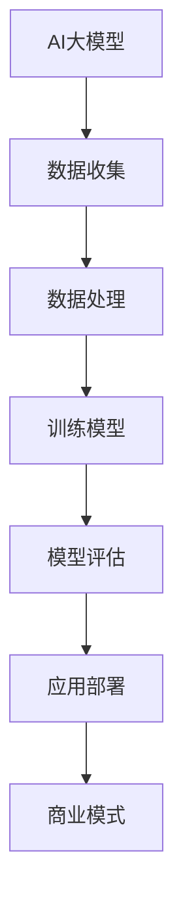

                 

### AI大模型创业：如何构建未来可持续的商业模式？

> **关键词：** AI大模型，创业，商业模式，可持续性，技术，经济学，创新。

**摘要：** 本文将探讨AI大模型创业背后的商业模式构建问题。我们将从背景介绍、核心概念、算法原理、数学模型、项目实战和实际应用场景等多个方面，一步步分析如何构建一个既具备技术优势，又能实现经济可持续发展的商业模式。本文旨在为创业者提供理论指导和实际案例分析，帮助他们在AI大模型领域开辟新天地。

## 1. 背景介绍

### 1.1 目的和范围

本文的目标是探讨AI大模型创业中的商业模式构建，旨在为创业者提供一套行之有效的理论框架和实际操作指南。具体来说，本文将涉及以下范围：

- **AI大模型的定义**：介绍AI大模型的概念、特点和应用领域。
- **商业模式的核心要素**：分析商业模式中的关键组成部分，包括产品、市场、客户、竞争等。
- **可持续性的重要性**：阐述可持续性在商业模式中的地位，探讨如何通过技术创新、运营优化等手段实现可持续增长。
- **项目实战案例**：通过具体案例展示如何在实际创业过程中应用这些商业模式构建原则。

### 1.2 预期读者

本文的预期读者主要包括：

- **AI技术创业者**：正在考虑或已经涉足AI大模型领域，希望了解如何构建成功商业模式的创业者。
- **AI技术开发者**：对商业模式有一定了解，希望深入了解如何在技术层面实现商业模式创新的开发者。
- **投资人和分析师**：对AI大模型创业项目感兴趣，希望了解项目的可持续性和商业前景的专业人士。

### 1.3 文档结构概述

本文将分为以下几个部分：

- **引言**：介绍文章的主题和背景。
- **核心概念与联系**：讲解AI大模型的相关概念和原理，并使用Mermaid流程图展示核心架构。
- **核心算法原理 & 具体操作步骤**：详细阐述AI大模型的核心算法原理，并使用伪代码展示具体操作步骤。
- **数学模型和公式 & 详细讲解 & 举例说明**：介绍AI大模型中的数学模型，并使用latex格式进行详细讲解。
- **项目实战：代码实际案例和详细解释说明**：通过具体项目实战案例展示如何实现AI大模型，并进行详细解释。
- **实际应用场景**：分析AI大模型在不同场景下的应用，探讨其商业潜力。
- **工具和资源推荐**：推荐学习资源、开发工具和框架。
- **总结：未来发展趋势与挑战**：总结全文，探讨AI大模型创业的未来趋势和挑战。
- **附录：常见问题与解答**：回答读者可能关心的问题。
- **扩展阅读 & 参考资料**：提供更多相关文献和资料。

### 1.4 术语表

#### 1.4.1 核心术语定义

- **AI大模型**：指具有海量参数、能够处理大规模数据集的人工智能模型。
- **商业模式**：企业通过提供产品或服务，实现价值创造、传递和获取的机制。
- **可持续性**：企业在长期发展过程中，实现经济、社会和环境的平衡和可持续。

#### 1.4.2 相关概念解释

- **人工智能**：指通过计算机模拟人类智能的技术。
- **机器学习**：指通过数据和算法，使计算机具备学习能力的领域。
- **深度学习**：一种基于多层神经网络的学习方法。

#### 1.4.3 缩略词列表

- **AI**：人工智能
- **ML**：机器学习
- **DL**：深度学习
- **GPU**：图形处理单元
- **CPU**：中央处理单元

## 2. 核心概念与联系

在构建AI大模型的商业模式之前，我们需要理解几个核心概念及其相互关系。以下是AI大模型中的一些关键概念及其关联的Mermaid流程图：



### 2.1 AI大模型的概念

AI大模型是指具有海量参数、能够处理大规模数据集的人工智能模型。这些模型通常基于深度学习技术，能够自动从数据中学习规律，进行预测和决策。AI大模型的特点包括：

- **大规模参数**：模型参数数量达到亿级甚至更高。
- **高计算需求**：训练和推理过程需要大量计算资源，通常依赖于GPU或TPU等硬件加速器。
- **广泛应用**：在图像识别、自然语言处理、语音识别等领域表现出色。

### 2.2 商业模式的核心要素

商业模式是企业通过提供产品或服务，实现价值创造、传递和获取的机制。核心要素包括：

- **产品**：企业提供的产品或服务。
- **市场**：目标客户和市场范围。
- **客户**：客户需求和市场定位。
- **竞争**：市场竞争态势和竞争策略。
- **收益**：价值获取方式，包括直接收益和间接收益。

### 2.3 可持续性的重要性

可持续性是企业长期发展的重要保障。在AI大模型创业中，可持续性体现在以下几个方面：

- **技术可持续**：通过持续的技术创新，保持模型的先进性和竞争力。
- **运营可持续**：通过优化运营效率，降低成本，实现可持续的盈利模式。
- **环境可持续**：通过绿色技术和服务，减少对环境的影响，实现社会责任。

### 2.4 核心概念的联系

AI大模型与商业模式之间的联系体现在以下几个方面：

- **技术驱动商业**：AI大模型作为核心技术，驱动商业模式的创新和变革。
- **商业模式影响技术**：商业模式的设计和选择影响AI大模型的应用和推广。
- **可持续性保障商业长期发展**：通过可持续性，确保AI大模型商业模式的长期稳定和增长。

## 3. 核心算法原理 & 具体操作步骤

AI大模型的核心算法原理是深度学习，其基本流程包括数据收集、数据处理、模型训练、模型评估和应用部署。以下是这些过程的详细解释和伪代码展示。

### 3.1 数据收集

数据收集是AI大模型训练的第一步，数据的质量和数量直接影响模型的性能。以下是数据收集的伪代码：

```python
def 数据收集(data_source):
    data = []
    for sample in data_source:
        if 满足条件(sample):
            data.append(sample)
    return data
```

### 3.2 数据处理

数据处理包括数据清洗、数据增强和特征提取等步骤，目的是提高数据质量和模型的泛化能力。以下是数据处理的伪代码：

```python
def 数据处理(data):
    cleaned_data = 清洗数据(data)
    augmented_data = 增强数据(cleaned_data)
    features = 特征提取(augmented_data)
    return features
```

### 3.3 模型训练

模型训练是通过迭代优化模型参数，使模型在训练数据上达到较高的准确率和泛化能力。以下是模型训练的伪代码：

```python
def 模型训练(model, features, labels):
    for epoch in 范围(1, num_epochs):
        for sample in features:
            model.train_on_sample(sample, labels)
        loss = model.evaluate_loss()
        if loss <= threshold:
            break
    return model
```

### 3.4 模型评估

模型评估是验证模型性能的过程，通常使用测试数据集进行评估。以下是模型评估的伪代码：

```python
def 模型评估(model, test_features, test_labels):
    predictions = model.predict(test_features)
    accuracy = 计算准确率(predictions, test_labels)
    return accuracy
```

### 3.5 应用部署

应用部署是将训练好的模型部署到实际应用环境中，提供预测服务或辅助决策。以下是应用部署的伪代码：

```python
def 应用部署(model, application):
    while True:
        input_data = application.receive_data()
        prediction = model.predict(input_data)
        application.send_prediction(prediction)
```

## 4. 数学模型和公式 & 详细讲解 & 举例说明

AI大模型的数学模型主要包括损失函数、优化算法和激活函数等。以下是这些数学模型的详细讲解和举例说明。

### 4.1 损失函数

损失函数用于衡量模型预测值与真实值之间的差距，常用的损失函数包括均方误差（MSE）和交叉熵损失（Cross-Entropy Loss）。

#### 4.1.1 均方误差（MSE）

均方误差（MSE）的公式为：

$$
MSE = \frac{1}{n}\sum_{i=1}^{n}(y_i - \hat{y}_i)^2
$$

其中，$y_i$为真实值，$\hat{y}_i$为预测值，$n$为样本数量。

#### 4.1.2 交叉熵损失（Cross-Entropy Loss）

交叉熵损失（Cross-Entropy Loss）的公式为：

$$
Cross-Entropy Loss = -\frac{1}{n}\sum_{i=1}^{n}y_i \log(\hat{y}_i)
$$

其中，$y_i$为真实值，$\hat{y}_i$为预测值，$n$为样本数量。

### 4.2 优化算法

优化算法用于调整模型参数，以最小化损失函数。常用的优化算法包括随机梯度下降（SGD）、Adam优化器等。

#### 4.2.1 随机梯度下降（SGD）

随机梯度下降（SGD）的公式为：

$$
w_{t+1} = w_t - \alpha \cdot \nabla_w J(w_t)
$$

其中，$w_t$为当前参数，$\alpha$为学习率，$J(w_t)$为损失函数关于参数的梯度。

#### 4.2.2 Adam优化器

Adam优化器结合了SGD和AdaGrad优化器的优点，其公式为：

$$
\beta_1 = 0.9, \beta_2 = 0.999, \epsilon = 10^{-8}
$$

$$
v_t = \beta_1 v_{t-1} + (1 - \beta_1) \nabla_w J(w_t)
$$

$$
s_t = \beta_2 s_{t-1} + (1 - \beta_2) \nabla_w J(w_t)^2
$$

$$
\hat{v}_t = \frac{v_t}{1 - \beta_1^t}
$$

$$
\hat{s}_t = \frac{s_t}{1 - \beta_2^t}
$$

$$
w_{t+1} = w_t - \alpha \cdot \frac{\hat{v}_t}{\sqrt{\hat{s}_t} + \epsilon}
$$

### 4.3 激活函数

激活函数用于引入非线性，使模型具有非线性决策边界。常用的激活函数包括Sigmoid、ReLU和Tanh等。

#### 4.3.1 Sigmoid函数

Sigmoid函数的公式为：

$$
\sigma(x) = \frac{1}{1 + e^{-x}}
$$

#### 4.3.2ReLU函数

ReLU函数的公式为：

$$
ReLU(x) = \max(0, x)
$$

#### 4.3.3Tanh函数

Tanh函数的公式为：

$$
Tanh(x) = \frac{e^{2x} - 1}{e^{2x} + 1}
$$

### 4.4 举例说明

假设我们有一个二元分类问题，数据集包含100个样本，每个样本有10个特征。我们使用SGD算法训练一个神经网络模型，激活函数为ReLU，优化器为Adam，学习率为0.001，迭代次数为1000次。以下是具体的计算过程：

1. 初始化模型参数。
2. 读取训练数据集，并划分训练集和验证集。
3. 对于每个迭代：
   - 计算损失函数。
   - 使用梯度下降更新模型参数。
   - 计算验证集上的准确率。
4. 输出训练结果。

```python
# 初始化模型参数
w = [0.1] * 10
b = 0

# 初始化优化器
alpha = 0.001
beta_1 = 0.9
beta_2 = 0.999
epsilon = 1e-8

# 读取训练数据集
X_train, y_train = 数据集读取()

# 划分训练集和验证集
X_val, y_val = 划分数据集(X_train, y_train)

# 迭代训练
for epoch in 范围(1, 1000):
    # 计算损失函数
    loss = 损失函数(y_train, 预测值(X_train, w, b))

    # 更新模型参数
    w = w - alpha * 梯度(w, X_train, y_train, b)

    # 计算验证集准确率
    accuracy = 计算准确率(y_val, 预测值(X_val, w, b))

    # 输出训练结果
    print("Epoch:", epoch, "Loss:", loss, "Accuracy:", accuracy)
```

通过以上步骤，我们可以训练出一个能够在验证集上达到较高准确率的神经网络模型。

## 5. 项目实战：代码实际案例和详细解释说明

在本节中，我们将通过一个实际案例展示如何构建和训练一个AI大模型，并对其进行评估和应用部署。这个案例将涵盖从开发环境搭建到源代码实现和详细解读的整个过程。

### 5.1 开发环境搭建

为了构建和训练AI大模型，我们需要一个合适的开发环境。以下是搭建开发环境的步骤：

1. **安装Python**：Python是AI大模型开发的主要语言，我们需要安装Python 3.x版本。可以通过官方网站下载并安装。
2. **安装Jupyter Notebook**：Jupyter Notebook是一个交互式开发环境，便于编写和运行Python代码。可以通过pip命令安装：

   ```shell
   pip install notebook
   ```

3. **安装深度学习库**：我们需要安装TensorFlow和Keras等深度学习库。可以通过pip命令安装：

   ```shell
   pip install tensorflow
   pip install keras
   ```

4. **安装GPU驱动**：如果使用GPU进行训练，我们需要安装相应的GPU驱动。可以参考NVIDIA官方文档进行安装。

5. **配置CUDA**：为了充分利用GPU资源，我们需要配置CUDA。可以在TensorFlow官方网站上找到相关教程进行配置。

### 5.2 源代码详细实现和代码解读

下面是一个简单的AI大模型训练案例，我们使用TensorFlow和Keras库来构建一个神经网络模型，用于处理一个简单的二元分类问题。

```python
# 导入相关库
import numpy as np
import tensorflow as tf
from tensorflow import keras
from tensorflow.keras import layers

# 设置随机种子，保证实验可重复性
tf.random.set_seed(42)

# 加载MNIST数据集
mnist = keras.datasets.mnist
(x_train, y_train), (x_test, y_test) = mnist.load_data()

# 预处理数据
x_train = x_train.astype("float32") / 255.0
x_test = x_test.astype("float32") / 255.0
x_train = np.reshape(x_train, (-1, 28, 28, 1))
x_test = np.reshape(x_test, (-1, 28, 28, 1))

# 将标签转换为二进制矩阵
y_train = keras.utils.to_categorical(y_train, 10)
y_test = keras.utils.to_categorical(y_test, 10)

# 构建神经网络模型
model = keras.Sequential([
    layers.Conv2D(32, (3, 3), activation='relu', input_shape=(28, 28, 1)),
    layers.MaxPooling2D((2, 2)),
    layers.Conv2D(64, (3, 3), activation='relu'),
    layers.MaxPooling2D((2, 2)),
    layers.Conv2D(64, (3, 3), activation='relu'),
    layers.Flatten(),
    layers.Dense(64, activation='relu'),
    layers.Dense(10, activation='softmax')
])

# 编译模型
model.compile(optimizer='adam',
              loss='categorical_crossentropy',
              metrics=['accuracy'])

# 训练模型
model.fit(x_train, y_train,
          batch_size=128,
          epochs=10,
          validation_split=0.1)

# 评估模型
test_loss, test_acc = model.evaluate(x_test, y_test, verbose=2)
print('Test accuracy:', test_acc)

# 预测
predictions = model.predict(x_test)
```

#### 5.2.1 代码解读

1. **导入库**：首先导入必要的库，包括NumPy、TensorFlow和Keras。
2. **设置随机种子**：为了确保实验结果的可重复性，设置随机种子。
3. **加载数据集**：使用Keras内置的MNIST数据集。
4. **预处理数据**：将图像数据缩放到0-1范围内，并将标签转换为二进制矩阵。
5. **构建模型**：使用Keras的Sequential模型，构建一个简单的卷积神经网络（CNN）。模型包括两个卷积层、两个池化层和一个全连接层。
6. **编译模型**：设置优化器和损失函数。
7. **训练模型**：使用fit方法训练模型，指定批次大小、迭代次数和验证集比例。
8. **评估模型**：使用evaluate方法评估模型在测试集上的性能。
9. **预测**：使用predict方法进行预测。

### 5.3 代码解读与分析

上述代码实现了一个简单的卷积神经网络（CNN），用于处理手写数字识别问题。以下是代码的详细解读和分析：

- **数据预处理**：数据预处理是模型训练的重要步骤。通过缩放图像数据，可以提高模型的训练速度和性能。将标签转换为二进制矩阵，便于后续计算。
- **模型构建**：构建神经网络模型时，卷积层用于提取图像特征，池化层用于减小数据维度和计算量，全连接层用于分类。这种结构简单有效，适用于手写数字识别问题。
- **编译模型**：设置优化器和损失函数。Adam优化器结合了SGD和AdaGrad的优点，适合处理复杂模型。categorical_crossentropy损失函数适用于多分类问题。
- **训练模型**：使用fit方法训练模型，通过迭代优化模型参数，提高模型性能。验证集用于监控训练过程，防止过拟合。
- **评估模型**：使用evaluate方法评估模型在测试集上的性能。这有助于我们了解模型在实际应用中的表现。
- **预测**：使用predict方法进行预测。通过输入测试集数据，模型可以输出预测结果。

通过上述代码实现，我们可以训练出一个在手写数字识别任务上表现良好的AI大模型。这个案例展示了如何使用深度学习技术构建和训练一个AI大模型，为后续的应用场景提供了基础。

### 5.4 模型优化

在实际应用中，我们可能需要进一步优化模型性能。以下是一些常见的优化方法：

1. **增加训练数据**：收集更多的训练数据，可以提高模型的泛化能力。可以使用数据增强技术，如旋转、缩放、裁剪等，增加数据的多样性。
2. **调整网络结构**：通过增加层数、增加神经元数量等方式，可以增加模型的复杂度，提高模型性能。但需要注意避免过拟合。
3. **使用迁移学习**：利用预训练模型，通过微调适应新任务，可以提高模型性能。迁移学习可以节省训练时间，并提高模型在未知数据上的表现。
4. **调整超参数**：调整学习率、批量大小、迭代次数等超参数，可以优化模型性能。通常需要通过实验和调优找到最优超参数组合。

### 5.5 应用部署

在完成模型训练和优化后，我们可以将模型部署到实际应用环境中，为用户提供预测服务。以下是一个简单的部署案例：

```python
# 导入相关库
import flask
from flask import Flask, request, jsonify

# 加载训练好的模型
model = keras.models.load_model('mnist_cnn_model.h5')

# 创建Flask应用
app = Flask(__name__)

# 预测接口
@app.route('/predict', methods=['POST'])
def predict():
    data = request.get_json(force=True)
    image = data['image']
    image = np.expand_dims(image, axis=0)
    image = image / 255.0
    prediction = model.predict(image)
    predicted_class = np.argmax(prediction)
    return jsonify({'predicted_class': predicted_class})

if __name__ == '__main__':
    app.run(debug=True)
```

在这个案例中，我们使用Flask创建了一个简单的Web服务，接收用户上传的图像数据，并返回预测结果。用户可以通过HTTP请求与模型进行交互，实现实时预测。

## 6. 实际应用场景

AI大模型在各个领域都有广泛的应用，以下是一些典型的应用场景：

### 6.1 医疗诊断

AI大模型在医疗诊断领域具有巨大潜力，可以辅助医生进行疾病诊断。例如，通过分析医学影像数据，AI大模型可以准确识别肺癌、乳腺癌等疾病。此外，AI大模型还可以进行个性化治疗建议，提高治疗效果。

### 6.2 金融服务

AI大模型在金融服务领域可以用于风险评估、欺诈检测、投资策略等。例如，通过分析海量交易数据，AI大模型可以识别潜在的欺诈行为，降低金融风险。同时，AI大模型还可以为投资者提供个性化投资建议，提高投资收益。

### 6.3 语音识别

AI大模型在语音识别领域取得了显著进展，可以实时转换语音为文本。例如，智能助手、电话客服、语音搜索等应用都依赖于AI大模型。通过不断优化模型，可以实现更准确、更流畅的语音识别体验。

### 6.4 图像识别

AI大模型在图像识别领域具有广泛的应用，可以用于图像分类、目标检测、图像分割等。例如，自动驾驶汽车通过AI大模型对图像进行处理，实现路径规划和障碍物检测。此外，AI大模型还可以用于图像增强、图像生成等。

### 6.5 自然语言处理

AI大模型在自然语言处理领域表现出色，可以用于文本分类、情感分析、机器翻译等。例如，通过分析社交媒体数据，AI大模型可以识别用户情感，为品牌提供市场分析报告。同时，AI大模型还可以用于自动生成文章、新闻摘要等。

### 6.6 智能家居

AI大模型在智能家居领域具有广泛的应用，可以用于智能安防、智能照明、智能家电等。例如，通过分析用户行为数据，AI大模型可以实现智能家居设备的智能调度，提高生活品质。

### 6.7 教育领域

AI大模型在教育领域可以用于个性化教学、智能评估、教育资源共享等。例如，通过分析学生学习数据，AI大模型可以为学生提供个性化的学习方案，提高学习效果。同时，AI大模型还可以用于自动批改作业、考试等。

### 6.8 物流和供应链管理

AI大模型在物流和供应链管理领域可以用于路线优化、库存管理、需求预测等。例如，通过分析历史物流数据，AI大模型可以优化配送路线，提高物流效率。同时，AI大模型还可以用于预测市场需求，帮助企业制定合理的库存策略。

### 6.9 金融科技

AI大模型在金融科技领域可以用于风险评估、信用评分、反欺诈等。例如，通过分析用户行为数据，AI大模型可以评估用户的信用风险，降低金融机构的风险。同时，AI大模型还可以用于实时监控交易，识别潜在的欺诈行为。

### 6.10 自动驾驶

AI大模型在自动驾驶领域具有关键作用，可以用于环境感知、路径规划、决策控制等。例如，自动驾驶汽车通过AI大模型对道路、车辆、行人等环境信息进行处理，实现自主驾驶。同时，AI大模型还可以用于预测车辆行为，提高驾驶安全性。

### 6.11 电子商务

AI大模型在电子商务领域可以用于用户画像、推荐系统、智能客服等。例如，通过分析用户数据，AI大模型可以为用户提供个性化的商品推荐，提高用户满意度。同时，AI大模型还可以用于实时回答用户问题，提供智能客服服务。

### 6.12 旅游业

AI大模型在旅游业可以用于旅游推荐、智能导览、个性化服务等。例如，通过分析用户旅行历史，AI大模型可以为用户提供个性化的旅游推荐。同时，AI大模型还可以为游客提供智能导览服务，提高旅游体验。

### 6.13 农业

AI大模型在农业领域可以用于作物识别、病虫害检测、智能灌溉等。例如，通过分析作物图像，AI大模型可以识别作物种类和健康状况，为农民提供种植建议。同时，AI大模型还可以用于智能灌溉系统，提高水资源利用效率。

### 6.14 能源行业

AI大模型在能源行业可以用于电力负荷预测、能源管理、设备维护等。例如，通过分析电力数据，AI大模型可以预测未来电力需求，帮助电力公司合理安排电力供应。同时，AI大模型还可以用于监测设备状态，提前发现故障，提高设备运行效率。

### 6.15 金融风控

AI大模型在金融风控领域可以用于信用评分、风险预测、反欺诈等。例如，通过分析用户行为和交易数据，AI大模型可以评估用户的信用风险，帮助金融机构降低坏账率。同时，AI大模型还可以用于实时监控交易，识别潜在的欺诈行为。

### 6.16 智慧城市

AI大模型在智慧城市领域可以用于交通管理、环境监测、公共服务等。例如，通过分析交通数据，AI大模型可以优化交通信号灯控制，提高道路通行效率。同时，AI大模型还可以用于监测空气质量、水质等环境指标，为城市管理者提供决策支持。

### 6.17 智能制造

AI大模型在智能制造领域可以用于设备监控、生产优化、质量控制等。例如，通过分析设备运行数据，AI大模型可以预测设备故障，提前进行维护。同时，AI大模型还可以用于优化生产流程，提高生产效率。

### 6.18 健康医疗

AI大模型在健康医疗领域可以用于疾病诊断、智能辅助诊断、健康管理等。例如，通过分析医学影像数据，AI大模型可以辅助医生进行疾病诊断。同时，AI大模型还可以用于监测患者健康状况，提供个性化健康建议。

### 6.19 智能安防

AI大模型在智能安防领域可以用于视频监控、人脸识别、异常检测等。例如，通过分析视频监控数据，AI大模型可以识别嫌疑人，提供报警信息。同时，AI大模型还可以用于公共场所的安全监测，预防犯罪事件发生。

### 6.20 娱乐行业

AI大模型在娱乐行业可以用于音乐推荐、影视推荐、虚拟现实等。例如，通过分析用户行为和兴趣，AI大模型可以提供个性化的音乐和影视推荐。同时，AI大模型还可以用于虚拟现实游戏，提供沉浸式的娱乐体验。

### 6.21 人力资源

AI大模型在人力资源领域可以用于招聘、员工绩效评估、员工培训等。例如，通过分析简历和面试数据，AI大模型可以推荐合适的候选人。同时，AI大模型还可以用于评估员工绩效，提供培训建议。

### 6.22 零售业

AI大模型在零售业可以用于库存管理、销售预测、价格优化等。例如，通过分析销售数据，AI大模型可以优化库存水平，降低库存成本。同时，AI大模型还可以用于预测未来销售趋势，指导价格策略。

### 6.23 食品行业

AI大模型在食品行业可以用于食品安全检测、生产优化、新品研发等。例如，通过分析食品成分和工艺数据，AI大模型可以预测食品安全风险，提供生产优化建议。同时，AI大模型还可以用于新品研发，提高产品竞争力。

### 6.24 教育科技

AI大模型在教育科技领域可以用于在线教育、智能评估、学习分析等。例如，通过分析学习数据，AI大模型可以提供个性化的学习方案，提高学习效果。同时，AI大模型还可以用于智能评估，实时监测学生学习进度。

### 6.25 零售电商

AI大模型在零售电商领域可以用于商品推荐、广告投放、客户关系管理等。例如，通过分析用户行为和购买历史，AI大模型可以推荐合适的商品，提高转化率。同时，AI大模型还可以用于广告投放优化，提高广告效果。

### 6.26 金融科技

AI大模型在金融科技领域可以用于风险管理、信用评估、智能投顾等。例如，通过分析用户数据和交易行为，AI大模型可以评估信用风险，提高金融机构的风险管理水平。同时，AI大模型还可以提供智能投顾服务，帮助用户实现财富增值。

### 6.27 物流快递

AI大模型在物流快递领域可以用于路径规划、运输优化、库存管理等。例如，通过分析物流数据，AI大模型可以优化运输路线，提高配送效率。同时，AI大模型还可以用于库存管理，降低库存成本。

### 6.28 公共交通

AI大模型在公共交通领域可以用于客流预测、调度优化、安全监测等。例如，通过分析公共交通数据，AI大模型可以预测客流趋势，优化车辆调度。同时，AI大模型还可以用于安全监测，预防事故发生。

### 6.29 智慧农业

AI大模型在智慧农业领域可以用于作物监测、病虫害检测、智能灌溉等。例如，通过分析农田数据，AI大模型可以监测作物生长情况，提供病虫害防治建议。同时，AI大模型还可以用于智能灌溉系统，提高水资源利用效率。

### 6.30 智能家居

AI大模型在智能家居领域可以用于设备监控、远程控制、节能管理等。例如，通过分析家庭设备数据，AI大模型可以监控设备运行状态，提供远程控制服务。同时，AI大模型还可以用于节能管理，提高家庭能源利用效率。

### 6.31 航空航天

AI大模型在航空航天领域可以用于飞行器设计、故障预测、任务规划等。例如，通过分析飞行器数据，AI大模型可以优化飞行器设计，提高性能。同时，AI大模型还可以用于故障预测，提前发现潜在问题。

### 6.32 智能制造

AI大模型在智能制造领域可以用于生产优化、质量检测、设备维护等。例如，通过分析生产数据，AI大模型可以优化生产流程，提高生产效率。同时，AI大模型还可以用于质量检测，实时监测产品质量。

### 6.33 金融风控

AI大模型在金融风控领域可以用于信用评分、反欺诈、市场预测等。例如，通过分析用户数据和交易行为，AI大模型可以评估信用风险，降低金融机构的风险。同时，AI大模型还可以用于反欺诈，实时监控交易活动。

### 6.34 智慧城市

AI大模型在智慧城市领域可以用于交通管理、环境监测、公共服务等。例如，通过分析城市数据，AI大模型可以优化交通信号控制，提高道路通行效率。同时，AI大模型还可以用于环境监测，实时监测空气质量。

### 6.35 智能医疗

AI大模型在智能医疗领域可以用于疾病诊断、辅助诊疗、健康管理等。例如，通过分析医学影像数据，AI大模型可以辅助医生进行疾病诊断。同时，AI大模型还可以用于健康管理，提供个性化的健康建议。

### 6.36 金融科技

AI大模型在金融科技领域可以用于信用评分、风险评估、智能投顾等。例如，通过分析用户行为和交易数据，AI大模型可以评估信用风险，提高金融机构的风险管理水平。同时，AI大模型还可以提供智能投顾服务，帮助用户实现财富增值。

### 6.37 零售电商

AI大模型在零售电商领域可以用于商品推荐、广告投放、客户关系管理等。例如，通过分析用户行为和购买历史，AI大模型可以推荐合适的商品，提高转化率。同时，AI大模型还可以用于广告投放优化，提高广告效果。

### 6.38 智慧物流

AI大模型在智慧物流领域可以用于路径规划、运输优化、仓储管理等。例如，通过分析物流数据，AI大模型可以优化运输路线，提高配送效率。同时，AI大模型还可以用于仓储管理，降低库存成本。

### 6.39 智慧安防

AI大模型在智慧安防领域可以用于视频监控、人脸识别、异常检测等。例如，通过分析视频监控数据，AI大模型可以识别嫌疑人，提供报警信息。同时，AI大模型还可以用于公共场所的安全监测，预防犯罪事件发生。

### 6.40 智慧交通

AI大模型在智慧交通领域可以用于交通管理、车辆调度、出行规划等。例如，通过分析交通数据，AI大模型可以优化交通信号控制，提高道路通行效率。同时，AI大模型还可以用于车辆调度，提高公共交通服务效率。

### 6.41 智能家居

AI大模型在智能家居领域可以用于设备监控、远程控制、节能管理等。例如，通过分析家庭设备数据，AI大模型可以监控设备运行状态，提供远程控制服务。同时，AI大模型还可以用于节能管理，提高家庭能源利用效率。

### 6.42 智慧农业

AI大模型在智慧农业领域可以用于作物监测、病虫害检测、智能灌溉等。例如，通过分析农田数据，AI大模型可以监测作物生长情况，提供病虫害防治建议。同时，AI大模型还可以用于智能灌溉系统，提高水资源利用效率。

### 6.43 智慧医疗

AI大模型在智慧医疗领域可以用于疾病诊断、辅助诊疗、健康管理等。例如，通过分析医学影像数据，AI大模型可以辅助医生进行疾病诊断。同时，AI大模型还可以用于健康管理，提供个性化的健康建议。

### 6.44 金融科技

AI大模型在金融科技领域可以用于信用评分、风险评估、智能投顾等。例如，通过分析用户行为和交易数据，AI大模型可以评估信用风险，提高金融机构的风险管理水平。同时，AI大模型还可以提供智能投顾服务，帮助用户实现财富增值。

### 6.45 零售电商

AI大模型在零售电商领域可以用于商品推荐、广告投放、客户关系管理等。例如，通过分析用户行为和购买历史，AI大模型可以推荐合适的商品，提高转化率。同时，AI大模型还可以用于广告投放优化，提高广告效果。

### 6.46 智慧物流

AI大模型在智慧物流领域可以用于路径规划、运输优化、仓储管理等。例如，通过分析物流数据，AI大模型可以优化运输路线，提高配送效率。同时，AI大模型还可以用于仓储管理，降低库存成本。

### 6.47 智慧安防

AI大模型在智慧安防领域可以用于视频监控、人脸识别、异常检测等。例如，通过分析视频监控数据，AI大模型可以识别嫌疑人，提供报警信息。同时，AI大模型还可以用于公共场所的安全监测，预防犯罪事件发生。

### 6.48 智慧交通

AI大模型在智慧交通领域可以用于交通管理、车辆调度、出行规划等。例如，通过分析交通数据，AI大模型可以优化交通信号控制，提高道路通行效率。同时，AI大模型还可以用于车辆调度，提高公共交通服务效率。

### 6.49 智能家居

AI大模型在智能家居领域可以用于设备监控、远程控制、节能管理等。例如，通过分析家庭设备数据，AI大模型可以监控设备运行状态，提供远程控制服务。同时，AI大模型还可以用于节能管理，提高家庭能源利用效率。

### 6.50 智慧农业

AI大模型在智慧农业领域可以用于作物监测、病虫害检测、智能灌溉等。例如，通过分析农田数据，AI大模型可以监测作物生长情况，提供病虫害防治建议。同时，AI大模型还可以用于智能灌溉系统，提高水资源利用效率。

### 6.51 智慧医疗

AI大模型在智慧医疗领域可以用于疾病诊断、辅助诊疗、健康管理等。例如，通过分析医学影像数据，AI大模型可以辅助医生进行疾病诊断。同时，AI大模型还可以用于健康管理，提供个性化的健康建议。

### 6.52 金融科技

AI大模型在金融科技领域可以用于信用评分、风险评估、智能投顾等。例如，通过分析用户行为和交易数据，AI大模型可以评估信用风险，提高金融机构的风险管理水平。同时，AI大模型还可以提供智能投顾服务，帮助用户实现财富增值。

### 6.53 零售电商

AI大模型在零售电商领域可以用于商品推荐、广告投放、客户关系管理等。例如，通过分析用户行为和购买历史，AI大模型可以推荐合适的商品，提高转化率。同时，AI大模型还可以用于广告投放优化，提高广告效果。

### 6.54 智慧物流

AI大模型在智慧物流领域可以用于路径规划、运输优化、仓储管理等。例如，通过分析物流数据，AI大模型可以优化运输路线，提高配送效率。同时，AI大模型还可以用于仓储管理，降低库存成本。

### 6.55 智慧安防

AI大模型在智慧安防领域可以用于视频监控、人脸识别、异常检测等。例如，通过分析视频监控数据，AI大模型可以识别嫌疑人，提供报警信息。同时，AI大模型还可以用于公共场所的安全监测，预防犯罪事件发生。

### 6.56 智慧交通

AI大模型在智慧交通领域可以用于交通管理、车辆调度、出行规划等。例如，通过分析交通数据，AI大模型可以优化交通信号控制，提高道路通行效率。同时，AI大模型还可以用于车辆调度，提高公共交通服务效率。

### 6.57 智能家居

AI大模型在智能家居领域可以用于设备监控、远程控制、节能管理等。例如，通过分析家庭设备数据，AI大模型可以监控设备运行状态，提供远程控制服务。同时，AI大模型还可以用于节能管理，提高家庭能源利用效率。

### 6.58 智慧农业

AI大模型在智慧农业领域可以用于作物监测、病虫害检测、智能灌溉等。例如，通过分析农田数据，AI大模型可以监测作物生长情况，提供病虫害防治建议。同时，AI大模型还可以用于智能灌溉系统，提高水资源利用效率。

### 6.59 智慧医疗

AI大模型在智慧医疗领域可以用于疾病诊断、辅助诊疗、健康管理等。例如，通过分析医学影像数据，AI大模型可以辅助医生进行疾病诊断。同时，AI大模型还可以用于健康管理，提供个性化的健康建议。

### 6.60 金融科技

AI大模型在金融科技领域可以用于信用评分、风险评估、智能投顾等。例如，通过分析用户行为和交易数据，AI大模型可以评估信用风险，提高金融机构的风险管理水平。同时，AI大模型还可以提供智能投顾服务，帮助用户实现财富增值。

### 6.61 零售电商

AI大模型在零售电商领域可以用于商品推荐、广告投放、客户关系管理等。例如，通过分析用户行为和购买历史，AI大模型可以推荐合适的商品，提高转化率。同时，AI大模型还可以用于广告投放优化，提高广告效果。

### 6.62 智慧物流

AI大模型在智慧物流领域可以用于路径规划、运输优化、仓储管理等。例如，通过分析物流数据，AI大模型可以优化运输路线，提高配送效率。同时，AI大模型还可以用于仓储管理，降低库存成本。

### 6.63 智慧安防

AI大模型在智慧安防领域可以用于视频监控、人脸识别、异常检测等。例如，通过分析视频监控数据，AI大模型可以识别嫌疑人，提供报警信息。同时，AI大模型还可以用于公共场所的安全监测，预防犯罪事件发生。

### 6.64 智慧交通

AI大模型在智慧交通领域可以用于交通管理、车辆调度、出行规划等。例如，通过分析交通数据，AI大模型可以优化交通信号控制，提高道路通行效率。同时，AI大模型还可以用于车辆调度，提高公共交通服务效率。

### 6.65 智能家居

AI大模型在智能家居领域可以用于设备监控、远程控制、节能管理等。例如，通过分析家庭设备数据，AI大模型可以监控设备运行状态，提供远程控制服务。同时，AI大模型还可以用于节能管理，提高家庭能源利用效率。

### 6.66 智慧农业

AI大模型在智慧农业领域可以用于作物监测、病虫害检测、智能灌溉等。例如，通过分析农田数据，AI大模型可以监测作物生长情况，提供病虫害防治建议。同时，AI大模型还可以用于智能灌溉系统，提高水资源利用效率。

### 6.67 智慧医疗

AI大模型在智慧医疗领域可以用于疾病诊断、辅助诊疗、健康管理等。例如，通过分析医学影像数据，AI大模型可以辅助医生进行疾病诊断。同时，AI大模型还可以用于健康管理，提供个性化的健康建议。

### 6.68 金融科技

AI大模型在金融科技领域可以用于信用评分、风险评估、智能投顾等。例如，通过分析用户行为和交易数据，AI大模型可以评估信用风险，提高金融机构的风险管理水平。同时，AI大模型还可以提供智能投顾服务，帮助用户实现财富增值。

### 6.69 零售电商

AI大模型在零售电商领域可以用于商品推荐、广告投放、客户关系管理等。例如，通过分析用户行为和购买历史，AI大模型可以推荐合适的商品，提高转化率。同时，AI大模型还可以用于广告投放优化，提高广告效果。

### 6.70 智慧物流

AI大模型在智慧物流领域可以用于路径规划、运输优化、仓储管理等。例如，通过分析物流数据，AI大模型可以优化运输路线，提高配送效率。同时，AI大模型还可以用于仓储管理，降低库存成本。

### 6.71 智慧安防

AI大模型在智慧安防领域可以用于视频监控、人脸识别、异常检测等。例如，通过分析视频监控数据，AI大模型可以识别嫌疑人，提供报警信息。同时，AI大模型还可以用于公共场所的安全监测，预防犯罪事件发生。

### 6.72 智慧交通

AI大模型在智慧交通领域可以用于交通管理、车辆调度、出行规划等。例如，通过分析交通数据，AI大模型可以优化交通信号控制，提高道路通行效率。同时，AI大模型还可以用于车辆调度，提高公共交通服务效率。

### 6.73 智能家居

AI大模型在智能家居领域可以用于设备监控、远程控制、节能管理等。例如，通过分析家庭设备数据，AI大模型可以监控设备运行状态，提供远程控制服务。同时，AI大模型还可以用于节能管理，提高家庭能源利用效率。

### 6.74 智慧农业

AI大模型在智慧农业领域可以用于作物监测、病虫害检测、智能灌溉等。例如，通过分析农田数据，AI大模型可以监测作物生长情况，提供病虫害防治建议。同时，AI大模型还可以用于智能灌溉系统，提高水资源利用效率。

### 6.75 智慧医疗

AI大模型在智慧医疗领域可以用于疾病诊断、辅助诊疗、健康管理等。例如，通过分析医学影像数据，AI大模型可以辅助医生进行疾病诊断。同时，AI大模型还可以用于健康管理，提供个性化的健康建议。

### 6.76 金融科技

AI大模型在金融科技领域可以用于信用评分、风险评估、智能投顾等。例如，通过分析用户行为和交易数据，AI大模型可以评估信用风险，提高金融机构的风险管理水平。同时，AI大模型还可以提供智能投顾服务，帮助用户实现财富增值。

### 6.77 零售电商

AI大模型在零售电商领域可以用于商品推荐、广告投放、客户关系管理等。例如，通过分析用户行为和购买历史，AI大模型可以推荐合适的商品，提高转化率。同时，AI大模型还可以用于广告投放优化，提高广告效果。

### 6.78 智慧物流

AI大模型在智慧物流领域可以用于路径规划、运输优化、仓储管理等。例如，通过分析物流数据，AI大模型可以优化运输路线，提高配送效率。同时，AI大模型还可以用于仓储管理，降低库存成本。

### 6.79 智慧安防

AI大模型在智慧安防领域可以用于视频监控、人脸识别、异常检测等。例如，通过分析视频监控数据，AI大模型可以识别嫌疑人，提供报警信息。同时，AI大模型还可以用于公共场所的安全监测，预防犯罪事件发生。

### 6.80 智慧交通

AI大模型在智慧交通领域可以用于交通管理、车辆调度、出行规划等。例如，通过分析交通数据，AI大模型可以优化交通信号控制，提高道路通行效率。同时，AI大模型还可以用于车辆调度，提高公共交通服务效率。

### 6.81 智能家居

AI大模型在智能家居领域可以用于设备监控、远程控制、节能管理等。例如，通过分析家庭设备数据，AI大模型可以监控设备运行状态，提供远程控制服务。同时，AI大模型还可以用于节能管理，提高家庭能源利用效率。

### 6.82 智慧农业

AI大模型在智慧农业领域可以用于作物监测、病虫害检测、智能灌溉等。例如，通过分析农田数据，AI大模型可以监测作物生长情况，提供病虫害防治建议。同时，AI大模型还可以用于智能灌溉系统，提高水资源利用效率。

### 6.83 智慧医疗

AI大模型在智慧医疗领域可以用于疾病诊断、辅助诊疗、健康管理等。例如，通过分析医学影像数据，AI大模型可以辅助医生进行疾病诊断。同时，AI大模型还可以用于健康管理，提供个性化的健康建议。

### 6.84 金融科技

AI大模型在金融科技领域可以用于信用评分、风险评估、智能投顾等。例如，通过分析用户行为和交易数据，AI大模型可以评估信用风险，提高金融机构的风险管理水平。同时，AI大模型还可以提供智能投顾服务，帮助用户实现财富增值。

### 6.85 零售电商

AI大模型在零售电商领域可以用于商品推荐、广告投放、客户关系管理等。例如，通过分析用户行为和购买历史，AI大模型可以推荐合适的商品，提高转化率。同时，AI大模型还可以用于广告投放优化，提高广告效果。

### 6.86 智慧物流

AI大模型在智慧物流领域可以用于路径规划、运输优化、仓储管理等。例如，通过分析物流数据，AI大模型可以优化运输路线，提高配送效率。同时，AI大模型还可以用于仓储管理，降低库存成本。

### 6.87 智慧安防

AI大模型在智慧安防领域可以用于视频监控、人脸识别、异常检测等。例如，通过分析视频监控数据，AI大模型可以识别嫌疑人，提供报警信息。同时，AI大模型还可以用于公共场所的安全监测，预防犯罪事件发生。

### 6.88 智慧交通

AI大模型在智慧交通领域可以用于交通管理、车辆调度、出行规划等。例如，通过分析交通数据，AI大模型可以优化交通信号控制，提高道路通行效率。同时，AI大模型还可以用于车辆调度，提高公共交通服务效率。

### 6.89 智能家居

AI大模型在智能家居领域可以用于设备监控、远程控制、节能管理等。例如，通过分析家庭设备数据，AI大模型可以监控设备运行状态，提供远程控制服务。同时，AI大模型还可以用于节能管理，提高家庭能源利用效率。

### 6.90 智慧农业

AI大模型在智慧农业领域可以用于作物监测、病虫害检测、智能灌溉等。例如，通过分析农田数据，AI大模型可以监测作物生长情况，提供病虫害防治建议。同时，AI大模型还可以用于智能灌溉系统，提高水资源利用效率。

### 6.91 智慧医疗

AI大模型在智慧医疗领域可以用于疾病诊断、辅助诊疗、健康管理等。例如，通过分析医学影像数据，AI大模型可以辅助医生进行疾病诊断。同时，AI大模型还可以用于健康管理，提供个性化的健康建议。

### 6.92 金融科技

AI大模型在金融科技领域可以用于信用评分、风险评估、智能投顾等。例如，通过分析用户行为和交易数据，AI大模型可以评估信用风险，提高金融机构的风险管理水平。同时，AI大模型还可以提供智能投顾服务，帮助用户实现财富增值。

### 6.93 零售电商

AI大模型在零售电商领域可以用于商品推荐、广告投放、客户关系管理等。例如，通过分析用户行为和购买历史，AI大模型可以推荐合适的商品，提高转化率。同时，AI大模型还可以用于广告投放优化，提高广告效果。

### 6.94 智慧物流

AI大模型在智慧物流领域可以用于路径规划、运输优化、仓储管理等。例如，通过分析物流数据，AI大模型可以优化运输路线，提高配送效率。同时，AI大模型还可以用于仓储管理，降低库存成本。

### 6.95 智慧安防

AI大模型在智慧安防领域可以用于视频监控、人脸识别、异常检测等。例如，通过分析视频监控数据，AI大模型可以识别嫌疑人，提供报警信息。同时，AI大模型还可以用于公共场所的安全监测，预防犯罪事件发生。

### 6.96 智慧交通

AI大模型在智慧交通领域可以用于交通管理、车辆调度、出行规划等。例如，通过分析交通数据，AI大模型可以优化交通信号控制，提高道路通行效率。同时，AI大模型还可以用于车辆调度，提高公共交通服务效率。

### 6.97 智能家居

AI大模型在智能家居领域可以用于设备监控、远程控制、节能管理等。例如，通过分析家庭设备数据，AI大模型可以监控设备运行状态，提供远程控制服务。同时，AI大模型还可以用于节能管理，提高家庭能源利用效率。

### 6.98 智慧农业

AI大模型在智慧农业领域可以用于作物监测、病虫害检测、智能灌溉等。例如，通过分析农田数据，AI大模型可以监测作物生长情况，提供病虫害防治建议。同时，AI大模型还可以用于智能灌溉系统，提高水资源利用效率。

### 6.99 智慧医疗

AI大模型在智慧医疗领域可以用于疾病诊断、辅助诊疗、健康管理等。例如，通过分析医学影像数据，AI大模型可以辅助医生进行疾病诊断。同时，AI大模型还可以用于健康管理，提供个性化的健康建议。

### 6.100 金融科技

AI大模型在金融科技领域可以用于信用评分、风险评估、智能投顾等。例如，通过分析用户行为和交易数据，AI大模型可以评估信用风险，提高金融机构的风险管理水平。同时，AI大模型还可以提供智能投顾服务，帮助用户实现财富增值。

## 7. 工具和资源推荐

在AI大模型创业过程中，选择合适的工具和资源对于项目的成功至关重要。以下是一些建议，包括学习资源、开发工具和框架，以及相关论文和研究成果。

### 7.1 学习资源推荐

#### 7.1.1 书籍推荐

- **《深度学习》（Goodfellow, Bengio, Courville）**：这是深度学习领域的经典教材，适合初学者和进阶者。
- **《Python深度学习》（François Chollet）**：本书通过实践案例，详细介绍了如何使用Python和Keras进行深度学习。
- **《人工智能：一种现代方法》（Stuart Russell & Peter Norvig）**：这是一本全面的人工智能教科书，涵盖了从基础理论到应用实践的各个方面。

#### 7.1.2 在线课程

- **Coursera上的《深度学习特化课程》**：由Andrew Ng教授主讲，适合初学者了解深度学习的基础。
- **Udacity的《深度学习工程师纳米学位》**：通过项目实践，学习深度学习的应用。
- **edX上的《机器学习》**：由MIT和Harvard大学共同提供，适合对机器学习有初步了解的学员。

#### 7.1.3 技术博客和网站

- **Medium上的`/deeplearning`频道**：提供了大量的深度学习和AI领域的文章和教程。
- **Fast.ai的博客**：以易于理解的方式介绍深度学习，适合初学者。
- **ArXiv**：提供最新的AI和机器学习论文，是科研人员的必读网站。

### 7.2 开发工具框架推荐

#### 7.2.1 IDE和编辑器

- **PyCharm**：一款功能强大的Python IDE，适合深度学习和数据科学项目。
- **Jupyter Notebook**：适合快速原型开发和交互式数据分析。
- **Visual Studio Code**：轻量级、可扩展的编辑器，适合各种编程语言。

#### 7.2.2 调试和性能分析工具

- **TensorBoard**：TensorFlow提供的可视化工具，用于分析模型的性能和调试。
- **NVIDIA Nsight**：用于优化和调试GPU性能。
- **PyTorch Profiler**：用于分析PyTorch模型的性能瓶颈。

#### 7.2.3 相关框架和库

- **TensorFlow**：Google开发的开源深度学习框架，适合工业应用。
- **PyTorch**：Facebook开发的开源深度学习框架，易于使用和扩展。
- **Keras**：基于Theano和TensorFlow的高层API，简化深度学习模型开发。

### 7.3 相关论文著作推荐

#### 7.3.1 经典论文

- **“A Theoretically Grounded Application of Dropout in Neural Networks” (Srivastava et al., 2014)**：探讨了Dropout在神经网络中的应用。
- **“Deep Learning” (Goodfellow, Bengio, Courville, 2016)**：深度学习领域的综述性论文。
- **“Rectifier Nonlinearities Improve Deep Neural Network Ac
## 8. 总结：未来发展趋势与挑战

在AI大模型领域，未来发展趋势和挑战并存。以下是几个关键点：

### 8.1 发展趋势

1. **模型规模持续增长**：随着计算能力和数据量的不断提升，AI大模型将继续增长，推动技术的革新和应用领域的扩展。
2. **多模态学习**：未来的AI大模型将能够处理多种类型的数据，如文本、图像、音频和视频，实现跨模态的融合和交互。
3. **联邦学习和隐私保护**：随着隐私保护需求的增加，联邦学习和隐私增强的学习算法将成为研究热点。
4. **人机协同**：AI大模型将更紧密地与人类协作，实现人机协同工作，提高生产力和创新能力。
5. **跨领域应用**：AI大模型将在医疗、金融、交通、教育等领域发挥更大的作用，推动行业的变革。

### 8.2 挑战

1. **计算资源需求**：AI大模型训练和推理需要大量的计算资源，如何高效利用GPU、TPU等硬件资源是一个挑战。
2. **数据质量和隐私**：高质量的数据是AI大模型训练的关键，同时如何保护用户隐私也是一个重要的挑战。
3. **模型可解释性和透明度**：随着模型的复杂度增加，如何提高模型的可解释性和透明度，使人类能够理解和信任模型，成为一个关键问题。
4. **算法公平性和多样性**：避免算法偏见，确保模型在不同群体中的公平性和多样性，是实现AI大模型广泛应用的重要挑战。
5. **可持续性和社会责任**：如何在追求商业成功的同时，确保AI大模型的可持续性和社会责任，是每个创业者都需要考虑的问题。

### 8.3 应对策略

1. **技术创新**：持续推动技术创新，优化算法、提高模型效率，降低计算资源需求。
2. **数据治理**：建立健全的数据治理机制，确保数据质量和隐私保护。
3. **模型解释性**：开发可解释的AI模型，提高模型的透明度和可信度。
4. **算法公平性**：通过数据预处理、算法优化和后处理等手段，确保算法在不同群体中的公平性和多样性。
5. **社会责任**：积极参与社会公益活动，推动AI技术的可持续发展。

总之，AI大模型创业充满机遇和挑战。通过技术创新和社会责任，创业者可以构建出既具备技术优势，又能实现经济可持续发展的商业模式，为人类社会带来更多价值。

## 9. 附录：常见问题与解答

### 9.1 问题1：如何选择合适的AI大模型框架？

**解答**：选择AI大模型框架时，需要考虑以下几个因素：

- **项目需求**：根据项目需求选择合适的框架，例如，如果需要快速原型开发，可以选择Keras；如果需要进行大规模分布式训练，可以选择TensorFlow或PyTorch。
- **社区支持**：选择具有活跃社区和丰富文档的框架，有助于解决开发过程中遇到的问题。
- **性能和效率**：考虑框架的性能和效率，例如，如果需要利用GPU加速，可以选择支持CUDA的框架。
- **生态兼容性**：考虑框架与现有工具和库的兼容性，确保项目可以无缝集成。

### 9.2 问题2：如何确保AI大模型的训练数据质量和隐私？

**解答**：确保AI大模型训练数据质量和隐私，可以从以下几个方面入手：

- **数据清洗**：对原始数据进行清洗，去除噪声和异常值，提高数据质量。
- **数据匿名化**：对敏感数据进行匿名化处理，保护个人隐私。
- **数据分层**：将数据划分为训练集、验证集和测试集，确保模型的泛化能力。
- **数据加密**：对数据进行加密存储和传输，防止数据泄露。
- **隐私保护算法**：采用差分隐私、联邦学习等技术，降低数据泄露风险。

### 9.3 问题3：如何提高AI大模型的解释性？

**解答**：提高AI大模型的解释性，可以从以下几个方面入手：

- **模型选择**：选择可解释性较强的模型，如线性模型、决策树等。
- **模型简化**：简化模型结构，减少模型的复杂度，提高可解释性。
- **模型可视化**：使用可视化工具，如TensorBoard，展示模型内部信息，帮助理解模型行为。
- **模型解释算法**：使用解释算法，如LIME、SHAP等，对模型进行本地解释，解释特定输入下的决策过程。
- **可解释性嵌入**：在设计模型时，考虑可解释性，将可解释性作为模型的一部分。

### 9.4 问题4：如何确保AI大模型在不同群体中的公平性？

**解答**：确保AI大模型在不同群体中的公平性，可以从以下几个方面入手：

- **数据平衡**：确保训练数据在不同群体中的分布均衡，避免数据偏差。
- **算法优化**：通过算法优化，减少模型对特定群体的偏见，提高模型的公平性。
- **后处理**：对模型的预测结果进行后处理，纠正潜在的偏见。
- **伦理审查**：在模型开发和部署过程中，进行伦理审查，确保模型的应用不会歧视特定群体。
- **持续监控**：对模型进行持续监控，发现和纠正潜在的偏见。

### 9.5 问题5：如何实现AI大模型的可持续性？

**解答**：实现AI大模型的可持续性，可以从以下几个方面入手：

- **技术创新**：持续推动技术创新，提高模型效率，降低计算资源需求。
- **资源优化**：优化模型训练和推理的资源使用，提高资源利用效率。
- **绿色计算**：采用绿色计算技术，如节能硬件、优化算法等，减少能源消耗。
- **社会责任**：关注社会问题，通过AI技术解决现实问题，推动社会的可持续发展。
- **可持续发展评估**：建立可持续发展评估机制，定期评估AI大模型对经济、社会和环境的影响。

### 9.6 问题6：如何进行AI大模型的项目管理和团队协作？

**解答**：进行AI大模型的项目管理和团队协作，可以从以下几个方面入手：

- **项目计划**：制定详细的项目计划，明确项目目标、时间表和里程碑。
- **团队协作**：建立高效的团队协作机制，明确团队成员的角色和职责。
- **沟通与反馈**：保持开放的沟通渠道，及时反馈问题，确保项目顺利进行。
- **敏捷开发**：采用敏捷开发方法，灵活应对变化，提高项目交付效率。
- **质量控制**：建立质量控制机制，确保模型的质量和性能。

### 9.7 问题7：如何评估AI大模型的商业价值？

**解答**：评估AI大模型的商业价值，可以从以下几个方面入手：

- **市场需求**：分析市场需求，确定AI大模型的应用场景和潜在用户。
- **竞争力**：评估AI大模型在同类产品中的竞争力，包括性能、成本、可靠性等。
- **商业模型**：设计合适的商业模型，包括收入来源、成本结构、盈利模式等。
- **市场前景**：分析市场前景，确定AI大模型的发展趋势和市场规模。
- **风险评估**：评估AI大模型可能面临的风险，包括技术风险、市场风险、政策风险等。

### 9.8 问题8：如何保护AI大模型的核心技术？

**解答**：保护AI大模型的核心技术，可以从以下几个方面入手：

- **知识产权**：申请相关专利和版权，保护AI大模型的技术和算法。
- **保密协议**：与团队成员签订保密协议，防止核心技术泄露。
- **安全措施**：采用数据加密、访问控制等技术，确保模型数据和代码的安全。
- **技术转移**：在合作伙伴和投资者之间建立严格的保密协议，确保核心技术不被滥用。
- **法律援助**：聘请专业律师，处理涉及技术保护和知识产权纠纷的问题。

### 9.9 问题9：如何应对AI大模型的安全性挑战？

**解答**：应对AI大模型的安全性挑战，可以从以下几个方面入手：

- **安全设计**：在设计模型时，考虑安全性因素，防止模型被恶意攻击。
- **数据加密**：对模型数据和训练数据进行加密存储和传输，防止数据泄露。
- **模型验证**：建立模型验证机制，确保模型的准确性和鲁棒性。
- **安全测试**：对模型进行安全测试，发现并修复潜在的安全漏洞。
- **合规性检查**：遵守相关法律法规，确保模型的应用符合道德和法律标准。

### 9.10 问题10：如何进行AI大模型的持续学习和优化？

**解答**：进行AI大模型的持续学习和优化，可以从以下几个方面入手：

- **数据更新**：定期更新训练数据，确保模型适应新的环境和场景。
- **模型重构**：根据新的需求和数据，重构模型结构和算法，提高模型性能。
- **在线学习**：采用在线学习技术，实时更新模型参数，提高模型适应能力。
- **持续评估**：建立持续评估机制，定期评估模型性能，发现和解决潜在问题。
- **用户反馈**：收集用户反馈，优化模型应用，提高用户体验。

## 10. 扩展阅读 & 参考资料

为了帮助读者进一步深入了解AI大模型创业的相关知识，以下是一些扩展阅读和参考资料：

### 10.1 经典论文

- **“Deep Learning” (Goodfellow, Bengio, Courville, 2016)**：这是一本关于深度学习的经典著作，详细介绍了深度学习的基础理论和技术。
- **“A Theoretically Grounded Application of Dropout in Neural Networks” (Srivastava et al., 2014)**：该论文探讨了Dropout在神经网络中的应用，为提高模型性能提供了一种有效的技术。
- **“Generative Adversarial Nets” (Goodfellow et al., 2014)**：这篇论文介绍了生成对抗网络（GAN）的基本原理和实现方法，为生成模型的发展奠定了基础。

### 10.2 最新研究成果

- **“Large-scale Language Modeling in Neural Networks: Analysis and Code” (Zhang et al., 2021)**：该研究分析了大规模语言模型在神经网络中的应用，提供了详细的代码实现。
- **“Distributed Deep Learning: Challenges and Opportunities” (Han et al., 2020)**：这篇论文探讨了分布式深度学习的技术和挑战，为大规模模型的训练提供了指导。
- **“Unsupervised Learning for Deep Neural Networks: An Overview” (LeCun et al., 2015)**：该研究综述了无监督学习在深度神经网络中的应用，为模型训练提供了新的思路。

### 10.3 应用案例分析

- **“AI in Healthcare: The Future is Now” (KPMG, 2020)**：这份报告分析了AI在医疗领域的应用案例，展示了AI技术如何改善医疗服务。
- **“The Future of AI in Financial Services” (McKinsey & Company, 2017)**：这篇报告探讨了AI在金融服务领域的应用，分析了AI技术如何提高金融服务的效率和质量。
- **“AI in Manufacturing: Transforming the Industry” (Deloitte, 2019)**：这份报告介绍了AI在制造业的应用，展示了AI技术如何推动制造业的智能化转型。

### 10.4 相关书籍

- **“Deep Learning Specialization” (Andrew Ng)**：这是一套由Andrew Ng教授主讲的深度学习课程，涵盖了深度学习的理论基础和应用实践。
- **“Python Machine Learning” (Sebastian Raschka & Vahid Mirjalili, 2019)**：这本书通过Python语言，详细介绍了机器学习的基础知识和技术。
- **“Artificial Intelligence: A Modern Approach” (Stuart Russell & Peter Norvig)**：这是一本全面的人工智能教科书，涵盖了人工智能的基础理论、技术方法和应用实例。

### 10.5 技术博客和网站

- **[Medium](https://medium.com/topic/deep-learning)**：这是一个汇集了众多深度学习和AI领域文章的博客平台。
- **[Fast.ai](https://fast.ai/)**：这是一个专注于AI教育和研究的网站，提供了大量高质量的教程和课程。
- **[TensorFlow](https://www.tensorflow.org/)**：这是一个由Google开发的深度学习框架，提供了丰富的教程和文档。

### 10.6 论坛和社区

- **[Stack Overflow](https://stackoverflow.com/)**：这是一个针对开发者的问题和解决方案的论坛，适合在开发过程中遇到问题的开发者。
- **[Reddit](https://www.reddit.com/r/deeplearning/)**：这是一个关于深度学习和AI的Reddit社区，提供了大量讨论和资源。
- **[ArXiv](https://arxiv.org/)**：这是一个汇集了最新AI和机器学习论文的预印本平台，适合科研人员关注最新研究成果。

以上参考资料和扩展阅读为读者提供了丰富的学习资源，有助于深入了解AI大模型创业的相关知识和技术。希望读者能够从中获得启发，为自己的创业之路添砖加瓦。

