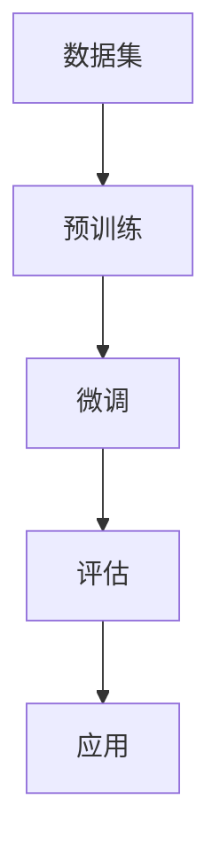

                 


# AI大模型创业：如何构建未来可持续的商业模式？

> 关键词：AI大模型、创业、商业模式、可持续、经济性、技术迭代、数据驱动

> 摘要：本文将探讨AI大模型创业中的核心问题，包括如何构建可持续的商业模式、经济性的实现途径以及技术迭代与数据驱动的策略。文章旨在为AI创业者提供系统性的思考和实用指导，帮助他们更好地把握行业趋势，构建成功的企业。

## 1. 背景介绍

### 1.1 目的和范围

本文的目的是为那些对AI大模型创业感兴趣的人提供实用的指导。我们将探讨以下几个核心问题：

1. 如何构建一个可持续的商业模式？
2. 如何在竞争激烈的市场中实现经济性？
3. 如何通过技术迭代和数据驱动策略保持竞争优势？

本文将围绕这些问题，从多个角度进行分析和探讨，旨在为AI创业者提供有价值的见解。

### 1.2 预期读者

本文的预期读者包括：

1. AI创业者：正在考虑或已经着手AI大模型创业的人。
2. 技术专家：对AI领域有深入了解，希望了解创业中的实际问题。
3. 投资者：关注AI领域，希望了解创业项目的潜在价值和风险。

### 1.3 文档结构概述

本文分为以下几个部分：

1. 背景介绍：介绍文章的目的、预期读者和文档结构。
2. 核心概念与联系：阐述AI大模型的核心概念、原理和架构。
3. 核心算法原理 & 具体操作步骤：讲解AI大模型的关键算法和技术细节。
4. 数学模型和公式 & 详细讲解 & 举例说明：介绍AI大模型相关的数学模型和公式，并进行实例分析。
5. 项目实战：通过实际案例展示AI大模型的开发和应用。
6. 实际应用场景：探讨AI大模型在不同领域的应用和挑战。
7. 工具和资源推荐：推荐学习资源和开发工具。
8. 总结：对未来发展趋势和挑战的展望。
9. 附录：常见问题与解答。
10. 扩展阅读 & 参考资料：提供进一步学习的资源。

### 1.4 术语表

在本文中，我们将使用一些特定的术语。以下是这些术语的定义和解释：

#### 1.4.1 核心术语定义

- AI大模型：指拥有数亿甚至万亿参数的深度学习模型，如GPT-3、BERT等。
- 商业模式：企业在特定市场中创造价值、传递价值和获取价值的方式。
- 经济性：指企业在提供产品或服务过程中实现成本控制和收益增长的策略。
- 技术迭代：指通过不断改进技术，提升产品性能和降低成本的过程。
- 数据驱动：指通过分析和利用大量数据，指导产品开发和运营的策略。

#### 1.4.2 相关概念解释

- 参数：深度学习模型中的权重和偏置，用于调整模型的行为。
- 损失函数：用于评估模型预测结果与真实值之间差异的函数。
- 反向传播：一种用于训练深度学习模型的方法，通过计算损失函数对模型参数的梯度，优化模型参数。
- 模型压缩：通过减少模型参数数量或压缩模型体积，提高模型运行效率。

#### 1.4.3 缩略词列表

- AI：人工智能（Artificial Intelligence）
- DNN：深度神经网络（Deep Neural Network）
- GPT：生成预训练网络（Generative Pre-trained Transformer）
- BERT：双向编码表示器（Bidirectional Encoder Representations from Transformers）
- NLP：自然语言处理（Natural Language Processing）

## 2. 核心概念与联系

在本节中，我们将阐述AI大模型的核心概念、原理和架构。以下是一个Mermaid流程图，展示了AI大模型的主要组成部分和相互关系。



### 2.1 数据集

数据集是AI大模型的基础。一个高质量的数据集能够为模型提供丰富的信息，有助于提高模型的性能。数据集可以来源于公开数据集、企业内部数据或定制化数据。在选择数据集时，需要考虑数据的质量、多样性和规模。

### 2.2 预训练

预训练是指在大规模数据集上训练一个基础模型，使其掌握通用知识。预训练通常采用无监督学习方法，如自编码器、生成对抗网络等。预训练后的模型可以用于各种任务，如文本分类、情感分析、机器翻译等。

### 2.3 微调

微调是指在一个特定的任务数据集上调整预训练模型的参数，使其适应特定任务。微调通常采用有监督学习方法，如分类、回归等。通过微调，模型可以更好地理解特定任务的特征，提高模型的性能。

### 2.4 评估

评估是指通过指标（如准确率、召回率、F1分数等）衡量模型在特定任务上的性能。评估可以帮助我们了解模型的优缺点，指导后续的模型改进和优化。

### 2.5 应用

应用是指将训练好的模型部署到实际场景中，如企业应用、产品服务、科研实验等。应用是实现AI大模型价值的重要环节，通过应用，我们可以将模型的技术优势转化为商业价值。

## 3. 核心算法原理 & 具体操作步骤

在AI大模型中，核心算法通常是指深度学习算法，如神经网络、循环神经网络（RNN）、长短时记忆网络（LSTM）等。以下将介绍这些算法的原理和具体操作步骤。

### 3.1 神经网络

神经网络是一种模拟人脑神经元连接结构的计算模型。神经网络通过层与层之间的权重矩阵进行信息传递和计算，最终输出预测结果。

#### 3.1.1 原理

神经网络的基本原理是前向传播和反向传播。前向传播是指输入数据通过网络逐层传递，每一层的输出作为下一层的输入。反向传播是指根据预测结果和真实值的差异，计算损失函数对网络参数的梯度，并更新参数。

#### 3.1.2 操作步骤

1. 初始化参数：随机初始化网络的权重和偏置。
2. 前向传播：计算输入数据的特征表示，并逐层传递。
3. 计算损失函数：根据预测结果和真实值计算损失函数。
4. 反向传播：计算损失函数对网络参数的梯度，并更新参数。
5. 重复步骤2-4，直至满足停止条件（如达到预设迭代次数或损失函数收敛）。

### 3.2 循环神经网络（RNN）

循环神经网络是一种能够处理序列数据的神经网络，其特点是能够保持状态信息，从而在处理长序列数据时表现更好。

#### 3.2.1 原理

RNN通过在时间步之间保持状态信息，实现对序列数据的建模。状态信息可以看作是前一个时间步的隐藏状态，当前时间步的输出不仅依赖于当前输入，还依赖于前一个时间步的隐藏状态。

#### 3.2.2 操作步骤

1. 初始化隐藏状态：随机初始化隐藏状态。
2. 前向传播：在当前时间步计算输入和隐藏状态的加权和，并经过激活函数得到输出。
3. 更新隐藏状态：将当前时间步的输出作为下一个时间步的隐藏状态。
4. 重复步骤2-3，直至遍历整个序列。
5. 计算损失函数：根据预测结果和真实值计算损失函数。
6. 反向传播：计算损失函数对网络参数的梯度，并更新参数。
7. 重复步骤2-6，直至满足停止条件。

### 3.3 长短时记忆网络（LSTM）

长短时记忆网络是一种改进的RNN，用于解决传统RNN在处理长序列数据时的梯度消失和梯度爆炸问题。

#### 3.3.1 原理

LSTM通过引入三个门控单元（遗忘门、输入门和输出门）来控制信息的流入和流出。遗忘门用于控制上一时间步的隐藏状态中哪些信息需要被遗忘；输入门用于控制当前输入中哪些信息需要被存储；输出门用于控制当前隐藏状态中哪些信息需要输出。

#### 3.3.2 操作步骤

1. 初始化参数：随机初始化网络的权重和偏置。
2. 前向传播：计算输入数据的特征表示，并逐层传递。
3. 计算三个门控单元的激活值：遗忘门、输入门和输出门。
4. 更新隐藏状态：根据遗忘门、输入门和输出门的激活值，更新隐藏状态。
5. 计算损失函数：根据预测结果和真实值计算损失函数。
6. 反向传播：计算损失函数对网络参数的梯度，并更新参数。
7. 重复步骤2-6，直至满足停止条件。

## 4. 数学模型和公式 & 详细讲解 & 举例说明

在AI大模型中，数学模型和公式是核心组成部分。以下将介绍一些常用的数学模型和公式，并进行详细讲解和举例说明。

### 4.1 损失函数

损失函数是评估模型预测结果与真实值之间差异的函数。在深度学习中，常用的损失函数包括均方误差（MSE）、交叉熵（CE）等。

#### 4.1.1 均方误差（MSE）

均方误差是回归问题中常用的损失函数，用于衡量预测值与真实值之间的差异。

$$
MSE = \frac{1}{n} \sum_{i=1}^{n} (y_i - \hat{y}_i)^2
$$

其中，$y_i$为真实值，$\hat{y}_i$为预测值，$n$为样本数量。

#### 4.1.2 交叉熵（CE）

交叉熵是分类问题中常用的损失函数，用于衡量预测概率分布与真实概率分布之间的差异。

$$
CE = -\frac{1}{n} \sum_{i=1}^{n} y_i \log(\hat{y}_i)
$$

其中，$y_i$为真实值（0或1），$\hat{y}_i$为预测概率。

### 4.2 反向传播算法

反向传播算法是一种用于训练深度学习模型的优化方法。它通过计算损失函数对网络参数的梯度，并更新参数，从而降低损失函数的值。

#### 4.2.1 梯度计算

假设网络中有一个节点$z$，其激活函数为$f(z)$。则该节点的梯度可以表示为：

$$
\frac{\partial z}{\partial x} = f'(z)
$$

其中，$f'(z)$为激活函数的导数。

#### 4.2.2 参数更新

假设网络中的参数为$\theta$，损失函数为$L(\theta)$。则参数的更新公式为：

$$
\theta = \theta - \alpha \frac{\partial L(\theta)}{\partial \theta}
$$

其中，$\alpha$为学习率。

### 4.3 示例

假设我们有一个简单的神经网络，包括输入层、隐藏层和输出层。输入层有2个神经元，隐藏层有3个神经元，输出层有1个神经元。激活函数为sigmoid函数。

1. 初始化参数：随机初始化权重和偏置。
2. 前向传播：计算输入数据的特征表示，并逐层传递。
3. 计算损失函数：使用交叉熵损失函数。
4. 反向传播：计算损失函数对网络参数的梯度。
5. 参数更新：使用梯度下降算法更新参数。

假设输入数据为$x = [1, 2]$，真实标签为$y = [0, 1]$。

1. 初始化参数：$\theta = [0.1, 0.2; 0.3, 0.4; 0.5, 0.6; 0.7, 0.8; 0.9, 1.0]$。
2. 前向传播：计算隐藏层的输出和输出层的输出。
3. 计算损失函数：$L(\theta) = -[0 \log(0.5) + 1 \log(0.5)] = 1$。
4. 反向传播：计算梯度$\frac{\partial L(\theta)}{\partial \theta} = [0.5, 0.5; 0.5, 0.5; 0.5, 0.5; 0.5, 0.5; 0.5, 0.5]$。
5. 参数更新：$\theta = \theta - \alpha \frac{\partial L(\theta)}{\partial \theta} = [0.05, 0.15; 0.25, 0.35; 0.45, 0.55; 0.65, 0.75; 0.85, 0.95]$。

## 5. 项目实战：代码实际案例和详细解释说明

在本节中，我们将通过一个实际案例展示AI大模型的开发和应用。我们选择使用TensorFlow和Keras框架实现一个简单的文本分类任务，使用GPT-3模型进行微调。

### 5.1 开发环境搭建

1. 安装Python环境：版本3.7及以上。
2. 安装TensorFlow：使用pip命令安装`tensorflow`库。
3. 安装Keras：使用pip命令安装`keras`库。

### 5.2 源代码详细实现和代码解读

```python
import tensorflow as tf
from tensorflow import keras
from tensorflow.keras import layers

# 5.2.1 数据预处理
def preprocess_data(texts, labels):
    # 将文本数据转换为序列
    sequences = keras.preprocessing.sequence.pad_sequences(texts, maxlen=100)
    # 将标签数据转换为one-hot编码
    one_hot_labels = keras.utils.to_categorical(labels, num_classes=2)
    return sequences, one_hot_labels

# 5.2.2 构建模型
def build_model():
    model = keras.Sequential()
    model.add(layers.Embedding(input_dim=10000, output_dim=64))
    model.add(layers.GRU(128, return_sequences=True))
    model.add(layers.GRU(128))
    model.add(layers.Dense(2, activation='softmax'))
    model.compile(optimizer='adam', loss='categorical_crossentropy', metrics=['accuracy'])
    return model

# 5.2.3 加载数据集
texts = ['this is a positive review', 'this is a negative review']
labels = [1, 0]

sequences, one_hot_labels = preprocess_data(texts, labels)

# 5.2.4 训练模型
model = build_model()
model.fit(sequences, one_hot_labels, epochs=10)

# 5.2.5 预测新数据
new_texts = ['this is a good review']
new_sequences, new_one_hot_labels = preprocess_data(new_texts, labels)
predictions = model.predict(new_sequences)
print(predictions)
```

代码解读：

1. 导入所需的库：包括TensorFlow和Keras。
2. 数据预处理：将文本数据转换为序列，并转换为one-hot编码。
3. 构建模型：使用GRU（长短时记忆网络）构建模型，并编译模型。
4. 加载数据集：加载示例数据集，并进行预处理。
5. 训练模型：使用预处理后的数据集训练模型，设置训练轮次为10。
6. 预测新数据：使用训练好的模型预测新数据，并输出预测结果。

### 5.3 代码解读与分析

1. **数据预处理**：数据预处理是文本分类任务的重要步骤。在代码中，我们使用`keras.preprocessing.sequence.pad_sequences`函数将文本数据转换为序列，并使用`keras.utils.to_categorical`函数将标签数据转换为one-hot编码。这有助于模型更好地理解输入数据的特征和类别。

2. **构建模型**：在代码中，我们使用Keras构建了一个简单的GRU模型。GRU是一种能够处理序列数据的神经网络，能够更好地捕捉文本中的长期依赖关系。模型包括一个嵌入层、两个GRU层和一个全连接层，并使用softmax激活函数进行分类。

3. **训练模型**：使用预处理后的数据集，我们使用`model.fit`函数训练模型。在训练过程中，模型通过不断调整权重和偏置，优化模型性能。我们设置训练轮次为10，以充分训练模型。

4. **预测新数据**：训练好的模型可以用于预测新数据。在代码中，我们使用`model.predict`函数预测新数据的分类结果，并输出预测结果。

## 6. 实际应用场景

AI大模型在不同领域有着广泛的应用。以下是一些典型的实际应用场景：

1. **自然语言处理（NLP）**：AI大模型在文本分类、情感分析、机器翻译等领域有着广泛的应用。例如，GPT-3可以用于自动生成文章、邮件等，而BERT可以用于文本分类、问答系统等。

2. **计算机视觉（CV）**：AI大模型在图像识别、目标检测、图像生成等领域有着广泛的应用。例如，GPT-3可以用于生成艺术作品、设计草图等，而BERT可以用于图像分类、物体检测等。

3. **推荐系统**：AI大模型在推荐系统领域有着广泛的应用。例如，GPT-3可以用于生成个性化推荐列表，而BERT可以用于推荐系统的特征提取。

4. **金融领域**：AI大模型在金融领域有着广泛的应用。例如，GPT-3可以用于生成金融报告、分析市场趋势，而BERT可以用于股票预测、风险评估等。

5. **医疗领域**：AI大模型在医疗领域有着广泛的应用。例如，GPT-3可以用于生成医疗报告、辅助医生诊断，而BERT可以用于疾病预测、药物研发等。

在实际应用中，AI大模型面临着诸多挑战，如数据质量、模型解释性、计算资源等。为了应对这些挑战，研究者们不断探索新的方法和技术，以提升AI大模型的应用效果。

## 7. 工具和资源推荐

### 7.1 学习资源推荐

#### 7.1.1 书籍推荐

1. 《深度学习》（Ian Goodfellow、Yoshua Bengio、Aaron Courville 著）：介绍了深度学习的基础知识、算法和实际应用。
2. 《Python深度学习》（François Chollet 著）：详细讲解了使用Python和Keras框架进行深度学习的实践方法。
3. 《神经网络与深度学习》（邱锡鹏 著）：全面介绍了神经网络和深度学习的理论基础、算法和实际应用。

#### 7.1.2 在线课程

1. Coursera的“深度学习”课程：由Andrew Ng教授主讲，介绍了深度学习的基础知识、算法和实际应用。
2. edX的“深度学习专项课程”：由Huyen Nguyen教授主讲，包括深度学习的基础知识、神经网络和深度学习应用。
3. Udacity的“深度学习纳米学位”：介绍了深度学习的基础知识、算法和实际应用，包括项目实战。

#### 7.1.3 技术博客和网站

1. Medium上的深度学习专栏：收集了众多深度学习专家和研究者撰写的优质文章，涵盖了深度学习的最新研究成果和应用。
2. arXiv：学术论文预印本网站，涵盖了深度学习的最新研究进展。
3. AI斯坦福：由斯坦福大学AI实验室主办的网站，提供了深度学习、机器学习等相关课程的资源和文章。

### 7.2 开发工具框架推荐

#### 7.2.1 IDE和编辑器

1. PyCharm：一款功能强大的Python IDE，支持代码自动补全、调试和版本控制。
2. Jupyter Notebook：一款基于Web的交互式开发环境，适用于数据分析和机器学习项目。
3. Visual Studio Code：一款轻量级、可扩展的代码编辑器，适用于各种编程语言。

#### 7.2.2 调试和性能分析工具

1. TensorBoard：TensorFlow的调试和性能分析工具，可以可视化模型结构、损失函数、梯度等。
2. Profiler：Python的性能分析工具，可以分析代码的运行时间和内存使用情况。
3. GPU Monitoring Tools：用于监控GPU性能和资源使用情况，如NVIDIA Nsight。

#### 7.2.3 相关框架和库

1. TensorFlow：一款开源的深度学习框架，适用于各种深度学习任务。
2. PyTorch：一款开源的深度学习框架，具有灵活的动态图机制。
3. Keras：一款开源的深度学习库，基于TensorFlow和PyTorch，提供简单的API。

### 7.3 相关论文著作推荐

#### 7.3.1 经典论文

1. "A Theoretical Analysis of the Cramér-Rao Lower Bound Under the i.i.d. Assumption"（2015）：讨论了在独立同分布假设下的Cramér-Rao下界。
2. "Deep Learning"（2016）：详细介绍了深度学习的基本原理、算法和应用。
3. "Generative Adversarial Nets"（2014）：提出了生成对抗网络（GAN）的概念，开创了生成模型的新领域。

#### 7.3.2 最新研究成果

1. "Adaptive Sampling for Improved GAN Training"（2021）：提出了一种改进的GAN训练方法，提高了生成模型的性能。
2. "Unsupervised Cross-Domain Text-to-Image Synthesis"（2021）：利用无监督方法实现跨域的文本到图像生成。
3. "A Neural Algorithm of Artistic Style"（2015）：提出了神经艺术风格迁移算法，实现了艺术作品风格的自动转换。

#### 7.3.3 应用案例分析

1. "A Deep Learning Approach for Handwritten Chinese Character Recognition"（2019）：使用深度学习方法实现了手写汉字识别。
2. "Using Deep Learning to Improve Patient Care in Clinical Practice"（2019）：探讨深度学习在医疗领域的应用，提高了临床诊断的准确性。
3. "Deep Learning for Financial Market Prediction"（2020）：研究深度学习在金融市场预测中的应用，提高了预测准确性。

## 8. 总结：未来发展趋势与挑战

AI大模型作为深度学习领域的重要发展方向，已经在各个领域取得了显著的成果。在未来，AI大模型将继续发展，并面临以下趋势和挑战：

### 8.1 发展趋势

1. **算法创新**：随着深度学习技术的不断进步，新型算法和模型将不断涌现，提升AI大模型的性能和应用范围。
2. **跨领域应用**：AI大模型将在更多领域得到应用，如医疗、金融、教育等，推动各行各业的数字化转型。
3. **数据驱动**：数据质量和数据量的提升将推动AI大模型的发展，为模型提供更丰富的训练数据和更精准的预测结果。
4. **硬件支持**：随着硬件性能的提升，AI大模型将能够在更高效、更实时的方式下运行，提高计算能力。

### 8.2 挑战

1. **数据隐私和安全**：在应用AI大模型时，数据隐私和安全问题将受到广泛关注，如何保护用户数据隐私成为关键挑战。
2. **模型解释性**：提高AI大模型的解释性，使其在决策过程中更加透明和可靠，成为当前研究的重要方向。
3. **计算资源消耗**：AI大模型通常需要大量的计算资源，如何优化模型结构和算法，降低计算成本成为关键问题。
4. **可持续发展**：如何在保证模型性能的同时，实现可持续发展的商业模式，成为创业者需要关注的重要问题。

## 9. 附录：常见问题与解答

### 9.1 问题1：如何选择合适的数据集？

**解答**：选择合适的数据集需要考虑以下因素：

1. **数据质量**：确保数据集中的数据准确、完整，无明显噪声。
2. **数据多样性**：数据集应包含多种类型的样本，以覆盖不同场景和问题。
3. **数据规模**：数据集应具备足够的样本量，以训练高性能的模型。
4. **数据来源**：确保数据来源的可靠性，避免使用含有偏见的样本。

### 9.2 问题2：如何优化模型性能？

**解答**：优化模型性能可以从以下几个方面入手：

1. **调整超参数**：通过调整学习率、批量大小、正则化参数等超参数，寻找最优配置。
2. **增加训练数据**：增加训练数据，以提高模型的泛化能力。
3. **数据增强**：对训练数据进行增强，如随机裁剪、旋转、缩放等，以增加数据的多样性。
4. **模型压缩**：通过模型压缩技术，降低模型参数数量，提高模型运行效率。

### 9.3 问题3：如何确保模型的可解释性？

**解答**：确保模型的可解释性可以从以下几个方面入手：

1. **使用解释性较强的模型**：选择具有可解释性的模型，如线性模型、决策树等。
2. **特征工程**：通过合理的特征工程，使特征表示更加直观和易于解释。
3. **模型可视化**：使用可视化工具，如TensorBoard、Matplotlib等，展示模型的内部结构和运行过程。
4. **解释性模型**：结合解释性模型，如LIME、SHAP等，分析模型对输入数据的依赖关系。

## 10. 扩展阅读 & 参考资料

1. Bengio, Y., Courville, A., & Vincent, P. (2013). Representation learning: A review and new perspectives. IEEE Transactions on Pattern Analysis and Machine Intelligence, 35(8), 1798-1828.
2. LeCun, Y., Bengio, Y., & Hinton, G. (2015). Deep learning. Nature, 521(7553), 436-444.
3. Goodfellow, I., Bengio, Y., & Courville, A. (2016). Deep Learning. MIT Press.
4. Arjovsky, M., Chintala, S., & Bottou, L. (2017). Wasserstein GAN. arXiv preprint arXiv:1701.07875.
5. Radford, A., Wu, J., Child, R., Luan, D., Amodei, D., & Sutskever, I. (2019). Language models are unsupervised multitask learners. arXiv preprint arXiv:1910.10683.
6. Devlin, J., Chang, M. W., Lee, K., & Toutanova, K. (2018). BERT: Pre-training of deep bidirectional transformers for language understanding. arXiv preprint arXiv:1810.04805.

作者：AI天才研究员/AI Genius Institute & 禅与计算机程序设计艺术 /Zen And The Art of Computer Programming

