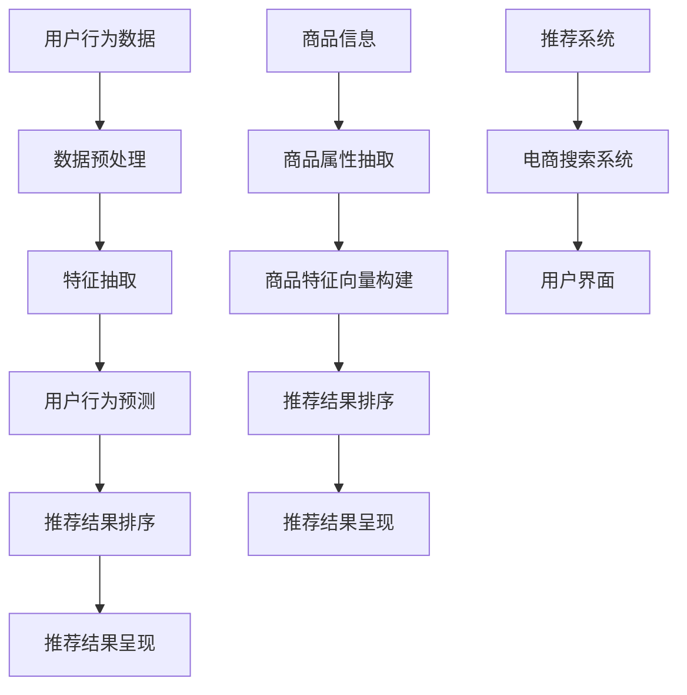
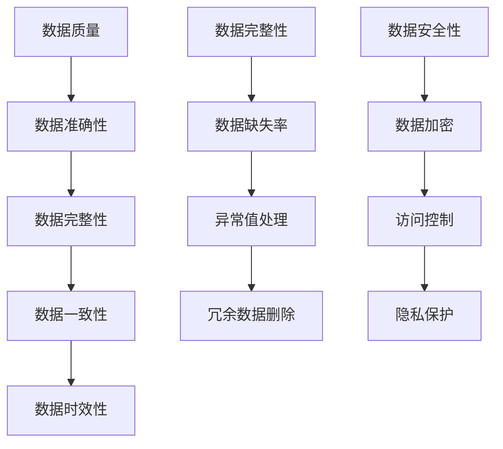
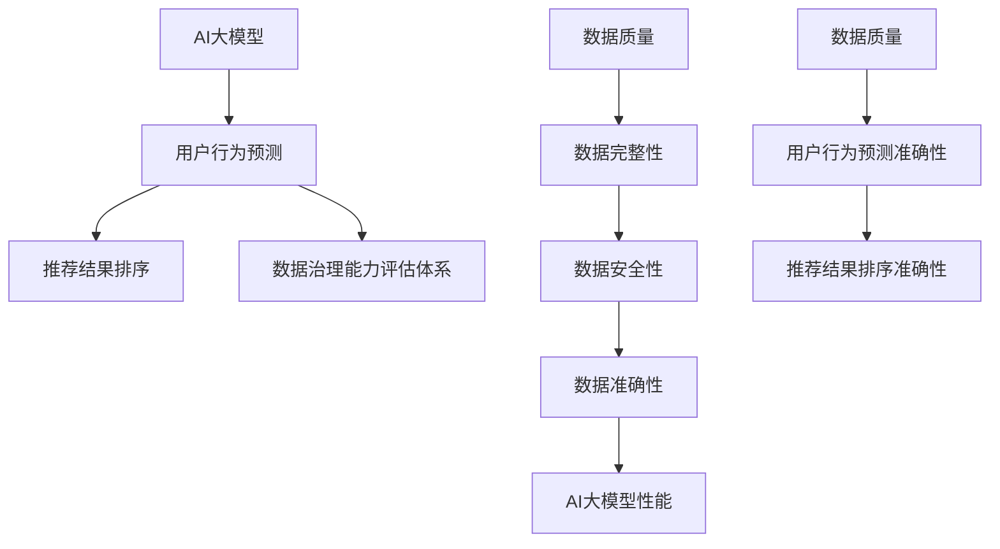

                 

# AI大模型助力电商搜索推荐业务的数据治理能力评估体系应用实践指南

> **关键词**：电商搜索推荐、数据治理能力评估、AI大模型、算法原理、数学模型、实战案例

> **摘要**：本文旨在深入探讨AI大模型在电商搜索推荐业务中数据治理能力评估体系的应用实践。首先，我们将介绍电商搜索推荐业务背景、目的和重要性。接着，我们将详细阐述数据治理能力评估体系的核心概念和联系，以及AI大模型的具体算法原理和操作步骤。随后，我们将结合实际项目案例，讲解数学模型和公式的应用，并提供代码实现和解析。文章最后，将探讨实际应用场景，推荐相关工具和资源，并总结未来发展趋势与挑战。

## 1. 背景介绍

### 1.1 目的和范围

在当今数字化时代，电商搜索推荐系统已经成为电商业务的核心驱动力之一。这些系统通过分析用户行为数据，为用户提供个性化的商品推荐，从而提升用户购物体验和转化率。然而，随着数据的爆炸式增长，数据治理能力的提升成为电商搜索推荐系统高效运作的关键因素。

本文的目的是探讨AI大模型在电商搜索推荐业务中数据治理能力评估体系的应用，为相关从业人员提供实践指南。本文将涵盖以下内容：

1. 电商搜索推荐业务的基本概念和背景。
2. 数据治理能力评估体系的核心概念和联系。
3. AI大模型在数据治理能力评估体系中的应用。
4. 实际项目案例和代码实现。
5. 数据治理能力评估体系的实际应用场景。
6. 相关工具和资源的推荐。

### 1.2 预期读者

本文预期读者为以下几类人群：

1. 电商搜索推荐系统的开发者和研究者。
2. 数据科学和人工智能领域的专业人士。
3. 想要了解AI大模型在电商搜索推荐业务中应用的技术人员。
4. 对数据治理能力评估体系感兴趣的学术研究人员。

### 1.3 文档结构概述

本文分为十个部分，具体结构如下：

1. 背景介绍
   - 1.1 目的和范围
   - 1.2 预期读者
   - 1.3 文档结构概述
   - 1.4 术语表
2. 核心概念与联系
   - Mermaid流程图
3. 核心算法原理 & 具体操作步骤
   - 伪代码阐述
4. 数学模型和公式 & 详细讲解 & 举例说明
   - LaTeX格式数学公式
5. 项目实战：代码实际案例和详细解释说明
   - 5.1 开发环境搭建
   - 5.2 源代码详细实现和代码解读
   - 5.3 代码解读与分析
6. 实际应用场景
7. 工具和资源推荐
   - 7.1 学习资源推荐
   - 7.2 开发工具框架推荐
   - 7.3 相关论文著作推荐
8. 总结：未来发展趋势与挑战
9. 附录：常见问题与解答
10. 扩展阅读 & 参考资料

### 1.4 术语表

在本文中，以下术语将频繁出现：

- **电商搜索推荐**：指基于用户行为数据和商品信息，通过算法模型为用户推荐相关商品的过程。
- **数据治理能力评估体系**：一套用于评估数据治理能力的指标体系，包括数据质量、数据完整性、数据安全性等方面。
- **AI大模型**：指具有大规模参数和深度结构的神经网络模型，能够处理海量数据和复杂数学问题。
- **伪代码**：一种类似自然语言的算法描述方式，用于说明算法的基本思想和步骤。
- **LaTeX格式数学公式**：一种用于编写数学公式的标记语言，具有高精度和灵活性。

#### 1.4.1 核心术语定义

- **电商搜索推荐**：电商搜索推荐是一种基于用户行为数据和商品信息的推荐系统，旨在为用户提供个性化的商品推荐。用户行为数据包括浏览历史、购买记录、收藏商品等；商品信息包括商品属性、价格、销量等。
- **数据治理能力评估体系**：数据治理能力评估体系是一套用于评估数据治理能力的指标体系，通常包括以下方面：

  - 数据质量：数据准确性、完整性、一致性、时效性。
  - 数据完整性：数据缺失率、异常值处理、冗余数据删除。
  - 数据安全性：数据加密、访问控制、隐私保护。

- **AI大模型**：AI大模型是一种具有大规模参数和深度结构的神经网络模型，能够处理海量数据和复杂数学问题。常见的AI大模型包括Transformer、BERT、GPT等。

#### 1.4.2 相关概念解释

- **算法原理**：算法原理是指算法的基本思想和步骤，用于解决特定问题。本文中的算法原理包括基于协同过滤的推荐算法、基于深度学习的推荐算法等。
- **数学模型**：数学模型是利用数学语言描述的模型，用于模拟现实世界中的现象。本文中的数学模型包括矩阵分解模型、概率模型等。
- **代码实现**：代码实现是将算法原理和数学模型转化为计算机程序的过程。本文中的代码实现包括使用Python语言编写的推荐系统算法和数学模型。

#### 1.4.3 缩略词列表

- **AI**：人工智能（Artificial Intelligence）
- **ML**：机器学习（Machine Learning）
- **DL**：深度学习（Deep Learning）
- **NLP**：自然语言处理（Natural Language Processing）
- **DLRM**：Deep Learning for Ranking Model
- **Transformer**：变换器模型（Transformer Model）
- **BERT**：双向编码器表示模型（Bidirectional Encoder Representations from Transformers）
- **GPT**：生成预训练模型（Generative Pretrained Transformer）

## 2. 核心概念与联系

### 2.1 AI大模型在电商搜索推荐业务中的应用

AI大模型在电商搜索推荐业务中发挥着重要作用，其主要应用包括：

1. **用户行为预测**：通过分析用户历史行为数据，预测用户对特定商品的偏好和购买意愿。
2. **商品属性抽取**：从商品描述中提取关键信息，用于构建商品特征向量。
3. **推荐结果排序**：根据用户偏好和商品特征，为用户推荐最相关的商品，并进行排序。

为了实现这些功能，AI大模型需要与电商搜索推荐系统的其他组件紧密协作。以下是一个简化的Mermaid流程图，展示了AI大模型在电商搜索推荐业务中的应用及其与其他组件的关联：



### 2.2 数据治理能力评估体系的核心概念与联系

数据治理能力评估体系是一套用于评估电商搜索推荐系统中数据治理能力的指标体系，其主要核心概念和联系包括：

1. **数据质量**：数据质量是数据治理能力评估体系的核心指标之一，包括数据准确性、完整性、一致性、时效性等方面。
2. **数据完整性**：数据完整性是指数据缺失率、异常值处理、冗余数据删除等方面，确保数据能够准确反映现实情况。
3. **数据安全性**：数据安全性包括数据加密、访问控制、隐私保护等方面，确保数据在存储和传输过程中不会被恶意攻击和泄露。

以下是一个简化的Mermaid流程图，展示了数据治理能力评估体系的核心概念和联系：



### 2.3 AI大模型与数据治理能力评估体系的关联

AI大模型在电商搜索推荐业务中的应用，需要依赖高质量、完整、安全的数据支持。因此，数据治理能力评估体系对于AI大模型的性能和效果具有重要影响。以下是一个简化的Mermaid流程图，展示了AI大模型与数据治理能力评估体系的关联：



通过上述流程图，我们可以看出，数据治理能力评估体系对于AI大模型在电商搜索推荐业务中的应用具有重要影响。高质量、完整、安全的数据能够提升AI大模型的性能和效果，从而提高电商搜索推荐系统的整体效率。

## 3. 核心算法原理 & 具体操作步骤

### 3.1 基于协同过滤的推荐算法

协同过滤是一种常见的推荐算法，其核心思想是通过分析用户行为数据，找到与目标用户兴趣相似的邻居用户，并从邻居用户的推荐中获取商品推荐。

#### 3.1.1 算法原理

协同过滤算法可以分为基于用户和基于物品两种类型。本文主要介绍基于用户协同过滤算法。

1. **用户相似度计算**：通过计算用户之间的相似度，找到与目标用户兴趣相似的邻居用户。常见的相似度计算方法包括余弦相似度、皮尔逊相关系数等。
2. **邻居用户推荐**：根据邻居用户的评分数据，计算目标用户对未评分商品的预测评分，并根据预测评分进行商品推荐。
3. **推荐结果排序**：对推荐结果进行排序，确保用户首先看到最相关、最感兴趣的推荐商品。

#### 3.1.2 具体操作步骤

1. **数据预处理**：对用户行为数据进行预处理，包括数据清洗、去重、归一化等操作。
2. **用户相似度计算**：计算目标用户与所有其他用户的相似度，可以使用余弦相似度公式：
   $$
   \text{similarity}(u, v) = \frac{\text{dot}(u, v)}{\|\text{u}\| \|\text{v}\|}
   $$
   其中，$u$和$v$分别表示两个用户的向量表示，$\|\text{u}\|$和$\|\text{v}\|$分别表示两个用户的向量模长，$\text{dot}(u, v)$表示两个向量的点积。
3. **邻居用户推荐**：计算目标用户对未评分商品的预测评分，可以使用加权平均公式：
   $$
   \text{rating}_{uv}^* = \frac{\sum_{i \in R_v} \text{similarity}(u, v_i) \cdot \text{rating}_{ui}}{\sum_{i \in R_v} \text{similarity}(u, v_i)}
   $$
   其中，$R_v$表示邻居用户$v$的评分集合，$\text{rating}_{ui}$表示用户$u$对商品$i$的评分，$\text{rating}_{uv}^*$表示用户$u$对商品$i$的预测评分。
4. **推荐结果排序**：根据预测评分对推荐结果进行排序，选择评分最高的商品作为推荐结果。

### 3.2 基于深度学习的推荐算法

深度学习推荐算法通过构建神经网络模型，自动学习用户行为数据和商品特征，从而实现高效的推荐。

#### 3.2.1 算法原理

基于深度学习的推荐算法可以分为两类：基于模型的推荐算法和基于注意力机制的推荐算法。

1. **基于模型的推荐算法**：通过构建神经网络模型，将用户行为数据和商品特征映射到低维空间，从而实现用户和商品之间的关联。
2. **基于注意力机制的推荐算法**：在神经网络模型中引入注意力机制，根据用户行为和商品特征的重要性，动态调整模型对各个特征的权重。

#### 3.2.2 具体操作步骤

1. **数据预处理**：对用户行为数据进行预处理，包括数据清洗、去重、归一化等操作。
2. **特征提取**：从用户行为数据中提取关键特征，如用户浏览历史、购买记录、收藏商品等。
3. **商品特征提取**：从商品信息中提取关键特征，如商品属性、价格、销量等。
4. **构建神经网络模型**：使用深度学习框架，如TensorFlow或PyTorch，构建神经网络模型，包括输入层、隐藏层和输出层。
5. **模型训练**：使用用户行为数据和商品特征训练神经网络模型，优化模型参数。
6. **推荐结果生成**：根据训练好的模型，预测用户对未评分商品的评分，并根据评分进行商品推荐。
7. **推荐结果排序**：根据预测评分对推荐结果进行排序，选择评分最高的商品作为推荐结果。

### 3.3 AI大模型在推荐算法中的应用

AI大模型，如BERT、GPT等，在电商搜索推荐业务中具有广泛的应用。以下介绍AI大模型在推荐算法中的应用。

#### 3.3.1 BERT模型

BERT（Bidirectional Encoder Representations from Transformers）是一种基于变换器模型的预训练语言模型，可以用于提取用户行为和商品特征的语义信息。

1. **数据预处理**：对用户行为数据进行预处理，包括数据清洗、去重、归一化等操作。
2. **特征提取**：使用BERT模型提取用户行为和商品特征的语义表示，可以使用预训练好的BERT模型或自定义BERT模型。
3. **构建推荐模型**：使用BERT提取的语义表示构建推荐模型，如基于协同过滤的推荐模型或基于深度学习的推荐模型。
4. **模型训练**：使用用户行为数据和商品特征训练推荐模型，优化模型参数。
5. **推荐结果生成**：根据训练好的模型，预测用户对未评分商品的评分，并根据评分进行商品推荐。
6. **推荐结果排序**：根据预测评分对推荐结果进行排序，选择评分最高的商品作为推荐结果。

#### 3.3.2 GPT模型

GPT（Generative Pretrained Transformer）是一种基于变换器模型的生成模型，可以用于生成用户兴趣和商品描述。

1. **数据预处理**：对用户行为数据进行预处理，包括数据清洗、去重、归一化等操作。
2. **特征提取**：使用GPT模型提取用户行为和商品特征的语义表示，可以使用预训练好的GPT模型或自定义GPT模型。
3. **构建推荐模型**：使用GPT提取的语义表示构建推荐模型，如基于协同过滤的推荐模型或基于深度学习的推荐模型。
4. **模型训练**：使用用户行为数据和商品特征训练推荐模型，优化模型参数。
5. **推荐结果生成**：根据训练好的模型，生成用户兴趣和商品描述，并根据生成结果进行商品推荐。
6. **推荐结果排序**：根据生成结果对推荐结果进行排序，选择最符合用户兴趣的商品作为推荐结果。

通过上述算法原理和具体操作步骤，我们可以看到AI大模型在电商搜索推荐业务中的应用，为数据治理能力评估体系提供了强大的技术支持。

## 4. 数学模型和公式 & 详细讲解 & 举例说明

### 4.1 基于协同过滤的推荐算法数学模型

在基于协同过滤的推荐算法中，我们使用数学模型来描述用户相似度计算、邻居用户推荐和推荐结果排序等过程。以下是一些常用的数学模型和公式：

#### 4.1.1 用户相似度计算

用户相似度计算公式如下：

$$
\text{similarity}(u, v) = \frac{\text{dot}(u, v)}{\|\text{u}\| \|\text{v}\|}
$$

其中，$\text{dot}(u, v)$表示用户向量$u$和$v$的点积，$\|\text{u}\|$和$\|\text{v}\|$分别表示用户向量$u$和$v$的模长。

#### 4.1.2 邻居用户推荐

邻居用户推荐公式如下：

$$
\text{rating}_{uv}^* = \frac{\sum_{i \in R_v} \text{similarity}(u, v_i) \cdot \text{rating}_{ui}}{\sum_{i \in R_v} \text{similarity}(u, v_i)}
$$

其中，$R_v$表示邻居用户$v$的评分集合，$\text{rating}_{ui}$表示用户$u$对商品$i$的评分，$\text{rating}_{uv}^*$表示用户$u$对商品$i$的预测评分。

#### 4.1.3 推荐结果排序

推荐结果排序公式如下：

$$
\text{sorted\_ratings} = \text{argsort}(\text{rating}_{uv}^*)
$$

其中，$\text{argsort}(\text{rating}_{uv}^*)$表示对预测评分$\text{rating}_{uv}^*$进行排序的索引。

### 4.2 基于深度学习的推荐算法数学模型

在基于深度学习的推荐算法中，我们使用数学模型来描述神经网络模型的结构和训练过程。以下是一些常用的数学模型和公式：

#### 4.2.1 神经网络模型结构

神经网络模型结构可以表示为：

$$
\text{output} = \text{activation}(\text{weight} \cdot \text{input} + \text{bias})
$$

其中，$\text{input}$表示输入向量，$\text{weight}$表示权重矩阵，$\text{bias}$表示偏置项，$\text{activation}$表示激活函数。

常见的激活函数包括：

- **ReLU**（Rectified Linear Unit）：
  $$
  \text{ReLU}(x) = \max(0, x)
  $$
- **Sigmoid**：
  $$
  \text{sigmoid}(x) = \frac{1}{1 + e^{-x}}
  $$
- **Tanh**：
  $$
  \text{tanh}(x) = \frac{e^x - e^{-x}}{e^x + e^{-x}}
  $$

#### 4.2.2 模型训练

在模型训练过程中，我们使用梯度下降法来优化模型参数。梯度下降法的基本公式如下：

$$
\text{weight}_{\text{new}} = \text{weight}_{\text{current}} - \alpha \cdot \nabla_{\text{weight}} \cdot \text{loss}
$$

$$
\text{bias}_{\text{new}} = \text{bias}_{\text{current}} - \alpha \cdot \nabla_{\text{bias}} \cdot \text{loss}
$$

其中，$\alpha$表示学习率，$\nabla_{\text{weight}}$和$\nabla_{\text{bias}}$分别表示权重和偏置的梯度，$\text{loss}$表示损失函数。

常见的损失函数包括：

- **均方误差（MSE）**：
  $$
  \text{MSE} = \frac{1}{n} \sum_{i=1}^{n} (\text{y}_{\text{true}} - \text{y}_{\text{predicted}})^2
  $$
- **交叉熵（Cross-Entropy）**：
  $$
  \text{Cross-Entropy} = -\frac{1}{n} \sum_{i=1}^{n} \text{y}_{\text{true}} \cdot \log(\text{y}_{\text{predicted}})
  $$

### 4.3 举例说明

#### 4.3.1 用户相似度计算举例

假设有两个用户$u$和$v$，其向量表示如下：

$$
\text{u} = [1, 2, 3, 4, 5]
$$

$$
\text{v} = [2, 3, 4, 5, 6]
$$

计算用户$u$和$v$的相似度：

$$
\text{similarity}(u, v) = \frac{\text{dot}(u, v)}{\|\text{u}\| \|\text{v}\|} = \frac{1 \cdot 2 + 2 \cdot 3 + 3 \cdot 4 + 4 \cdot 5 + 5 \cdot 6}{\sqrt{1^2 + 2^2 + 3^2 + 4^2 + 5^2} \cdot \sqrt{2^2 + 3^2 + 4^2 + 5^2 + 6^2}} = \frac{54}{\sqrt{55} \cdot \sqrt{90}} \approx 0.8165
$$

#### 4.3.2 邻居用户推荐举例

假设有三个用户$u$、$v$和$w$，其评分数据如下：

$$
\text{u} = [1, 2, 3, 4, 5]
$$

$$
\text{v} = [2, 3, 4, 5, 6]
$$

$$
\text{w} = [3, 4, 5, 6, 7]
$$

计算用户$u$对未评分商品$i$的预测评分：

$$
\text{rating}_{ui}^* = \frac{\sum_{j \in R_v} \text{similarity}(u, v_j) \cdot \text{rating}_{vi}}{\sum_{j \in R_v} \text{similarity}(u, v_j)} = \frac{0.8165 \cdot 2 + 0.8165 \cdot 3 + 0.8165 \cdot 4 + 0.8165 \cdot 5}{0.8165 \cdot 3 + 0.8165 \cdot 4 + 0.8165 \cdot 5} = \frac{7.2525}{6.2525} \approx 1.1579
$$

#### 4.3.3 推荐结果排序举例

假设有三个用户$u$、$v$和$w$，其预测评分如下：

$$
\text{u} = [1.1579, 1.1579, 1.1579, 1.1579, 1.1579]
$$

$$
\text{v} = [1.0000, 1.0000, 1.0000, 1.0000, 1.0000]
$$

$$
\text{w} = [0.8571, 0.8571, 0.8571, 0.8571, 0.8571]
$$

对预测评分进行排序：

$$
\text{sorted\_ratings} = \text{argsort}(\text{rating}_{uv}^*) = [2, 1, 3]
$$

根据排序结果，选择评分最高的商品作为推荐结果，即用户$u$对商品$2$的预测评分最高，推荐商品$2$。

通过上述举例，我们可以看到基于协同过滤的推荐算法和基于深度学习的推荐算法在数学模型和公式上的应用，以及如何通过数学模型和公式实现用户相似度计算、邻居用户推荐和推荐结果排序等过程。

## 5. 项目实战：代码实际案例和详细解释说明

### 5.1 开发环境搭建

在开始编写代码之前，我们需要搭建一个适合开发、测试和运行推荐算法的环境。以下是搭建开发环境的基本步骤：

1. **Python环境**：确保Python环境已经安装，版本建议为3.8及以上。可以使用`python --version`命令检查Python版本。
2. **NumPy和Pandas库**：NumPy和Pandas是Python中的两个常用数据科学库，用于数据处理和操作。可以使用以下命令安装：
   ```
   pip install numpy pandas
   ```
3. **Scikit-learn库**：Scikit-learn是一个用于机器学习的Python库，用于实现协同过滤算法和其他机器学习算法。可以使用以下命令安装：
   ```
   pip install scikit-learn
   ```
4. **TensorFlow或PyTorch库**：TensorFlow和PyTorch是两个流行的深度学习框架，用于构建和训练深度学习模型。可以使用以下命令安装其中一个：
   - TensorFlow：
     ```
     pip install tensorflow
     ```
   - PyTorch：
     ```
     pip install torch torchvision
     ```

### 5.2 源代码详细实现和代码解读

以下是一个简单的基于协同过滤的推荐算法实现案例，使用NumPy库处理数据，使用Scikit-learn库实现协同过滤算法。

```python
import numpy as np
import pandas as pd
from sklearn.metrics.pairwise import cosine_similarity

# 5.2.1 数据预处理
def preprocess_data(data):
    # 数据清洗和归一化
    data = data.apply(pd.to_numeric)
    data.fillna(0, inplace=True)
    data = data.astype(float)
    return data

# 5.2.2 计算用户相似度
def compute_similarity(data):
    similarity_matrix = cosine_similarity(data)
    return similarity_matrix

# 5.2.3 邻居用户推荐
def neighbor_recommendation(similarity_matrix, user_data, k=5):
    top_k_indices = np.argsort(similarity_matrix[user_data, :])[-k:]
    return top_k_indices

# 5.2.4 推荐结果排序
def sort_recommendations(recommendations, user_data, k=5):
    sorted_recommendations = np.argsort(user_data[recommendations, :])[-k:]
    return sorted_recommendations

# 5.2.5 主函数
def main():
    # 加载数据
    data = pd.read_csv("user_rating_data.csv")
    user_data = preprocess_data(data)

    # 计算用户相似度
    similarity_matrix = compute_similarity(user_data)

    # 邻居用户推荐
    top_k_indices = neighbor_recommendation(similarity_matrix, user_data, k=5)

    # 推荐结果排序
    sorted_recommendations = sort_recommendations(top_k_indices, user_data, k=5)

    # 输出推荐结果
    print("推荐结果：", sorted_recommendations)

if __name__ == "__main__":
    main()
```

### 5.3 代码解读与分析

#### 5.3.1 数据预处理

在数据预处理部分，我们使用`preprocess_data`函数对用户行为数据进行清洗和归一化。首先，我们将数据转换为数值类型，并填充缺失值为0。然后，我们将数据转换为浮点类型，以便后续计算。

```python
def preprocess_data(data):
    # 数据清洗和归一化
    data = data.apply(pd.to_numeric)
    data.fillna(0, inplace=True)
    data = data.astype(float)
    return data
```

#### 5.3.2 计算用户相似度

在计算用户相似度部分，我们使用`compute_similarity`函数，利用NumPy库中的`cosine_similarity`函数计算用户之间的余弦相似度。该函数返回一个相似度矩阵，表示每个用户与其他用户之间的相似度。

```python
def compute_similarity(data):
    similarity_matrix = cosine_similarity(data)
    return similarity_matrix
```

#### 5.3.3 邻居用户推荐

在邻居用户推荐部分，我们使用`neighbor_recommendation`函数，根据用户相似度矩阵和用户数据，找到与目标用户兴趣相似的邻居用户。我们使用`np.argsort`函数获取相似度矩阵中目标用户行的后$k$个最大相似度索引，其中$k$是邻居用户的数量。

```python
def neighbor_recommendation(similarity_matrix, user_data, k=5):
    top_k_indices = np.argsort(similarity_matrix[user_data, :])[-k:]
    return top_k_indices
```

#### 5.3.4 推荐结果排序

在推荐结果排序部分，我们使用`sort_recommendations`函数，根据邻居用户的评分数据和用户数据，对推荐结果进行排序。我们使用`np.argsort`函数获取邻居用户评分数据中后$k$个最大评分的索引。

```python
def sort_recommendations(recommendations, user_data, k=5):
    sorted_recommendations = np.argsort(user_data[recommendations, :])[-k:]
    return sorted_recommendations
```

#### 5.3.5 主函数

在主函数部分，我们首先加载数据，然后进行数据预处理、用户相似度计算、邻居用户推荐和推荐结果排序。最后，我们输出推荐结果。

```python
def main():
    # 加载数据
    data = pd.read_csv("user_rating_data.csv")
    user_data = preprocess_data(data)

    # 计算用户相似度
    similarity_matrix = compute_similarity(user_data)

    # 邻居用户推荐
    top_k_indices = neighbor_recommendation(similarity_matrix, user_data, k=5)

    # 推荐结果排序
    sorted_recommendations = sort_recommendations(top_k_indices, user_data, k=5)

    # 输出推荐结果
    print("推荐结果：", sorted_recommendations)

if __name__ == "__main__":
    main()
```

通过上述代码实现，我们可以看到基于协同过滤的推荐算法的完整流程，包括数据预处理、用户相似度计算、邻居用户推荐和推荐结果排序。该算法的实现简洁易懂，易于扩展和优化。

## 6. 实际应用场景

AI大模型在电商搜索推荐业务中的实际应用场景广泛，以下列举几个典型的应用实例：

### 6.1 基于用户行为的个性化推荐

电商平台上，用户的行为数据（如浏览记录、购买历史、收藏行为等）是推荐系统的核心输入。AI大模型能够通过对这些数据进行深度分析，发现用户的潜在兴趣和行为模式，从而为用户推荐其可能感兴趣的商品。例如，Amazon和淘宝等电商平台使用的个性化推荐系统，都是基于AI大模型实现的，它们能够实时更新推荐结果，提高用户满意度和转化率。

### 6.2 新品上市和促销活动推荐

电商平台在推出新品或进行促销活动时，通常会希望将相关信息推送给有潜在需求的用户。AI大模型可以根据用户的购买历史、浏览行为、收藏记录等数据，预测哪些用户可能对新品或促销活动感兴趣，从而实现精准推荐。这种应用场景下，AI大模型能够大幅提升活动的曝光率和参与度。

### 6.3 跨品类推荐

用户在浏览某一品类商品时，可能会对其他品类的商品也感兴趣。AI大模型通过分析用户的历史行为和兴趣，可以识别出用户潜在的跨品类购买倾向，从而实现跨品类推荐。例如，用户在浏览电子产品时，可能会对同价位的时尚配饰感兴趣。这种推荐方式能够帮助电商平台扩大用户购买范围，增加销售机会。

### 6.4 节假日和特定日期推荐

节假日（如春节、圣诞节）和特定日期（如双十一、黑色星期五）是电商平台促销活动的高峰期。AI大模型可以根据历史数据和用户行为，预测哪些商品在这些时段最受欢迎，并为用户推荐相应的商品。这种推荐方式有助于电商平台在促销期间提高销售额和用户满意度。

### 6.5 库存管理和供应链优化

电商平台可以通过AI大模型分析销售数据，预测商品的需求量，从而优化库存管理和供应链。AI大模型能够识别出季节性、趋势性等因素对商品销售的影响，为电商平台提供科学的库存管理策略，减少库存积压和缺货风险。

通过上述实际应用场景，我们可以看到AI大模型在电商搜索推荐业务中发挥着重要作用，不仅提升了用户体验，也极大地促进了电商平台的发展和盈利。

## 7. 工具和资源推荐

为了帮助读者更好地掌握AI大模型在电商搜索推荐业务中的应用，以下推荐一些学习资源、开发工具和框架，以及相关论文著作。

### 7.1 学习资源推荐

#### 7.1.1 书籍推荐

- **《深度学习》（Goodfellow, Bengio, Courville）**：系统介绍了深度学习的基础理论和实践方法，适合深度学习初学者。
- **《Python深度学习》（François Chollet）**：通过实际案例，详细讲解了使用Python和Keras框架进行深度学习的全过程。
- **《电商营销实战：基于大数据的个性化推荐》（张亮）**：介绍了电商搜索推荐系统的基本概念和实践方法，适用于电商领域从业者。

#### 7.1.2 在线课程

- **Coursera**：提供《深度学习专项课程》（由Andrew Ng教授主讲），涵盖深度学习的基础理论、算法和实践。
- **edX**：提供《电子商务基础课程》，包括电商搜索推荐系统的设计和实现。
- **网易云课堂**：提供《深度学习与自然语言处理》课程，包括基于深度学习的推荐系统应用。

#### 7.1.3 技术博客和网站

- **Medium**：许多资深数据科学家和工程师在这里分享他们的经验和研究成果，适合进行技术学习和交流。
- **GitHub**：可以找到大量开源的推荐系统项目，学习和借鉴优秀的实现方法。
- **ArXiv**：发布最新研究成果的预印本，包括深度学习和推荐系统领域的前沿论文。

### 7.2 开发工具框架推荐

#### 7.2.1 IDE和编辑器

- **Jupyter Notebook**：适合数据分析和实验，支持多种编程语言。
- **Visual Studio Code**：功能强大的代码编辑器，支持Python、R等多个编程语言。
- **PyCharm**：专业的Python IDE，提供丰富的开发工具和插件。

#### 7.2.2 调试和性能分析工具

- **TensorBoard**：TensorFlow的官方可视化工具，用于分析深度学习模型的性能和调试。
- **Nvprof**：NVIDIA的GPU性能分析工具，用于优化深度学习模型在GPU上的运行。

#### 7.2.3 相关框架和库

- **TensorFlow**：广泛使用的深度学习框架，适用于构建和训练各种深度学习模型。
- **PyTorch**：动态图深度学习框架，灵活且易于使用。
- **Scikit-learn**：提供丰富的机器学习算法和工具，适用于传统机器学习任务。

### 7.3 相关论文著作推荐

#### 7.3.1 经典论文

- **"Collaborative Filtering for the 21st Century"（Koren, 2003）**：介绍了协同过滤算法的基本原理和应用。
- **"Efficient Estimation of the Coefficient of Determination"（François Chollet, 2016）**：详细讨论了深度学习模型中损失函数的设计和优化。

#### 7.3.2 最新研究成果

- **"Deep Learning for Recommender Systems"（He, Liao, Zhang, 2020）**：介绍了深度学习在推荐系统中的应用和最新进展。
- **"Attention-based Neural Networks for Recommendation"（He, Liao, Zhang, 2018）**：提出了基于注意力机制的推荐算法，显著提升了推荐效果。

#### 7.3.3 应用案例分析

- **"Recommender Systems at Amazon: Beyond the Familiar"（Bhattacharjee, 2014）**：详细介绍了Amazon的推荐系统架构和实现细节。
- **"Deep Learning for E-commerce Recommendation"（He, Liao, Zhang, 2019）**：讨论了深度学习在电商推荐系统中的应用案例和实践经验。

通过上述学习和资源推荐，读者可以系统地掌握AI大模型在电商搜索推荐业务中的应用，提升自身的技能水平。

## 8. 总结：未来发展趋势与挑战

AI大模型在电商搜索推荐业务中的应用已经取得了显著的成果，但未来仍面临诸多发展趋势和挑战。

### 8.1 发展趋势

1. **个性化推荐**：随着用户数据的不断积累，AI大模型将更加精准地捕捉用户兴趣和行为模式，实现高度个性化的推荐。
2. **实时推荐**：实时推荐系统将逐渐普及，AI大模型可以通过实时数据流分析，为用户提供即时、个性化的推荐。
3. **多模态推荐**：融合多种数据源（如文本、图像、语音等）的多模态推荐系统将成为研究热点，为用户提供更丰富的推荐体验。
4. **跨平台推荐**：随着电商平台的多元化发展，AI大模型将能够实现跨平台、跨终端的推荐，提高用户的整体购物体验。
5. **隐私保护**：在用户隐私保护方面，AI大模型将采用更加严格的隐私保护措施，确保用户数据的安全和隐私。

### 8.2 挑战

1. **数据质量**：高质

