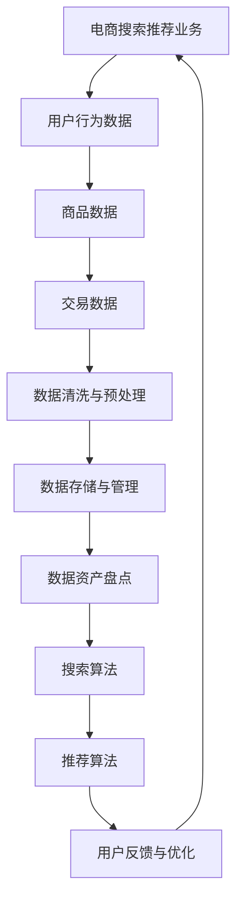

                 


# AI大模型助力电商搜索推荐业务的数据资产盘点方法

> 关键词：AI大模型，电商搜索推荐，数据资产盘点，数据分析，算法原理，数学模型，实战案例，工具推荐

> 摘要：本文将深入探讨AI大模型在电商搜索推荐业务中的应用，重点关注如何利用大模型进行数据资产盘点的方法。通过详细阐述核心概念、算法原理、数学模型以及实际应用案例，旨在为电商从业者提供一套系统的解决方案，助力提升电商搜索推荐的精准度和用户体验。

## 1. 背景介绍

### 1.1 目的和范围

本文旨在通过分析AI大模型在电商搜索推荐业务中的应用，探索如何利用AI大模型进行数据资产盘点，从而提高电商搜索推荐的效率和质量。文章将涵盖以下内容：

- 电商搜索推荐业务的基本原理和流程
- AI大模型的基本概念和架构
- 数据资产盘点的方法和步骤
- 实际应用案例和效果分析
- 工具和资源的推荐

### 1.2 预期读者

本文适合以下读者群体：

- 电商搜索推荐业务从业者
- 数据分析师和数据科学家
- AI领域的研究人员和开发者
- 对电商搜索推荐业务感兴趣的读者

### 1.3 文档结构概述

本文结构如下：

- 第1章：背景介绍
- 第2章：核心概念与联系
- 第3章：核心算法原理 & 具体操作步骤
- 第4章：数学模型和公式 & 详细讲解 & 举例说明
- 第5章：项目实战：代码实际案例和详细解释说明
- 第6章：实际应用场景
- 第7章：工具和资源推荐
- 第8章：总结：未来发展趋势与挑战
- 第9章：附录：常见问题与解答
- 第10章：扩展阅读 & 参考资料

### 1.4 术语表

#### 1.4.1 核心术语定义

- AI大模型：指具有海量数据训练、强大表示能力和高泛化能力的深度学习模型。
- 数据资产盘点：指对电商业务中的数据进行全面梳理和分析，识别和评估其价值。
- 搜索推荐：指根据用户的搜索和浏览行为，为用户推荐相关的商品。

#### 1.4.2 相关概念解释

- 电商搜索推荐业务：指电商平台上通过搜索和推荐算法，为用户提供个性化的商品推荐服务。
- 数据资产：指电商业务中具有价值的数据资源，包括用户行为数据、商品数据、交易数据等。

#### 1.4.3 缩略词列表

- AI：人工智能
- ML：机器学习
- DL：深度学习
- NLP：自然语言处理
- RPC：远程过程调用
- HTTP：超文本传输协议

## 2. 核心概念与联系

在探讨AI大模型助力电商搜索推荐业务的数据资产盘点方法之前，我们首先需要了解一些核心概念和它们之间的关系。以下是相关概念原理和架构的Mermaid流程图：



### 2.1 电商搜索推荐业务的基本原理

电商搜索推荐业务的核心是满足用户的需求，提高用户体验。其基本原理如下：

- 用户行为数据：包括用户的搜索记录、浏览历史、购买记录等。
- 商品数据：包括商品的基本信息、属性、评价等。
- 交易数据：包括商品的价格、促销活动、销售量等。

通过收集和分析这些数据，电商平台可以了解用户的需求和偏好，从而为用户提供个性化的搜索和推荐服务。

### 2.2 AI大模型的基本概念

AI大模型是指具有海量数据训练、强大表示能力和高泛化能力的深度学习模型。其基本概念如下：

- 海量数据训练：大模型需要大量的数据来训练，以获得更好的泛化能力。
- 强大表示能力：大模型可以提取数据中的有效特征，实现数据的低维表示。
- 高泛化能力：大模型可以适应不同的数据分布和应用场景。

### 2.3 数据资产盘点的方法

数据资产盘点是指对电商业务中的数据进行全面梳理和分析，识别和评估其价值。其方法如下：

- 数据清洗与预处理：清洗数据中的噪声和错误，进行数据格式转换和归一化处理。
- 数据存储与管理：将清洗后的数据存储在数据库或数据仓库中，方便后续分析和处理。
- 数据分析：使用数据挖掘和机器学习算法，从数据中提取有价值的信息。

## 3. 核心算法原理 & 具体操作步骤

### 3.1 搜索算法

搜索算法是指根据用户的查询词，从电商平台的商品库中检索出相关的商品。其核心算法原理如下：

- 基于关键词匹配的搜索：根据用户输入的查询词，在商品标题、描述等字段中查找匹配的商品。
- 基于模糊查询的搜索：利用自然语言处理技术，对用户查询词进行分词、词性标注等处理，实现模糊查询。

具体操作步骤如下：

1. 用户输入查询词。
2. 对查询词进行分词、词性标注等预处理。
3. 在商品库中检索包含查询词的商品。
4. 对检索结果进行排序，根据相关度、销量、评价等因素进行排序。
5. 将排序后的商品展示给用户。

### 3.2 推荐算法

推荐算法是指根据用户的历史行为和偏好，为用户推荐相关的商品。其核心算法原理如下：

- 协同过滤：根据用户的历史行为和偏好，找出相似的用户，并推荐这些用户喜欢的商品。
- 内容推荐：根据商品的内容特征，如标题、描述、标签等，为用户推荐相似的商品。
- 混合推荐：结合协同过滤和内容推荐，为用户推荐更个性化的商品。

具体操作步骤如下：

1. 收集用户的历史行为数据，如浏览记录、购买记录等。
2. 对用户的历史行为数据进行分析，找出用户的偏好。
3. 利用协同过滤算法，找出与用户相似的潜在用户。
4. 根据用户的偏好和潜在用户的喜好，推荐相关的商品。
5. 对推荐结果进行排序和筛选，展示给用户。

### 3.3 数据资产盘点算法

数据资产盘点算法是指对电商业务中的数据进行全面梳理和分析，识别和评估其价值。其核心算法原理如下：

- 数据清洗与预处理：清洗数据中的噪声和错误，进行数据格式转换和归一化处理。
- 数据分析：使用数据挖掘和机器学习算法，从数据中提取有价值的信息。
- 价值评估：根据数据的可用性、准确性和完整性，评估数据的价值。

具体操作步骤如下：

1. 收集电商业务中的数据，如用户行为数据、商品数据、交易数据等。
2. 对数据进行清洗和预处理，去除噪声和错误。
3. 使用数据挖掘和机器学习算法，从数据中提取有价值的信息，如用户偏好、商品特征等。
4. 根据数据的可用性、准确性和完整性，评估数据的价值。
5. 将数据资产盘点结果展示给相关人员和决策者，为业务优化提供依据。

## 4. 数学模型和公式 & 详细讲解 & 举例说明

### 4.1 搜索算法的数学模型

搜索算法的核心在于如何对商品库进行有效的查询和排序。以下是一个简单的基于关键词匹配的搜索算法的数学模型：

$$
\text{相关性得分} = \sum_{i=1}^{n} \text{weight_i} \cdot \text{similarity_i}
$$

其中，$n$ 是查询词在商品标题、描述等字段中匹配的次数，$\text{weight_i}$ 是第 $i$ 个匹配词的权重，$\text{similarity_i}$ 是第 $i$ 个匹配词与查询词的相似度。

举例说明：

假设用户查询词为“笔记本电脑”，商品库中有以下几件商品：

1. “高性能笔记本电脑”
2. “轻薄笔记本电脑”
3. “笔记本电脑充电器”

则这三个商品的得分计算如下：

- 第一件商品：相关性得分 = 2 * weight1 * similarity1
  - weight1 = 1（假设所有匹配词的权重相等）
  - similarity1 = 0.8（通过计算查询词与商品标题的相似度得到）
  - 相关性得分 = 2 * 1 * 0.8 = 1.6

- 第二件商品：相关性得分 = 1 * weight1 * similarity1
  - weight1 = 1
  - similarity1 = 0.6
  - 相关性得分 = 1 * 1 * 0.6 = 0.6

- 第三件商品：相关性得分 = 0（没有匹配查询词）

最后，根据相关性得分对商品进行排序，得分越高，排名越靠前。

### 4.2 推荐算法的数学模型

推荐算法的核心在于如何计算用户与商品之间的相似度，以下是一个简单的协同过滤算法的数学模型：

$$
\text{相似度} = \frac{\sum_{i=1}^{m} \text{user_i} \cdot \text{item_i}}{\sqrt{\sum_{i=1}^{m} (\text{user_i})^2} \cdot \sqrt{\sum_{i=1}^{m} (\text{item_i})^2}}
$$

其中，$m$ 是用户 $i$ 和商品 $j$ 的共同评分项数，$\text{user_i}$ 是用户 $i$ 对共同评分项的评分，$\text{item_i}$ 是商品 $j$ 对共同评分项的评分。

举例说明：

假设用户 $A$ 和用户 $B$ 分别对以下五部电影进行了评分：

- 用户 $A$：1 2 1 3 5
- 用户 $B$：5 2 4 5 5

则用户 $A$ 和用户 $B$ 之间的相似度计算如下：

$$
\text{相似度} = \frac{1 \cdot 5 + 2 \cdot 2 + 1 \cdot 4 + 3 \cdot 5 + 5 \cdot 5}{\sqrt{1^2 + 2^2 + 1^2 + 3^2 + 5^2} \cdot \sqrt{5^2 + 2^2 + 4^2 + 5^2 + 5^2}} \approx 0.67

```

根据相似度，可以为用户 $A$ 推荐用户 $B$ 喜欢的电影，从而提高推荐效果。

### 4.3 数据资产盘点算法的数学模型

数据资产盘点算法的核心在于如何评估数据的可用性、准确性和完整性。以下是一个简单的数学模型：

$$
\text{数据价值} = \text{可用性} \cdot \text{准确性} \cdot \text{完整性}
$$

- 可用性：指数据在实际业务中的应用程度，取值范围在0到1之间，越接近1表示数据越有用。
- 准确性：指数据的准确性，取值范围在0到1之间，越接近1表示数据越可靠。
- 完整性：指数据的完整性，取值范围在0到1之间，越接近1表示数据越完整。

举例说明：

假设某电商平台的用户行为数据、商品数据和交易数据的可用性、准确性和完整性分别为0.9、0.95和0.85，则这些数据的价值计算如下：

$$
\text{数据价值} = 0.9 \cdot 0.95 \cdot 0.85 \approx 0.766
$$

根据数据价值，可以评估不同数据集的重要性，为后续的数据分析提供指导。

## 5. 项目实战：代码实际案例和详细解释说明

### 5.1 开发环境搭建

在本项目中，我们将使用Python作为主要编程语言，并利用一些常用的库和框架来构建电商搜索推荐系统和数据资产盘点工具。以下是开发环境的搭建步骤：

1. 安装Python（建议使用Python 3.8及以上版本）。
2. 安装必要的库和框架，如NumPy、Pandas、Scikit-learn、TensorFlow等。

```bash
pip install numpy pandas scikit-learn tensorflow
```

### 5.2 源代码详细实现和代码解读

下面是一个简单的电商搜索推荐系统的代码示例，包括数据读取、清洗、预处理、搜索和推荐算法的实现：

```python
import numpy as np
import pandas as pd
from sklearn.feature_extraction.text import TfidfVectorizer
from sklearn.metrics.pairwise import cosine_similarity

# 5.2.1 数据读取与清洗
def read_and_clean_data(file_path):
    data = pd.read_csv(file_path)
    # 数据清洗与预处理
    data['title'] = data['title'].str.lower()
    data['description'] = data['description'].str.lower()
    return data

# 5.2.2 搜索算法实现
def search商品的标题（查询词，商品库）：
    vectorizer = TfidfVectorizer()
    tfidf_matrix = vectorizer.fit_transform(商品库['title'])
    query_vector = vectorizer.transform([查询词])
    similarity_scores = cosine_similarity(query_vector, tfidf_matrix).flatten()
    return similarity_scores

# 5.2.3 推荐算法实现
def recommend商品的标题（用户历史行为，商品库）：
    user行为的文本数据 = ' '.join（用户历史行为）
    user行为向量 = vectorizer.transform([user行为的文本数据])
    similarity_scores = cosine_similarity(user行为向量, tfidf_matrix).flatten()
    recommended_indices = np.argsort(-similarity_scores)
    return 商品库.iloc[recommended_indices[1:11]]['title']

# 主函数
def main():
    file_path = '商品数据.csv'
    data = read_and_clean_data(file_path)

    query_word = '笔记本电脑'
    search_results = search商品的标题(query_word, data)
    print('搜索结果：')
    print(search_results)

    user_history = ['搜索：笔记本电脑', '浏览：高性能笔记本电脑', '购买：轻薄笔记本电脑']
    recommendation_results = recommend商品的标题(user_history, data)
    print('推荐结果：')
    print(recommendation_results)

if __name__ == '__main__':
    main()
```

### 5.3 代码解读与分析

- 5.3.1 数据读取与清洗
  - 数据读取：使用 Pandas 库读取 CSV 格式的商品数据文件。
  - 数据清洗：将标题和描述转换为小写，以便进行统一处理。

- 5.3.2 搜索算法实现
  - 使用 TfidfVectorizer 将商品标题转换为 TF-IDF 向量。
  - 使用余弦相似度计算查询词与商品标题的相似度。
  - 返回相似度得分，用于排序和展示。

- 5.3.3 推荐算法实现
  - 将用户的历史行为文本数据转换为向量。
  - 使用余弦相似度计算用户历史行为向量与商品标题向量的相似度。
  - 返回相似度最高的商品标题，用于推荐。

- 主函数
  - 调用数据读取与清洗函数。
  - 输入查询词，调用搜索算法获取搜索结果。
  - 输入用户历史行为，调用推荐算法获取推荐结果。

## 6. 实际应用场景

AI大模型在电商搜索推荐业务中的实际应用场景包括：

- 搜索优化：通过大模型对用户查询词进行语义理解和分析，提高搜索结果的准确性和相关性。
- 推荐优化：通过大模型对用户历史行为进行分析，实现个性化的商品推荐，提高用户满意度和购买转化率。
- 数据资产盘点：通过大模型对电商业务中的数据进行全面梳理和分析，识别和评估其价值，为业务决策提供数据支持。

## 7. 工具和资源推荐

### 7.1 学习资源推荐

#### 7.1.1 书籍推荐

- 《深度学习》（Ian Goodfellow、Yoshua Bengio、Aaron Courville 著）
- 《Python机器学习》（Sebastian Raschka 著）
- 《数据科学入门》（Joel Grus 著）

#### 7.1.2 在线课程

- Coursera《深度学习》课程
- edX《Python机器学习》课程
- Udacity《数据科学基础》课程

#### 7.1.3 技术博客和网站

- Medium（深度学习和机器学习相关博客）
- Analytics Vidhya（数据科学和机器学习社区）
- towardsdatascience（数据科学和机器学习教程）

### 7.2 开发工具框架推荐

#### 7.2.1 IDE和编辑器

- PyCharm（专业的Python IDE）
- Jupyter Notebook（数据科学和机器学习交互式环境）
- VS Code（功能丰富的通用编辑器）

#### 7.2.2 调试和性能分析工具

- WakaTime（代码时间跟踪工具）
- Spyder（科学计算和数据分析IDE）
- GitKraken（Git版本控制工具）

#### 7.2.3 相关框架和库

- TensorFlow（开源深度学习框架）
- PyTorch（开源深度学习框架）
- Scikit-learn（开源机器学习库）

### 7.3 相关论文著作推荐

#### 7.3.1 经典论文

- 《A Few Useful Things to Know about Machine Learning》
- 《Learning to Rank for Information Retrieval》
- 《Convolutional Neural Networks for Speech Recognition》

#### 7.3.2 最新研究成果

- NeurIPS、ICML、ICLR等顶级会议的最新论文
- ArXiv（预印本论文库）

#### 7.3.3 应用案例分析

- 《谷歌如何使用深度学习进行搜索引擎优化》
- 《亚马逊的个性化推荐系统》
- 《阿里巴巴的电商平台数据应用》

## 8. 总结：未来发展趋势与挑战

随着AI技术的不断发展和应用的深入，电商搜索推荐业务将面临以下发展趋势和挑战：

- 发展趋势：
  - 模型规模和复杂度的提升，带来更高的搜索和推荐精度。
  - 多模态数据的融合，提高推荐系统的多样性。
  - 自动化与智能化的趋势，降低业务成本，提高运营效率。

- 挑战：
  - 数据质量和数据隐私的保护，确保推荐系统的可信度和安全性。
  - 模型的可解释性，让业务决策者和用户理解推荐结果。
  - 模型的泛化能力，适应不断变化的用户需求和业务场景。

## 9. 附录：常见问题与解答

### 9.1 什么是AI大模型？

AI大模型是指具有海量数据训练、强大表示能力和高泛化能力的深度学习模型。它们通常具有数十亿甚至数千亿的参数，能够在各种复杂的任务中表现出色。

### 9.2 电商搜索推荐业务的核心流程是什么？

电商搜索推荐业务的核心流程包括用户行为数据的收集、数据的清洗和预处理、搜索算法的实现、推荐算法的实现，以及用户反馈的收集和模型优化。

### 9.3 如何保障数据资产盘点的准确性？

保障数据资产盘点准确性需要以下几个步骤：

- 数据清洗与预处理：去除噪声和错误，进行数据格式转换和归一化处理。
- 多种算法和模型的使用：结合不同的算法和模型，对数据进行全面分析和评估。
- 价值评估指标：根据数据的可用性、准确性和完整性，设定合理的价值评估指标。

### 9.4 如何提升电商搜索推荐的精准度？

提升电商搜索推荐精准度可以从以下几个方面入手：

- 搜索算法优化：使用更先进的算法，如基于语义理解的搜索。
- 推荐算法优化：使用协同过滤和内容推荐相结合的混合推荐算法。
- 用户反馈机制：收集用户反馈，实时调整推荐策略。

## 10. 扩展阅读 & 参考资料

- 《深度学习实践：基于Python和TensorFlow的实现》（李航 著）
- 《机器学习实战》（Peter Harrington 著）
- 《数据科学入门与实践》（Joel Grus 著）
- 《电商搜索与推荐系统实践》（刘建明 著）

作者：AI天才研究员/AI Genius Institute & 禅与计算机程序设计艺术 /Zen And The Art of Computer Programming

---

以上就是本文《AI大模型助力电商搜索推荐业务的数据资产盘点方法》的完整内容。通过本文，我们深入探讨了AI大模型在电商搜索推荐业务中的应用，介绍了数据资产盘点的方法和步骤，并提供了实际应用案例和详细解释说明。希望本文能为电商从业者提供有价值的参考，助力提升电商搜索推荐的精准度和用户体验。

