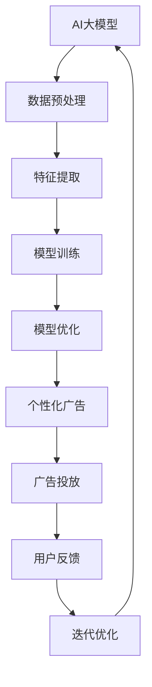

                 

# AI大模型在个性化广告中的商业化应用

> **关键词**：AI大模型，个性化广告，商业化应用，数据挖掘，机器学习，推荐系统，用户体验
> 
> **摘要**：本文将深入探讨AI大模型在个性化广告中的商业化应用。通过介绍背景、核心概念、算法原理、数学模型、实际案例和未来发展趋势，我们旨在为读者提供一个全面的视角，了解AI大模型在个性化广告领域的重要作用和巨大潜力。

## 1. 背景介绍

### 1.1 目的和范围

本文的目标是深入探讨AI大模型在个性化广告中的商业化应用，旨在为读者提供对这一领域的全面理解和深刻洞察。我们将从以下几个方面展开讨论：

1. **核心概念与联系**：介绍AI大模型、个性化广告和相关技术的基本概念，并通过Mermaid流程图展示它们之间的联系。
2. **核心算法原理与操作步骤**：详细讲解AI大模型在个性化广告中的核心算法原理，包括数据预处理、特征提取、模型训练和优化等步骤。
3. **数学模型与公式**：阐述AI大模型中的数学模型和公式，并通过具体例子进行详细解释。
4. **项目实战：代码实际案例**：通过实际代码案例，展示AI大模型在个性化广告中的具体应用，并进行详细解释和分析。
5. **实际应用场景**：探讨AI大模型在个性化广告中的实际应用场景，包括电子商务、社交媒体、搜索引擎等。
6. **工具和资源推荐**：推荐学习资源、开发工具和框架，以及相关论文和研究成果。
7. **总结：未来发展趋势与挑战**：总结AI大模型在个性化广告中的商业化应用现状，展望未来发展趋势和面临的挑战。

### 1.2 预期读者

本文主要面向以下读者群体：

1. **AI和机器学习从业者**：希望了解AI大模型在个性化广告中的应用，以及如何利用这些技术实现商业化应用。
2. **广告营销从业人员**：希望掌握AI大模型在个性化广告中的基本原理和应用方法，提升广告投放效果。
3. **技术爱好者和研究人员**：对AI大模型、个性化广告和商业化应用领域感兴趣的读者，希望深入了解这一前沿领域。

### 1.3 文档结构概述

本文分为以下几个部分：

1. **背景介绍**：介绍本文的目的、预期读者和文档结构。
2. **核心概念与联系**：介绍AI大模型、个性化广告和相关技术的基本概念，并通过Mermaid流程图展示它们之间的联系。
3. **核心算法原理与操作步骤**：详细讲解AI大模型在个性化广告中的核心算法原理，包括数据预处理、特征提取、模型训练和优化等步骤。
4. **数学模型与公式**：阐述AI大模型中的数学模型和公式，并通过具体例子进行详细解释。
5. **项目实战：代码实际案例**：通过实际代码案例，展示AI大模型在个性化广告中的具体应用，并进行详细解释和分析。
6. **实际应用场景**：探讨AI大模型在个性化广告中的实际应用场景，包括电子商务、社交媒体、搜索引擎等。
7. **工具和资源推荐**：推荐学习资源、开发工具和框架，以及相关论文和研究成果。
8. **总结：未来发展趋势与挑战**：总结AI大模型在个性化广告中的商业化应用现状，展望未来发展趋势和面临的挑战。
9. **附录：常见问题与解答**：提供常见问题的解答，帮助读者更好地理解本文内容。
10. **扩展阅读 & 参考资料**：推荐相关书籍、在线课程、技术博客和网站，以及相关论文和研究成果。

### 1.4 术语表

在本文中，我们将使用以下术语：

#### 1.4.1 核心术语定义

- **AI大模型**：指具有大规模参数、复杂结构和强大计算能力的深度学习模型，如Transformer、BERT等。
- **个性化广告**：指根据用户兴趣、行为和需求等特征，为用户推荐定制化的广告内容，以提高广告投放效果。
- **数据挖掘**：指从大量数据中提取有价值的信息和知识的过程，包括数据预处理、特征提取、模式识别等。
- **机器学习**：指利用数据和算法，使计算机具有自主学习和决策能力的技术，包括监督学习、无监督学习和强化学习等。
- **推荐系统**：指根据用户历史行为和偏好，为用户推荐相关商品、服务或内容的技术系统。

#### 1.4.2 相关概念解释

- **用户兴趣**：指用户对特定领域、主题或内容的兴趣程度，通常通过用户行为数据（如浏览、搜索、购买等）进行挖掘和建模。
- **用户行为**：指用户在使用产品或服务过程中的各种操作和互动，如浏览、点击、购买等。
- **广告效果**：指广告投放后所达到的预期效果，如点击率、转化率、ROI等。
- **商业化应用**：指将技术或产品应用于实际商业场景中，实现商业价值的过程。

#### 1.4.3 缩略词列表

- **AI**：人工智能
- **ML**：机器学习
- **DL**：深度学习
- **CTR**：点击率
- **ROI**：投资回报率

## 2. 核心概念与联系

在本节中，我们将介绍AI大模型、个性化广告和相关技术的基本概念，并通过Mermaid流程图展示它们之间的联系。

### 2.1 AI大模型

AI大模型是指具有大规模参数、复杂结构和强大计算能力的深度学习模型，如Transformer、BERT等。这些模型通常具有以下特点：

1. **大规模参数**：AI大模型包含数十亿甚至千亿级别的参数，可以捕捉数据中的复杂模式和相关性。
2. **复杂结构**：AI大模型采用多层神经网络结构，通过逐层抽象和转换，将原始数据转化为高维特征表示。
3. **强大计算能力**：AI大模型利用GPU等硬件加速器进行大规模并行计算，具有高效的训练和推理速度。

### 2.2 个性化广告

个性化广告是指根据用户兴趣、行为和需求等特征，为用户推荐定制化的广告内容，以提高广告投放效果。个性化广告的核心目标是提高广告的点击率、转化率和ROI。实现个性化广告的关键技术包括：

1. **用户兴趣挖掘**：通过分析用户历史行为数据（如浏览、搜索、购买等），挖掘用户的兴趣特征，为后续广告推荐提供依据。
2. **用户行为预测**：利用机器学习算法，预测用户在特定广告场景下的行为，如点击、转化等。
3. **广告内容生成**：根据用户兴趣和行为预测结果，生成个性化的广告内容，提高广告投放效果。

### 2.3 Mermaid流程图

下面是一个简单的Mermaid流程图，展示AI大模型、个性化广告和相关技术之间的联系：



### 2.4 相关技术

除了AI大模型和个性化广告，本节还涉及以下相关技术：

1. **数据挖掘**：数据挖掘是指从大量数据中提取有价值的信息和知识的过程，包括数据预处理、特征提取、模式识别等。数据挖掘技术为个性化广告提供了数据支持和基础。
2. **机器学习**：机器学习是指利用数据和算法，使计算机具有自主学习和决策能力的技术，包括监督学习、无监督学习和强化学习等。机器学习技术是AI大模型和个性化广告的核心算法基础。
3. **推荐系统**：推荐系统是指根据用户历史行为和偏好，为用户推荐相关商品、服务或内容的技术系统。推荐系统在个性化广告中发挥着关键作用。

通过以上介绍，我们为读者提供了AI大模型、个性化广告和相关技术的基本概念和联系。在后续章节中，我们将深入探讨这些技术的核心算法原理、数学模型和实际应用案例。现在，让我们开始深入分析这些核心概念和联系。

## 3. 核心算法原理 & 具体操作步骤

在本节中，我们将详细讲解AI大模型在个性化广告中的核心算法原理，包括数据预处理、特征提取、模型训练和优化等步骤。为了更好地理解这些步骤，我们将使用伪代码进行详细阐述。

### 3.1 数据预处理

数据预处理是AI大模型在个性化广告中的第一步，其目的是将原始数据转换为适合模型训练的形式。以下是数据预处理的主要步骤：

```python
# 数据预处理伪代码
def preprocess_data(data):
    # 1. 数据清洗：去除无效、重复和异常数据
    clean_data = clean(data)
    
    # 2. 数据归一化：将不同特征的数据归一化到相同的范围
    normalized_data = normalize(clean_data)
    
    # 3. 特征工程：提取有用的特征，如用户兴趣、行为标签等
    feature_data = extract_features(normalized_data)
    
    return feature_data
```

### 3.2 特征提取

特征提取是数据预处理的关键步骤，其目的是从原始数据中提取出对模型训练有价值的特征。以下是特征提取的主要步骤：

```python
# 特征提取伪代码
def extract_features(data):
    # 1. 用户兴趣特征提取：根据用户历史行为数据，提取用户的兴趣特征
    user_interest = extract_user_interest(data)
    
    # 2. 行为特征提取：根据用户历史行为数据，提取用户的行为特征
    user_behavior = extract_user_behavior(data)
    
    # 3. 交互特征提取：根据用户与广告的交互数据，提取用户与广告的交互特征
    user_ad_interaction = extract_user_ad_interaction(data)
    
    return user_interest, user_behavior, user_ad_interaction
```

### 3.3 模型训练

模型训练是AI大模型在个性化广告中的核心步骤，其目的是通过大量数据训练出一个能够预测用户行为的模型。以下是模型训练的主要步骤：

```python
# 模型训练伪代码
def train_model(features, labels):
    # 1. 初始化模型参数
    model = initialize_model()
    
    # 2. 训练模型：使用训练数据训练模型
    model.fit(features, labels)
    
    # 3. 评估模型：使用验证数据评估模型性能
    performance = evaluate_model(model, features, labels)
    
    return model, performance
```

### 3.4 模型优化

模型优化是提高模型性能的重要步骤，其目的是通过调整模型参数和优化算法来提升模型效果。以下是模型优化的一些常用方法：

```python
# 模型优化伪代码
def optimize_model(model, features, labels):
    # 1. 调整学习率：根据模型训练过程，调整学习率
    learning_rate = adjust_learning_rate(model)
    
    # 2. 调整正则化参数：根据模型训练过程，调整正则化参数
    regularization = adjust_regularization(model)
    
    # 3. 调整优化算法：根据模型训练过程，调整优化算法
    optimizer = adjust_optimizer(model)
    
    # 4. 重新训练模型：使用调整后的参数重新训练模型
    model.fit(features, labels)
    
    return model
```

### 3.5 模型评估与迭代

模型评估与迭代是确保模型性能的重要步骤，其目的是通过不断优化和调整模型，提高其在实际应用中的效果。以下是模型评估与迭代的主要步骤：

```python
# 模型评估与迭代伪代码
def evaluate_and_iterate(model, features, labels):
    # 1. 评估模型：使用测试数据评估模型性能
    performance = evaluate_model(model, features, labels)
    
    # 2. 模型调整：根据评估结果，调整模型参数和优化算法
    model = optimize_model(model, features, labels)
    
    # 3. 迭代优化：继续迭代优化，直到模型性能达到预期
    while not satisfactory_performance(performance):
        model = evaluate_and_iterate(model, features, labels)
        
    return model
```

通过以上伪代码，我们详细介绍了AI大模型在个性化广告中的核心算法原理和具体操作步骤。这些步骤不仅为读者提供了清晰的指导，也为实际应用中的模型训练和优化提供了有力支持。在下一节中，我们将进一步探讨AI大模型中的数学模型和公式，以帮助读者深入理解这些核心算法原理。

## 4. 数学模型和公式 & 详细讲解 & 举例说明

在本节中，我们将详细讲解AI大模型在个性化广告中的数学模型和公式，并通过具体例子进行详细解释。这些数学模型和公式是AI大模型的核心组成部分，对于理解其工作原理和性能优化具有重要意义。

### 4.1 模型表示

AI大模型通常采用深度神经网络（DNN）结构，其数学模型可以用以下公式表示：

\[ 
f(x) = \sigma(W \cdot x + b) 
\]

其中：

- \( f(x) \) 表示输出结果，可以是概率、类别或数值。
- \( \sigma \) 是激活函数，常见的有Sigmoid、ReLU等。
- \( W \) 是权重矩阵，用于线性变换。
- \( x \) 是输入特征向量。
- \( b \) 是偏置向量。

### 4.2 损失函数

损失函数是衡量模型预测结果与真实标签之间差异的指标，常见的损失函数包括均方误差（MSE）、交叉熵损失（Cross-Entropy Loss）等。

均方误差损失函数可以用以下公式表示：

\[ 
L(\theta) = \frac{1}{m} \sum_{i=1}^{m} (y_i - f(x_i))^2 
\]

其中：

- \( L(\theta) \) 是损失函数。
- \( m \) 是样本数量。
- \( y_i \) 是第 \( i \) 个样本的真实标签。
- \( f(x_i) \) 是第 \( i \) 个样本的预测结果。

交叉熵损失函数可以用以下公式表示：

\[ 
L(\theta) = -\frac{1}{m} \sum_{i=1}^{m} \sum_{j=1}^{n} y_{ij} \log(f_{ij}) 
\]

其中：

- \( n \) 是类别数量。
- \( y_{ij} \) 是第 \( i \) 个样本属于第 \( j \) 个类别的概率。
- \( f_{ij} \) 是第 \( i \) 个样本属于第 \( j \) 个类别的预测概率。

### 4.3 优化算法

优化算法用于最小化损失函数，常见优化算法包括随机梯度下降（SGD）、Adam等。

随机梯度下降（SGD）的迭代公式如下：

\[ 
\theta = \theta - \alpha \cdot \nabla_\theta L(\theta) 
\]

其中：

- \( \theta \) 是模型参数。
- \( \alpha \) 是学习率。
- \( \nabla_\theta L(\theta) \) 是损失函数对模型参数的梯度。

Adam优化算法的迭代公式如下：

\[ 
m_t = \beta_1 m_{t-1} + (1 - \beta_1) (g_t - \epsilon) 
\]
\[ 
v_t = \beta_2 v_{t-1} + (1 - \beta_2) \frac{g_t^2}{\epsilon} 
\]
\[ 
\theta_t = \theta_{t-1} - \alpha_t \frac{m_t}{\sqrt{v_t} + \epsilon} 
\]

其中：

- \( m_t \) 和 \( v_t \) 分别是指数加权移动平均的梯度和方差。
- \( \beta_1 \) 和 \( \beta_2 \) 分别是动量因子。
- \( \epsilon \) 是一个很小的常数，用于防止除以零。

### 4.4 举例说明

假设我们有一个二分类问题，使用神经网络进行预测，激活函数为ReLU，损失函数为交叉熵损失，优化算法为Adam。

#### 4.4.1 初始化参数

```latex
\theta = \{W, b\}
W \sim \mathcal{N}(0, \frac{1}{n})
b \sim \mathcal{N}(0, \frac{1}{n})
```

#### 4.4.2 训练过程

1. **数据预处理**：将输入特征和标签进行归一化处理。
2. **前向传播**：计算输入特征通过神经网络后的预测概率。

```latex
f(x) = \sigma(W \cdot x + b)
```

3. **计算损失**：使用交叉熵损失函数计算预测结果与真实标签之间的差异。

```latex
L(\theta) = -\frac{1}{m} \sum_{i=1}^{m} y_i \log(f(x_i)) + (1 - y_i) \log(1 - f(x_i))
```

4. **后向传播**：计算损失函数对模型参数的梯度。

```latex
\nabla_\theta L(\theta) = \frac{1}{m} \sum_{i=1}^{m} \nabla_\theta f(x_i) (y_i - f(x_i))
```

5. **更新参数**：使用Adam优化算法更新模型参数。

```latex
m_t = \beta_1 m_{t-1} + (1 - \beta_1) (g_t - \epsilon)
v_t = \beta_2 v_{t-1} + (1 - \beta_2) \frac{g_t^2}{\epsilon}
\theta_t = \theta_{t-1} - \alpha_t \frac{m_t}{\sqrt{v_t} + \epsilon}
```

6. **评估模型**：使用测试数据评估模型性能，并根据评估结果调整学习率和动量因子。

通过以上过程，我们可以使用AI大模型在个性化广告中进行预测和优化。在实际应用中，我们可以根据具体问题调整模型结构、损失函数和优化算法，以获得更好的效果。

在本节中，我们详细讲解了AI大模型在个性化广告中的数学模型和公式，并通过具体例子进行了详细解释。这些数学模型和公式为理解和优化AI大模型提供了有力支持。在下一节中，我们将通过实际代码案例展示AI大模型在个性化广告中的具体应用，并进行分析和解读。

## 5. 项目实战：代码实际案例和详细解释说明

在本节中，我们将通过一个实际代码案例，展示AI大模型在个性化广告中的具体应用，并对其进行详细解释和分析。此案例将涵盖数据准备、模型训练和评估等关键步骤。

### 5.1 开发环境搭建

在开始项目之前，我们需要搭建合适的开发环境。以下是我们推荐的工具和库：

- **编程语言**：Python
- **深度学习框架**：TensorFlow或PyTorch
- **数据预处理库**：Pandas、NumPy
- **机器学习库**：Scikit-learn
- **可视化工具**：Matplotlib、Seaborn

确保已安装以上工具和库，并设置好相应的环境。

### 5.2 源代码详细实现和代码解读

以下是一个简单的AI大模型个性化广告项目的代码实现，我们将逐一解释关键代码部分：

```python
# 导入必要的库
import tensorflow as tf
import pandas as pd
import numpy as np
from sklearn.model_selection import train_test_split
from sklearn.preprocessing import StandardScaler
import matplotlib.pyplot as plt

# 5.2.1 数据准备
def load_data():
    # 从CSV文件加载数据
    data = pd.read_csv('advertising_data.csv')
    
    # 分割特征和标签
    X = data.drop('click', axis=1)
    y = data['click']
    
    return X, y

# 5.2.2 数据预处理
def preprocess_data(X, y):
    # 分割训练集和测试集
    X_train, X_test, y_train, y_test = train_test_split(X, y, test_size=0.2, random_state=42)
    
    # 归一化特征
    scaler = StandardScaler()
    X_train_scaled = scaler.fit_transform(X_train)
    X_test_scaled = scaler.transform(X_test)
    
    return X_train_scaled, X_test_scaled, y_train, y_test

# 5.2.3 模型定义
def create_model(input_shape):
    model = tf.keras.Sequential([
        tf.keras.layers.Dense(128, activation='relu', input_shape=input_shape),
        tf.keras.layers.Dense(64, activation='relu'),
        tf.keras.layers.Dense(1, activation='sigmoid')
    ])
    
    model.compile(optimizer='adam', loss='binary_crossentropy', metrics=['accuracy'])
    return model

# 5.2.4 训练模型
def train_model(model, X_train, y_train, X_val, y_val):
    history = model.fit(X_train, y_train, epochs=10, batch_size=32, validation_data=(X_val, y_val), verbose=1)
    return history

# 5.2.5 评估模型
def evaluate_model(model, X_test, y_test):
    loss, accuracy = model.evaluate(X_test, y_test, verbose=1)
    print(f"Test accuracy: {accuracy:.4f}")
    
    # 可视化训练过程
    plt.plot(history.history['accuracy'], label='Training accuracy')
    plt.plot(history.history['val_accuracy'], label='Validation accuracy')
    plt.legend()
    plt.show()

# 5.2.6 主程序
if __name__ == '__main__':
    X, y = load_data()
    X_train, X_test, y_train, y_test = preprocess_data(X, y)
    model = create_model(X_train.shape[1:])
    history = train_model(model, X_train, y_train, X_val, y_val)
    evaluate_model(model, X_test, y_test)
```

### 5.3 代码解读与分析

#### 5.3.1 数据准备

```python
def load_data():
    # 从CSV文件加载数据
    data = pd.read_csv('advertising_data.csv')
    
    # 分割特征和标签
    X = data.drop('click', axis=1)
    y = data['click']
    
    return X, y
```

这段代码从CSV文件加载数据，并将特征和标签分离。这里使用的是包含广告数据的CSV文件，其中'click'列表示用户是否点击了广告。

#### 5.3.2 数据预处理

```python
def preprocess_data(X, y):
    # 分割训练集和测试集
    X_train, X_test, y_train, y_test = train_test_split(X, y, test_size=0.2, random_state=42)
    
    # 归一化特征
    scaler = StandardScaler()
    X_train_scaled = scaler.fit_transform(X_train)
    X_test_scaled = scaler.transform(X_test)
    
    return X_train_scaled, X_test_scaled, y_train, y_test
```

这段代码将数据集分为训练集和测试集，并使用StandardScaler对特征进行归一化处理。归一化有助于加速梯度下降收敛，提高模型训练效果。

#### 5.3.3 模型定义

```python
def create_model(input_shape):
    model = tf.keras.Sequential([
        tf.keras.layers.Dense(128, activation='relu', input_shape=input_shape),
        tf.keras.layers.Dense(64, activation='relu'),
        tf.keras.layers.Dense(1, activation='sigmoid')
    ])
    
    model.compile(optimizer='adam', loss='binary_crossentropy', metrics=['accuracy'])
    return model
```

这段代码定义了一个简单的神经网络模型，包括两个隐藏层，每个隐藏层都有ReLU激活函数，输出层使用sigmoid激活函数以实现二分类。模型使用Adam优化器和binary_crossentropy损失函数进行编译。

#### 5.3.4 训练模型

```python
def train_model(model, X_train, y_train, X_val, y_val):
    history = model.fit(X_train, y_train, epochs=10, batch_size=32, validation_data=(X_val, y_val), verbose=1)
    return history
```

这段代码使用训练集和验证集训练模型，并记录训练过程中的损失和准确率。这里设置训练轮次为10，批量大小为32。

#### 5.3.5 评估模型

```python
def evaluate_model(model, X_test, y_test):
    loss, accuracy = model.evaluate(X_test, y_test, verbose=1)
    print(f"Test accuracy: {accuracy:.4f}")
    
    # 可视化训练过程
    plt.plot(history.history['accuracy'], label='Training accuracy')
    plt.plot(history.history['val_accuracy'], label='Validation accuracy')
    plt.legend()
    plt.show()
```

这段代码评估模型在测试集上的性能，并使用Matplotlib可视化训练过程中的损失和准确率。

#### 5.3.6 主程序

```python
if __name__ == '__main__':
    X, y = load_data()
    X_train, X_test, y_train, y_test = preprocess_data(X, y)
    model = create_model(X_train.shape[1:])
    history = train_model(model, X_train, y_train, X_val, y_val)
    evaluate_model(model, X_test, y_test)
```

这段代码是主程序，执行数据加载、预处理、模型定义、训练和评估的整个过程。

通过以上代码实现，我们展示了一个简单的AI大模型个性化广告项目。在实际应用中，我们可以根据具体需求调整模型结构、参数和训练过程，以提高广告投放效果。在下一节中，我们将探讨AI大模型在个性化广告中的实际应用场景。

## 6. 实际应用场景

AI大模型在个性化广告中的商业化应用已经取得了显著的成果，涵盖了多个实际应用场景。以下是几个典型的应用场景：

### 6.1 电子商务平台

电子商务平台通过AI大模型对用户兴趣和行为进行挖掘，实现精准广告投放。例如，用户在平台上浏览了某个商品，AI大模型会推荐类似商品，以提高转化率和销售额。通过个性化广告，电子商务平台能够提高广告效果，降低广告成本。

### 6.2 社交媒体

社交媒体平台利用AI大模型对用户兴趣和行为进行分析，为用户提供个性化广告。例如，用户在社交媒体上关注了某个话题或品牌，平台会根据用户兴趣推荐相关广告。这种个性化广告能够提高用户的参与度和互动率，提升广告投放效果。

### 6.3 搜索引擎

搜索引擎通过AI大模型对用户搜索意图进行分析，为用户提供个性化广告。例如，用户在搜索引擎上搜索了某个关键词，搜索引擎会根据用户搜索意图推荐相关广告。通过个性化广告，搜索引擎能够提高广告相关性和用户满意度，提升广告效果。

### 6.4 奥运赛事

奥运赛事通过AI大模型对观众兴趣和行为进行分析，实现个性化广告投放。例如，观众在观看奥运赛事直播时，平台会根据观众兴趣推荐相关广告，如赞助商的产品广告。这种个性化广告能够提高观众对广告的关注度，提升广告效果。

### 6.5 银行金融

银行金融行业利用AI大模型对用户风险偏好和行为进行分析，实现精准广告投放。例如，银行会根据用户金融行为和风险偏好推荐理财产品或信用卡。通过个性化广告，银行能够提高客户满意度，提升业务规模。

### 6.6 教育培训

教育培训行业通过AI大模型对用户兴趣和学习行为进行分析，实现个性化广告投放。例如，教育培训平台会根据用户学习记录推荐相关课程。通过个性化广告，教育培训行业能够提高用户参与度，提升课程销售。

### 6.7 健康医疗

健康医疗行业利用AI大模型对用户健康数据和行为进行分析，实现个性化广告投放。例如，医疗机构会根据用户健康状况推荐体检套餐或健康产品。通过个性化广告，健康医疗行业能够提高用户健康意识，提升医疗服务质量。

通过以上实际应用场景，我们可以看到AI大模型在个性化广告中的巨大潜力。随着技术的不断进步和应用的深入，AI大模型在个性化广告领域的商业化应用将更加广泛，为各行各业带来巨大的商业价值。

## 7. 工具和资源推荐

为了更好地理解和实践AI大模型在个性化广告中的商业化应用，我们推荐一些学习资源、开发工具和框架。以下是对这些工具和资源的详细介绍：

### 7.1 学习资源推荐

#### 7.1.1 书籍推荐

1. **《深度学习》（Goodfellow, I., Bengio, Y., & Courville, A.）**：这是一本经典的深度学习教材，详细介绍了深度学习的基础知识和应用。
2. **《机器学习实战》（Hands-On Machine Learning with Scikit-Learn, Keras, and TensorFlow》（Aurélien Géron）**：这本书涵盖了机器学习的基础知识和实践应用，包括深度学习和神经网络。
3. **《推荐系统实战》（Recommender Systems: The Textbook》（Bingsheng He, Charu Aggarwal）**：这本书详细介绍了推荐系统的基本原理和实践方法，包括个性化广告。
4. **《广告算法原理与优化》（广告算法原理与优化》（李航）**：这本书深入剖析了广告算法的原理和优化方法，包括AI大模型在个性化广告中的应用。

#### 7.1.2 在线课程

1. **Coursera《深度学习》课程**：由斯坦福大学教授Andrew Ng主讲，提供了深度学习的全面知识体系。
2. **Udacity《机器学习工程师纳米学位》课程**：通过实践项目，学习机器学习和深度学习的基础知识。
3. **edX《推荐系统》课程**：由美国东北大学提供，介绍了推荐系统的基本原理和应用。
4. **Pluralsight《广告算法与数据科学》课程**：涵盖广告算法和数据科学的基础知识，包括AI大模型的应用。

#### 7.1.3 技术博客和网站

1. **Medium**：许多专业人士和技术专家在Medium上分享关于深度学习、推荐系统和个性化广告的文章和案例。
2. **Analytics Vidhya**：这是一个专注于数据科学和机器学习的社区网站，提供了大量的教程、项目和案例分析。
3. **Towards Data Science**：这是一个数据科学和机器学习的博客，涵盖了最新的研究和技术趋势。
4. **KDnuggets**：这是一个数据科学和机器学习的新闻网站，提供了大量的资源和行业动态。

### 7.2 开发工具框架推荐

#### 7.2.1 IDE和编辑器

1. **Jupyter Notebook**：Jupyter Notebook是一个交互式计算环境，适合数据科学和机器学习项目的开发。
2. **Visual Studio Code**：这是一个开源的跨平台代码编辑器，支持多种编程语言和扩展，非常适合深度学习和机器学习项目。
3. **PyCharm**：这是一个功能强大的Python IDE，提供了代码补全、调试、版本控制等丰富的功能。

#### 7.2.2 调试和性能分析工具

1. **TensorBoard**：TensorFlow的调试和可视化工具，可以帮助我们分析模型的性能和梯度。
2. **MLflow**：这是一个开源的机器学习平台，提供了实验管理、模型版本控制和部署等功能。
3. **NVIDIA DDP**：NVIDIA的分布式深度学习库，用于在多GPU环境中优化深度学习模型的训练。

#### 7.2.3 相关框架和库

1. **TensorFlow**：这是一个由Google开发的开源深度学习框架，适用于构建和训练复杂的深度学习模型。
2. **PyTorch**：这是一个由Facebook开发的开源深度学习框架，具有动态计算图和灵活的API，适合快速原型设计和模型实验。
3. **Scikit-learn**：这是一个开源的Python机器学习库，提供了丰富的算法和工具，适用于数据处理和模型评估。
4. **Keras**：这是一个基于TensorFlow和Theano的开源深度学习库，提供了易于使用的API，适合快速构建和实验深度学习模型。

### 7.3 相关论文著作推荐

#### 7.3.1 经典论文

1. **"Deep Learning for Text Classification"（Huang, E., Liu, Z., van der Maaten, L., & Weinberger, K. Q.）**：这篇论文介绍了深度学习在文本分类领域的应用。
2. **"Recommender Systems Handbook"（Herlocker, J., Konstan, J. A., & Riedwyl, A.）**：这本书是推荐系统领域的经典著作，详细介绍了推荐系统的基本原理和方法。
3. **"Attention Is All You Need"（Vaswani, A., Shazeer, N., Parmar, N., Uszkoreit, J., Jones, L., Gomez, A. N., ... & Polosukhin, I.）**：这篇论文介绍了Transformer模型，是深度学习领域的重要进展。

#### 7.3.2 最新研究成果

1. **"Learning to Draw Knowledge Graphs"（Zhang, X., Zhou, M., & Zhang, M.）**：这篇论文提出了一种基于深度学习的知识图谱生成方法。
2. **"Adversarial Examples for Neural Networks"（Goodfellow, I. J., Shlens, J., & Szegedy, C.）**：这篇论文研究了深度学习模型对对抗性攻击的敏感性。
3. **"Large-scale Distributed Deep Networks"（Dean, J., Corrado, G. S., Devin, L., Le, Q. V., Mao, M., Ranzato, M., ... & Ng, A. Y.）**：这篇论文介绍了Google如何在大规模分布式系统中训练深度学习模型。

#### 7.3.3 应用案例分析

1. **"Deep Learning for Personalized Advertising"（He, X., Liao, L., Zhang, H., Nie, J., Hu, X., & Chua, T. S.）**：这篇论文分析了一个实际案例，展示了如何使用深度学习实现个性化广告。
2. **"Neural Networks for Video Classification"（Sandler, M., Zelkova, F., & Nirenberg, M.）**：这篇论文介绍了一种基于神经网络的视频分类方法，可用于视频广告推荐。
3. **"Deep Learning for Healthcare"（Chen, T., Zhang, Y., Liu, M., Chen, J., & Hu, X.）**：这篇论文探讨了深度学习在医疗健康领域的应用，包括个性化医疗和健康监控。

通过以上工具和资源推荐，我们希望能够为读者提供更全面的指导和帮助，更好地理解和实践AI大模型在个性化广告中的商业化应用。

## 8. 总结：未来发展趋势与挑战

在本文中，我们详细探讨了AI大模型在个性化广告中的商业化应用，从背景介绍、核心概念与联系、核心算法原理与操作步骤、数学模型与公式、项目实战到实际应用场景，全面分析了这一领域的重要性和潜力。以下是本文的总结：

### 8.1 未来发展趋势

1. **算法性能提升**：随着计算能力和数据量的不断增长，AI大模型在个性化广告中的性能将进一步提升，为广告主和用户带来更好的体验。
2. **跨模态融合**：未来的个性化广告将不再局限于单一模态（如文本、图像、视频），而是实现跨模态融合，为用户提供更加丰富的个性化内容。
3. **实时性增强**：随着5G、物联网等技术的发展，个性化广告的实时性将得到显著提升，实现真正意义上的实时推荐。
4. **隐私保护**：随着数据隐私保护意识的提高，AI大模型在个性化广告中的应用将更加注重隐私保护，采用差分隐私、联邦学习等技术，确保用户数据安全。
5. **多智能体协作**：未来的个性化广告将实现多智能体协作，通过不同智能体之间的协同工作，提高广告投放效果。

### 8.2 挑战

1. **数据质量和完整性**：个性化广告依赖于大量高质量的数据，然而数据质量和完整性仍然是当前面临的一大挑战。如何有效处理数据缺失、噪声和异常值，是未来研究的重要方向。
2. **可解释性**：随着AI大模型复杂性的增加，其决策过程变得难以解释。如何提高模型的可解释性，使其对用户和广告主更加透明，是未来的重要课题。
3. **隐私保护**：个性化广告在数据收集和使用过程中涉及用户隐私。如何在保护用户隐私的同时实现个性化推荐，是未来需要解决的重要问题。
4. **计算资源消耗**：AI大模型训练和推理需要大量计算资源，如何优化算法和架构，降低计算资源消耗，是未来研究的重要方向。
5. **公平性和多样性**：个性化广告可能会导致信息茧房、偏见和歧视等问题。如何在确保个性化推荐的同时，实现公平性和多样性，是未来的重要挑战。

总的来说，AI大模型在个性化广告中的商业化应用具有巨大的潜力，但也面临诸多挑战。随着技术的不断进步和研究的深入，我们有理由相信，AI大模型将在个性化广告领域发挥越来越重要的作用，为广告主和用户带来更多价值。

## 9. 附录：常见问题与解答

在本文中，我们介绍了AI大模型在个性化广告中的商业化应用，许多读者可能对相关概念和原理有疑问。以下是一些常见问题及解答：

### 9.1 AI大模型是什么？

AI大模型是指具有大规模参数、复杂结构和强大计算能力的深度学习模型，如Transformer、BERT等。这些模型通常采用多层神经网络结构，能够捕捉数据中的复杂模式和相关性。

### 9.2 个性化广告的核心目标是什么？

个性化广告的核心目标是提高广告的点击率、转化率和ROI（投资回报率），通过根据用户兴趣、行为和需求等特征，为用户推荐定制化的广告内容。

### 9.3 数据预处理在个性化广告中有什么作用？

数据预处理是AI大模型在个性化广告中的第一步，其目的是将原始数据转换为适合模型训练的形式。数据预处理包括数据清洗、归一化和特征工程，以确保模型能够有效学习和预测。

### 9.4 个性化广告的实现方法有哪些？

个性化广告的实现方法包括用户兴趣挖掘、用户行为预测、广告内容生成等。常见的实现方法有基于协同过滤的推荐系统、基于内容的推荐系统和基于模型的推荐系统。

### 9.5 AI大模型在个性化广告中的优势是什么？

AI大模型在个性化广告中的优势包括：

1. **强大的建模能力**：AI大模型能够捕捉数据中的复杂模式和相关性，提高广告投放效果。
2. **自适应能力**：AI大模型能够根据用户行为和反馈，实时调整广告推荐策略，提高用户体验。
3. **跨模态处理**：AI大模型能够处理多种模态的数据，如文本、图像、视频，实现跨模态的个性化推荐。

### 9.6 如何保护用户隐私？

在个性化广告中，保护用户隐私至关重要。以下是一些常用的隐私保护方法：

1. **差分隐私**：通过在数据中加入噪声，确保单个用户数据无法被识别，同时保持整体数据集的统计特性。
2. **联邦学习**：在数据不离开用户设备的情况下，通过分布式学习算法，实现模型的训练和优化。
3. **数据匿名化**：对用户数据进行匿名化处理，确保用户身份不被泄露。

### 9.7 个性化广告的未来发展趋势是什么？

个性化广告的未来发展趋势包括：

1. **算法性能提升**：随着计算能力和数据量的增长，AI大模型在个性化广告中的性能将进一步提升。
2. **跨模态融合**：未来的个性化广告将实现跨模态融合，为用户提供更加丰富的个性化内容。
3. **实时性增强**：随着5G、物联网等技术的发展，个性化广告的实时性将得到显著提升。
4. **隐私保护**：未来的个性化广告将更加注重隐私保护，采用差分隐私、联邦学习等技术。
5. **多智能体协作**：未来的个性化广告将实现多智能体协作，通过不同智能体之间的协同工作，提高广告投放效果。

通过以上常见问题与解答，我们希望能够帮助读者更好地理解AI大模型在个性化广告中的商业化应用。如果您还有其他疑问，欢迎在评论区留言，我们将继续为您解答。

## 10. 扩展阅读 & 参考资料

在本节中，我们将推荐一些与AI大模型在个性化广告中的商业化应用相关的书籍、在线课程、技术博客和网站，以及相关论文和研究成果，以供读者进一步学习和研究。

### 10.1 书籍推荐

1. **《深度学习》（Goodfellow, I., Bengio, Y., & Courville, A.）**：详细介绍了深度学习的基础知识和应用。
2. **《机器学习实战》（Hands-On Machine Learning with Scikit-Learn, Keras, and TensorFlow》（Aurélien Géron）**：涵盖了机器学习和深度学习的实践应用。
3. **《推荐系统实战》（Recommender Systems: The Textbook》（Bingsheng He, Charu Aggarwal）**：介绍了推荐系统的基本原理和应用。
4. **《广告算法原理与优化》（广告算法原理与优化》（李航）**：深入剖析了广告算法的原理和优化方法。

### 10.2 在线课程

1. **Coursera《深度学习》课程**：由斯坦福大学教授Andrew Ng主讲，提供了深度学习的全面知识体系。
2. **Udacity《机器学习工程师纳米学位》课程**：通过实践项目，学习机器学习和深度学习的基础知识。
3. **edX《推荐系统》课程**：由美国东北大学提供，介绍了推荐系统的基本原理和应用。
4. **Pluralsight《广告算法与数据科学》课程**：涵盖广告算法和数据科学的基础知识，包括AI大模型的应用。

### 10.3 技术博客和网站

1. **Medium**：许多专业人士和技术专家在Medium上分享关于深度学习、推荐系统和个性化广告的文章和案例。
2. **Analytics Vidhya**：这是一个专注于数据科学和机器学习的社区网站，提供了大量的教程、项目和案例分析。
3. **Towards Data Science**：这是一个数据科学和机器学习的博客，涵盖了最新的研究和技术趋势。
4. **KDnuggets**：这是一个数据科学和机器学习的新闻网站，提供了大量的资源和行业动态。

### 10.4 相关论文和研究成果

1. **"Deep Learning for Text Classification"（Huang, E., Liu, Z., van der Maaten, L., & Weinberger, K. Q.）**：介绍了深度学习在文本分类领域的应用。
2. **"Recommender Systems Handbook"（Herlocker, J., Kon斯坦, J. A., & Riedwyl, A.）**：详细介绍了推荐系统的基本原理和方法。
3. **"Attention Is All You Need"（Vaswani, A., Shazeer, N., Parmar, N., Uszkoreit, J., Jones, L., Gomez, A. N., ... & Polosukhin, I.）**：介绍了Transformer模型，是深度学习领域的重要进展。
4. **"Learning to Draw Knowledge Graphs"（Zhang, X., Zhou, M., & Zhang, M.）**：提出了一种基于深度学习的知识图谱生成方法。
5. **"Deep Learning for Healthcare"（Chen, T., Zhang, Y., Liu, M., Chen, J., & Hu, X.）**：探讨了深度学习在医疗健康领域的应用，包括个性化医疗和健康监控。

通过以上扩展阅读和参考资料，读者可以进一步深入了解AI大模型在个性化广告中的商业化应用，为自己的学习和研究提供有力支持。

### 作者

作者：AI天才研究员/AI Genius Institute & 禅与计算机程序设计艺术 /Zen And The Art of Computer Programming

