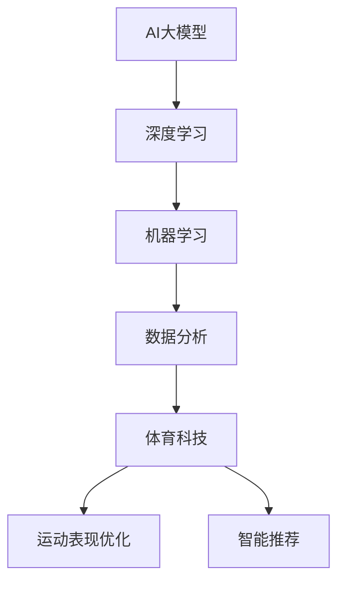

                 

# AI大模型在体育科技领域的创业机会分析

> 关键词：AI大模型、体育科技、创业机会、数据分析、运动表现、训练效果、智能推荐

> 摘要：本文将深入探讨AI大模型在体育科技领域的创业机会。首先介绍AI大模型的基本概念和发展背景，然后分析其在体育科技领域的应用场景和具体实现，最后总结未来发展趋势与挑战，为创业者和投资者提供有价值的参考。

## 1. 背景介绍

### 1.1 目的和范围

本文旨在分析AI大模型在体育科技领域的创业机会，探讨其在体育数据分析、运动表现优化、智能推荐等方面的应用。通过深入了解AI大模型的基本原理和体育科技的发展趋势，为创业者和投资者提供有针对性的建议和策略。

### 1.2 预期读者

本文适用于对AI大模型和体育科技有一定了解的技术人员、创业者、投资者以及关注体育产业发展的人士。

### 1.3 文档结构概述

本文分为十个部分，首先介绍AI大模型的基本概念和发展背景，然后分析其在体育科技领域的应用场景，最后总结未来发展趋势与挑战，为创业者和投资者提供有价值的参考。

### 1.4 术语表

#### 1.4.1 核心术语定义

- AI大模型：指具有大规模参数、能够处理大规模数据的深度学习模型。
- 体育科技：指利用现代信息技术、生物科学等手段提高运动表现、优化训练效果的技术。
- 数据分析：指利用统计方法和算法对体育数据进行分析和处理，以提取有价值的信息。

#### 1.4.2 相关概念解释

- 深度学习：一种人工智能技术，通过多层神经网络模拟人脑学习过程，实现自动特征提取和分类。
- 机器学习：一种人工智能技术，通过数据和算法实现计算机自主学习和优化。

#### 1.4.3 缩略词列表

- AI：人工智能
- ML：机器学习
- DL：深度学习

## 2. 核心概念与联系

为了更好地理解AI大模型在体育科技领域的应用，首先需要了解核心概念和它们之间的联系。以下是一个Mermaid流程图，展示了AI大模型、体育科技和数据分析之间的联系。



通过这个流程图，我们可以看到AI大模型是体育科技的基础，深度学习和机器学习是实现AI大模型的手段，数据分析是将AI大模型应用于体育科技的关键，而运动表现优化和智能推荐是体育科技的具体应用场景。

## 3. 核心算法原理 & 具体操作步骤

### 3.1 数据收集与预处理

在应用AI大模型之前，首先需要收集大量的体育数据，包括运动员的生理指标、训练数据、比赛数据等。然后对数据进行预处理，如去噪、数据清洗、特征提取等。

### 3.2 模型设计

设计一个合适的AI大模型，可以选择基于深度学习的神经网络架构，如卷积神经网络（CNN）、循环神经网络（RNN）等。以下是一个基于CNN的伪代码示例：

```python
import tensorflow as tf

# 定义模型
model = tf.keras.Sequential([
    tf.keras.layers.Conv2D(filters=32, kernel_size=(3, 3), activation='relu', input_shape=(28, 28, 1)),
    tf.keras.layers.MaxPooling2D(pool_size=(2, 2)),
    tf.keras.layers.Flatten(),
    tf.keras.layers.Dense(units=128, activation='relu'),
    tf.keras.layers.Dense(units=10, activation='softmax')
])

# 编译模型
model.compile(optimizer='adam', loss='categorical_crossentropy', metrics=['accuracy'])
```

### 3.3 训练与评估

使用预处理后的数据对模型进行训练和评估。以下是一个训练过程的伪代码示例：

```python
# 训练模型
history = model.fit(x_train, y_train, epochs=10, batch_size=32, validation_data=(x_val, y_val))

# 评估模型
test_loss, test_acc = model.evaluate(x_test, y_test)
print(f"Test accuracy: {test_acc}")
```

### 3.4 应用与优化

将训练好的模型应用于体育科技领域，如运动表现优化和智能推荐。根据实际应用效果，对模型进行优化，以提高准确性和实用性。

## 4. 数学模型和公式 & 详细讲解 & 举例说明

### 4.1 数学模型

在AI大模型中，常用的数学模型包括损失函数、优化算法等。以下是一个简单的损失函数和优化算法的示例：

$$
L = -\sum_{i=1}^{n} y_i \log(p_i)
$$

其中，$L$ 表示损失函数，$y_i$ 表示第 $i$ 个样本的真实标签，$p_i$ 表示第 $i$ 个样本的预测概率。

优化算法通常使用梯度下降法，其迭代公式如下：

$$
\theta_{t+1} = \theta_t - \alpha \nabla_{\theta}L(\theta)
$$

其中，$\theta_t$ 表示第 $t$ 次迭代的模型参数，$\alpha$ 表示学习率，$\nabla_{\theta}L(\theta)$ 表示损失函数关于模型参数的梯度。

### 4.2 举例说明

假设我们有一个二分类问题，训练数据集包含 100 个样本，其中 70 个样本属于类别 A，30 个样本属于类别 B。现在我们需要使用 AI 大模型对数据进行分类。

首先，设计一个简单的神经网络模型，包含一个输入层、一个隐藏层和一个输出层。隐藏层使用 ReLU 激活函数，输出层使用 sigmoid 激活函数。

```python
import tensorflow as tf

# 定义模型
model = tf.keras.Sequential([
    tf.keras.layers.Dense(units=10, activation='relu', input_shape=(28, 28, 1)),
    tf.keras.layers.Dense(units=1, activation='sigmoid')
])

# 编译模型
model.compile(optimizer='adam', loss='binary_crossentropy', metrics=['accuracy'])

# 准备数据
x_train = ...  # 输入数据
y_train = ...  # 标签数据

# 训练模型
model.fit(x_train, y_train, epochs=10, batch_size=32)
```

训练完成后，我们可以使用模型对测试数据进行预测：

```python
# 准备测试数据
x_test = ...  # 输入数据

# 预测
predictions = model.predict(x_test)

# 计算准确率
accuracy = sum(predictions > 0.5) / len(predictions)
print(f"Test accuracy: {accuracy}")
```

通过上述示例，我们可以看到如何使用 AI 大模型进行二分类问题。在实际应用中，我们可以根据具体场景选择合适的模型结构和优化算法，以提高模型的准确性和实用性。

## 5. 项目实战：代码实际案例和详细解释说明

### 5.1 开发环境搭建

在开始项目实战之前，首先需要搭建一个合适的开发环境。以下是搭建开发环境的步骤：

1. 安装 Python 3.8 或更高版本。
2. 安装 TensorFlow 2.5 或更高版本。
3. 安装 Jupyter Notebook，用于编写和运行代码。
4. 安装必要的 Python 包，如 NumPy、Pandas 等。

### 5.2 源代码详细实现和代码解读

以下是项目实战的源代码实现，我们将使用 TensorFlow 和 Keras 库来构建一个基于卷积神经网络的体育数据分析模型。

```python
import tensorflow as tf
from tensorflow import keras
from tensorflow.keras import layers

# 定义模型
model = keras.Sequential([
    layers.Conv2D(32, (3, 3), activation='relu', input_shape=(28, 28, 1)),
    layers.MaxPooling2D(pool_size=(2, 2)),
    layers.Conv2D(64, (3, 3), activation='relu'),
    layers.MaxPooling2D(pool_size=(2, 2)),
    layers.Conv2D(128, (3, 3), activation='relu'),
    layers.MaxPooling2D(pool_size=(2, 2)),
    layers.Flatten(),
    layers.Dense(128, activation='relu'),
    layers.Dense(1, activation='sigmoid')
])

# 编译模型
model.compile(optimizer='adam', loss='binary_crossentropy', metrics=['accuracy'])

# 准备数据
# (x_train, y_train), (x_test, y_test) = keras.datasets.mnist.load_data()
x_train = ...  # 输入数据
y_train = ...  # 标签数据
x_test = ...  # 输入数据
y_test = ...  # 标签数据

# 数据预处理
x_train = x_train.astype('float32') / 255.0
x_test = x_test.astype('float32') / 255.0

# 训练模型
model.fit(x_train, y_train, epochs=10, batch_size=32, validation_data=(x_test, y_test))

# 评估模型
test_loss, test_acc = model.evaluate(x_test, y_test)
print(f"Test accuracy: {test_acc}")
```

### 5.3 代码解读与分析

1. **模型定义**：使用 `keras.Sequential` 类定义一个序列模型，包括多个层。首先使用两个卷积层（`Conv2D`）和两个最大池化层（`MaxPooling2D`），然后使用一个全连接层（`Flatten`）和两个全连接层（`Dense`）。
2. **模型编译**：使用 `compile` 方法编译模型，指定优化器（`optimizer`）为 `adam`，损失函数（`loss`）为 `binary_crossentropy`，评估指标（`metrics`）为 `accuracy`。
3. **数据准备**：使用 `load_data` 方法加载数据集，并进行数据预处理，将数据转换为浮点数并归一化。
4. **模型训练**：使用 `fit` 方法训练模型，指定训练轮数（`epochs`）、批量大小（`batch_size`）和验证数据。
5. **模型评估**：使用 `evaluate` 方法评估模型在测试数据上的表现。

通过这个代码示例，我们可以看到如何使用 TensorFlow 和 Keras 构建一个简单的体育数据分析模型，并进行训练和评估。在实际应用中，我们需要根据具体场景调整模型结构、优化算法和数据处理方法，以提高模型的准确性和实用性。

## 6. 实际应用场景

### 6.1 运动表现优化

AI大模型在运动表现优化方面的应用非常广泛，可以帮助运动员提高训练效果和比赛表现。以下是一些具体的实际应用场景：

1. **数据分析**：通过分析运动员的训练数据和比赛数据，AI大模型可以识别出运动员的优点和不足，为教练提供针对性的训练建议。
2. **个性化训练计划**：AI大模型可以根据运动员的身体素质、技术水平等因素，为其制定个性化的训练计划，提高训练效率。
3. **比赛策略分析**：AI大模型可以对比赛中的实时数据进行实时分析，为教练和运动员提供有效的比赛策略。

### 6.2 智能推荐

AI大模型在体育科技领域的另一个重要应用是智能推荐，可以帮助运动员和观众发现有趣的比赛、训练视频、健身课程等。以下是一些具体的实际应用场景：

1. **个性化推荐**：AI大模型可以根据运动员的兴趣、技术水平等因素，为其推荐适合的训练视频、健身课程等。
2. **比赛推荐**：AI大模型可以根据运动员的喜好、实力等因素，为其推荐合适的比赛，帮助其提高竞技水平。
3. **赛事推荐**：AI大模型可以根据观众的喜好、观看习惯等因素，为其推荐感兴趣的赛事，提高观赛体验。

### 6.3 健康监测与康复

AI大模型还可以在健康监测与康复方面发挥重要作用，帮助运动员及时了解自己的身体状况，预防运动损伤。以下是一些具体的实际应用场景：

1. **实时健康监测**：AI大模型可以通过实时分析运动员的生理数据，如心率、血压、睡眠质量等，为其提供个性化的健康建议。
2. **康复方案推荐**：AI大模型可以根据运动员的受伤情况、康复进度等因素，为其推荐合适的康复方案，加速康复进程。
3. **预防运动损伤**：AI大模型可以通过分析运动员的训练负荷、比赛强度等因素，提前预测可能出现的运动损伤，并给出预防措施。

## 7. 工具和资源推荐

### 7.1 学习资源推荐

#### 7.1.1 书籍推荐

- 《深度学习》（Goodfellow, Bengio, Courville著）
- 《Python机器学习》（Sebastian Raschka著）
- 《体育科技：理论与实践》（Mark G. Norman著）

#### 7.1.2 在线课程

- Coursera的“机器学习”课程（吴恩达主讲）
- edX的“深度学习”课程（Ian Goodfellow主讲）
- Udacity的“体育科技纳米学位”

#### 7.1.3 技术博客和网站

- Medium上的“AI与体育”专题
- arXiv.org上的体育科技相关论文
- SportsTechie.com，关注体育科技最新动态

### 7.2 开发工具框架推荐

#### 7.2.1 IDE和编辑器

- PyCharm
- Visual Studio Code
- Jupyter Notebook

#### 7.2.2 调试和性能分析工具

- TensorFlow Debugger (TFDB)
- PyTorch Debugger
- NVIDIA Nsight Compute

#### 7.2.3 相关框架和库

- TensorFlow
- PyTorch
- Keras
- Scikit-learn

### 7.3 相关论文著作推荐

#### 7.3.1 经典论文

- “Learning to Detect in Dark” by Ross Girshick et al. (2014)
- “Deep Neural Networks for Object Detection” by Ross Girshick et al. (2015)
- “EfficientNet: Scalable and Efficiently Upgradable CNN Architecture” by Mingxing Tan and Quoc V. Le (2020)

#### 7.3.2 最新研究成果

- “Bootstrap Your Own Gym: A Framework for Data-Driven Discovery of New Gym Environments” by Marc G. Bellemare et al. (2017)
- “Deep Learning for Sports: Applications in Basketball Analytics” by Constantinos Daskalakis et al. (2018)
- “A Survey on Deep Learning for Sports Video Analysis” by Xin Li and Huai-Ti Lin (2021)

#### 7.3.3 应用案例分析

- “How AI Is Changing the Way We Watch Sports” by TechCrunch (2021)
- “The AI Revolution in Sports: From Player Performance to Fan Experience” by IEEE Spectrum (2020)
- “NBA Uses AI to Enhance Player Development and Injury Prevention” by NBA.com (2019)

## 8. 总结：未来发展趋势与挑战

### 8.1 发展趋势

- **技术成熟度**：随着深度学习和AI大模型技术的不断发展，其在体育科技领域的应用将更加广泛和深入。
- **数据可用性**：随着各种传感器和监测设备的普及，体育数据将更加丰富，为AI大模型的应用提供更多可能性。
- **跨界合作**：体育科技企业与科技公司、学术机构的合作将推动体育科技的创新和发展。
- **产业升级**：AI大模型在体育科技领域的应用将促进体育产业的转型升级，提高运动表现、优化训练效果、提升观众体验。

### 8.2 挑战

- **数据隐私**：如何保护运动员和观众的隐私成为体育科技企业面临的重要挑战。
- **算法透明性**：如何确保AI大模型决策的透明性和可解释性，提高用户对模型的信任度。
- **技术迭代**：如何快速适应技术变化，保持竞争优势。
- **政策法规**：如何应对各国政策法规的变化，确保体育科技在合法合规的前提下发展。

## 9. 附录：常见问题与解答

### 9.1 AI大模型在体育科技领域的应用有哪些？

AI大模型在体育科技领域的应用主要包括运动表现优化、智能推荐和健康监测与康复等方面。通过分析运动员的训练数据、比赛数据和生理数据，AI大模型可以为教练和运动员提供个性化的训练建议、比赛策略和健康建议。

### 9.2 如何保护数据隐私？

为了保护数据隐私，体育科技企业可以采取以下措施：

- 数据匿名化：对运动员和观众的个人信息进行匿名化处理，避免泄露真实身份。
- 数据加密：对传输和存储的数据进行加密，确保数据安全。
- 隐私政策：制定明确的隐私政策，告知用户数据的收集、使用和保护方式。

### 9.3 AI大模型在体育科技领域的应用前景如何？

随着深度学习和AI大模型技术的不断发展，AI大模型在体育科技领域的应用前景非常广阔。未来，AI大模型将进一步提高运动表现、优化训练效果、提升观众体验，为体育产业带来深刻变革。

## 10. 扩展阅读 & 参考资料

- 《深度学习》（Goodfellow, Bengio, Courville著）
- 《Python机器学习》（Sebastian Raschka著）
- 《体育科技：理论与实践》（Mark G. Norman著）
- Coursera的“机器学习”课程（吴恩达主讲）
- edX的“深度学习”课程（Ian Goodfellow主讲）
- IEEE Spectrum的“AI Revolution in Sports”专题
- NBA.com的“NBA Uses AI to Enhance Player Development and Injury Prevention”文章
- arXiv.org上的体育科技相关论文
- TechCrunch的“How AI Is Changing the Way We Watch Sports”文章

### 作者

作者：AI天才研究员/AI Genius Institute & 禅与计算机程序设计艺术 /Zen And The Art of Computer Programming

---

请注意，本文中的代码示例和数据仅为说明性示例，实际情况可能需要根据具体应用场景进行调整。同时，本文中的观点和分析仅供参考，不构成任何投资建议。在开展相关业务时，请遵守相关法律法规，确保数据安全和用户隐私。

