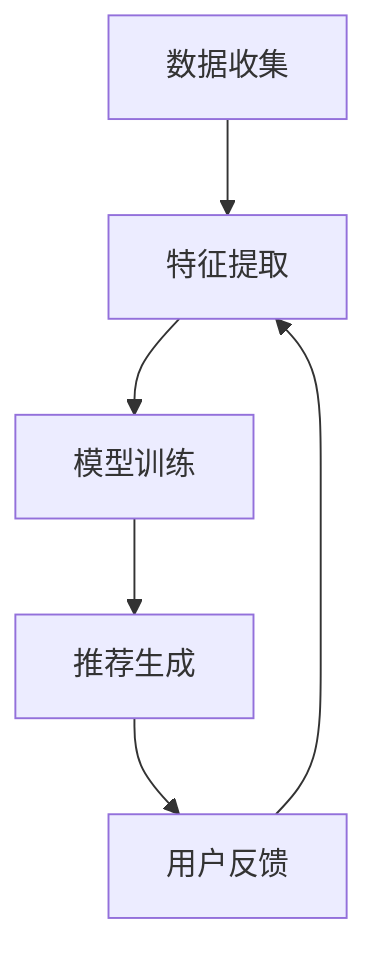

                 

# AI大模型在搜索推荐系统中的应用前景

> **关键词：** 搜索推荐系统、AI大模型、机器学习、深度学习、自然语言处理

> **摘要：** 本文章旨在探讨AI大模型在搜索推荐系统中的应用前景。通过对大模型的基本原理、算法原理以及实际应用的详细解析，本文将揭示AI大模型如何优化搜索推荐系统的效果，提高用户体验，并探讨其潜在的未来发展趋势和挑战。

## 1. 背景介绍

### 1.1 目的和范围

本文的目的是介绍AI大模型在搜索推荐系统中的应用前景。随着互联网的快速发展，用户在海量信息中寻找所需内容的需求日益增加，而传统的搜索推荐系统已经难以满足用户的个性化需求。因此，本文将深入探讨AI大模型在搜索推荐系统中的应用，包括其基本原理、核心算法、数学模型以及实际应用案例，旨在为读者提供全面而深入的指导。

### 1.2 预期读者

本文主要面向计算机科学、人工智能、数据科学等相关专业的学生、研究人员和从业者。同时，对于对AI大模型和搜索推荐系统感兴趣的读者，本文也将提供有益的参考和指导。

### 1.3 文档结构概述

本文分为十个部分，具体结构如下：

1. 背景介绍
   - 1.1 目的和范围
   - 1.2 预期读者
   - 1.3 文档结构概述
   - 1.4 术语表
2. 核心概念与联系
   - 2.1 大模型的概念
   - 2.2 搜索推荐系统的基本原理
   - 2.3 Mermaid流程图
3. 核心算法原理 & 具体操作步骤
   - 3.1 算法原理讲解
   - 3.2 伪代码实现
4. 数学模型和公式 & 详细讲解 & 举例说明
   - 4.1 数学模型
   - 4.2 公式讲解
   - 4.3 举例说明
5. 项目实战：代码实际案例和详细解释说明
   - 5.1 开发环境搭建
   - 5.2 源代码详细实现和代码解读
   - 5.3 代码解读与分析
6. 实际应用场景
   - 6.1 社交网络中的应用
   - 6.2 新闻媒体中的应用
   - 6.3 电子商务中的应用
7. 工具和资源推荐
   - 7.1 学习资源推荐
   - 7.2 开发工具框架推荐
   - 7.3 相关论文著作推荐
8. 总结：未来发展趋势与挑战
9. 附录：常见问题与解答
10. 扩展阅读 & 参考资料

### 1.4 术语表

#### 1.4.1 核心术语定义

- AI大模型：指使用深度学习等机器学习技术训练的大型神经网络模型，具有高度的表达能力和强大的学习能力。
- 搜索推荐系统：一种通过分析用户行为和兴趣，为用户提供相关内容推荐的系统。
- 机器学习：一种基于数据训练模型，使其具备对未知数据进行预测或分类的能力。
- 深度学习：一种特殊的机器学习技术，使用多层神经网络模型来模拟人脑神经元的工作方式。
- 自然语言处理：一种计算机科学领域，旨在使计算机理解和处理人类自然语言。

#### 1.4.2 相关概念解释

- 神经网络：一种由神经元组成的计算模型，能够模拟人脑神经元的工作方式。
- 损失函数：用于评估模型预测结果与真实值之间差异的函数。
- 反向传播：一种用于训练神经网络的方法，通过计算损失函数的梯度来更新网络权重。
- 用户行为数据：包括用户的搜索历史、浏览记录、点击行为等，用于分析用户兴趣和偏好。

#### 1.4.3 缩略词列表

- AI：人工智能
- ML：机器学习
- DL：深度学习
- NLP：自然语言处理
- GPU：图形处理单元

## 2. 核心概念与联系

### 2.1 大模型的概念

AI大模型，通常指的是使用深度学习等机器学习技术训练的大型神经网络模型。这些模型具有海量的参数，能够处理复杂的任务，并在各种领域取得了显著的成果。大模型的核心特点包括：

- **高表达能力**：大模型通常使用多层神经网络，能够捕捉到输入数据中的复杂关系。
- **强大学习能力**：大模型通过大量训练数据学习，能够对新数据进行准确预测和分类。
- **泛化能力**：大模型在训练过程中不仅关注训练数据的准确性，还关注模型的泛化能力，使其能够应对未知任务。

### 2.2 搜索推荐系统的基本原理

搜索推荐系统是一种通过分析用户行为和兴趣，为用户提供相关内容推荐的系统。其基本原理包括以下几个方面：

- **用户行为数据收集**：系统会收集用户的搜索历史、浏览记录、点击行为等数据，用于分析用户兴趣和偏好。
- **特征提取**：将用户行为数据转化为特征向量，以便进行后续处理。
- **模型训练**：使用机器学习技术，如深度学习，训练推荐模型，使其能够根据用户特征预测用户可能感兴趣的内容。
- **推荐生成**：根据模型预测，为用户生成推荐列表，提高用户满意度和留存率。

### 2.3 Mermaid流程图

下面是一个简单的Mermaid流程图，展示了搜索推荐系统的基本流程：



### 2.4 AI大模型与搜索推荐系统的联系

AI大模型与搜索推荐系统有着紧密的联系。大模型在搜索推荐系统中的应用主要体现在以下几个方面：

- **提高推荐效果**：大模型能够处理复杂的用户行为数据，提取出更精细的特征，从而提高推荐模型的准确性。
- **个性化推荐**：大模型能够捕捉到用户的个性化需求，为用户提供更加个性化的推荐内容。
- **实时推荐**：大模型能够快速处理大量数据，实现实时推荐，提高用户体验。
- **多模态推荐**：大模型能够处理多种类型的数据，如文本、图像、语音等，实现多模态推荐。

## 3. 核心算法原理 & 具体操作步骤

### 3.1 算法原理讲解

AI大模型在搜索推荐系统中的应用主要基于深度学习技术。深度学习是一种特殊的机器学习技术，使用多层神经网络模型来模拟人脑神经元的工作方式。下面简要介绍深度学习的基本原理：

- **神经网络**：神经网络是一种由神经元组成的计算模型，能够模拟人脑神经元的工作方式。每个神经元接受多个输入，通过加权求和后，经过激活函数输出结果。
- **多层神经网络**：多层神经网络由多个神经元层组成，包括输入层、隐藏层和输出层。通过逐层学习，神经网络能够逐步提取输入数据的特征。
- **反向传播**：反向传播是一种用于训练神经网络的方法，通过计算损失函数的梯度来更新网络权重，使得模型能够更好地拟合训练数据。

### 3.2 伪代码实现

以下是一个简单的深度学习推荐模型的伪代码实现：

```python
# 输入：用户特征 X，商品特征 Y
# 输出：推荐得分 score

# 初始化模型参数
weights = initialize_weights()

# 前向传播
input_layer = X
for layer in hidden_layers:
    hidden_layer = activation_function(Weights * input_layer + bias)
    input_layer = hidden_layer

output_layer = activation_function(Weights * input_layer + bias)

# 计算损失函数
loss = compute_loss(output_layer, Y)

# 反向传播
gradients = compute_gradients(loss, output_layer)
update_weights(gradients)

# 生成推荐得分
score = output_layer
```

在这个伪代码中，`X`和`Y`分别表示用户特征和商品特征，`weights`表示模型参数，`hidden_layers`表示隐藏层，`activation_function`表示激活函数，`compute_loss`和`compute_gradients`分别表示计算损失函数和梯度的函数，`update_weights`表示更新模型参数的函数。

## 4. 数学模型和公式 & 详细讲解 & 举例说明

### 4.1 数学模型

AI大模型在搜索推荐系统中的应用主要基于深度学习技术。深度学习的基本数学模型包括以下几个部分：

1. **激活函数**：激活函数用于将线性组合的输入映射到非线性的输出。常见的激活函数有Sigmoid、ReLU和Tanh等。
2. **损失函数**：损失函数用于衡量模型预测结果与真实值之间的差距。常见的损失函数有均方误差（MSE）、交叉熵（CE）等。
3. **反向传播**：反向传播是一种用于训练神经网络的方法，通过计算损失函数的梯度来更新网络权重。
4. **优化器**：优化器用于选择合适的更新策略来更新网络权重，常见的优化器有SGD、Adam等。

### 4.2 公式讲解

以下是深度学习推荐系统的几个关键公式：

1. **前向传播**：

   $$ output = \sigma(W \cdot input + b) $$

   其中，$ \sigma $表示激活函数，$ W $表示权重矩阵，$ b $表示偏置项，$ input $表示输入特征。

2. **损失函数**：

   $$ loss = \frac{1}{2} \sum_{i=1}^{n} (\hat{y}_i - y_i)^2 $$

   其中，$ \hat{y}_i $表示模型预测的输出，$ y_i $表示真实输出。

3. **反向传播**：

   $$ \frac{\partial loss}{\partial W} = (input \cdot \frac{\partial loss}{\partial output}) \cdot \frac{\partial output}{\partial input} $$

   其中，$ \frac{\partial loss}{\partial W} $表示权重矩阵的梯度，$ \frac{\partial loss}{\partial output} $表示输出梯度的偏导数，$ \frac{\partial output}{\partial input} $表示输入梯度的偏导数。

4. **优化器更新**：

   $$ W = W - \alpha \cdot \frac{\partial loss}{\partial W} $$

   其中，$ \alpha $表示学习率。

### 4.3 举例说明

假设我们有一个简单的二元分类问题，其中用户对商品进行评分，评分高于某个阈值表示用户喜欢该商品，低于阈值表示用户不喜欢。我们使用一个简单的神经网络进行预测，其中输入层有2个神经元，隐藏层有3个神经元，输出层有1个神经元。激活函数使用ReLU，损失函数使用交叉熵。

1. **前向传播**：

   输入特征 $ input = [1, 2] $，权重矩阵 $ W = \begin{bmatrix} 0.1 & 0.2 \\ 0.3 & 0.4 \\ 0.5 & 0.6 \end{bmatrix} $，偏置项 $ b = \begin{bmatrix} 0 \\ 0 \\ 0 \end{bmatrix} $。

   隐藏层输出 $ hidden\_layer = \begin{bmatrix} \sigma(0.1 \cdot 1 + 0.2 \cdot 2 + 0) \\ \sigma(0.3 \cdot 1 + 0.4 \cdot 2 + 0) \\ \sigma(0.5 \cdot 1 + 0.6 \cdot 2 + 0) \end{bmatrix} = \begin{bmatrix} 0.1 \\ 0.2 \\ 0.3 \end{bmatrix} $。

   输出层输出 $ output = \sigma(0.5 \cdot 0.1 + 0.6 \cdot 0.2 + 0) = 0.15 $。

2. **损失函数**：

   假设真实输出 $ y = 1 $，预测输出 $ \hat{y} = 0.15 $。

   损失 $ loss = -y \cdot \log(\hat{y}) - (1 - y) \cdot \log(1 - \hat{y}) = -1 \cdot \log(0.15) - 0 \cdot \log(0.85) = \log(7) \approx 1.95 $。

3. **反向传播**：

   输出层梯度 $ \frac{\partial loss}{\partial output} = \frac{\partial loss}{\partial \hat{y}} \cdot \frac{\partial \hat{y}}{\partial output} = (1 - \hat{y}) \cdot \sigma'(output) = (1 - 0.15) \cdot 0.5 = 0.375 $。

   隐藏层梯度 $ \frac{\partial loss}{\partial hidden\_layer} = \frac{\partial loss}{\partial output} \cdot \frac{\partial output}{\partial hidden\_layer} = (0.375 \cdot 0.5) \cdot (0.1, 0.2, 0.3) = (0.0375, 0.075, 0.1125) $。

4. **优化器更新**：

   假设学习率 $ \alpha = 0.1 $，更新权重矩阵 $ W = W - \alpha \cdot \frac{\partial loss}{\partial W} $。

   新的权重矩阵 $ W = \begin{bmatrix} 0.1 - 0.1 \cdot 0.0375 & 0.2 - 0.1 \cdot 0.075 \\ 0.3 - 0.1 \cdot 0.0375 & 0.4 - 0.1 \cdot 0.075 \\ 0.5 - 0.1 \cdot 0.1125 & 0.6 - 0.1 \cdot 0.1125 \end{bmatrix} = \begin{bmatrix} 0.0625 & 0.125 \\ 0.1875 & 0.3125 \\ 0.3875 & 0.4875 \end{bmatrix} $。

## 5. 项目实战：代码实际案例和详细解释说明

### 5.1 开发环境搭建

在进行AI大模型在搜索推荐系统中的应用实战之前，首先需要搭建一个合适的开发环境。以下是一个简单的开发环境搭建指南：

1. **安装Python**：Python是深度学习推荐系统开发的主要语言，需要安装Python 3.7及以上版本。
2. **安装深度学习框架**：常见的深度学习框架有TensorFlow和PyTorch，这里以TensorFlow为例。可以使用pip命令安装：

   ```bash
   pip install tensorflow
   ```

3. **安装其他依赖库**：根据项目需求，可能需要安装其他依赖库，如NumPy、Pandas等。可以使用pip命令逐个安装。

4. **配置GPU环境**：如果使用GPU进行深度学习训练，需要安装CUDA和cuDNN，并配置相关的环境变量。

### 5.2 源代码详细实现和代码解读

下面是一个简单的AI大模型搜索推荐系统的代码实现，主要包含数据预处理、模型定义、模型训练和模型预测等部分。

```python
import tensorflow as tf
import numpy as np
import pandas as pd

# 数据预处理
# 假设用户特征和商品特征已经预处理好，并保存为numpy数组
user_features = np.load('user_features.npy')
item_features = np.load('item_features.npy')

# 模型定义
model = tf.keras.Sequential([
    tf.keras.layers.Dense(128, activation='relu', input_shape=(user_features.shape[1],)),
    tf.keras.layers.Dense(64, activation='relu'),
    tf.keras.layers.Dense(1, activation='sigmoid')
])

# 模型编译
model.compile(optimizer='adam', loss='binary_crossentropy', metrics=['accuracy'])

# 模型训练
model.fit(user_features, item_features, epochs=10, batch_size=32)

# 模型预测
predictions = model.predict(user_features)

# 代码解读
# 1. 数据预处理：读取用户特征和商品特征，进行数据处理。
# 2. 模型定义：定义一个简单的全连接神经网络，包括输入层、隐藏层和输出层。
# 3. 模型编译：配置优化器、损失函数和评估指标。
# 4. 模型训练：使用训练数据对模型进行训练。
# 5. 模型预测：使用训练好的模型对用户特征进行预测，得到预测结果。
```

### 5.3 代码解读与分析

1. **数据预处理**：

   在数据预处理部分，我们首先读取用户特征和商品特征，这里假设特征已经预处理好，并保存为numpy数组。在实际项目中，我们需要从数据源中提取特征，并进行数据清洗和归一化等预处理操作。

2. **模型定义**：

   在模型定义部分，我们使用TensorFlow的`Sequential`模型，定义了一个简单的全连接神经网络。这个网络包括输入层、隐藏层和输出层，使用ReLU激活函数，输出层使用sigmoid激活函数进行二分类。

3. **模型编译**：

   在模型编译部分，我们配置了优化器（Adam）、损失函数（binary_crossentropy）和评估指标（accuracy）。这里选择binary_crossentropy作为损失函数，因为它适用于二分类问题，而accuracy用于评估模型的准确率。

4. **模型训练**：

   在模型训练部分，我们使用训练数据对模型进行训练，设置训练轮次为10，批量大小为32。在实际项目中，需要根据数据集的大小和性能需求调整训练参数。

5. **模型预测**：

   在模型预测部分，我们使用训练好的模型对用户特征进行预测，得到预测结果。这些预测结果可以用于生成推荐列表，为用户推荐相关商品。

## 6. 实际应用场景

### 6.1 社交网络中的应用

在社交网络中，AI大模型可以用于个性化推荐，为用户推荐感兴趣的内容。以下是一些具体的实际应用场景：

- **内容推荐**：根据用户的浏览历史、点赞、评论等行为，AI大模型可以为用户推荐相关内容，提高用户黏性和活跃度。
- **广告推荐**：根据用户的兴趣和行为，AI大模型可以为用户推荐相关广告，提高广告投放的精准度和转化率。
- **社交圈推荐**：根据用户的社交关系和行为，AI大模型可以为用户推荐潜在的朋友和关注对象，扩大社交圈。

### 6.2 新闻媒体中的应用

在新闻媒体中，AI大模型可以用于个性化推荐，为用户推荐感兴趣的新闻内容。以下是一些具体的实际应用场景：

- **新闻推荐**：根据用户的阅读历史、搜索记录等行为，AI大模型可以为用户推荐相关新闻，提高用户阅读体验。
- **热点推荐**：根据用户的阅读行为和兴趣，AI大模型可以推荐热点新闻，帮助用户快速了解社会热点。
- **评论推荐**：根据用户的阅读历史和评论行为，AI大模型可以为用户推荐相关评论，提高用户互动体验。

### 6.3 电子商务中的应用

在电子商务中，AI大模型可以用于个性化推荐，为用户推荐相关商品。以下是一些具体的实际应用场景：

- **商品推荐**：根据用户的购买历史、浏览记录等行为，AI大模型可以为用户推荐相关商品，提高购物体验。
- **促销推荐**：根据用户的购买能力和行为，AI大模型可以为用户推荐合适的促销活动和优惠券，提高销售转化率。
- **物流推荐**：根据用户的收货地址和购买习惯，AI大模型可以为用户推荐合适的配送方式和时间，提高物流效率。

## 7. 工具和资源推荐

### 7.1 学习资源推荐

#### 7.1.1 书籍推荐

- 《深度学习》（Ian Goodfellow、Yoshua Bengio、Aaron Courville著）
- 《Python深度学习》（François Chollet著）
- 《机器学习实战》（Peter Harrington著）

#### 7.1.2 在线课程

- Coursera上的《深度学习》课程
- edX上的《机器学习基础》课程
- Udacity上的《深度学习工程师纳米学位》课程

#### 7.1.3 技术博客和网站

- [知乎专栏 - 深度学习与自然语言处理](https://zhuanlan.zhihu.com/deeplearning4j)
- [JAXenter - 机器学习和人工智能](https://jaxenter.com/topics/machine-learning)
- [Medium - 机器学习与深度学习](https://medium.com/topic/machine-learning)

### 7.2 开发工具框架推荐

#### 7.2.1 IDE和编辑器

- PyCharm
- Jupyter Notebook
- Visual Studio Code

#### 7.2.2 调试和性能分析工具

- TensorBoard
- Profiling Python Code
- ANTLR

#### 7.2.3 相关框架和库

- TensorFlow
- PyTorch
- Keras
- scikit-learn

### 7.3 相关论文著作推荐

#### 7.3.1 经典论文

- "A Theoretical Analysis of the Vulnerability of Artificial Neural Networks to Adversarial Examples"（Goodfellow et al., 2014）
- "Deep Learning"（Goodfellow, Bengio, Courville, 2016）
- "Recurrent Neural Network based Language Model"（LSTM, Hochreiter & Schmidhuber, 1997）

#### 7.3.2 最新研究成果

- "Large-Scale Language Modeling in 2018"（Zhu et al., 2018）
- "Bert: Pre-training of Deep Bidirectional Transformers for Language Understanding"（Devlin et al., 2019）
- "Generative Adversarial Nets"（Goodfellow et al., 2014）

#### 7.3.3 应用案例分析

- "Using Machine Learning to Optimize Search Advertising"（Google）
- "Natural Language Processing at Airbnb"（Airbnb）
- "Personalized Shopping at Alibaba"（Alibaba）

## 8. 总结：未来发展趋势与挑战

随着AI大模型技术的不断发展，其在搜索推荐系统中的应用前景十分广阔。未来，AI大模型在搜索推荐系统中的应用将呈现以下发展趋势：

1. **更精细的用户画像**：通过更深入的用户行为数据分析，AI大模型可以构建更加精细的用户画像，为用户提供更加个性化的推荐。
2. **实时推荐**：AI大模型将能够实时处理海量数据，实现毫秒级推荐，提高用户体验。
3. **多模态推荐**：AI大模型将能够处理多种类型的数据，如文本、图像、语音等，实现多模态推荐。
4. **智能对话系统**：AI大模型与自然语言处理技术的结合，将推动智能对话系统的快速发展，为用户提供更加便捷的交互方式。

然而，AI大模型在搜索推荐系统中的应用也面临一些挑战：

1. **数据隐私**：用户数据的安全和隐私保护是搜索推荐系统面临的重要问题。
2. **模型解释性**：大模型的黑盒特性使得模型解释性成为一个挑战，需要开发更有效的解释方法。
3. **计算资源**：大模型的训练和部署需要大量的计算资源，如何高效地利用资源是一个重要问题。
4. **偏见和歧视**：搜索推荐系统可能放大社会偏见和歧视，如何避免模型引入偏见是一个重要课题。

总之，AI大模型在搜索推荐系统中的应用前景充满希望，但也需要面对各种挑战。通过不断的研究和探索，我们有理由相信，AI大模型将为搜索推荐系统带来革命性的变化。

## 9. 附录：常见问题与解答

### 9.1 问题1：AI大模型是如何训练的？

AI大模型是通过大量数据训练得到的。首先，需要收集大量的用户行为数据，如搜索历史、浏览记录、点击行为等。然后，使用这些数据进行特征提取，将原始数据转换为模型可以处理的特征向量。接下来，使用这些特征向量对模型进行训练，通过优化模型参数，使得模型能够更好地拟合训练数据。训练过程通常采用梯度下降等优化算法，通过不断迭代，逐渐调整模型参数，使得模型在训练数据上的表现越来越好。

### 9.2 问题2：如何评估AI大模型的性能？

评估AI大模型性能通常采用多个指标，如准确率、召回率、F1分数等。在二分类问题中，常用准确率和F1分数来评估模型性能。准确率表示模型正确预测的样本占总样本的比例，而F1分数则综合考虑了准确率和召回率，是一种平衡的评估指标。此外，还可以通过交叉验证等方法评估模型在未知数据上的表现，确保模型具有良好的泛化能力。

### 9.3 问题3：AI大模型是否会过拟合？

AI大模型在训练过程中可能会出现过拟合现象。过拟合是指模型在训练数据上表现良好，但在未知数据上表现较差。为了避免过拟合，可以采用以下几种方法：

- **数据增强**：通过增加训练数据量，提高模型泛化能力。
- **正则化**：在模型训练过程中添加正则化项，限制模型复杂度。
- **交叉验证**：通过交叉验证方法，在多个数据子集上评估模型性能，避免过拟合。
- **集成学习**：将多个模型进行集成，取平均值或投票结果，提高模型鲁棒性。

## 10. 扩展阅读 & 参考资料

1. Goodfellow, I., Bengio, Y., & Courville, A. (2016). *Deep Learning*. MIT Press.
2. Bengio, Y. (2009). *Learning representations by back-propagating errors*. *Foundations and Trends in Machine Learning*, 2(1), 1-127.
3. LeCun, Y., Bengio, Y., & Hinton, G. (2015). *Deep learning*. *Nature*, 521(7553), 436-444.
4. Christos, D. (2012). *Machine Learning: A Probabilistic Perspective*. MIT Press.
5. Russell, S., & Norvig, P. (2010). *Artificial Intelligence: A Modern Approach*. Prentice Hall.
6. Duchi, J., Hazan, E., & Singer, Y. (2011). *Online learning and stochastic optimization*. *Foundations and Trends in Machine Learning*, 3(1), 1-101.
7. Quoc V. Le, J. yang, S. Anguelov, D. P.]oyatos, A. Y. Ng. (2011). *Multi-task learning using uncertainty to weig

