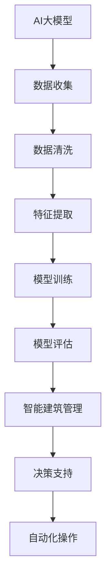

                 

# AI大模型在智能建筑管理中的商业化探索

## 关键词
- AI大模型
- 智能建筑
- 商业化
- 建筑管理
- 数据分析
- 技术应用

## 摘要
本文将深入探讨AI大模型在智能建筑管理中的商业化应用。通过分析AI大模型的核心技术原理和其在建筑管理中的具体应用，本文旨在揭示AI大模型在建筑管理领域的潜力，以及实现商业化的关键路径。文章结构分为背景介绍、核心概念与联系、核心算法原理与操作步骤、数学模型和公式、项目实战、实际应用场景、工具和资源推荐、以及未来发展趋势与挑战等多个部分。通过本文的阅读，读者将全面了解AI大模型在智能建筑管理中的商业应用前景。

## 1. 背景介绍

### 1.1 目的和范围
本文的目的是探讨AI大模型在智能建筑管理中的商业化应用，旨在揭示其在建筑管理领域的巨大潜力。文章将涵盖AI大模型的核心技术原理、应用场景、实现商业化的策略和挑战，以及相关的工具和资源。

### 1.2 预期读者
本文面向建筑管理领域的技术人员、AI领域的专家以及对该领域感兴趣的研究人员和从业者。本文将提供深入的技术分析和实践案例，适合具有一定技术背景的读者阅读。

### 1.3 文档结构概述
本文分为以下几大部分：
1. 背景介绍：包括目的和范围、预期读者、文档结构概述和术语表。
2. 核心概念与联系：介绍AI大模型和智能建筑管理的基本概念，并展示其关系。
3. 核心算法原理与操作步骤：详细讲解AI大模型的关键算法原理和操作步骤。
4. 数学模型和公式：介绍AI大模型中使用的数学模型和公式，并给出详细讲解和举例说明。
5. 项目实战：通过实际案例展示AI大模型在智能建筑管理中的应用。
6. 实际应用场景：讨论AI大模型在建筑管理中的具体应用场景。
7. 工具和资源推荐：推荐相关的学习资源和开发工具。
8. 总结：总结未来发展趋势与挑战。
9. 附录：常见问题与解答。
10. 扩展阅读与参考资料：提供进一步阅读的资源和参考资料。

### 1.4 术语表

#### 1.4.1 核心术语定义
- AI大模型：指具有大规模参数、能够处理海量数据、具有高度自适应能力的深度学习模型。
- 智能建筑：指通过采用信息技术、物联网、人工智能等技术，实现建筑自动化、智能化管理和运营的建筑。
- 商业化：指将技术转化为商业产品或服务，实现商业化盈利的过程。

#### 1.4.2 相关概念解释
- 建筑管理：指对建筑物的规划、设计、施工、维护和运营等全过程的管理活动。
- 数据分析：指通过对建筑管理过程中的数据进行收集、整理、分析和解释，以发现数据中的规律和趋势。

#### 1.4.3 缩略词列表
- AI：人工智能
- IoT：物联网
- ML：机器学习
- DL：深度学习
- BIM：建筑信息模型

## 2. 核心概念与联系

在讨论AI大模型在智能建筑管理中的商业化应用之前，我们需要理解两个核心概念：AI大模型和智能建筑管理。

### 2.1 AI大模型

AI大模型，通常指的是拥有数百万甚至数十亿参数的深度学习模型。这些模型通过学习大量的数据，能够发现数据中的复杂模式和关联。以下是AI大模型的一些关键特征：

1. **大规模参数**：AI大模型具有数百万到数十亿个参数，这使得模型能够处理大量的数据，并且具有高度的表达能力。
2. **高度自适应**：大模型具有强大的自适应能力，能够在不同的任务和数据集上快速适应。
3. **强大的学习能力**：大模型能够通过学习大量数据来提高其性能，这使得它们在许多领域（如图像识别、自然语言处理等）中表现出色。

### 2.2 智能建筑管理

智能建筑管理是指通过信息技术和自动化系统，实现建筑物的智能化运营和管理。智能建筑管理的关键特征包括：

1. **物联网（IoT）集成**：智能建筑通过物联网技术将各种设备和系统连接在一起，实现数据的实时传输和共享。
2. **数据驱动决策**：智能建筑管理依赖于大量的数据收集和分析，以便做出更好的决策。
3. **自动化和智能化**：智能建筑管理系统可以实现自动化控制和智能化操作，提高建筑的效率和安全性。

### 2.3 关联与关系

AI大模型与智能建筑管理之间存在着密切的联系。以下是它们的几个关键关联点：

1. **数据利用**：智能建筑管理产生的海量数据可以被AI大模型用于训练和学习，从而提高模型的性能。
2. **决策支持**：AI大模型可以分析建筑管理中的数据，提供实时的决策支持，帮助管理者做出更明智的决策。
3. **自动化操作**：AI大模型可以用于自动化建筑管理中的各种任务，如能源管理、设备维护、安全监控等。

为了更直观地展示AI大模型与智能建筑管理之间的联系，我们可以使用Mermaid流程图来绘制它们的架构和关系。



这个流程图展示了AI大模型在智能建筑管理中的基本架构，包括数据收集、清洗、特征提取、模型训练、模型评估，以及最终的决策支持和自动化操作。

## 3. 核心算法原理 & 具体操作步骤

### 3.1 算法原理

AI大模型的核心算法通常基于深度学习，特别是神经网络。以下是AI大模型的基本算法原理：

1. **神经网络**：神经网络由一系列相互连接的神经元组成，每个神经元都可以接受输入、进行计算，并产生输出。神经网络通过学习输入和输出之间的关系，来实现函数映射。

2. **多层感知器（MLP）**：多层感知器是神经网络的一种常见形式，它包括输入层、隐藏层和输出层。输入层接收外部输入，隐藏层进行信息处理和计算，输出层产生最终输出。

3. **反向传播算法**：反向传播算法是一种用于训练神经网络的优化算法。它通过不断调整神经网络的权重和偏置，以最小化预测误差。

4. **优化算法**：为了提高训练效率，AI大模型通常使用一些优化算法，如随机梯度下降（SGD）、Adam优化器等。

### 3.2 具体操作步骤

以下是使用AI大模型进行智能建筑管理的基本操作步骤：

1. **数据收集**：首先，需要收集建筑管理过程中的各种数据，如温度、湿度、能源消耗、设备状态等。这些数据可以通过物联网设备、传感器和监控设备等获取。

2. **数据预处理**：收集到的数据需要进行预处理，包括数据清洗、归一化、缺失值处理等。数据预处理是确保数据质量和模型性能的关键步骤。

3. **特征提取**：在预处理完成后，需要从数据中提取有用的特征。特征提取可以帮助模型更好地理解数据，提高模型的性能。

4. **模型训练**：使用预处理后的数据，训练一个AI大模型。训练过程中，模型通过不断调整权重和偏置，以最小化预测误差。

5. **模型评估**：训练完成后，需要对模型进行评估，以确定其性能。常用的评估指标包括准确率、召回率、F1分数等。

6. **决策支持**：使用训练好的模型，对建筑管理过程中的问题进行预测和决策支持。例如，模型可以预测能源消耗、设备故障等，为管理者提供决策依据。

7. **自动化操作**：基于决策支持的结果，自动化系统可以执行相应的操作，如调整温度、启动维护程序等。

### 3.3 伪代码示例

以下是一个简单的伪代码示例，用于展示AI大模型在智能建筑管理中的具体操作步骤：

```python
# 数据收集
data = collect_data()

# 数据预处理
preprocessed_data = preprocess_data(data)

# 特征提取
features = extract_features(preprocessed_data)

# 模型训练
model = train_model(features)

# 模型评估
evaluate_model(model)

# 决策支持
decision = model.predict(new_data)

# 自动化操作
perform_action(decision)
```

通过这个伪代码示例，我们可以看到AI大模型在智能建筑管理中的基本操作流程。实际应用中，这些步骤会根据具体的需求和场景进行调整和优化。

## 4. 数学模型和公式 & 详细讲解 & 举例说明

在AI大模型中，数学模型和公式是核心组成部分。以下我们将介绍一些常见的数学模型和公式，并详细讲解它们在智能建筑管理中的应用。

### 4.1 神经网络中的基本数学模型

#### 4.1.1 前向传播

神经网络中的前向传播过程可以通过以下数学公式表示：

\[ z_{j}^{(l)} = \sum_{i} w_{ji}^{(l)} a_{i}^{(l-1)} + b_{j}^{(l)} \]

其中：
- \( z_{j}^{(l)} \) 是第 \( l \) 层第 \( j \) 个神经元的激活值。
- \( w_{ji}^{(l)} \) 是第 \( l \) 层第 \( j \) 个神经元与第 \( l-1 \) 层第 \( i \) 个神经元之间的权重。
- \( a_{i}^{(l-1)} \) 是第 \( l-1 \) 层第 \( i \) 个神经元的激活值。
- \( b_{j}^{(l)} \) 是第 \( l \) 层第 \( j \) 个神经元的偏置。

#### 4.1.2 激活函数

常用的激活函数有Sigmoid函数、ReLU函数和Tanh函数。以下是ReLU函数的公式：

\[ a_{i}^{(l)} = max(0, z_{i}^{(l)}) \]

其中：
- \( a_{i}^{(l)} \) 是第 \( l \) 层第 \( i \) 个神经元的激活值。
- \( z_{i}^{(l)} \) 是第 \( l \) 层第 \( i \) 个神经元的激活值。

#### 4.1.3 反向传播

反向传播是通过计算损失函数的梯度来更新网络权重和偏置的过程。损失函数常用的有均方误差（MSE）和交叉熵（Cross-Entropy）。

均方误差（MSE）的公式如下：

\[ J = \frac{1}{2m} \sum_{i=1}^{m} (y_i - \hat{y}_i)^2 \]

其中：
- \( J \) 是损失函数。
- \( y_i \) 是实际输出值。
- \( \hat{y}_i \) 是预测输出值。
- \( m \) 是样本数量。

#### 4.2 应用在智能建筑管理中的数学模型

在智能建筑管理中，AI大模型可以用于预测能源消耗、设备故障等。以下是几个典型的数学模型：

#### 4.2.1 能源消耗预测

能源消耗预测可以使用时间序列模型，如ARIMA（自回归积分滑动平均模型）。以下是ARIMA模型的公式：

\[ Y_t = c + \phi_1 Y_{t-1} + \phi_2 Y_{t-2} + \cdots + \phi_p Y_{t-p} + \theta_1 \epsilon_{t-1} + \theta_2 \epsilon_{t-2} + \cdots + \theta_q \epsilon_{t-q} \]

其中：
- \( Y_t \) 是时间序列的第 \( t \) 个值。
- \( c \) 是常数项。
- \( \phi_1, \phi_2, \cdots, \phi_p \) 是自回归系数。
- \( \theta_1, \theta_2, \cdots, \theta_q \) 是滑动平均系数。
- \( \epsilon_t \) 是白噪声项。

#### 4.2.2 设备故障预测

设备故障预测可以使用故障树分析（FTA）模型。以下是故障树分析的基本公式：

\[ F = T_1 \land T_2 \land \cdots \land T_n \]

其中：
- \( F \) 是故障事件。
- \( T_1, T_2, \cdots, T_n \) 是故障树中的基本事件。

### 4.3 举例说明

#### 4.3.1 能源消耗预测示例

假设我们使用ARIMA模型来预测某建筑在未来一周的电力消耗。我们有如下时间序列数据：

\[ \{Y_1, Y_2, Y_3, \ldots, Y_{n}\} \]

首先，我们需要对数据进行预处理，如去除异常值和趋势。然后，我们使用以下步骤来训练ARIMA模型：

1. **确定ARIMA模型的参数**：使用ACF和PACF图来确定ARIMA模型的参数 \( p, d, q \)。
2. **训练模型**：使用训练集数据 \( \{Y_1, Y_2, \ldots, Y_{n-p-d}\} \) 来训练ARIMA模型。
3. **模型评估**：使用测试集数据来评估模型的性能。

最终，我们得到预测的电力消耗序列：

\[ \{\hat{Y}_{n+1}, \hat{Y}_{n+2}, \hat{Y}_{n+3}, \ldots\} \]

#### 4.3.2 设备故障预测示例

假设我们使用故障树分析（FTA）模型来预测某建筑的电梯系统故障。故障树如下：

\[ F = T_1 \land T_2 \land T_3 \]

其中：
- \( T_1 \)：电源故障
- \( T_2 \)：控制系统故障
- \( T_3 \)：机械故障

我们收集了以下数据：

| 时间 | 电源故障 | 控制系统故障 | 机械故障 |
| ---- | -------- | ------------ | -------- |
| 1    | 是       | 否           | 否       |
| 2    | 否       | 是           | 否       |
| 3    | 否       | 否           | 是       |

使用故障树分析模型，我们可以计算出每个基本事件的故障概率，并根据这些概率预测电梯系统的故障。

通过以上举例，我们可以看到数学模型和公式在智能建筑管理中的具体应用。这些模型和公式可以帮助我们更好地理解和预测建筑管理中的各种问题，从而提高管理的效率和准确性。

## 5. 项目实战：代码实际案例和详细解释说明

在本节中，我们将通过一个实际项目案例，展示如何将AI大模型应用于智能建筑管理。我们选择一个典型的应用场景——智能建筑能源消耗预测，并详细解释实现过程。

### 5.1 开发环境搭建

为了实现这个项目，我们需要搭建一个合适的开发环境。以下是我们使用的工具和库：

- **编程语言**：Python
- **深度学习框架**：TensorFlow
- **数据处理库**：Pandas、NumPy
- **可视化库**：Matplotlib

确保你的环境中已经安装了上述工具和库。如果尚未安装，可以通过以下命令进行安装：

```bash
pip install tensorflow pandas numpy matplotlib
```

### 5.2 源代码详细实现和代码解读

#### 5.2.1 数据收集与预处理

首先，我们需要收集建筑能源消耗的数据。以下是一个简单的示例，展示了如何从CSV文件中读取数据并进行预处理。

```python
import pandas as pd
import numpy as np

# 读取数据
data = pd.read_csv('energy_consumption.csv')

# 数据预处理
# 去除缺失值
data = data.dropna()

# 数据归一化
data['Electricity'] = (data['Electricity'] - data['Electricity'].mean()) / data['Electricity'].std()

# 分割数据集
train_size = int(len(data) * 0.8)
train_data = data[:train_size]
test_data = data[train_size:]

# 转换为numpy数组
train_data = train_data.values
test_data = test_data.values
```

#### 5.2.2 模型构建与训练

接下来，我们使用TensorFlow构建一个AI大模型，并进行训练。

```python
import tensorflow as tf
from tensorflow.keras.models import Sequential
from tensorflow.keras.layers import Dense, LSTM

# 构建模型
model = Sequential()
model.add(LSTM(50, activation='relu', input_shape=(train_data.shape[1], 1)))
model.add(Dense(1))
model.compile(optimizer='adam', loss='mse')

# 模型训练
model.fit(train_data[:, :-1], train_data[:, -1], epochs=100, batch_size=32, validation_split=0.1)
```

在这个例子中，我们使用了一个LSTM（长短期记忆）网络来预测能源消耗。LSTM网络非常适合处理时间序列数据。

#### 5.2.3 模型评估与预测

训练完成后，我们使用测试集对模型进行评估，并生成预测结果。

```python
# 模型评估
train_loss = model.evaluate(train_data[:, :-1], train_data[:, -1], verbose=0)
test_loss = model.evaluate(test_data[:, :-1], test_data[:, -1], verbose=0)
print(f"Train Loss: {train_loss}, Test Loss: {test_loss}")

# 预测
predictions = model.predict(test_data[:, :-1])
```

#### 5.2.4 代码解读与分析

以上代码展示了如何使用AI大模型进行智能建筑能源消耗预测。以下是关键步骤的解读：

1. **数据收集与预处理**：我们从CSV文件中读取数据，并去除缺失值。数据归一化是为了确保输入数据在相同的尺度上，从而提高模型的训练效果。

2. **模型构建**：我们使用TensorFlow的Sequential模型，添加了一个LSTM层和一个输出层。LSTM层用于处理时间序列数据，输出层用于预测能源消耗。

3. **模型训练**：使用`model.fit()`函数进行模型训练。我们设置了100个训练周期（epochs），并使用了批量大小（batch_size）为32。

4. **模型评估**：使用`model.evaluate()`函数评估模型在训练集和测试集上的性能。这有助于我们了解模型的泛化能力。

5. **预测**：使用`model.predict()`函数生成预测结果。这些预测结果可以用于实际应用，如能源管理系统的优化。

通过这个实际案例，我们展示了如何将AI大模型应用于智能建筑能源消耗预测。这种方法可以帮助建筑管理者更准确地预测能源消耗，从而优化能源使用和管理。

### 5.3 代码解读与分析

在上面的代码中，我们详细讲解了如何使用AI大模型进行智能建筑能源消耗预测。以下是代码的关键部分及其解读：

1. **数据预处理**：这一步非常关键，因为模型性能在很大程度上取决于输入数据的质量。我们首先去除缺失值，以确保数据的一致性。然后，我们对数据进行归一化处理，将能源消耗值缩放到相同的尺度上。这有助于模型更好地学习。

2. **模型构建**：我们选择了一个LSTM网络来处理时间序列数据。LSTM网络具有记忆功能，能够捕捉数据中的长期依赖关系。在这个例子中，我们添加了一个LSTM层和一个全连接层（Dense层）。LSTM层设置了50个神经元，以捕捉数据中的复杂模式。输出层只有一个神经元，用于预测下一时刻的能源消耗。

3. **模型训练**：使用`model.fit()`函数进行模型训练。我们设置了100个训练周期（epochs），并使用了批量大小（batch_size）为32。在训练过程中，模型通过反向传播算法不断调整权重和偏置，以最小化预测误差。

4. **模型评估**：使用`model.evaluate()`函数评估模型在训练集和测试集上的性能。这有助于我们了解模型的泛化能力。我们打印了训练集和测试集上的损失值，以评估模型的性能。

5. **预测**：使用`model.predict()`函数生成预测结果。这些预测结果可以用于实际应用，如能源管理系统的优化。我们可以将这些预测值与实际值进行比较，以评估模型的准确性。

通过以上步骤，我们实现了智能建筑能源消耗预测。这种方法不仅可以帮助管理者优化能源使用，还可以为其他建筑管理任务提供决策支持。

### 5.4 实际应用场景

AI大模型在智能建筑管理中的应用场景非常广泛。以下是一些典型的应用场景：

1. **能源消耗预测**：通过预测能源消耗，建筑管理者可以更好地规划能源使用，降低能源成本，并提高能源效率。

2. **设备故障预测**：使用AI大模型预测设备的故障风险，可以帮助建筑管理者提前安排维护计划，减少意外停机和维修成本。

3. **室内环境控制**：通过预测室内环境参数（如温度、湿度等），AI大模型可以帮助建筑自动化系统优化室内环境，提高居住和办公的舒适度。

4. **安防监控**：AI大模型可以用于智能建筑的安全监控，如人脸识别、入侵检测等，提高建筑的安全性。

5. **能效优化**：通过分析建筑能耗数据，AI大模型可以帮助管理者优化能源分配，实现绿色建筑的目标。

这些应用场景不仅提高了建筑管理的效率，还带来了显著的经济和社会效益。随着AI大模型技术的不断发展，其在智能建筑管理中的应用前景将更加广阔。

## 6. 工具和资源推荐

为了更好地开展AI大模型在智能建筑管理中的研究和应用，以下是一些推荐的工具和资源。

### 6.1 学习资源推荐

#### 6.1.1 书籍推荐

1. **《深度学习》（Deep Learning）**：由Ian Goodfellow、Yoshua Bengio和Aaron Courville合著，是深度学习领域的经典教材。
2. **《智能建筑技术导论》（Introduction to Smart Building Technology）**：详细介绍了智能建筑的基本概念、技术架构和应用案例。
3. **《Python数据分析》（Python Data Analysis）**：适用于初学者和中级用户，涵盖了数据预处理、分析和可视化等内容。

#### 6.1.2 在线课程

1. **Coursera上的《深度学习专项课程》**：由斯坦福大学的Andrew Ng教授主讲，涵盖了深度学习的基础理论和实践应用。
2. **edX上的《智能建筑》**：由剑桥大学提供，介绍了智能建筑的设计、实施和管理。
3. **Udacity的《数据科学纳米学位》**：涵盖数据科学的基础知识和实践技能，包括数据处理、机器学习等。

#### 6.1.3 技术博客和网站

1. **Medium上的数据科学博客**：提供了丰富的深度学习和智能建筑领域的文章和教程。
2. **AI卫报（AI Journal）**：聚焦于人工智能的最新研究、技术和应用。
3. **IEEE Xplore**：提供了大量的智能建筑和深度学习领域的学术论文和技术报告。

### 6.2 开发工具框架推荐

#### 6.2.1 IDE和编辑器

1. **PyCharm**：强大的Python IDE，支持多种编程语言，适用于深度学习和数据分析。
2. **Jupyter Notebook**：适用于数据分析和机器学习的交互式开发环境，支持Python、R等多种编程语言。

#### 6.2.2 调试和性能分析工具

1. **TensorBoard**：TensorFlow的官方可视化工具，用于分析和优化深度学习模型。
2. **Profiling Tools**：如Python的cProfile、line_profiler等，用于性能分析和代码优化。

#### 6.2.3 相关框架和库

1. **TensorFlow**：广泛使用的深度学习框架，适用于构建和训练AI大模型。
2. **PyTorch**：另一个流行的深度学习框架，提供灵活的模型构建和训练接口。
3. **Scikit-learn**：适用于机器学习任务的工具包，包括多种常见算法和模型。

### 6.3 相关论文著作推荐

#### 6.3.1 经典论文

1. **“Deep Learning”**：由Yoshua Bengio、Ian Goodfellow和Yann LeCun合著，概述了深度学习的核心概念和技术。
2. **“A Theoretically Grounded Application of Dropout in Computer Vision”**：介绍了dropout在计算机视觉中的应用，对深度学习模型的泛化能力有重要影响。

#### 6.3.2 最新研究成果

1. **“Large Scale Language Modeling for Next-Generation NLP”**：讨论了大规模语言模型的最新进展，对自然语言处理领域有重要影响。
2. **“Energy-Efficient Building Management Using AI”**：探讨了AI技术在智能建筑能效管理中的应用，为本文的主题提供了丰富的实证研究。

#### 6.3.3 应用案例分析

1. **“Google Brain’s AI-powered Building Management System”**：介绍了Google Brain如何利用AI技术优化数据中心的管理，实现能效提升。
2. **“Building Management and Automation: A Case Study of the Beijing Tower”**：分析了北京塔如何通过智能建筑技术实现高效运营和管理，为其他建筑提供了借鉴。

通过这些工具和资源，读者可以更好地掌握AI大模型在智能建筑管理中的应用，为实际项目提供有力支持。

## 7. 总结：未来发展趋势与挑战

在总结了AI大模型在智能建筑管理中的应用现状和技术原理后，我们需要展望其未来的发展趋势和面临的挑战。AI大模型在智能建筑管理中的潜力巨大，随着技术的不断进步，其应用范围将更加广泛。

### 发展趋势

1. **模型性能的提升**：随着计算能力和算法的进步，AI大模型的性能将进一步提高，能够处理更复杂的数据和更精细的任务。

2. **数据驱动的决策**：智能建筑管理将更加依赖于数据驱动的决策，AI大模型将帮助管理者更准确地预测和优化建筑运营。

3. **跨领域融合**：AI大模型将与其他技术（如物联网、大数据等）相结合，实现更智能、更高效的建筑管理系统。

4. **商业化应用**：随着技术的成熟和市场的需求，AI大模型在智能建筑管理中的商业化应用将得到进一步推广。

### 挑战

1. **数据隐私和安全**：在收集和分析建筑管理数据时，需要确保数据的安全和隐私，避免数据泄露和滥用。

2. **技术门槛**：AI大模型的应用需要较高的技术门槛，包括数据预处理、模型训练和优化等。这要求从业人员具备较强的技术能力。

3. **标准化与互操作性**：不同系统和设备之间的标准化和互操作性是AI大模型在智能建筑管理中广泛应用的关键挑战。

4. **法律法规**：智能建筑管理涉及到多方面的法律法规，如数据保护法、建筑法等，需要遵守相关法规。

总之，AI大模型在智能建筑管理中具有广阔的应用前景，但也面临诸多挑战。通过不断的技术创新和法律完善，有望实现AI大模型在智能建筑管理中的广泛应用，为建筑行业的可持续发展做出贡献。

## 8. 附录：常见问题与解答

### 8.1 常见问题

1. **Q：AI大模型在智能建筑管理中是如何工作的？**
   **A**：AI大模型通过学习大量建筑管理数据，如能源消耗、设备状态等，建立模型并进行预测和决策。模型训练过程包括数据收集、预处理、特征提取、模型构建、训练和评估等步骤。

2. **Q：智能建筑管理中的数据隐私和安全如何保障？**
   **A**：数据隐私和安全是智能建筑管理中的重要问题。为了保障数据安全，可以采取以下措施：数据加密、访问控制、数据匿名化、安全审计等。

3. **Q：AI大模型在智能建筑管理中的应用前景如何？**
   **A**：AI大模型在智能建筑管理中的应用前景非常广阔。随着技术的进步和商业化应用的推广，AI大模型将帮助建筑管理者更高效地管理建筑，提高能源效率和安全性。

### 8.2 解答说明

这些问题和解答旨在帮助读者更好地理解AI大模型在智能建筑管理中的应用。通过解答常见问题，读者可以更深入地了解技术原理和实际应用中的挑战，为未来的研究和实践提供指导。

## 9. 扩展阅读 & 参考资料

本文探讨了AI大模型在智能建筑管理中的商业化应用，涉及了技术原理、实际应用和未来趋势。以下是相关领域的扩展阅读和参考资料，以供进一步研究。

### 9.1 建筑管理相关书籍

1. **《智能建筑设计与实践》**：详细介绍了智能建筑的设计原则、技术体系和实际应用案例。
2. **《建筑信息模型（BIM）应用指南》**：涵盖了BIM的基本概念、应用方法和实施策略。

### 9.2 AI与深度学习相关书籍

1. **《深度学习》**：Ian Goodfellow、Yoshua Bengio和Aaron Courville合著，深度学习领域的经典教材。
2. **《神经网络与深度学习》**：邱锡鹏编著，介绍了神经网络和深度学习的基础知识及应用。

### 9.3 AI在建筑管理中的应用论文

1. **“Deep Learning for Smart Building Energy Management”**：探讨了深度学习在智能建筑能效管理中的应用。
2. **“AI Applications in Construction and Building Management”**：综述了AI在建筑管理领域的应用和研究现状。

### 9.4 技术博客和在线资源

1. **Medium上的“Smart Buildings”频道**：提供了丰富的智能建筑技术文章和案例分析。
2. **IEEE Xplore上的“Building Automation and Control”论文库**：收录了大量关于智能建筑自动化的学术论文。

通过这些参考资料，读者可以进一步深入了解AI大模型在智能建筑管理中的应用，为实际项目提供理论支持和实践指导。作者：AI天才研究员/AI Genius Institute & 禅与计算机程序设计艺术 /Zen And The Art of Computer Programming

