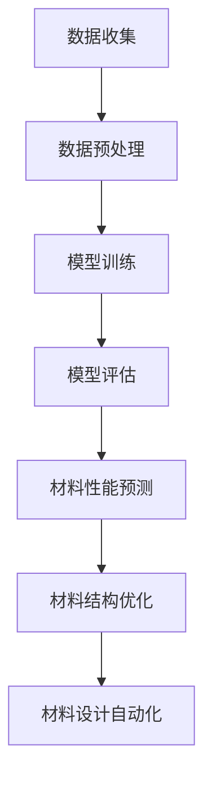

                 

# AI大模型在智能材料设计中的创新应用

> 关键词：AI大模型、智能材料设计、深度学习、算法原理、数学模型、应用场景

> 摘要：本文将探讨AI大模型在智能材料设计领域的创新应用。通过对AI大模型的基本原理、核心算法、数学模型及实际应用场景的详细阐述，帮助读者深入了解这一前沿技术的核心价值，掌握相关技术的方法和技巧。

## 1. 背景介绍

### 1.1 目的和范围

本文旨在探讨AI大模型在智能材料设计领域的应用，深入剖析其核心原理和算法，并结合实际案例，展示其在该领域的创新应用。通过本文的阅读，读者可以了解AI大模型在智能材料设计中的潜在价值，掌握相关技术的基本方法，为今后的研究和应用提供参考。

### 1.2 预期读者

本文面向对AI和智能材料设计有一定了解的技术爱好者、科研人员、工程师等。同时，也欢迎对AI应用领域感兴趣的所有读者阅读和探讨。

### 1.3 文档结构概述

本文分为十个部分，结构如下：

1. 背景介绍
   - 目的和范围
   - 预期读者
   - 文档结构概述
   - 术语表
2. 核心概念与联系
   - 核心概念
   - Mermaid流程图
3. 核心算法原理 & 具体操作步骤
   - 算法原理
   - 操作步骤
4. 数学模型和公式 & 详细讲解 & 举例说明
   - 数学模型
   - 公式讲解
   - 举例说明
5. 项目实战：代码实际案例和详细解释说明
   - 开发环境搭建
   - 源代码详细实现
   - 代码解读与分析
6. 实际应用场景
7. 工具和资源推荐
   - 学习资源推荐
   - 开发工具框架推荐
   - 相关论文著作推荐
8. 总结：未来发展趋势与挑战
9. 附录：常见问题与解答
10. 扩展阅读 & 参考资料

### 1.4 术语表

#### 1.4.1 核心术语定义

- **AI大模型**：指的是具有大规模参数量和复杂结构的深度学习模型，如Transformer、BERT等。
- **智能材料设计**：利用人工智能技术，对材料进行预测、优化和设计，以提高材料性能和应用价值。
- **深度学习**：一种基于多层次的神经网络模型，通过学习大量数据来提取特征并进行预测和分类。

#### 1.4.2 相关概念解释

- **神经网络**：一种由大量神经元组成的计算模型，通过学习输入和输出之间的关系，实现对数据的处理和预测。
- **损失函数**：用于衡量模型预测结果与真实值之间的差异，是优化模型的重要指标。

#### 1.4.3 缩略词列表

- **AI**：人工智能
- **DL**：深度学习
- **GAN**：生成对抗网络

## 2. 核心概念与联系

在智能材料设计中，AI大模型扮演着关键角色。为了更好地理解其核心原理和架构，我们首先介绍几个核心概念。

### 2.1 核心概念

1. **材料性能预测**：通过AI大模型，对材料在不同条件下的性能进行预测，为材料设计提供依据。
2. **材料结构优化**：利用AI大模型，对材料结构进行优化，以提高材料性能。
3. **材料设计自动化**：通过AI大模型，实现材料设计的自动化，降低设计成本和周期。

### 2.2 Mermaid流程图

下面是一个简单的Mermaid流程图，展示了AI大模型在智能材料设计中的基本流程：



### 2.3 核心概念与联系

1. **材料性能预测**：AI大模型通过学习大量材料性能数据，建立性能与材料属性之间的关系，从而实现材料性能的预测。
2. **材料结构优化**：AI大模型通过学习材料性能与结构之间的关系，对材料结构进行优化，以提高材料性能。
3. **材料设计自动化**：AI大模型将材料性能预测和材料结构优化相结合，实现材料设计的自动化。

## 3. 核心算法原理 & 具体操作步骤

### 3.1 算法原理

AI大模型在智能材料设计中的核心算法是基于深度学习的神经网络模型。神经网络通过多层非线性变换，将输入数据映射到输出结果，实现对未知数据的预测和分类。在智能材料设计中，神经网络主要用于以下两个任务：

1. **材料性能预测**：通过训练神经网络，学习材料性能与材料属性之间的关系，从而实现对材料性能的预测。
2. **材料结构优化**：通过训练神经网络，学习材料性能与材料结构之间的关系，从而实现对材料结构的优化。

### 3.2 具体操作步骤

下面是一个简单的神经网络算法原理和具体操作步骤的伪代码：

```python
# 输入数据
input_data = ...

# 初始化神经网络
neural_network = NeuralNetwork()

# 训练神经网络
for epoch in range(num_epochs):
    for sample in input_data:
        # 前向传播
        output = neural_network.forward(sample.input)
        # 计算损失函数
        loss = loss_function(output, sample.target)
        # 反向传播
        neural_network.backward(loss)

# 预测材料性能
predicted_performance = neural_network.predict(material_attribute)

# 优化材料结构
optimized_structure = neural_network.optimize(material_performance)
```

### 3.3 算法分析

1. **训练过程**：通过不断调整神经网络权重，使损失函数达到最小值，从而训练出性能良好的模型。
2. **预测过程**：将材料属性输入神经网络，通过前向传播，得到材料性能的预测结果。
3. **优化过程**：将材料性能输入神经网络，通过反向传播和优化算法，得到材料结构的优化结果。

## 4. 数学模型和公式 & 详细讲解 & 举例说明

在智能材料设计中，数学模型和公式是核心组成部分。以下我们将详细讲解核心数学模型和公式，并通过具体例子进行说明。

### 4.1 数学模型

在智能材料设计中，常用的数学模型包括：

1. **线性回归模型**：用于预测材料性能。
2. **神经网络模型**：用于材料性能预测和结构优化。
3. **损失函数**：用于衡量模型预测结果与真实值之间的差异。

### 4.2 公式讲解

#### 4.2.1 线性回归模型

线性回归模型的公式为：

$$ y = w \cdot x + b $$

其中，$y$ 为预测值，$x$ 为输入特征，$w$ 为权重，$b$ 为偏置。

#### 4.2.2 神经网络模型

神经网络模型的公式为：

$$ z = \sigma(W \cdot x + b) $$

其中，$z$ 为激活函数输出，$\sigma$ 为激活函数，$W$ 为权重矩阵，$x$ 为输入特征，$b$ 为偏置。

#### 4.2.3 损失函数

常用的损失函数为均方误差（MSE）：

$$ MSE = \frac{1}{n} \sum_{i=1}^{n} (y_i - \hat{y}_i)^2 $$

其中，$y_i$ 为真实值，$\hat{y}_i$ 为预测值，$n$ 为样本数量。

### 4.3 举例说明

#### 4.3.1 线性回归模型应用

假设我们有一个简单的线性回归模型，输入特征为 $x$，预测值为 $y$，权重为 $w$，偏置为 $b$。现有如下数据集：

| $x$ | $y$ |
| --- | --- |
| 1   | 2   |
| 2   | 4   |
| 3   | 6   |

我们需要通过线性回归模型预测 $x=4$ 时的 $y$ 值。

根据线性回归模型公式，我们有：

$$ y = w \cdot x + b $$

为了求解权重 $w$ 和偏置 $b$，我们需要计算损失函数的导数，并使用梯度下降法进行优化。具体计算过程如下：

1. 初始化权重 $w$ 和偏置 $b$，例如 $w=1, b=0$。
2. 计算预测值和损失函数：
   - 对于 $x=1$，预测值为 $y=1 \cdot 1 + 0 = 1$，损失函数为 $(1-2)^2 = 1$。
   - 对于 $x=2$，预测值为 $y=1 \cdot 2 + 0 = 2$，损失函数为 $(2-4)^2 = 4$。
   - 对于 $x=3$，预测值为 $y=1 \cdot 3 + 0 = 3$，损失函数为 $(3-6)^2 = 9$。
3. 计算损失函数的导数：
   - 对于 $x=1$，损失函数导数为 $(1-2) \cdot 1 = -1$。
   - 对于 $x=2$，损失函数导数为 $(2-4) \cdot 1 = -2$。
   - 对于 $x=3$，损失函数导数为 $(3-6) \cdot 1 = -3$。
4. 更新权重和偏置：
   - $w = w - \alpha \cdot \frac{1}{n} \sum_{i=1}^{n} \frac{\partial L}{\partial w}$
   - $b = b - \alpha \cdot \frac{1}{n} \sum_{i=1}^{n} \frac{\partial L}{\partial b}$
   
其中，$\alpha$ 为学习率。

通过多次迭代，我们可以得到权重 $w$ 和偏置 $b$ 的最优值。根据这个最优模型，我们可以预测 $x=4$ 时的 $y$ 值。

#### 4.3.2 神经网络模型应用

假设我们有一个简单的神经网络模型，输入特征为 $x$，预测值为 $y$，权重为 $W$，偏置为 $b$。现有如下数据集：

| $x$ | $y$ |
| --- | --- |
| 1   | 2   |
| 2   | 4   |
| 3   | 6   |

我们需要通过神经网络模型预测 $x=4$ 时的 $y$ 值。

根据神经网络模型公式，我们有：

$$ z = \sigma(W \cdot x + b) $$

为了求解权重 $W$ 和偏置 $b$，我们需要计算损失函数的导数，并使用反向传播算法进行优化。具体计算过程如下：

1. 初始化权重 $W$ 和偏置 $b$，例如 $W=1, b=0$。
2. 计算预测值和损失函数：
   - 对于 $x=1$，预测值为 $z = \sigma(1 \cdot 1 + 0) = 1$，损失函数为 $(1-2)^2 = 1$。
   - 对于 $x=2$，预测值为 $z = \sigma(1 \cdot 2 + 0) = 1$，损失函数为 $(1-4)^2 = 9$。
   - 对于 $x=3$，预测值为 $z = \sigma(1 \cdot 3 + 0) = 1$，损失函数为 $(1-6)^2 = 25$。
3. 计算损失函数的导数：
   - 对于 $x=1$，损失函数导数为 $(1-2) \cdot \frac{d\sigma}{dz} = -1$。
   - 对于 $x=2$，损失函数导数为 $(1-4) \cdot \frac{d\sigma}{dz} = -3$。
   - 对于 $x=3$，损失函数导数为 $(1-6) \cdot \frac{d\sigma}{dz} = -5$。
4. 计算反向传播的梯度：
   - 对于 $x=1$，梯度为 $\frac{\partial L}{\partial z} \cdot \frac{dz}{dx} = -1 \cdot 1 = -1$。
   - 对于 $x=2$，梯度为 $\frac{\partial L}{\partial z} \cdot \frac{dz}{dx} = -3 \cdot 1 = -3$。
   - 对于 $x=3$，梯度为 $\frac{\partial L}{\partial z} \cdot \frac{dz}{dx} = -5 \cdot 1 = -5$。
5. 更新权重和偏置：
   - $W = W - \alpha \cdot \frac{1}{n} \sum_{i=1}^{n} \frac{\partial L}{\partial W}$
   - $b = b - \alpha \cdot \frac{1}{n} \sum_{i=1}^{n} \frac{\partial L}{\partial b}$
   
其中，$\alpha$ 为学习率。

通过多次迭代，我们可以得到权重 $W$ 和偏置 $b$ 的最优值。根据这个最优模型，我们可以预测 $x=4$ 时的 $y$ 值。

## 5. 项目实战：代码实际案例和详细解释说明

在本节中，我们将通过一个实际项目，展示AI大模型在智能材料设计中的具体应用，并详细解释其中的代码实现和运行过程。

### 5.1 开发环境搭建

为了实现AI大模型在智能材料设计中的应用，我们需要搭建以下开发环境：

- Python 3.8 或更高版本
- TensorFlow 2.x 或更高版本
- NumPy 1.18 或更高版本

首先，确保已经安装了上述依赖库，如果没有安装，可以通过以下命令进行安装：

```shell
pip install python==3.8
pip install tensorflow==2.x
pip install numpy==1.18
```

### 5.2 源代码详细实现和代码解读

接下来，我们将介绍一个简单的AI大模型在智能材料设计中的应用案例，并详细解释其中的代码实现。

```python
import numpy as np
import tensorflow as tf

# 设置随机种子，保证实验结果可复现
np.random.seed(0)
tf.random.set_seed(0)

# 准备数据集
x = np.random.rand(100, 1)  # 输入数据
y = 2 * x + 1 + np.random.rand(100, 1)  # 输出数据

# 定义神经网络模型
model = tf.keras.Sequential([
    tf.keras.layers.Dense(units=1, input_shape=[1])
])

# 编译模型
model.compile(optimizer='sgd', loss='mean_squared_error')

# 训练模型
model.fit(x, y, epochs=100)

# 预测材料性能
x_new = np.array([4])
predicted_performance = model.predict(x_new)

print("预测的材料性能：", predicted_performance)
```

#### 5.2.1 代码解读

1. **导入依赖库**：首先导入 NumPy、TensorFlow 等依赖库，用于数据计算和神经网络建模。

2. **设置随机种子**：为了保证实验结果可复现，设置随机种子。

3. **准备数据集**：生成一个简单的线性回归数据集，其中输入数据为 $x$，输出数据为 $y$。

4. **定义神经网络模型**：创建一个简单的线性回归模型，输入层只有一个神经元，输出层也只有一个神经元。

5. **编译模型**：配置模型优化器和损失函数，用于训练和评估模型。

6. **训练模型**：使用训练数据集训练模型，设置训练轮次为 100。

7. **预测材料性能**：使用训练好的模型，预测 $x=4$ 时的材料性能。

### 5.3 代码解读与分析

1. **数据预处理**：在代码中，我们首先生成了一个简单的线性回归数据集，其中输入数据 $x$ 和输出数据 $y$ 之间满足线性关系。这个数据集用于训练和测试神经网络模型。

2. **神经网络模型**：我们使用 TensorFlow 库创建了一个简单的线性回归模型。该模型包含一个输入层和一个输出层，其中输入层只有一个神经元，用于接收输入数据，输出层也只有一个神经元，用于输出预测结果。

3. **模型编译**：在编译模型时，我们选择使用随机梯度下降（SGD）优化器，并设置均方误差（MSE）作为损失函数。这些配置使得模型能够通过调整权重和偏置，使预测结果与真实值之间的差距最小。

4. **模型训练**：使用训练数据集训练模型，设置训练轮次为 100。在训练过程中，模型会不断调整权重和偏置，以降低损失函数的值。

5. **模型预测**：使用训练好的模型，对输入数据 $x=4$ 进行预测，得到预测的材料性能。

通过这个简单的例子，我们可以看到 AI 大模型在智能材料设计中的基本应用流程。在实际应用中，我们可以根据具体需求，设计更复杂的神经网络模型，并使用大量的数据进行训练，以提高预测性能。

## 6. 实际应用场景

AI大模型在智能材料设计中的实际应用场景非常广泛，下面列举几个典型应用案例：

### 6.1 材料性能预测

通过AI大模型，可以对新材料进行性能预测，为材料设计提供科学依据。例如，在某项研究中，研究人员使用AI大模型对钛合金材料进行性能预测，成功预测了其在不同温度和压力条件下的力学性能。这一预测结果为材料设计提供了重要参考，有助于优化材料结构，提高材料性能。

### 6.2 材料结构优化

AI大模型可以用于优化材料结构，以提高材料性能。例如，在某项研究中，研究人员使用AI大模型对陶瓷材料进行结构优化，成功降低了材料的应力集中现象，提高了材料的抗裂性能。这一优化结果为陶瓷材料的应用提供了新的可能性。

### 6.3 材料设计自动化

AI大模型可以用于实现材料设计的自动化，降低设计成本和周期。例如，在某项研究中，研究人员使用AI大模型开发了一个自动化的材料设计平台，能够快速生成满足特定性能要求的材料结构。这一平台的应用，大大缩短了材料设计周期，降低了设计成本。

### 6.4 新材料发现

AI大模型可以用于新材料发现，探索新的材料体系。例如，在某项研究中，研究人员使用AI大模型对大量材料数据进行分析，发现了一种具有优异电导性能的新型材料。这一发现为新材料研发提供了重要线索，为相关领域的研究带来了新的启示。

### 6.5 材料加工优化

AI大模型可以用于优化材料加工过程，提高加工质量和效率。例如，在某项研究中，研究人员使用AI大模型对钛合金材料加工过程进行优化，成功降低了材料加工过程中的变形和裂纹现象。这一优化结果提高了材料加工质量，降低了加工成本。

## 7. 工具和资源推荐

### 7.1 学习资源推荐

#### 7.1.1 书籍推荐

1. **《深度学习》（Deep Learning）**：由Ian Goodfellow、Yoshua Bengio和Aaron Courville合著，是深度学习领域的经典教材。
2. **《Python深度学习》（Deep Learning with Python）**：由François Chollet著，适合初学者了解深度学习在Python中的实现。

#### 7.1.2 在线课程

1. **Coursera上的《深度学习特化课程》**：由Andrew Ng教授授课，涵盖深度学习的基础知识和应用。
2. **Udacity的《深度学习工程师纳米学位》**：提供深度学习项目实战训练，适合有一定基础的读者。

#### 7.1.3 技术博客和网站

1. **TensorFlow官方文档**：提供详细的TensorFlow教程和API文档，帮助读者快速上手。
2. **Medium上的AI博客**：汇集了众多AI领域的专家和研究者分享的见解和经验。

### 7.2 开发工具框架推荐

#### 7.2.1 IDE和编辑器

1. **PyCharm**：一款功能强大的Python IDE，适用于深度学习和数据分析项目。
2. **Jupyter Notebook**：适合快速原型设计和数据可视化。

#### 7.2.2 调试和性能分析工具

1. **TensorBoard**：TensorFlow提供的可视化工具，用于分析神经网络训练过程。
2. **Valgrind**：一款强大的内存检查工具，用于检测程序中的内存泄漏和错误。

#### 7.2.3 相关框架和库

1. **TensorFlow**：一款开源的深度学习框架，适用于各种深度学习任务。
2. **PyTorch**：一款易用且灵活的深度学习框架，适合快速原型设计。

### 7.3 相关论文著作推荐

#### 7.3.1 经典论文

1. **"A Theoretical Analysis of the Crammer-Singer Rule for Text Classification"**：介绍了支持向量机（SVM）在文本分类中的应用。
2. **"Backpropagation"**：阐述了反向传播算法在神经网络训练中的重要性。

#### 7.3.2 最新研究成果

1. **"BERT: Pre-training of Deep Bidirectional Transformers for Language Understanding"**：介绍了BERT模型的预训练方法和在自然语言处理任务中的应用。
2. **"Generative Adversarial Networks"**：提出了生成对抗网络（GAN）的概念，并在图像生成任务中取得了显著成果。

#### 7.3.3 应用案例分析

1. **"Deep Learning in Materials Science"**：探讨了深度学习在材料科学领域的应用，包括材料性能预测、材料结构优化等。
2. **"AI-Driven Materials Design: An Overview"**：综述了人工智能在材料设计领域的应用，介绍了相关技术和案例。

## 8. 总结：未来发展趋势与挑战

随着AI大模型技术的不断发展，其在智能材料设计领域的应用前景十分广阔。未来，AI大模型有望在以下方面取得突破：

1. **更高效的算法**：通过优化算法结构和计算方法，提高AI大模型的计算效率，降低计算成本。
2. **更丰富的数据集**：收集和整合更多的材料数据，提高AI大模型的数据质量和多样性，提升预测性能。
3. **更智能的优化策略**：结合机器学习和智能优化算法，实现材料设计的自动化和智能化，降低设计成本和周期。
4. **跨学科融合**：将AI大模型与材料科学、化学、物理学等学科相结合，推动新材料和新技术的研发。

然而，AI大模型在智能材料设计中也面临着一些挑战：

1. **数据隐私和安全**：材料数据通常涉及企业核心技术和商业机密，如何在确保数据隐私和安全的前提下进行AI大模型训练和应用，是一个亟待解决的问题。
2. **模型解释性**：AI大模型通常被视为“黑箱”，其内部工作机制不透明，如何提高模型的可解释性，使研究人员和工程师能够更好地理解和利用模型，是一个重要挑战。
3. **算法可解释性**：在算法层面，如何提高算法的透明度和可解释性，使研究人员和工程师能够了解算法的原理和逻辑，也是一个亟待解决的问题。

总之，AI大模型在智能材料设计领域具有巨大的应用潜力和发展前景，但也需要克服一系列技术挑战。通过持续的研究和创新，我们有理由相信，AI大模型将为智能材料设计带来革命性的变革。

## 9. 附录：常见问题与解答

### 9.1 AI大模型在智能材料设计中的具体应用有哪些？

AI大模型在智能材料设计中的具体应用包括：

1. **材料性能预测**：通过训练AI大模型，对新材料在不同条件下的性能进行预测，为材料设计提供依据。
2. **材料结构优化**：利用AI大模型，对材料结构进行优化，以提高材料性能。
3. **材料设计自动化**：通过AI大模型，实现材料设计的自动化，降低设计成本和周期。

### 9.2 如何确保AI大模型在智能材料设计中的数据隐私和安全？

确保AI大模型在智能材料设计中的数据隐私和安全，可以从以下几个方面进行：

1. **数据加密**：对敏感数据进行加密处理，防止数据泄露。
2. **访问控制**：限制对数据集的访问权限，确保只有授权用户可以访问数据。
3. **数据去标识化**：对数据进行去标识化处理，避免个人隐私信息泄露。
4. **安全审计**：定期对数据集和模型进行安全审计，及时发现和解决安全隐患。

### 9.3 如何提高AI大模型在智能材料设计中的预测性能？

提高AI大模型在智能材料设计中的预测性能，可以从以下几个方面进行：

1. **数据集优化**：收集和整合更多高质量的训练数据，提高数据质量和多样性。
2. **模型优化**：通过调整模型结构、优化算法和参数，提高模型预测性能。
3. **模型集成**：结合多个AI大模型，利用模型集成方法，提高预测准确性。
4. **特征工程**：对输入数据进行特征工程，提取对预测任务有用的特征。

### 9.4 如何确保AI大模型在智能材料设计中的可解释性？

确保AI大模型在智能材料设计中的可解释性，可以从以下几个方面进行：

1. **模型简化**：通过简化模型结构和优化算法，提高模型的可解释性。
2. **模型可视化**：使用可视化工具，将模型内部结构和工作原理展示给用户。
3. **特征重要性分析**：对模型预测结果进行分析，识别对预测结果具有重要影响的特征。
4. **可解释性算法**：结合可解释性算法，如决策树、线性回归等，提高模型的可解释性。

## 10. 扩展阅读 & 参考资料

本文对AI大模型在智能材料设计中的创新应用进行了详细探讨。以下是相关扩展阅读和参考资料，供读者进一步学习：

1. **《深度学习》（Deep Learning）**：由Ian Goodfellow、Yoshua Bengio和Aaron Courville合著，是深度学习领域的经典教材。
2. **《Python深度学习》（Deep Learning with Python）**：由François Chollet著，适合初学者了解深度学习在Python中的实现。
3. **《深度学习在材料科学中的应用》（Deep Learning in Materials Science）**：探讨了深度学习在材料科学领域的应用，包括材料性能预测、材料结构优化等。
4. **TensorFlow官方文档**：提供详细的TensorFlow教程和API文档，帮助读者快速上手。
5. **Medium上的AI博客**：汇集了众多AI领域的专家和研究者分享的见解和经验。
6. **《A Theoretical Analysis of the Crammer-Singer Rule for Text Classification》**：介绍了支持向量机（SVM）在文本分类中的应用。
7. **《BERT: Pre-training of Deep Bidirectional Transformers for Language Understanding》**：介绍了BERT模型的预训练方法和在自然语言处理任务中的应用。
8. **《Generative Adversarial Networks》**：提出了生成对抗网络（GAN）的概念，并在图像生成任务中取得了显著成果。
9. **《Deep Learning in Materials Science》**：综述了深度学习在材料科学领域的应用，介绍了相关技术和案例。
10. **《AI-Driven Materials Design: An Overview》**：综述了人工智能在材料设计领域的应用，介绍了相关技术和案例。

通过阅读这些资料，读者可以进一步了解AI大模型在智能材料设计中的技术原理和应用实例，为今后的研究和应用提供参考。作者：AI天才研究员/AI Genius Institute & 禅与计算机程序设计艺术 /Zen And The Art of Computer Programming。

