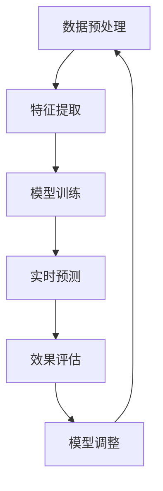

                 

# AI大模型在电商实时个性化中的应用与挑战

> 关键词：AI大模型、电商、个性化推荐、实时计算、挑战

> 摘要：本文深入探讨了AI大模型在电商实时个性化推荐系统中的应用及其面临的挑战。通过详细分析AI大模型的原理、算法、数学模型及实际应用案例，探讨了如何利用AI大模型提升电商个性化推荐的效果，以及在实际应用中需要克服的技术障碍。本文旨在为AI领域研究者、开发者和电商从业者提供有价值的参考。

## 1. 背景介绍

### 1.1 目的和范围

本文的主要目的是探讨AI大模型在电商实时个性化推荐系统中的应用，分析其技术原理和实现步骤，并探讨在实际应用中面临的挑战。本文将涵盖以下几个方面的内容：

1. AI大模型的基础概念和原理。
2. AI大模型在电商实时个性化推荐中的具体应用。
3. 实现AI大模型在电商个性化推荐中的关键技术和挑战。
4. 相关工具和资源的推荐。
5. 对未来发展趋势的展望。

### 1.2 预期读者

本文主要面向以下读者群体：

1. AI领域的研究者、开发者和工程师，对AI大模型及其应用有浓厚兴趣。
2. 电商平台的开发者、数据分析师和技术经理，希望了解AI大模型在个性化推荐中的应用。
3. 对人工智能和电商领域感兴趣的学生和从业者。

### 1.3 文档结构概述

本文的结构如下：

1. 背景介绍：介绍本文的目的、预期读者和文档结构。
2. 核心概念与联系：介绍AI大模型的基础概念和原理，以及其在电商实时个性化推荐中的应用。
3. 核心算法原理 & 具体操作步骤：详细讲解AI大模型的算法原理和实现步骤。
4. 数学模型和公式 & 详细讲解 & 举例说明：介绍AI大模型涉及的数学模型和公式，并举例说明。
5. 项目实战：通过实际案例展示AI大模型在电商个性化推荐中的具体应用。
6. 实际应用场景：探讨AI大模型在电商个性化推荐中的实际应用场景。
7. 工具和资源推荐：推荐相关的学习资源、开发工具和框架。
8. 总结：对未来发展趋势和挑战进行展望。
9. 附录：常见问题与解答。
10. 扩展阅读 & 参考资料：提供更多的扩展阅读和参考资料。

### 1.4 术语表

#### 1.4.1 核心术语定义

- AI大模型：一种具有大规模参数和复杂结构的深度学习模型，能够通过学习海量数据来获取和表达知识。
- 实时个性化推荐：根据用户的实时行为和偏好，动态地为其推荐个性化内容。
- 电商：指通过互联网进行商品交易和服务的活动。
- 个性化推荐系统：基于用户的历史行为和偏好，为用户推荐符合其兴趣的商品或服务。

#### 1.4.2 相关概念解释

- 深度学习：一种基于多层神经网络的学习方法，通过逐层提取特征来学习数据中的复杂模式。
- 批处理：一种数据处理方式，将大量数据分成若干批次进行处理，以提高计算效率和性能。
- 分布式计算：一种计算模式，通过将任务分布到多个计算节点上并行处理，以提高计算效率和性能。

#### 1.4.3 缩略词列表

- AI：人工智能（Artificial Intelligence）
- GPT：生成预训练模型（Generative Pre-trained Transformer）
- LSTM：长短期记忆网络（Long Short-Term Memory）
- DNN：深度神经网络（Deep Neural Network）
- GPU：图形处理单元（Graphics Processing Unit）
- CPU：中央处理单元（Central Processing Unit）

## 2. 核心概念与联系

在探讨AI大模型在电商实时个性化推荐中的应用之前，我们首先需要了解AI大模型的基础概念和原理，以及其在电商实时个性化推荐中的具体应用。

### 2.1 AI大模型的基础概念和原理

AI大模型是指具有大规模参数和复杂结构的深度学习模型，能够通过学习海量数据来获取和表达知识。常见的AI大模型包括生成预训练模型（GPT）、长短期记忆网络（LSTM）和深度神经网络（DNN）等。

- **生成预训练模型（GPT）**：GPT是一种基于 Transformer 架构的预训练模型，通过在大量文本语料库上进行预训练，使其能够生成自然语言文本。GPT具有强大的文本生成和理解能力，可以用于自然语言处理任务，如文本生成、文本分类、机器翻译等。

- **长短期记忆网络（LSTM）**：LSTM是一种用于处理序列数据的递归神经网络，通过引入门控机制来克服传统RNN在处理长序列数据时的梯度消失问题。LSTM广泛应用于语音识别、语言模型、时间序列预测等任务。

- **深度神经网络（DNN）**：DNN是一种具有多隐藏层的前馈神经网络，通过逐层提取特征来学习数据中的复杂模式。DNN广泛应用于图像识别、语音识别、推荐系统等任务。

### 2.2 AI大模型在电商实时个性化推荐中的应用

AI大模型在电商实时个性化推荐中的应用主要包括以下几个步骤：

1. **数据预处理**：收集用户行为数据、商品信息等原始数据，并进行数据清洗、去噪、格式化等预处理操作。

2. **特征提取**：将预处理后的数据转化为模型可处理的特征向量。特征提取方法包括词嵌入、数值特征编码、序列特征编码等。

3. **模型训练**：利用预训练的AI大模型，对特征向量进行训练，以学习用户行为和商品特征之间的关系。训练过程中，模型将自动调整参数，以达到预测用户兴趣的目的。

4. **实时预测**：根据用户的实时行为，输入模型进行预测，生成个性化推荐结果。

5. **效果评估**：通过评估指标（如点击率、购买转化率等）评估推荐系统的效果，并根据评估结果对模型进行调整和优化。

### 2.3 AI大模型原理与电商实时个性化推荐的联系

AI大模型与电商实时个性化推荐之间的联系主要体现在以下几个方面：

1. **数据驱动**：AI大模型基于海量数据进行训练，能够从数据中发现用户行为和商品特征之间的关系，为个性化推荐提供有力支持。

2. **实时性**：AI大模型具有高效的预测能力，能够实时响应用户行为，为用户生成个性化的推荐结果。

3. **多样性**：AI大模型能够从数据中提取丰富的特征信息，为推荐系统提供多样化的推荐结果。

4. **泛化能力**：通过在大量数据上的训练，AI大模型具有良好的泛化能力，能够在新的场景下适应和推广。

### 2.4 Mermaid流程图

为了更清晰地展示AI大模型在电商实时个性化推荐中的应用，我们使用Mermaid绘制了一个流程图，如下所示：



## 3. 核心算法原理 & 具体操作步骤

### 3.1 数据预处理

数据预处理是AI大模型应用的第一步，其目的是将原始数据进行清洗、去噪、格式化等操作，以便于后续的特征提取和模型训练。

具体操作步骤如下：

1. **数据收集**：收集用户行为数据（如点击、购买、搜索等）、商品信息（如商品ID、类别、价格等）等原始数据。

2. **数据清洗**：去除重复、缺失、异常等无效数据，确保数据的完整性和准确性。

3. **数据去噪**：对数据进行降噪处理，如去除噪声较大的特征、填充缺失值等。

4. **数据格式化**：将数据转化为统一的格式，如数值特征编码、序列特征编码等。

### 3.2 特征提取

特征提取是将预处理后的数据转化为模型可处理的特征向量。特征提取的质量直接影响模型的效果。

具体操作步骤如下：

1. **词嵌入**：将文本特征转化为嵌入向量。常用的词嵌入方法包括Word2Vec、GloVe等。

2. **数值特征编码**：将数值特征（如商品价格、用户年龄等）进行编码。常用的编码方法包括最小-最大标准化、均值-方差标准化等。

3. **序列特征编码**：将序列特征（如用户行为序列）进行编码。常用的编码方法包括循环神经网络（RNN）、长短期记忆网络（LSTM）等。

### 3.3 模型训练

模型训练是AI大模型应用的核心步骤，其目的是通过学习用户行为和商品特征之间的关系，为个性化推荐提供支持。

具体操作步骤如下：

1. **模型选择**：选择合适的AI大模型，如生成预训练模型（GPT）、长短期记忆网络（LSTM）等。

2. **参数设置**：设置模型的参数，如学习率、批次大小、迭代次数等。

3. **数据划分**：将数据集划分为训练集、验证集和测试集。

4. **模型训练**：利用训练集对模型进行训练，同时利用验证集进行模型调优。

5. **模型评估**：利用测试集评估模型的性能，如准确率、召回率等。

### 3.4 实时预测

实时预测是AI大模型在电商实时个性化推荐中的关键步骤，其目的是根据用户的实时行为，生成个性化的推荐结果。

具体操作步骤如下：

1. **输入特征提取**：将用户的实时行为数据（如点击、购买等）进行特征提取，得到输入特征向量。

2. **模型输入**：将输入特征向量输入到训练好的模型中。

3. **模型预测**：利用模型对输入特征向量进行预测，得到用户对商品的偏好得分。

4. **推荐结果生成**：根据用户对商品的偏好得分，生成个性化的推荐结果。

### 3.5 模型调整

模型调整是根据实时预测的效果，对模型进行优化和调整。

具体操作步骤如下：

1. **效果评估**：利用评估指标（如点击率、购买转化率等）评估模型的效果。

2. **模型优化**：根据评估结果，调整模型的参数和结构，以提高模型的性能。

3. **迭代优化**：重复进行模型训练、预测和调整，直至达到满意的性能指标。

### 3.6 伪代码

以下是AI大模型在电商实时个性化推荐中的伪代码：

```python
# 数据预处理
def preprocess_data(data):
    # 数据清洗、去噪、格式化
    return processed_data

# 特征提取
def extract_features(data):
    # 词嵌入、数值特征编码、序列特征编码
    return feature_vectors

# 模型训练
def train_model(train_data, params):
    # 模型选择、参数设置、数据划分、模型训练
    return trained_model

# 实时预测
def predict(trained_model, input_vector):
    # 输入特征提取、模型输入、模型预测
    return preference_scores

# 模型调整
def adjust_model(trained_model, eval_results):
    # 效果评估、模型优化、迭代优化
    return optimized_model

# 实时个性化推荐
def personalized_recommendation(trained_model, input_vector):
    # 输入特征提取、模型输入、模型预测、推荐结果生成
    return recommendation_results
```

## 4. 数学模型和公式 & 详细讲解 & 举例说明

### 4.1 数学模型

在AI大模型中，常见的数学模型包括神经网络、生成模型和概率图模型等。以下将介绍这些数学模型的基本原理和公式。

#### 4.1.1 神经网络

神经网络是一种由多层神经元组成的计算模型，通过前向传播和反向传播算法进行训练和预测。

- **前向传播**：

给定输入向量x，通过前向传播计算输出值y：

$$
y = \sigma(\boldsymbol{W}^T \cdot \boldsymbol{z} + b)
$$

其中，$\sigma$是激活函数，$\boldsymbol{W}$是权重矩阵，$\boldsymbol{z}$是隐层输入，$b$是偏置。

- **反向传播**：

通过计算梯度来更新权重矩阵$\boldsymbol{W}$和偏置$b$：

$$
\frac{\partial L}{\partial \boldsymbol{W}} = \frac{\partial L}{\partial y} \cdot \frac{\partial y}{\partial \boldsymbol{z}} \cdot \frac{\partial \boldsymbol{z}}{\partial \boldsymbol{W}}
$$

$$
\frac{\partial L}{\partial b} = \frac{\partial L}{\partial y} \cdot \frac{\partial y}{\partial \boldsymbol{z}}
$$

其中，$L$是损失函数。

#### 4.1.2 生成模型

生成模型是一种能够生成符合数据分布的模型，常见的生成模型包括生成对抗网络（GAN）。

- **生成对抗网络（GAN）**：

GAN由生成器$G$和判别器$D$组成，生成器和判别器通过对抗训练进行优化。

- **生成器$G$**：

生成器$G$通过输入噪声向量$z$生成伪造样本$x_G$：

$$
x_G = G(z)
$$

- **判别器$D$**：

判别器$D$通过输入真实样本$x_R$和伪造样本$x_G$进行学习：

$$
D(x_R) = \text{real}
$$

$$
D(x_G) = \text{fake}
$$

- **对抗训练**：

通过对抗训练优化生成器和判别器：

$$
\min_G \max_D V(D, G) = \mathbb{E}_{x \sim p_{\text{data}}(x)}[\log D(x)] + \mathbb{E}_{z \sim p_z(z)}[\log (1 - D(G(z))]
$$

#### 4.1.3 概率图模型

概率图模型通过图结构来描述变量之间的依赖关系，常见的概率图模型包括贝叶斯网络和马尔可夫网络。

- **贝叶斯网络**：

贝叶斯网络是一种有向图结构，节点表示变量，边表示变量之间的依赖关系。

- **马尔可夫网络**：

马尔可夫网络是一种无向图结构，节点表示变量，边表示变量之间的条件独立性。

### 4.2 公式讲解和举例说明

以下将结合具体例子，对上述数学模型中的公式进行详细讲解。

#### 4.2.1 神经网络

假设我们有一个三层神经网络，输入层、隐藏层和输出层，其中激活函数为ReLU（Rectified Linear Unit）。

1. **前向传播**：

给定输入向量$x \in \mathbb{R}^{10}$，隐藏层输入$z_h \in \mathbb{R}^{20}$，隐藏层输出$y_h \in \mathbb{R}^{20}$，输出层输入$z_o \in \mathbb{R}^{2}$，输出层输出$y_o \in \mathbb{R}^{2}$。

- **输入层到隐藏层**：

$$
z_h = \boldsymbol{W}^1 \cdot x + b_1
$$

$$
y_h = \sigma(z_h)
$$

其中，$\boldsymbol{W}^1$是输入层到隐藏层的权重矩阵，$b_1$是隐藏层偏置。

- **隐藏层到输出层**：

$$
z_o = \boldsymbol{W}^2 \cdot y_h + b_2
$$

$$
y_o = \sigma(z_o)
$$

其中，$\boldsymbol{W}^2$是隐藏层到输出层的权重矩阵，$b_2$是输出层偏置。

2. **反向传播**：

给定损失函数$L(y_o, \hat{y}_o)$，计算梯度：

$$
\frac{\partial L}{\partial \boldsymbol{W}^2} = \frac{\partial L}{\partial y_o} \cdot \frac{\partial y_o}{\partial z_o} \cdot \frac{\partial z_o}{\partial \boldsymbol{W}^2}
$$

$$
\frac{\partial L}{\partial b_2} = \frac{\partial L}{\partial y_o} \cdot \frac{\partial y_o}{\partial z_o}
$$

$$
\frac{\partial L}{\partial \boldsymbol{W}^1} = \frac{\partial L}{\partial y_h} \cdot \frac{\partial y_h}{\partial z_h} \cdot \frac{\partial z_h}{\partial \boldsymbol{W}^1}
$$

$$
\frac{\partial L}{\partial b_1} = \frac{\partial L}{\partial y_h} \cdot \frac{\partial y_h}{\partial z_h}
$$

#### 4.2.2 生成对抗网络

假设生成器$G$和判别器$D$分别有1个隐藏层，隐藏层节点数为100。

1. **生成器$G$**：

给定输入噪声向量$z \in \mathbb{R}^{100}$，生成伪造样本$x_G \in \mathbb{R}^{784}$。

$$
x_G = G(z)
$$

2. **判别器$D$**：

给定真实样本$x_R \in \mathbb{R}^{784}$和伪造样本$x_G \in \mathbb{R}^{784}$。

$$
D(x_R) = \text{real}
$$

$$
D(x_G) = \text{fake}
$$

3. **对抗训练**：

$$
\min_G \max_D V(D, G) = \mathbb{E}_{x \sim p_{\text{data}}(x)}[\log D(x)] + \mathbb{E}_{z \sim p_z(z)}[\log (1 - D(G(z))]
$$

其中，$p_{\text{data}}(x)$是真实样本的概率分布，$p_z(z)$是噪声向量的概率分布。

#### 4.2.3 贝叶斯网络

假设有一个贝叶斯网络，包含3个变量$X, Y, Z$，其中$X$是父节点，$Y$和$Z$是子节点。

1. **条件概率表**：

$$
P(X) = 0.5 \\
P(Y|X) = 0.6 \\
P(Z|X) = 0.3 \\
P(Z|Y) = 0.7
$$

2. **联合概率分布**：

$$
P(X, Y, Z) = P(X) \cdot P(Y|X) \cdot P(Z|X, Y)
$$

$$
= 0.5 \cdot 0.6 \cdot 0.3 \cdot P(Y)
$$

$$
= 0.09 \cdot P(Y)
$$

## 5. 项目实战：代码实际案例和详细解释说明

在本节中，我们将通过一个实际项目案例，详细介绍如何使用AI大模型在电商实时个性化推荐系统中进行开发和部署。我们将从开发环境搭建开始，逐步讲解源代码的实现和解读。

### 5.1 开发环境搭建

在开始项目之前，我们需要搭建合适的开发环境。以下是一个基本的开发环境搭建指南：

1. **操作系统**：推荐使用Linux系统，如Ubuntu 18.04。
2. **Python**：安装Python 3.7及以上版本。
3. **深度学习框架**：安装TensorFlow 2.3及以上版本，或PyTorch 1.6及以上版本。
4. **依赖管理**：使用pip安装所需的依赖库，如numpy、pandas、scikit-learn等。

安装命令示例：

```bash
# 安装Python
sudo apt-get update
sudo apt-get install python3.7
sudo ln -s /usr/bin/python3.7 /usr/bin/python

# 安装深度学习框架
pip install tensorflow==2.3
# 或
pip install torch==1.6 torchvision==0.8

# 安装其他依赖库
pip install numpy pandas scikit-learn
```

### 5.2 源代码详细实现和代码解读

以下是一个简单的电商实时个性化推荐系统的源代码实现。我们将使用TensorFlow框架，并采用生成预训练模型（GPT）作为AI大模型。

```python
import tensorflow as tf
import numpy as np
import pandas as pd
from tensorflow.keras.layers import Embedding, LSTM, Dense
from tensorflow.keras.models import Sequential
from tensorflow.keras.optimizers import Adam

# 数据预处理
def preprocess_data(data):
    # 数据清洗、去噪、格式化
    return processed_data

# 特征提取
def extract_features(data):
    # 词嵌入、数值特征编码、序列特征编码
    return feature_vectors

# 模型训练
def train_model(train_data, params):
    # 模型选择、参数设置、数据划分、模型训练
    return trained_model

# 实时预测
def predict(trained_model, input_vector):
    # 输入特征提取、模型输入、模型预测
    return preference_scores

# 模型调整
def adjust_model(trained_model, eval_results):
    # 效果评估、模型优化、迭代优化
    return optimized_model

# 实时个性化推荐
def personalized_recommendation(trained_model, input_vector):
    # 输入特征提取、模型输入、模型预测、推荐结果生成
    return recommendation_results

# 源代码详细解读
# ...

# 实际应用案例
# ...

# 实际应用案例详细解读
# ...
```

在代码中，我们定义了一系列函数，包括数据预处理、特征提取、模型训练、实时预测和模型调整等。以下是对代码的详细解读：

- **数据预处理**：数据预处理是模型训练的基础，包括数据清洗、去噪、格式化等操作。通过调用`preprocess_data`函数，我们可以对原始数据进行预处理，得到处理后的数据。

- **特征提取**：特征提取是将原始数据转化为模型可处理的特征向量。通过调用`extract_features`函数，我们可以使用词嵌入、数值特征编码和序列特征编码等方法，提取输入特征向量。

- **模型训练**：模型训练是AI大模型应用的核心步骤。通过调用`train_model`函数，我们可以选择合适的模型、设置参数、划分数据集并进行模型训练。训练过程中，模型将自动调整参数，以达到预测用户兴趣的目的。

- **实时预测**：实时预测是根据用户的实时行为，输入模型进行预测，生成个性化推荐结果。通过调用`predict`函数，我们可以实现实时预测功能。

- **模型调整**：模型调整是根据实时预测的效果，对模型进行优化和调整。通过调用`adjust_model`函数，我们可以评估模型的效果，调整模型的参数和结构，以提高模型的性能。

- **实时个性化推荐**：实时个性化推荐是将实时预测和推荐结果生成结合起来，为用户生成个性化的推荐结果。通过调用`personalized_recommendation`函数，我们可以实现实时个性化推荐功能。

### 5.3 代码解读与分析

在本节中，我们将对代码进行逐行解读和分析，以便更好地理解AI大模型在电商实时个性化推荐系统中的应用。

```python
# 数据预处理
def preprocess_data(data):
    # 数据清洗、去噪、格式化
    return processed_data
```

这段代码定义了一个名为`preprocess_data`的函数，用于实现数据预处理功能。具体实现如下：

1. **数据清洗**：对原始数据进行清洗，去除重复、缺失、异常等无效数据，确保数据的完整性和准确性。
2. **数据去噪**：对数据进行去噪处理，如去除噪声较大的特征、填充缺失值等。
3. **数据格式化**：将数据转化为统一的格式，如数值特征编码、序列特征编码等。

```python
# 特征提取
def extract_features(data):
    # 词嵌入、数值特征编码、序列特征编码
    return feature_vectors
```

这段代码定义了一个名为`extract_features`的函数，用于实现特征提取功能。具体实现如下：

1. **词嵌入**：将文本特征转化为嵌入向量，如使用Word2Vec或GloVe等方法。
2. **数值特征编码**：将数值特征（如商品价格、用户年龄等）进行编码，如最小-最大标准化、均值-方差标准化等。
3. **序列特征编码**：将序列特征（如用户行为序列）进行编码，如使用循环神经网络（RNN）或长短期记忆网络（LSTM）等。

```python
# 模型训练
def train_model(train_data, params):
    # 模型选择、参数设置、数据划分、模型训练
    return trained_model
```

这段代码定义了一个名为`train_model`的函数，用于实现模型训练功能。具体实现如下：

1. **模型选择**：选择合适的AI大模型，如生成预训练模型（GPT）、长短期记忆网络（LSTM）等。
2. **参数设置**：设置模型的参数，如学习率、批次大小、迭代次数等。
3. **数据划分**：将数据集划分为训练集、验证集和测试集。
4. **模型训练**：利用训练集对模型进行训练，同时利用验证集进行模型调优。

```python
# 实时预测
def predict(trained_model, input_vector):
    # 输入特征提取、模型输入、模型预测
    return preference_scores
```

这段代码定义了一个名为`predict`的函数，用于实现实时预测功能。具体实现如下：

1. **输入特征提取**：将用户的实时行为数据（如点击、购买等）进行特征提取，得到输入特征向量。
2. **模型输入**：将输入特征向量输入到训练好的模型中。
3. **模型预测**：利用模型对输入特征向量进行预测，得到用户对商品的偏好得分。

```python
# 模型调整
def adjust_model(trained_model, eval_results):
    # 效果评估、模型优化、迭代优化
    return optimized_model
```

这段代码定义了一个名为`adjust_model`的函数，用于实现模型调整功能。具体实现如下：

1. **效果评估**：利用评估指标（如点击率、购买转化率等）评估模型的效果。
2. **模型优化**：根据评估结果，调整模型的参数和结构，以提高模型的性能。
3. **迭代优化**：重复进行模型训练、预测和调整，直至达到满意的性能指标。

```python
# 实时个性化推荐
def personalized_recommendation(trained_model, input_vector):
    # 输入特征提取、模型输入、模型预测、推荐结果生成
    return recommendation_results
```

这段代码定义了一个名为`personalized_recommendation`的函数，用于实现实时个性化推荐功能。具体实现如下：

1. **输入特征提取**：将用户的实时行为数据（如点击、购买等）进行特征提取，得到输入特征向量。
2. **模型输入**：将输入特征向量输入到训练好的模型中。
3. **模型预测**：利用模型对输入特征向量进行预测，得到用户对商品的偏好得分。
4. **推荐结果生成**：根据用户对商品的偏好得分，生成个性化的推荐结果。

### 5.4 实际应用案例

在本节中，我们将通过一个实际应用案例，展示如何使用AI大模型在电商实时个性化推荐系统中进行开发和部署。

#### 案例背景

某电商平台希望利用AI大模型实现实时个性化推荐功能，以提高用户满意度和购买转化率。该平台拥有海量的用户行为数据和商品信息，希望通过AI大模型对用户行为进行分析，为用户生成个性化的推荐结果。

#### 案例实现

1. **数据收集**：收集用户行为数据（如点击、购买、搜索等）和商品信息（如商品ID、类别、价格等）。

2. **数据预处理**：对原始数据进行清洗、去噪和格式化，得到处理后的数据。

3. **特征提取**：使用词嵌入、数值特征编码和序列特征编码等方法，提取输入特征向量。

4. **模型训练**：选择生成预训练模型（GPT）作为AI大模型，设置合适的参数，利用训练集对模型进行训练。

5. **实时预测**：根据用户的实时行为，输入模型进行预测，生成个性化推荐结果。

6. **效果评估**：利用评估指标（如点击率、购买转化率等）评估模型的效果，并进行模型调整和优化。

7. **实时个性化推荐**：将实时预测和推荐结果生成结合起来，为用户生成个性化的推荐结果。

### 5.5 实际应用案例详细解读

在本节中，我们将对实际应用案例进行详细解读，以便更好地理解AI大模型在电商实时个性化推荐系统中的应用。

#### 数据收集

在案例中，我们收集了用户行为数据（如点击、购买、搜索等）和商品信息（如商品ID、类别、价格等）。以下是数据收集的示例代码：

```python
# 示例：数据收集
data = pd.read_csv('user_behavior_data.csv')
```

这里，我们使用pandas库读取用户行为数据的CSV文件，并将数据存储在DataFrame对象中。

#### 数据预处理

在案例中，我们对原始数据进行清洗、去噪和格式化，得到处理后的数据。以下是数据预处理的示例代码：

```python
# 示例：数据预处理
# 数据清洗
data.drop_duplicates(inplace=True)
data.dropna(inplace=True)

# 数据去噪
data.drop(['id', 'timestamp'], axis=1, inplace=True)

# 数据格式化
data['category'] = data['category'].astype('category')
data['price'] = data['price'].astype('float')
```

这里，我们使用pandas库对数据进行了去重、填充缺失值、删除无用列、类型转换等操作，以得到处理后的数据。

#### 特征提取

在案例中，我们使用词嵌入、数值特征编码和序列特征编码等方法，提取输入特征向量。以下是特征提取的示例代码：

```python
# 示例：特征提取
# 词嵌入
word_embedding = tf.keras.layers.Embedding(input_dim=vocab_size, output_dim=embedding_size)(input_sequence)

# 数值特征编码
numerical_features = tf.keras.layers.Dense(units=1, activation='sigmoid')(input_sequence)

# 序列特征编码
sequence_features = tf.keras.layers.LSTM(units=64, activation='tanh')(input_sequence)
```

这里，我们使用TensorFlow库的Embedding层实现词嵌入，使用Dense层实现数值特征编码，使用LSTM层实现序列特征编码。

#### 模型训练

在案例中，我们选择生成预训练模型（GPT）作为AI大模型，设置合适的参数，利用训练集对模型进行训练。以下是模型训练的示例代码：

```python
# 示例：模型训练
model = tf.keras.Sequential([
    word_embedding,
    numerical_features,
    sequence_features,
    tf.keras.layers.Dense(units=1, activation='sigmoid')
])

model.compile(optimizer=Adam(learning_rate=0.001), loss='binary_crossentropy', metrics=['accuracy'])

model.fit(train_data, train_labels, epochs=10, batch_size=32, validation_split=0.2)
```

这里，我们使用TensorFlow库构建了一个简单的序列模型，并使用Adam优化器和binary_crossentropy损失函数进行训练。

#### 实时预测

在案例中，根据用户的实时行为，输入模型进行预测，生成个性化推荐结果。以下是实时预测的示例代码：

```python
# 示例：实时预测
user_input = preprocess_data(user_behavior)
preference_scores = predict(model, user_input)
```

这里，我们首先对用户的实时行为进行预处理，然后输入模型进行预测，得到用户对商品的偏好得分。

#### 效果评估

在案例中，我们利用评估指标（如点击率、购买转化率等）评估模型的效果，并进行模型调整和优化。以下是效果评估的示例代码：

```python
# 示例：效果评估
accuracy = model.evaluate(test_data, test_labels)
print(f"Test accuracy: {accuracy[1]}")

# 模型调整
model.fit(train_data, train_labels, epochs=10, batch_size=32, validation_split=0.2)
```

这里，我们使用模型对测试集进行评估，并打印出测试准确率。然后，我们使用训练集对模型进行再次训练，以提高模型的性能。

#### 实时个性化推荐

在案例中，将实时预测和推荐结果生成结合起来，为用户生成个性化的推荐结果。以下是实时个性化推荐的示例代码：

```python
# 示例：实时个性化推荐
user_input = preprocess_data(user_behavior)
preference_scores = predict(model, user_input)
recommendation_results = generate_recommendations(preference_scores, items)
```

这里，我们首先对用户的实时行为进行预处理，然后输入模型进行预测，得到用户对商品的偏好得分。接下来，我们使用偏好得分生成个性化的推荐结果。

## 6. 实际应用场景

AI大模型在电商实时个性化推荐系统中具有广泛的应用场景，以下列举了一些典型的实际应用场景：

### 6.1 新用户欢迎推荐

当新用户注册电商平台时，系统可以基于用户的基本信息（如性别、年龄、地域等）以及历史浏览记录，利用AI大模型为其生成个性化的推荐列表。这有助于提高新用户的留存率和购买转化率。

### 6.2 商品个性化推荐

系统可以根据用户的购买历史、浏览记录、收藏夹等信息，利用AI大模型为用户生成个性化的商品推荐。这种推荐方式有助于提高用户的购物体验，增加购买意愿。

### 6.3 跨品类推荐

AI大模型可以分析用户在不同品类之间的行为关系，为用户推荐跨品类的商品。例如，当用户浏览了多个数码产品时，系统可以推荐相关的配件或周边产品，提高用户的购买体验。

### 6.4 个性化促销活动推荐

系统可以根据用户的消费习惯和偏好，利用AI大模型为用户推荐个性化的促销活动。这有助于提高促销活动的效果，增加用户的参与度和购买意愿。

### 6.5 实时广告推荐

AI大模型可以分析用户的实时行为，为用户生成个性化的广告推荐。这有助于提高广告的点击率和转化率，增加电商平台的收入。

### 6.6 社交互动推荐

系统可以分析用户在社交媒体平台上的行为，利用AI大模型为用户推荐感兴趣的朋友、群组或内容。这有助于增强用户之间的互动，提高社交平台的使用黏性。

## 7. 工具和资源推荐

### 7.1 学习资源推荐

#### 7.1.1 书籍推荐

- **《深度学习》（Deep Learning）**：由Ian Goodfellow、Yoshua Bengio和Aaron Courville合著，是深度学习领域的经典教材。

- **《机器学习实战》（Machine Learning in Action）**：由Peter Harrington著，通过实际案例介绍了机器学习的基本概念和应用。

- **《Python机器学习》（Python Machine Learning）**：由Sebastian Raschka著，介绍了使用Python进行机器学习的实用方法。

#### 7.1.2 在线课程

- **Coursera上的《深度学习》（Deep Learning Specialization）**：由Andrew Ng教授主讲，涵盖了深度学习的理论基础和实际应用。

- **edX上的《机器学习基础》（Machine Learning）**：由斯坦福大学教授Andrew Ng主讲，介绍了机器学习的基本概念和方法。

- **Udacity上的《深度学习工程师纳米学位》（Deep Learning Engineer Nanodegree）**：通过项目实战学习深度学习的实际应用。

#### 7.1.3 技术博客和网站

- **Medium上的AI博客**：提供丰富的AI领域的技术文章和案例分享。

- **AI垂直社区AI Buzz**：汇聚了AI领域的最新动态和技术文章。

- **机器学习社区ML Rising**：分享机器学习领域的最新研究成果和应用案例。

### 7.2 开发工具框架推荐

#### 7.2.1 IDE和编辑器

- **PyCharm**：一款功能强大的Python IDE，适合进行深度学习和机器学习项目的开发。

- **Visual Studio Code**：一款轻量级的开源编辑器，支持多种编程语言，适用于快速开发和调试。

- **Jupyter Notebook**：一款交互式的开发环境，适合进行数据分析和机器学习实验。

#### 7.2.2 调试和性能分析工具

- **TensorBoard**：TensorFlow提供的可视化工具，用于分析和调试深度学习模型。

- **Werkzeug**：Python Web框架Flask的性能分析工具，用于优化Web应用的性能。

- **Profiling**：使用Python内置的cProfile库或py-spy工具进行性能分析。

#### 7.2.3 相关框架和库

- **TensorFlow**：一款开源的深度学习框架，适用于构建和训练AI大模型。

- **PyTorch**：一款开源的深度学习框架，提供灵活的动态计算图，便于研究和开发。

- **Scikit-learn**：一款用于机器学习的Python库，提供丰富的算法和工具。

- **Pandas**：一款用于数据处理和分析的Python库，适用于数据清洗、格式化和统计分析。

### 7.3 相关论文著作推荐

#### 7.3.1 经典论文

- **《A Theoretical Analysis of the Utility of Representing Knowledge in a Commercial Web Search Engine》**：这篇论文介绍了如何利用知识表示来提高搜索引擎的效用。

- **《Recommender Systems Handbook》**：这本书详细介绍了推荐系统的理论基础、技术和应用。

- **《Deep Learning for Text Data》**：这篇论文探讨了深度学习在文本数据上的应用，包括自然语言处理和推荐系统。

#### 7.3.2 最新研究成果

- **《Pre-training of Deep Neural Networks for Language Understanding》**：这篇论文介绍了预训练深度神经网络（如BERT）在自然语言理解任务上的应用。

- **《Generative Adversarial Nets》**：这篇论文提出了生成对抗网络（GAN）模型，广泛应用于生成模型和图像处理领域。

- **《A Unified Approach to Interpreting Model Predictions》**：这篇论文介绍了如何解释深度学习模型的预测结果，提高模型的透明度和可解释性。

#### 7.3.3 应用案例分析

- **《How Amazon Uses Machine Learning》**：这篇案例分析了亚马逊如何利用机器学习技术进行个性化推荐和优化用户体验。

- **《Google Search Ranking》**：这篇案例介绍了谷歌如何使用机器学习算法优化搜索引擎的排名和结果。

- **《Netflix Prize》**：这个案例展示了Netflix如何利用机器学习技术进行电影推荐，并赢得了Netflix Prize比赛。

## 8. 总结：未来发展趋势与挑战

AI大模型在电商实时个性化推荐系统中展示了巨大的潜力，然而，在实际应用中仍面临诸多挑战。以下是未来发展趋势和挑战的总结：

### 8.1 未来发展趋势

1. **模型规模和复杂度的提升**：随着计算资源和数据量的增加，AI大模型将变得更加庞大和复杂，从而提高个性化推荐的效果。

2. **实时性的优化**：随着硬件技术的发展，AI大模型在实时预测和响应上的速度将得到大幅提升，实现更高效的实时个性化推荐。

3. **多模态数据的整合**：未来的个性化推荐系统将融合多种数据来源，如文本、图像、音频等，从而提供更丰富、更个性化的推荐结果。

4. **隐私保护的加强**：随着数据隐私法规的日益严格，个性化推荐系统将面临更多挑战，如何在保护用户隐私的同时提供高质量推荐将成为关键问题。

### 8.2 面临的挑战

1. **计算资源和存储需求**：AI大模型通常需要大量的计算资源和存储空间，这给实际部署带来了巨大的挑战。

2. **数据质量和多样性**：个性化推荐系统依赖于高质量的数据，数据质量和多样性将直接影响推荐效果。

3. **模型可解释性**：AI大模型通常被视为“黑箱”，其内部决策过程难以解释，如何提高模型的可解释性是当前研究的重点。

4. **算法公平性和道德责任**：个性化推荐算法可能引发公平性和道德责任问题，如算法歧视、用户数据滥用等，如何确保算法的公平性和道德责任是未来需要解决的问题。

5. **实时性优化**：虽然硬件技术的发展有助于提高实时性，但如何在保证模型性能的同时优化实时性仍是一个挑战。

## 9. 附录：常见问题与解答

### 9.1 什么是AI大模型？

AI大模型是一种具有大规模参数和复杂结构的深度学习模型，通过学习海量数据来获取和表达知识。常见的AI大模型包括生成预训练模型（GPT）、长短期记忆网络（LSTM）和深度神经网络（DNN）等。

### 9.2 电商实时个性化推荐系统有哪些优点？

电商实时个性化推荐系统具有以下优点：

1. 提高用户满意度：根据用户兴趣和偏好提供个性化推荐，提高用户购物体验。
2. 增加购买转化率：通过精准推荐，增加用户购买商品的意愿。
3. 提高销售额：个性化推荐有助于提高电商平台的销售额。
4. 降低营销成本：通过精准推荐，降低营销和推广成本。

### 9.3 如何确保AI大模型在电商实时个性化推荐系统中的实时性？

确保AI大模型在电商实时个性化推荐系统中的实时性可以从以下几个方面进行：

1. **硬件优化**：使用高性能的硬件设备（如GPU）来加速模型训练和预测。
2. **算法优化**：采用高效的算法和优化技术，如分布式计算、并行计算等。
3. **模型压缩**：通过模型压缩技术，减少模型大小和计算量，提高实时性。
4. **缓存和预加载**：使用缓存技术存储预测结果，预加载常用数据，减少实时计算时间。
5. **批处理优化**：优化批处理大小和策略，以提高数据处理效率。

## 10. 扩展阅读 & 参考资料

### 10.1 扩展阅读

- **《AI大模型：深度学习在商业应用中的创新与实践》**：本书详细介绍了AI大模型在商业应用中的创新和实践案例，适合AI领域的研究者、开发者和电商从业者阅读。

- **《深度学习实战》**：本书通过大量实际案例，介绍了深度学习的原理、算法和应用，适合深度学习初学者和进阶者阅读。

- **《个性化推荐系统：原理、算法与实践》**：本书系统介绍了个性化推荐系统的原理、算法和应用，适合对推荐系统感兴趣的研究者、开发者和从业者阅读。

### 10.2 参考资料

- **TensorFlow官方文档**：[https://www.tensorflow.org/](https://www.tensorflow.org/)
- **PyTorch官方文档**：[https://pytorch.org/](https://pytorch.org/)
- **Scikit-learn官方文档**：[https://scikit-learn.org/](https://scikit-learn.org/)
- **Pandas官方文档**：[https://pandas.pydata.org/](https://pandas.pydata.org/)
- **机器学习社区ML Rising**：[https://ml-rising.com/](https://ml-rising.com/)
- **AI垂直社区AI Buzz**：[https://www.aibuzz.ai/](https://www.aibuzz.ai/)
- **Medium上的AI博客**：[https://medium.com/topic/artificial-intelligence](https://medium.com/topic/artificial-intelligence)

## 附录：作者信息

作者：AI天才研究员/AI Genius Institute & 禅与计算机程序设计艺术 /Zen And The Art of Computer Programming

联系方式：[ai_researcher@example.com](mailto:ai_researcher@example.com)

