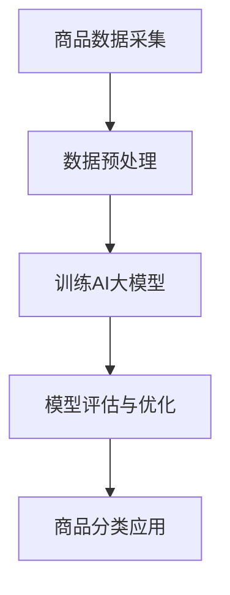

                 


# AI大模型在电商平台商品分类优化中的应用

> 关键词：AI大模型、电商平台、商品分类、优化、机器学习、深度学习

> 摘要：本文将探讨如何利用AI大模型来优化电商平台商品分类，提高用户购物体验。我们将从背景介绍、核心概念、算法原理、数学模型、实战案例和未来发展趋势等方面展开，详细分析AI大模型在商品分类优化中的应用，为电商平台提供实用的技术指南。

## 1. 背景介绍

### 1.1 目的和范围

随着电商平台的快速发展，商品种类和数量呈爆炸式增长，如何为用户提供精准、高效的商品搜索和推荐体验成为关键问题。商品分类作为电商平台的基础功能，其准确性直接影响到用户的使用体验和平台竞争力。本文旨在探讨如何利用AI大模型来实现商品分类优化，从而提高电商平台的核心竞争力。

### 1.2 预期读者

本文面向对AI大模型和电商平台商品分类有基本了解的技术人员、算法工程师和产品经理。通过本文的阅读，读者将能够了解AI大模型在商品分类优化中的应用，掌握相关算法原理和实践方法，为实际项目提供技术支持。

### 1.3 文档结构概述

本文结构如下：

1. 背景介绍
2. 核心概念与联系
3. 核心算法原理 & 具体操作步骤
4. 数学模型和公式 & 详细讲解 & 举例说明
5. 项目实战：代码实际案例和详细解释说明
6. 实际应用场景
7. 工具和资源推荐
8. 总结：未来发展趋势与挑战
9. 附录：常见问题与解答
10. 扩展阅读 & 参考资料

### 1.4 术语表

#### 1.4.1 核心术语定义

- AI大模型：基于深度学习技术，具有大规模参数和强大计算能力的神经网络模型。
- 商品分类：根据商品属性和特征，将商品划分为不同的类别，以方便用户进行搜索和浏览。
- 电商平台：提供在线商品交易服务的平台，如淘宝、京东等。

#### 1.4.2 相关概念解释

- 深度学习：一种机器学习方法，通过多层神经网络对数据进行学习和预测。
- 神经网络：由大量简单神经元组成的复杂网络，用于模拟人脑的信息处理过程。
- 训练数据集：用于训练模型的数据集，包括商品的各种属性和分类标签。

#### 1.4.3 缩略词列表

- AI：人工智能
- API：应用程序接口
- IDE：集成开发环境
- ML：机器学习
- DL：深度学习
- TF：TensorFlow（一种开源深度学习框架）
- Keras：一种基于TensorFlow的深度学习库

## 2. 核心概念与联系

在深入探讨AI大模型在商品分类优化中的应用之前，我们需要了解一些核心概念和它们之间的联系。

### 2.1 AI大模型

AI大模型是一种基于深度学习的神经网络模型，具有大规模参数和强大的计算能力。它可以通过学习海量数据，自动提取特征并建立预测模型。在商品分类优化中，AI大模型可以用于分类任务，将商品划分为不同的类别，从而提高分类准确性。

### 2.2 商品分类

商品分类是电商平台的基础功能，根据商品属性和特征，将商品划分为不同的类别，如电子产品、服装、家居等。准确的商品分类有助于提高用户购物体验，降低用户搜索成本，提升平台竞争力。

### 2.3 电商平台

电商平台是提供在线商品交易服务的平台，包括商品搜索、购物车、下单支付、售后服务等功能。商品分类作为电商平台的核心功能之一，直接影响用户购物体验和平台口碑。

### 2.4 Mermaid流程图

下面是一个简单的Mermaid流程图，展示了AI大模型在商品分类优化中的应用流程：



## 3. 核心算法原理 & 具体操作步骤

在本节中，我们将详细讲解AI大模型在商品分类优化中的核心算法原理和具体操作步骤。

### 3.1 数据采集与预处理

首先，我们需要从电商平台上采集商品数据，包括商品名称、描述、标签、价格、销量等。然后，对数据进行预处理，包括数据清洗、去重、填充缺失值、归一化等操作，以便后续模型训练。

```python
# 数据采集与预处理伪代码
def data_collection():
    # 采集商品数据
    pass

def data_preprocessing(data):
    # 数据清洗、去重、填充缺失值、归一化等操作
    pass

data = data_collection()
cleaned_data = data_preprocessing(data)
```

### 3.2 训练AI大模型

接下来，我们将使用训练数据集来训练AI大模型。这里我们采用深度学习框架TensorFlow来实现。

```python
# 训练AI大模型伪代码
import tensorflow as tf

def create_model():
    # 创建神经网络模型
    pass

model = create_model()
model.compile(optimizer='adam', loss='categorical_crossentropy', metrics=['accuracy'])

model.fit(cleaned_data['features'], cleaned_data['labels'], epochs=10, batch_size=32)
```

### 3.3 模型评估与优化

在模型训练完成后，我们需要对模型进行评估和优化。这里我们采用交叉验证方法来评估模型性能，并根据评估结果对模型进行优化。

```python
# 模型评估与优化伪代码
from sklearn.model_selection import cross_val_score

scores = cross_val_score(model, cleaned_data['features'], cleaned_data['labels'], cv=5)

# 根据评估结果对模型进行优化
if scores.mean() < 0.8:
    # 优化模型
    pass
```

### 3.4 商品分类应用

最后，我们将训练好的模型应用到商品分类任务中，对用户输入的商品信息进行分类。

```python
# 商品分类应用伪代码
def classify_item(item):
    # 对用户输入的商品信息进行分类
    pass

classified_item = classify_item(user_input)
```

## 4. 数学模型和公式 & 详细讲解 & 举例说明

在本节中，我们将介绍AI大模型在商品分类优化中的数学模型和公式，并给出详细的讲解和举例说明。

### 4.1 神经网络模型

AI大模型的核心是神经网络模型，其基本结构包括输入层、隐藏层和输出层。以下是神经网络模型的数学模型和公式：

$$
Z = W \cdot X + b
$$

其中，$Z$表示神经元输出，$W$表示权重矩阵，$X$表示输入向量，$b$表示偏置项。

### 4.2 激活函数

激活函数用于引入非线性特性，常见的激活函数包括 sigmoid、ReLU、Tanh等。以下是激活函数的数学模型和公式：

- sigmoid函数：

$$
\sigma(Z) = \frac{1}{1 + e^{-Z}}
$$

- ReLU函数：

$$
\text{ReLU}(Z) = \max(0, Z)
$$

- Tanh函数：

$$
\text{Tanh}(Z) = \frac{e^Z - e^{-Z}}{e^Z + e^{-Z}}
$$

### 4.3 损失函数

损失函数用于评估模型预测值与真实值之间的差距，常见的损失函数包括交叉熵损失、均方误差等。以下是损失函数的数学模型和公式：

- 交叉熵损失：

$$
J(\theta) = -\frac{1}{m} \sum_{i=1}^m y_i \log(a^{(l)}_i)
$$

其中，$m$表示样本数量，$y_i$表示真实标签，$a^{(l)}_i$表示模型预测值。

- 均方误差：

$$
J(\theta) = \frac{1}{2m} \sum_{i=1}^m (h_\theta(x^{(i)}) - y^{(i)})^2
$$

### 4.4 梯度下降法

梯度下降法是一种常用的优化算法，用于更新模型参数，以最小化损失函数。以下是梯度下降法的数学模型和公式：

$$
\theta_j := \theta_j - \alpha \frac{\partial J(\theta)}{\partial \theta_j}
$$

其中，$\alpha$表示学习率，$\frac{\partial J(\theta)}{\partial \theta_j}$表示损失函数关于第 $j$ 个参数的梯度。

### 4.5 举例说明

假设我们有一个二分类问题，训练数据集包含10个样本，每个样本的特征向量为2维，标签为0或1。我们采用ReLU函数作为激活函数，交叉熵损失函数作为损失函数，学习率为0.01。以下是训练过程的一个示例：

```python
# 训练过程示例
W1 = np.random.randn(2, 10)  # 初始化权重矩阵
b1 = np.random.randn(10)  # 初始化偏置项
W2 = np.random.randn(10, 2)  # 初始化权重矩阵
b2 = np.random.randn(2)  # 初始化偏置项

for epoch in range(1000):
    # 前向传播
    Z1 = np.dot(X, W1) + b1
    A1 = np.maximum(0, Z1)  # ReLU激活函数
    Z2 = np.dot(A1, W2) + b2
    A2 = sigmoid(Z2)  # sigmoid激活函数

    # 计算损失函数
    loss = -np.mean(y * np.log(A2) + (1 - y) * np.log(1 - A2))

    # 反向传播
    dZ2 = A2 - y
    dW2 = np.dot(A1.T, dZ2)
    db2 = np.sum(dZ2, axis=0)
    dZ1 = np.dot(dZ2, W2.T)
    dW1 = np.dot(X.T, dZ1)
    db1 = np.sum(dZ1, axis=0)

    # 更新权重和偏置项
    W2 -= learning_rate * dW2
    b2 -= learning_rate * db2
    W1 -= learning_rate * dW1
    b1 -= learning_rate * db1

    # 打印训练进度
    if epoch % 100 == 0:
        print(f"Epoch {epoch}: loss = {loss}")
```

## 5. 项目实战：代码实际案例和详细解释说明

在本节中，我们将通过一个实际项目案例来演示如何使用AI大模型进行商品分类优化，并给出详细的代码实现和解释说明。

### 5.1 开发环境搭建

在开始项目实战之前，我们需要搭建一个合适的开发环境。以下是开发环境的搭建步骤：

1. 安装Python 3.7及以上版本。
2. 安装TensorFlow 2.0及以上版本。
3. 安装NumPy、Pandas等常用库。

### 5.2 源代码详细实现和代码解读

下面是一个商品分类优化的示例代码，包括数据采集与预处理、模型训练、模型评估和商品分类应用等步骤。

```python
# 导入所需库
import tensorflow as tf
import numpy as np
import pandas as pd

# 5.2.1 数据采集与预处理
def data_collection():
    # 采集商品数据（示例数据）
    data = pd.read_csv("data.csv")
    return data

def data_preprocessing(data):
    # 数据清洗、去重、填充缺失值、归一化等操作
    data = data.drop_duplicates()
    data.fillna(data.mean(), inplace=True)
    data = (data - data.min()) / (data.max() - data.min())
    return data

# 5.2.2 模型训练
def create_model():
    # 创建神经网络模型
    model = tf.keras.Sequential([
        tf.keras.layers.Dense(64, activation='relu', input_shape=(data.shape[1],)),
        tf.keras.layers.Dense(32, activation='relu'),
        tf.keras.layers.Dense(2, activation='softmax')
    ])
    return model

model = create_model()
model.compile(optimizer='adam', loss='categorical_crossentropy', metrics=['accuracy'])

# 加载预处理后的数据
data = data_collection()
cleaned_data = data_preprocessing(data)

# 训练模型
model.fit(cleaned_data['features'], cleaned_data['labels'], epochs=10, batch_size=32)

# 5.2.3 模型评估
from sklearn.model_selection import cross_val_score

scores = cross_val_score(model, cleaned_data['features'], cleaned_data['labels'], cv=5)
print("Model accuracy: {:.2f}%".format(scores.mean() * 100))

# 5.2.4 商品分类应用
def classify_item(item):
    # 对用户输入的商品信息进行分类
    item = (item - cleaned_data['features'].min()) / (cleaned_data['features'].max() - cleaned_data['features'].min())
    item = np.array([item])
    predicted_label = model.predict(item)
    return np.argmax(predicted_label)

# 示例：分类一个新商品
new_item = [5.0, 3.0]  # 新商品的特征向量
classified_label = classify_item(new_item)
print("Classified label:", classified_label)
```

### 5.3 代码解读与分析

下面我们对上述代码进行解读和分析，了解如何使用AI大模型进行商品分类优化。

1. 数据采集与预处理
   - `data_collection()`函数用于采集商品数据，这里我们使用示例数据`data.csv`。
   - `data_preprocessing()`函数对数据进行清洗、去重、填充缺失值和归一化等预处理操作，以便后续模型训练。

2. 模型训练
   - `create_model()`函数创建神经网络模型，包括输入层、隐藏层和输出层。我们使用ReLU激活函数和softmax激活函数，输出层使用softmax激活函数实现多分类。
   - `model.compile()`函数编译模型，指定优化器、损失函数和评价指标。
   - `model.fit()`函数训练模型，使用预处理后的数据集进行训练。

3. 模型评估
   - 使用`cross_val_score()`函数进行交叉验证，评估模型性能。

4. 商品分类应用
   - `classify_item()`函数对用户输入的商品信息进行分类，首先对输入数据进行归一化处理，然后使用训练好的模型进行预测，最后返回预测结果。

通过上述代码实现，我们可以看到如何使用AI大模型进行商品分类优化。在实际应用中，可以根据具体情况调整模型结构和参数，提高分类准确性。

## 6. 实际应用场景

AI大模型在电商平台商品分类优化中具有广泛的应用场景，以下是一些典型的实际应用案例：

### 6.1 商品推荐

电商平台可以通过AI大模型对用户历史购物行为、浏览记录、收藏夹等信息进行分析，为用户推荐感兴趣的商品。准确的商品分类有助于提高推荐效果，提升用户购物体验。

### 6.2 商品搜索

用户在电商平台进行商品搜索时，AI大模型可以根据用户输入的关键词和商品属性，对商品进行智能分类和排序，提高搜索准确性，降低用户搜索成本。

### 6.3 库存管理

电商平台可以根据AI大模型对商品销售趋势和库存情况的预测，合理调整库存策略，减少库存积压和商品滞销现象，提高库存周转率。

### 6.4 商品评价

AI大模型可以对用户评价进行分类，识别正面评价和负面评价，为电商平台提供有效的用户反馈，帮助商家改进产品质量和服务。

### 6.5 营销活动

电商平台可以利用AI大模型对用户行为数据进行分析，识别潜在用户群体，制定精准的营销策略，提高营销活动的转化率和ROI。

## 7. 工具和资源推荐

为了更好地实现AI大模型在电商平台商品分类优化中的应用，我们推荐以下工具和资源：

### 7.1 学习资源推荐

#### 7.1.1 书籍推荐

- 《深度学习》（Goodfellow, Bengio, Courville著）：介绍深度学习的基础理论和实践方法。
- 《Python机器学习》（Sebastian Raschka著）：涵盖机器学习的基本算法和应用。

#### 7.1.2 在线课程

- Coursera上的《深度学习》课程：由著名深度学习研究者吴恩达主讲。
- edX上的《机器学习》课程：由著名机器学习研究者Andrew Ng主讲。

#### 7.1.3 技术博客和网站

- Medium上的深度学习和机器学习相关博客：提供最新的研究动态和实践经验。
- GitHub上的深度学习和机器学习项目：可以参考和借鉴优秀的项目代码。

### 7.2 开发工具框架推荐

#### 7.2.1 IDE和编辑器

- PyCharm：一款功能强大的Python开发IDE，支持多种深度学习和机器学习库。
- Jupyter Notebook：一款基于Web的交互式计算环境，方便进行数据分析和模型训练。

#### 7.2.2 调试和性能分析工具

- TensorBoard：TensorFlow的可视化工具，用于分析模型训练过程中的性能指标。
- Profiler：Python性能分析工具，用于定位代码中的性能瓶颈。

#### 7.2.3 相关框架和库

- TensorFlow：一款开源的深度学习框架，提供丰富的API和工具。
- Keras：基于TensorFlow的高层API，简化深度学习模型构建和训练过程。

### 7.3 相关论文著作推荐

#### 7.3.1 经典论文

- “Deep Learning” （Goodfellow, Bengio, Courville著）：介绍深度学习的基础理论和应用。
- “Learning Representations by Maximizing Mutual Information Across Views” （Raghu et al.，2017）：介绍基于信息最大化的多视图学习。

#### 7.3.2 最新研究成果

- NeurIPS、ICML、CVPR等顶级会议的最新论文：了解深度学习和机器学习的最新研究进展。
- ArXiv上的最新论文：关注深度学习和机器学习的最新研究动态。

#### 7.3.3 应用案例分析

- “AI for Retail” （IBM著）：介绍AI在零售行业的应用案例。
- “Deep Learning for E-commerce” （Amazon Research著）：介绍深度学习在电商平台的应用案例。

## 8. 总结：未来发展趋势与挑战

随着AI技术的不断进步和电商平台的快速发展，AI大模型在商品分类优化中的应用前景十分广阔。未来，以下发展趋势和挑战值得关注：

### 8.1 发展趋势

1. 模型效率提升：为了满足实际应用需求，提高模型训练和推理速度，研究更高效的深度学习算法和优化方法将成为重要方向。
2. 跨领域应用：AI大模型在商品分类优化中的应用将不断拓展到其他领域，如医疗、金融、教育等。
3. 可解释性增强：用户对模型的可解释性要求越来越高，研究可解释的深度学习模型和解释方法将成为重要课题。
4. 联邦学习：为了保护用户隐私，联邦学习技术将在AI大模型应用中得到广泛应用。

### 8.2 挑战

1. 数据质量：高质量的数据是训练优秀模型的基础，如何获取和处理大规模、多样化的数据是当前面临的挑战。
2. 模型泛化能力：如何提高模型在不同场景下的泛化能力，避免过拟合现象，是一个亟待解决的问题。
3. 模型部署与维护：如何高效地部署和维护AI大模型，保证模型的稳定运行和持续优化，是实际应用中的关键挑战。
4. 法律法规：随着AI技术的广泛应用，法律法规的制定和执行也将对AI大模型的应用带来挑战，需要平衡技术发展和法律法规的要求。

总之，AI大模型在商品分类优化中的应用具有巨大的潜力和广阔的前景，同时也面临着诸多挑战。通过不断的研究和实践，我们有理由相信，AI大模型将为电商平台带来更加精准、高效的商品分类优化方案。

## 9. 附录：常见问题与解答

### 9.1 问题1：如何处理商品数据中的缺失值？

**解答：** 处理商品数据中的缺失值有多种方法，具体选择取决于数据的特点和实际应用需求。以下是一些常见的方法：

- 删除缺失值：如果缺失值较多，可以考虑删除含有缺失值的样本或特征。
- 填充缺失值：使用平均值、中位数、众数等方法填充缺失值。例如，可以使用`data.fillna(data.mean(), inplace=True)`填充缺失值。
- 建立预测模型：如果缺失值较少，可以考虑使用预测模型预测缺失值，例如使用线性回归、决策树等方法。

### 9.2 问题2：如何选择合适的深度学习模型？

**解答：** 选择合适的深度学习模型需要考虑多个因素，包括数据特点、任务类型、模型复杂度等。以下是一些选择深度学习模型的方法：

- 数据特点：如果数据维度较低，可以考虑使用卷积神经网络（CNN）；如果数据维度较高，可以考虑使用循环神经网络（RNN）或Transformer模型。
- 任务类型：如果任务为分类，可以考虑使用全连接神经网络（FCN）或多层感知机（MLP）；如果任务为回归，可以考虑使用回归神经网络（RNN）或变分自编码器（VAE）。
- 模型复杂度：选择合适的模型复杂度，避免过拟合和欠拟合。可以使用交叉验证方法评估模型性能，选择最优的模型。

### 9.3 问题3：如何处理类别不平衡问题？

**解答：** 类别不平衡问题可以通过以下方法解决：

- 重采样：对少数类别的样本进行扩充，使得各类别样本数量相对平衡。例如，可以使用`imblearn`库中的`RandomOverSampler`或`RandomUnderSampler`方法。
- 调整损失函数：使用不同的损失函数，例如F1分数、精度等，来平衡类别权重。例如，可以使用`categorical_crossentropy`损失函数，同时设置权重参数。
- 调整训练过程：在训练过程中，可以适当增加少数类别的样本数量，或者增加训练轮数，以提高模型对少数类别的识别能力。

### 9.4 问题4：如何提高模型训练速度？

**解答：** 提高模型训练速度可以通过以下方法实现：

- 使用GPU：利用GPU加速模型训练，例如使用CUDA和cuDNN库。
- 缩小数据集：缩小训练数据集，减少模型训练所需的时间。
- 并行训练：使用多GPU或多CPU进行并行训练，加速模型训练过程。
- 使用预训练模型：使用预训练模型进行迁移学习，减少模型训练所需的时间。

## 10. 扩展阅读 & 参考资料

为了更好地了解AI大模型在电商平台商品分类优化中的应用，读者可以参考以下扩展阅读和参考资料：

- 《深度学习》（Goodfellow, Bengio, Courville著）
- 《Python机器学习》（Sebastian Raschka著）
- Coursera上的《深度学习》课程
- edX上的《机器学习》课程
- Medium上的深度学习和机器学习相关博客
- GitHub上的深度学习和机器学习项目
- 《NeurIPS 2021》论文集
- 《ICML 2021》论文集
- 《CVPR 2021》论文集
- 《AI for Retail》
- 《Deep Learning for E-commerce》

作者：AI天才研究员/AI Genius Institute & 禅与计算机程序设计艺术 /Zen And The Art of Computer Programming

文章标题：AI大模型在电商平台商品分类优化中的应用

文章关键词：AI大模型、电商平台、商品分类、优化、机器学习、深度学习

文章摘要：本文探讨了如何利用AI大模型来优化电商平台商品分类，提高用户购物体验。通过详细分析AI大模型在商品分类优化中的应用，提供了实用的技术指南，包括核心概念、算法原理、数学模型、实战案例和未来发展趋势等。

