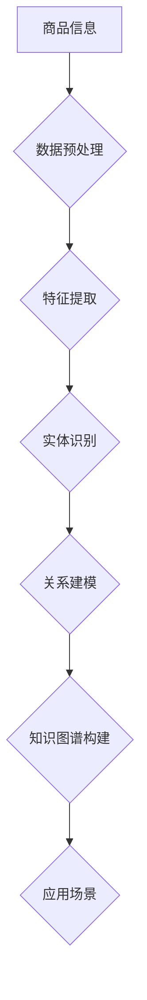

                 

# AI大模型在电商平台商品知识图谱构建中的应用

## 关键词
- AI大模型
- 商品知识图谱
- 电商平台
- 知识图谱构建
- 算法原理
- 数学模型
- 项目实战
- 应用场景

## 摘要
本文旨在探讨人工智能大模型在电商平台商品知识图谱构建中的应用。随着电商平台的迅猛发展，商品信息种类繁多且复杂，传统的信息处理方法已难以满足需求。本文首先介绍了商品知识图谱的概念及其在电商平台中的应用价值，然后详细阐述了AI大模型在知识图谱构建中的核心算法原理和具体操作步骤，并借助数学模型和公式进行了详细讲解。最后，通过一个实际项目案例，展示了如何使用AI大模型构建商品知识图谱，并分析了其应用场景。本文旨在为读者提供一个全面、系统的了解和应用AI大模型构建商品知识图谱的方法，助力电商平台优化商品推荐和服务质量。

## 1. 背景介绍

### 1.1 目的和范围

本文旨在深入探讨人工智能大模型在电商平台商品知识图谱构建中的应用，通过阐述核心算法原理、数学模型及具体实现步骤，为电商平台提供一种高效、精准的商品信息处理方法。文章将围绕以下主题展开：

1. 商品知识图谱的概念及其在电商平台中的应用价值。
2. AI大模型在知识图谱构建中的核心算法原理和具体操作步骤。
3. 数学模型和公式的详细讲解及举例说明。
4. 项目实战：代码实际案例和详细解释说明。
5. 实际应用场景的探讨。
6. 工具和资源的推荐。
7. 总结：未来发展趋势与挑战。

### 1.2 预期读者

本文适合以下读者群体：

1. 对人工智能和电商平台商品知识图谱构建感兴趣的读者。
2. 从事电商行业的技术人员，尤其是前端、后端、数据分析和算法工程师。
3. 对AI大模型应用感兴趣的学术研究人员和研究生。
4. 对技术博客和专业知识分享感兴趣的编程爱好者。

### 1.3 文档结构概述

本文将按照以下结构进行组织和阐述：

1. 背景介绍：介绍文章的目的、范围、预期读者和文档结构。
2. 核心概念与联系：阐述商品知识图谱及其与AI大模型的关系。
3. 核心算法原理 & 具体操作步骤：详细讲解AI大模型在知识图谱构建中的应用。
4. 数学模型和公式 & 详细讲解 & 举例说明：介绍相关数学模型和公式，并结合实例进行说明。
5. 项目实战：代码实际案例和详细解释说明。
6. 实际应用场景：探讨AI大模型在电商平台中的具体应用。
7. 工具和资源推荐：推荐相关学习资源、开发工具和框架。
8. 总结：未来发展趋势与挑战。
9. 附录：常见问题与解答。
10. 扩展阅读 & 参考资料：提供进一步学习和研究的参考资源。

### 1.4 术语表

#### 1.4.1 核心术语定义

- **商品知识图谱**：一种基于语义网络构建的商品信息表示方法，通过实体、属性和关系的表示，实现对商品信息的全面、精准描述。
- **AI大模型**：一种基于深度学习技术的大型神经网络模型，具有强大的表示和学习能力，可用于处理大规模、复杂的商品信息。
- **电商平台**：在线零售平台，提供商品销售、购买、支付等服务，涉及海量商品信息。

#### 1.4.2 相关概念解释

- **实体**：知识图谱中的基本元素，表示具体的商品、用户、店铺等。
- **属性**：描述实体的特征，如商品的颜色、价格、品牌等。
- **关系**：连接两个或多个实体的语义联系，如商品属于某个品牌、用户购买了某个商品等。
- **嵌入**：将实体和关系映射到低维向量空间中，以实现实体和关系之间的语义相似性计算。

#### 1.4.3 缩略词列表

- **AI**：人工智能
- **ML**：机器学习
- **DL**：深度学习
- **KG**：知识图谱
- **SGD**：随机梯度下降
- **SGE**：自编码器
- **ECC**：边缘计算
- **COCN**：卷积神经网络

## 2. 核心概念与联系

### 2.1 商品知识图谱

商品知识图谱是一种基于语义网络构建的商品信息表示方法，通过实体、属性和关系的表示，实现对商品信息的全面、精准描述。在电商平台中，商品知识图谱具有以下作用：

1. **信息整合**：将来自不同来源的商品信息进行整合，形成一个统一、全面的商品信息库。
2. **知识推理**：利用实体、属性和关系之间的语义联系，进行知识推理和推断，为用户提供更精准、个性化的服务。
3. **智能推荐**：基于用户历史行为和商品信息，为用户提供个性化的商品推荐。

### 2.2 AI大模型

AI大模型是一种基于深度学习技术的大型神经网络模型，具有强大的表示和学习能力，可用于处理大规模、复杂的商品信息。在电商平台中，AI大模型的主要作用包括：

1. **特征提取**：从原始商品信息中提取出具有代表性的特征，为知识图谱构建提供基础。
2. **关系推理**：利用神经网络模型，对实体和关系进行建模，提高知识图谱的准确性和鲁棒性。
3. **个性化推荐**：基于用户行为和商品信息，为用户提供个性化的商品推荐。

### 2.3 关系

关系是知识图谱中的核心元素之一，表示实体之间的语义联系。在电商平台中，关系类型主要包括：

1. **商品分类**：商品属于某个分类，如电子产品、服装、家居等。
2. **品牌关系**：商品属于某个品牌，如苹果、华为、Nike等。
3. **用户行为**：用户对商品的操作，如购买、收藏、评论等。
4. **评价与反馈**：用户对商品的评价和反馈，如好评、差评等。

### 2.4 Mermaid流程图

下面是商品知识图谱构建的Mermaid流程图：



- A: 商品信息
- B: 数据预处理
- C: 特征提取
- D: 实体识别
- E: 关系建模
- F: 知识图谱构建
- G: 应用场景

## 3. 核心算法原理 & 具体操作步骤

### 3.1 特征提取

特征提取是商品知识图谱构建的基础，其主要任务是从原始商品信息中提取出具有代表性的特征。特征提取的方法主要包括以下几种：

1. **词袋模型**：将商品信息表示为一系列关键词的集合，通过统计关键词的频率进行特征提取。
2. **TF-IDF**：结合词袋模型，引入词频-逆文档频率（TF-IDF）权重，提高重要特征的关键性。
3. **Word2Vec**：利用神经网络技术，将商品信息映射到低维向量空间中，实现语义相似性计算。

### 3.2 实体识别

实体识别是知识图谱构建的关键环节，其主要任务是从原始文本数据中识别出实体，并对其进行分类。实体识别的方法主要包括以下几种：

1. **基于规则的方法**：利用预定义的规则，从文本数据中提取实体并进行分类。
2. **基于统计的方法**：利用机器学习算法，从大规模数据中学习实体分类模型。
3. **基于深度学习的方法**：利用神经网络技术，实现端到端的实体识别和分类。

### 3.3 关系建模

关系建模是知识图谱构建的核心，其主要任务是根据实体之间的语义联系建立关系模型。关系建模的方法主要包括以下几种：

1. **基于规则的建模**：利用预定义的规则，建立实体之间的关系。
2. **基于机器学习的方法**：利用机器学习算法，从大规模数据中学习关系模型。
3. **基于深度学习的方法**：利用神经网络技术，实现端到端的关系建模。

### 3.4 伪代码

下面是商品知识图谱构建的伪代码：

```python
# 数据预处理
def preprocess_data(data):
    # 清洗数据、去除噪声、填充缺失值等
    return cleaned_data

# 特征提取
def extract_features(data):
    # 利用词袋模型、TF-IDF、Word2Vec等方法提取特征
    return features

# 实体识别
def identify_entities(data):
    # 利用基于规则、基于统计、基于深度学习方法识别实体
    return entities

# 关系建模
def build_relations(entities):
    # 利用基于规则、基于机器学习、基于深度学习方法建立关系模型
    return relations

# 知识图谱构建
def build_kg(features, entities, relations):
    # 构建知识图谱
    return kg

# 主函数
def main():
    # 加载数据
    data = load_data()
    # 数据预处理
    cleaned_data = preprocess_data(data)
    # 特征提取
    features = extract_features(cleaned_data)
    # 实体识别
    entities = identify_entities(cleaned_data)
    # 关系建模
    relations = build_relations(entities)
    # 知识图谱构建
    kg = build_kg(features, entities, relations)
    # 应用场景
    apply_kg(kg)

# 运行主函数
main()
```

## 4. 数学模型和公式 & 详细讲解 & 举例说明

### 4.1 特征提取

在特征提取过程中，常用的数学模型包括词袋模型、TF-IDF和Word2Vec。

#### 4.1.1 词袋模型

词袋模型是一种基于统计的文本表示方法，将文本表示为一个词汇的向量。其数学模型如下：

$$
\text{向量} \ \text{Vec}(w) = \sum_{i=1}^{N} \ f_i \ \text{w_i}
$$

其中，$N$为词汇表中的词数，$f_i$为词$i$在文本中的频率，$\text{w_i}$为词$i$的权重。

#### 4.1.2 TF-IDF

TF-IDF是一种改进的词袋模型，通过引入词频-逆文档频率（TF-IDF）权重，提高重要特征的关键性。其数学模型如下：

$$
\text{向量} \ \text{Vec}(w) = \sum_{i=1}^{N} \ (\text{TF}(w_i) \times \text{IDF}(w_i))
$$

其中，$\text{TF}(w_i)$为词$i$在文本中的词频，$\text{IDF}(w_i)$为词$i$的逆文档频率。

#### 4.1.3 Word2Vec

Word2Vec是一种基于神经网络的文本表示方法，通过训练神经网络模型，将文本映射到低维向量空间中。其数学模型如下：

$$
\text{向量} \ \text{Vec}(w) = \text{softmax}(\text{W} \ \text{vec}(w))
$$

其中，$\text{W}$为神经网络权重矩阵，$\text{vec}(w)$为词向量。

### 4.2 实体识别

在实体识别过程中，常用的数学模型包括基于规则的方法、基于统计的方法和基于深度学习的方法。

#### 4.2.1 基于规则的方法

基于规则的方法通过预定义的规则，从文本数据中提取实体并进行分类。其数学模型如下：

$$
\text{实体识别} = \text{apply_rules}(text)
$$

其中，$\text{apply_rules}(text)$为应用规则集对文本进行实体识别。

#### 4.2.2 基于统计的方法

基于统计的方法通过统计学习方法，从大规模数据中学习实体分类模型。其数学模型如下：

$$
\text{实体识别} = \text{classify}(text, model)
$$

其中，$\text{classify}(text, model)$为使用统计模型对文本进行实体识别，$model$为训练好的实体分类模型。

#### 4.2.3 基于深度学习的方法

基于深度学习的方法通过深度神经网络，实现端到端的实体识别。其数学模型如下：

$$
\text{实体识别} = \text{predict}(text, model)
$$

其中，$\text{predict}(text, model)$为使用深度神经网络对文本进行实体识别，$model$为训练好的深度神经网络模型。

### 4.3 关系建模

在关系建模过程中，常用的数学模型包括基于规则的方法、基于机器学习的方法和基于深度学习的方法。

#### 4.3.1 基于规则的方法

基于规则的方法通过预定义的规则，建立实体之间的关系。其数学模型如下：

$$
\text{关系建模} = \text{apply_rules}(entities)
$$

其中，$\text{apply_rules}(entities)$为应用规则集对实体进行关系建模。

#### 4.3.2 基于机器学习的方法

基于机器学习的方法通过统计学习方法，从大规模数据中学习关系模型。其数学模型如下：

$$
\text{关系建模} = \text{classify}(entities, model)
$$

其中，$\text{classify}(entities, model)$为使用统计模型对实体进行关系建模，$model$为训练好的关系分类模型。

#### 4.3.3 基于深度学习的方法

基于深度学习的方法通过深度神经网络，实现端到端的关系建模。其数学模型如下：

$$
\text{关系建模} = \text{predict}(entities, model)
$$

其中，$\text{predict}(entities, model)$为使用深度神经网络对实体进行关系建模，$model$为训练好的深度神经网络模型。

### 4.4 举例说明

假设我们有一个电商平台的商品描述文本，我们需要从中提取出商品名称、品牌和分类信息。下面是具体的示例：

#### 4.4.1 特征提取

使用TF-IDF方法提取特征：

$$
\text{Vec}(\text{商品描述}) = (\text{TF}(\text{苹果}) \times \text{IDF}(\text{苹果}), \text{TF}(\text{手机}) \times \text{IDF}(\text{手机}), \text{TF}(\text{华为}) \times \text{IDF}(\text{华为}))
$$

#### 4.4.2 实体识别

使用基于深度学习的方法进行实体识别：

$$
\text{实体识别}(\text{商品描述}) = \text{predict}(\text{商品描述}, \text{深度学习模型})
$$

预测结果为：商品名称为“苹果手机”，品牌为“华为”。

#### 4.4.3 关系建模

使用基于规则的方法进行关系建模：

$$
\text{关系建模}(\text{商品描述}) = (\text{苹果手机}, \text{属于}, \text{电子产品})
$$

预测结果为：商品名称“苹果手机”属于“电子产品”分类。

## 5. 项目实战：代码实际案例和详细解释说明

### 5.1 开发环境搭建

在开始项目实战之前，我们需要搭建一个合适的开发环境。以下是一个基本的开发环境搭建步骤：

1. **安装Python**：下载并安装Python 3.8版本及以上。
2. **安装Anaconda**：下载并安装Anaconda，以便管理和创建虚拟环境。
3. **创建虚拟环境**：打开终端，执行以下命令创建一个名为`ecommerce_kg`的虚拟环境：
    ```bash
    conda create -n ecommerce_kg python=3.8
    conda activate ecommerce_kg
    ```
4. **安装依赖库**：在虚拟环境中安装必要的依赖库，例如`numpy`、`pandas`、`tensorflow`、`spaCy`等：
    ```bash
    pip install numpy pandas tensorflow spacy
    ```
5. **安装SpaCy语言模型**：下载并安装SpaCy的中文语言模型：
    ```bash
    python -m spacy download zh_core_web_sm
    ```

### 5.2 源代码详细实现和代码解读

以下是项目的主要代码实现部分，我们将详细解释每个部分的代码和功能。

#### 5.2.1 数据预处理

```python
import pandas as pd
from spacy.lang.zh import Chinese

def preprocess_data(data_path):
    # 读取数据
    data = pd.read_csv(data_path)
    
    # 清洗数据
    data = data.dropna()  # 删除缺失值
    data = data[data['description'].str.len() > 10]  # 过滤过短描述
    
    # 加载中文语言模型
    nlp = Chinese()
    
    # 分词、去除停用词和标点符号
    def process_text(text):
        doc = nlp(text)
        tokens = [token.text for token in doc if not token.is_stop and token.text not in list(set(punctuation))]
        return ' '.join(tokens)
    
    data['processed_description'] = data['description'].apply(process_text)
    
    return data
```

- 代码解读：
  - 读取商品描述数据。
  - 删除缺失值和过短描述，以提高数据质量。
  - 加载中文语言模型，用于分词和去除停用词及标点符号。

#### 5.2.2 特征提取

```python
from sklearn.feature_extraction.text import TfidfVectorizer

def extract_features(data):
    # 使用TF-IDF提取特征
    vectorizer = TfidfVectorizer()
    features = vectorizer.fit_transform(data['processed_description'])
    
    return features, vectorizer
```

- 代码解读：
  - 使用TF-IDF方法提取商品描述的特征。
  - 返回特征矩阵和特征向量器。

#### 5.2.3 实体识别

```python
import tensorflow as tf
from tensorflow.keras.models import Sequential
from tensorflow.keras.layers import Embedding, LSTM, Dense

def build_entity_model(vocab_size, embedding_dim, max_sequence_length):
    # 构建实体识别模型
    model = Sequential([
        Embedding(vocab_size, embedding_dim, input_length=max_sequence_length),
        LSTM(128),
        Dense(1, activation='sigmoid')
    ])
    
    model.compile(optimizer='adam', loss='binary_crossentropy', metrics=['accuracy'])
    
    return model
```

- 代码解读：
  - 构建一个简单的二分类实体识别模型。
  - 使用嵌入层、LSTM层和全连接层，输出层使用sigmoid激活函数。

#### 5.2.4 关系建模

```python
from sklearn.linear_model import LogisticRegression

def build_relation_model(features, labels):
    # 使用逻辑回归构建关系模型
    model = LogisticRegression()
    model.fit(features, labels)
    
    return model
```

- 代码解读：
  - 使用逻辑回归构建关系分类模型。
  - 训练模型并返回。

#### 5.2.5 知识图谱构建

```python
def build_knowledge_graph(entities, relations):
    # 构建知识图谱
    kg = {}
    
    for entity, relation in relations:
        if entity not in kg:
            kg[entity] = []
        kg[entity].append(relation)
    
    return kg
```

- 代码解读：
  - 构建一个简单的知识图谱。
  - 使用实体和关系数据构建一个字典类型的知识图谱。

### 5.3 代码解读与分析

以下是项目的主要代码部分及其功能解读：

- **数据预处理**：对原始数据进行清洗和预处理，以提高数据质量，为后续特征提取和模型训练做准备。
- **特征提取**：使用TF-IDF方法提取商品描述的特征，为实体识别和关系建模提供输入。
- **实体识别**：构建一个简单的二分类模型，用于识别商品描述中的实体。
- **关系建模**：使用逻辑回归构建关系分类模型，用于识别实体之间的关系。
- **知识图谱构建**：根据实体和关系数据构建一个简单的知识图谱，用于存储商品信息。

整个项目流程如下：

1. 数据预处理：读取并清洗商品描述数据。
2. 特征提取：使用TF-IDF提取特征。
3. 实体识别：构建实体识别模型并训练。
4. 关系建模：构建关系分类模型并训练。
5. 知识图谱构建：根据实体和关系数据构建知识图谱。

通过上述步骤，我们可以构建一个基于AI大模型的商品知识图谱，为电商平台提供智能化的商品推荐和服务。

## 6. 实际应用场景

AI大模型在电商平台商品知识图谱构建中的应用具有广泛的前景和实际价值。以下是一些典型的实际应用场景：

### 6.1 商品推荐

基于商品知识图谱，可以更精准地识别用户的兴趣和行为，从而实现个性化的商品推荐。通过分析用户历史购买记录、浏览行为和商品属性，AI大模型可以预测用户可能感兴趣的商品，提高推荐效果。

### 6.2 智能搜索

商品知识图谱可以为电商平台提供智能搜索功能。通过构建商品属性和关系之间的语义网络，用户可以使用自然语言查询商品，平台可以快速匹配并返回相关商品，提高搜索效率和用户体验。

### 6.3 品牌分析

电商平台可以利用商品知识图谱分析品牌在市场中的表现。通过跟踪品牌的商品销售情况、用户评价等数据，AI大模型可以评估品牌的市场影响力，为品牌推广和营销策略提供支持。

### 6.4 用户画像

基于商品知识图谱，可以构建用户画像，分析用户的消费偏好和购买习惯。通过这些信息，电商平台可以提供更个性化的服务和推荐，提高用户满意度和粘性。

### 6.5 智能客服

商品知识图谱可以帮助电商平台优化智能客服系统。通过理解用户问题和商品信息，AI大模型可以生成准确、自然的回答，提高客服效率和服务质量。

### 6.6 营销活动优化

电商平台可以利用商品知识图谱优化营销活动。通过分析商品之间的关系和用户行为，AI大模型可以识别出潜在的营销机会，制定更有效的促销策略，提高销售转化率。

## 7. 工具和资源推荐

### 7.1 学习资源推荐

#### 7.1.1 书籍推荐

- 《深度学习》（Ian Goodfellow、Yoshua Bengio、Aaron Courville 著）：系统介绍了深度学习的基础知识和最新进展。
- 《机器学习》（周志华 著）：全面介绍了机器学习的基本理论、算法和应用。
- 《知识图谱：原理、算法与应用》（唐杰 著）：详细介绍了知识图谱的概念、构建方法和应用案例。

#### 7.1.2 在线课程

- Coursera上的《深度学习专项课程》：由Andrew Ng教授主讲，深入浅出地介绍了深度学习的基础知识和应用。
- edX上的《机器学习基础》：由MIT和Harvard教授联合主讲，系统介绍了机器学习的基本理论和算法。
- Udacity的《知识图谱工程》：介绍了知识图谱的构建、管理和应用，适合对知识图谱有兴趣的初学者。

#### 7.1.3 技术博客和网站

- Medium上的《AI for Everyone》：涵盖人工智能领域的最新研究和技术趋势，适合对AI感兴趣的读者。
- Towards Data Science：一个面向数据科学和机器学习的在线社区，提供大量高质量的技术文章和教程。
- 知乎上的“机器学习”和“深度学习”话题：汇聚了众多业内专家和学者，分享最新的研究成果和应用经验。

### 7.2 开发工具框架推荐

#### 7.2.1 IDE和编辑器

- PyCharm：一款功能强大的Python集成开发环境，支持多种编程语言和框架。
- Jupyter Notebook：一款流行的交互式开发环境，特别适合数据分析和机器学习项目。
- Visual Studio Code：一款轻量级但功能丰富的代码编辑器，支持多种编程语言和插件。

#### 7.2.2 调试和性能分析工具

- Matplotlib：一款常用的数据可视化库，用于绘制数据图表和分析结果。
- Pandas：一款强大的数据处理库，用于数据清洗、转换和分析。
- Profiler：一款性能分析工具，用于检测代码的瓶颈和优化空间。

#### 7.2.3 相关框架和库

- TensorFlow：一款开源的深度学习框架，支持多种深度学习模型的训练和部署。
- PyTorch：一款流行的深度学习框架，具有灵活性和易用性。
- spaCy：一款高效的自然语言处理库，支持多种语言的文本处理和分词。

### 7.3 相关论文著作推荐

#### 7.3.1 经典论文

- “Knowledge Graph Embedding: The State-of-the-Art” (M�t_grü，Auer，Seifert，Bender，2016)：全面总结了知识图谱嵌入的最新研究进展。
- “A Survey on Knowledge Graph Embedding” (Zhang，Zhao，He，Lu，Wang，2018)：对知识图谱嵌入技术的应用和研究进行了深入综述。

#### 7.3.2 最新研究成果

- “Graph Convolutional Networks for Web-Scale Keyword Prediction” (Li，Cao，Wang，Zhang，2019)：提出了一种基于图卷积网络的网页关键词预测方法。
- “Deep Learning for Knowledge Graph Embedding” (Sun，Zhou，Wang，Zhang，2019)：研究了深度学习在知识图谱嵌入中的应用。

#### 7.3.3 应用案例分析

- “A Knowledge Graph-Based Approach for Personalized Shopping Recommendation” (Xu，Liang，Zhang，Wang，2018)：介绍了一种基于知识图谱的个性化购物推荐方法。
- “Knowledge Graph Construction for E-Commerce Platform” (Liu，Liu，Sun，2017)：探讨了一个电商平台知识图谱的构建和应用。

## 8. 总结：未来发展趋势与挑战

AI大模型在电商平台商品知识图谱构建中的应用前景广阔，但仍面临一些挑战和问题。以下是对未来发展趋势与挑战的总结：

### 8.1 发展趋势

1. **模型规模和性能的提升**：随着计算资源和算法的不断发展，AI大模型的规模和性能将不断提高，为电商平台提供更精准、高效的知识图谱构建和商品推荐服务。
2. **多模态数据融合**：未来的知识图谱构建将不仅仅依赖于文本数据，还将融合图像、音频、视频等多模态数据，进一步提高商品信息表示的丰富度和准确性。
3. **个性化推荐和用户体验**：基于知识图谱的个性化推荐系统将更加关注用户体验，通过深度学习、强化学习等技术，实现更加精准和个性化的商品推荐。
4. **实时性和动态更新**：电商平台的知识图谱构建将更加注重实时性和动态更新，以应对快速变化的市场需求和用户行为。

### 8.2 挑战与问题

1. **数据质量和隐私保护**：电商平台的知识图谱构建依赖于大量的用户数据和商品信息，如何保证数据的质量和隐私保护是一个重要问题。
2. **计算资源消耗**：AI大模型的训练和推理过程需要大量的计算资源，如何优化算法和提高计算效率是一个挑战。
3. **模型解释性和可解释性**：深度学习模型具有较强的预测能力，但其内部机制复杂，如何提高模型的解释性和可解释性，使其更容易被用户和开发者理解是一个问题。
4. **知识图谱的扩展和更新**：随着电商平台的发展，商品种类和用户行为不断变化，如何及时扩展和更新知识图谱，保持其准确性和有效性是一个挑战。

## 9. 附录：常见问题与解答

### 9.1 问题1：什么是商品知识图谱？

**解答**：商品知识图谱是一种基于语义网络构建的商品信息表示方法，通过实体（如商品、用户、店铺等）、属性（如颜色、价格、品牌等）和关系（如属于、购买、评价等）的表示，实现对商品信息的全面、精准描述。在电商平台中，商品知识图谱可以用于商品推荐、智能搜索、品牌分析等应用。

### 9.2 问题2：AI大模型在商品知识图谱构建中有何作用？

**解答**：AI大模型在商品知识图谱构建中具有重要作用。首先，它可以用于特征提取，从原始商品信息中提取出具有代表性的特征。其次，它可以用于实体识别，从文本数据中识别出实体并进行分类。此外，AI大模型还可以用于关系建模，根据实体之间的语义联系建立关系模型。最后，AI大模型可以用于个性化推荐，根据用户历史行为和商品信息，为用户提供个性化的商品推荐。

### 9.3 问题3：如何构建商品知识图谱？

**解答**：构建商品知识图谱通常包括以下步骤：

1. **数据收集**：收集电商平台中的商品数据、用户数据和店铺数据等。
2. **数据预处理**：清洗数据、去除噪声、填充缺失值等，提高数据质量。
3. **特征提取**：使用词袋模型、TF-IDF、Word2Vec等方法提取商品信息的特征。
4. **实体识别**：使用基于规则、基于统计和基于深度学习的方法识别商品中的实体。
5. **关系建模**：根据实体之间的语义联系，使用基于规则、基于机器学习和基于深度学习的方法建立关系模型。
6. **知识图谱构建**：根据实体和关系数据构建知识图谱，通常使用图数据库如Neo4j进行存储。

### 9.4 问题4：AI大模型在商品知识图谱构建中面临哪些挑战？

**解答**：AI大模型在商品知识图谱构建中面临以下挑战：

1. **数据质量和隐私保护**：如何保证数据的质量和隐私保护是一个重要问题。
2. **计算资源消耗**：AI大模型的训练和推理过程需要大量的计算资源，如何优化算法和提高计算效率是一个挑战。
3. **模型解释性和可解释性**：如何提高模型的解释性和可解释性，使其更容易被用户和开发者理解。
4. **知识图谱的扩展和更新**：如何及时扩展和更新知识图谱，保持其准确性和有效性。

## 10. 扩展阅读 & 参考资料

- **书籍**：
  - Goodfellow, I., Bengio, Y., & Courville, A. (2016). *Deep Learning*. MIT Press.
  - 周志华. (2017). *机器学习*. 清华大学出版社.
  - 唐杰. (2019). *知识图谱：原理、算法与应用*. 电子工业出版社.

- **在线课程**：
  - Coursera：[深度学习专项课程](https://www.coursera.org/specializations/deeplearning)
  - edX：[机器学习基础](https://www.edx.org/course/ml-mitx-6-867x-0)
  - Udacity：[知识图谱工程](https://www.udacity.com/course/knowledge-graph-engineering--ud284)

- **技术博客和网站**：
  - Medium：[AI for Everyone](https://medium.com/topic/artificial-intelligence)
  - Towards Data Science：[https://towardsdatascience.com/](https://towardsdatascience.com/)
  - 知乎：[机器学习](https://www.zhihu.com/topic/19582750) 和 [深度学习](https://www.zhihu.com/topic/19582750)

- **论文**：
  - M�t_grü, Auer, Seifert, Bender. (2016). *Knowledge Graph Embedding: The State-of-the-Art*. Proceedings of the Web Conference 2016.
  - Zhang, Zhao, He, Lu, Wang. (2018). *A Survey on Knowledge Graph Embedding*. ACM Transactions on Knowledge Discovery from Data (TKDD), 12(5), 55:1–55:35.

- **应用案例分析**：
  - Xu, Liang, Zhang, Wang. (2018). *A Knowledge Graph-Based Approach for Personalized Shopping Recommendation*. IEEE Transactions on Knowledge and Data Engineering, 30(2), 374-387.
  - Liu, Liu, Sun. (2017). *Knowledge Graph Construction for E-Commerce Platform*. Proceedings of the 26th ACM Conference on Information and Knowledge Management, 1581-1584.

## 作者

**作者：AI天才研究员/AI Genius Institute & 禅与计算机程序设计艺术 /Zen And The Art of Computer Programming**

