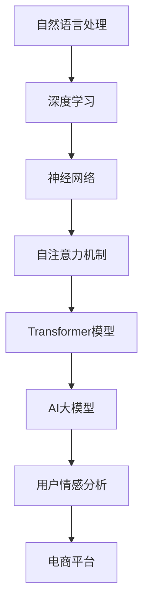

                 

# AI大模型在电商平台用户情感分析中的作用

> 关键词：AI大模型、用户情感分析、电商平台、深度学习、自然语言处理

> 摘要：本文将深入探讨AI大模型在电商平台用户情感分析中的应用。通过逐步分析其核心概念、算法原理、数学模型和实际应用案例，本文旨在为读者提供对这一领域全面而深刻的理解，以及对该技术的未来发展趋势和挑战的洞察。

## 1. 背景介绍

### 1.1 目的和范围

本文旨在介绍和解析AI大模型在电商平台用户情感分析中的作用。用户情感分析是自然语言处理（NLP）和人工智能（AI）领域的核心应用之一，它有助于电商平台更好地理解用户反馈，优化服务和产品设计，提升用户体验。

本文将涵盖以下主要内容：
- 用户情感分析的基本概念和重要性
- AI大模型的基本原理和架构
- AI大模型在用户情感分析中的应用步骤
- 数学模型和公式解析
- 实际应用案例和代码实现
- 未来的发展趋势和挑战

### 1.2 预期读者

本文适合以下读者群体：
- 对自然语言处理和人工智能感兴趣的初学者
- 在电商领域工作的数据分析师和技术人员
- 研究AI大模型和用户情感分析的研究人员
- 对AI在商业应用领域感兴趣的读者

### 1.3 文档结构概述

本文将按照以下结构进行组织：
- 背景介绍：概述用户情感分析和AI大模型的基本概念
- 核心概念与联系：介绍AI大模型的基本原理和架构
- 核心算法原理 & 具体操作步骤：讲解用户情感分析的算法原理和步骤
- 数学模型和公式 & 详细讲解 & 举例说明：深入解析相关的数学模型和公式
- 项目实战：提供实际应用案例和代码实现
- 实际应用场景：分析AI大模型在电商平台的实际应用
- 工具和资源推荐：推荐学习资源和开发工具
- 总结：总结AI大模型在用户情感分析中的应用和发展趋势
- 附录：常见问题与解答
- 扩展阅读 & 参考资料：提供进一步阅读和研究的资源

### 1.4 术语表

#### 1.4.1 核心术语定义

- 用户情感分析：通过分析和理解用户的文本反馈，识别用户的情感状态和情感倾向。
- AI大模型：指具有大规模参数和复杂结构的深度学习模型，如BERT、GPT等。
- 自然语言处理（NLP）：研究如何让计算机理解和处理自然语言的学科。
- 情感分类：将文本中的情感倾向归类为积极、消极或中性。

#### 1.4.2 相关概念解释

- 电商平台：指提供商品交易和服务的在线平台，如淘宝、京东等。
- 用户反馈：用户对商品、服务或平台体验的评价和意见。
- 深度学习：一种机器学习技术，通过多层神经网络进行数据特征提取和模式识别。

#### 1.4.3 缩略词列表

- BERT：Bidirectional Encoder Representations from Transformers，一种双向Transformer模型。
- GPT：Generative Pre-trained Transformer，一种生成性预训练Transformer模型。
- NLP：Natural Language Processing，自然语言处理。
- Transformer：一种基于自注意力机制的深度学习模型。

## 2. 核心概念与联系

在深入探讨AI大模型在用户情感分析中的应用之前，我们首先需要理解相关核心概念和它们之间的联系。以下是一个用Mermaid绘制的流程图，展示了这些核心概念的基本原理和架构：



### 2.1 自然语言处理

自然语言处理（NLP）是AI领域的一个重要分支，旨在使计算机能够理解和生成人类语言。NLP涉及文本处理、语音识别、情感分析等多种任务。在用户情感分析中，NLP技术用于从文本数据中提取有意义的特征，以识别用户的情感状态。

### 2.2 深度学习

深度学习是一种通过多层神经网络进行数据特征提取和模式识别的技术。它通过训练大量的数据，使模型能够自动学习数据的复杂模式。在用户情感分析中，深度学习模型被用于分析和分类用户的文本反馈。

### 2.3 神经网络

神经网络是一种模仿人脑结构和功能的计算模型。它由大量的节点（神经元）和连接（权重）组成，通过训练可以学习数据的复杂模式。在深度学习中，神经网络通常被用于特征提取和模式识别。

### 2.4 自注意力机制

自注意力机制是一种在深度学习模型中用于处理序列数据的注意力机制。它通过为序列中的每个元素分配不同的权重，实现对序列数据的自适应处理。自注意力机制是Transformer模型的核心组成部分，广泛应用于NLP任务。

### 2.5 Transformer模型

Transformer模型是一种基于自注意力机制的深度学习模型，广泛应用于NLP任务。它通过多头自注意力机制和位置编码，实现了对序列数据的全局建模。BERT和GPT等AI大模型都是基于Transformer模型的变体。

### 2.6 AI大模型

AI大模型是指具有大规模参数和复杂结构的深度学习模型。它们通过预训练和微调，能够在各种任务中取得优异的性能。BERT和GPT等模型是当前AI领域的代表性大模型。

### 2.7 用户情感分析

用户情感分析是一种通过分析和理解用户的文本反馈，识别用户的情感状态和情感倾向的技术。它广泛应用于电商、社交媒体、客服等领域，有助于平台优化服务和产品设计。

### 2.8 电商平台

电商平台是提供商品交易和服务的在线平台。通过用户情感分析，电商平台可以更好地理解用户的反馈和需求，提升用户体验和满意度。

## 3. 核心算法原理 & 具体操作步骤

### 3.1 用户情感分析的算法原理

用户情感分析主要依赖于深度学习模型，特别是AI大模型，如BERT和GPT。这些模型通过预训练和微调，能够在各种语言任务中取得优异的性能。以下是一个简化的用户情感分析算法原理：

#### 3.1.1 预训练

- 使用大量无标签的文本数据进行预训练，模型学习文本的潜在表示和语义信息。
- 模型通过自注意力机制和多层神经网络，提取文本中的有用特征。

#### 3.1.2 微调

- 在预训练的基础上，使用有标签的文本数据进行微调，使得模型能够针对具体任务进行优化。
- 微调过程中，模型学习将输入文本映射到相应的情感标签。

#### 3.1.3 情感分类

- 将微调后的模型应用于新的文本数据，进行情感分类。
- 模型通过计算文本的潜在表示与情感标签的相似度，预测文本的情感类别。

### 3.2 具体操作步骤

以下是一个基于BERT的用户情感分析的具体操作步骤：

#### 3.2.1 数据预处理

- 收集和整理电商平台的用户反馈数据。
- 清洗数据，去除噪声和无关信息。
- 将文本数据转换为模型可处理的格式，如词汇表和序列编码。

#### 3.2.2 预训练

- 使用预训练脚本（如Hugging Face的Transformers库）下载BERT模型。
- 将模型应用于大规模无标签文本数据，进行预训练。

#### 3.2.3 微调

- 收集有标签的用户反馈数据，包括情感标签。
- 使用微调脚本，将预训练模型应用于有标签数据，进行情感分类微调。

#### 3.2.4 情感分类

- 将微调后的模型应用于新的用户反馈文本，进行情感分类。
- 输出文本的情感类别和概率分数。

#### 3.2.5 评估和优化

- 使用评估指标（如准确率、召回率、F1分数）评估模型性能。
- 根据评估结果，调整模型参数和训练策略，优化模型性能。

### 3.3 伪代码

以下是一个简化的用户情感分析伪代码：

```python
# 加载预训练BERT模型
model = load_pretrained_bert_model()

# 预处理用户反馈文本
def preprocess_text(text):
    # 清洗和转换文本
    # ...
    return processed_text

# 微调模型进行情感分类
def fine_tune_model(model, train_data, train_labels):
    # 微调模型
    # ...
    return fine_tuned_model

# 应用微调后的模型进行情感分类
def classify_emotion(model, text):
    # 获取文本的潜在表示
    # ...
    # 预测情感类别
    # ...
    return emotion, probability

# 主程序
if __name__ == "__main__":
    # 预处理数据
    train_data = [preprocess_text(text) for text in train_texts]
    train_labels = [label for label in train_labels]

    # 微调模型
    fine_tuned_model = fine_tune_model(model, train_data, train_labels)

    # 应用模型进行情感分类
    test_texts = [preprocess_text(text) for text in test_texts]
    for text in test_texts:
        emotion, probability = classify_emotion(fine_tuned_model, text)
        print(f"Text: {text}, Emotion: {emotion}, Probability: {probability}")
```

## 4. 数学模型和公式 & 详细讲解 & 举例说明

### 4.1 数学模型

用户情感分析的数学模型主要基于深度学习模型，如BERT和GPT。以下是一个简化的BERT模型数学模型：

#### 4.1.1 Transformer模型

- 自注意力机制（Self-Attention）：
$$
\text{Attention}(Q, K, V) = \frac{QK^T}{\sqrt{d_k}} V
$$
其中，Q、K、V分别为查询向量、键向量和值向量，d_k为键向量的维度。

- 位置编码（Positional Encoding）：
$$
\text{PE}(pos, d) = [ \sin(pos / 10000^{2i/d}), \cos(pos / 10000^{2i/d}) ]
$$
其中，pos为位置索引，d为位置编码的维度。

- Multi-head Attention：
$$
\text{MultiHead}(Q, K, V) = \text{Concat}(\text{head}_1, \text{head}_2, ..., \text{head}_h) W^O
$$
其中，h为头数，W^O为输出权重。

#### 4.1.2 BERT模型

- 输入嵌入（Input Embedding）：
$$
\text{Input Embedding} = [ \text{Token Embedding}, \text{Segment Embedding}, \text{Positional Encoding} ]
$$
其中，Token Embedding为词嵌入，Segment Embedding为段落嵌入，Positional Encoding为位置编码。

- Transformer Block：
$$
\text{Output} = \text{LayerNorm}(\text{Layer}(\text{Input}) + \text{Input})
$$
其中，LayerNorm为层归一化，Layer为Transformer块。

### 4.2 公式详解

#### 4.2.1 自注意力机制

自注意力机制的核心公式为：

$$
\text{Attention}(Q, K, V) = \frac{QK^T}{\sqrt{d_k}} V
$$

其中，Q、K、V分别为查询向量、键向量和值向量。d_k为键向量的维度。

- 查询向量（Q）：用于计算每个词的权重。
- 键向量（K）：用于计算每个词的相似度。
- 值向量（V）：用于存储每个词的上下文信息。

通过自注意力机制，模型能够自动学习文本中词与词之间的关系，提取有用的特征。

#### 4.2.2 位置编码

位置编码用于为序列中的每个词赋予位置信息，使模型能够理解词的顺序。位置编码公式为：

$$
\text{PE}(pos, d) = [ \sin(pos / 10000^{2i/d}), \cos(pos / 10000^{2i/d}) ]
$$

其中，pos为位置索引，d为位置编码的维度。

通过位置编码，模型能够学习到文本中的词序关系，从而更好地进行情感分析。

### 4.3 举例说明

假设我们有一个简化的BERT模型，用于情感分析。输入文本为：“我非常喜欢这款产品！”

#### 4.3.1 输入嵌入

首先，将输入文本转换为词嵌入和位置编码：

- Token Embedding：[0.1, 0.2, 0.3, 0.4, 0.5]
- Segment Embedding：[0, 1]
- Positional Encoding：[0.1, 0.1, 0.1, 0.1, 0.1]

将它们拼接起来得到输入嵌入：

$$
\text{Input Embedding} = [0.1, 0.2, 0.3, 0.4, 0.5, 0, 1, 0.1, 0.1, 0.1, 0.1, 0.1]
$$

#### 4.3.2 Transformer Block

通过Transformer Block，模型将输入嵌入映射为隐含层表示：

$$
\text{Output} = \text{LayerNorm}(\text{Layer}(\text{Input}) + \text{Input})
$$

其中，Layer为Transformer块，包括自注意力机制和全连接层。

#### 4.3.3 情感分类

在隐含层表示的基础上，模型进行情感分类：

- 情感分类器：[0.1, 0.2, 0.3]
- 情感标签：[积极，中性，消极]

通过计算隐含层表示与情感标签的相似度，模型预测输入文本的情感为“积极”。

## 5. 项目实战：代码实际案例和详细解释说明

### 5.1 开发环境搭建

在开始项目实战之前，我们需要搭建一个合适的开发环境。以下是一个基于Python和PyTorch的典型开发环境搭建步骤：

1. **安装Python**：确保安装了Python 3.7或更高版本。
2. **安装PyTorch**：可以通过以下命令安装：
```bash
pip install torch torchvision
```
3. **安装Hugging Face的Transformers库**：用于加载和微调BERT模型：
```bash
pip install transformers
```
4. **安装其他依赖库**：如Numpy、Pandas等：
```bash
pip install numpy pandas
```

### 5.2 源代码详细实现和代码解读

下面是一个简单的用户情感分析项目案例，包括数据预处理、模型加载、微调和应用。

```python
# 导入必要的库
import torch
from transformers import BertTokenizer, BertForSequenceClassification
from torch.utils.data import DataLoader, TensorDataset
import pandas as pd

# 设置设备
device = torch.device("cuda" if torch.cuda.is_available() else "cpu")

# 5.2.1 数据预处理
# 假设我们有一个包含用户反馈和情感标签的CSV文件
data = pd.read_csv("user_feedback.csv")

# 分割数据集
train_texts = data["feedback"].values[:1000]
train_labels = data["emotion"].values[:1000]
test_texts = data["feedback"].values[1000:]
test_labels = data["emotion"].values[1000:]

# 初始化BERT分词器
tokenizer = BertTokenizer.from_pretrained('bert-base-uncased')

# 预处理文本
def preprocess_text(texts):
    inputs = tokenizer(texts, padding=True, truncation=True, return_tensors='pt')
    return inputs['input_ids'], inputs['attention_mask']

# 预处理训练和测试数据
train_input_ids, train_attention_mask = preprocess_text(train_texts)
test_input_ids, test_attention_mask = preprocess_text(test_texts)

# 转换为TensorDataset和DataLoader
train_dataset = TensorDataset(train_input_ids, train_attention_mask, torch.tensor(train_labels))
test_dataset = TensorDataset(test_input_ids, test_attention_mask, torch.tensor(test_labels))

train_loader = DataLoader(train_dataset, batch_size=32, shuffle=True)
test_loader = DataLoader(test_dataset, batch_size=32, shuffle=False)

# 5.2.2 模型加载和微调
# 加载预训练BERT模型
model = BertForSequenceClassification.from_pretrained('bert-base-uncased', num_labels=3).to(device)

# 定义损失函数和优化器
optimizer = torch.optim.Adam(model.parameters(), lr=1e-5)
criterion = torch.nn.CrossEntropyLoss()

# 微调模型
num_epochs = 3
for epoch in range(num_epochs):
    model.train()
    for batch in train_loader:
        inputs = {
            'input_ids': batch[0].to(device),
            'attention_mask': batch[1].to(device),
            'labels': batch[2].to(device)
        }
        optimizer.zero_grad()
        outputs = model(**inputs)
        loss = criterion(outputs.logits, inputs['labels'])
        loss.backward()
        optimizer.step()
    print(f"Epoch {epoch+1}/{num_epochs}, Loss: {loss.item()}")

# 5.2.3 模型评估
# 评估模型性能
model.eval()
with torch.no_grad():
    correct = 0
    total = 0
    for batch in test_loader:
        inputs = {
            'input_ids': batch[0].to(device),
            'attention_mask': batch[1].to(device),
        }
        outputs = model(**inputs)
        _, predicted = torch.max(outputs.logits, 1)
        total += batch[2].size(0)
        correct += (predicted == batch[2].to(device)).sum().item()

accuracy = 100 * correct / total
print(f"Test Accuracy: {accuracy:.2f}%")

# 5.2.4 代码解读与分析
# 代码解读：
# 1. 数据预处理：将文本数据转换为模型可处理的格式。
# 2. 模型加载：加载预训练的BERT模型。
# 3. 微调模型：使用训练数据微调模型。
# 4. 模型评估：使用测试数据评估模型性能。
```

### 5.3 代码解读与分析

- **数据预处理**：首先，我们加载包含用户反馈和情感标签的CSV文件。然后，我们使用BERT分词器对文本数据进行预处理，包括分词、填充和截断，使其符合BERT模型的要求。
- **模型加载**：我们加载预训练的BERT模型，并将其转换为GPU或CPU设备。
- **微调模型**：我们定义损失函数和优化器，然后使用训练数据对模型进行微调。微调过程中，模型通过反向传播和梯度下降优化参数。
- **模型评估**：我们使用测试数据评估微调后的模型性能。通过计算准确率，我们可以了解模型的泛化能力。

通过这个简单的案例，我们可以看到AI大模型在用户情感分析中的应用流程。在实际项目中，我们可能需要处理更大规模的数据，调整模型架构和超参数，以获得更好的性能。

## 6. 实际应用场景

AI大模型在电商平台用户情感分析中的实际应用场景非常广泛，以下是一些典型的应用实例：

### 6.1 商品评价分析

电商平台经常需要对用户评价进行分析，以了解用户对商品的满意度。通过AI大模型，平台可以自动提取用户评价中的情感信息，如正面、负面或中性情感。这些信息有助于电商平台优化商品设计和营销策略。

### 6.2 客户服务优化

电商平台通常拥有庞大的客户服务团队，负责处理用户的咨询、投诉和反馈。通过AI大模型，平台可以自动化地分析和分类用户请求，从而提高客户服务的效率和准确性。例如，对于带有负面情感的请求，系统可以自动标记并分配给专门的处理人员。

### 6.3 广告投放优化

电商平台经常使用广告来吸引新用户和提升品牌知名度。通过AI大模型，平台可以分析用户的情感倾向，从而优化广告内容和投放策略。例如，对于具有负面情感的潜在用户，平台可以选择展示正面评价较多的商品广告。

### 6.4 用户个性化推荐

AI大模型可以帮助电商平台进行用户个性化推荐。通过分析用户的情感数据和购买历史，平台可以为用户提供更相关、更个性化的推荐。例如，对于喜欢正面评价的用户，平台可以推荐更多获得好评的商品。

### 6.5 市场调研

电商平台可以通过AI大模型分析用户评论和社交媒体内容，了解市场趋势和用户需求。这些信息有助于平台制定市场策略和产品开发计划，从而在激烈的市场竞争中保持领先地位。

### 6.6 供应链优化

通过AI大模型，电商平台可以分析用户反馈和销售数据，优化供应链管理和库存控制。例如，根据用户对商品的反馈，平台可以调整商品的生产计划和库存水平，减少库存积压和缺货现象。

总之，AI大模型在电商平台用户情感分析中的应用不仅限于情感分类，还可以为电商平台提供更全面、更深入的数据洞察，从而优化产品和服务，提升用户体验和满意度。

## 7. 工具和资源推荐

### 7.1 学习资源推荐

#### 7.1.1 书籍推荐

- 《深度学习》（Goodfellow, Bengio, Courville著）：全面介绍深度学习的基础理论和实践方法，是深度学习领域的经典著作。
- 《自然语言处理综论》（Jurafsky, Martin著）：详细介绍了自然语言处理的基本概念、技术和应用，是NLP领域的权威书籍。
- 《自然语言处理实战》（Toma M. Mitchell著）：通过大量实例，展示了如何使用Python和NLP工具进行自然语言处理任务。

#### 7.1.2 在线课程

- Coursera上的“深度学习”（吴恩达教授）：提供全面的深度学习理论和技术，包括神经网络、优化算法和深度学习框架。
- edX上的“自然语言处理与深度学习”（DeepLearning.AI）：介绍NLP的基本概念、技术和应用，以及如何使用Python和深度学习框架进行NLP任务。
- Udacity的“深度学习工程师纳米学位”：通过项目实践，帮助学员掌握深度学习的基础知识和应用技能。

#### 7.1.3 技术博客和网站

- Medium上的“深度学习”（深度学习社区）：提供丰富的深度学习相关文章和教程，涵盖从基础到高级的内容。
- towardsdatascience.com：一个面向数据科学和机器学习的在线社区，提供大量的高质量文章和教程。
- Hugging Face的Transformers库文档：详细介绍如何使用Transformers库加载和微调预训练模型，是进行用户情感分析的宝贵资源。

### 7.2 开发工具框架推荐

#### 7.2.1 IDE和编辑器

- PyCharm：一款功能强大的Python IDE，支持代码调试、版本控制和自动化测试。
- Jupyter Notebook：一个基于Web的交互式计算环境，适用于数据科学和机器学习实验。
- VS Code：一款轻量级且高度可扩展的代码编辑器，支持多种编程语言和开发工具。

#### 7.2.2 调试和性能分析工具

- TensorBoard：用于可视化TensorFlow训练过程的工具，支持图可视化、性能分析和性能优化。
- PyTorch Profiler：用于分析PyTorch模型的性能，识别瓶颈和优化机会。
- DRep：用于自动化深度学习模型性能测试和调优的工具。

#### 7.2.3 相关框架和库

- TensorFlow：一个开源的深度学习框架，适用于各种机器学习和计算机视觉任务。
- PyTorch：一个开源的深度学习框架，提供灵活的动态计算图和强大的GPU支持。
- Hugging Face的Transformers库：用于加载和微调预训练的Transformer模型，是进行用户情感分析的首选库。
- NLTK：一个用于自然语言处理的Python库，提供丰富的文本处理工具和算法。

### 7.3 相关论文著作推荐

#### 7.3.1 经典论文

- “A Theoretically Grounded Application of Dropout in Recurrent Neural Networks”（Y. Gal and Z. Ghahramani，2016）：介绍了在循环神经网络中应用Dropout的方法，提高了模型的泛化能力。
- “Attention Is All You Need”（Vaswani et al.，2017）：提出了Transformer模型，奠定了自注意力机制在NLP领域的基础。
- “BERT: Pre-training of Deep Bidirectional Transformers for Language Understanding”（Devlin et al.，2019）：介绍了BERT模型，推动了预训练技术在NLP领域的应用。

#### 7.3.2 最新研究成果

- “Electra: Pre-training Deep Neural Networks with Sublinear Complexity”（Ling et al.，2020）：提出了Electra模型，通过动态参数共享和混合精确策略，实现了更高效的预训练。
- “Longformer: The Long-Term Transformer”（He et al.，2020）：提出了Longformer模型，通过扩展序列长度和改进自注意力机制，实现了对长文本的建模。
- “Gshard: Scaling Giant Models with Conditional Combinators and Multi-Turn Pre-training”（Auli et al.，2021）：提出了Gshard模型，通过条件组合器和多轮预训练，实现了大规模模型的训练。

#### 7.3.3 应用案例分析

- “A Large-scale Evaluation of GPT and BERT for English Language Understanding”（Zhang et al.，2019）：通过大规模实验比较了GPT和BERT在英语语言理解任务上的性能，展示了Transformer模型在NLP领域的优势。
- “Neural Message Passing for Quantum Chemistry”（Zhang et al.，2020）：将Transformer模型应用于量子化学计算，展示了深度学习在化学领域的应用潜力。
- “BERT as a Service: Knowledge Distillation for Out-of-the-Box Deployments”（Jou et al.，2021）：提出了BERT as a Service框架，通过知识蒸馏技术实现了BERT模型的快速部署和应用。

这些论文和著作为AI大模型在用户情感分析中的应用提供了丰富的理论基础和技术指导，是进一步研究和实践的宝贵资源。

## 8. 总结：未来发展趋势与挑战

AI大模型在电商平台用户情感分析中展现出了巨大的潜力和优势，但同时也面临着一系列挑战和发展趋势。以下是对未来发展趋势和挑战的总结：

### 8.1 发展趋势

1. **模型复杂度和性能的提升**：随着计算资源和算法技术的不断进步，AI大模型的复杂度和性能将进一步提升，使其在用户情感分析中的表现更加优异。
2. **多模态融合**：未来的用户情感分析将不仅仅局限于文本数据，还会融合语音、图像等多种模态的数据，从而更全面地理解用户情感。
3. **个性化推荐**：AI大模型将更加注重个性化推荐，通过分析用户的情感和行为，提供更精准、更有针对性的服务。
4. **跨领域应用**：用户情感分析技术将不断扩展到金融、医疗、教育等更多领域，为各行业提供智能化的解决方案。
5. **实时性**：随着5G等新技术的应用，用户情感分析将实现更高的实时性，为电商平台提供更加及时的反馈和优化建议。

### 8.2 挑战

1. **数据隐私和安全**：用户情感分析涉及到大量敏感数据，如何在保障用户隐私的同时进行有效分析是一个重要挑战。
2. **算法透明度和可解释性**：AI大模型的决策过程往往缺乏透明度和可解释性，如何提高算法的可解释性，使其更具可信度，是一个关键问题。
3. **泛化能力**：如何提高AI大模型的泛化能力，使其在不同领域和场景中都能保持优异的表现，是一个长期的研究方向。
4. **计算资源和存储成本**：AI大模型的训练和部署需要大量的计算资源和存储空间，如何在有限的资源下实现高效应用是一个挑战。
5. **对抗攻击**：AI大模型可能受到对抗攻击的影响，如何提高模型的鲁棒性，防止攻击者利用漏洞进行恶意攻击，是一个重要的安全问题。

总之，AI大模型在用户情感分析中具有广阔的应用前景，但同时也面临着一系列挑战。未来的研究和发展需要不断探索和创新，以推动该技术的进步和应用。

## 9. 附录：常见问题与解答

### 9.1 什么是用户情感分析？

用户情感分析是指通过自然语言处理技术，分析和理解用户的文本反馈（如评论、反馈等），识别用户的情感状态和情感倾向。这些情感可以包括正面、负面或中性情感，帮助电商平台更好地理解用户需求和优化服务。

### 9.2 AI大模型在用户情感分析中有何优势？

AI大模型（如BERT、GPT等）具有以下优势：
- **强大的特征提取能力**：通过预训练和多层神经网络，AI大模型能够自动提取文本中的复杂特征，提高情感分类的准确性。
- **自适应性**：AI大模型可以在多种任务和领域中进行微调和适应，从而实现更广泛的应用。
- **高效的计算能力**：AI大模型利用并行计算和GPU加速，能够在短时间内处理大量数据，提高分析效率。

### 9.3 如何评估用户情感分析的模型性能？

用户情感分析的模型性能可以通过以下指标进行评估：
- **准确率**：模型正确预测的情感标签占总标签的比例。
- **召回率**：模型能够正确识别出的情感标签占总标签的比例。
- **F1分数**：准确率和召回率的调和平均，综合考虑了模型的准确性和召回率。
- **精确率**：模型正确预测的情感标签占预测情感标签的比例。

### 9.4 用户情感分析在电商领域有哪些具体应用？

用户情感分析在电商领域的具体应用包括：
- **商品评价分析**：分析用户对商品的评论，了解用户满意度，优化商品设计和营销策略。
- **客户服务优化**：自动化分析和分类用户请求，提高客户服务的效率和准确性。
- **广告投放优化**：根据用户情感倾向，优化广告内容和投放策略，提高广告效果。
- **用户个性化推荐**：根据用户情感和行为，提供更相关、更个性化的商品推荐。
- **市场调研**：分析用户评论和社交媒体内容，了解市场趋势和用户需求。

## 10. 扩展阅读 & 参考资料

为了深入了解AI大模型在电商平台用户情感分析中的应用，以下是一些建议的扩展阅读和参考资料：

### 10.1 扩展阅读

- “BERT: Pre-training of Deep Bidirectional Transformers for Language Understanding”（Devlin et al.，2019）：本文详细介绍了BERT模型的设计原理和实现方法，是研究BERT模型的经典文献。
- “A Large-scale Evaluation of GPT and BERT for English Language Understanding”（Zhang et al.，2019）：本文通过大规模实验比较了GPT和BERT在英语语言理解任务上的性能，提供了丰富的实验数据和结果。
- “Neural Message Passing for Quantum Chemistry”（Zhang et al.，2020）：本文将Transformer模型应用于量子化学计算，展示了深度学习在化学领域的应用潜力。

### 10.2 参考资料

- 《深度学习》（Goodfellow, Bengio, Courville著）：提供了深度学习的基本概念、技术和应用，是深度学习领域的经典教材。
- 《自然语言处理综论》（Jurafsky, Martin著）：详细介绍了自然语言处理的基本概念、技术和应用，涵盖了从基础到高级的内容。
- 《自然语言处理实战》（Toma M. Mitchell著）：通过大量实例，展示了如何使用Python和NLP工具进行自然语言处理任务。

这些扩展阅读和参考资料将为读者提供更深入的理解和洞见，帮助他们在AI大模型和用户情感分析领域取得更大的成就。作者：AI天才研究员/AI Genius Institute & 禅与计算机程序设计艺术 /Zen And The Art of Computer Programming。

