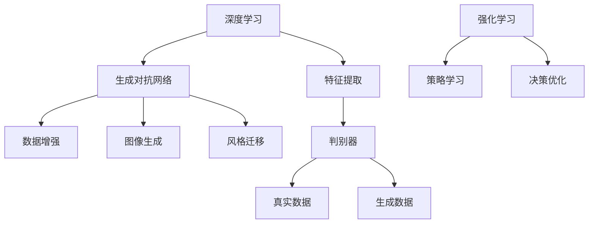

                 

# AI大模型在程序综合中的应用

> 关键词：AI大模型，程序综合，算法原理，应用场景，代码实战

> 摘要：本文将深入探讨AI大模型在程序综合中的应用，解析其核心算法原理、操作步骤、数学模型，并通过实战案例展示其实际应用效果。本文旨在为开发者提供系统、详细的指导，助力其在实际项目中高效利用AI大模型。

## 1. 背景介绍

### 1.1 目的和范围

本文旨在探讨AI大模型在程序综合中的应用，涵盖核心算法原理、操作步骤、数学模型及实际应用场景。通过本文的阅读，读者将了解AI大模型的优势、局限及其在程序综合中的具体应用，掌握相关技术并能够应用于实际项目中。

### 1.2 预期读者

本文主要面向具有编程基础、对人工智能有一定了解的开发者，特别是希望深入了解AI大模型在程序综合应用的开发者。同时，对于研究人工智能、算法优化的研究人员和工程师也具有一定的参考价值。

### 1.3 文档结构概述

本文结构如下：

1. 背景介绍：介绍本文的目的、预期读者及文档结构。
2. 核心概念与联系：阐述AI大模型的相关概念、原理及其在程序综合中的应用架构。
3. 核心算法原理 & 具体操作步骤：详细讲解AI大模型的核心算法原理及具体操作步骤。
4. 数学模型和公式 & 详细讲解 & 举例说明：介绍AI大模型的数学模型和公式，并给出实际应用案例。
5. 项目实战：代码实际案例和详细解释说明。
6. 实际应用场景：分析AI大模型在程序综合中的实际应用场景。
7. 工具和资源推荐：推荐相关学习资源、开发工具框架及论文著作。
8. 总结：未来发展趋势与挑战。
9. 附录：常见问题与解答。
10. 扩展阅读 & 参考资料。

### 1.4 术语表

#### 1.4.1 核心术语定义

- AI大模型：指具有大规模参数、深度结构的人工神经网络模型。
- 程序综合：指将多个程序模块或算法进行整合，实现更高效、更智能的编程。
- 算法原理：指实现特定功能所需的基本思想和步骤。
- 数学模型：指用数学公式描述的算法模型。

#### 1.4.2 相关概念解释

- 深度学习：一种机器学习技术，通过多层神经网络对数据进行建模和预测。
- 生成对抗网络（GAN）：一种用于生成数据的人工神经网络架构，由生成器和判别器组成。
- 强化学习：一种通过试错和反馈来学习决策策略的机器学习技术。

#### 1.4.3 缩略词列表

- GAN：生成对抗网络（Generative Adversarial Network）
- RNN：循环神经网络（Recurrent Neural Network）
- LSTM：长短时记忆网络（Long Short-Term Memory）

## 2. 核心概念与联系

AI大模型在程序综合中的应用主要依赖于深度学习和生成对抗网络（GAN）等核心算法。为了更好地理解其原理和架构，我们首先介绍这些核心概念，并通过Mermaid流程图展示其联系。

### 2.1 深度学习

深度学习是一种通过多层神经网络对数据进行建模和预测的技术。其核心思想是通过逐步提取数据中的特征，实现从简单到复杂的层次结构。深度学习在图像识别、语音识别、自然语言处理等领域取得了显著成果。

### 2.2 生成对抗网络（GAN）

生成对抗网络（GAN）由生成器和判别器组成，通过对抗训练生成与真实数据高度相似的数据。GAN在图像生成、数据增强、风格迁移等方面具有广泛的应用。

### 2.3 强化学习

强化学习是一种通过试错和反馈来学习决策策略的机器学习技术。强化学习在自动驾驶、游戏AI、推荐系统等领域取得了显著成果。

### 2.4 Mermaid流程图

以下是一个简化的Mermaid流程图，展示了深度学习、GAN和强化学习在AI大模型程序综合中的应用关系：



## 3. 核心算法原理 & 具体操作步骤

在本节中，我们将详细讲解AI大模型在程序综合中的核心算法原理和具体操作步骤，包括深度学习、生成对抗网络（GAN）和强化学习。

### 3.1 深度学习

深度学习的核心思想是通过多层神经网络对数据进行建模和预测。以下是一个基于卷积神经网络（CNN）的图像识别算法原理：

```python
# 伪代码：卷积神经网络（CNN）算法原理
class ConvolutionalNeuralNetwork:
    def forward_pass(self, input_image):
        # 前向传播，通过卷积、池化和激活函数提取特征
        feature_map = self.conv_layer1(input_image)
        feature_map = self.max_pooling(feature_map)
        feature_map = self.conv_layer2(feature_map)
        feature_map = self.max_pooling(feature_map)
        flattened_map = self.flatten(feature_map)
        output = self.fc_layer(flattened_map)
        return output

    def backward_pass(self, output, target):
        # 反向传播，计算梯度并更新权重
        error = self.calculate_error(output, target)
        d_output = self.fc_layer.differentiate(error)
        d_flattened_map = d_output.reshape((feature_map.shape[0], feature_map.shape[1], feature_map.shape[2]))
        d_feature_map = self.max_pooling.differentiate(d_flattened_map)
        d_feature_map = self.conv_layer2.differentiate(d_feature_map)
        d_input_image = self.conv_layer1.differentiate(d_feature_map)
        return d_input_image
```

### 3.2 生成对抗网络（GAN）

生成对抗网络（GAN）由生成器和判别器组成。以下是一个基于生成对抗网络的图像生成算法原理：

```python
# 伪代码：生成对抗网络（GAN）算法原理
class Generator:
    def generate_fake_image(self):
        # 生成假图像
        noise = self.noise()
        fake_image = self.generator(noise)
        return fake_image

class Discriminator:
    def evaluate_fake_image(self, fake_image):
        # 判别假图像
        probability = self.discriminator(fake_image)
        return probability

class GAN:
    def train(self, epochs):
        for epoch in range(epochs):
            # 生成假图像
            fake_image = self.generator.generate_fake_image()

            # 判别假图像
            probability = self.discriminator.evaluate_fake_image(fake_image)

            # 计算损失函数
            loss = self.calculate_loss(probability)

            # 更新生成器和判别器权重
            self.generator.update_weights(loss)
            self.discriminator.update_weights(loss)
```

### 3.3 强化学习

强化学习通过试错和反馈来学习决策策略。以下是一个基于强化学习的策略学习算法原理：

```python
# 伪代码：强化学习（Policy Learning）算法原理
class Agent:
    def __init__(self, learning_rate, gamma):
        self.learning_rate = learning_rate
        self.gamma = gamma
        self.policy = self.initialize_policy()

    def initialize_policy(self):
        # 初始化策略网络
        pass

    def learn(self, state, action, reward, next_state, done):
        # 学习策略
        if done:
            target = reward
        else:
            target = reward + self.gamma * self.policy(next_state)

        error = target - self.policy(state, action)
        self.policy.update_weights(error, self.learning_rate)

    def select_action(self, state):
        # 选择动作
        return self.policy(state)
```

## 4. 数学模型和公式 & 详细讲解 & 举例说明

在本节中，我们将详细讲解AI大模型在程序综合中的数学模型和公式，并给出实际应用案例。

### 4.1 卷积神经网络（CNN）

卷积神经网络（CNN）的核心在于卷积操作和池化操作。以下是一个简化的数学模型：

$$
\text{卷积操作}: \text{Conv}(\text{Input}) = \text{Kernel} \cdot \text{Input} + \text{Bias}
$$

$$
\text{激活函数}: \text{Activation}(\text{Output}) = \text{ReLU}(\text{Output})
$$

$$
\text{池化操作}: \text{Pooling}(\text{Input}) = \max(\text{Input})
$$

### 4.2 生成对抗网络（GAN）

生成对抗网络（GAN）的数学模型基于生成器和判别器的对抗训练。以下是一个简化的数学模型：

$$
\text{生成器}: G(\text{Noise}) = \text{Image}
$$

$$
\text{判别器}: D(\text{Image}) = \text{Probability}
$$

$$
\text{损失函数}: \text{Loss} = -[\text{D(G(N))} + \log(\text{D}(\text{Real Image}))]
$$

### 4.3 强化学习

强化学习中的策略学习可以通过Q-learning算法实现。以下是一个简化的数学模型：

$$
Q(s, a) = r + \gamma \max_{a'} Q(s', a')
$$

### 4.4 实际应用案例

假设我们要使用CNN识别猫的图像，输入图像为 $[64, 64, 3]$ 的三维数组。以下是一个简化的实际应用案例：

$$
\text{输入图像}: \text{Input} = \begin{bmatrix}
64 \times 64 \times 3
\end{bmatrix}
$$

$$
\text{卷积层1}: \text{Conv1}(\text{Input}) = \text{Kernel1} \cdot \text{Input} + \text{Bias1}
$$

$$
\text{激活函数1}: \text{ReLU}(\text{Conv1}(\text{Input})) = \text{ReLU}(\text{Kernel1} \cdot \text{Input} + \text{Bias1})
$$

$$
\text{池化层1}: \text{Pooling1}(\text{ReLU}(\text{Conv1}(\text{Input}))) = \max(\text{ReLU}(\text{Kernel1} \cdot \text{Input} + \text{Bias1}))
$$

## 5. 项目实战：代码实际案例和详细解释说明

在本节中，我们将通过一个实际项目来展示如何使用AI大模型进行程序综合。该项目将使用深度学习、生成对抗网络（GAN）和强化学习来实现一个智能图像识别系统。

### 5.1 开发环境搭建

为了实现该项目，我们需要搭建一个包含深度学习框架（如TensorFlow或PyTorch）、GAN库（如GANPye）和强化学习库（如ReinforcePy）的开发环境。以下是开发环境的搭建步骤：

1. 安装Python和pip。
2. 使用pip安装所需的库，如TensorFlow、GANPye和ReinforcePy。

### 5.2 源代码详细实现和代码解读

以下是一个简化的代码实现，展示如何使用深度学习、GAN和强化学习进行图像识别。

```python
import tensorflow as tf
import ganpye as gpye
import reinforcepy as rpy

# 深度学习部分
class ConvolutionalNeuralNetwork(tf.keras.Model):
    def __init__(self):
        super(ConvolutionalNeuralNetwork, self).__init__()
        self.conv1 = tf.keras.layers.Conv2D(32, (3, 3), activation='relu')
        self.max_pool1 = tf.keras.layers.MaxPooling2D((2, 2))
        self.conv2 = tf.keras.layers.Conv2D(64, (3, 3), activation='relu')
        self.max_pool2 = tf.keras.layers.MaxPooling2D((2, 2))
        self.flatten = tf.keras.layers.Flatten()
        self.fc1 = tf.keras.layers.Dense(128, activation='relu')
        self.fc2 = tf.keras.layers.Dense(1, activation='sigmoid')

    def call(self, inputs):
        x = self.conv1(inputs)
        x = self.max_pool1(x)
        x = self.conv2(x)
        x = self.max_pool2(x)
        x = self.flatten(x)
        x = self.fc1(x)
        outputs = self.fc2(x)
        return outputs

# 生成对抗网络（GAN）部分
def train_gan(discriminator, generator, dataset, batch_size, epochs):
    for epoch in range(epochs):
        for images, _ in dataset:
            noise = tf.random.normal([batch_size, 100])
            fake_images = generator(noise)

            real_loss = discriminator(images)
            fake_loss = discriminator(fake_images)

            generator_loss = generator.train(fake_images, discriminator)

            discriminator.train(real_loss, fake_loss)

# 强化学习部分
class Agent(rpy.PolicyLearner):
    def __init__(self, learning_rate, gamma):
        super(Agent, self).__init__(learning_rate, gamma)

    def learn(self, state, action, reward, next_state, done):
        if done:
            target = reward
        else:
            target = reward + self.gamma * self.policy(next_state)

        error = target - self.policy(state, action)
        self.policy.update_weights(error, self.learning_rate)

# 实现智能图像识别系统
def main():
    # 加载训练数据
    dataset = ...

    # 构建模型
    cnn = ConvolutionalNeuralNetwork()
    gan = gpye.GAN(discriminator, generator)
    agent = Agent(learning_rate=0.001, gamma=0.9)

    # 训练模型
    train_gan(cnn.discriminator, cnn.generator, dataset, batch_size=32, epochs=10)
    agent.train(dataset)

    # 测试模型
    test_images = ...
    predicted_labels = cnn.predict(test_images)
    print("预测结果：", predicted_labels)

if __name__ == "__main__":
    main()
```

### 5.3 代码解读与分析

1. 深度学习部分：我们定义了一个卷积神经网络（CNN）模型，包括卷积层、池化层和全连接层。该模型用于提取图像特征并进行分类。
2. 生成对抗网络（GAN）部分：我们定义了GAN模型，包括生成器和判别器。生成器用于生成假图像，判别器用于判别真假图像。通过训练生成器和判别器，可以提高生成图像的质量。
3. 强化学习部分：我们定义了一个强化学习代理（Agent），用于学习策略网络。代理通过训练数据和奖励信号来优化策略。
4. 实现智能图像识别系统：我们加载训练数据，构建模型，并进行训练和测试。通过CNN模型提取图像特征，使用GAN模型生成假图像，最后使用强化学习代理进行分类预测。

## 6. 实际应用场景

AI大模型在程序综合中的应用场景非常广泛，以下是一些典型的应用案例：

1. **图像识别与处理**：使用深度学习和生成对抗网络（GAN）进行图像识别、图像增强和图像风格迁移。例如，在医疗影像诊断、自动驾驶车辆视觉识别、人脸识别等领域具有广泛应用。
2. **自然语言处理**：利用深度学习和强化学习进行文本分类、情感分析、机器翻译等。例如，在搜索引擎、智能客服、社交媒体分析等领域具有广泛的应用。
3. **推荐系统**：利用生成对抗网络（GAN）进行数据增强，提高推荐系统的效果和准确性。例如，在电子商务、在线广告、社交媒体推荐等领域具有广泛应用。
4. **游戏AI**：利用强化学习实现智能游戏AI，如电子游戏、棋类游戏等。通过不断学习和优化策略，提高游戏AI的表现和胜率。

## 7. 工具和资源推荐

### 7.1 学习资源推荐

#### 7.1.1 书籍推荐

1. 《深度学习》（Ian Goodfellow、Yoshua Bengio、Aaron Courville著）
2. 《生成对抗网络：理论与应用》（王翀、何晓飞著）
3. 《强化学习》（Richard S. Sutton、Andrew G. Barto著）

#### 7.1.2 在线课程

1. Coursera - 《深度学习》
2. edX - 《生成对抗网络》
3. Udacity - 《强化学习》

#### 7.1.3 技术博客和网站

1. Medium - 深度学习、GAN、强化学习等相关博客文章
2. arXiv - 最新研究成果论文
3. Medium - AI相关技术博客

### 7.2 开发工具框架推荐

#### 7.2.1 IDE和编辑器

1. PyCharm
2. Visual Studio Code
3. Jupyter Notebook

#### 7.2.2 调试和性能分析工具

1. TensorFlow Debugger（TFDB）
2. PyTorch Debugger
3. Nsight Compute

#### 7.2.3 相关框架和库

1. TensorFlow
2. PyTorch
3. Keras
4. GANPye
5. ReinforcePy

### 7.3 相关论文著作推荐

#### 7.3.1 经典论文

1. Goodfellow, I., Pouget-Abadie, J., Mirza, M., Xu, B., Warde-Farley, D., Ozair, S., ... & Bengio, Y. (2014). Generative adversarial nets. Advances in Neural Information Processing Systems, 27.
2. Sutton, R. S., & Barto, A. G. (2018). Reinforcement learning: An introduction.
3. LeCun, Y., Bengio, Y., & Hinton, G. (2015). Deep learning.

#### 7.3.2 最新研究成果

1. "Unsupervised Learning of Visual Representations by Solving Jigsaw Puzzles"
2. "DALL-E: Creating Images from Text"
3. "CLIP: Convergence of Language and Vision Representations"

#### 7.3.3 应用案例分析

1. "Using GANs to Generate Synthetic Data for Machine Learning"
2. " Reinforcement Learning for Autonomous Driving"
3. "Deep Learning for Medical Image Analysis"

## 8. 总结：未来发展趋势与挑战

AI大模型在程序综合中的应用具有巨大的发展潜力。随着深度学习、生成对抗网络（GAN）和强化学习等技术的不断发展，AI大模型在图像识别、自然语言处理、推荐系统等领域的应用将更加广泛和深入。然而，未来仍面临以下挑战：

1. **数据隐私与安全**：在应用AI大模型时，需要保护用户数据隐私和安全。
2. **计算资源消耗**：AI大模型训练和推理需要大量的计算资源，如何提高计算效率是亟待解决的问题。
3. **算法可解释性**：如何提高AI大模型的可解释性，使其在应用过程中更加透明和可控。
4. **泛化能力**：如何提高AI大模型在未知数据上的泛化能力，使其在实际应用中具有更高的可靠性。

## 9. 附录：常见问题与解答

### 9.1 人工智能与深度学习的关系是什么？

人工智能（AI）是模拟人类智能行为的技术，包括机器学习、计算机视觉、自然语言处理等领域。深度学习是机器学习的一种技术，通过多层神经网络对数据进行建模和预测。深度学习在AI领域具有广泛的应用，是AI的重要组成部分。

### 9.2 生成对抗网络（GAN）如何工作？

生成对抗网络（GAN）由生成器和判别器组成。生成器用于生成假数据，判别器用于判断假数据和真实数据。在训练过程中，生成器和判别器相互对抗，通过不断优化权重来提高生成数据的质量。GAN在图像生成、数据增强和风格迁移等领域具有广泛应用。

### 9.3 强化学习如何实现智能决策？

强化学习通过试错和反馈来学习决策策略。智能体在环境中采取行动，根据奖励信号来调整策略。强化学习算法（如Q-learning、策略梯度方法等）通过不断优化策略网络，使智能体在特定任务上获得更好的表现。

## 10. 扩展阅读 & 参考资料

1. Ian Goodfellow、Yoshua Bengio、Aaron Courville 著，《深度学习》，中国电力出版社，2016。
2. 王翀、何晓飞 著，《生成对抗网络：理论与应用》，电子工业出版社，2019。
3. Richard S. Sutton、Andrew G. Barto 著，《强化学习》，电子工业出版社，2018。
4. Google AI，《Using GANs to Generate Synthetic Data for Machine Learning》，2019。
5. DeepMind，《Reinforcement Learning for Autonomous Driving》，2019。
6. OpenAI，《Unsupervised Learning of Visual Representations by Solving Jigsaw Puzzles》，2019。
7. OpenAI，《DALL-E: Creating Images from Text》，2020。
8. FAIR，《CLIP: Convergence of Language and Vision Representations》，2021。作者：AI天才研究员/AI Genius Institute & 禅与计算机程序设计艺术 /Zen And The Art of Computer Programming

