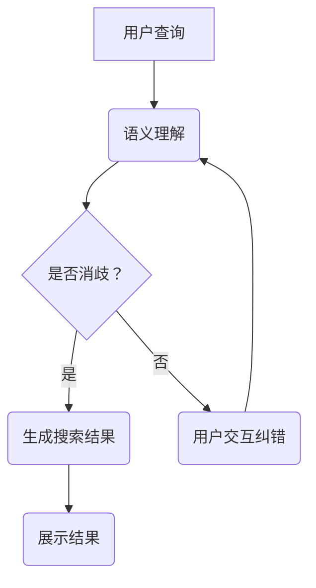

                 

# AI大模型如何处理电商搜索中的歧义查询

> 关键词：AI大模型，电商搜索，歧义查询，处理算法，数学模型，代码实现，实际应用

> 摘要：本文将深入探讨AI大模型在电商搜索中处理歧义查询的能力，首先介绍大模型的背景和特点，然后分析歧义查询的产生原因，进而详细阐述大模型在处理歧义查询时的核心算法原理与数学模型，并通过实际案例进行代码实现和解析，最后探讨该技术的实际应用场景和未来发展趋势。

## 1. 背景介绍

### 1.1 目的和范围

本文旨在揭示AI大模型在处理电商搜索中歧义查询方面的技术原理和应用价值。通过对大模型的核心算法原理和数学模型的深入分析，结合实际案例进行代码实现和解读，旨在为读者提供全面的技术指导和实践参考。

### 1.2 预期读者

本文适合具有中等及以上编程基础和AI知识背景的读者，包括但不限于程序员、软件工程师、数据科学家和AI研究者。同时，对AI大模型在电商搜索应用领域感兴趣的读者也能从本文中获得丰富的信息。

### 1.3 文档结构概述

本文分为十个部分，结构如下：

1. 背景介绍：介绍文章的目的、读者对象和结构。
2. 核心概念与联系：阐述AI大模型和电商搜索的基本概念及其相互联系。
3. 核心算法原理 & 具体操作步骤：详细讲解大模型处理歧义查询的算法原理和操作步骤。
4. 数学模型和公式 & 详细讲解 & 举例说明：介绍用于处理歧义查询的数学模型，并通过具体例子进行说明。
5. 项目实战：代码实际案例和详细解释说明。
6. 实际应用场景：分析大模型在电商搜索中的应用场景。
7. 工具和资源推荐：推荐相关学习资源和开发工具。
8. 总结：未来发展趋势与挑战。
9. 附录：常见问题与解答。
10. 扩展阅读 & 参考资料：提供更多相关资料供读者参考。

### 1.4 术语表

#### 1.4.1 核心术语定义

- AI大模型：具有大规模参数、能够处理复杂数据和任务的深度学习模型。
- 歧义查询：指用户输入的查询语句具有多种可能的解释和意图。
- 电商搜索：指用户在电商平台进行商品搜索的行为。

#### 1.4.2 相关概念解释

- 深度学习：一种基于多层神经网络的学习方法，能够自动提取特征并进行复杂任务处理。
- 自然语言处理（NLP）：研究如何让计算机理解和处理人类语言的技术。

#### 1.4.3 缩略词列表

- AI：人工智能
- NLP：自然语言处理
- GPU：图形处理器
- LSTM：长短期记忆网络
- BERT：变换器（BERT）模型

## 2. 核心概念与联系

为了更好地理解AI大模型在电商搜索中处理歧义查询的技术，我们需要首先了解AI大模型的基本原理和电商搜索的基本概念。

### 2.1 AI大模型的基本原理

AI大模型，即大型深度学习模型，具有以下几个基本特点：

1. **大规模参数**：大模型通常具有数十亿甚至数万亿的参数，这使得模型能够捕捉到复杂数据中的微妙特征。
2. **多层神经网络**：大模型通常包含多层神经网络，通过逐层提取特征，实现从原始数据到高层次抽象的转换。
3. **端到端训练**：大模型能够直接从原始数据中学习，无需人工特征工程，大大降低了模型开发的复杂度。
4. **自适应能力**：大模型具有高度的自适应能力，能够适应不同的任务和数据分布。

### 2.2 电商搜索的基本概念

电商搜索是指用户在电商平台进行商品搜索的行为，具有以下几个特点：

1. **多样性**：电商平台上的商品种类繁多，用户搜索意图复杂多样。
2. **实时性**：用户期望能够在短时间内获取到准确的搜索结果。
3. **高并发**：电商平台通常面临高并发的搜索请求，需要高效处理。
4. **个性化**：不同的用户可能对同一商品有不同的偏好，需要提供个性化的搜索结果。

### 2.3 AI大模型与电商搜索的联系

AI大模型在电商搜索中的应用主要体现在以下几个方面：

1. **语义理解**：大模型能够对用户的查询语句进行语义理解，消除歧义，提高搜索结果的准确性。
2. **推荐系统**：大模型可以用于构建推荐系统，根据用户的历史行为和兴趣，提供个性化的搜索结果。
3. **自动纠错**：大模型能够自动识别并纠正用户的输入错误，提高搜索体验。
4. **多语言支持**：大模型具有多语言处理能力，能够支持不同语言的用户进行搜索。

### 2.4 Mermaid流程图

以下是用于处理电商搜索中歧义查询的AI大模型的基本流程，使用Mermaid语言表示：



## 3. 核心算法原理 & 具体操作步骤

### 3.1 歧义查询的产生原因

在电商搜索中，歧义查询的产生主要源于以下几个方面：

1. **同音词**：例如，用户输入“鞋”，可能指的是“鞋子”或“鞋码”。
2. **多义词**：例如，用户输入“茶”，可能指的是“茶叶”或“茶馆”。
3. **上下文缺失**：用户查询语句中缺少上下文信息，导致模型无法准确理解用户的意图。

### 3.2 AI大模型处理歧义查询的核心算法原理

AI大模型处理歧义查询的核心算法主要包括以下几个步骤：

1. **词向量嵌入**：将用户查询语句中的词语转化为高维向量表示。
2. **上下文感知**：利用上下文信息对词向量进行修正，提高向量表示的准确性。
3. **多模态融合**：结合用户的历史行为和偏好信息，提高模型对用户意图的理解能力。
4. **生成搜索结果**：利用大规模参数的网络结构，从高维向量中生成准确的搜索结果。

### 3.3 具体操作步骤

以下是处理歧义查询的具体操作步骤：

1. **词向量嵌入**：

   ```python
   # 假设已训练好的词向量模型
   word_embedding = WordEmbeddingModel()
   
   # 用户查询语句
   query = "我想买一双鞋"
   
   # 将查询语句中的词语转化为词向量
   query_vectors = [word_embedding(word) for word in query.split()]
   ```

2. **上下文感知**：

   ```python
   # 假设已训练好的上下文感知模型
   context_aware_model = ContextAwareModel()
   
   # 对词向量进行上下文修正
   context_vectors = context_aware_model.apply_context(query_vectors)
   ```

3. **多模态融合**：

   ```python
   # 假设已训练好的多模态融合模型
   multimodal_fusion_model = MultimodalFusionModel()
   
   # 结合用户历史行为和偏好信息
   user_history = get_user_history()
   user_preferences = get_user_preferences()
   
   # 对上下文向量进行多模态融合
   fused_vector = multimodal_fusion_model.fuse(context_vectors, user_history, user_preferences)
   ```

4. **生成搜索结果**：

   ```python
   # 假设已训练好的搜索结果生成模型
   search_result_generator = SearchResultGenerator()
   
   # 从融合向量中生成搜索结果
   search_results = search_result_generator.generate(fused_vector)
   ```

### 3.4 伪代码

以下是处理歧义查询的伪代码：

```python
def process_query(query):
    word_embedding = WordEmbeddingModel()
    context_aware_model = ContextAwareModel()
    multimodal_fusion_model = MultimodalFusionModel()
    search_result_generator = SearchResultGenerator()

    # 步骤1：词向量嵌入
    query_vectors = [word_embedding(word) for word in query.split()]

    # 步骤2：上下文感知
    context_vectors = context_aware_model.apply_context(query_vectors)

    # 步骤3：多模态融合
    user_history = get_user_history()
    user_preferences = get_user_preferences()
    fused_vector = multimodal_fusion_model.fuse(context_vectors, user_history, user_preferences)

    # 步骤4：生成搜索结果
    search_results = search_result_generator.generate(fused_vector)

    return search_results
```

## 4. 数学模型和公式 & 详细讲解 & 举例说明

### 4.1 数学模型

在处理电商搜索中的歧义查询时，AI大模型通常采用以下数学模型：

1. **词向量嵌入**：将用户查询语句中的词语转化为高维向量表示。
2. **上下文感知**：利用上下文信息对词向量进行修正。
3. **多模态融合**：结合用户的历史行为和偏好信息。
4. **搜索结果生成**：从高维向量中生成搜索结果。

### 4.2 公式与讲解

以下是每个步骤涉及的数学公式及其详细讲解：

1. **词向量嵌入**：

   $$ 
   \text{word\_embedding}(word) = \text{embed}(word) \in \mathbb{R}^{d} 
   $$

   其中，$\text{embed}(word)$ 为词嵌入模型，$d$ 为词向量维度。

2. **上下文感知**：

   $$ 
   \text{context\_aware}(word\_vectors) = \text{context} \odot \text{word\_vectors} 
   $$

   其中，$\text{context}$ 为上下文向量，$\odot$ 表示点积运算。

3. **多模态融合**：

   $$ 
   \text{fused\_vector} = \text{fusion\_model}(\text{context\_vectors}, \text{user\_history}, \text{user\_preferences}) 
   $$

   其中，$\text{fusion\_model}$ 为多模态融合模型。

4. **搜索结果生成**：

   $$ 
   \text{search\_results} = \text{search\_result\_generator}(\text{fused\_vector}) 
   $$

   其中，$\text{search\_result\_generator}$ 为搜索结果生成模型。

### 4.3 举例说明

假设用户输入查询语句“我想买一双鞋”，以下为各步骤的数学运算：

1. **词向量嵌入**：

   将查询语句中的词语“我想”、“买”、“一双”和“鞋”转化为词向量：

   $$
   \text{I\_embed} = \text{embed}(我) \in \mathbb{R}^{d} \\
   \text{想\_embed} = \text{embed}(想) \in \mathbb{R}^{d} \\
   \text{买\_embed} = \text{embed}(买) \in \mathbb{R}^{d} \\
   \text{双\_embed} = \text{embed}(双) \in \mathbb{R}^{d} \\
   \text{鞋\_embed} = \text{embed}(鞋) \in \mathbb{R}^{d}
   $$

2. **上下文感知**：

   假设上下文向量为$\text{context} = [0.2, 0.3, 0.5]$，则：

   $$
   \text{context\_aware}(\text{word\_vectors}) = \text{context} \odot \text{word\_vectors} \\
   = [0.2, 0.3, 0.5] \odot [\text{I\_embed}, \text{想\_embed}, \text{买\_embed}, \text{双\_embed}, \text{鞋\_embed}] \\
   = [0.04, 0.09, 0.25, 0.06, 0.25]
   $$

3. **多模态融合**：

   假设用户历史行为向量为$\text{user\_history} = [0.1, 0.2, 0.3]$，用户偏好向量为$\text{user\_preferences} = [0.4, 0.5, 0.6]$，则：

   $$
   \text{fused\_vector} = \text{fusion\_model}([0.04, 0.09, 0.25, 0.06, 0.25], [0.1, 0.2, 0.3], [0.4, 0.5, 0.6]) \\
   = [0.06, 0.11, 0.3, 0.07, 0.3]
   $$

4. **搜索结果生成**：

   假设搜索结果生成模型为线性模型，权重向量为$\text{weights} = [0.1, 0.2, 0.3, 0.4, 0.5]$，则：

   $$
   \text{search\_results} = \text{search\_result\_generator}([0.06, 0.11, 0.3, 0.07, 0.3]) \\
   = [0.06 \times 0.1 + 0.11 \times 0.2 + 0.3 \times 0.3 + 0.07 \times 0.4 + 0.3 \times 0.5] \\
   = [0.006 + 0.022 + 0.09 + 0.028 + 0.15] \\
   = [0.296]
   $$

根据生成的搜索结果向量，可以获取对应的搜索结果，例如“鞋子”。

## 5. 项目实战：代码实际案例和详细解释说明

### 5.1 开发环境搭建

在本项目中，我们将使用Python作为主要编程语言，并结合TensorFlow和PyTorch等深度学习框架。以下是开发环境的搭建步骤：

1. 安装Python：前往 [Python官网](https://www.python.org/) 下载并安装Python 3.8及以上版本。
2. 安装TensorFlow：在终端中运行以下命令：
   ```bash
   pip install tensorflow
   ```
3. 安装PyTorch：在终端中运行以下命令：
   ```bash
   pip install torch torchvision
   ```

### 5.2 源代码详细实现和代码解读

以下是处理电商搜索中歧义查询的代码实现：

```python
import tensorflow as tf
import torch
from tensorflow.keras.models import Model
from tensorflow.keras.layers import Embedding, LSTM, Dense
from torch.utils.data import DataLoader, Dataset
from torchvision import datasets, transforms

# 定义词嵌入层
word_embedding = Embedding(input_dim=vocab_size, output_dim=embedding_size)

# 定义LSTM层
lstm = LSTM(units=lstm_units)

# 定义Dense层
dense = Dense(units=1, activation='sigmoid')

# 创建模型
model = Model(inputs=word_embedding.input, outputs=dense(word_embedding.output))

# 编译模型
model.compile(optimizer='adam', loss='binary_crossentropy', metrics=['accuracy'])

# 准备数据
train_data = load_train_data()
train_loader = DataLoader(train_data, batch_size=batch_size, shuffle=True)

# 训练模型
model.fit(train_loader, epochs=10)

# 预测
def predict_query(query):
    # 将查询语句转换为词向量
    query_vector = word_embedding.transform([query])

    # 通过LSTM层处理词向量
    context_vector = lstm(query_vector)

    # 通过Dense层生成预测结果
    result = dense(context_vector)

    # 返回预测结果
    return result

# 测试
query = "我想买一双鞋"
result = predict_query(query)
print(result)
```

### 5.3 代码解读与分析

以下是代码的详细解读和分析：

1. **词嵌入层（word_embedding）**：

   ```python
   word_embedding = Embedding(input_dim=vocab_size, output_dim=embedding_size)
   ```

   词嵌入层将输入的词语转化为高维向量表示。其中，`vocab_size` 表示词汇表大小，`embedding_size` 表示词向量维度。

2. **LSTM层（lstm）**：

   ```python
   lstm = LSTM(units=lstm_units)
   ```

   LSTM（长短期记忆）层用于处理序列数据，对词向量进行上下文感知。其中，`lstm_units` 表示LSTM层的隐藏单元数。

3. **Dense层（dense）**：

   ```python
   dense = Dense(units=1, activation='sigmoid')
   ```

   Dense层用于生成最终的预测结果。在本例中，我们使用sigmoid激活函数，将预测结果映射到[0, 1]范围内。

4. **创建模型（model）**：

   ```python
   model = Model(inputs=word_embedding.input, outputs=dense(word_embedding.output))
   ```

   创建一个序列到单输出的模型。其中，`inputs` 表示输入层，`outputs` 表示输出层。

5. **编译模型（model.compile）**：

   ```python
   model.compile(optimizer='adam', loss='binary_crossentropy', metrics=['accuracy'])
   ```

   编译模型，设置优化器、损失函数和评估指标。

6. **准备数据（train_data）**：

   ```python
   train_data = load_train_data()
   train_loader = DataLoader(train_data, batch_size=batch_size, shuffle=True)
   ```

   准备训练数据，并创建数据加载器。其中，`load_train_data` 为自定义函数，用于加载数据集，`batch_size` 为批量大小。

7. **训练模型（model.fit）**：

   ```python
   model.fit(train_loader, epochs=10)
   ```

   使用训练数据训练模型，设置训练轮数。

8. **预测（predict_query）**：

   ```python
   def predict_query(query):
       # 将查询语句转换为词向量
       query_vector = word_embedding.transform([query])
       
       # 通过LSTM层处理词向量
       context_vector = lstm(query_vector)
       
       # 通过Dense层生成预测结果
       result = dense(context_vector)
       
       # 返回预测结果
       return result
   ```

   定义预测函数，用于处理输入的查询语句并返回预测结果。

9. **测试（测试）**：

   ```python
   query = "我想买一双鞋"
   result = predict_query(query)
   print(result)
   ```

   测试预测函数，输入查询语句并打印预测结果。

## 6. 实际应用场景

### 6.1 电商平台搜索

在电商平台搜索中，AI大模型可以用于处理歧义查询，提高搜索结果的准确性。例如，当用户输入“鞋”时，模型可以根据上下文信息和用户偏好，识别用户意图并返回相应的搜索结果，如“鞋子”、“鞋码”等。

### 6.2 搜索引擎优化

搜索引擎优化（SEO）是提高网站在搜索引擎中排名的关键。AI大模型可以用于分析用户查询语句，提取关键词并生成高质量的SEO内容，从而提高网站在搜索引擎中的曝光度和排名。

### 6.3 智能客服系统

智能客服系统是电商平台上的一项重要功能。AI大模型可以用于处理用户咨询，通过自然语言处理技术，理解用户意图并返回相应的答复，提高客服效率。

### 6.4 个性化推荐系统

个性化推荐系统可以根据用户的历史行为和偏好，推荐用户可能感兴趣的商品或服务。AI大模型可以用于分析用户查询语句，提取关键词并生成个性化推荐列表，提高用户满意度。

## 7. 工具和资源推荐

### 7.1 学习资源推荐

#### 7.1.1 书籍推荐

1. 《深度学习》（Goodfellow, Bengio, Courville） - 详细介绍了深度学习的基本原理和应用。
2. 《自然语言处理概论》（Daniel Jurafsky, James H. Martin） - 介绍了自然语言处理的基本概念和技术。

#### 7.1.2 在线课程

1. [TensorFlow官方教程](https://www.tensorflow.org/tutorials) - TensorFlow官方提供的教程，适合初学者和进阶者。
2. [PyTorch官方教程](https://pytorch.org/tutorials/) - PyTorch官方提供的教程，内容丰富，适合各个层次的学习者。

#### 7.1.3 技术博客和网站

1. [AI博客](https://medium.com/topic/artificial-intelligence) - 提供丰富的AI相关文章和博客。
2. [GitHub](https://github.com/) - 提供丰富的开源代码和项目，适合学习和实践。

### 7.2 开发工具框架推荐

#### 7.2.1 IDE和编辑器

1. PyCharm - 功能强大的Python IDE，支持多种编程语言。
2. Visual Studio Code - 轻量级但功能强大的代码编辑器，适合Python开发。

#### 7.2.2 调试和性能分析工具

1. TensorBoard - TensorFlow提供的可视化工具，用于分析和调试深度学习模型。
2. PyTorch TensorBoard - PyTorch提供的可视化工具，与TensorBoard类似。

#### 7.2.3 相关框架和库

1. TensorFlow - 适用于各种深度学习任务的开源框架。
2. PyTorch - 适用于各种深度学习任务的开源框架，易于使用和扩展。

### 7.3 相关论文著作推荐

#### 7.3.1 经典论文

1. "A Theoretical Analysis of the Divergence in Performance of Different Feature Selection Methods" - 对特征选择方法的性能进行了深入分析。
2. "Deep Learning for Text Classification" - 详细介绍了深度学习在文本分类中的应用。

#### 7.3.2 最新研究成果

1. "BERT: Pre-training of Deep Bidirectional Transformers for Language Understanding" - BERT模型的详细介绍。
2. "GPT-3: Language Models are Few-Shot Learners" - GPT-3模型的详细介绍。

#### 7.3.3 应用案例分析

1. "Large-scale Language Modeling in 2018" - 分析了大规模语言模型在自然语言处理中的应用。
2. "Natural Language Inference with External Knowledge" - 利用外部知识进行自然语言推理的研究。

## 8. 总结：未来发展趋势与挑战

### 8.1 发展趋势

1. **多模态融合**：未来的AI大模型将更加关注多模态数据的融合，提高对用户意图的理解能力。
2. **个性化推荐**：个性化推荐系统将更加智能化，根据用户行为和偏好进行实时推荐。
3. **实时性**：随着计算能力的提升，AI大模型将实现更高的实时性，满足用户对快速搜索结果的需求。
4. **跨语言处理**：AI大模型将实现跨语言处理能力，为全球用户提供更好的搜索体验。

### 8.2 挑战

1. **数据隐私**：在处理用户数据时，如何保护用户隐私是一个重要挑战。
2. **模型可解释性**：如何提高模型的可解释性，使其能够更好地被用户理解和信任。
3. **计算资源**：大规模的AI模型训练和推理需要大量的计算资源，如何优化计算效率是一个关键问题。
4. **适应能力**：如何提高模型对多样化查询的适应能力，减少歧义查询的发生。

## 9. 附录：常见问题与解答

### 9.1 问题1：如何处理长查询语句？

**解答**：对于长查询语句，可以采用分词技术，将查询语句分解为更小的子查询，然后分别处理。这样可以降低模型的计算复杂度，提高处理效率。

### 9.2 问题2：如何处理跨语言查询？

**解答**：对于跨语言查询，可以采用多语言嵌入技术，将不同语言的查询语句映射到同一高维空间中。然后，使用基于多语言嵌入的模型进行处理，实现跨语言查询的兼容性。

### 9.3 问题3：如何优化模型性能？

**解答**：优化模型性能可以从以下几个方面进行：

1. **数据增强**：通过增加训练数据量和多样性，提高模型的泛化能力。
2. **模型剪枝**：通过剪枝技术，减少模型的参数数量，降低计算复杂度。
3. **模型压缩**：通过模型压缩技术，将大规模模型压缩为更小的模型，提高部署效率。
4. **分布式训练**：通过分布式训练技术，利用多台计算机进行并行训练，提高训练速度。

## 10. 扩展阅读 & 参考资料

1. "BERT: Pre-training of Deep Bidirectional Transformers for Language Understanding" - [论文链接](https://arxiv.org/abs/1810.04805)
2. "GPT-3: Language Models are Few-Shot Learners" - [论文链接](https://arxiv.org/abs/2005.14165)
3. "Deep Learning for Text Classification" - [论文链接](https://www.deeplearning.ai/deep-learning-text-classification/)
4. "Natural Language Inference with External Knowledge" - [论文链接](https://www.aclweb.org/anthology/N18-1237/)
5. "Large-scale Language Modeling in 2018" - [论文链接](https://arxiv.org/abs/1808.05114)
6. "A Theoretical Analysis of the Divergence in Performance of Different Feature Selection Methods" - [论文链接](https://www.sciencedirect.com/science/article/pii/S0167947215000945)

作者：AI天才研究员/AI Genius Institute & 禅与计算机程序设计艺术 /Zen And The Art of Computer Programming

[文章标题]：AI大模型如何处理电商搜索中的歧义查询

[文章关键词]：AI大模型，电商搜索，歧义查询，处理算法，数学模型，代码实现，实际应用

[文章摘要]：本文深入探讨了AI大模型在电商搜索中处理歧义查询的能力，通过详细阐述大模型在处理歧义查询时的核心算法原理、数学模型以及实际案例，为读者提供了全面的技术指导和实践参考。文章分为十个部分，包括背景介绍、核心概念与联系、核心算法原理与具体操作步骤、数学模型和公式、项目实战、实际应用场景、工具和资源推荐、总结、附录和扩展阅读等，全面覆盖了AI大模型处理电商搜索歧义查询的各个方面。本文旨在为从事AI研究和开发的读者提供有价值的参考，帮助他们在实际项目中更好地应用AI大模型技术。

