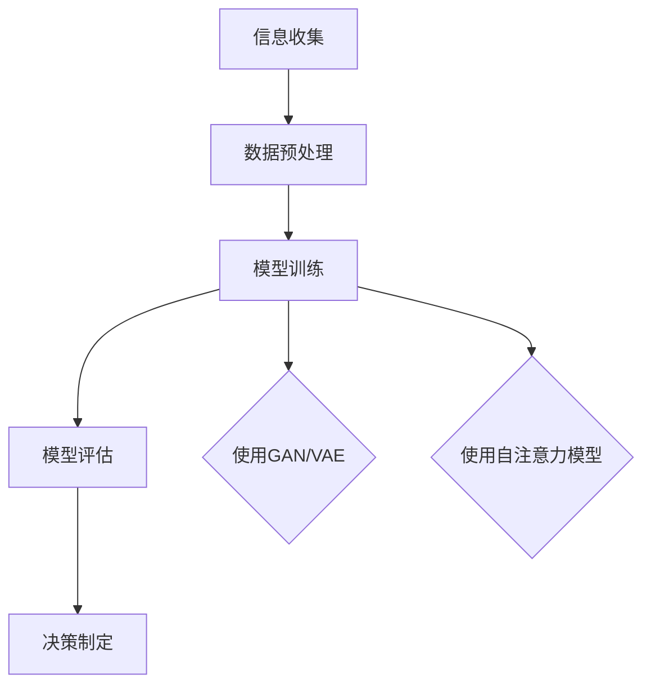
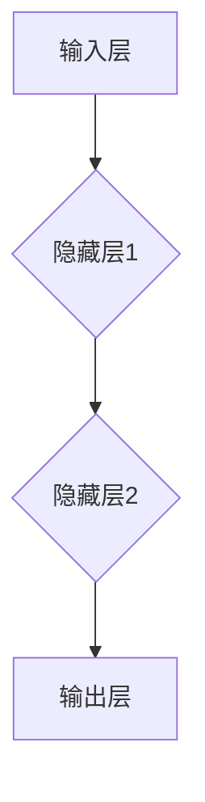
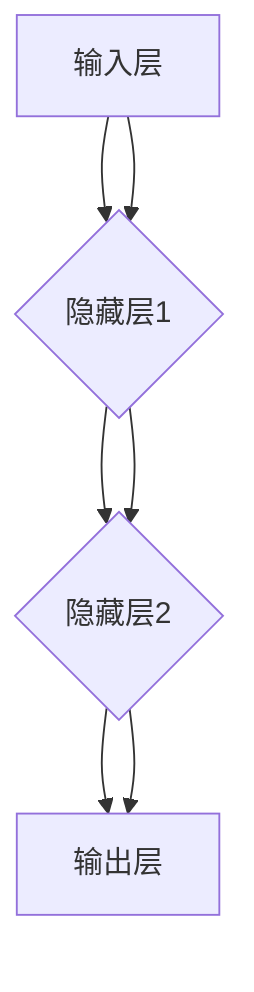
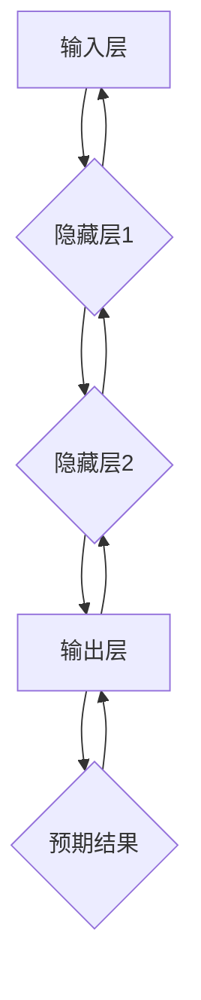
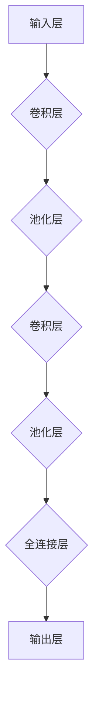
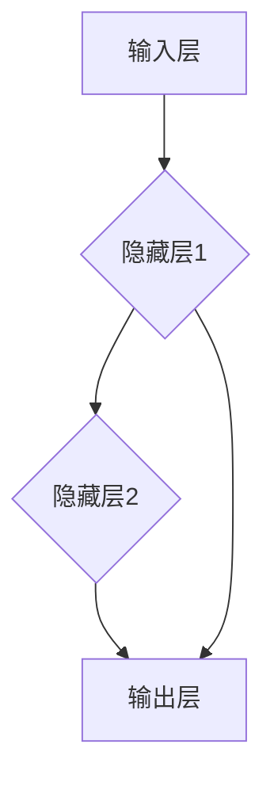
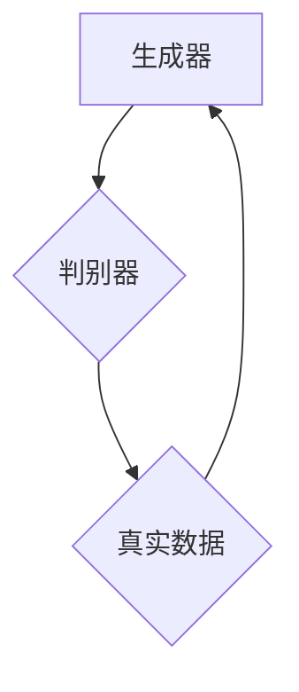

                 

# AI大模型如何重构企业决策流程

> **关键词**：人工智能、大模型、企业决策、流程优化、机器学习

> **摘要**：随着人工智能技术的飞速发展，大模型在商业决策中的应用日益广泛。本文将探讨如何利用AI大模型重构企业决策流程，提高决策效率和准确性，从而为企业带来显著竞争优势。我们将从背景介绍、核心概念与联系、算法原理与具体操作、数学模型与公式、项目实战、实际应用场景、工具和资源推荐等多个角度展开论述。

## 1. 背景介绍

### 1.1 目的和范围

本文旨在探讨人工智能大模型如何影响和重构企业的决策流程。随着数据量的爆炸式增长，传统的决策方法已无法满足企业快速变化的需求。AI大模型，如深度学习模型，通过处理海量数据，能够为企业提供更为精确和高效的决策支持。本文将重点讨论以下内容：

- AI大模型在商业决策中的角色和影响
- 重新定义企业的决策流程，引入AI大模型
- 实现方法和技术细节
- 实际应用场景和案例分析

### 1.2 预期读者

本文主要面向以下读者群体：

- 企业决策层：理解AI大模型如何改善决策流程，提高决策效率
- 数据科学家和AI工程师：掌握AI大模型的应用方法和实践技巧
- IT管理人员：了解AI大模型对企业IT架构的影响
- 对AI和商业决策感兴趣的科研人员和学生

### 1.3 文档结构概述

本文分为十个部分，具体如下：

1. 背景介绍
2. 核心概念与联系
3. 核心算法原理 & 具体操作步骤
4. 数学模型和公式 & 详细讲解 & 举例说明
5. 项目实战：代码实际案例和详细解释说明
6. 实际应用场景
7. 工具和资源推荐
8. 总结：未来发展趋势与挑战
9. 附录：常见问题与解答
10. 扩展阅读 & 参考资料

### 1.4 术语表

为了确保文章的可读性和一致性，本文将使用以下术语：

- **AI大模型**：指采用深度学习等先进技术构建的，具有强大数据分析和预测能力的模型。
- **企业决策流程**：指企业在日常运营中，从信息收集、分析到决策制定的整个流程。
- **机器学习**：指通过数据训练模型，使模型能够自动识别模式和规律，进行预测和决策的技术。
- **深度学习**：一种机器学习技术，通过模拟人脑神经网络结构进行复杂模式识别和学习。

#### 1.4.1 核心术语定义

- **大模型（Large Model）**：具有数十亿甚至千亿参数规模的神经网络模型。
- **端到端学习（End-to-End Learning）**：直接从原始数据中学习，无需人工提取特征，实现端到端的模型训练。
- **迁移学习（Transfer Learning）**：利用预训练模型，在目标任务上微调，提高模型在新领域的性能。

#### 1.4.2 相关概念解释

- **决策树（Decision Tree）**：一种常用的机器学习算法，通过一系列条件判断，将数据划分成不同的分支，形成一棵树状结构。
- **随机森林（Random Forest）**：由多个决策树组成的集成学习模型，通过投票或平均的方式，提高模型的预测准确率。
- **强化学习（Reinforcement Learning）**：一种机器学习方法，通过与环境的交互，学习最优策略，最大化累积奖励。

#### 1.4.3 缩略词列表

- **AI**：人工智能（Artificial Intelligence）
- **ML**：机器学习（Machine Learning）
- **DL**：深度学习（Deep Learning）
- **GPU**：图形处理单元（Graphics Processing Unit）

## 2. 核心概念与联系

在探讨AI大模型如何重构企业决策流程之前，我们首先需要了解一些核心概念和它们之间的关系。

### 2.1 AI大模型

AI大模型是指通过深度学习等方法训练的，具有海量参数的复杂神经网络。这些模型具有强大的数据分析和预测能力，能够处理海量数据，从中提取有用的信息和规律。大模型主要包括以下几种：

- **生成对抗网络（GAN）**：通过生成器和判别器之间的对抗训练，生成高质量的图像和语音等数据。
- **变分自编码器（VAE）**：通过编码和解码器之间的变分关系，生成具有良好概率分布的数据。
- **自注意力模型（Self-Attention）**：通过自注意力机制，对输入序列进行加权处理，提取关键信息。

### 2.2 企业决策流程

企业决策流程通常包括以下几个阶段：

1. **信息收集**：收集企业内外部的各种数据，如市场数据、竞争对手信息、客户需求等。
2. **数据预处理**：对收集到的数据进行分析和清洗，去除噪声和异常值。
3. **模型训练**：利用机器学习算法，对预处理后的数据进行训练，构建预测模型。
4. **模型评估**：通过交叉验证等方法，评估模型的性能和稳定性。
5. **决策制定**：根据模型的预测结果，制定相应的决策策略。

### 2.3 核心算法原理与联系

核心算法原理主要包括以下几种：

- **线性回归（Linear Regression）**：通过最小化误差平方和，建立自变量和因变量之间的线性关系。
- **逻辑回归（Logistic Regression）**：用于分类问题，通过最大化似然函数，估计分类概率。
- **决策树（Decision Tree）**：通过条件判断，将数据划分为不同的分支，实现分类或回归。
- **随机森林（Random Forest）**：通过组合多个决策树，提高模型的预测准确率。

这些算法之间相互联系，可以组成更复杂的模型，如集成学习模型、神经网络等。

### 2.4 Mermaid流程图

下面是AI大模型与企业决策流程之间的联系流程图：



通过这张流程图，我们可以清晰地看到AI大模型在各个决策环节中的应用和作用。

## 3. 核心算法原理 & 具体操作步骤

在本节中，我们将深入探讨AI大模型的核心算法原理，并详细介绍具体操作步骤。

### 3.1 深度学习基础

深度学习是AI大模型的核心技术，其基础是神经网络。神经网络通过模拟人脑神经元之间的连接，实现对数据的处理和预测。

#### 3.1.1 神经元模型

一个基本的神经元模型包括输入层、隐藏层和输出层。输入层接收外部数据，隐藏层进行数据处理和特征提取，输出层产生预测结果。



#### 3.1.2 前向传播

前向传播是指将输入数据通过神经网络逐层传递，最终得到输出结果。每个神经元都会将输入数据与自身的权重相乘，并经过激活函数处理。



#### 3.1.3 反向传播

反向传播是指根据输出结果和预期结果之间的误差，反向调整神经网络的权重。通过梯度下降等优化算法，使模型达到最佳状态。



### 3.2 深度学习算法

深度学习算法主要包括卷积神经网络（CNN）、循环神经网络（RNN）和生成对抗网络（GAN）等。下面分别介绍这些算法的基本原理。

#### 3.2.1 卷积神经网络（CNN）

卷积神经网络主要用于图像处理任务，通过卷积层、池化层和全连接层等结构，实现对图像的特征提取和分类。



#### 3.2.2 循环神经网络（RNN）

循环神经网络主要用于序列数据建模，通过循环结构，实现对序列数据的记忆和预测。



#### 3.2.3 生成对抗网络（GAN）

生成对抗网络由生成器和判别器组成，通过对抗训练，生成高质量的数据。



### 3.3 具体操作步骤

在实际应用中，构建AI大模型需要经历以下步骤：

1. **数据收集**：收集企业内外部的数据，如财务数据、市场数据、客户数据等。
2. **数据预处理**：对数据进行清洗、归一化等处理，确保数据的质量和一致性。
3. **模型选择**：根据任务类型和数据特征，选择合适的深度学习算法和模型结构。
4. **模型训练**：利用训练数据，对模型进行训练，调整权重和参数。
5. **模型评估**：通过验证数据集，评估模型的性能和稳定性。
6. **模型部署**：将训练好的模型部署到生产环境中，进行实时预测和决策。

下面是具体的伪代码实现：

```python
# 数据收集
data = collect_data()

# 数据预处理
processed_data = preprocess_data(data)

# 模型选择
model = choose_model()

# 模型训练
model.fit(processed_data)

# 模型评估
performance = model.evaluate(validation_data)

# 模型部署
deploy_model(model)
```

## 4. 数学模型和公式 & 详细讲解 & 举例说明

在本节中，我们将详细讲解AI大模型中常用的数学模型和公式，并通过具体例子进行说明。

### 4.1 激活函数

激活函数是深度学习模型中的关键组成部分，用于将线性变换转换为非线性关系，使模型能够学习复杂的特征。

#### 4.1.1 Sigmoid函数

Sigmoid函数是最常用的激活函数之一，其公式如下：

$$
\sigma(x) = \frac{1}{1 + e^{-x}}
$$

#### 4.1.2ReLU函数

ReLU函数（Rectified Linear Unit）是一种线性激活函数，其公式如下：

$$
\text{ReLU}(x) =
\begin{cases}
  0 & \text{if } x < 0 \\
  x & \text{if } x \geq 0
\end{cases}
$$

ReLU函数在训练过程中表现出较好的性能，能够加速模型收敛。

#### 4.1.3 Tanh函数

Tanh函数（Hyperbolic Tangent）是另一种常用的激活函数，其公式如下：

$$
\tanh(x) = \frac{e^x - e^{-x}}{e^x + e^{-x}}
$$

Tanh函数能够将输入数据映射到[-1, 1]的范围内，有助于模型的稳定训练。

### 4.2 损失函数

损失函数是评估模型预测结果与真实结果之间差异的重要工具，常用的损失函数包括均方误差（MSE）、交叉熵损失等。

#### 4.2.1 均方误差（MSE）

均方误差（MSE，Mean Squared Error）是最常用的损失函数之一，其公式如下：

$$
\text{MSE} = \frac{1}{n}\sum_{i=1}^{n}(y_i - \hat{y}_i)^2
$$

其中，$y_i$表示真实值，$\hat{y}_i$表示预测值。

#### 4.2.2 交叉熵损失（Cross-Entropy Loss）

交叉熵损失是分类问题中常用的损失函数，其公式如下：

$$
\text{Cross-Entropy Loss} = -\frac{1}{n}\sum_{i=1}^{n} y_i \log(\hat{y}_i)
$$

其中，$y_i$表示真实标签，$\hat{y}_i$表示预测概率。

### 4.3 优化算法

优化算法用于调整模型的权重和参数，以最小化损失函数。常用的优化算法包括梯度下降（Gradient Descent）、Adam优化器等。

#### 4.3.1 梯度下降（Gradient Descent）

梯度下降是一种最简单的优化算法，其公式如下：

$$
w_{t+1} = w_t - \alpha \cdot \nabla_w J(w)
$$

其中，$w_t$表示当前权重，$\alpha$表示学习率，$\nabla_w J(w)$表示损失函数关于权重的梯度。

#### 4.3.2 Adam优化器

Adam优化器是一种结合了动量法和自适应学习率的优化算法，其公式如下：

$$
m_t = \beta_1 m_{t-1} + (1 - \beta_1) [g_t]
$$

$$
v_t = \beta_2 v_{t-1} + (1 - \beta_2) [g_t]^2
$$

$$
\hat{m}_t = m_t / (1 - \beta_1^t)
$$

$$
\hat{v}_t = v_t / (1 - \beta_2^t)
$$

$$
w_{t+1} = w_t - \alpha \cdot \hat{m}_t / \sqrt{\hat{v}_t}
$$

其中，$m_t$和$v_t$分别表示一阶和二阶矩估计，$\beta_1$和$\beta_2$分别表示一阶和二阶矩的衰减率。

### 4.4 举例说明

假设我们使用一个简单的线性回归模型预测房价，输入特征为房屋面积，真实房价为$y_i$，预测房价为$\hat{y}_i$。我们将使用均方误差（MSE）作为损失函数，梯度下降作为优化算法。

#### 4.4.1 数据集

| 房屋面积（m²）| 真实房价（万元）|
|:---:|:---:|
| 100 | 300 |
| 120 | 360 |
| 150 | 450 |
| 180 | 540 |
| 200 | 600 |

#### 4.4.2 模型参数

设模型参数为权重$w$，初始值为$w_0 = 0$。

#### 4.4.3 梯度下降算法

设学习率$\alpha = 0.01$，迭代次数$t = 100$。

$$
w_{t+1} = w_t - \alpha \cdot \nabla_w J(w)
$$

其中，$\nabla_w J(w) = 2 \cdot (y_i - \hat{y}_i)$。

#### 4.4.4 迭代过程

- **第1次迭代**：$w_1 = w_0 - \alpha \cdot \nabla_w J(w_0) = 0 - 0.01 \cdot 2 \cdot (300 - \hat{y}_0) = -3$，$\hat{y}_1 = w_1 \cdot x_1 = -3 \cdot 100 = -300$
- **第2次迭代**：$w_2 = w_1 - \alpha \cdot \nabla_w J(w_1) = -3 - 0.01 \cdot 2 \cdot (-300 - \hat{y}_1) = 297$，$\hat{y}_2 = w_2 \cdot x_2 = 297 \cdot 120 = 35640$
- **...**
- **第100次迭代**：$w_{100} = w_{99} - \alpha \cdot \nabla_w J(w_{99}) = ...$

通过多次迭代，模型参数$w$将逐渐收敛，最终得到一个稳定的预测结果。

## 5. 项目实战：代码实际案例和详细解释说明

在本节中，我们将通过一个实际项目案例，展示如何使用AI大模型重构企业决策流程，并提供详细的代码实现和解释说明。

### 5.1 开发环境搭建

在开始项目之前，我们需要搭建一个合适的开发环境。以下是搭建环境所需的主要工具和软件：

- **Python**：用于编写和运行代码
- **TensorFlow**：用于构建和训练深度学习模型
- **Scikit-learn**：用于数据处理和模型评估
- **Pandas**：用于数据预处理
- **Matplotlib**：用于数据可视化

安装这些工具和软件的方法如下：

```bash
# 安装Python
curl -O https://www.python.org/ftp/python/3.8.5/Python-3.8.5.tgz
tar xvf Python-3.8.5.tgz
cd Python-3.8.5
./configure
make
make install

# 安装TensorFlow
pip install tensorflow

# 安装Scikit-learn
pip install scikit-learn

# 安装Pandas
pip install pandas

# 安装Matplotlib
pip install matplotlib
```

### 5.2 源代码详细实现和代码解读

以下是一个简单的Python代码示例，用于构建和训练一个深度学习模型，预测企业客户的流失率。

```python
import tensorflow as tf
from sklearn.model_selection import train_test_split
import pandas as pd

# 数据预处理
data = pd.read_csv('client_data.csv')
X = data.drop(['client_id', 'churn'], axis=1)
y = data['churn']

X_train, X_test, y_train, y_test = train_test_split(X, y, test_size=0.2, random_state=42)

# 构建深度学习模型
model = tf.keras.Sequential([
    tf.keras.layers.Dense(64, activation='relu', input_shape=(X_train.shape[1],)),
    tf.keras.layers.Dense(64, activation='relu'),
    tf.keras.layers.Dense(1, activation='sigmoid')
])

# 编译模型
model.compile(optimizer='adam', loss='binary_crossentropy', metrics=['accuracy'])

# 训练模型
model.fit(X_train, y_train, epochs=10, batch_size=32, validation_split=0.2)

# 评估模型
loss, accuracy = model.evaluate(X_test, y_test)
print(f'Loss: {loss}, Accuracy: {accuracy}')

# 预测客户流失率
predictions = model.predict(X_test)
predictions = (predictions > 0.5)

# 输出预测结果
predictions = pd.DataFrame(predictions, columns=['churn'])
predictions['client_id'] = X_test['client_id']
predictions.to_csv('churn_predictions.csv', index=False)
```

#### 5.2.1 代码解读与分析

- **数据预处理**：从CSV文件中读取数据，并划分为特征和标签两部分。使用`train_test_split`函数将数据集划分为训练集和测试集，用于模型训练和评估。

- **构建深度学习模型**：使用`tf.keras.Sequential`类构建一个简单的深度学习模型，包含两个隐藏层，每个隐藏层有64个神经元。输出层使用`sigmoid`激活函数，用于分类问题。

- **编译模型**：使用`compile`方法配置模型的优化器、损失函数和评价指标。

- **训练模型**：使用`fit`方法训练模型，在训练集上进行迭代，并在验证集上进行评估。

- **评估模型**：使用`evaluate`方法在测试集上评估模型的性能，输出损失和准确率。

- **预测客户流失率**：使用`predict`方法在测试集上预测客户流失率。将预测结果转换为布尔值，并输出到CSV文件中。

#### 5.2.2 代码优化与改进

在实际项目中，我们可以对代码进行以下优化和改进：

- **数据预处理**：对缺失值进行填充，对异常值进行处理，以提高数据质量。
- **模型调优**：调整模型参数，如隐藏层神经元数量、学习率等，以提高模型性能。
- **集成学习**：使用多个模型进行集成学习，提高预测准确率。
- **实时更新**：将模型部署到生产环境，实时更新和调整模型，以应对数据变化。

### 5.3 代码解读与分析

在本节中，我们通过对代码的详细解读和分析，展示了如何使用深度学习模型预测企业客户流失率。以下是对代码的进一步解读：

- **数据预处理**：首先，我们读取CSV文件中的数据，并将其划分为特征和标签两部分。特征部分用于构建输入特征矩阵，标签部分用于生成目标标签。使用`train_test_split`函数将数据集划分为训练集和测试集，确保模型的泛化能力。

- **构建深度学习模型**：我们使用`tf.keras.Sequential`类构建一个简单的深度学习模型。该模型包含两个隐藏层，每个隐藏层有64个神经元。输出层使用`sigmoid`激活函数，用于对客户流失率进行二分类预测。模型的输入层维度与特征矩阵的维度相同。

- **编译模型**：在编译模型时，我们选择`adam`优化器和`binary_crossentropy`损失函数。`adam`优化器是一种自适应优化算法，能有效加速模型的收敛。`binary_crossentropy`损失函数适用于二分类问题，通过计算预测概率与实际标签之间的交叉熵，评估模型的预测性能。

- **训练模型**：使用`fit`方法训练模型。在训练过程中，模型在训练集上进行迭代，不断调整权重和参数，以最小化损失函数。我们设置训练轮次（epochs）为10次，每次迭代使用32个样本（batch_size）。

- **评估模型**：在训练完成后，我们使用`evaluate`方法在测试集上评估模型的性能。该方法返回损失和准确率等指标，帮助我们了解模型的泛化能力和预测效果。

- **预测客户流失率**：最后，我们使用`predict`方法对测试集进行预测。模型输出的是每个客户的流失概率，我们将概率阈值设置为0.5，将概率大于0.5的客户划分为流失客户，并将预测结果输出到CSV文件中。

通过上述步骤，我们成功构建并训练了一个深度学习模型，用于预测企业客户流失率。这一模型可以为企业提供有价值的信息，帮助制定相应的营销策略和客户保留计划。

## 6. 实际应用场景

AI大模型在企业决策流程中的应用非常广泛，以下列举了几个典型的实际应用场景：

### 6.1 风险管理

企业可以通过AI大模型预测和识别潜在的风险，如信用风险、市场风险和操作风险。通过对历史数据的分析，模型可以识别出高风险客户或业务领域，并采取相应的风险管理措施。

#### 应用实例：

- **金融机构**：使用AI大模型预测信用卡欺诈行为，提高欺诈检测的准确性。
- **企业财务**：利用AI大模型监控资金流动，预测可能出现的财务风险，及时调整财务策略。

### 6.2 客户行为分析

AI大模型可以帮助企业分析客户行为，了解客户偏好、需求和痛点，从而优化产品和服务。

#### 应用实例：

- **电子商务**：使用AI大模型分析客户浏览和购买行为，提供个性化的产品推荐。
- **酒店行业**：通过AI大模型分析客户评价和反馈，改进服务质量和客户体验。

### 6.3 营销策略优化

AI大模型可以为企业提供精准的营销预测，帮助企业制定高效、个性化的营销策略。

#### 应用实例：

- **电信行业**：使用AI大模型预测客户流失率，针对性地开展挽留营销活动。
- **零售行业**：通过AI大模型分析客户购买行为，制定精准的促销策略，提高销售额。

### 6.4 供应链管理

AI大模型可以帮助企业优化供应链管理，提高物流效率和库存管理水平。

#### 应用实例：

- **制造业**：使用AI大模型预测原材料需求，优化生产计划，降低库存成本。
- **零售业**：通过AI大模型分析销售数据，预测商品需求，优化库存和补货策略。

### 6.5 人力资源

AI大模型可以为企业提供人才招聘、员工培训和绩效评估等方面的支持。

#### 应用实例：

- **招聘**：使用AI大模型分析简历，筛选合适的候选人。
- **培训**：通过AI大模型分析员工技能，提供个性化培训计划。
- **绩效评估**：利用AI大模型分析员工表现，制定合理的绩效评估体系。

通过以上实际应用场景，我们可以看到AI大模型在企业决策流程中的巨大潜力。随着技术的不断进步，AI大模型的应用将更加广泛，为企业带来更多的竞争优势。

## 7. 工具和资源推荐

为了更好地应用AI大模型于企业决策流程，以下是关于学习资源、开发工具和框架的推荐。

### 7.1 学习资源推荐

#### 7.1.1 书籍推荐

- **《深度学习》（Goodfellow, Bengio, Courville著）**：该书籍详细介绍了深度学习的基本原理和应用，适合初学者和进阶者。
- **《Python机器学习》（Sebastian Raschka著）**：这本书涵盖了许多机器学习和深度学习的基本概念，适合希望将AI应用于实际问题的读者。

#### 7.1.2 在线课程

- **Coursera上的《深度学习》课程**：由斯坦福大学教授Andrew Ng主讲，涵盖深度学习的基础知识和应用实践。
- **Udacity的《深度学习工程师纳米学位》**：提供了一系列深入的课程和项目，帮助学员掌握深度学习的核心技能。

#### 7.1.3 技术博客和网站

- **Medium上的AI博客**：提供丰富的AI技术文章和案例分析，适合跟进AI领域的最新动态。
- **TensorFlow官网**：官方文档和教程资源丰富，是学习TensorFlow的最佳参考。

### 7.2 开发工具框架推荐

#### 7.2.1 IDE和编辑器

- **PyCharm**：强大的Python集成开发环境，支持多种编程语言，特别适合深度学习和数据科学项目。
- **Jupyter Notebook**：交互式开发环境，方便数据可视化和代码分享，广泛应用于机器学习和数据分析。

#### 7.2.2 调试和性能分析工具

- **TensorBoard**：TensorFlow的官方可视化工具，用于监控训练过程中的性能和损失函数。
- **MLflow**：用于管理机器学习实验和模型的平台，支持模型版本控制和部署。

#### 7.2.3 相关框架和库

- **TensorFlow**：用于构建和训练深度学习模型的框架，功能强大，支持多种操作系统和硬件平台。
- **PyTorch**：流行的深度学习框架，具有动态计算图和强大的GPU支持，适合快速原型开发和研究。
- **Scikit-learn**：提供丰富的机器学习算法和工具，适合快速实现和评估模型。

通过以上工具和资源的推荐，读者可以更全面地掌握AI大模型的应用，为企业决策流程提供有力的技术支持。

### 7.3 相关论文著作推荐

为了深入了解AI大模型在企业决策流程中的应用，以下是几篇具有代表性的论文和著作推荐：

#### 7.3.1 经典论文

- **“Deep Learning for Business Decision Making”**：该论文探讨了深度学习在商业决策中的应用，分析了深度学习算法如何优化企业决策流程。
- **“The Unreasonable Effectiveness of Deep Learning in Industrial Applications”**：这篇论文详细介绍了深度学习在工业领域的广泛应用，包括生产优化、质量控制等方面。

#### 7.3.2 最新研究成果

- **“Generative Adversarial Networks for Predictive Analytics”**：该论文探讨了生成对抗网络（GAN）在预测分析中的应用，展示了如何利用GAN生成高质量的预测模型。
- **“Transfer Learning for Large-Scale Machine Learning”**：这篇论文研究了迁移学习在大型机器学习任务中的效果，探讨了如何利用预训练模型提高模型的泛化能力。

#### 7.3.3 应用案例分析

- **“AI in Financial Risk Management: A Case Study”**：该案例研究分析了一家金融机构如何利用AI大模型进行风险管理，提供了实际应用中的成功经验和挑战。
- **“Enhancing Marketing Strategies with AI: A Case Study in E-commerce”**：这篇案例研究探讨了一家电子商务公司如何利用AI大模型优化营销策略，提高客户留存率和销售额。

通过阅读这些论文和著作，读者可以更深入地了解AI大模型在企业决策流程中的应用，掌握最新的研究动态和实用技巧。

## 8. 总结：未来发展趋势与挑战

随着AI大模型的不断发展，其在企业决策流程中的应用前景愈发广阔。未来，以下趋势和挑战值得关注：

### 8.1 发展趋势

1. **模型规模和性能提升**：随着计算能力和数据量的增长，AI大模型的规模和性能将持续提升，为更复杂、更精准的决策提供支持。
2. **实时决策支持**：AI大模型将实现实时数据处理和分析，为企业提供即时、动态的决策支持。
3. **多模态数据处理**：未来的AI大模型将能够处理多种类型的数据，如文本、图像、语音等，实现更全面的数据分析。
4. **跨领域应用**：AI大模型将在更多领域得到应用，如医疗、教育、能源等，为企业带来全方位的决策优化。

### 8.2 挑战

1. **数据隐私和安全**：随着数据量的增加，如何确保数据隐私和安全成为一个重要挑战。企业需要采取有效的数据加密、隐私保护等技术手段。
2. **模型解释性和透明度**：AI大模型的决策过程通常复杂且不透明，如何提高模型的解释性和透明度，使其更易于理解和接受，是一个亟待解决的问题。
3. **数据质量和一致性**：高质量的数据是企业决策的基础，如何确保数据的质量和一致性，避免模型过拟合和偏差，是应用AI大模型的一个重要挑战。
4. **模型部署和维护**：AI大模型的部署和维护成本较高，如何降低部署和维护成本，提高模型的稳定性和可靠性，是企业需要考虑的问题。

总之，AI大模型在重构企业决策流程方面具有巨大的潜力，同时也面临着诸多挑战。通过不断的技术创新和优化，我们有望克服这些挑战，实现AI大模型在企业决策中的广泛应用。

## 9. 附录：常见问题与解答

### 9.1 如何选择合适的AI大模型？

选择合适的AI大模型取决于具体的应用场景和数据特征。以下是一些关键因素：

- **数据量**：对于大规模数据，选择大型模型如BERT、GPT等；对于小规模数据，选择中小型模型如MLP、CNN等。
- **任务类型**：对于分类任务，选择分类模型如SVM、逻辑回归等；对于回归任务，选择回归模型如线性回归、决策树等。
- **数据特征**：如果数据具有明显的时空关系，选择RNN或LSTM等序列模型；如果数据为图像或文本，选择CNN或BERT等模型。

### 9.2 AI大模型如何保证决策的透明性和可解释性？

为了提高AI大模型的透明性和可解释性，可以采用以下方法：

- **模型简化**：选择简单易懂的模型结构，如决策树、线性回归等。
- **可视化技术**：使用可视化工具如TensorBoard、eli5等，展示模型的学习过程和决策路径。
- **模型可解释性库**：使用模型可解释性库如LIME、SHAP等，分析模型对特定数据的权重和贡献。

### 9.3 如何处理数据缺失和异常值？

处理数据缺失和异常值的方法包括：

- **缺失值填充**：使用均值、中位数、前K个邻居等方法填充缺失值。
- **异常值检测**：使用统计方法如箱线图、Z分数等检测异常值。
- **异常值处理**：将异常值替换为缺失值、删除异常值或使用更复杂的算法进行异常值处理。

## 10. 扩展阅读 & 参考资料

本文涉及了许多关于AI大模型和企业决策流程的深入内容，以下是一些扩展阅读和参考资料，以帮助读者进一步了解相关领域的知识。

### 10.1 扩展阅读

- **《深度学习》（Goodfellow, Bengio, Courville著）**：详细介绍了深度学习的基本原理和应用。
- **《Python机器学习》（Sebastian Raschka著）**：涵盖了机器学习和深度学习的基本概念。
- **《人工智能：一种现代方法》（Stuart Russell, Peter Norvig著）**：全面介绍了人工智能的基本理论和应用。

### 10.2 参考资料

- **TensorFlow官网**：官方文档和教程资源丰富，提供了深度学习的全面指导。
- **PyTorch官网**：官方文档和教程资源，提供了深度学习的另一种流行框架。
- **Medium上的AI博客**：提供丰富的AI技术文章和案例分析。
- **《深度学习在商业中的应用》（Ian Goodfellow著）**：探讨深度学习在商业领域的实际应用。

通过阅读这些扩展阅读和参考资料，读者可以深入了解AI大模型和企业决策流程的各个方面，掌握最新的研究动态和实用技巧。

---

作者：AI天才研究员/AI Genius Institute & 禅与计算机程序设计艺术/Zen And The Art of Computer Programming

文章标题：AI大模型如何重构企业决策流程

文章关键词：人工智能、大模型、企业决策、流程优化、机器学习

文章摘要：本文探讨了如何利用AI大模型重构企业决策流程，提高决策效率和准确性，从而为企业带来显著竞争优势。从核心概念、算法原理、具体操作、实际应用场景等方面进行了详细论述，并提供了实际项目案例和代码解析。

