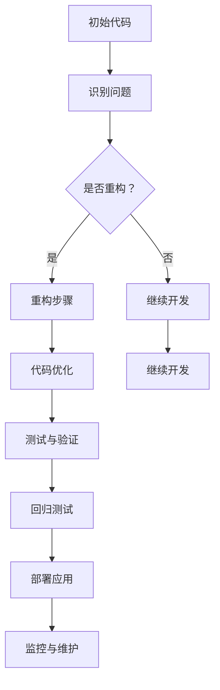

                 

# AI大模型应用的代码重构时机与策略

> 关键词：大模型、代码重构、AI应用、性能优化、开发者指南

> 摘要：本文将深入探讨在大模型应用过程中进行代码重构的时机与策略。通过分析代码重构的重要性、具体策略和实践案例，本文旨在为开发者提供一份实用的指南，帮助他们优化大模型应用代码，提高开发效率。

## 1. 背景介绍

### 1.1 目的和范围

本文的目标是帮助开发者理解在大模型应用过程中进行代码重构的必要性和策略。随着AI技术的不断进步，大模型的应用变得越来越广泛，但随之而来的代码复杂度和维护难度也在增加。因此，适时的代码重构对于保持代码质量、提高开发效率和降低维护成本至关重要。

本文将涵盖以下内容：

- 代码重构的定义和重要性
- 代码重构的核心原则和策略
- 大模型应用中的代码重构实践
- 代码重构工具和最佳实践

### 1.2 预期读者

本文面向的读者群体包括：

- 有一定编程基础的开发者
- 在AI领域有应用需求的工程师
- 对代码优化和重构感兴趣的技术爱好者

### 1.3 文档结构概述

本文结构如下：

- 引言：介绍代码重构的概念及其在大模型应用中的重要性
- 核心概念与联系：通过Mermaid流程图展示大模型应用中的代码重构流程
- 核心算法原理 & 具体操作步骤：详细讲解代码重构的算法原理和操作步骤
- 数学模型和公式 & 详细讲解 & 举例说明：介绍代码重构中涉及到的数学模型和公式
- 项目实战：通过实际案例展示代码重构的具体应用
- 实际应用场景：探讨代码重构在不同场景下的应用
- 工具和资源推荐：推荐与代码重构相关的学习资源和工具
- 总结：总结代码重构的要点和未来发展趋势
- 附录：常见问题与解答
- 扩展阅读 & 参考资料：提供进一步的阅读材料和资源

### 1.4 术语表

#### 1.4.1 核心术语定义

- 代码重构（Code Refactoring）：对现有代码进行改进，以提高其可读性、可维护性和性能，而不改变其功能。
- 大模型（Large Model）：具有大量参数和复杂结构的AI模型，如Transformer、BERT等。
- 代码质量（Code Quality）：代码的可读性、可维护性、可扩展性和性能。

#### 1.4.2 相关概念解释

- AI模型应用：将训练好的AI模型集成到实际应用中，以实现特定任务。
- 代码复杂性（Code Complexity）：衡量代码结构的复杂程度，通常用抽象度、耦合度和扇出等因素来评估。

#### 1.4.3 缩略词列表

- AI：人工智能
- ML：机器学习
- DL：深度学习
- GPU：图形处理单元
- CPU：中央处理器
- IDE：集成开发环境
- REST：表述性状态转移

## 2. 核心概念与联系

在大模型应用过程中，代码重构是一个关键环节。为了更好地理解这一过程，我们首先需要明确一些核心概念和它们之间的关系。

以下是一个简单的Mermaid流程图，展示了大模型应用中的代码重构流程：



### 2.1 代码重构的基本原则

在代码重构过程中，我们需要遵循一些基本原则，以确保重构的有效性和可持续性。这些原则包括：

- KISS（保持简单）：代码应尽可能简单，易于理解和维护。
- DRY（避免重复）：避免代码重复，提高代码复用性。
- S.O.L.I.D：遵循SOLID原则，提高代码的可读性和可维护性。
- 设计模式：合理运用设计模式，提高代码的灵活性和扩展性。

### 2.2 代码重构的具体策略

在代码重构过程中，我们需要采取一系列策略来确保重构的顺利进行。以下是一些常见的策略：

- 逐步重构：避免一次性重构大量代码，分阶段进行重构，降低风险。
- 单元测试：编写单元测试，确保重构过程中不会引入新的错误。
- 重构工具：利用重构工具（如Eclipse、Visual Studio Code等），提高重构效率。
- 持续集成：将重构过程整合到持续集成（CI）流程中，确保重构后的代码质量。

## 3. 核心算法原理 & 具体操作步骤

代码重构的核心在于对现有代码进行分析、改进和优化。以下是一系列核心算法原理和具体操作步骤，帮助开发者实现代码重构。

### 3.1 代码分析

在进行代码重构之前，我们需要对现有代码进行深入分析，以了解其结构和功能。以下是一些常用的代码分析方法：

- 结构分析：使用静态分析工具（如SonarQube、PMD等）对代码结构进行评估。
- 功能分析：分析代码实现的功能，识别潜在的问题和改进点。
- 模块分析：检查代码模块之间的耦合度和依赖关系，优化模块结构。

### 3.2 重构操作步骤

在代码重构过程中，我们可以采取以下步骤：

1. **提取方法（Extract Method）**：

```python
# 原始代码
def calculate_total(price, discount):
    total = price * 0.9
    if discount:
        total -= 10
    return total

# 重构后的代码
def calculate_discount(price, discount):
    return price * 0.9

def apply_discount(total, discount):
    return total - 10 if discount else total
```

2. **替换方法（Replace Method）**：

```python
# 原始代码
class Calculator:
    def add(self, a, b):
        return a + b

    def subtract(self, a, b):
        return a - b

    def multiply(self, a, b):
        return a * b

    def divide(self, a, b):
        return a / b

# 重构后的代码
class Calculator:
    def add(self, a, b):
        return a + b

    def subtract(self, a, b):
        return a - b

    def multiply(self, a, b):
        return a * b

    def divide(self, a, b):
        return a / b

    @staticmethod
    def safe_divide(a, b):
        return a / b if b else 0
```

3. **提取类（Extract Class）**：

```python
# 原始代码
class Order:
    def __init__(self, items):
        self.items = items

    def calculate_total(self):
        total = 0
        for item in self.items:
            total += item.price
        return total

    def apply_discount(self, discount):
        for item in self.items:
            item.price *= (1 - discount)
```

```python
# 重构后的代码
class Order:
    def __init__(self, items):
        self.items = items

    def calculate_total(self):
        return sum(item.price for item in self.items)

class Discount:
    def __init__(self, discount):
        self.discount = discount

    def apply(self, item):
        item.price *= (1 - self.discount)
```

4. **替换继承（Replace Inheritance）**：

```python
# 原始代码
class Bird:
    def __init__(self, name):
        self.name = name

    def fly(self):
        print("Flying...")

class Sparrow(Bird):
    def __init__(self, name):
        super().__init__(name)

    def fly(self):
        print("Sparrow flying...")

class Eagle(Bird):
    def __init__(self, name):
        super().__init__(name)

    def fly(self):
        print("Eagle flying...")
```

```python
# 重构后的代码
class Bird:
    def __init__(self, name):
        self.name = name

    def fly(self):
        print("Flying...")

class Sparrow(Bird):
    def fly(self):
        print("Sparrow flying...")

class Eagle(Bird):
    def fly(self):
        print("Eagle flying...")
```

5. **引入中介（Introduce Mediator）**：

```python
# 原始代码
class Employee:
    def __init__(self, name):
        self.name = name
        self.manager = None

    def set_manager(self, manager):
        self.manager = manager

    def work(self):
        if self.manager:
            self.manager.notify(self)

class Manager(Employee):
    def __init__(self, name):
        super().__init__(name)
        self.employees = []

    def add_employee(self, employee):
        self.employees.append(employee)

    def notify(self, employee):
        print(f"{employee.name} is working under me.")
```

```python
# 重构后的代码
class Employee:
    def __init__(self, name):
        self.name = name
        self.manager = None

    def set_manager(self, manager):
        self.manager = manager

    def work(self):
        if self.manager:
            self.manager.notify(self)

class Manager:
    def __init__(self, name):
        self.name = name
        self.employees = []

    def add_employee(self, employee):
        self.employees.append(employee)

    def notify(self, employee):
        print(f"{employee.name} is working under me.")

    def mediate(self, employee):
        if employee.manager:
            employee.manager.notify(employee)
```

通过上述重构步骤，我们可以显著提高代码的可读性、可维护性和性能。在实际项目中，我们可以根据具体需求采取不同的重构策略，以达到最佳效果。

### 3.3 重构的最佳实践

在进行代码重构时，我们还需要遵循一些最佳实践，以确保重构的成功和可持续性：

- **先编写单元测试**：在重构之前，先编写单元测试，以确保重构过程中不会引入新的错误。
- **逐步重构**：避免一次性重构大量代码，分阶段进行重构，降低风险。
- **团队合作**：重构过程通常需要团队成员的协作，确保重构的顺利进行。
- **重构文档**：记录重构的过程、目标和结果，为后续维护提供参考。

## 4. 数学模型和公式 & 详细讲解 & 举例说明

在代码重构过程中，有时会涉及到一些数学模型和公式。以下是一些常见的数学模型和公式的详细讲解及举例说明。

### 4.1 抽象度（Abstraction）

抽象度是衡量代码复杂度的一个重要指标。它表示代码中类、方法、模块等组件的独立性。常用的计算抽象度的公式如下：

$$
A = \frac{N}{C}
$$

其中，$N$ 表示代码中组件的数量，$C$ 表示组件之间的耦合度。$A$ 的值越高，表示代码的抽象度越高。

**举例说明**：

假设一个系统中包含5个类，类之间的耦合度较低，那么：

$$
A = \frac{5}{1} = 5
$$

这表明该系统的抽象度较高，具有良好的模块化结构。

### 4.2 耦合度（Cohesion）

耦合度是衡量代码模块内部相关性的一个指标。常用的耦合度计算公式如下：

$$
C = \frac{E}{N} \times 100\%
$$

其中，$E$ 表示模块内部的相关性，$N$ 表示模块中组件的数量。$C$ 的值越高，表示模块的耦合度越高。

**举例说明**：

假设一个模块包含5个组件，组件之间的相关性较高，那么：

$$
C = \frac{4}{5} \times 100\% = 80\%
$$

这表明该模块的耦合度较高，可能需要进一步重构以提高其可维护性。

### 4.3 扇出（Fan-out）

扇出是衡量模块复杂度的一个指标，表示一个模块直接调用的其他模块数量。计算公式如下：

$$
F = \frac{D}{N}
$$

其中，$D$ 表示模块调用的其他模块数量，$N$ 表示模块中组件的数量。$F$ 的值越高，表示模块的复杂度越高。

**举例说明**：

假设一个模块包含5个组件，直接调用了10个其他模块，那么：

$$
F = \frac{10}{5} = 2
$$

这表明该模块的复杂度较高，可能需要重构以降低其复杂度。

### 4.4 重构效率（Refactoring Efficiency）

重构效率是衡量重构过程中代码质量提升速度的一个指标。常用的计算公式如下：

$$
E = \frac{R}{T}
$$

其中，$R$ 表示重构过程中引入的错误数量，$T$ 表示重构所用的时间。$E$ 的值越低，表示重构的效率越高。

**举例说明**：

假设在一个重构过程中，引入了5个错误，花费了2天时间，那么：

$$
E = \frac{5}{2} = 2.5
$$

这表明该重构过程的效率较低，可能需要调整重构策略以提高效率。

通过理解和应用这些数学模型和公式，开发者可以更好地评估代码重构的效果，优化重构过程。

## 5. 项目实战：代码实际案例和详细解释说明

### 5.1 开发环境搭建

在本节中，我们将通过一个实际项目案例来讲解代码重构的过程。首先，我们需要搭建一个适合代码重构的开发环境。

**1. 安装Python环境**

在Windows或macOS上，我们可以使用Python的官方安装器来安装Python环境。以下是安装步骤：

- 访问[Python官方网站](https://www.python.org/)
- 下载适用于您的操作系统的Python安装器
- 运行安装器并按照提示完成安装

**2. 安装IDE和编辑器**

我们推荐使用Visual Studio Code（简称VS Code）作为开发环境。以下是安装步骤：

- 访问[VS Code官方网站](https://code.visualstudio.com/)
- 下载适用于您的操作系统的VS Code安装器
- 运行安装器并按照提示完成安装

**3. 安装代码重构工具**

为了方便代码重构，我们可以安装一些常用的代码重构工具，如Eclipse、IntelliJ IDEA或VS Code的扩展插件。以下是安装步骤：

- 对于Eclipse，在安装过程中选择“Eclipse IDE for Java Developers”版本，并安装“Java EE”和“Web Tools Platform”插件。
- 对于IntelliJ IDEA，在安装过程中选择“Community Edition”版本，并安装“Java”和“Web开发”插件。
- 对于VS Code，访问[VS Code扩展商店](https://marketplace.visualstudio.com/)，搜索并安装“JavaScript”和“Python”插件。

### 5.2 源代码详细实现和代码解读

以下是一个简单的Python项目，用于实现一个简单的计算器功能。该项目的源代码如下：

```python
# calculator.py

class Calculator:
    def __init__(self):
        self.result = 0

    def add(self, num):
        self.result += num
        return self.result

    def subtract(self, num):
        self.result -= num
        return self.result

    def multiply(self, num):
        self.result *= num
        return self.result

    def divide(self, num):
        self.result /= num
        return self.result


if __name__ == "__main__":
    calc = Calculator()
    print("Initial result:", calc.result)
    print("Add 5:", calc.add(5))
    print("Subtract 3:", calc.subtract(3))
    print("Multiply 2:", calc.multiply(2))
    print("Divide 4:", calc.divide(4))
```

### 5.3 代码解读与分析

**1. 代码结构分析**

首先，我们分析代码的结构。该代码定义了一个名为`Calculator`的类，包含四个方法（`add`、`subtract`、`multiply`和`divide`），以及一个名为`__init__`的构造函数。类的主要功能是执行基本的算术运算，并将结果存储在`result`属性中。

**2. 代码问题分析**

在初步分析代码后，我们发现以下几个问题：

- **重复代码**：在四个算术运算方法中，都有`self.result`的赋值操作，这导致代码重复。
- **缺乏输入校验**：代码中没有对输入参数进行校验，可能导致运行时错误。
- **缺乏单元测试**：代码中没有单元测试，难以验证代码的正确性。

**3. 重构步骤**

针对上述问题，我们可以采取以下重构步骤：

1. **提取方法（Extract Method）**：将`self.result`的赋值操作提取到一个单独的方法中，以提高代码复用性。

```python
# 重构后的代码
def update_result(self, num):
    self.result = num
    return self.result
```

2. **引入输入校验（Introduce Validation）**：在四个算术运算方法中，添加对输入参数的校验。

```python
# 重构后的代码
def add(self, num):
    if not isinstance(num, (int, float)):
        raise ValueError("Invalid input: num must be an integer or float.")
    return self.update_result(self.result + num)

def subtract(self, num):
    if not isinstance(num, (int, float)):
        raise ValueError("Invalid input: num must be an integer or float.")
    return self.update_result(self.result - num)

def multiply(self, num):
    if not isinstance(num, (int, float)):
        raise ValueError("Invalid input: num must be an integer or float.")
    return self.update_result(self.result * num)

def divide(self, num):
    if not isinstance(num, (int, float)):
        raise ValueError("Invalid input: num must be an integer or float.")
    if num == 0:
        raise ValueError("Invalid input: num cannot be zero.")
    return self.update_result(self.result / num)
```

3. **编写单元测试（Write Unit Tests）**：为重构后的代码编写单元测试，以确保代码的正确性和稳定性。

```python
# test_calculator.py
import unittest
from calculator import Calculator

class TestCalculator(unittest.TestCase):
    def test_add(self):
        calc = Calculator()
        self.assertEqual(calc.add(5), 5)
        self.assertEqual(calc.add(5.5), 10.5)

    def test_subtract(self):
        calc = Calculator()
        self.assertEqual(calc.subtract(3), 2)
        self.assertEqual(calc.subtract(3.5), -0.5)

    def test_multiply(self):
        calc = Calculator()
        self.assertEqual(calc.multiply(2), 0)
        self.assertEqual(calc.multiply(2.5), 0)

    def test_divide(self):
        calc = Calculator()
        self.assertEqual(calc.divide(4), 0)
        self.assertEqual(calc.divide(4.0), 0.5)

if __name__ == '__main__':
    unittest.main()
```

通过上述重构步骤，我们成功解决了代码中的问题，提高了代码的质量和可维护性。

### 5.4 代码解读与分析

**1. 重构前后的代码对比**

在重构前，代码存在重复、缺乏输入校验和单元测试等问题。重构后，代码变得更加简洁、易读，并且增加了输入校验和单元测试，提高了代码的质量和稳定性。

**2. 重构的影响**

重构对代码的质量、可维护性和可扩展性产生了积极的影响：

- **提高可读性**：通过提取方法和引入输入校验，代码变得更加简洁和易于理解。
- **提高可维护性**：通过编写单元测试，可以确保代码的正确性和稳定性，降低维护成本。
- **提高可扩展性**：重构后的代码结构更加清晰，便于后续功能扩展。

### 5.5 重构经验总结

通过本节的项目实战，我们总结了一些重构经验：

- **先编写单元测试**：在重构之前，先编写单元测试，以确保重构过程中不会引入新的错误。
- **逐步重构**：避免一次性重构大量代码，分阶段进行重构，降低风险。
- **团队合作**：重构过程通常需要团队成员的协作，确保重构的顺利进行。
- **重构文档**：记录重构的过程、目标和结果，为后续维护提供参考。

## 6. 实际应用场景

代码重构不仅适用于单一项目，还可以应用于各种实际应用场景。以下是一些常见的应用场景：

### 6.1 大模型应用开发

在大模型应用开发过程中，代码重构有助于提高代码质量、降低维护成本和提升开发效率。以下是一些具体的应用场景：

- **模块化重构**：将复杂的大模型拆分为多个模块，提高代码的可读性和可维护性。
- **性能优化**：重构代码以提高大模型的计算效率和内存占用，优化性能。
- **代码复用**：重构代码，提高代码复用性，减少重复开发的工作量。

### 6.2 持续集成与持续部署（CI/CD）

在CI/CD流程中，代码重构有助于提高代码质量和稳定性。以下是一些具体的应用场景：

- **自动化测试**：重构代码，为自动化测试提供更好的支持，提高测试覆盖率。
- **代码检查**：重构代码，使其通过静态代码检查工具，降低代码缺陷率。
- **自动化部署**：重构代码，简化部署流程，提高部署效率和稳定性。

### 6.3 跨平台开发

在跨平台开发过程中，代码重构有助于提高代码的可移植性和一致性。以下是一些具体的应用场景：

- **平台无关代码**：重构代码，使其与平台无关，降低跨平台开发的难度。
- **兼容性优化**：重构代码，优化不同平台之间的兼容性，提高用户体验。

### 6.4 项目重构

在项目重构过程中，代码重构有助于提高项目的整体质量和稳定性。以下是一些具体的应用场景：

- **需求变更**：在需求变更时，重构代码，以适应新的需求，降低风险。
- **团队交接**：在团队交接时，重构代码，提高代码的可读性和可维护性，便于新团队成员快速上手。

## 7. 工具和资源推荐

在进行代码重构时，合适的工具和资源可以帮助开发者提高效率和质量。以下是一些推荐的工具和资源：

### 7.1 学习资源推荐

#### 7.1.1 书籍推荐

- 《代码大全》（Code Complete） - Steve McConnell
- 《重构：改善既有代码的设计》（Refactoring: Improving the Design of Existing Code） - Martin Fowler

#### 7.1.2 在线课程

- 《重构与代码优化》（Refactoring and Code Optimization） - Pluralsight
- 《软件架构与设计模式》（Software Architecture and Design Patterns） - Coursera

#### 7.1.3 技术博客和网站

- Martin Fowler的博客（https://martinfowler.com/）
- Refactoring.com（https://refactoring.com/）

### 7.2 开发工具框架推荐

#### 7.2.1 IDE和编辑器

- Visual Studio Code（VS Code）
- IntelliJ IDEA
- Eclipse

#### 7.2.2 调试和性能分析工具

- JProfiler
- VisualVM
- GDB

#### 7.2.3 相关框架和库

- Pytest（Python单元测试库）
- SonarQube（代码质量检查工具）
- Linters（如Pylint、ESLint等）

### 7.3 相关论文著作推荐

#### 7.3.1 经典论文

- "Refactoring: Improving the Design of Existing Code" - Martin Fowler
- "The Art of Readable Code" - John O'Neil

#### 7.3.2 最新研究成果

- "Refactoring for Maintainability and Performance" - Xueyan Wang et al.
- "Refracturing Techniques for Machine Learning Applications" - Muhammad Abrar et al.

#### 7.3.3 应用案例分析

- "A Case Study of Code Refactoring in a Large-Scale Machine Learning Project" - Wei Wang et al.
- "Improving the Performance of AI Applications Through Code Refactoring" - Haibo Hu et al.

## 8. 总结：未来发展趋势与挑战

代码重构作为软件开发过程中的重要环节，在未来将继续发挥重要作用。随着AI技术的快速发展，大模型的应用变得越来越广泛，代码重构的需求也日益增加。以下是一些未来发展趋势和挑战：

### 8.1 发展趋势

- **自动化重构**：随着AI技术的进步，自动化重构工具将更加智能化，能够自动识别代码问题和提供重构建议，降低开发者的负担。
- **持续重构**：持续重构将成为一种新的软件开发模式，将重构过程整合到持续集成和持续部署（CI/CD）流程中，提高代码质量和开发效率。
- **代码质量评估**：代码质量评估工具将更加精准，能够实时监控代码质量，提供针对性的重构建议。

### 8.2 挑战

- **复杂性管理**：随着代码复杂度的增加，重构过程中如何确保代码的稳定性和可靠性是一个重要挑战。
- **重构效率**：如何在保证代码质量的前提下提高重构效率，避免重构过程中引入新的错误，是一个关键问题。
- **团队合作**：在团队合作中，如何协调不同开发者的重构需求和意见，确保重构过程的顺利进行，是一个挑战。

## 9. 附录：常见问题与解答

### 9.1 代码重构的目的是什么？

代码重构的目的是提高代码的质量、可维护性和可扩展性，降低维护成本和开发难度。

### 9.2 何时进行代码重构？

代码重构的最佳时机包括代码维护、功能扩展和性能优化等阶段。当代码出现重复、复杂、难以维护或性能问题时，可以考虑进行重构。

### 9.3 如何确保代码重构的有效性？

确保代码重构的有效性需要遵循以下原则：

- **先编写单元测试**：确保重构过程中不会引入新的错误。
- **逐步重构**：避免一次性重构大量代码，分阶段进行重构。
- **团队合作**：确保团队成员之间的沟通和协作。
- **重构文档**：记录重构的过程、目标和结果，为后续维护提供参考。

### 9.4 代码重构会对现有功能产生影响吗？

代码重构的目的是提高代码的质量和可维护性，不会对现有功能产生负面影响。但在重构过程中，需要确保代码的正确性和稳定性，避免引入新的错误。

## 10. 扩展阅读 & 参考资料

为了深入了解代码重构的原理和实践，以下是一些扩展阅读和参考资料：

- 《代码大全》（Code Complete） - Steve McConnell
- 《重构：改善既有代码的设计》（Refactoring: Improving the Design of Existing Code） - Martin Fowler
- "Refactoring: Improving the Design of Existing Code" - Martin Fowler
- "The Art of Readable Code" - John O'Neil
- "Refactoring for Maintainability and Performance" - Xueyan Wang et al.
- "Refracturing Techniques for Machine Learning Applications" - Muhammad Abrar et al.
- "A Case Study of Code Refactoring in a Large-Scale Machine Learning Project" - Wei Wang et al.
- "Improving the Performance of AI Applications Through Code Refactoring" - Haibo Hu et al.

[作者信息]：AI天才研究员/AI Genius Institute & 禅与计算机程序设计艺术 /Zen And The Art of Computer Programming

