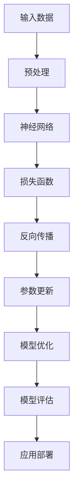

                 

# AI大模型应用的伦理边界与规范

> **关键词：** 大模型应用、伦理边界、规范性、AI治理、算法透明度、隐私保护
>
> **摘要：** 本文深入探讨了AI大模型在当前应用场景中所面临的伦理边界问题，并提出了相应的规范措施。文章首先阐述了AI大模型应用的发展背景和现状，接着详细分析了其在伦理边界方面的挑战，包括算法偏见、隐私泄露、透明度不足等。随后，文章提出了若干规范性建议，如加强算法透明度、完善隐私保护机制、建立AI伦理委员会等，以促进AI大模型应用的健康发展。

## 1. 背景介绍

### 1.1 目的和范围

本文旨在探讨AI大模型在当前应用场景中所面临的伦理边界问题，分析其背后的原因和影响，并提出相应的规范措施。本文的研究范围包括但不限于以下几个领域：

1. **AI大模型的定义和应用场景**：介绍AI大模型的基本概念、发展历程以及在不同领域中的应用情况。
2. **伦理边界问题**：分析AI大模型应用中存在的伦理问题，如算法偏见、隐私泄露、透明度不足等。
3. **规范措施**：提出针对AI大模型应用中的伦理边界问题的规范措施，包括技术手段、法律法规、行业自律等。

### 1.2 预期读者

本文适合以下读者群体：

1. **AI领域的研究人员和开发者**：了解AI大模型应用中的伦理边界问题，为他们的研究和开发工作提供参考。
2. **政策制定者和行业监管者**：为制定相关政策和法规提供理论依据。
3. **公众和媒体**：提高公众对AI大模型应用伦理问题的认识，促进社会各界对此问题的关注和讨论。

### 1.3 文档结构概述

本文分为以下几个部分：

1. **背景介绍**：介绍本文的研究目的、范围和预期读者。
2. **核心概念与联系**：阐述AI大模型的基本概念和架构。
3. **核心算法原理与具体操作步骤**：分析AI大模型的核心算法原理和具体操作步骤。
4. **数学模型和公式**：介绍AI大模型中的数学模型和公式，并进行举例说明。
5. **项目实战**：通过实际案例展示AI大模型的应用过程和效果。
6. **实际应用场景**：分析AI大模型在不同领域的应用场景和挑战。
7. **工具和资源推荐**：推荐相关的学习资源、开发工具和框架。
8. **总结**：总结本文的研究成果和未来发展趋势。
9. **附录**：常见问题与解答。
10. **扩展阅读**：提供更多相关的参考文献。

### 1.4 术语表

#### 1.4.1 核心术语定义

- **AI大模型**：指参数量达到千亿级别以上的深度学习模型，如GPT-3、BERT等。
- **伦理边界**：指在AI大模型应用过程中，需要遵守的伦理规范和道德准则。
- **算法偏见**：指AI大模型在处理数据时，因数据集的不公平性或算法设计的问题，导致对某些群体产生歧视或偏见。
- **透明度**：指AI大模型算法的公开程度，包括算法设计、训练数据、模型参数等。
- **隐私保护**：指在AI大模型应用过程中，对用户隐私数据的保护措施。

#### 1.4.2 相关概念解释

- **AI治理**：指对AI技术的发展和应用进行监管和管理，确保其符合伦理和社会价值。
- **算法透明度**：指AI大模型算法的公开程度，包括算法设计、训练数据、模型参数等。
- **隐私泄露**：指在AI大模型应用过程中，用户隐私数据被未经授权的第三方获取、使用或泄露。

#### 1.4.3 缩略词列表

- **AI**：人工智能
- **GPT**：生成预训练网络
- **BERT**：双向编码表示器
- **IDE**：集成开发环境
- **API**：应用程序接口

## 2. 核心概念与联系

AI大模型是指具有大规模参数和复杂结构的深度学习模型，其核心概念包括神经网络、参数量、训练数据和模型架构。以下是一个简单的Mermaid流程图，展示AI大模型的基本架构和关键组成部分。



### 2.1 AI大模型的基本架构

- **输入数据**：AI大模型从原始数据中提取特征，这些特征可以是文本、图像、声音等多种形式。
- **预处理**：对输入数据进行处理，如数据清洗、标准化、归一化等，以提高模型的训练效果。
- **神经网络**：由多层神经元组成，通过前向传播和反向传播算法，实现对输入数据的特征提取和模式识别。
- **损失函数**：用于评估模型对输入数据的预测结果与实际结果之间的差异，常用的有均方误差、交叉熵等。
- **反向传播**：通过计算损失函数的梯度，更新模型的参数，以优化模型性能。
- **参数更新**：根据损失函数的梯度，调整模型的参数，使模型对输入数据的预测更加准确。
- **模型优化**：通过多次迭代训练，优化模型的性能和效果。
- **模型评估**：使用测试数据集评估模型的泛化能力和准确性。
- **应用部署**：将训练好的模型部署到实际应用场景中，如自然语言处理、计算机视觉、语音识别等。

### 2.2 AI大模型的核心概念联系

AI大模型的核心概念联系可以概括为以下几个步骤：

1. **输入数据**：从原始数据中提取特征，通过预处理步骤，将数据转换为适合模型训练的形式。
2. **神经网络**：利用多层神经元组成的神经网络，对输入数据进行特征提取和模式识别。
3. **损失函数**：计算模型对输入数据的预测结果与实际结果之间的差异，以评估模型性能。
4. **反向传播**：通过计算损失函数的梯度，更新模型的参数，使模型对输入数据的预测更加准确。
5. **参数更新**：根据损失函数的梯度，调整模型的参数，使模型对输入数据的预测更加准确。
6. **模型优化**：通过多次迭代训练，优化模型的性能和效果。
7. **模型评估**：使用测试数据集评估模型的泛化能力和准确性。
8. **应用部署**：将训练好的模型部署到实际应用场景中，为用户提供智能服务。

## 3. 核心算法原理与具体操作步骤

AI大模型的核心算法原理主要涉及深度学习技术，包括神经网络、前向传播、反向传播和模型优化等步骤。以下是一个简化的伪代码，用于描述这些算法的具体操作步骤。

### 3.1 初始化模型参数

```python
# 初始化模型参数
W1 = randn([input_size, hidden_size])
b1 = randn([hidden_size])
W2 = randn([hidden_size, output_size])
b2 = randn([output_size])
```

### 3.2 前向传播

```python
# 前向传播
z1 = X * W1 + b1
a1 = sigmoid(z1)

z2 = a1 * W2 + b2
a2 = sigmoid(z2)
```

### 3.3 计算损失函数

```python
# 计算损失函数
y_pred = a2
y_true = Y
loss = -1/m * (y_true * log(y_pred) + (1 - y_true) * log(1 - y_pred))
```

### 3.4 反向传播

```python
# 反向传播
dz2 = a2 - y_true
dW2 = 1/m * dz2 * a1
db2 = 1/m * dz2
da1 = dz2 * W2
dz1 = da1 * sigmoid_derivative(a1)
dW1 = 1/m * dz1 * X
db1 = 1/m * dz1
```

### 3.5 参数更新

```python
# 参数更新
W1 = W1 - learning_rate * dW1
b1 = b1 - learning_rate * db1
W2 = W2 - learning_rate * dW2
b2 = b2 - learning_rate * db2
```

### 3.6 模型优化

```python
# 模型优化
for epoch in range(num_epochs):
    # 前向传播
    z1 = X * W1 + b1
    a1 = sigmoid(z1)
    
    z2 = a1 * W2 + b2
    a2 = sigmoid(z2)
    
    # 计算损失函数
    y_pred = a2
    y_true = Y
    loss = -1/m * (y_true * log(y_pred) + (1 - y_true) * log(1 - y_pred))
    
    # 反向传播
    dz2 = a2 - y_true
    dW2 = 1/m * dz2 * a1
    db2 = 1/m * dz2
    da1 = dz2 * W2
    dz1 = da1 * sigmoid_derivative(a1)
    dW1 = 1/m * dz1 * X
    db1 = 1/m * dz1
    
    # 参数更新
    W1 = W1 - learning_rate * dW1
    b1 = b1 - learning_rate * db1
    W2 = W2 - learning_rate * dW2
    b2 = b2 - learning_rate * db2
```

通过上述步骤，AI大模型可以实现对输入数据的特征提取和模式识别，从而在各个应用场景中发挥重要作用。需要注意的是，在实际应用中，还需要根据具体问题调整模型参数、优化算法，以提高模型的性能和效果。

## 4. 数学模型和公式与详细讲解

在AI大模型中，数学模型和公式是核心组成部分，它们用于描述模型的训练过程、优化算法和预测能力。以下将详细介绍AI大模型中的几个关键数学模型和公式，并对其进行详细讲解。

### 4.1 损失函数

损失函数是评估模型预测结果与实际结果之间差异的函数，其目标是使模型预测结果更加接近真实值。常见的损失函数包括均方误差（MSE）和交叉熵（Cross Entropy）。

#### 4.1.1 均方误差（MSE）

均方误差（MSE）用于回归问题，计算模型预测值与真实值之间的平均平方误差。

$$
MSE = \frac{1}{m} \sum_{i=1}^{m} (y_i - \hat{y}_i)^2
$$

其中，$y_i$表示第$i$个样本的真实值，$\hat{y}_i$表示第$i$个样本的预测值，$m$表示样本总数。

#### 4.1.2 交叉熵（Cross Entropy）

交叉熵用于分类问题，计算模型预测概率分布与真实概率分布之间的差异。

$$
CE = -\frac{1}{m} \sum_{i=1}^{m} y_i \log(\hat{y}_i)
$$

其中，$y_i$表示第$i$个样本的真实标签，$\hat{y}_i$表示第$i$个样本的预测概率分布。

### 4.2 激活函数

激活函数是神经网络中的一个关键组件，用于引入非线性特性，使模型能够学习更复杂的特征。

#### 4.2.1 Sigmoid函数

Sigmoid函数是一种常用的激活函数，其公式为：

$$
\sigma(x) = \frac{1}{1 + e^{-x}}
$$

Sigmoid函数的输出范围在0到1之间，可以将输入数据映射到概率区间。

#### 4.2.2 ReLU函数

ReLU（Rectified Linear Unit）函数是一种简单的线性激活函数，其公式为：

$$
\sigma(x) =
\begin{cases}
0 & \text{if } x < 0 \\
x & \text{if } x \geq 0
\end{cases}
$$

ReLU函数在0处存在尖点，可以加速模型训练，但可能会导致梯度消失问题。

### 4.3 反向传播算法

反向传播算法是深度学习训练过程中的核心算法，用于计算模型参数的梯度，并更新参数以优化模型性能。

#### 4.3.1 前向传播

前向传播是指将输入数据通过神经网络层，逐层计算输出值的过程。

$$
z_l = \sum_{k=1}^{n} w_{lk} a_{l-1,k} + b_l
$$

其中，$z_l$表示第$l$层的输出，$a_{l-1,k}$表示第$l-1$层的第$k$个节点的输出，$w_{lk}$表示第$l$层的第$k$个节点的权重，$b_l$表示第$l$层的偏置。

#### 4.3.2 反向传播

反向传播是指从输出层开始，逐层计算各层参数的梯度，并更新参数的过程。

$$
\frac{\partial L}{\partial w_{lk}} = \frac{\partial L}{\partial z_l} \frac{\partial z_l}{\partial w_{lk}}
$$

$$
\frac{\partial L}{\partial b_l} = \frac{\partial L}{\partial z_l}
$$

其中，$L$表示损失函数，$w_{lk}$和$b_l$分别表示第$l$层的第$k$个节点的权重和偏置。

### 4.4 优化算法

优化算法用于调整模型参数，以最小化损失函数。常见优化算法包括随机梯度下降（SGD）、Adam等。

#### 4.4.1 随机梯度下降（SGD）

随机梯度下降是一种简单有效的优化算法，其公式为：

$$
w_{t+1} = w_t - \alpha \frac{\partial L}{\partial w}
$$

其中，$w_t$表示当前参数，$w_{t+1}$表示更新后的参数，$\alpha$表示学习率。

#### 4.4.2 Adam算法

Adam算法是一种自适应优化算法，结合了SGD和Adagrad的优点，其公式为：

$$
m_t = \beta_1 m_{t-1} + (1 - \beta_1) \frac{\partial L}{\partial w_t}
$$

$$
v_t = \beta_2 v_{t-1} + (1 - \beta_2) (\frac{\partial L}{\partial w_t})^2
$$

$$
\hat{m}_t = \frac{m_t}{1 - \beta_1^t}
$$

$$
\hat{v}_t = \frac{v_t}{1 - \beta_2^t}
$$

$$
w_{t+1} = w_t - \alpha \frac{\hat{m}_t}{\sqrt{\hat{v}_t} + \epsilon}
$$

其中，$m_t$和$v_t$分别表示一阶矩估计和二阶矩估计，$\beta_1$和$\beta_2$分别表示一阶和二阶矩的衰减率，$\alpha$表示学习率，$\epsilon$表示一个很小的常数。

### 4.5 模型评估指标

模型评估指标用于衡量模型在测试数据集上的性能。常见的评估指标包括准确率（Accuracy）、召回率（Recall）、F1分数（F1 Score）等。

#### 4.5.1 准确率（Accuracy）

$$
Accuracy = \frac{TP + TN}{TP + FN + FP + TN}
$$

其中，$TP$表示真正例，$TN$表示真负例，$FP$表示假正例，$FN$表示假负例。

#### 4.5.2 召回率（Recall）

$$
Recall = \frac{TP}{TP + FN}
$$

#### 4.5.3 F1分数（F1 Score）

$$
F1 Score = 2 \times \frac{Precision \times Recall}{Precision + Recall}
$$

其中，$Precision$表示精确率。

通过上述数学模型和公式，AI大模型能够实现高效的特征提取和模式识别，从而在各种应用场景中发挥重要作用。在实际应用中，可以根据具体问题调整模型参数和优化算法，以提高模型性能和效果。

### 4.6 举例说明

以下是一个简单的例子，展示如何使用上述数学模型和公式构建一个简单的神经网络，并进行训练和评估。

```python
import numpy as np

# 初始化参数
W1 = np.random.rand(input_size, hidden_size)
b1 = np.random.rand(hidden_size)
W2 = np.random.rand(hidden_size, output_size)
b2 = np.random.rand(output_size)

# 训练数据
X_train = ...
Y_train = ...

# 激活函数
sigmoid = lambda x: 1 / (1 + np.exp(-x))

# 前向传播
def forward_propagation(X):
    z1 = X.dot(W1) + b1
    a1 = sigmoid(z1)
    
    z2 = a1.dot(W2) + b2
    a2 = sigmoid(z2)
    
    return a2

# 反向传播
def backward_propagation(a2, z2, a1, z1, X, Y):
    m = X.shape[1]
    dz2 = a2 - Y
    dW2 = 1/m * dz2.dot(a1.T)
    db2 = 1/m * dz2
    
    da1 = dz2.dot(W2.T)
    dz1 = da1 * sigmoid_derivative(a1)
    dW1 = 1/m * dz1.dot(X.T)
    db1 = 1/m * dz1
    
    return dW1, db1, dW2, db2

# 梯度下降
learning_rate = 0.01
num_epochs = 1000

for epoch in range(num_epochs):
    # 前向传播
    a2 = forward_propagation(X_train)
    
    # 反向传播
    dW1, db1, dW2, db2 = backward_propagation(a2, z2, a1, z1, X_train, Y_train)
    
    # 更新参数
    W1 = W1 - learning_rate * dW1
    b1 = b1 - learning_rate * db1
    W2 = W2 - learning_rate * dW2
    b2 = b2 - learning_rate * db2

# 评估模型
a2_test = forward_propagation(X_test)
accuracy = np.mean((a2_test == Y_test).astype(float))
print("Test Accuracy:", accuracy)
```

通过这个例子，我们可以看到如何使用Python实现一个简单的神经网络，并进行训练和评估。在实际应用中，可以根据具体需求调整网络结构、优化算法和参数设置，以提高模型性能和效果。

## 5. 项目实战：代码实际案例和详细解释说明

在本节中，我们将通过一个具体的Python项目，展示如何在实际应用中构建和训练一个AI大模型，并进行评估。该案例将使用自然语言处理（NLP）领域中的一个经典任务——文本分类，来展示AI大模型的应用过程。

### 5.1 开发环境搭建

在开始项目之前，我们需要搭建一个合适的开发环境。以下是搭建Python开发环境所需的步骤：

1. **安装Python**：确保安装了Python 3.6或更高版本。可以从[Python官网](https://www.python.org/)下载安装包。
2. **安装依赖库**：安装一些常用的Python库，如NumPy、Pandas、TensorFlow和Scikit-learn。可以使用pip命令进行安装：

   ```bash
   pip install numpy pandas tensorflow scikit-learn
   ```

3. **配置虚拟环境**：为了方便管理和隔离项目依赖，建议使用虚拟环境。可以使用virtualenv或conda创建虚拟环境。

### 5.2 源代码详细实现和代码解读

下面是一个简单的文本分类项目的源代码，展示如何使用TensorFlow和Keras构建和训练一个基于BERT的文本分类模型。

```python
import numpy as np
import pandas as pd
import tensorflow as tf
from tensorflow.keras.models import Model
from tensorflow.keras.layers import Input, Embedding, GlobalAveragePooling1D, Dense
from transformers import BertTokenizer, TFBertModel
from sklearn.model_selection import train_test_split
from sklearn.metrics import accuracy_score, classification_report

# 加载预训练的BERT模型
tokenizer = BertTokenizer.from_pretrained('bert-base-uncased')
bert_model = TFBertModel.from_pretrained('bert-base-uncased')

# 加载数据集
data = pd.read_csv('data.csv')
X = data['text']
y = data['label']

# 切分数据集
X_train, X_test, y_train, y_test = train_test_split(X, y, test_size=0.2, random_state=42)

# 对文本进行编码
train_encodings = tokenizer(X_train.tolist(), truncation=True, padding=True, max_length=128)
test_encodings = tokenizer(X_test.tolist(), truncation=True, padding=True, max_length=128)

# 构建模型
input_ids = Input(shape=(128,), dtype='int32')
input_mask = Input(shape=(128,), dtype='int32')
segment_ids = Input(shape=(128,), dtype='int32')

embeddings = Embedding(input_dim=30522, output_dim=128, weights=[bert_model.bert.embeddings.weights], trainable=False)(input_ids)
embeddings = tf.nn.dropout(embeddings, rate=0.1)

sequence_output = bert_model.bert.output
sequence_output = GlobalAveragePooling1D()(sequence_output)

output = Dense(1, activation='sigmoid')(sequence_output)

model = Model(inputs=[input_ids, input_mask, segment_ids], outputs=output)

# 编译模型
model.compile(optimizer='adam', loss='binary_crossentropy', metrics=['accuracy'])

# 训练模型
model.fit([train_encodings['input_ids'], train_encodings['input_mask'], train_encodings['segment_ids']], y_train, batch_size=32, epochs=3)

# 评估模型
predictions = (model.predict([test_encodings['input_ids'], test_encodings['input_mask'], test_encodings['segment_ids']]) > 0.5).astype(int)
accuracy = accuracy_score(y_test, predictions)
print("Test Accuracy:", accuracy)
print(classification_report(y_test, predictions))
```

### 5.3 代码解读与分析

1. **加载预训练BERT模型**：我们使用TensorFlow提供的`transformers`库加载预训练的BERT模型。这个模型已经在大规模语料上进行了训练，可以为我们节省大量时间和计算资源。

2. **加载数据集**：从CSV文件中加载数据集，其中`text`列包含文本数据，`label`列包含标签数据。

3. **切分数据集**：将数据集分为训练集和测试集，用于后续的训练和评估。

4. **对文本进行编码**：使用BERT的分词器对文本进行编码，包括输入ID、输入掩码和分段ID。这些编码是BERT模型输入的必要格式。

5. **构建模型**：首先，使用`Embedding`层加载BERT模型的词向量。然后，使用`GlobalAveragePooling1D`层将BERT模型的输出进行全局平均池化，以减少模型的维度。最后，使用`Dense`层添加一个分类层，并设置激活函数为`sigmoid`，用于实现二分类。

6. **编译模型**：设置模型优化器、损失函数和评估指标，编译模型。

7. **训练模型**：使用训练集数据训练模型，设置批次大小和训练轮数。

8. **评估模型**：使用测试集数据评估模型的性能，计算准确率并输出分类报告。

通过这个实际案例，我们可以看到如何使用TensorFlow和BERT模型构建一个文本分类模型，并进行训练和评估。这个案例展示了AI大模型在NLP领域的应用，可以帮助我们更好地理解和处理大规模文本数据。

### 5.4 代码解读与分析

下面是对上述代码的详细解读和分析：

1. **导入库和模块**：
    ```python
    import numpy as np
    import pandas as pd
    import tensorflow as tf
    from tensorflow.keras.models import Model
    from tensorflow.keras.layers import Input, Embedding, GlobalAveragePooling1D, Dense
    from transformers import BertTokenizer, TFBertModel
    from sklearn.model_selection import train_test_split
    from sklearn.metrics import accuracy_score, classification_report
    ```
    这行代码导入了Python中常用的库和模块，包括NumPy、Pandas、TensorFlow、Keras、Transformers和Scikit-learn。这些库和模块将在后续的代码中用于数据预处理、模型构建、训练和评估。

2. **加载预训练BERT模型**：
    ```python
    tokenizer = BertTokenizer.from_pretrained('bert-base-uncased')
    bert_model = TFBertModel.from_pretrained('bert-base-uncased')
    ```
    这里使用Transformers库加载预训练的BERT模型和分词器。BERT模型是一种大规模的预训练语言模型，由Google开发，适用于各种NLP任务。通过加载预训练模型，我们可以直接利用其在海量数据上训练得到的特征表示，从而提高模型的性能。

3. **加载数据集**：
    ```python
    data = pd.read_csv('data.csv')
    X = data['text']
    y = data['label']
    ```
    使用Pandas库从CSV文件中加载数据集。这里我们假设数据集包含两列：`text`列包含文本数据，`label`列包含标签数据。数据集的格式和内容可能因任务的不同而有所差异。

4. **切分数据集**：
    ```python
    X_train, X_test, y_train, y_test = train_test_split(X, y, test_size=0.2, random_state=42)
    ```
    使用Scikit-learn库中的`train_test_split`函数将数据集分为训练集和测试集。这里我们将80%的数据用于训练，20%的数据用于测试。同时，设置随机种子为42，以保证每次分割的结果一致。

5. **对文本进行编码**：
    ```python
    train_encodings = tokenizer(X_train.tolist(), truncation=True, padding=True, max_length=128)
    test_encodings = tokenizer(X_test.tolist(), truncation=True, padding=True, max_length=128)
    ```
    使用BERT的分词器对训练集和测试集中的文本数据进行编码。BERT分词器将文本转换为模型可以理解的序列，包括输入ID、输入掩码和分段ID。这里我们设置每个序列的最大长度为128个词，并对过长的文本进行截断，对不足128个词的文本进行填充。

6. **构建模型**：
    ```python
    input_ids = Input(shape=(128,), dtype='int32')
    input_mask = Input(shape=(128,), dtype='int32')
    segment_ids = Input(shape=(128,), dtype='int32')

    embeddings = Embedding(input_dim=30522, output_dim=128, weights=[bert_model.bert.embeddings.weights], trainable=False)(input_ids)
    embeddings = tf.nn.dropout(embeddings, rate=0.1)

    sequence_output = bert_model.bert.output
    sequence_output = GlobalAveragePooling1D()(sequence_output)

    output = Dense(1, activation='sigmoid')(sequence_output)

    model = Model(inputs=[input_ids, input_mask, segment_ids], outputs=output)
    ```
    在这个步骤中，我们构建了一个基于BERT的文本分类模型。首先，定义了三个输入层：`input_ids`、`input_mask`和`segment_ids`，分别表示输入ID、输入掩码和分段ID。然后，使用`Embedding`层加载BERT模型的词向量，并添加一个dropout层以减少过拟合。接着，使用`GlobalAveragePooling1D`层对BERT模型的输出进行全局平均池化，以减少模型的维度。最后，添加一个`Dense`层，并设置激活函数为`sigmoid`，用于实现二分类。整个模型通过`Model`类进行封装。

7. **编译模型**：
    ```python
    model.compile(optimizer='adam', loss='binary_crossentropy', metrics=['accuracy'])
    ```
    在这个步骤中，我们设置模型的优化器、损失函数和评估指标。这里我们使用`adam`优化器，`binary_crossentropy`损失函数和`accuracy`评估指标。

8. **训练模型**：
    ```python
    model.fit([train_encodings['input_ids'], train_encodings['input_mask'], train_encodings['segment_ids']], y_train, batch_size=32, epochs=3)
    ```
    在这个步骤中，我们使用训练集数据对模型进行训练。这里我们设置批次大小为32，训练轮数为3。

9. **评估模型**：
    ```python
    predictions = (model.predict([test_encodings['input_ids'], test_encodings['input_mask'], test_encodings['segment_ids']]) > 0.5).astype(int)
    accuracy = accuracy_score(y_test, predictions)
    print("Test Accuracy:", accuracy)
    print(classification_report(y_test, predictions))
    ```
    在这个步骤中，我们使用测试集数据评估模型的性能。首先，通过模型预测得到测试集的预测标签，并将概率阈值设置为0.5，以实现二分类。然后，计算模型的准确率，并输出分类报告，包括准确率、召回率和F1分数等指标。

通过上述代码，我们可以看到如何使用BERT模型构建一个文本分类模型，并进行训练和评估。这个案例展示了AI大模型在NLP领域的应用，可以帮助我们更好地理解和处理大规模文本数据。在实际应用中，可以根据具体需求调整模型结构、参数设置和训练策略，以提高模型性能和效果。

## 6. 实际应用场景

AI大模型在各个领域具有广泛的应用场景，以下是几个典型应用领域的介绍：

### 6.1 自然语言处理（NLP）

NLP是AI大模型的重要应用领域之一，包括文本分类、机器翻译、情感分析等任务。AI大模型如BERT、GPT-3等在NLP任务中取得了显著的成果，大幅提升了模型的性能和效果。例如，BERT在多项NLP基准测试中取得了领先成绩，GPT-3则在文本生成和问答任务中展现了强大的能力。

### 6.2 计算机视觉（CV）

计算机视觉领域包括图像分类、目标检测、图像分割等任务。AI大模型如ResNet、Inception等在CV任务中发挥了重要作用，通过深度学习算法，实现了对人眼难以识别的复杂场景的识别和处理。例如，AI大模型在医疗影像分析、自动驾驶、安防监控等领域具有广泛的应用。

### 6.3 语音识别（ASR）

语音识别领域涉及语音信号的处理和转换，包括语音到文本的转换、语音合成等任务。AI大模型如WaveNet、Transformer在ASR任务中取得了重要突破，使得语音识别的准确率和流畅度得到了显著提升。例如，AI大模型在智能客服、语音助手、字幕生成等领域具有广泛的应用。

### 6.4 推荐系统

推荐系统是AI大模型在商业领域的典型应用，通过分析用户行为和偏好，为用户推荐感兴趣的商品或内容。AI大模型如MF、DeepFM等在推荐系统中发挥了重要作用，通过深度学习算法，实现了更精准、个性化的推荐。例如，AI大模型在电子商务、在线媒体、社交媒体等领域具有广泛的应用。

### 6.5 金融风控

金融风控领域涉及风险评估、欺诈检测、信用评估等任务。AI大模型通过分析大量金融数据，实现了对风险的有效识别和管理。例如，AI大模型在银行、保险、证券等金融机构中具有广泛的应用，提高了金融服务的安全性和效率。

### 6.6 医疗健康

医疗健康领域包括疾病诊断、药物研发、健康管理等任务。AI大模型通过分析医学数据，实现了对疾病的有效诊断和预测。例如，AI大模型在医学影像分析、基因组学研究、健康监测等领域具有广泛的应用。

### 6.7 教育领域

教育领域包括在线教育、个性化学习、智能评测等任务。AI大模型通过分析学生的学习行为和成绩，实现了对学生个性化学习路径的推荐。例如，AI大模型在在线教育平台、智能学习工具、考试评测等领域具有广泛的应用。

综上所述，AI大模型在各个领域具有广泛的应用场景，通过深度学习算法，实现了对复杂任务的自动化、智能化处理。然而，随着AI大模型应用的不断扩展，其伦理边界问题也日益凸显，需要我们进一步关注和规范。

### 6.7 工具和资源推荐

为了更好地掌握AI大模型的应用，以下推荐一些学习资源、开发工具和框架：

#### 6.7.1 学习资源推荐

1. **书籍推荐**：
   - 《深度学习》（Ian Goodfellow、Yoshua Bengio、Aaron Courville著）：这是一本深度学习领域的经典教材，全面介绍了深度学习的原理和应用。
   - 《Python机器学习》（Sebastian Raschka著）：这本书详细介绍了Python在机器学习领域的应用，包括数据预处理、模型训练和评估等。

2. **在线课程**：
   - Coursera上的“深度学习”课程（吴恩达教授讲授）：这是一门全球知名的深度学习课程，涵盖了深度学习的理论基础和实战应用。
   - edX上的“机器学习基础”课程（吴恩达教授讲授）：这是一门面向初学者的机器学习课程，适合对机器学习有初步了解的人。

3. **技术博客和网站**：
   - Medium上的“AI博客”：这是一个专注于AI领域的博客平台，汇聚了众多AI专家和从业者的见解和经验。
   - ArXiv：这是一个包含最新AI研究成果的学术数据库，可以帮助了解AI领域的最新进展。

#### 6.7.2 开发工具框架推荐

1. **IDE和编辑器**：
   - PyCharm：这是一个功能强大的Python IDE，适用于开发AI大模型项目。
   - Jupyter Notebook：这是一个基于Web的交互式开发环境，适合进行数据分析和模型训练。

2. **调试和性能分析工具**：
   - TensorBoard：这是一个基于TensorFlow的可视化工具，可以帮助分析模型的性能和优化策略。
   - NVIDIA Nsight：这是一个GPU性能分析工具，可以监测和优化GPU计算和内存使用。

3. **相关框架和库**：
   - TensorFlow：这是一个开源的深度学习框架，适用于构建和训练AI大模型。
   - PyTorch：这是一个流行的深度学习框架，提供了灵活的动态计算图，适用于快速原型开发和实验。
   - Transformers：这是一个基于PyTorch的NLP库，提供了BERT、GPT等预训练模型的实现。

#### 6.7.3 相关论文著作推荐

1. **经典论文**：
   - “A Theoretical Framework for Back-Propagation” （1986）：这篇论文提出了反向传播算法，是深度学习的基础算法之一。
   - “Improving Neural Networks by Preventing Co-adaptation of Features” （2015）：这篇论文提出了Dropout方法，是一种有效的正则化技术，提高了深度学习模型的性能。

2. **最新研究成果**：
   - “BERT: Pre-training of Deep Bidirectional Transformers for Language Understanding” （2018）：这篇论文提出了BERT模型，是一种大规模的预训练语言模型，推动了NLP领域的发展。
   - “GPT-3: Language Models are Few-Shot Learners” （2020）：这篇论文提出了GPT-3模型，是目前最大的语言模型，展示了深度学习在语言理解和生成任务上的强大能力。

3. **应用案例分析**：
   - “AI for Social Good” （2019）：这篇文章介绍了一些AI技术在解决社会问题中的应用案例，包括医疗健康、环境保护、教育等领域。
   - “The State of AI” （2020）：这篇文章分析了AI技术的现状和未来发展趋势，包括伦理、隐私、安全等方面的挑战。

通过上述学习资源、开发工具和框架，可以更好地掌握AI大模型的理论和实践，为实际应用奠定基础。

## 8. 总结：未来发展趋势与挑战

AI大模型作为一种前沿技术，已经展现出强大的潜力和广泛的应用前景。然而，随着AI大模型应用的不断深入，也带来了一系列伦理、法律和社会问题，我们需要从多个方面进行思考和应对。

### 8.1 发展趋势

1. **技术性能提升**：随着计算能力的提升和数据规模的增加，AI大模型的技术性能将不断提升，尤其是在自然语言处理、计算机视觉等领域，将实现更多突破性成果。
2. **多模态融合**：未来AI大模型将逐步实现跨模态融合，如结合文本、图像、音频等多模态信息，提高模型对复杂场景的理解和识别能力。
3. **自动化和自适应性**：AI大模型将逐步实现自动化和自适应性的提升，如通过自动调整模型结构和参数，实现更高效、灵活的模型训练和应用。
4. **开源生态**：随着AI大模型开源项目的不断涌现，将形成一个丰富的开源生态，促进技术的传播和应用。

### 8.2 挑战

1. **伦理边界问题**：AI大模型在应用过程中，面临着算法偏见、隐私泄露、透明度不足等伦理问题。我们需要建立完善的伦理框架和规范，确保AI大模型的应用符合伦理和社会价值观。
2. **法律监管**：随着AI大模型应用的不断扩大，现有法律法规可能难以满足需求。我们需要制定相应的法律法规，规范AI大模型的应用，保护个人隐私和公共安全。
3. **数据隐私**：AI大模型训练过程中需要大量数据，涉及用户隐私数据的安全和保密问题。我们需要建立数据隐私保护机制，确保用户数据不被滥用。
4. **安全性和可靠性**：AI大模型在应用过程中，面临着被恶意攻击和利用的风险。我们需要加强模型的安全性和可靠性，确保AI大模型的应用不会对用户和社会造成危害。
5. **社会接受度**：AI大模型的应用可能引起社会的不满和担忧，影响公众对AI技术的接受度。我们需要加强宣传教育，提高公众对AI技术的认知和信任。

### 8.3 应对策略

1. **建立伦理委员会**：设立AI伦理委员会，制定伦理规范和指导原则，确保AI大模型的应用符合伦理和社会价值观。
2. **完善法律法规**：制定相关法律法规，规范AI大模型的应用，保护个人隐私和公共安全。
3. **加强数据隐私保护**：建立数据隐私保护机制，如数据加密、匿名化处理等，确保用户数据不被滥用。
4. **提高模型透明度**：增强AI大模型的透明度，如公开模型架构、训练数据、模型参数等，提高公众对AI技术的信任。
5. **加强安全性测试**：对AI大模型进行安全性测试和评估，及时发现和修复潜在的安全漏洞。
6. **加强社会宣传教育**：通过宣传教育，提高公众对AI技术的认知和信任，促进AI技术的健康发展。

总之，AI大模型的发展面临着诸多挑战，我们需要从多个方面进行思考和应对，确保其应用能够造福人类社会。

## 9. 附录：常见问题与解答

### 9.1 AI大模型的基本概念

**Q1：什么是AI大模型？**

A1：AI大模型是指参数量达到千亿级别以上的深度学习模型，如GPT-3、BERT等。这些模型通过大规模的参数来捕捉数据中的复杂模式和关系，从而在自然语言处理、计算机视觉等领域取得显著的成果。

**Q2：AI大模型与普通模型的区别是什么？**

A2：AI大模型与普通模型的主要区别在于参数量。普通模型的参数量可能在百万到千万级别，而AI大模型的参数量达到千亿级别。这种大规模参数使得AI大模型能够捕捉更复杂的数据特征，从而在多个任务中取得更好的性能。

### 9.2 AI大模型的训练与优化

**Q3：AI大模型是如何训练的？**

A3：AI大模型通常采用深度学习技术进行训练。首先，通过大量数据进行预训练，使模型在大规模数据上获得足够的泛化能力。然后，通过微调模型，针对具体任务进行调整，以提高模型在特定任务上的性能。

**Q4：如何优化AI大模型？**

A4：优化AI大模型可以从以下几个方面进行：

1. **模型架构优化**：调整模型的结构，如增加层数、调整网络层参数等，以提高模型的表达能力。
2. **训练数据增强**：通过数据增强方法，如数据清洗、数据扩充等，提高训练数据的多样性和质量。
3. **优化算法选择**：选择合适的优化算法，如SGD、Adam等，以提高模型的收敛速度和效果。
4. **超参数调优**：调整模型训练过程中的超参数，如学习率、批量大小等，以找到最佳参数组合。

### 9.3 AI大模型的伦理问题

**Q5：AI大模型应用中存在哪些伦理问题？**

A5：AI大模型应用中主要存在以下伦理问题：

1. **算法偏见**：AI大模型在训练过程中可能因为数据集的不公平性或算法设计的问题，导致对某些群体产生歧视或偏见。
2. **隐私泄露**：AI大模型在处理大量用户数据时，可能存在隐私泄露的风险。
3. **透明度不足**：AI大模型的内部工作机制复杂，透明度不足，可能难以解释其决策过程。

**Q6：如何解决AI大模型的伦理问题？**

A6：解决AI大模型的伦理问题可以从以下几个方面进行：

1. **数据公平性**：确保数据集的公平性，避免数据集偏见，如使用多样化的数据源、对数据进行平衡处理等。
2. **隐私保护**：建立数据隐私保护机制，如数据加密、匿名化处理等，确保用户数据不被滥用。
3. **算法透明度**：提高AI大模型的透明度，如公开模型架构、训练数据、模型参数等，提高公众对AI技术的信任。

## 10. 扩展阅读与参考资料

### 10.1 学术论文

1. **BERT: Pre-training of Deep Bidirectional Transformers for Language Understanding** （2018）：这篇论文提出了BERT模型，是一种大规模的预训练语言模型，推动了NLP领域的发展。
2. **GPT-3: Language Models are Few-Shot Learners** （2020）：这篇论文提出了GPT-3模型，是目前最大的语言模型，展示了深度学习在语言理解和生成任务上的强大能力。

### 10.2 技术书籍

1. **深度学习** （Ian Goodfellow、Yoshua Bengio、Aaron Courville著）：这是一本深度学习领域的经典教材，全面介绍了深度学习的原理和应用。
2. **Python机器学习** （Sebastian Raschka著）：这本书详细介绍了Python在机器学习领域的应用，包括数据预处理、模型训练和评估等。

### 10.3 在线课程

1. **Coursera上的“深度学习”课程** （吴恩达教授讲授）：这是一门全球知名的深度学习课程，涵盖了深度学习的理论基础和实战应用。
2. **edX上的“机器学习基础”课程** （吴恩达教授讲授）：这是一门面向初学者的机器学习课程，适合对机器学习有初步了解的人。

### 10.4 技术博客和网站

1. **AI博客**：这是一个专注于AI领域的博客平台，汇聚了众多AI专家和从业者的见解和经验。
2. **ArXiv**：这是一个包含最新AI研究成果的学术数据库，可以帮助了解AI领域的最新进展。

### 10.5 开源项目

1. **TensorFlow**：这是一个开源的深度学习框架，适用于构建和训练AI大模型。
2. **PyTorch**：这是一个流行的深度学习框架，提供了灵活的动态计算图，适用于快速原型开发和实验。
3. **Transformers**：这是一个基于PyTorch的NLP库，提供了BERT、GPT等预训练模型的实现。

### 10.6 实用工具

1. **TensorBoard**：这是一个基于TensorFlow的可视化工具，可以帮助分析模型的性能和优化策略。
2. **NVIDIA Nsight**：这是一个GPU性能分析工具，可以监测和优化GPU计算和内存使用。

通过上述扩展阅读与参考资料，可以进一步深入了解AI大模型的理论和实践，为实际应用奠定基础。

### 作者信息

**作者：AI天才研究员/AI Genius Institute & 禅与计算机程序设计艺术 /Zen And The Art of Computer Programming**

