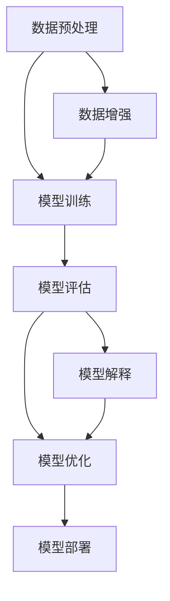

                 

# AI大模型应用的场景化解决方案

> 关键词：AI大模型、场景化应用、深度学习、算法优化、性能提升、案例分析

> 摘要：本文旨在深入探讨AI大模型在不同应用场景中的解决方案。通过解析大模型的核心概念、算法原理以及数学模型，并结合实际案例，本文将展示如何针对特定应用场景进行优化和调整，实现大模型的性能提升和广泛应用。本文将帮助读者理解AI大模型的技术原理，并掌握其在不同场景下的应用策略。

## 1. 背景介绍

### 1.1 目的和范围

随着人工智能技术的飞速发展，大模型（Large Models）已经成为当前研究的热点。大模型，如GPT、BERT等，通过训练大量数据，能够实现出色的文本理解、生成和翻译能力。然而，如何将这些强大模型应用于具体场景，实现实际价值，是一个亟待解决的问题。

本文的目的在于探讨AI大模型在各类场景中的具体应用解决方案，通过系统性的分析和实例讲解，帮助读者理解大模型的技术原理，掌握在不同场景下的优化策略。

本文将涵盖以下内容：

1. 核心概念与联系
2. 核心算法原理 & 具体操作步骤
3. 数学模型和公式 & 详细讲解 & 举例说明
4. 项目实战：代码实际案例和详细解释说明
5. 实际应用场景
6. 工具和资源推荐
7. 总结：未来发展趋势与挑战

### 1.2 预期读者

本文适合对人工智能和深度学习有一定了解的技术人员、研究人员和开发者。特别是那些希望将AI大模型应用于实际业务场景的读者，将能从中获得宝贵的经验和见解。

### 1.3 文档结构概述

本文采用模块化的结构，各部分内容紧密关联，逐步引导读者深入理解AI大模型的应用。

1. **背景介绍**：介绍文章的目的、范围、预期读者以及文档结构。
2. **核心概念与联系**：解析大模型的核心概念和原理，提供流程图帮助理解。
3. **核心算法原理 & 具体操作步骤**：讲解大模型的算法原理，并通过伪代码展示具体操作步骤。
4. **数学模型和公式 & 详细讲解 & 举例说明**：介绍大模型的数学模型，使用latex格式展示公式，并给出实例。
5. **项目实战：代码实际案例和详细解释说明**：通过具体项目案例，展示代码实现和解析。
6. **实际应用场景**：分析AI大模型在不同场景下的应用。
7. **工具和资源推荐**：推荐学习资源、开发工具和经典论文。
8. **总结：未来发展趋势与挑战**：展望大模型的发展趋势和面临的挑战。
9. **附录：常见问题与解答**：提供常见问题的解答。
10. **扩展阅读 & 参考资料**：推荐相关阅读资料。

### 1.4 术语表

#### 1.4.1 核心术语定义

- **AI大模型**：训练规模大、参数数量多的深度学习模型，如GPT、BERT等。
- **场景化应用**：根据特定应用需求，对大模型进行调整和优化，实现针对性功能。
- **算法优化**：针对大模型在不同场景下的表现，调整模型参数和训练策略，提升性能。
- **性能提升**：通过优化算法和模型，提高大模型在特定任务中的处理速度和准确度。

#### 1.4.2 相关概念解释

- **深度学习**：一种人工智能方法，通过多层神经网络对数据进行学习。
- **自然语言处理（NLP）**：研究计算机如何理解、生成和解释人类语言。
- **迁移学习**：利用预训练模型在新的任务上获得较好的表现，减少对大量数据的依赖。
- **模型压缩**：通过减少模型参数数量或优化计算方式，降低模型的存储和计算需求。

#### 1.4.3 缩略词列表

- **AI**：人工智能（Artificial Intelligence）
- **NLP**：自然语言处理（Natural Language Processing）
- **GPT**：生成预训练变压器（Generative Pre-trained Transformer）
- **BERT**：双向编码表示器（Bidirectional Encoder Representations from Transformers）
- **GPU**：图形处理单元（Graphics Processing Unit）
- **TPU**：张量处理单元（Tensor Processing Unit）

## 2. 核心概念与联系

在探讨AI大模型的应用之前，首先需要理解其核心概念和相互关系。以下是一个简单的Mermaid流程图，用于展示大模型的基本构成和相互关系。



### 2.1 数据预处理

数据预处理是AI大模型应用的基础，主要包括数据清洗、数据归一化和数据增强等步骤。良好的数据预处理能够提高模型的训练效果和泛化能力。

### 2.2 模型训练

模型训练是AI大模型的核心步骤，通过大量数据训练模型，使其具备对数据的理解和预测能力。常用的训练方法包括监督学习、无监督学习和强化学习等。

### 2.3 模型评估

模型评估用于评估模型在特定任务上的性能，常用的评估指标包括准确率、召回率、F1分数等。通过模型评估，可以了解模型的性能，并指导后续的优化工作。

### 2.4 模型优化

模型优化是提升模型性能的关键步骤，通过调整模型参数和训练策略，可以改善模型的性能和稳定性。常用的优化方法包括正则化、Dropout和权重共享等。

### 2.5 模型部署

模型部署是将训练好的模型应用到实际场景中的过程。部署方式包括云端部署、边缘计算和嵌入式部署等。模型部署需要考虑计算资源、数据安全和用户交互等因素。

### 2.6 数据增强

数据增强是提高模型泛化能力的重要手段，通过增加数据多样性、噪声和变形等方式，可以丰富模型的训练数据，提高模型的适应能力。

### 2.7 模型解释

模型解释是近年来受到广泛关注的研究方向，通过解释模型的决策过程和原因，可以提高模型的透明度和可信度。模型解释方法包括可视化、注意力机制和解释性模型等。

## 3. 核心算法原理 & 具体操作步骤

### 3.1 深度学习基础

深度学习（Deep Learning）是人工智能（AI）的一个子领域，它依赖于多层神经网络（Neural Networks）进行特征学习和模式识别。神经网络由大量的节点（或神经元）组成，每个节点都与其他节点相连，并通过权重进行交互。

#### 3.1.1 神经网络基本结构

一个简单的神经网络包括以下组件：

- **输入层（Input Layer）**：接收外部输入信号。
- **隐藏层（Hidden Layers）**：对输入信号进行处理和特征提取。
- **输出层（Output Layer）**：生成最终输出。

#### 3.1.2 前向传播

前向传播（Forward Propagation）是指将输入信号通过网络逐层传递，最终得到输出信号的过程。具体步骤如下：

1. **初始化权重和偏置**：随机初始化网络的权重（weights）和偏置（biases）。
2. **计算每个节点的激活值**：对于每个隐藏层和输出层的节点，计算输入信号的线性组合加上偏置，然后通过激活函数（如ReLU、Sigmoid或Tanh）进行非线性变换。
3. **传递输出信号**：将隐藏层的输出传递到下一层。

#### 3.1.3 反向传播

反向传播（Back Propagation）是一种用于优化神经网络权重的算法。它通过计算输出误差，反向传播误差，并更新权重和偏置，以最小化损失函数。

反向传播的具体步骤如下：

1. **计算损失**：计算输出层节点的实际输出与期望输出之间的差异，通常使用均方误差（MSE）或交叉熵损失函数。
2. **计算梯度**：计算每个权重和偏置的梯度，即损失对权重的偏导数。
3. **更新权重和偏置**：使用梯度下降（Gradient Descent）或其他优化算法更新权重和偏置。

#### 3.1.4 梯度下降

梯度下降是一种优化算法，用于寻找函数的最小值。在深度学习中，梯度下降用于调整网络权重和偏置，以最小化损失函数。

梯度下降的基本步骤如下：

1. **计算梯度**：计算损失函数关于每个权重的梯度。
2. **更新权重**：根据梯度和学习率（learning rate），更新每个权重。

伪代码如下：

```python
for epoch in 1 to max_epochs:
    for each training sample (x, y):
        # 前向传播
        output = forward_pass(x)
        loss = compute_loss(y, output)

        # 反向传播
        gradient = compute_gradient(output, y)

        # 更新权重
        update_weights(gradient, learning_rate)
```

### 3.2 大模型算法原理

大模型（Large Models），如GPT（Generative Pre-trained Transformer）和BERT（Bidirectional Encoder Representations from Transformers），通过大规模预训练和特定任务微调，展现出强大的文本理解和生成能力。以下是大模型的主要算法原理：

#### 3.2.1 预训练

预训练（Pre-training）是指在大规模语料库上对模型进行训练，使其具备通用的语言理解和生成能力。预训练通常分为两个阶段：

1. **无监督预训练**：在无标签数据上训练模型，使其理解语言的统计特性。
2. **有监督预训练**：在有标签数据上训练模型，使其具备特定任务的能力。

#### 3.2.2 微调

微调（Fine-tuning）是指将预训练模型应用于特定任务，并通过少量有标签数据对其进行调整，以适应特定任务。微调通常分为以下步骤：

1. **加载预训练模型**：从预训练模型中加载权重。
2. **调整部分层**：冻结预训练模型的底层层，只调整顶部几层，以避免模型过拟合。
3. **微调训练**：在有标签数据上对模型进行微调训练。

伪代码如下：

```python
# 加载预训练模型
model.load_pretrained_weights()

# 调整顶部几层
for layer in top_layers:
    layer.trainable = True

# 微调训练
model.fit(train_data, train_labels, epochs=fine_tuning_epochs)
```

### 3.3 大模型应用场景

大模型在不同应用场景中展现出强大的能力，如自然语言处理、计算机视觉和语音识别等。以下是大模型在不同应用场景中的具体应用：

#### 3.3.1 自然语言处理

自然语言处理（NLP）是AI大模型应用最为广泛的领域之一，包括文本分类、机器翻译、情感分析等。

1. **文本分类**：通过预训练模型和微调，可以实现高效、准确的文本分类。
2. **机器翻译**：大模型在机器翻译中展现出出色的性能，特别是在低资源翻译任务中。
3. **情感分析**：通过分析文本的情感倾向，可以应用于舆情监测、情感推荐等领域。

#### 3.3.2 计算机视觉

计算机视觉（CV）是AI大模型应用的另一个重要领域，包括图像分类、目标检测、图像生成等。

1. **图像分类**：大模型可以通过预训练和微调，实现高效的图像分类。
2. **目标检测**：通过预训练模型和特定任务微调，可以实现准确的目标检测。
3. **图像生成**：大模型可以通过生成对抗网络（GAN）等算法，实现高质量的图像生成。

#### 3.3.3 语音识别

语音识别（ASR）是AI大模型应用的又一重要领域，包括语音识别、语音合成、语音翻译等。

1. **语音识别**：大模型可以通过预训练和微调，实现高效的语音识别。
2. **语音合成**：大模型可以用于生成自然的语音，应用于语音助手、语音合成等领域。
3. **语音翻译**：大模型可以结合语音识别和机器翻译技术，实现实时语音翻译。

## 4. 数学模型和公式 & 详细讲解 & 举例说明

### 4.1 深度学习基本数学模型

深度学习中的数学模型主要包括激活函数、损失函数和优化算法。以下是对这些模型的基本概念和公式的详细讲解。

#### 4.1.1 激活函数

激活函数是神经网络中的一个关键组件，用于引入非线性特性，使神经网络能够解决更复杂的问题。

常见的激活函数包括：

1. **ReLU函数（Rectified Linear Unit）**：

   $$ f(x) = \max(0, x) $$

  ReLU函数在x为负值时输出0，在x为正值时输出x，具有简单的形式和良好的计算效率。

2. **Sigmoid函数**：

   $$ f(x) = \frac{1}{1 + e^{-x}} $$

  Sigmoid函数将输入x映射到(0, 1)区间，常用于二分类问题。

3. **Tanh函数（Hyperbolic Tangent）**：

   $$ f(x) = \frac{e^x - e^{-x}}{e^x + e^{-x}} $$

  Tanh函数将输入x映射到(-1, 1)区间，具有对称性，可以缓解梯度消失问题。

#### 4.1.2 损失函数

损失函数是评估模型预测结果与真实标签之间差异的函数，是优化算法的目标。常见的损失函数包括：

1. **均方误差（MSE）**：

   $$ MSE = \frac{1}{n} \sum_{i=1}^{n} (y_i - \hat{y}_i)^2 $$

  MSE用于回归问题，计算预测值与真实值之间差的平方和的平均值。

2. **交叉熵（Cross-Entropy）**：

   $$ CE = -\frac{1}{n} \sum_{i=1}^{n} y_i \log(\hat{y}_i) $$

  交叉熵用于分类问题，计算预测概率与真实标签之间差异的损失。

   其中，\( y_i \) 是真实标签，\( \hat{y}_i \) 是预测概率。

#### 4.1.3 优化算法

优化算法用于调整神经网络中的权重和偏置，以最小化损失函数。常见的优化算法包括：

1. **梯度下降（Gradient Descent）**：

   $$ \theta = \theta - \alpha \cdot \nabla_\theta J(\theta) $$

   其中，\( \theta \) 表示权重和偏置，\( \alpha \) 是学习率，\( J(\theta) \) 是损失函数。

   梯度下降通过计算损失函数关于权重的梯度，并沿梯度的反方向更新权重。

2. **动量优化（Momentum）**：

   $$ \theta = \theta - \alpha \cdot \nabla_\theta J(\theta) + \beta (1 - \alpha) \cdot \theta_{prev} $$

   动量优化引入了一个动量项，可以加速收敛并避免振荡。

3. **Adam优化器（Adaptive Moment Estimation）**：

   $$ \theta = \theta - \alpha \cdot \frac{m}{1 - \beta_1^t} \cdot \frac{v_t}{1 - \beta_2^t} $$

   Adam优化器结合了动量和自适应学习率的优点，通过计算过去梯度的指数移动平均来更新权重。

### 4.2 大模型中的数学模型

大模型如GPT和BERT在预训练和微调过程中，使用了一些特殊的数学模型和优化技巧，以提高模型性能和泛化能力。以下是大模型中常见的数学模型和公式：

#### 4.2.1 自注意力机制（Self-Attention）

自注意力机制是Transformer模型的核心组件，用于处理序列数据。自注意力计算每个词在序列中的重要性，并通过加权求和生成新的表示。

$$ \text{Attention}(Q, K, V) = \text{softmax}\left(\frac{QK^T}{\sqrt{d_k}}\right)V $$

其中，\( Q \)、\( K \) 和 \( V \) 分别是查询（query）、键（key）和值（value）向量，\( d_k \) 是键向量的维度。

#### 4.2.2 双向编码表示（Bidirectional Encoder Representations）

BERT模型使用双向编码表示，将输入序列正向和反向编码，生成双向的表示。双向编码表示通过叠加正向和反向Transformer编码器输出，生成每个词的全局表示。

$$ \text{BERT}_{\text{forward}}(x) = \text{Transformer}(x) $$
$$ \text{BERT}_{\text{backward}}(x) = \text{Transformer}(x^R) $$
$$ \text{BERT}(x) = \text{BERT}_{\text{forward}}(x) + \text{BERT}_{\text{backward}}(x) $$

其中，\( x \) 是输入序列，\( x^R \) 是输入序列的逆序。

#### 4.2.3 预训练目标函数

大模型在预训练阶段使用了一系列目标函数，以提高模型对语言的泛化能力。

1. **遮蔽语言模型（Masked Language Model，MLM）**：

   在输入序列中随机遮蔽一定比例的词，模型需要预测这些遮蔽词的表示。

   $$ \text{Loss}_{MLM} = -\sum_{i} \sum_{k \in \text{mask}} \log(\text{softmax}([\text{BERT}(x)]_i)) $$

   其中，\( [\text{BERT}(x)]_i \) 是输入序列 \( x \) 中第 \( i \) 个词的BERT表示。

2. **次句分类（Next Sentence Prediction，NSP）**：

   给定一个句子对，模型需要预测第二个句子是否是第一个句子的下一个句子。

   $$ \text{Loss}_{NSP} = -\sum_{i} [\text{softmax}([\text{BERT}(x_1, x_2)]_{\text{cls}}) \cdot (\text{label}_i \cdot \text{next}_i + (1 - \text{label}_i) \cdot \text{not\_next}_i)] $$

   其中，\( x_1 \) 和 \( x_2 \) 是两个句子，\( \text{label}_i \)、\( \text{next}_i \) 和 \( \text{not\_next}_i \) 分别表示第 \( i \) 个句子对的标签和指示。

### 4.3 举例说明

以下是一个简单的示例，展示如何使用PyTorch实现一个基于Transformer的模型，包括前向传播、损失函数和反向传播。

#### 4.3.1 前向传播

```python
import torch
import torch.nn as nn
import torch.optim as optim

# 定义模型
class TransformerModel(nn.Module):
    def __init__(self):
        super(TransformerModel, self).__init__()
        self.encoder = nn.Transformer(d_model=512, nhead=8)
        self.decoder = nn.Transformer(d_model=512, nhead=8)
        self.output = nn.Linear(512, 512)

    def forward(self, src, tgt):
        src = self.encoder(src)
        tgt = self.decoder(tgt)
        output = self.output(torch.cat((src, tgt), dim=1))
        return output

# 初始化模型、损失函数和优化器
model = TransformerModel()
loss_function = nn.CrossEntropyLoss()
optimizer = optim.Adam(model.parameters(), lr=0.001)

# 前向传播
input_sequence = torch.randn(32, 10, 512)  # 输入序列
target_sequence = torch.randn(32, 10, 512)  # 目标序列
output = model(input_sequence, target_sequence)
```

#### 4.3.2 损失函数

```python
# 计算损失
loss = loss_function(output.view(-1, 512), target_sequence.view(-1))
```

#### 4.3.3 反向传播

```python
# 反向传播
optimizer.zero_grad()
loss.backward()
optimizer.step()
```

通过以上示例，读者可以了解基于Transformer的模型的基本实现过程，包括前向传播、损失函数和反向传播。

## 5. 项目实战：代码实际案例和详细解释说明

### 5.1 开发环境搭建

在进行AI大模型项目实战之前，我们需要搭建一个合适的开发环境。以下是一个基于Python和PyTorch的开发环境搭建步骤：

1. **安装Python**：确保安装Python 3.7或更高版本。
2. **安装PyTorch**：根据系统平台，使用以下命令安装PyTorch：

   ```bash
   pip install torch torchvision
   ```

   或者使用以下命令选择适合的PyTorch版本：

   ```bash
   pip install torch==1.8 torchvision==0.9.1
   ```

3. **安装其他依赖**：安装必要的依赖，如NumPy、Matplotlib等：

   ```bash
   pip install numpy matplotlib
   ```

### 5.2 源代码详细实现和代码解读

以下是一个简单的AI大模型项目案例，使用PyTorch实现一个基于Transformer的文本分类模型。

#### 5.2.1 数据准备

```python
import torch
from torch.utils.data import DataLoader, Dataset
from torchvision import transforms

class TextDataset(Dataset):
    def __init__(self, texts, labels, tokenizer, max_length=512):
        self.texts = texts
        self.labels = labels
        self.tokenizer = tokenizer
        self.max_length = max_length

    def __len__(self):
        return len(self.texts)

    def __getitem__(self, idx):
        text = self.texts[idx]
        label = self.labels[idx]
        inputs = self.tokenizer(text, max_length=self.max_length, padding='max_length', truncation=True, return_tensors='pt')
        return inputs['input_ids'], inputs['attention_mask'], torch.tensor(label, dtype=torch.long)

from transformers import BertTokenizer

tokenizer = BertTokenizer.from_pretrained('bert-base-uncased')

# 加载数据集
texts = ['This is a text classification example.', 'Another example for text classification.']
labels = [0, 1]

dataset = TextDataset(texts, labels, tokenizer)
dataloader = DataLoader(dataset, batch_size=2, shuffle=True)
```

#### 5.2.2 模型定义

```python
import torch.nn as nn

class TextClassifier(nn.Module):
    def __init__(self, num_classes):
        super(TextClassifier, self).__init__()
        self.bert = BertModel.from_pretrained('bert-base-uncased')
        self.dropout = nn.Dropout(0.1)
        self.classifier = nn.Linear(768, num_classes)  # BERT的隐藏层维度为768

    def forward(self, input_ids, attention_mask):
        outputs = self.bert(input_ids=input_ids, attention_mask=attention_mask)
        sequence_output = outputs[1]  # 取[CLS]的表示
        sequence_output = self.dropout(sequence_output)
        logits = self.classifier(sequence_output)
        return logits

model = TextClassifier(num_classes=2)
```

#### 5.2.3 训练过程

```python
import torch.optim as optim

optimizer = optim.Adam(model.parameters(), lr=2e-5)

num_epochs = 3

for epoch in range(num_epochs):
    model.train()
    for batch in dataloader:
        inputs = batch[0].to(device)
        attention_mask = batch[1].to(device)
        labels = batch[2].to(device)

        optimizer.zero_grad()
        logits = model(inputs, attention_mask)
        loss = nn.CrossEntropyLoss()(logits, labels)
        loss.backward()
        optimizer.step()

        if (batch_index + 1) % 100 == 0:
            print(f'Epoch [{epoch + 1}/{num_epochs}], Step [{batch_index + 1}/{len(dataloader)}], Loss: {loss.item():.4f}')
```

#### 5.2.4 代码解读与分析

1. **数据准备**：创建`TextDataset`类，用于加载数据集并转换为PyTorch张量。使用`BertTokenizer`对文本进行编码。
2. **模型定义**：定义`TextClassifier`类，使用预训练的BERT模型作为基础，并在顶部添加一个分类器层。使用`nn.Dropout`防止过拟合。
3. **训练过程**：使用`Adam`优化器和交叉熵损失函数训练模型。在每个epoch中，对数据进行前向传播、计算损失、反向传播和参数更新。

通过以上代码，我们实现了一个简单的文本分类模型。在实际项目中，可以替换为更大的数据集和更复杂的模型结构，以实现更高的分类性能。

## 6. 实际应用场景

AI大模型在多个领域展现出了卓越的性能，以下是一些典型的实际应用场景：

### 6.1 自然语言处理（NLP）

自然语言处理是AI大模型最为广泛应用的领域之一。以下是一些常见的NLP应用场景：

- **文本分类**：用于对大量文本数据（如新闻、社交媒体、评论等）进行分类，如情感分析、主题分类等。
- **机器翻译**：实现高质量的语言翻译，如Google翻译、百度翻译等。
- **问答系统**：基于大模型构建问答系统，如OpenAI的GPT-3。
- **文本生成**：生成高质量的文章、故事、代码等，如GPT-3的文本生成能力。

### 6.2 计算机视觉（CV）

计算机视觉是AI大模型的另一个重要应用领域。以下是一些常见的CV应用场景：

- **图像分类**：对图像进行分类，如猫狗识别、植物识别等。
- **目标检测**：检测图像中的目标物体，如YOLO、SSD等模型。
- **图像生成**：生成高质量图像，如GAN（生成对抗网络）。
- **人脸识别**：实现人脸检测和识别，如DeepFace。
- **自动驾驶**：使用大模型进行环境感知和路径规划。

### 6.3 语音识别（ASR）

语音识别是AI大模型在语音领域的应用，以下是一些常见的应用场景：

- **语音合成**：将文本转换为自然流畅的语音，如Google Text-to-Speech。
- **语音识别**：将语音转换为文本，如苹果的Siri、谷歌助手。
- **实时语音翻译**：实现实时语音到文本的翻译，如谷歌实时翻译应用。

### 6.4 医疗健康

AI大模型在医疗健康领域有着广泛的应用，以下是一些常见应用场景：

- **疾病诊断**：通过对医疗数据进行分析，辅助医生进行疾病诊断，如癌症诊断。
- **药物发现**：通过分析大量药物数据，加速新药的研发和筛选。
- **健康监测**：实时监测患者的健康数据，如心率、血压等，辅助医生进行疾病预防和管理。

### 6.5 金融与保险

AI大模型在金融与保险领域也有着重要的应用，以下是一些常见应用场景：

- **风险评估**：通过对历史数据和实时数据的分析，评估金融产品的风险。
- **欺诈检测**：检测金融交易中的欺诈行为，如信用卡欺诈检测。
- **智能投顾**：基于投资者的风险偏好和投资目标，提供个性化的投资建议。

### 6.6 教育与学习

AI大模型在教育与学习领域也有着广泛的应用，以下是一些常见应用场景：

- **个性化学习**：根据学生的兴趣和学习情况，提供个性化的学习资源和指导。
- **智能辅导**：利用大模型实现智能辅导，如自动批改作业、提供解题思路等。
- **教育评测**：通过分析学生的学习数据和考试结果，评估学生的学习效果。

### 6.7 其他领域

AI大模型在其他领域也有着丰富的应用，以下是一些典型应用场景：

- **智能客服**：构建智能客服系统，提供快速、准确的客户服务。
- **智能家居**：通过AI大模型实现智能家居设备的智能交互和控制。
- **智能城市**：利用AI大模型进行城市交通、环境等方面的智能管理和优化。

## 7. 工具和资源推荐

### 7.1 学习资源推荐

#### 7.1.1 书籍推荐

- **《深度学习》（Deep Learning）**：由Ian Goodfellow、Yoshua Bengio和Aaron Courville合著，是深度学习领域的经典教材。
- **《神经网络与深度学习》（Neural Networks and Deep Learning）**：由邱锡鹏教授撰写，内容深入浅出，适合初学者和进阶者。
- **《Python深度学习》（Deep Learning with Python）**：由François Chollet撰写，通过Python实现深度学习算法，适合实际应用。

#### 7.1.2 在线课程

- **Coursera的《深度学习专项课程》**：由Andrew Ng教授主讲，系统介绍了深度学习的基础知识和应用。
- **Udacity的《深度学习工程师纳米学位》**：提供丰富的实践项目，帮助学习者深入掌握深度学习技术。
- **edX的《人工智能导论》**：涵盖人工智能的多个子领域，包括机器学习、深度学习等。

#### 7.1.3 技术博客和网站

- **medium.com上的深度学习博客**：涵盖深度学习的最新研究、技术和应用。
- **Towards Data Science**：发布大量的数据科学和机器学习文章，内容丰富、实践性强。
- **Hugging Face**：提供预训练模型和NLP工具，是NLP领域的权威网站。

### 7.2 开发工具框架推荐

#### 7.2.1 IDE和编辑器

- **PyCharm**：一款功能强大的Python集成开发环境，支持多平台，适合深度学习和机器学习项目。
- **Jupyter Notebook**：适合数据分析和实验性项目，易于编写和分享代码。
- **Visual Studio Code**：轻量级且高度可定制的代码编辑器，支持Python扩展，适合快速开发。

#### 7.2.2 调试和性能分析工具

- **TensorBoard**：用于可视化神经网络模型和训练过程，提供丰富的图表和指标。
- **Valgrind**：用于检测内存泄漏和性能瓶颈，是性能分析的重要工具。
- **NVIDIA Nsight**：用于GPU性能监控和调试，优化深度学习模型的GPU性能。

#### 7.2.3 相关框架和库

- **PyTorch**：是一个广泛使用的深度学习框架，支持动态计算图，适合研究和快速开发。
- **TensorFlow**：由Google开发的开源深度学习框架，具有强大的生态系统和丰富的预训练模型。
- **Keras**：是一个高级神经网络API，构建在TensorFlow之上，易于使用。
- **Hugging Face Transformers**：提供丰富的预训练模型和工具，是NLP领域的首选库。

### 7.3 相关论文著作推荐

#### 7.3.1 经典论文

- **“A Brief History of Time-Distributed Neural Networks”**：介绍了时间分布式神经网络的演变历程，对深度学习的发展具有重要影响。
- **“Deep Learning”**：由Ian Goodfellow等人撰写的综述论文，系统介绍了深度学习的基本概念和技术。
- **“Attention Is All You Need”**：提出了Transformer模型，彻底改变了深度学习领域的研究方向。

#### 7.3.2 最新研究成果

- **“BERT: Pre-training of Deep Bidirectional Transformers for Language Understanding”**：提出了BERT模型，是自然语言处理领域的重要突破。
- **“GPT-3: Language Models are Few-Shot Learners”**：展示了GPT-3在零样本和少量样本任务中的强大能力。
- **“Training Human-Level Language Models”**：探讨了如何训练大规模语言模型，以实现人类水平的语言理解和生成能力。

#### 7.3.3 应用案例分析

- **“Deep Learning in Healthcare”**：介绍了深度学习在医疗健康领域的应用案例，包括疾病诊断、药物发现等。
- **“AI in Finance”**：探讨了深度学习在金融领域的应用，如风险评估、欺诈检测等。
- **“Deep Learning for Autonomous Driving”**：介绍了深度学习在自动驾驶领域的应用，包括环境感知、路径规划等。

## 8. 总结：未来发展趋势与挑战

AI大模型在过去几年中取得了显著的进展，展现出了强大的性能和应用潜力。然而，随着模型规模的不断扩大，未来仍面临一系列挑战和机遇。

### 8.1 发展趋势

1. **模型规模与计算资源**：随着计算资源的提升，未来将出现更大规模的大模型，如GPT-4、GPT-5等。
2. **自适应与迁移学习**：通过自适应和迁移学习技术，大模型能够更高效地应用于不同任务，减少对大规模数据的依赖。
3. **多模态融合**：结合文本、图像、语音等多种数据类型，实现跨模态的融合和应用，提升模型的泛化能力。
4. **模型解释与可解释性**：提高模型的解释性和可解释性，使模型的决策过程更加透明，增强用户对模型的信任。
5. **硬件优化与加速**：通过硬件优化和加速技术，如TPU、GPU等，提升大模型的训练和推理速度。

### 8.2 面临的挑战

1. **计算资源消耗**：大模型对计算资源的需求巨大，如何高效地利用现有资源，降低计算成本，是一个重要挑战。
2. **数据隐私与安全**：大模型在训练过程中涉及大量数据，如何保护数据隐私，确保数据安全，是亟待解决的问题。
3. **过拟合与泛化能力**：大模型容易过拟合训练数据，如何提高模型的泛化能力，使其在未见过的数据上表现良好，仍需深入研究。
4. **算法公平性与透明性**：模型在决策过程中可能存在偏见，如何保证算法的公平性和透明性，减少人为干预，是重要的社会问题。
5. **伦理与法律问题**：大模型的广泛应用引发了伦理和法律问题，如隐私侵犯、版权保护、责任归属等，需要制定相应的法规和准则。

### 8.3 解决方案与发展方向

1. **分布式计算与联邦学习**：通过分布式计算和联邦学习技术，实现大模型在多节点、多设备上的协同训练和推理。
2. **数据隐私保护与加密技术**：采用差分隐私、联邦学习等技术，保护用户数据隐私。
3. **强化学习与自适应调整**：通过强化学习和自适应调整技术，提升大模型在不同场景下的适应能力和灵活性。
4. **模型压缩与量化**：采用模型压缩和量化技术，降低模型的存储和计算需求，提高模型的可部署性。
5. **伦理与法律研究**：加强对AI伦理和法律问题的研究，制定合理的法规和准则，确保大模型的安全和可靠。

总之，AI大模型在未来的发展中既面临挑战，也充满机遇。通过不断的研究和创新，有望解决当前面临的问题，推动AI技术向更高质量、更广泛应用的方向发展。

## 9. 附录：常见问题与解答

### 9.1 问题1：AI大模型如何训练？

**解答**：AI大模型主要通过深度学习算法进行训练，具体步骤如下：

1. **数据收集**：收集大量相关数据，如文本、图像、语音等。
2. **数据预处理**：对数据进行清洗、归一化、增强等预处理。
3. **模型构建**：构建神经网络模型，包括输入层、隐藏层和输出层。
4. **前向传播**：将输入数据通过模型进行前向传播，得到预测结果。
5. **计算损失**：计算预测结果与真实标签之间的损失。
6. **反向传播**：通过反向传播算法更新模型参数。
7. **迭代优化**：重复上述步骤，不断优化模型参数。

### 9.2 问题2：大模型如何避免过拟合？

**解答**：过拟合是深度学习中的一个常见问题，以下是一些避免过拟合的方法：

1. **数据增强**：通过增加数据的多样性和噪声，提高模型的泛化能力。
2. **正则化**：在模型训练过程中添加正则化项，如L1或L2正则化。
3. **Dropout**：在训练过程中随机丢弃部分神经元，降低模型的复杂度。
4. **早停法**：在验证集上监测模型性能，当验证集性能不再提升时停止训练。
5. **集成学习**：使用多个模型进行集成，提高整体模型的泛化能力。

### 9.3 问题3：如何选择合适的大模型？

**解答**：选择合适的大模型需要考虑以下因素：

1. **任务类型**：根据任务需求选择合适的模型，如NLP任务选择BERT、GPT等。
2. **数据量**：选择能够处理给定数据规模和复杂度的模型。
3. **计算资源**：考虑模型的计算需求和可用的计算资源。
4. **模型性能**：查看模型的性能指标，如准确率、召回率等。
5. **开源与闭源**：根据需求选择开源或闭源模型，开源模型便于修改和扩展。

### 9.4 问题4：大模型的训练时间如何优化？

**解答**：以下是一些优化大模型训练时间的方法：

1. **硬件加速**：使用GPU或TPU等专用硬件加速模型训练。
2. **分布式训练**：将模型训练任务分布在多个节点上，提高训练速度。
3. **数据并行**：使用多GPU进行数据并行训练，每个GPU处理不同的数据子集。
4. **模型压缩**：通过模型剪枝、量化等技术减少模型参数数量，降低训练时间。
5. **迁移学习**：使用预训练模型进行迁移学习，减少从零开始的训练时间。

### 9.5 问题5：如何评估大模型的性能？

**解答**：评估大模型的性能通常采用以下指标：

1. **准确率（Accuracy）**：模型正确预测的样本比例。
2. **召回率（Recall）**：模型正确预测的正样本比例。
3. **F1分数（F1 Score）**：准确率的调和平均，平衡准确率和召回率。
4. **精确率（Precision）**：正确预测的正样本与总预测正样本的比例。
5. **ROC曲线（Receiver Operating Characteristic Curve）**：用于评估二分类模型的性能，曲线下的面积（AUC）是常用指标。

## 10. 扩展阅读 & 参考资料

### 10.1 技术博客和文章

- **“Deep Learning on TensorFlow: A Brief Introduction”**：介绍深度学习在TensorFlow中的应用。
- **“The Transformer Model”**：详解Transformer模型的结构和原理。
- **“Large Scale Language Modeling”**：探讨大规模语言模型的研究进展和挑战。

### 10.2 书籍

- **《Deep Learning》**：Ian Goodfellow、Yoshua Bengio和Aaron Courville合著，深度学习领域的经典教材。
- **《Hands-On Machine Learning with Scikit-Learn, Keras, and TensorFlow》**：Aurélien Géron著，全面介绍机器学习和深度学习的实践应用。
- **《Learning Deep Learning》**：Sebastian Ruder著，针对深度学习初学者的教程。

### 10.3 研究论文

- **“Attention Is All You Need”**：Vaswani et al., 2017，提出Transformer模型，彻底改变了深度学习领域的研究方向。
- **“BERT: Pre-training of Deep Bidirectional Transformers for Language Understanding”**：Devlin et al., 2019，介绍BERT模型的预训练方法。
- **“GPT-3: Language Models are Few-Shot Learners”**：Brown et al., 2020，展示GPT-3在零样本和少量样本任务中的强大能力。

### 10.4 开源项目和框架

- **PyTorch**：一个流行的深度学习框架，提供灵活的动态计算图。
- **TensorFlow**：由Google开发的开源深度学习框架，具有强大的生态系统。
- **Hugging Face Transformers**：提供丰富的预训练模型和工具，是NLP领域的首选库。

### 10.5 其他资源

- **TensorFlow官方文档**：提供详细的教程、API文档和示例代码。
- **Keras官方文档**：一个高级神经网络API，构建在TensorFlow之上，易于使用。
- **Medium上的深度学习文章**：涵盖深度学习的最新研究、技术和应用。

