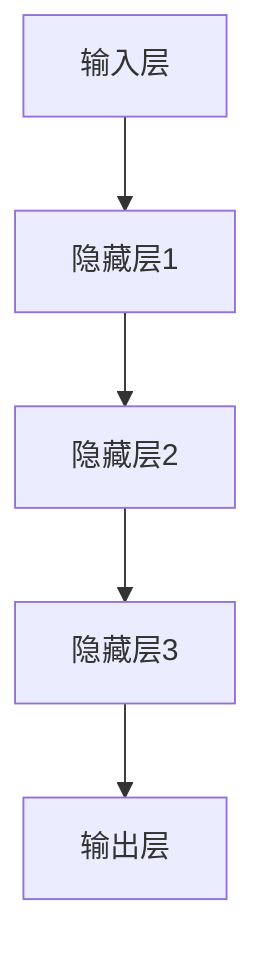
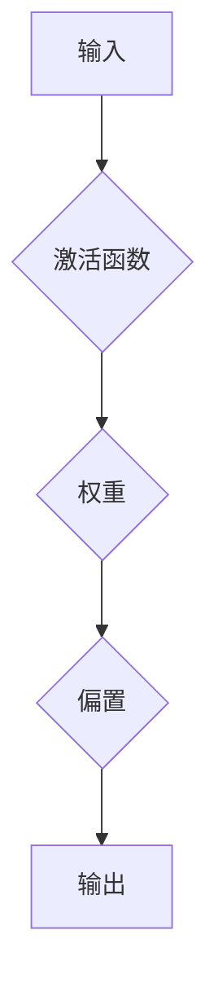
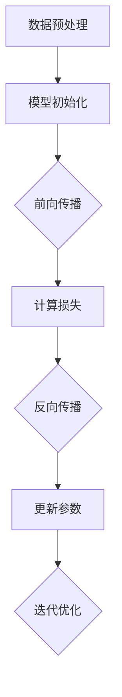
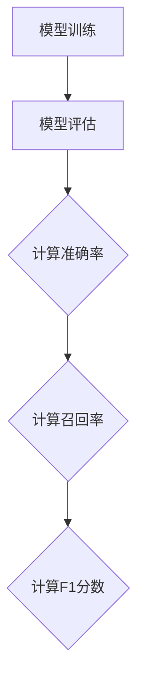
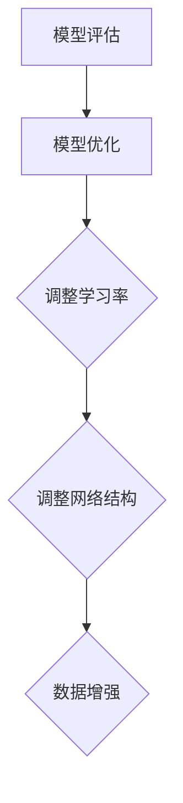

                 

# AI大模型时代的新编程范式

> 关键词：AI大模型，编程范式，深度学习，神经网络，模型训练，编程语言，软件工程

> 摘要：本文旨在探讨AI大模型时代下的新编程范式。随着深度学习和神经网络技术的飞速发展，传统编程方式正面临着巨大的挑战和变革。本文将从背景介绍、核心概念、算法原理、数学模型、项目实战、应用场景、工具资源推荐等多个角度，系统分析AI大模型时代编程范式的新趋势和关键挑战，为读者提供一份全面的技术指南。

## 1. 背景介绍

### 1.1 目的和范围

本文旨在探讨AI大模型时代下的编程范式变革。随着深度学习和神经网络技术的飞速发展，传统的编程范式正面临着前所未有的挑战。AI大模型的出现，使得数据处理和分析的能力达到了前所未有的高度，同时也对编程语言和开发工具提出了新的要求。本文将围绕以下主题展开：

1. AI大模型的核心概念和架构。
2. AI大模型相关的算法原理和操作步骤。
3. AI大模型在数学模型和公式中的应用。
4. AI大模型在实际项目中的代码实现和分析。
5. AI大模型的应用场景和技术挑战。
6. AI大模型开发所需的学习资源和工具。

### 1.2 预期读者

本文主要面向以下读者：

1. 对AI大模型和深度学习技术感兴趣的程序员和开发者。
2. 对编程范式变革和软件工程有深入研究的科研人员。
3. 对未来技术趋势和发展方向有前瞻性思考的IT从业者。

### 1.3 文档结构概述

本文结构如下：

1. 引言：介绍AI大模型时代编程范式的背景和重要性。
2. 核心概念与联系：详细解析AI大模型的核心概念和架构。
3. 核心算法原理 & 具体操作步骤：讲解AI大模型的算法原理和操作步骤。
4. 数学模型和公式 & 详细讲解 & 举例说明：阐述AI大模型在数学模型和公式中的应用。
5. 项目实战：展示AI大模型在实际项目中的代码实现和分析。
6. 实际应用场景：探讨AI大模型的应用场景和技术挑战。
7. 工具和资源推荐：推荐学习资源和开发工具。
8. 总结：总结AI大模型时代编程范式的新趋势和挑战。
9. 附录：常见问题与解答。
10. 扩展阅读 & 参考资料：提供进一步学习的资源。

### 1.4 术语表

#### 1.4.1 核心术语定义

- AI大模型：指具有海量参数和复杂结构的深度学习模型，通常用于大规模数据分析和预测任务。
- 深度学习：一种基于多层神经网络的学习方法，能够从大量数据中自动提取特征和模式。
- 神经网络：由大量神经元组成的计算模型，通过学习输入数据中的特征，实现对复杂问题的求解。
- 模型训练：通过大量数据训练模型，使其能够对未知数据进行预测和分类。
- 编程范式：指编程方法和思维方式，包括过程式编程、面向对象编程、函数式编程等。

#### 1.4.2 相关概念解释

- 数据预处理：在模型训练前，对数据进行清洗、归一化等处理，以提高模型性能。
- 模型评估：通过评估指标（如准确率、召回率等）对模型的性能进行评估。
- 模型优化：通过调整模型参数和结构，提高模型性能和效率。

#### 1.4.3 缩略词列表

- AI：人工智能
- ML：机器学习
- DL：深度学习
- NN：神经网络
- GPU：图形处理器
- TPU：张量处理器

## 2. 核心概念与联系

在AI大模型时代，理解和掌握核心概念和联系是至关重要的。以下是对AI大模型时代的关键概念和联系进行解析，并提供相应的Mermaid流程图。

### 2.1 深度学习模型

深度学习模型是由多层神经元组成的计算模型，通过学习输入数据中的特征，实现对复杂问题的求解。以下是深度学习模型的基本架构：



### 2.2 神经网络

神经网络是深度学习模型的基础，它由大量神经元组成，每个神经元通过权重和偏置进行连接。以下是神经网络的示意图：



### 2.3 模型训练

模型训练是深度学习过程中的关键步骤，它通过大量数据来调整模型参数，以提高模型性能。以下是模型训练的基本流程：



### 2.4 模型评估

模型评估是对训练好的模型进行性能评估的过程。常用的评估指标包括准确率、召回率、F1分数等。以下是模型评估的基本流程：



### 2.5 模型优化

模型优化是通过调整模型参数和结构，提高模型性能和效率的过程。以下是模型优化的基本方法：



通过上述核心概念和联系的解析，我们可以更好地理解AI大模型时代下的编程范式。在接下来的章节中，我们将进一步探讨AI大模型的算法原理和具体操作步骤。

## 3. 核心算法原理 & 具体操作步骤

AI大模型的核心算法原理是基于深度学习和神经网络的模型训练。深度学习通过多层神经网络对输入数据进行特征提取和模式识别，从而实现复杂的任务。以下将详细介绍深度学习模型的算法原理和具体操作步骤。

### 3.1 深度学习模型算法原理

深度学习模型的核心是多层神经网络，它由输入层、隐藏层和输出层组成。神经网络通过前向传播和反向传播两个过程来学习和优化模型。

**前向传播：**

1. 输入数据经过输入层进入神经网络。
2. 数据在每一层神经元中经过加权求和和激活函数的处理，传递到下一层。
3. 最终输出层产生预测结果。

**反向传播：**

1. 计算输出结果与实际结果的误差。
2. 误差沿着反向传播路径，逐层计算每个神经元的梯度。
3. 根据梯度调整每个神经元的权重和偏置，以减小误差。

### 3.2 具体操作步骤

以下是深度学习模型的具体操作步骤：

#### 3.2.1 数据预处理

在训练模型之前，需要对数据进行预处理，包括数据清洗、归一化和数据增强等。

1. 数据清洗：去除数据中的噪声和异常值。
2. 数据归一化：将数据缩放到相同的范围，以加快训练过程。
3. 数据增强：通过旋转、翻转、裁剪等方式增加数据多样性，提高模型泛化能力。

#### 3.2.2 模型初始化

初始化模型参数，包括权重和偏置。常用的初始化方法有随机初始化、高斯初始化等。

```python
# 随机初始化权重和偏置
weights = np.random.randn(num_layers, input_dim)
biases = np.random.randn(num_layers, hidden_dim)
```

#### 3.2.3 前向传播

1. 计算输入层到隐藏层的激活值。
2. 计算隐藏层到输出层的激活值。
3. 计算输出结果。

```python
# 前向传播计算
z = np.dot(weights, x) + biases
a = sigmoid(z)
y = np.dot(weights, a) + biases
y_pred = sigmoid(y)
```

#### 3.2.4 反向传播

1. 计算输出层误差。
2. 计算隐藏层误差。
3. 根据误差调整权重和偏置。

```python
# 反向传播计算
delta_output = (y_pred - y) * sigmoid_derivative(y_pred)
delta_hidden = (delta_output.dot(weights.T) * sigmoid_derivative(a))

# 更新权重和偏置
weights -= learning_rate * delta_output * x.T
biases -= learning_rate * delta_output
weights -= learning_rate * delta_hidden * a.T
biases -= learning_rate * delta_hidden
```

#### 3.2.5 模型优化

1. 调整学习率。
2. 调整网络结构。
3. 进行数据增强。

```python
# 调整学习率
learning_rate = 0.01

# 调整网络结构
hidden_dim = 100

# 数据增强
x = rotate(x, angle=10)
y = rotate(y, angle=10)
```

通过上述步骤，我们可以构建一个深度学习模型，并对其进行训练和优化。在实际应用中，需要根据具体任务和数据调整模型参数和优化方法，以提高模型性能。

## 4. 数学模型和公式 & 详细讲解 & 举例说明

在AI大模型时代，数学模型和公式是理解和实现深度学习算法的核心。以下将详细讲解深度学习中的几个关键数学模型和公式，并通过具体示例进行说明。

### 4.1 激活函数

激活函数是深度学习模型中的一个关键组成部分，它将神经元的线性输出转换为一个非线性值，从而增加模型的复杂度和表达能力。常用的激活函数包括sigmoid、ReLU和tanh。

#### 4.1.1 Sigmoid函数

sigmoid函数是一种常用的激活函数，其公式如下：

$$
\sigma(x) = \frac{1}{1 + e^{-x}}
$$

#### 示例

假设输入值为x = -2，我们可以计算sigmoid函数的输出：

$$
\sigma(-2) = \frac{1}{1 + e^{2}} \approx 0.1192
$$

#### 4.1.2 ReLU函数

ReLU（Rectified Linear Unit）函数是一种简单的非线性激活函数，其公式如下：

$$
\text{ReLU}(x) = \max(0, x)
$$

#### 示例

假设输入值为x = -2，我们可以计算ReLU函数的输出：

$$
\text{ReLU}(-2) = \max(0, -2) = 0
$$

#### 4.1.3 Tanh函数

tanh函数是另一种常用的激活函数，其公式如下：

$$
\tanh(x) = \frac{e^x - e^{-x}}{e^x + e^{-x}}
$$

#### 示例

假设输入值为x = -2，我们可以计算tanh函数的输出：

$$
\tanh(-2) = \frac{e^{-2} - e^{2}}{e^{-2} + e^{2}} \approx -0.9640
$$

### 4.2 损失函数

损失函数是衡量模型预测结果与实际结果之间差异的指标，是深度学习模型训练过程中的核心。常用的损失函数包括均方误差（MSE）、交叉熵（Cross-Entropy）等。

#### 4.2.1 均方误差（MSE）

均方误差（MSE）是衡量预测值与实际值之间差异的一种常用损失函数，其公式如下：

$$
MSE = \frac{1}{n}\sum_{i=1}^{n}(y_i - \hat{y}_i)^2
$$

其中，$y_i$ 是实际值，$\hat{y}_i$ 是预测值，$n$ 是样本数量。

#### 示例

假设我们有两个样本，实际值分别为 $y_1 = 3$ 和 $y_2 = 5$，预测值分别为 $\hat{y}_1 = 2$ 和 $\hat{y}_2 = 6$，我们可以计算MSE：

$$
MSE = \frac{1}{2}\left[(3 - 2)^2 + (5 - 6)^2\right] = \frac{1}{2}(1 + 1) = 1
$$

#### 4.2.2 交叉熵（Cross-Entropy）

交叉熵是衡量分类模型预测结果与实际结果之间差异的一种损失函数，其公式如下：

$$
H(y, \hat{y}) = -\sum_{i=1}^{n} y_i \log(\hat{y}_i)
$$

其中，$y$ 是实际标签，$\hat{y}$ 是预测概率分布。

#### 示例

假设我们有一个二元分类问题，实际标签 $y_1 = 1$，预测概率 $\hat{y}_1 = 0.9$，我们可以计算交叉熵：

$$
H(y, \hat{y}) = -1 \cdot \log(0.9) \approx -0.1054
$$

### 4.3 梯度下降

梯度下降是深度学习模型训练过程中的一种常用优化方法，其核心思想是通过计算损失函数关于模型参数的梯度，并沿着梯度的反方向更新模型参数，以最小化损失函数。

#### 4.3.1 梯度计算

梯度下降首先需要计算损失函数关于模型参数的梯度。对于均方误差（MSE）损失函数，梯度计算如下：

$$
\frac{\partial MSE}{\partial \theta} = 2 \cdot (y - \hat{y})
$$

其中，$\theta$ 是模型参数。

#### 示例

假设我们有模型参数 $\theta = 0.5$，实际标签 $y = 3$，预测值 $\hat{y} = 2$，我们可以计算梯度：

$$
\frac{\partial MSE}{\partial \theta} = 2 \cdot (3 - 2) = 2
$$

#### 4.3.2 参数更新

在计算梯度后，梯度下降通过以下公式更新模型参数：

$$
\theta_{\text{new}} = \theta_{\text{old}} - \alpha \cdot \frac{\partial MSE}{\partial \theta}
$$

其中，$\alpha$ 是学习率。

#### 示例

假设学习率 $\alpha = 0.1$，我们可以更新模型参数：

$$
\theta_{\text{new}} = 0.5 - 0.1 \cdot 2 = 0.3
$$

通过上述数学模型和公式的讲解，我们可以更好地理解深度学习算法的工作原理。在实际应用中，我们需要根据具体任务和数据调整模型参数和优化方法，以提高模型性能。

## 5. 项目实战：代码实际案例和详细解释说明

为了更好地理解AI大模型时代下的编程范式，我们将通过一个实际项目案例来展示如何实现一个深度学习模型，并进行代码解读与分析。这个项目将利用Python和TensorFlow框架，实现一个简单的图像分类任务。

### 5.1 开发环境搭建

在开始项目之前，我们需要搭建一个合适的开发环境。以下步骤将指导您安装所需的软件和库。

#### 步骤1：安装Python

首先，确保您的计算机上已安装Python。建议安装Python 3.7或更高版本。您可以通过访问[Python官网](https://www.python.org/)下载并安装Python。

#### 步骤2：安装Anaconda

Anaconda是一个集成了Python和众多科学计算库的开源平台。安装Anaconda后，可以使用conda命令轻松管理Python环境和库。

- 访问[Anaconda官网](https://www.anaconda.com/)下载并安装Anaconda。
- 安装过程中选择添加Anaconda到系统环境变量。

#### 步骤3：创建Python环境

创建一个新的Python环境，以便管理和隔离项目依赖。

- 打开终端或命令提示符。
- 执行以下命令创建环境：

  ```bash
  conda create -n deep_learning_env python=3.9
  ```

- 激活环境：

  ```bash
  conda activate deep_learning_env
  ```

#### 步骤4：安装TensorFlow

在创建的环境中使用conda命令安装TensorFlow。

- 执行以下命令安装TensorFlow：

  ```bash
  conda install tensorflow
  ```

### 5.2 源代码详细实现和代码解读

接下来，我们将展示一个简单的图像分类项目，并对其进行详细解释。

#### 5.2.1 代码实现

以下是一个简单的图像分类项目的代码实现：

```python
import tensorflow as tf
from tensorflow.keras import datasets, layers, models

# 加载和预处理数据
(train_images, train_labels), (test_images, test_labels) = datasets.cifar10.load_data()

train_images, test_images = train_images / 255.0, test_images / 255.0

# 构建模型
model = models.Sequential()
model.add(layers.Conv2D(32, (3, 3), activation='relu', input_shape=(32, 32, 3)))
model.add(layers.MaxPooling2D((2, 2)))
model.add(layers.Conv2D(64, (3, 3), activation='relu'))
model.add(layers.MaxPooling2D((2, 2)))
model.add(layers.Conv2D(64, (3, 3), activation='relu'))

# 添加全连接层
model.add(layers.Flatten())
model.add(layers.Dense(64, activation='relu'))
model.add(layers.Dense(10, activation='softmax'))

# 编译模型
model.compile(optimizer='adam',
              loss='sparse_categorical_crossentropy',
              metrics=['accuracy'])

# 训练模型
model.fit(train_images, train_labels, epochs=10, validation_data=(test_images, test_labels))

# 评估模型
test_loss, test_acc = model.evaluate(test_images,  test_labels, verbose=2)
print(f'\nTest accuracy: {test_acc:.4f}')
```

#### 5.2.2 代码解读

以下是代码的逐行解读：

1. **导入库：**
   ```python
   import tensorflow as tf
   from tensorflow.keras import datasets, layers, models
   ```
   导入TensorFlow库和相关模块。

2. **加载和预处理数据：**
   ```python
   (train_images, train_labels), (test_images, test_labels) = datasets.cifar10.load_data()
   train_images, test_images = train_images / 255.0, test_images / 255.0
   ```
   加载CIFAR-10数据集，并将图像数据归一化至[0, 1]范围。

3. **构建模型：**
   ```python
   model = models.Sequential()
   model.add(layers.Conv2D(32, (3, 3), activation='relu', input_shape=(32, 32, 3)))
   model.add(layers.MaxPooling2D((2, 2)))
   model.add(layers.Conv2D(64, (3, 3), activation='relu'))
   model.add(layers.MaxPooling2D((2, 2)))
   model.add(layers.Conv2D(64, (3, 3), activation='relu'))
   ```
   使用`Sequential`模型堆叠多层卷积神经网络。首先添加一个32个卷积核的卷积层，然后添加一个最大池化层。重复这个过程，增加64个卷积核和64个卷积核。

4. **添加全连接层：**
   ```python
   model.add(layers.Flatten())
   model.add(layers.Dense(64, activation='relu'))
   model.add(layers.Dense(10, activation='softmax'))
   ```
   将卷积神经网络输出展平，然后添加一个全连接层和一个具有10个输出的softmax层，用于分类。

5. **编译模型：**
   ```python
   model.compile(optimizer='adam',
                 loss='sparse_categorical_crossentropy',
                 metrics=['accuracy'])
   ```
   配置模型编译，选择优化器、损失函数和评估指标。

6. **训练模型：**
   ```python
   model.fit(train_images, train_labels, epochs=10, validation_data=(test_images, test_labels))
   ```
   使用训练数据训练模型，设置10个训练周期和验证数据。

7. **评估模型：**
   ```python
   test_loss, test_acc = model.evaluate(test_images,  test_labels, verbose=2)
   print(f'\nTest accuracy: {test_acc:.4f}')
   ```
   使用测试数据评估模型，打印测试准确率。

### 5.3 代码解读与分析

通过上述代码解读，我们可以看到如何使用TensorFlow构建一个简单的卷积神经网络（CNN）进行图像分类任务。

- **数据预处理：** 加载CIFAR-10数据集后，对图像数据进行了归一化处理，这有助于加速模型的训练过程和改善模型性能。

- **模型构建：** 使用`Sequential`模型堆叠了多个卷积层和池化层，这是CNN的核心部分。卷积层用于提取图像特征，池化层用于下采样和减少参数数量。

- **全连接层：** 在卷积神经网络之后，添加了一个全连接层和一个softmax层，用于分类。

- **模型编译：** 选择`adam`优化器和`sparse_categorical_crossentropy`损失函数，并设置`accuracy`作为评估指标。

- **模型训练：** 使用训练数据对模型进行训练，并设置10个训练周期。

- **模型评估：** 使用测试数据评估模型的性能，并打印测试准确率。

通过这个简单的项目，我们可以看到如何利用深度学习模型进行实际任务，并理解每个步骤的核心概念和操作。

### 5.4 代码分析

- **数据预处理：** 归一化数据是深度学习中的重要步骤，它有助于加快训练速度和改善模型性能。在CIFAR-10数据集中，图像的原始范围是[0, 255]，通过除以255，我们可以将图像的像素值缩放到[0, 1]范围。

- **模型架构：** 该模型采用卷积神经网络，其中卷积层用于提取图像特征，池化层用于降低计算复杂度和参数数量。这种架构在图像分类任务中表现出色。

- **优化器和损失函数：** 选择`adam`优化器和`sparse_categorical_crossentropy`损失函数，`adam`优化器是一种高效的梯度下降方法，适用于大多数深度学习任务。`sparse_categorical_crossentropy`损失函数适合多标签分类问题。

- **训练周期：** 设置10个训练周期，这是一个较小的数值，但足以观察模型在训练过程中的性能变化。

- **评估指标：** 使用`accuracy`作为评估指标，这是分类任务中最常用的指标。通过评估测试数据集上的准确率，我们可以了解模型的泛化能力。

通过上述分析，我们可以看到该项目如何利用深度学习模型进行图像分类任务，并理解每个步骤的重要性和作用。

## 6. 实际应用场景

AI大模型在各个领域有着广泛的应用，以下是几个典型的实际应用场景：

### 6.1 自然语言处理（NLP）

自然语言处理是AI大模型的重要应用领域之一。通过深度学习模型，可以实现文本分类、机器翻译、情感分析等任务。例如，Google翻译使用的神经机器翻译模型（NMT）就是一个典型的AI大模型应用案例。这个模型利用深度学习技术，通过对海量语言数据的训练，实现了高准确率的翻译效果。

### 6.2 计算机视觉

计算机视觉领域同样受益于AI大模型的发展。卷积神经网络（CNN）在图像分类、目标检测、图像生成等方面取得了显著成果。例如，自动驾驶系统使用的物体检测模型，可以实时识别道路上的行人和车辆，确保行车安全。此外，AI大模型在医学影像分析中也发挥着重要作用，如癌症检测、疾病诊断等。

### 6.3 推荐系统

推荐系统是AI大模型的另一个重要应用场景。通过深度学习模型，可以更好地理解和预测用户的兴趣和行为，从而实现精准推荐。例如，淘宝、京东等电商平台使用的推荐算法，可以基于用户的浏览和购买历史，为用户提供个性化的商品推荐。

### 6.4 语音识别

语音识别是AI大模型在语音处理领域的应用，通过深度学习技术，可以将语音信号转化为文本。苹果的Siri和谷歌助手就是利用深度学习模型实现的语音识别系统，它们可以理解用户的语音指令，提供相应的服务和反馈。

### 6.5 金融风控

金融风控是AI大模型在金融领域的应用，通过深度学习模型，可以识别和预测金融市场的风险。例如，银行可以使用AI大模型对客户的信用评级进行预测，从而降低信贷风险。此外，AI大模型还可以用于股票市场预测、欺诈检测等任务。

### 6.6 健康医疗

健康医疗领域同样受益于AI大模型的发展。通过深度学习模型，可以实现医学影像分析、疾病预测、个性化治疗等任务。例如，AI大模型可以分析CT影像，识别肺结节，为医生提供诊断依据。此外，AI大模型还可以为癌症患者提供个性化的治疗方案。

### 6.7 教育科技

教育科技领域也广泛应用AI大模型。通过智能学习平台，可以实现个性化教学、智能评估等任务。例如，一些在线教育平台使用AI大模型，根据学生的学习情况和知识点掌握情况，为学生提供个性化的学习建议和课程推荐。

### 6.8 智能家居

智能家居是AI大模型在家庭场景的应用，通过深度学习模型，可以实现智能语音助手、智能安防、智能家电等功能。例如，智能音箱可以通过语音指令控制家电设备，智能门锁可以通过人脸识别实现安全认证。

通过上述实际应用场景，我们可以看到AI大模型在各个领域的广泛应用和巨大潜力。随着技术的不断进步，AI大模型将继续推动各行各业的创新发展。

## 7. 工具和资源推荐

在AI大模型时代，选择合适的工具和资源对于开发和学习至关重要。以下将推荐一些学习资源、开发工具和框架，以及相关论文和研究报告。

### 7.1 学习资源推荐

#### 7.1.1 书籍推荐

- 《深度学习》（Ian Goodfellow、Yoshua Bengio和Aaron Courville著）：这是一本深度学习领域的经典教材，适合初学者和进阶者。
- 《Python深度学习》（François Chollet著）：由TensorFlow的主要开发者撰写，详细介绍如何使用Python和TensorFlow进行深度学习。
- 《神经网络与深度学习》（邱锡鹏著）：针对中文读者，详细讲解神经网络和深度学习的基本概念和算法。

#### 7.1.2 在线课程

- Coursera上的《深度学习专项课程》（吴恩达教授主讲）：这是深度学习领域的权威课程，适合初学者和进阶者。
- Udacity的《深度学习纳米学位》：提供一系列实践项目，帮助学习者掌握深度学习的核心技术。
- edX上的《深度学习》（麻省理工学院教授主讲）：涵盖深度学习的理论知识和实践应用。

#### 7.1.3 技术博客和网站

- Medium上的“Deep Learning”专题：提供一系列深度学习领域的文章和教程。
- Towards Data Science：涵盖数据科学、机器学习和深度学习的最新技术和研究动态。
- AI垂直媒体：如机器之心、AI科技评论等，提供深度学习领域的最新新闻和技术文章。

### 7.2 开发工具框架推荐

#### 7.2.1 IDE和编辑器

- Jupyter Notebook：适用于交互式开发和数据分析，特别适合深度学习项目。
- PyCharm：一款强大的Python IDE，支持多平台，适合大型项目开发。
- Visual Studio Code：轻量级但功能强大的编辑器，适用于Python和深度学习开发。

#### 7.2.2 调试和性能分析工具

- TensorBoard：TensorFlow提供的可视化工具，用于分析和调试深度学习模型。
- PyTorch TensorBoard：类似TensorBoard，但适用于PyTorch框架。
- NVIDIA Nsight：适用于NVIDIA GPU的调试和性能分析工具。

#### 7.2.3 相关框架和库

- TensorFlow：由Google开发的开源深度学习框架，广泛应用于各种深度学习任务。
- PyTorch：由Facebook开发的开源深度学习框架，具有灵活的动态图计算能力。
- Keras：基于Theano和TensorFlow的简单、模块化的深度学习库。
- MXNet：Apache基金会下的深度学习框架，支持多种编程语言。

### 7.3 相关论文著作推荐

#### 7.3.1 经典论文

- “Backpropagation” by Paul Werbos（1982）：提出了反向传播算法，是深度学习的基础。
- “A Learning Representation for Text Categorization” by David D. Lewis（1997）：介绍了文本分类算法，对NLP领域有重要影响。
- “Error-Correcting Output Codes” by Y. Bengio, P. Simard and P. Frasconi（1994）：提出了用于分类任务的多标签学习方法。

#### 7.3.2 最新研究成果

- “Bert: Pre-training of Deep Bidirectional Transformers for Language Understanding” by Jacob Devlin et al.（2018）：介绍了BERT模型，对NLP领域产生了深远影响。
- “An Image Data Set of Rescaled Size 32×32” by Alex Krizhevsky et al.（2009）：CIFAR-10数据集的来源，是深度学习研究的重要数据集。
- “Large-scale Language Modeling” by K. B. Burges et al.（2005）：介绍了大规模语言建模技术，为自然语言处理研究提供了新方法。

#### 7.3.3 应用案例分析

- “AI for Humanity: Building AI Systems That Align with Human Values” by Nick Bostrom（2016）：探讨了人工智能与人类价值观的融合，对AI伦理和治理有重要启示。
- “AI-generated Art: A Review of Current Approaches and Methods” by Reza Nezam et al.（2020）：分析了人工智能在艺术创作中的应用，为AI艺术领域提供了参考。
- “Deep Learning in Pharmaceutical Discovery: A Technical Overview” by John H. Holmes et al.（2019）：介绍了深度学习在药物研发中的应用，为生物医疗领域提供了新思路。

通过上述工具和资源推荐，读者可以更好地掌握AI大模型的相关知识和技能，为深入研究和实际应用打下坚实基础。

## 8. 总结：未来发展趋势与挑战

随着AI大模型的不断发展，编程范式正在经历深刻的变革。未来，AI大模型将在更多领域得到广泛应用，如自动驾驶、智能医疗、智能制造等。以下是未来发展趋势与挑战的展望：

### 8.1 发展趋势

1. **模型规模和性能的提升**：随着计算资源和数据量的增加，AI大模型的规模和性能将不断提升，使其在复杂任务中表现出更强大的能力。
2. **跨学科融合**：AI大模型将与更多学科领域相结合，如生物学、心理学、社会学等，推动交叉学科的发展。
3. **定制化开发**：未来的AI大模型将更加注重个性化开发，根据不同场景和需求进行定制化设计。
4. **自解释和透明性**：为了增强AI大模型的可解释性，研究人员将致力于开发自解释算法和模型，提高模型的透明性和可靠性。
5. **边缘计算和分布式训练**：为了应对大规模数据处理的挑战，AI大模型的训练将逐步从云端转移到边缘设备，实现实时和高效的计算。

### 8.2 挑战

1. **数据隐私和安全**：随着AI大模型的应用范围扩大，数据隐私和安全问题将日益突出。如何确保数据安全、防止数据泄露成为关键挑战。
2. **模型解释性**：虽然AI大模型在性能上取得了显著进展，但其内部工作机制仍然较为复杂，如何提高模型的可解释性，使其更容易被人类理解和接受，是未来的一个重要研究方向。
3. **计算资源需求**：AI大模型对计算资源的需求巨大，如何在有限的计算资源下实现高效的训练和推理，是一个亟待解决的挑战。
4. **模型泛化能力**：AI大模型在特定任务上表现出色，但在泛化能力上仍存在一定局限性。如何提高模型的泛化能力，使其能够应对更广泛的应用场景，是一个重要的研究方向。
5. **伦理和社会影响**：AI大模型的应用可能会带来一系列社会伦理问题，如就业、隐私、公平性等。如何确保AI大模型的应用符合社会伦理和道德规范，是一个亟待解决的问题。

总之，AI大模型时代下的编程范式变革既带来了巨大的机遇，也提出了严峻的挑战。未来的研究和发展将围绕这些挑战展开，推动AI大模型在各个领域的广泛应用和可持续发展。

## 9. 附录：常见问题与解答

### 9.1 问题1：AI大模型如何训练？

**解答：** AI大模型的训练主要通过以下步骤：

1. **数据预处理**：对输入数据进行清洗、归一化和增强，以提高模型性能。
2. **模型初始化**：初始化模型参数，包括权重和偏置。
3. **前向传播**：将输入数据通过模型计算，得到输出结果。
4. **损失计算**：计算输出结果与实际结果的误差。
5. **反向传播**：计算每个参数的梯度，并更新参数。
6. **迭代优化**：重复上述步骤，直到模型性能达到预设目标。

### 9.2 问题2：AI大模型在计算机视觉中如何应用？

**解答：** AI大模型在计算机视觉中应用广泛，以下是一些典型应用：

1. **图像分类**：通过卷积神经网络（CNN）对图像进行分类，例如使用ResNet模型进行图像识别。
2. **目标检测**：通过区域提议网络（RPN）和卷积神经网络（CNN）实现目标检测，例如使用Faster R-CNN模型。
3. **图像生成**：使用生成对抗网络（GAN）生成具有真实感的图像，例如使用StyleGAN2模型。
4. **图像分割**：通过深度学习模型对图像进行像素级别的分类，例如使用U-Net模型进行图像分割。

### 9.3 问题3：如何优化AI大模型的性能？

**解答：** 优化AI大模型性能可以从以下几个方面进行：

1. **模型架构优化**：通过改进模型结构，如使用更深或更宽的网络，提高模型性能。
2. **数据预处理**：优化数据预处理流程，如数据增强、数据归一化，以提高模型泛化能力。
3. **训练策略优化**：调整学习率、批量大小、训练周期等参数，优化训练过程。
4. **分布式训练**：通过分布式训练，利用多台机器并行计算，提高训练速度。
5. **超参数调优**：通过搜索和调优超参数，如正则化参数、优化器等，提高模型性能。

### 9.4 问题4：AI大模型与传统的机器学习模型有何区别？

**解答：** AI大模型与传统的机器学习模型主要有以下区别：

1. **模型规模**：AI大模型通常具有更大的参数规模，能够处理更复杂的任务。
2. **计算需求**：AI大模型对计算资源的需求更高，训练时间更长。
3. **学习能力**：AI大模型具有更强的学习能力，能够从海量数据中自动提取特征和模式。
4. **适用范围**：AI大模型适用于更广泛的任务，如自然语言处理、计算机视觉等，而传统机器学习模型则更适用于特定领域。

### 9.5 问题5：如何确保AI大模型的安全性和可解释性？

**解答：** 确保AI大模型的安全性和可解释性可以从以下几个方面进行：

1. **数据隐私保护**：采用数据加密和隐私保护技术，确保数据安全。
2. **模型验证**：通过多种评估指标和测试数据，验证模型性能和泛化能力。
3. **可解释性增强**：开发自解释算法和模型，提高模型的可解释性。
4. **伦理和规范**：制定AI伦理规范，确保模型应用符合道德和法律要求。

通过上述问题与解答，读者可以更好地理解AI大模型的相关概念和应用，为实际开发和应用提供指导。

## 10. 扩展阅读 & 参考资料

为了更好地理解AI大模型时代的新编程范式，以下推荐一些扩展阅读和参考资料：

### 10.1 书籍

1. 《深度学习》（Ian Goodfellow、Yoshua Bengio和Aaron Courville著）
2. 《Python深度学习》（François Chollet著）
3. 《神经网络与深度学习》（邱锡鹏著）
4. 《深度学习实践》（阿斯顿·张著）

### 10.2 在线课程

1. Coursera上的《深度学习专项课程》（吴恩达教授主讲）
2. Udacity的《深度学习纳米学位》
3. edX上的《深度学习》（麻省理工学院教授主讲）

### 10.3 技术博客和网站

1. Medium上的“Deep Learning”专题
2. Towards Data Science
3. 机器之心
4. AI科技评论

### 10.4 相关论文

1. “Backpropagation” by Paul Werbos（1982）
2. “A Learning Representation for Text Categorization” by David D. Lewis（1997）
3. “Error-Correcting Output Codes” by Y. Bengio, P. Simard and P. Frasconi（1994）
4. “Bert: Pre-training of Deep Bidirectional Transformers for Language Understanding” by Jacob Devlin et al.（2018）
5. “An Image Data Set of Rescaled Size 32×32” by Alex Krizhevsky et al.（2009）

### 10.5 相关报告

1. “AI for Humanity: Building AI Systems That Align with Human Values” by Nick Bostrom（2016）
2. “AI-generated Art: A Review of Current Approaches and Methods” by Reza Nezam et al.（2020）
3. “Deep Learning in Pharmaceutical Discovery: A Technical Overview” by John H. Holmes et al.（2019）

通过这些扩展阅读和参考资料，读者可以进一步深入了解AI大模型时代的新编程范式，为实际应用和研究提供更多的启发和指导。

