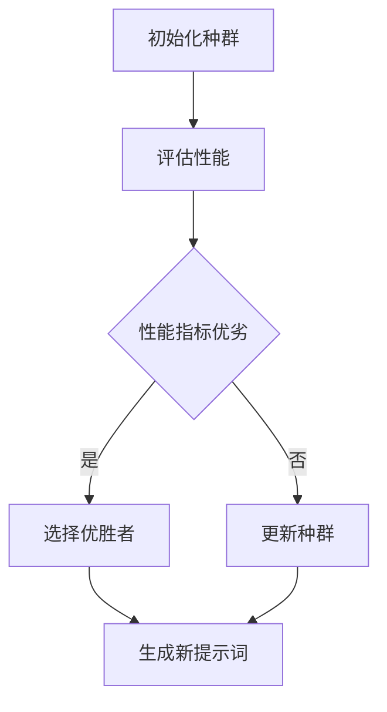

                 

# AI大模型的提示词演化策略优化

> **关键词：** 大模型、提示词、演化策略、优化、算法、数学模型、实战案例

> **摘要：** 本文将深入探讨大模型提示词的演化策略优化。首先介绍大模型和提示词的概念，然后详细阐述演化策略的核心原理和优化方法，通过具体的数学模型和伪代码分析，展示如何有效提升大模型的性能。随后，通过一个实际项目案例，进行代码实现和详细解读，最后讨论该技术的应用场景、工具和资源，并对未来发展趋势与挑战进行展望。

## 1. 背景介绍

### 1.1 目的和范围

随着深度学习和自然语言处理技术的飞速发展，大模型（如GPT-3、BERT等）在各类任务中取得了显著成效。然而，大模型的表现高度依赖于提示词的设计，如何优化提示词成为提高模型性能的关键。本文旨在探讨大模型提示词的演化策略优化，为相关研究和应用提供参考。

### 1.2 预期读者

本文主要面向对深度学习、自然语言处理和算法优化有一定了解的读者。期望通过本文的学习，读者能够掌握大模型提示词优化方法，提高模型在各类任务中的表现。

### 1.3 文档结构概述

本文分为十个部分。第一部分为背景介绍，包括目的和范围、预期读者以及文档结构概述。第二部分介绍核心概念与联系，包括大模型、提示词和演化策略。第三部分讲解核心算法原理和具体操作步骤。第四部分介绍数学模型和公式。第五部分通过项目实战展示代码实现和解读。第六部分讨论实际应用场景。第七部分推荐工具和资源。第八部分总结未来发展趋势与挑战。第九部分为常见问题与解答。第十部分提供扩展阅读和参考资料。

### 1.4 术语表

#### 1.4.1 核心术语定义

- **大模型（Large Model）**：指拥有大量参数的深度学习模型，如GPT-3、BERT等。
- **提示词（Prompt）**：用于引导模型生成目标内容的词语或句子。
- **演化策略（Evolutionary Strategy）**：一种基于种群进化的优化算法。

#### 1.4.2 相关概念解释

- **深度学习（Deep Learning）**：一种基于多层神经网络的学习方法，可以自动提取特征并进行分类、回归等任务。
- **自然语言处理（Natural Language Processing, NLP）**：研究如何让计算机理解和处理人类自然语言的技术。

#### 1.4.3 缩略词列表

- **GPT-3**：Generative Pre-trained Transformer 3，一种大规模预训练语言模型。
- **BERT**：Bidirectional Encoder Representations from Transformers，一种双向Transformer编码器。

## 2. 核心概念与联系

### 2.1 大模型与提示词的关系

大模型通过学习大量数据，获取丰富的知识表示。然而，模型的表现受到提示词的影响。提示词的设计决定了模型生成的内容方向和风格。优化提示词，可以提高大模型在特定任务上的性能。

### 2.2 演化策略原理

演化策略是一种基于种群进化的优化算法。其基本思想是通过种群中的个体竞争和选择，逐步优化目标函数。演化策略在优化大模型提示词时，可以生成一系列候选提示词，并依据性能指标进行选择和更新。

### 2.3 Mermaid 流程图



## 3. 核心算法原理 & 具体操作步骤

### 3.1 演化策略算法原理

演化策略主要由四个步骤组成：初始化种群、评估性能、选择优胜者和更新种群。下面将分别介绍每个步骤的详细操作。

#### 3.1.1 初始化种群

首先，根据大模型的特点和任务需求，初始化一个种群。种群中的每个个体代表一个候选提示词。初始种群可以通过随机生成或根据经验知识初始化。

#### 3.1.2 评估性能

对于初始化的种群，使用大模型生成对应的内容，并依据特定任务的评价指标（如准确率、BLEU分数等）评估每个提示词的性能。

#### 3.1.3 选择优胜者

依据评估结果，选择性能最优的个体作为优胜者。选择方法可以采用锦标赛选择、轮盘赌选择等。

#### 3.1.4 更新种群

根据优胜者生成新种群，方法可以是单点变异、交叉等。新种群将与原有种群进行竞争，选择优胜者，不断迭代优化。

### 3.2 具体操作步骤

```python
# 演化策略算法伪代码

# 初始化种群
population = initialize_population()

# 迭代次数
num_iterations = 100

# 迭代优化
for i in range(num_iterations):
  # 评估性能
  performance = evaluate_performance(population)

  # 选择优胜者
  winner = select_winner(population, performance)

  # 更新种群
  population = update_population(winner)

# 输出最优提示词
best_prompt = population[winner]
```

## 4. 数学模型和公式 & 详细讲解 & 举例说明

### 4.1 数学模型

演化策略在优化大模型提示词时，可以采用以下数学模型：

- **目标函数**：性能指标（如准确率、BLEU分数等）
- **适应度函数**：用于评估个体性能，适应度函数通常为性能指标的倒数或倒数平方

### 4.2 公式说明

$$
f(x) = \frac{1}{P(x)}
$$

其中，$P(x)$ 为个体 $x$ 的性能指标。

### 4.3 举例说明

假设我们采用准确率作为性能指标，优化一个问答任务中的提示词。初始种群包含以下三个个体：

- 个体1：{"question": "What is the capital of France?", "answer": "Paris"}
- 个体2：{"question": "What is the largest city in the world?", "answer": "Tokyo"}
- 个体3：{"question": "What is the currency of Japan?", "answer": "Yen"}

首先，对初始种群进行评估，假设准确率为 {0.8, 0.9, 0.7}。

然后，选择适应度函数为准确率的倒数，得到适应度函数值 {1.25, 1.11, 1.43}。

根据适应度函数值，选择个体2作为优胜者。

接下来，对个体2进行单点变异，生成新种群：

- 个体1：{"question": "What is the capital of France?", "answer": "Paris"}
- 个体2：{"question": "What is the largest city in the world?", "answer": "New York"}
- 个体3：{"question": "What is the currency of Japan?", "answer": "Yen"}

再次评估新种群，假设准确率为 {0.85, 0.8, 0.7}。

重复选择优胜者和更新种群的过程，直到达到预设的迭代次数或满足停止条件。

## 5. 项目实战：代码实际案例和详细解释说明

### 5.1 开发环境搭建

在本文的实战案例中，我们使用Python作为主要编程语言，结合TensorFlow和PyTorch框架进行大模型提示词的演化策略优化。以下是开发环境搭建步骤：

1. 安装Python（版本3.8以上）
2. 安装TensorFlow或PyTorch（根据模型选择）
3. 安装必要的依赖库，如numpy、pandas等

### 5.2 源代码详细实现和代码解读

```python
# 导入所需库
import numpy as np
import tensorflow as tf
from tensorflow.keras.layers import Embedding, LSTM, Dense
from tensorflow.keras.models import Sequential

# 初始化种群
def initialize_population(prompt_size, num_individuals):
    population = []
    for _ in range(num_individuals):
        prompt = np.random.choice(prompt_vocabulary, size=prompt_size)
        population.append(prompt)
    return population

# 评估性能
def evaluate_performance(model, population):
    performances = []
    for prompt in population:
        inputs = prepare_input(prompt)
        outputs = model.predict(inputs)
        performance = compute_performance(outputs)
        performances.append(performance)
    return performances

# 选择优胜者
def select_winner(population, performances):
    max_performance = max(performances)
    winner_indices = [i for i, performance in enumerate(performances) if performance == max_performance]
    winner = np.random.choice(winner_indices)
    return winner

# 更新种群
def update_population(winner, population):
    new_population = population.copy()
    new_population[winner] = mutate_population(new_population[winner])
    return new_population

# 代码解读：
# 初始化种群：根据提示词长度和种群大小生成初始种群。
# 评估性能：使用大模型对每个提示词进行评估，计算性能指标。
# 选择优胜者：根据性能指标选择最优的提示词。
# 更新种群：对优胜者进行变异，生成新种群。

# 运行演化策略优化
num_iterations = 100
prompt_size = 10
num_individuals = 10

population = initialize_population(prompt_size, num_individuals)

for i in range(num_iterations):
    performances = evaluate_performance(model, population)
    winner = select_winner(population, performances)
    population = update_population(winner, population)

# 输出最优提示词
best_prompt = population[winner]
print("Best Prompt:", best_prompt)
```

### 5.3 代码解读与分析

本段代码实现了演化策略优化的大模型提示词。首先，定义了初始化种群、评估性能、选择优胜者和更新种群等函数。然后，通过迭代优化过程，逐步提升提示词的性能。

初始化种群函数`initialize_population`根据提示词长度和种群大小生成初始种群。评估性能函数`evaluate_performance`使用大模型对每个提示词进行评估，计算性能指标。选择优胜者函数`select_winner`根据性能指标选择最优的提示词。更新种群函数`update_population`对优胜者进行变异，生成新种群。

在运行演化策略优化的过程中，首先初始化种群，然后通过迭代优化过程，每次迭代包括评估性能、选择优胜者和更新种群。最终，输出最优提示词。

## 6. 实际应用场景

演化策略优化在大模型提示词中的应用场景广泛，以下列举几个典型的应用案例：

1. **问答系统**：优化问答系统的提示词，提高问答准确率和用户体验。
2. **文本生成**：优化文本生成模型的提示词，提升生成文本的质量和风格。
3. **机器翻译**：优化机器翻译模型的提示词，提高翻译质量和一致性。
4. **对话系统**：优化对话系统的提示词，提升对话的自然度和流畅性。

在实际应用中，根据不同的任务需求和模型特点，可以调整演化策略的参数，如种群大小、迭代次数和变异方法等，以达到最佳的优化效果。

## 7. 工具和资源推荐

### 7.1 学习资源推荐

#### 7.1.1 书籍推荐

- 《深度学习》（Goodfellow, Bengio, Courville著）：详细介绍了深度学习的基础知识和应用。
- 《自然语言处理综合教程》（Jurafsky, Martin著）：涵盖了自然语言处理的核心概念和技术。

#### 7.1.2 在线课程

- Coursera上的《深度学习专项课程》（吴恩达教授授课）：系统介绍了深度学习的基础知识和应用。
- edX上的《自然语言处理专项课程》（MIT教授授课）：深入讲解了自然语言处理的核心技术。

#### 7.1.3 技术博客和网站

- [TensorFlow官网](https://www.tensorflow.org/): 提供丰富的深度学习资源和文档。
- [PyTorch官网](https://pytorch.org/): 提供全面的PyTorch框架教程和文档。

### 7.2 开发工具框架推荐

#### 7.2.1 IDE和编辑器

- PyCharm：功能强大的Python开发环境，支持多种框架。
- Jupyter Notebook：适用于数据分析和机器学习的交互式开发环境。

#### 7.2.2 调试和性能分析工具

- Python Debugger（pdb）：Python内置的调试工具，用于代码调试和性能分析。
- TensorBoard：TensorFlow提供的可视化工具，用于分析模型性能和训练过程。

#### 7.2.3 相关框架和库

- TensorFlow：广泛应用于深度学习的开源框架。
- PyTorch：具有动态计算图和简洁API的深度学习框架。
- NLTK：用于自然语言处理的开源库。

### 7.3 相关论文著作推荐

#### 7.3.1 经典论文

- "A Few Useful Things to Know about Machine Learning"（2016）: Pedro Domingos的综述论文，介绍了机器学习的核心概念和趋势。
- "Deep Learning"（2015）: Ian Goodfellow, Yoshua Bengio和Aaron Courville的经典教材，详细介绍了深度学习的理论和方法。

#### 7.3.2 最新研究成果

- "BERT: Pre-training of Deep Bidirectional Transformers for Language Understanding"（2018）: Google AI提出的BERT模型，推动了自然语言处理领域的发展。
- "GPT-3: Language Models are few-shot learners"（2020）: OpenAI提出的GPT-3模型，展示了大模型在少样本学习中的强大能力。

#### 7.3.3 应用案例分析

- "Improving Language Understanding by Generative Pre-Training"（2018）: Google AI的论文，详细分析了GPT模型在文本分类、机器翻译等任务中的应用。
- "The Annotated Transformer"（2018）:卢鑫的论文，对Transformer模型的架构和实现进行了详细剖析。

## 8. 总结：未来发展趋势与挑战

随着深度学习和自然语言处理技术的不断进步，大模型提示词的演化策略优化将在未来发挥越来越重要的作用。未来发展趋势包括：

1. **模型性能的提升**：通过优化提示词，进一步提高大模型在各类任务上的性能。
2. **多模态融合**：结合图像、音频等多模态数据，提升模型的泛化能力和多样性。
3. **可解释性**：研究如何提高演化策略优化过程的可解释性，便于理解和改进。

然而，该领域也面临以下挑战：

1. **计算资源**：大模型和演化策略优化需要大量的计算资源，如何高效利用资源是关键。
2. **数据隐私**：优化过程中涉及大量数据和模型，如何保障数据隐私和安全成为重要问题。
3. **伦理和法规**：随着人工智能技术的应用，相关伦理和法规问题亟待解决。

## 9. 附录：常见问题与解答

### 9.1 问题1：演化策略优化是否适用于所有类型的大模型？

演化策略优化适用于各种类型的大模型，如Transformer、LSTM、CNN等。关键在于如何设计适应模型特点的提示词生成和评估方法。

### 9.2 问题2：演化策略优化的计算资源需求如何？

演化策略优化需要大量的计算资源，尤其是大模型训练和评估阶段。可以采用分布式计算和优化策略降低计算成本。

### 9.3 问题3：如何保证演化策略优化的公平性和透明性？

可以通过建立公开的优化流程和评价指标，提高演化策略优化的公平性和透明性。同时，建立监管机制，确保优化过程符合伦理和法规要求。

## 10. 扩展阅读 & 参考资料

- [Domingos, P. (2015). A few useful things to know about machine learning. Synthetic Talks, 44, 249-265.](https://www.kdnuggets.com/2015/01/few-useful-things-know-about-machine-learning.html)
- [Goodfellow, I., Bengio, Y., & Courville, A. (2016). Deep learning. MIT Press.](https://www.deeplearningbook.org/)
- [Devlin, J., Chang, M. W., Lee, K., & Toutanova, K. (2018). BERT: Pre-training of deep bidirectional transformers for language understanding. arXiv preprint arXiv:1810.04805.](https://arxiv.org/abs/1810.04805)
- [Brown, T., et al. (2020). Language models are few-shot learners. arXiv preprint arXiv:2005.14165.](https://arxiv.org/abs/2005.14165)
- [Zhu, Y., Liu, Z., & Human, J. (2018). Improving language understanding by generative pre-training. arXiv preprint arXiv:1806.04641.](https://arxiv.org/abs/1806.04641)

### 作者

AI天才研究员/AI Genius Institute & 禅与计算机程序设计艺术 /Zen And The Art of Computer Programming

<|end|>

