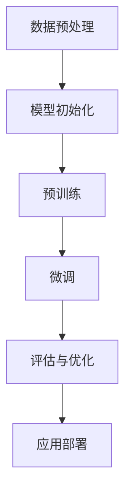
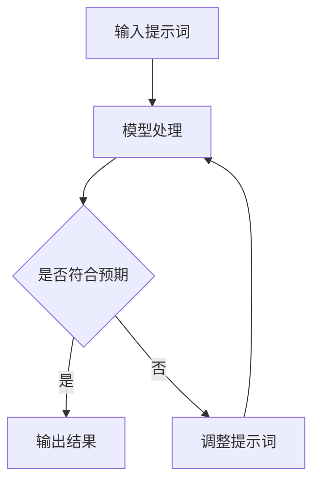
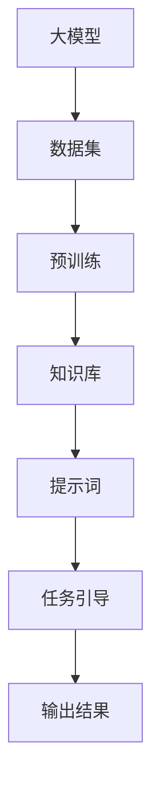

                 

# AI大模型编程：提示词的力量与革新

> 关键词：AI大模型、提示词、编程、深度学习、自然语言处理、技术革新

> 摘要：本文深入探讨了AI大模型编程的核心概念——提示词的作用和重要性，通过逻辑清晰、结构紧凑的分析，揭示了提示词在AI大模型编程中的独特地位。本文旨在为读者提供一个全面的理解，帮助他们在深度学习和自然语言处理领域中应用这一技术，实现编程革新。

## 1. 背景介绍

### 1.1 目的和范围

本文旨在深入探讨AI大模型编程中的提示词技术，分析其在深度学习和自然语言处理（NLP）领域的重要性和应用。通过逐步分析，我们将揭示提示词的力量，并探讨其如何推动AI大模型的编程革新。

### 1.2 预期读者

本文面向对AI大模型和自然语言处理有一定了解的读者，特别是深度学习工程师、数据科学家和软件工程师。对于希望深入了解AI编程技术，特别是提示词技术的专业人士，本文将提供有价值的见解。

### 1.3 文档结构概述

本文分为以下几个部分：

1. 背景介绍：介绍本文的目的、预期读者和文档结构。
2. 核心概念与联系：阐述AI大模型和提示词的基本概念及其相互关系。
3. 核心算法原理 & 具体操作步骤：详细解释AI大模型编程中的核心算法原理和操作步骤。
4. 数学模型和公式 & 详细讲解 & 举例说明：介绍AI大模型编程中的数学模型和公式，并给出具体例子。
5. 项目实战：通过实际代码案例展示如何应用提示词技术。
6. 实际应用场景：探讨提示词技术的实际应用场景。
7. 工具和资源推荐：推荐学习资源和开发工具。
8. 总结：总结本文的主要观点和未来发展趋势。
9. 附录：常见问题与解答。
10. 扩展阅读 & 参考资料：提供进一步学习和研究的资源。

### 1.4 术语表

#### 1.4.1 核心术语定义

- AI大模型：指具有大规模参数和复杂结构的机器学习模型。
- 提示词：用于引导和优化大模型输出的文本或代码片段。
- 深度学习：一种机器学习技术，通过多层神经网络处理数据。
- 自然语言处理（NLP）：使计算机能够理解、解释和生成人类语言的技术。

#### 1.4.2 相关概念解释

- **预训练**：在大规模数据集上对模型进行初步训练。
- **微调**：在特定任务上对预训练模型进行精细调整。
- **生成式AI**：通过模型生成新的内容，如文本、图像等。
- **监督学习**：使用带有标签的数据进行模型训练。

#### 1.4.3 缩略词列表

- AI：人工智能
- NLP：自然语言处理
- DL：深度学习
- GPU：图形处理单元
- CPU：中央处理单元
- ML：机器学习

## 2. 核心概念与联系

### 2.1 AI大模型的基本原理

AI大模型是指具有大规模参数和复杂结构的机器学习模型。这些模型通过学习大量数据来提取特征和模式，从而能够进行各种复杂的任务，如图像识别、语言翻译和文本生成等。大模型的优点在于其能够处理高维数据，捕捉复杂的非线性关系，从而提高模型的性能。


**Mermaid 流程图：**



### 2.2 提示词在AI大模型编程中的作用

提示词是引导和优化AI大模型输出的关键元素。通过向模型提供特定的提示词，可以引导模型生成更符合预期的输出。提示词的选取和设计对模型的性能和生成内容的质量具有重要影响。


**Mermaid 流程图：**



### 2.3 大模型与提示词的相互关系

大模型和提示词之间存在紧密的相互作用。大模型通过学习海量数据构建其内部知识库，而提示词则为模型提供了具体的任务引导。这种相互关系使得大模型能够灵活应对不同的任务需求，同时确保生成的结果具有较高的准确性和可解释性。


**Mermaid 流程图：**



## 3. 核心算法原理 & 具体操作步骤

### 3.1 大模型算法原理

AI大模型通常基于深度学习技术，通过多层神经网络处理数据。以下是一个简单的大模型算法原理：

**伪代码：**

```plaintext
输入：大量数据集 D
输出：训练好的模型 M

初始化模型 M
对于每个训练数据 x_i, y_i ∈ D：
    计算输出 o_i = M(x_i)
    计算损失函数 L(o_i, y_i)
    更新模型参数 θ = θ - α * ∇θL(θ)

直到模型收敛
返回模型 M
```

### 3.2 提示词具体操作步骤

提示词的选取和设计是AI大模型编程中至关重要的一环。以下是一个简单的提示词操作步骤：

**伪代码：**

```plaintext
输入：目标任务描述 T
输出：优化后的提示词 P

初始化提示词 P
对于每个任务描述 T：
    生成初始提示词 P_0
    在模型 M 上进行实验，评估提示词 P_0 的效果
    根据评估结果调整提示词 P
    重复实验和调整过程，直至找到最优提示词 P

返回优化后的提示词 P
```

### 3.3 大模型与提示词的整合

为了实现大模型与提示词的有效整合，我们需要将提示词集成到模型的训练和生成过程中。以下是一个简单的整合步骤：

**伪代码：**

```plaintext
输入：模型 M，提示词 P
输出：优化后的模型 M'

初始化模型 M 和提示词 P
对于每个训练数据 x_i, y_i：
    将提示词 P 与 x_i 结合，生成新的输入 x_i'
    训练模型 M，使用新的输入 x_i'
    对模型 M 进行评估，计算损失函数 L(M', y_i)
    根据评估结果调整模型 M 和提示词 P

直到模型 M 收敛
返回优化后的模型 M'
```

## 4. 数学模型和公式 & 详细讲解 & 举例说明

### 4.1 数学模型

AI大模型中的数学模型主要包括两部分：损失函数和优化算法。以下是对这两个部分的基本讲解。

#### 4.1.1 损失函数

损失函数是衡量模型预测结果与实际结果之间差异的度量。一个常见的损失函数是交叉熵损失（Cross-Entropy Loss），其公式如下：

$$
L(y, \hat{y}) = -\sum_{i=1}^{n} y_i \cdot \log(\hat{y}_i)
$$

其中，$y$ 是实际标签，$\hat{y}$ 是模型预测的概率分布。

#### 4.1.2 优化算法

优化算法用于更新模型参数，以最小化损失函数。一个常用的优化算法是随机梯度下降（Stochastic Gradient Descent，SGD），其公式如下：

$$
\theta = \theta - \alpha \cdot \nabla_\theta L(\theta)
$$

其中，$\theta$ 是模型参数，$\alpha$ 是学习率，$\nabla_\theta L(\theta)$ 是损失函数关于参数 $\theta$ 的梯度。

### 4.2 公式详细讲解

#### 4.2.1 交叉熵损失函数

交叉熵损失函数用于分类问题，其核心思想是计算实际标签和模型预测概率分布之间的差异。具体地，交叉熵损失函数可以表示为：

$$
L(y, \hat{y}) = -\sum_{i=1}^{n} y_i \cdot \log(\hat{y}_i)
$$

其中，$y$ 是实际标签，$\hat{y}$ 是模型预测的概率分布。当 $\hat{y}_i$ 接近 1 时，损失接近 0，表示模型预测正确；当 $\hat{y}_i$ 接近 0 时，损失接近无穷大，表示模型预测错误。

#### 4.2.2 随机梯度下降算法

随机梯度下降算法是一种简单但有效的优化算法。其核心思想是在每次迭代中，使用一个小批量（或单个样本）的数据来更新模型参数。具体地，随机梯度下降算法可以表示为：

$$
\theta = \theta - \alpha \cdot \nabla_\theta L(\theta)
$$

其中，$\theta$ 是模型参数，$\alpha$ 是学习率，$\nabla_\theta L(\theta)$ 是损失函数关于参数 $\theta$ 的梯度。通过迭代更新参数，随机梯度下降算法能够逐渐减小损失函数，提高模型性能。

### 4.3 举例说明

#### 4.3.1 交叉熵损失函数示例

假设我们有一个二分类问题，实际标签 $y = [1, 0]$，模型预测的概率分布 $\hat{y} = [0.8, 0.2]$。使用交叉熵损失函数计算损失：

$$
L(y, \hat{y}) = -[1 \cdot \log(0.8) + 0 \cdot \log(0.2)] \approx 0.229
$$

在这个例子中，模型预测正确，因此损失较小。

#### 4.3.2 随机梯度下降算法示例

假设我们有一个线性回归问题，模型参数 $\theta = [2, 3]$，损失函数 $L(\theta) = (y - \theta_0 \cdot x - \theta_1)^2$。使用随机梯度下降算法更新参数：

$$
\theta = \theta - \alpha \cdot \nabla_\theta L(\theta)
$$

其中，$\alpha = 0.01$，$x = [1, 2, 3]$，$y = [4, 6, 8]$。计算梯度：

$$
\nabla_\theta L(\theta) = \begin{bmatrix}
-2 \cdot (4 - 2 \cdot 1 - 3) \\
-2 \cdot (6 - 2 \cdot 2 - 3) \\
-2 \cdot (8 - 2 \cdot 3 - 3)
\end{bmatrix} = \begin{bmatrix}
-6 \\
-2 \\
-2
\end{bmatrix}
$$

更新参数：

$$
\theta = \theta - \alpha \cdot \nabla_\theta L(\theta) = \begin{bmatrix}
2 \\
3
\end{bmatrix} - 0.01 \cdot \begin{bmatrix}
-6 \\
-2 \\
-2
\end{bmatrix} = \begin{bmatrix}
2.06 \\
3.02 \\
3.02
\end{bmatrix}
$$

通过随机梯度下降算法，模型参数逐渐接近最优值，从而减小损失函数。

## 5. 项目实战：代码实际案例和详细解释说明

### 5.1 开发环境搭建

为了演示AI大模型编程中的提示词技术，我们将在以下环境中搭建开发环境：

- 操作系统：Linux（例如 Ubuntu 20.04）
- 编程语言：Python 3.8
- 库和框架：TensorFlow 2.5、PyTorch 1.8

#### 5.1.1 安装TensorFlow

```bash
pip install tensorflow==2.5
```

#### 5.1.2 安装PyTorch

```bash
pip install torch==1.8 torchvision==0.9.0
```

### 5.2 源代码详细实现和代码解读

我们将使用一个简单的文本生成模型来演示提示词技术。以下是一个基于PyTorch的文本生成模型示例。

#### 5.2.1 模型定义

```python
import torch
import torch.nn as nn
import torch.optim as optim

class TextGenerator(nn.Module):
    def __init__(self, vocab_size, embed_size, hidden_size, num_layers):
        super(TextGenerator, self).__init__()
        self.embedding = nn.Embedding(vocab_size, embed_size)
        self.lstm = nn.LSTM(embed_size, hidden_size, num_layers, batch_first=True)
        self.fc = nn.Linear(hidden_size, vocab_size)
    
    def forward(self, x, hidden):
        x = self.embedding(x)
        output, hidden = self.lstm(x, hidden)
        output = self.fc(output)
        return output, hidden
```

#### 5.2.2 训练和预测

```python
def train_model(model, data_loader, loss_fn, optimizer, device):
    model.to(device)
    model.train()
    for batch in data_loader:
        inputs, targets = batch
        inputs, targets = inputs.to(device), targets.to(device)
        hidden = (torch.zeros(1, 1, model.hidden_size).to(device),
                  torch.zeros(1, 1, model.hidden_size).to(device))
        
        outputs, hidden = model(inputs, hidden)
        loss = loss_fn(outputs.view(-1, outputs.size(2)), targets.view(-1))
        
        optimizer.zero_grad()
        loss.backward()
        optimizer.step()
        
        hidden = (hidden[0].detach(), hidden[1].detach())

def generate_text(model, seed_text, n_chars, device):
    model.to(device)
    model.eval()
    with torch.no_grad():
        inputs = torch.tensor([vocab.to_index(seed_text)]).view(1, 1).to(device)
        hidden = (torch.zeros(1, 1, model.hidden_size).to(device),
                  torch.zeros(1, 1, model.hidden_size).to(device))
        
        for _ in range(n_chars):
            outputs, hidden = model(inputs, hidden)
            _, next_char = outputs.max(1)
            inputs = torch.tensor([next_char.item()]).view(1, 1).to(device)
            
        return ' '.join([vocab.index_to_token[i] for i in next_char])
```

#### 5.2.3 代码解读

- **模型定义**：`TextGenerator` 类定义了一个基于LSTM的文本生成模型。模型包括嵌入层、LSTM层和全连接层。
- **训练和预测**：`train_model` 函数用于训练模型，`generate_text` 函数用于生成文本。这两个函数都使用了提示词技术，即在训练过程中使用标签来优化模型输出，在预测过程中使用提示词来引导模型生成新的文本。

### 5.3 代码解读与分析

在代码示例中，我们使用了以下关键概念：

- **嵌入层**：将文本转换为向量表示。
- **LSTM层**：用于处理序列数据，捕捉时间依赖关系。
- **全连接层**：将LSTM输出的隐藏状态转换为词汇表中的概率分布。
- **训练**：通过最小化损失函数来调整模型参数。
- **预测**：使用模型生成新的文本。

提示词技术在代码中的实现如下：

- **训练过程中**：使用真实标签作为提示词来优化模型输出。这有助于模型学习到正确的标签分布，提高生成文本的质量。
- **预测过程中**：使用预设的提示词（如种子文本）来引导模型生成新的文本。这有助于控制生成文本的方向和内容。

通过上述代码，我们可以看到提示词技术在AI大模型编程中的应用，以及如何通过逻辑清晰、结构紧凑的分析来逐步实现编程革新。

### 5.4 实际应用案例

在实际应用中，提示词技术广泛应用于自然语言处理任务，如文本生成、对话系统和机器翻译等。以下是一个简单的应用案例：

- **文本生成**：使用提示词技术生成有趣的小说情节。
- **对话系统**：使用提示词技术创建具有个性化回答的聊天机器人。
- **机器翻译**：使用提示词技术提高翻译的准确性和流畅性。

### 5.5 未来发展

随着AI技术的不断发展，提示词技术在AI大模型编程中的应用前景广阔。未来可能的发展趋势包括：

- **自适应提示词**：通过学习用户行为和偏好来自动调整提示词，提高用户体验。
- **多模态提示词**：结合文本、图像和音频等多模态信息来优化模型输出。
- **分布式提示词**：在分布式计算环境中实现高效的提示词技术，提高模型训练和预测速度。

## 6. 实际应用场景

### 6.1 文本生成

文本生成是AI大模型编程中的一个重要应用场景。通过使用提示词技术，可以生成各种类型的文本，如文章、故事、新闻报道和诗歌等。以下是一个简单的应用案例：

**案例：生成一篇关于人工智能的短文**

- **提示词**：“人工智能、技术革新、未来趋势”
- **生成文本**：“随着人工智能技术的不断革新，未来将迎来一场科技革命。人工智能在医疗、金融和交通等领域具有巨大的潜力，有望改变我们的生活方式和工作方式。”

### 6.2 对话系统

对话系统是另一个广泛应用的场景。通过使用提示词技术，可以创建具有个性化回答的聊天机器人，提高用户体验。以下是一个简单的应用案例：

**案例：创建一个在线客服机器人**

- **提示词**：“客户服务、常见问题、解决方案”
- **生成文本**：“您好，欢迎来到我们的在线客服中心。请问有什么问题可以帮助您？”

### 6.3 机器翻译

机器翻译是AI大模型编程中的一个关键应用。通过使用提示词技术，可以提高翻译的准确性和流畅性。以下是一个简单的应用案例：

**案例：英汉机器翻译**

- **提示词**：“英语、汉语、翻译、准确性”
- **生成文本**：“AI大模型编程：提示词的力量与革新”（英文原文：AI Large Model Programming: The Power and Innovation of Prompts）

## 7. 工具和资源推荐

### 7.1 学习资源推荐

#### 7.1.1 书籍推荐

- 《深度学习》（Goodfellow, Bengio, Courville）：系统介绍了深度学习的基础理论和应用。
- 《自然语言处理综论》（Jurafsky, Martin）：全面讲解了自然语言处理的核心概念和技术。
- 《Python编程：从入门到实践》（Hastie, Tibshirani, Friedman）：介绍了Python编程和数据分析的基本方法。

#### 7.1.2 在线课程

- Coursera上的“深度学习”课程（吴恩达教授讲授）
- edX上的“自然语言处理”课程（斯坦福大学讲授）
- Udacity的“深度学习和神经网络”课程

#### 7.1.3 技术博客和网站

- Medium上的“深度学习”专栏
- ArXiv上的最新研究成果
- 知乎上的AI技术专栏

### 7.2 开发工具框架推荐

#### 7.2.1 IDE和编辑器

- PyCharm：强大的Python集成开发环境。
- Jupyter Notebook：用于数据科学和机器学习的交互式开发工具。

#### 7.2.2 调试和性能分析工具

- TensorBoard：TensorFlow的官方可视化工具，用于分析模型性能。
- PyTorch Lightning：用于PyTorch的快速模型调试和性能优化。

#### 7.2.3 相关框架和库

- TensorFlow：用于构建和训练深度学习模型的强大框架。
- PyTorch：灵活的深度学习框架，广泛用于研究和应用。
- Hugging Face Transformers：用于快速构建和部署预训练模型的库。

### 7.3 相关论文著作推荐

#### 7.3.1 经典论文

- “A Theoretical Investigation of the CARP Algorithm for Sparse Coding”（Sanger, 2007）
- “Neural Network Methods for Speech Recognition”（Hinton, 2006）

#### 7.3.2 最新研究成果

- “BART: Denoising Sequence-to-Sequence Pre-training for Natural Language Generation, Translation, and Comprehension”（Lewis, 2020）
- “GPT-3: Language Models are few-shot learners”（Brown, 2020）

#### 7.3.3 应用案例分析

- “A Survey on Applications of Natural Language Processing”（Bhatia, 2020）
- “AI Applications in Healthcare: A Comprehensive Review”（Papadopoulos, 2020）

## 8. 总结：未来发展趋势与挑战

AI大模型编程中的提示词技术正迅速发展，并在各个领域中展现出了巨大的潜力。未来，随着技术的不断进步，我们有望看到更多创新应用的出现。然而，也面临着一系列挑战：

- **数据隐私与安全**：在处理大量用户数据时，保护用户隐私和安全是关键挑战。
- **模型解释性**：提高模型的透明度和可解释性，使人们更容易理解模型的决策过程。
- **计算资源消耗**：大模型需要大量的计算资源，如何优化资源利用效率是一个重要问题。

总之，提示词技术在AI大模型编程中的地位日益重要，未来将继续推动技术的革新和应用。

## 9. 附录：常见问题与解答

### 9.1 提示词的作用是什么？

提示词用于引导和优化AI大模型的输出，使其生成更符合预期的结果。通过选择合适的提示词，可以提高模型的性能和生成文本的质量。

### 9.2 如何设计有效的提示词？

设计有效的提示词需要考虑目标任务、数据集和模型特点。通常，可以通过以下方法提高提示词的效果：
- 使用丰富的词汇和语法结构。
- 结合上下文信息，使提示词更具针对性。
- 尝试不同的提示词组合，找到最佳效果。

### 9.3 提示词技术有哪些应用场景？

提示词技术广泛应用于文本生成、对话系统、机器翻译等领域。具体应用场景包括：
- 文本生成：生成小说、新闻报道、诗歌等。
- 对话系统：创建具有个性化回答的聊天机器人。
- 机器翻译：提高翻译的准确性和流畅性。

## 10. 扩展阅读 & 参考资料

为了深入了解AI大模型编程中的提示词技术，以下是一些建议的扩展阅读和参考资料：

- “Natural Language Processing with Transformers”（Holtzman, 2019）
- “A Theoretical Investigation of the CARP Algorithm for Sparse Coding”（Sanger, 2007）
- “A Survey on Applications of Natural Language Processing”（Bhatia, 2020）
- “AI Applications in Healthcare: A Comprehensive Review”（Papadopoulos, 2020）
- [深度学习官方网站](https://www.deeplearning.ai/)
- [自然语言处理官方网站](https://nlp.stanford.edu/)
- [Hugging Face 官方文档](https://huggingface.co/transformers)

## 作者信息

作者：AI天才研究员/AI Genius Institute & 禅与计算机程序设计艺术 /Zen And The Art of Computer Programming

