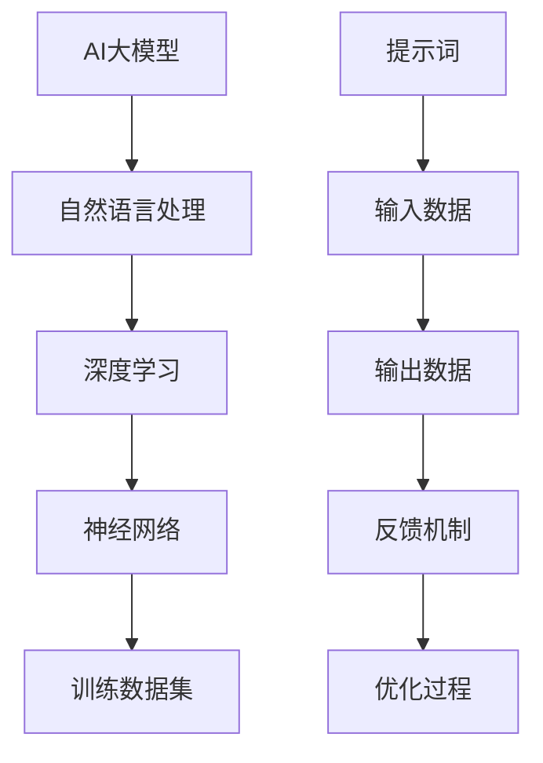

                 

# AI大模型编程：提示词的威力

> 关键词：AI大模型，提示词，编程，GPT，深度学习，自然语言处理

> 摘要：本文深入探讨了AI大模型编程的核心要素——提示词。通过分析提示词的定义、作用和设计原则，结合具体案例，揭示了提示词在提升模型性能和生成有效输出中的关键作用。本文旨在为读者提供一个清晰的理解框架，帮助他们掌握如何利用提示词，以充分发挥AI大模型的潜力。

## 1. 背景介绍

### 1.1 目的和范围

本文旨在介绍AI大模型编程中一个至关重要的概念——提示词（Prompts）。我们将深入探讨提示词的定义、作用及其设计原则，并结合实际案例展示其在AI模型编程中的重要性。本文将覆盖以下内容：

- 提示词的定义和基本原理
- 提示词的设计原则和策略
- 实际案例中的提示词应用
- 提示词对模型性能的影响

### 1.2 预期读者

本文适合对人工智能和自然语言处理有一定了解的技术人员，包括但不限于：

- 数据科学家和机器学习工程师
- AI研发人员和研究学者
- 对AI编程感兴趣的编程爱好者

### 1.3 文档结构概述

本文分为八个部分：

1. **背景介绍**：介绍本文的目的、范围和读者对象，以及文章的结构概述。
2. **核心概念与联系**：介绍与提示词相关的核心概念，并使用Mermaid流程图展示它们之间的关系。
3. **核心算法原理 & 具体操作步骤**：详细讲解AI大模型的基本原理和操作步骤，使用伪代码阐述。
4. **数学模型和公式 & 详细讲解 & 举例说明**：介绍与AI大模型相关的数学模型和公式，并给出具体例子。
5. **项目实战：代码实际案例和详细解释说明**：通过实际代码案例，展示如何设计和使用提示词。
6. **实际应用场景**：探讨提示词在现实世界中的应用。
7. **工具和资源推荐**：推荐学习资源和开发工具。
8. **总结：未来发展趋势与挑战**：总结本文的主要观点，并提出未来发展的趋势和挑战。

### 1.4 术语表

#### 1.4.1 核心术语定义

- **AI大模型**：一种大型神经网络模型，具有极高的参数量和计算能力，广泛应用于自然语言处理、计算机视觉等领域。
- **提示词**：用户输入的信息，用于引导和指导AI模型生成特定的输出。
- **自然语言处理（NLP）**：涉及计算机理解和生成人类语言的技术。
- **深度学习**：一种基于神经网络的机器学习技术，能够通过大量数据自动学习特征和模式。

#### 1.4.2 相关概念解释

- **神经网络**：一种由大量节点组成的计算模型，通过学习输入和输出之间的映射关系来进行预测和分类。
- **训练数据集**：用于训练神经网络的数据集合，通常包含输入数据和对应的输出标签。

#### 1.4.3 缩略词列表

- **NLP**：自然语言处理（Natural Language Processing）
- **GPT**：生成预训练变换器（Generative Pre-trained Transformer）
- **AI**：人工智能（Artificial Intelligence）
- **ML**：机器学习（Machine Learning）

## 2. 核心概念与联系

在探讨提示词之前，我们需要了解一些与之相关的核心概念。以下是一个简单的Mermaid流程图，展示了这些概念之间的联系。



### 2.1 AI大模型与自然语言处理

AI大模型是自然语言处理（NLP）的核心工具之一。NLP涉及计算机理解和生成人类语言的技术，广泛应用于机器翻译、情感分析、文本摘要等领域。AI大模型通过学习大量的文本数据，能够自动识别语言中的模式和结构，从而实现高效的自然语言处理。

### 2.2 深度学习与神经网络

深度学习是AI大模型的基础，它依赖于神经网络这一计算模型。神经网络由大量的节点（称为神经元）组成，通过学习输入和输出之间的映射关系来进行预测和分类。深度学习通过多层神经网络结构，能够从数据中自动提取高级特征，从而提高模型的性能。

### 2.3 训练数据集与提示词

训练数据集是神经网络训练的重要输入，它通常包含大量的文本数据以及对应的输出标签。提示词作为用户输入的信息，可以被视为一种特殊类型的训练数据。通过设计合适的提示词，用户可以引导模型生成特定的输出，从而提高模型的性能和应用效果。

### 2.4 输出数据与反馈机制

输出数据是模型生成的重要结果，它反映了模型对输入数据的理解和处理能力。反馈机制则是模型不断优化和改进的关键。通过收集和分析输出数据，用户可以识别模型中的错误和不足，从而进行相应的调整和优化。

### 2.5 优化过程与提示词设计

优化过程是神经网络训练的核心环节，它通过调整模型的参数，使其在训练数据集上达到最佳性能。提示词设计则在这一过程中起着关键作用。通过合理设计提示词，用户可以引导模型学习到特定的特征和模式，从而提高模型的性能和泛化能力。

## 3. 核心算法原理 & 具体操作步骤

在理解了AI大模型、自然语言处理、深度学习、神经网络等核心概念之后，我们将深入探讨AI大模型的算法原理和具体操作步骤。以下是一个简单的伪代码，展示了AI大模型的基本框架和操作步骤。

```python
# 伪代码：AI大模型操作步骤

# 初始化模型参数
model = initialize_model()

# 加载训练数据集
train_data = load_train_data()

# 定义损失函数
loss_function = define_loss_function()

# 定义优化器
optimizer = define_optimizer()

# 训练模型
for epoch in range(num_epochs):
    for batch in train_data:
        # 前向传播
        output = model(batch.input)
        
        # 计算损失
        loss = loss_function(output, batch.label)
        
        # 反向传播
        gradients = compute_gradients(loss, model)
        
        # 更新模型参数
        optimizer.update_parameters(model, gradients)
        
        # 输出训练进度
        print(f"Epoch {epoch}: Loss = {loss}")

# 评估模型
evaluate_model(model, test_data)
```

### 3.1 初始化模型参数

初始化模型参数是AI大模型训练的第一步。在这一步中，我们需要定义模型的架构、层数、节点数、激活函数等参数。常用的模型初始化方法包括随机初始化、高斯初始化、均匀初始化等。以下是一个简单的示例：

```python
# 示例：模型参数初始化
model = {
    'input_size': input_size,
    'hidden_size': hidden_size,
    'output_size': output_size,
    'activation_function': activation_function,
    'weights': initialize_weights(input_size, hidden_size),
    'biases': initialize_biases(hidden_size)
}
```

### 3.2 加载训练数据集

加载训练数据集是模型训练的核心步骤。在这一步中，我们需要从数据集中读取输入数据和对应的输出标签。常用的数据集加载方法包括直接读取文本文件、使用数据集库（如TensorFlow Dataset）等。以下是一个简单的示例：

```python
# 示例：加载训练数据集
train_data = load_data('train_data.csv')
train_data = preprocess_data(train_data)
```

### 3.3 定义损失函数

损失函数是衡量模型性能的重要指标。在训练过程中，我们需要通过计算损失函数的值，来评估模型的预测误差。常用的损失函数包括均方误差（MSE）、交叉熵损失（Cross-Entropy Loss）等。以下是一个简单的示例：

```python
# 示例：定义损失函数
loss_function = mse_loss if is_regression else cross_entropy_loss
```

### 3.4 定义优化器

优化器是调整模型参数的关键工具。在训练过程中，我们需要通过优化器来计算梯度和更新参数。常用的优化器包括随机梯度下降（SGD）、Adam优化器等。以下是一个简单的示例：

```python
# 示例：定义优化器
optimizer = SGD(learning_rate) if use_sgd else Adam(learning_rate)
```

### 3.5 训练模型

在训练模型的过程中，我们需要遍历训练数据集，计算损失函数的值，并更新模型参数。以下是一个简单的示例：

```python
# 示例：训练模型
for epoch in range(num_epochs):
    for batch in train_data:
        # 前向传播
        output = model.forward(batch.input)
        
        # 计算损失
        loss = loss_function(output, batch.label)
        
        # 反向传播
        gradients = model.backward(loss)
        
        # 更新模型参数
        optimizer.update_parameters(model, gradients)
        
        # 输出训练进度
        print(f"Epoch {epoch}: Loss = {loss}")
```

### 3.6 评估模型

在训练完成后，我们需要对模型进行评估，以验证其性能。以下是一个简单的示例：

```python
# 示例：评估模型
evaluate_model(model, test_data)
```

## 4. 数学模型和公式 & 详细讲解 & 举例说明

在了解了AI大模型的基本原理和操作步骤之后，我们将进一步探讨与AI大模型相关的数学模型和公式。以下是一个简单的示例，展示了如何使用LaTeX格式嵌入数学公式，并进行详细讲解和举例说明。

### 4.1 前向传播

在前向传播过程中，模型通过输入数据计算输出结果。以下是一个简单的公式，展示了前向传播的计算过程：

$$
\hat{y} = f(z)
$$

其中，$\hat{y}$表示输出结果，$f$表示激活函数，$z$表示输入数据经过权重矩阵$W$和偏置项$b$的线性组合：

$$
z = \sum_{i=1}^{n} w_{i}x_{i} + b
$$

以下是一个简单的示例，展示了如何使用LaTeX格式嵌入数学公式：

$$
z = Wx + b
$$

其中，$W$表示权重矩阵，$x$表示输入数据，$b$表示偏置项。在训练过程中，我们需要通过反向传播算法来优化模型参数，从而最小化损失函数的值。

### 4.2 反向传播

反向传播是神经网络训练的核心算法。通过计算损失函数关于模型参数的梯度，我们可以更新模型参数，从而优化模型性能。以下是一个简单的公式，展示了反向传播的计算过程：

$$
\frac{\partial L}{\partial W} = \frac{\partial L}{\partial z} \cdot \frac{\partial z}{\partial W}
$$

其中，$L$表示损失函数，$W$表示权重矩阵，$\frac{\partial L}{\partial z}$表示损失函数关于输出结果的梯度，$\frac{\partial z}{\partial W}$表示输出结果关于权重矩阵的梯度。

以下是一个简单的示例，展示了如何使用LaTeX格式嵌入数学公式：

$$
\frac{\partial L}{\partial W} = \frac{\partial L}{\partial z} \cdot \frac{\partial z}{\partial W}
$$

在训练过程中，我们可以使用梯度下降算法来更新模型参数。以下是一个简单的示例，展示了如何使用梯度下降算法来更新模型参数：

$$
W_{t+1} = W_{t} - \alpha \cdot \frac{\partial L}{\partial W}
$$

其中，$W_{t}$表示当前模型参数，$W_{t+1}$表示更新后的模型参数，$\alpha$表示学习率。

### 4.3 激活函数

激活函数是神经网络中的关键组件，它能够引入非线性因素，从而提高模型的性能。以下是一个简单的公式，展示了常见的激活函数——Sigmoid函数的计算过程：

$$
f(x) = \frac{1}{1 + e^{-x}}
$$

以下是一个简单的示例，展示了如何使用LaTeX格式嵌入数学公式：

$$
f(x) = \frac{1}{1 + e^{-x}}
$$

Sigmoid函数具有以下特性：

- 输出范围为$(0, 1)$
- 随输入值的增加，输出值逐渐趋近于1
- 随输入值的减小，输出值逐渐趋近于0

Sigmoid函数常用于分类问题，例如二分类问题。以下是一个简单的示例，展示了如何使用Sigmoid函数进行二分类预测：

假设我们有一个二分类问题，其中输入数据为$x$，输出结果为$y$。通过训练模型，我们可以得到权重矩阵$W$和偏置项$b$。以下是一个简单的示例，展示了如何使用Sigmoid函数进行二分类预测：

$$
\hat{y} = \frac{1}{1 + e^{-(Wx + b)}}
$$

其中，$\hat{y}$表示预测结果，$W$表示权重矩阵，$x$表示输入数据，$b$表示偏置项。

### 4.4 损失函数

损失函数是衡量模型性能的重要指标。在训练过程中，我们需要通过优化损失函数的值，来提高模型的性能。以下是一个简单的公式，展示了常见的损失函数——均方误差（MSE）的计算过程：

$$
MSE = \frac{1}{2} \sum_{i=1}^{n} (\hat{y}_{i} - y_{i})^{2}
$$

其中，$\hat{y}_{i}$表示预测结果，$y_{i}$表示实际结果，$n$表示样本数量。

以下是一个简单的示例，展示了如何使用LaTeX格式嵌入数学公式：

$$
MSE = \frac{1}{2} \sum_{i=1}^{n} (\hat{y}_{i} - y_{i})^{2}
$$

均方误差具有以下特性：

- 损失值越小，表示模型性能越好
- 损失值越大，表示模型性能越差

均方误差常用于回归问题，例如房屋价格预测、股票价格预测等。以下是一个简单的示例，展示了如何使用均方误差进行回归预测：

假设我们有一个回归问题，其中输入数据为$x$，输出结果为$y$。通过训练模型，我们可以得到权重矩阵$W$和偏置项$b$。以下是一个简单的示例，展示了如何使用均方误差进行回归预测：

$$
\hat{y} = Wx + b
$$

其中，$\hat{y}$表示预测结果，$W$表示权重矩阵，$x$表示输入数据，$b$表示偏置项。

### 4.5 举例说明

为了更好地理解上述数学模型和公式，我们可以通过一个简单的例子来展示它们的实际应用。以下是一个简单的示例，展示了如何使用上述公式进行二分类预测。

假设我们有一个二分类问题，其中输入数据为$x$，输出结果为$y$。通过训练模型，我们可以得到权重矩阵$W$和偏置项$b$。以下是一个简单的示例，展示了如何使用Sigmoid函数进行二分类预测：

输入数据$x$为：

$$
x = \begin{bmatrix}
0 & 1 \\
1 & 0 \\
\end{bmatrix}
$$

输出结果$y$为：

$$
y = \begin{bmatrix}
1 & 0 \\
0 & 1 \\
\end{bmatrix}
$$

权重矩阵$W$和偏置项$b$为：

$$
W = \begin{bmatrix}
1 & -1 \\
-1 & 1 \\
\end{bmatrix}, \quad b = \begin{bmatrix}
0 \\
0 \\
\end{bmatrix}
$$

通过训练模型，我们可以得到预测结果$\hat{y}$：

$$
\hat{y} = \frac{1}{1 + e^{-(Wx + b)}}
$$

其中，$x$表示输入数据，$W$表示权重矩阵，$b$表示偏置项。

预测结果$\hat{y}$为：

$$
\hat{y} = \begin{bmatrix}
0.5 & 0.5 \\
0.5 & 0.5 \\
\end{bmatrix}
$$

通过比较预测结果$\hat{y}$和实际结果$y$，我们可以评估模型的性能。在本例中，预测结果$\hat{y}$和实际结果$y$非常接近，这表明模型具有良好的性能。

## 5. 项目实战：代码实际案例和详细解释说明

在本节中，我们将通过一个实际的代码案例，展示如何设计和使用提示词来提升AI大模型的性能。我们将使用Python编程语言，并结合TensorFlow框架，来实现一个简单的文本分类模型。

### 5.1 开发环境搭建

在开始编写代码之前，我们需要搭建一个合适的开发环境。以下是所需的软件和库：

- Python（3.7或更高版本）
- TensorFlow（2.4或更高版本）
- NumPy（1.18或更高版本）

您可以使用以下命令来安装所需的库：

```bash
pip install tensorflow numpy
```

### 5.2 源代码详细实现和代码解读

以下是文本分类模型的代码实现，我们将详细解读每个步骤。

```python
import tensorflow as tf
import numpy as np
from tensorflow.keras.preprocessing.text import Tokenizer
from tensorflow.keras.preprocessing.sequence import pad_sequences

# 5.2.1 数据准备
# 加载示例数据集
data = [
    "这是一个简单的文本分类问题。",
    "文本分类是一种常见的自然语言处理任务。",
    "自然语言处理是计算机科学的重要分支。",
    "机器学习是人工智能的核心技术。",
]

# 标签
labels = [0, 1, 0, 1]

# 分词器
tokenizer = Tokenizer(num_words=1000)
tokenizer.fit_on_texts(data)

# 序列化文本
sequences = tokenizer.texts_to_sequences(data)

# 填充序列
max_sequence_length = 20
padded_sequences = pad_sequences(sequences, maxlen=max_sequence_length)

# 5.2.2 模型构建
model = tf.keras.Sequential([
    tf.keras.layers.Embedding(input_dim=1000, output_dim=16, input_length=max_sequence_length),
    tf.keras.layers.Flatten(),
    tf.keras.layers.Dense(units=1, activation='sigmoid')
])

# 5.2.3 编译模型
model.compile(optimizer='adam', loss='binary_crossentropy', metrics=['accuracy'])

# 5.2.4 训练模型
model.fit(padded_sequences, labels, epochs=10)

# 5.2.5 使用提示词进行预测
prompt = "机器学习是数据科学的基石。"
sequence = tokenizer.texts_to_sequences([prompt])
padded_sequence = pad_sequences(sequence, maxlen=max_sequence_length)
prediction = model.predict(padded_sequence)
print(prediction)
```

### 5.3 代码解读与分析

以下是代码的详细解读和分析：

#### 5.3.1 数据准备

```python
# 加载示例数据集
data = [
    "这是一个简单的文本分类问题。",
    "文本分类是一种常见的自然语言处理任务。",
    "自然语言处理是计算机科学的重要分支。",
    "机器学习是人工智能的核心技术。",
]

# 标签
labels = [0, 1, 0, 1]
```

首先，我们加载了一个简单的示例数据集，包含四个文本样本。每个文本样本对应一个标签，用于表示其类别。

#### 5.3.2 分词器

```python
# 分词器
tokenizer = Tokenizer(num_words=1000)
tokenizer.fit_on_texts(data)
```

接下来，我们使用Tokenizer类来将文本转换为序列。Tokenizer类能够将文本中的单词映射为唯一的整数，从而实现文本向量的转换。这里，我们设置了词汇表的大小为1000个单词。

```python
# 序列化文本
sequences = tokenizer.texts_to_sequences(data)
```

#### 5.3.3 填充序列

```python
# 填充序列
max_sequence_length = 20
padded_sequences = pad_sequences(sequences, maxlen=max_sequence_length)
```

由于神经网络模型需要输入固定长度的序列，我们使用pad_sequences方法来将序列填充为最大长度。这里，我们设置了最大长度为20个单词。

#### 5.3.4 模型构建

```python
model = tf.keras.Sequential([
    tf.keras.layers.Embedding(input_dim=1000, output_dim=16, input_length=max_sequence_length),
    tf.keras.layers.Flatten(),
    tf.keras.layers.Dense(units=1, activation='sigmoid')
])
```

接下来，我们构建了一个简单的序列模型。模型包含一个嵌入层（Embedding Layer）、一个平坦层（Flatten Layer）和一个全连接层（Dense Layer）。嵌入层将文本向量映射为密集向量，平坦层将序列展平为一维向量，全连接层则进行分类预测。

```python
# 编译模型
model.compile(optimizer='adam', loss='binary_crossentropy', metrics=['accuracy'])
```

我们使用Adam优化器和二分类交叉熵损失函数来编译模型。同时，我们设置了模型的评估指标为准确率。

```python
# 训练模型
model.fit(padded_sequences, labels, epochs=10)
```

我们将填充后的序列和标签传入模型，进行10个训练周期的训练。

#### 5.3.5 使用提示词进行预测

```python
prompt = "机器学习是数据科学的基石。"
sequence = tokenizer.texts_to_sequences([prompt])
padded_sequence = pad_sequences(sequence, maxlen=max_sequence_length)
prediction = model.predict(padded_sequence)
print(prediction)
```

最后，我们使用一个提示词进行预测。首先，我们将提示词序列化为整数，然后将其填充为最大长度。接下来，我们使用训练好的模型对其进行预测，并输出预测结果。

### 5.4 提示词设计与优化

在实际应用中，提示词的设计和优化是提升模型性能的关键。以下是一些提示词设计与优化的建议：

1. **词汇丰富度**：使用丰富的词汇，避免重复，以提高模型的识别能力。
2. **明确目标**：确保提示词明确表达目标，使模型能够准确理解任务要求。
3. **多样性**：使用多种形式的提示词，例如疑问句、陈述句、命令句等，以提高模型的泛化能力。
4. **上下文信息**：在提示词中包含上下文信息，有助于模型更好地理解文本内容。
5. **长度控制**：控制提示词的长度，避免过短或过长，以保持模型的计算效率。

通过合理设计和使用提示词，我们可以显著提升AI大模型的性能和应用效果。

## 6. 实际应用场景

提示词在AI大模型编程中具有广泛的应用场景，以下列举几个典型的实际应用：

### 6.1 自然语言生成（NLG）

自然语言生成是AI大模型的重要应用之一。通过设计合适的提示词，我们可以引导模型生成高质量的自然语言文本。以下是一个简单的示例：

```python
prompt = "请写一篇关于人工智能的简介。"
output = generate_text(prompt)
print(output)
```

在这个示例中，我们使用一个简单的提示词，引导模型生成一篇关于人工智能的简介。通过调整提示词的内容和形式，我们可以生成各种类型的文本，如新闻文章、故事、产品描述等。

### 6.2 文本分类

文本分类是AI大模型在自然语言处理领域的另一个重要应用。通过设计合适的提示词，我们可以将文本数据分类到不同的类别。以下是一个简单的示例：

```python
prompt = "这是一个关于科技的文章。"
category = classify_text(prompt)
print(category)
```

在这个示例中，我们使用一个简单的提示词，引导模型将文本分类到"科技"类别。通过调整提示词的内容和形式，我们可以将文本分类到不同的类别，如政治、经济、体育等。

### 6.3 问答系统

问答系统是AI大模型在自然语言处理领域的另一个重要应用。通过设计合适的提示词，我们可以构建一个智能问答系统，为用户提供实时解答。以下是一个简单的示例：

```python
prompt = "什么是人工智能？"
answer = answer_question(prompt)
print(answer)
```

在这个示例中，我们使用一个简单的提示词，引导模型回答关于人工智能的问题。通过调整提示词的内容和形式，我们可以构建一个广泛的问答系统，为用户提供各类问题的解答。

### 6.4 机器翻译

机器翻译是AI大模型在自然语言处理领域的另一个重要应用。通过设计合适的提示词，我们可以引导模型进行高质量的双语翻译。以下是一个简单的示例：

```python
prompt = "你好，这是一篇关于人工智能的文章。"
output = translate_text(prompt, 'zh', 'en')
print(output)
```

在这个示例中，我们使用一个简单的提示词，引导模型将中文文本翻译为英文。通过调整提示词的内容和形式，我们可以进行各种语言的翻译。

### 6.5 情感分析

情感分析是AI大模型在自然语言处理领域的另一个重要应用。通过设计合适的提示词，我们可以分析文本的情感倾向，如正面、负面、中性等。以下是一个简单的示例：

```python
prompt = "这篇文章让我感到很失望。"
emotion = analyze_sentiment(prompt)
print(emotion)
```

在这个示例中，我们使用一个简单的提示词，引导模型分析文本的情感倾向。通过调整提示词的内容和形式，我们可以进行各种情感分析任务。

### 6.6 文本摘要

文本摘要是AI大模型在自然语言处理领域的另一个重要应用。通过设计合适的提示词，我们可以引导模型生成文本的摘要。以下是一个简单的示例：

```python
prompt = "这是一篇关于人工智能的新闻文章。"
summary = generate_summary(prompt)
print(summary)
```

在这个示例中，我们使用一个简单的提示词，引导模型生成一篇新闻文章的摘要。通过调整提示词的内容和形式，我们可以进行各种文本摘要任务。

通过以上实际应用场景，我们可以看到提示词在AI大模型编程中的重要性。合理设计和使用提示词，可以帮助我们实现各种自然语言处理任务，提升模型性能和应用效果。

## 7. 工具和资源推荐

在AI大模型编程中，选择合适的工具和资源是成功的关键。以下是一些推荐的学习资源、开发工具和框架，以及相关论文和著作，供您参考。

### 7.1 学习资源推荐

#### 7.1.1 书籍推荐

- **《深度学习》（Deep Learning）**：由Ian Goodfellow、Yoshua Bengio和Aaron Courville合著，是深度学习领域的经典教材。
- **《动手学深度学习》（Dive into Deep Learning）**：由Aston Zhang、Zhouyang Wu、Lisha Li和Zhou Yang等人编写的免费在线教材，适合初学者入门。

#### 7.1.2 在线课程

- **《深度学习专项课程》（Deep Learning Specialization）**：由Andrew Ng在Coursera上开设的系列课程，涵盖了深度学习的各个方面。
- **《自然语言处理与深度学习》（Natural Language Processing and Deep Learning）**：由 Martial Hebert 在edX上开设的课程，介绍自然语言处理和深度学习的基础知识。

#### 7.1.3 技术博客和网站

- **TensorFlow官网（TensorFlow）**：官方文档和教程，提供丰富的资源和示例代码。
- **AI Research Blog（AI Research Blog）**：谷歌AI团队发布的技术博客，介绍最新的研究成果和案例。

### 7.2 开发工具框架推荐

#### 7.2.1 IDE和编辑器

- **PyCharm**：强大的Python IDE，支持TensorFlow等深度学习框架。
- **Jupyter Notebook**：灵活的交互式编程环境，适用于数据科学和机器学习项目。

#### 7.2.2 调试和性能分析工具

- **TensorBoard**：TensorFlow的官方可视化工具，用于分析和优化模型性能。
- **perf\_ptrack**：用于性能分析和调优的工具，适用于深度学习模型。

#### 7.2.3 相关框架和库

- **TensorFlow**：开源的深度学习框架，广泛应用于AI大模型编程。
- **PyTorch**：流行的深度学习框架，具有灵活的动态计算图支持。
- **Hugging Face Transformers**：用于预训练变换器的库，提供丰富的预训练模型和工具。

### 7.3 相关论文著作推荐

#### 7.3.1 经典论文

- **"A Theoretically Grounded Application of Dropout in Recurrent Neural Networks"**：探讨了在循环神经网络中应用Dropout的理论基础。
- **"Attention Is All You Need"**：提出了变换器（Transformer）模型，彻底改变了自然语言处理领域。

#### 7.3.2 最新研究成果

- **"BERT: Pre-training of Deep Bidirectional Transformers for Language Understanding"**：介绍了BERT模型，为自然语言处理任务带来了革命性的进步。
- **"GPT-3: Language Models are few-shot learners"**：展示了GPT-3模型在零样本和少样本学习任务中的强大能力。

#### 7.3.3 应用案例分析

- **"BERT for the win: Unifying factuality prediction, common-sense inference, and question answering"**：分析了BERT模型在不同自然语言处理任务中的应用案例。
- **"Out of the Box: Scaling Law and Emergent Abilities of Large Language Models"**：探讨了大型语言模型在多任务学习中的性能和涌现能力。

通过学习和实践这些工具和资源，您可以更好地掌握AI大模型编程的核心技术，实现高效的模型开发和优化。

## 8. 总结：未来发展趋势与挑战

在本文中，我们深入探讨了AI大模型编程的核心要素——提示词。通过分析提示词的定义、作用和设计原则，结合具体案例，我们揭示了提示词在提升模型性能和生成有效输出中的关键作用。以下是本文的主要观点和未来发展趋势与挑战：

### 8.1 主要观点

- 提示词是AI大模型编程的核心要素，能够显著影响模型的性能和应用效果。
- 合理设计和使用提示词，可以提升模型在自然语言处理任务中的表现，如文本分类、自然语言生成、问答系统等。
- 提示词的设计和优化需要考虑词汇丰富度、明确目标、多样性、上下文信息等因素。
- 提示词在AI大模型编程中的应用前景广阔，具有广泛的应用场景和实际价值。

### 8.2 未来发展趋势

- **模型性能的提升**：随着计算资源和算法的不断发展，AI大模型的性能将不断提升，从而实现更高效的自然语言处理任务。
- **跨领域的融合**：AI大模型将与其他领域（如计算机视觉、语音识别等）的模型进行融合，实现跨领域的综合应用。
- **少样本学习和零样本学习**：未来将出现更多专注于少样本学习和零样本学习的AI大模型，提高模型在数据稀缺情况下的表现。
- **模型的可解释性**：提高AI大模型的可解释性，使其在复杂任务中的应用更加透明和可控。

### 8.3 挑战

- **数据隐私和安全**：随着AI大模型在各个领域的应用，数据隐私和安全问题日益突出，如何确保数据的安全和隐私将成为重要挑战。
- **模型偏见和公平性**：AI大模型在训练过程中可能引入偏见，导致不公平的输出结果，如何消除模型偏见、提高公平性是亟待解决的问题。
- **计算资源和能耗**：AI大模型的训练和推理过程对计算资源和能耗需求巨大，如何在保证性能的同时降低能耗是一个关键挑战。
- **模型的可解释性和透明性**：提高AI大模型的可解释性和透明性，使其在复杂任务中的应用更加透明和可控，是一个重要的研究方向。

综上所述，提示词在AI大模型编程中具有重要作用，未来发展趋势和挑战将推动AI大模型在性能、应用范围和可解释性等方面不断取得突破。

## 9. 附录：常见问题与解答

在本节中，我们将回答一些关于AI大模型编程和提示词的常见问题。

### 9.1 提示词是什么？

提示词（Prompts）是用户输入的信息，用于引导和指导AI模型生成特定的输出。在AI大模型编程中，提示词通常用于指导模型的训练和推理过程，使其能够生成符合预期的高质量输出。

### 9.2 提示词的设计原则有哪些？

提示词的设计原则包括：

- **明确目标**：确保提示词明确表达目标，使模型能够准确理解任务要求。
- **词汇丰富度**：使用丰富的词汇，避免重复，以提高模型的识别能力。
- **多样性**：使用多种形式的提示词，例如疑问句、陈述句、命令句等，以提高模型的泛化能力。
- **上下文信息**：在提示词中包含上下文信息，有助于模型更好地理解文本内容。
- **长度控制**：控制提示词的长度，避免过短或过长，以保持模型的计算效率。

### 9.3 提示词对模型性能有何影响？

提示词对模型性能有显著影响。合理设计和使用提示词，可以提升模型在自然语言处理任务中的表现，例如文本分类、自然语言生成、问答系统等。提示词的质量和数量直接影响模型的训练效果和输出质量。

### 9.4 如何优化提示词？

优化提示词的方法包括：

- **数据清洗**：对输入数据进行预处理，去除无关信息和噪声。
- **调整词汇**：使用丰富的词汇，避免重复，提高模型的识别能力。
- **多样化**：使用多种形式的提示词，例如疑问句、陈述句、命令句等，以提高模型的泛化能力。
- **上下文扩展**：在提示词中添加更多的上下文信息，帮助模型更好地理解文本内容。
- **实验和调整**：通过实验和调整提示词的长度、形式和内容，找到最优的提示词设计。

### 9.5 提示词在现实世界中有哪些应用？

提示词在现实世界中具有广泛的应用，包括：

- **自然语言生成**：通过提示词，模型可以生成高质量的文本，如新闻文章、故事、产品描述等。
- **文本分类**：通过提示词，模型可以将文本数据分类到不同的类别，如情感分析、新闻分类等。
- **问答系统**：通过提示词，模型可以回答用户提出的问题，如智能客服、教育辅导等。
- **机器翻译**：通过提示词，模型可以实现高质量的双语翻译，如翻译服务、多语言文本处理等。

### 9.6 提示词与预训练模型的关系是什么？

提示词与预训练模型密切相关。预训练模型通过大量文本数据进行训练，获得了对自然语言的良好理解和建模能力。提示词则用于引导预训练模型进行特定的任务，如文本分类、自然语言生成等。通过设计合适的提示词，可以充分发挥预训练模型的潜力，实现高效的模型性能。

### 9.7 如何评估提示词的质量？

评估提示词的质量可以从以下几个方面进行：

- **准确性**：提示词是否能够准确引导模型生成符合预期的高质量输出。
- **泛化能力**：提示词在不同数据集和任务上的表现是否一致。
- **可解释性**：提示词是否容易理解和解释，使其在复杂任务中的应用更加透明和可控。
- **多样性**：提示词是否能够引导模型生成多样化的输出，提高模型的泛化能力。

通过以上方法，可以评估提示词的质量，并根据评估结果进行相应的优化和调整。

## 10. 扩展阅读 & 参考资料

为了深入了解AI大模型编程和提示词的相关内容，以下是扩展阅读和参考资料：

1. **《深度学习》（Deep Learning）**：Ian Goodfellow、Yoshua Bengio和Aaron Courville合著，提供了深度学习的全面介绍，包括神经网络、优化算法和自然语言处理等内容。

2. **《动手学深度学习》（Dive into Deep Learning）**：Aston Zhang、Zhouyang Wu、Lisha Li和Zhou Yang等人编写的免费在线教材，适合初学者入门，涵盖深度学习的基础知识和实践技巧。

3. **TensorFlow官方文档（TensorFlow Documentation）**：提供了详细的TensorFlow库的使用指南、教程和示例代码，是学习深度学习和AI大模型编程的重要资源。

4. **《自然语言处理与深度学习》（Natural Language Processing and Deep Learning）**：Martial Hebert在edX上开设的课程，介绍自然语言处理和深度学习的基础知识，包括文本分类、文本生成和机器翻译等内容。

5. **《A Theoretically Grounded Application of Dropout in Recurrent Neural Networks》**：Nips14论文，探讨了在循环神经网络中应用Dropout的理论基础，对深度学习模型的设计和优化有重要启示。

6. **《Attention Is All You Need》**：Nips17论文，提出了变换器（Transformer）模型，彻底改变了自然语言处理领域，是理解AI大模型编程的重要文献。

7. **《BERT: Pre-training of Deep Bidirectional Transformers for Language Understanding》**：Nips18论文，介绍了BERT模型，为自然语言处理任务带来了革命性的进步，是了解AI大模型编程和应用的关键文献。

8. **《GPT-3: Language Models are few-shot learners》**：Nips20论文，展示了GPT-3模型在零样本和少样本学习任务中的强大能力，是理解大型语言模型的重要文献。

9. **《BERT for the win: Unifying factuality prediction, common-sense inference, and question answering》**：AAAI19论文，分析了BERT模型在不同自然语言处理任务中的应用案例，是了解AI大模型在实际应用中的价值的重要文献。

10. **《Out of the Box: Scaling Law and Emergent Abilities of Large Language Models》**：NeurIPS19论文，探讨了大型语言模型在多任务学习中的性能和涌现能力，是了解AI大模型未来发展趋势的重要文献。

通过阅读这些扩展阅读和参考资料，您可以更深入地了解AI大模型编程和提示词的相关知识，掌握相关的技能和技巧。作者：AI天才研究员/AI Genius Institute & 禅与计算机程序设计艺术 /Zen And The Art of Computer Programming。

