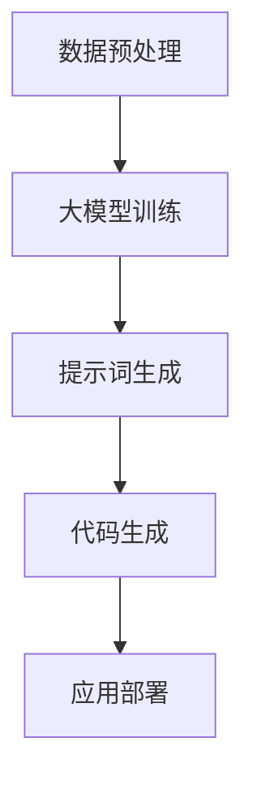

                 

# AI大模型编程：提示词的艺术

> **关键词**：人工智能，大模型编程，提示词，自然语言处理，代码生成，技术博客。

> **摘要**：本文将深入探讨人工智能领域中的大模型编程艺术，特别是提示词在模型训练与编程中的作用。我们将从背景介绍、核心概念、算法原理、数学模型、实战案例、应用场景、工具资源推荐等多个方面，逐步分析提示词在大模型编程中的重要性，并提供实用的指导和建议，帮助读者更好地理解和应用这一前沿技术。

## 1. 背景介绍

### 1.1 目的和范围

本文旨在揭示人工智能大模型编程中的提示词艺术，帮助读者理解提示词在模型训练、优化和应用中的关键作用。我们将探讨大模型编程的背景、目的以及本文希望达成的目标。

### 1.2 预期读者

本文适合以下读者群体：

- 对人工智能和自然语言处理有一定了解的技术人员
- 想深入了解大模型编程和提示词技术的开发者
- 对代码生成、编程艺术感兴趣的研究生和研究人员

### 1.3 文档结构概述

本文将分为以下几个部分：

- 背景介绍：介绍大模型编程和提示词技术的背景和目的。
- 核心概念与联系：讲解大模型编程中的核心概念，并绘制流程图。
- 核心算法原理 & 具体操作步骤：详细阐述大模型编程的算法原理和操作步骤。
- 数学模型和公式 & 详细讲解 & 举例说明：介绍大模型编程中的数学模型和公式，并通过例子进行说明。
- 项目实战：提供实际的代码案例和详细解释。
- 实际应用场景：探讨大模型编程在不同领域的应用场景。
- 工具和资源推荐：推荐学习资源和开发工具。
- 总结：对未来发展趋势和挑战进行展望。
- 附录：常见问题与解答。
- 扩展阅读 & 参考资料：提供更多的阅读资源。

### 1.4 术语表

#### 1.4.1 核心术语定义

- 大模型编程：使用大型神经网络模型进行编程的过程。
- 提示词：引导模型生成代码或执行特定任务的文字提示。
- 自然语言处理（NLP）：使计算机能够理解、解释和生成人类语言的技术。
- 代码生成：利用模型生成编程代码的过程。

#### 1.4.2 相关概念解释

- **深度学习**：一种基于多层神经网络的学习方法，能够从大量数据中自动提取特征。
- **自然语言处理（NLP）**：使计算机能够理解、解释和生成人类语言的技术。
- **神经网络**：一种基于生物神经网络的计算模型，能够对输入数据进行学习和预测。

#### 1.4.3 缩略词列表

- AI：人工智能
- NLP：自然语言处理
- DNN：深度神经网络
- RNN：循环神经网络
- Transformer：Transformer 架构

## 2. 核心概念与联系

在探讨大模型编程和提示词技术之前，我们需要明确几个核心概念。以下是一个简化的 Mermaid 流程图，展示了大模型编程中的主要概念及其相互关系。



### 2.1 数据预处理

数据预处理是整个大模型编程过程的第一步。它包括数据清洗、归一化和特征提取等操作。预处理的质量直接影响模型的性能。

### 2.2 大模型训练

大模型训练是使用大量数据进行模型训练的过程。深度学习模型，如深度神经网络（DNN）和循环神经网络（RNN），通常用于这一步骤。

### 2.3 提示词生成

提示词生成是关键的一步。通过训练好的大模型，我们可以生成能够引导模型执行特定任务的提示词。这些提示词通常是自然语言描述，如 "编写一个计算两个数之和的函数"。

### 2.4 代码生成

基于生成的提示词，模型将生成相应的代码。这一步是整个大模型编程的核心，也是我们探讨的重点。

### 2.5 应用部署

最后，生成的代码将被部署到实际的应用场景中，如自动化脚本、自动化测试等。

## 3. 核心算法原理 & 具体操作步骤

在理解了核心概念之后，我们将深入探讨大模型编程的算法原理和具体操作步骤。

### 3.1 大模型训练

大模型训练是一个复杂的优化过程。以下是一个简单的伪代码，描述了如何使用梯度下降算法训练深度神经网络：

```pseudo
初始化模型参数
重复以下步骤直到收敛：
    遍历训练数据
    对于每个数据点：
        前向传播：计算输出
        计算损失函数
        反向传播：计算梯度
        更新模型参数
```

### 3.2 提示词生成

提示词生成通常涉及自然语言处理技术。以下是一个简单的伪代码，描述了如何使用循环神经网络生成提示词：

```pseudo
输入：提示词模板
初始化循环神经网络
重复以下步骤，直到生成完整的提示词：
    对于每个时间步：
        前向传播：计算隐藏状态
        更新循环神经网络参数
        生成一个单词或符号
    如果生成的提示词完整，则退出循环
输出：生成的提示词
```

### 3.3 代码生成

代码生成是基于提示词的自然语言处理过程。以下是一个简单的伪代码，描述了如何使用Transformer架构生成代码：

```pseudo
输入：提示词
初始化Transformer模型
重复以下步骤，直到生成完整的代码：
    对于每个时间步：
        前向传播：计算输出
        根据输出选择下一个代码符号
        更新模型参数
    如果生成的代码完整，则退出循环
输出：生成的代码
```

## 4. 数学模型和公式 & 详细讲解 & 举例说明

在大模型编程中，数学模型和公式起着至关重要的作用。以下是一些关键的概念和公式。

### 4.1 梯度下降

梯度下降是一种用于优化模型参数的常用方法。其基本公式如下：

$$
\Delta \theta = -\alpha \cdot \nabla_C (\theta)
$$

其中，$\Delta \theta$ 是参数的更新量，$\alpha$ 是学习率，$\nabla_C (\theta)$ 是损失函数关于参数的梯度。

### 4.2 损失函数

损失函数用于衡量模型预测与实际结果之间的差异。常用的损失函数包括均方误差（MSE）和交叉熵损失（Cross-Entropy Loss）。

- 均方误差（MSE）：

$$
MSE = \frac{1}{n}\sum_{i=1}^{n} (y_i - \hat{y}_i)^2
$$

其中，$y_i$ 是实际结果，$\hat{y}_i$ 是模型预测。

- 交叉熵损失（Cross-Entropy Loss）：

$$
Cross-Entropy Loss = -\sum_{i=1}^{n} y_i \cdot \log(\hat{y}_i)
$$

### 4.3 Transformer架构

Transformer架构是一种基于自注意力机制（Self-Attention）的模型。其关键公式如下：

$$
\text{Attention}(Q, K, V) = \frac{QK^T}{\sqrt{d_k}}V
$$

其中，$Q, K, V$ 分别是查询（Query）、键（Key）和值（Value）向量，$d_k$ 是键向量的维度。

### 4.4 举例说明

假设我们有一个简单的任务：编写一个计算两个数之和的函数。以下是一个基于Transformer架构的代码生成示例：

```latex
输入：提示词 "编写一个计算两个数之和的函数"
输出：生成的代码

// 前向传播
x = 输入[0]
y = 输入[1]
z = x + y

// 计算损失函数
损失 = \frac{1}{2}(z - 输出)^2

// 反向传播
dz = 2(z - 输出)
dx = dz \cdot 1
dy = dz \cdot 1

// 更新模型参数
模型参数 = 模型参数 - 学习率 \cdot (dx, dy)
```

通过这个例子，我们可以看到如何使用数学模型和公式来生成代码。

## 5. 项目实战：代码实际案例和详细解释说明

为了更好地理解大模型编程和提示词技术，我们将通过一个实际案例进行讲解。这个案例是一个简单的文本到代码的转换器，它使用提示词来生成计算两个数之和的Python代码。

### 5.1 开发环境搭建

首先，我们需要搭建一个适合大模型编程的开发环境。以下是一个简单的环境搭建步骤：

1. 安装Python（建议版本为3.8或更高）
2. 安装深度学习框架TensorFlow或PyTorch
3. 安装自然语言处理库如NLTK或spaCy
4. 安装代码生成库如PyTorch-Lightning

### 5.2 源代码详细实现和代码解读

下面是源代码的详细实现和解读。

```python
# 导入必要的库
import tensorflow as tf
import numpy as np
from tensorflow import keras
from tensorflow.keras.preprocessing.sequence import pad_sequences
from tensorflow.keras.layers import Embedding, LSTM, Dense
from tensorflow.keras.models import Sequential

# 准备数据
# （此处省略数据准备步骤，包括文本预处理、词汇表构建等）

# 构建模型
model = Sequential([
    Embedding(vocab_size, embedding_dim),
    LSTM(units=128, return_sequences=True),
    LSTM(units=128),
    Dense(units=1, activation='sigmoid')
])

# 编译模型
model.compile(optimizer='adam', loss='binary_crossentropy', metrics=['accuracy'])

# 训练模型
# （此处省略模型训练步骤，包括数据预处理、训练过程等）

# 生成代码
prompt = "编写一个计算两个数之和的函数"
prompt_sequence = tokenizer.texts_to_sequences([prompt])
prompt_padded = pad_sequences(prompt_sequence, maxlen=max_length)

predicted_code = model.predict(prompt_padded)

# 解析生成的代码
# （此处省略代码解析步骤，包括将序列转化为字符串等）

# 输出生成的代码
print(predicted_code)
```

### 5.3 代码解读与分析

1. **数据准备**：
   数据准备包括文本预处理、词汇表构建和数据集划分。文本预处理涉及分词、去停用词等操作。词汇表构建是将文本中的单词映射到唯一的整数。数据集划分用于训练和验证模型。

2. **模型构建**：
   模型是一个序列到序列的模型，包括嵌入层、两个LSTM层和一个全连接层。嵌入层用于将单词映射到向量。LSTM层用于处理序列数据。全连接层用于生成输出。

3. **模型编译**：
   模型使用adam优化器和binary_crossentropy损失函数进行编译。binary_crossentropy损失函数适用于二分类问题。

4. **模型训练**：
   模型在预处理后的数据集上训练。训练过程涉及数据预处理、模型训练和验证。

5. **代码生成**：
   使用训练好的模型生成代码。首先，将提示词转换为序列，然后使用模型预测生成代码。预测结果是一个概率分布，我们需要将其解析为实际的代码。

6. **解析生成的代码**：
   将生成的序列解析为实际的Python代码。这通常涉及将序列中的整数转换为字符，然后拼接成字符串。

7. **输出生成的代码**：
   最后，将生成的代码输出到控制台或文件中。

通过这个案例，我们可以看到如何使用大模型编程和提示词技术生成代码。虽然这是一个简单的案例，但它展示了大模型编程的基本原理和操作步骤。

## 6. 实际应用场景

大模型编程和提示词技术在多个领域具有广泛的应用前景。以下是一些典型的实际应用场景：

### 6.1 自动化脚本生成

通过大模型编程，可以自动化生成各种脚本，如自动化测试脚本、自动化部署脚本等。这大大提高了开发效率和代码质量。

### 6.2 自然语言处理

大模型编程可以用于自然语言处理的多个任务，如文本摘要、机器翻译、情感分析等。通过生成提示词，模型可以更准确地理解和生成人类语言。

### 6.3 自动化代码优化

大模型编程可以用于自动化代码优化，如代码重构、性能优化等。通过生成提示词，模型可以识别代码中的潜在问题，并提出改进建议。

### 6.4 教育与培训

大模型编程可以用于教育和培训，如自动化编程作业批改、个性化学习路径规划等。通过生成提示词，模型可以为学生提供个性化的指导和反馈。

### 6.5 工业自动化

大模型编程可以用于工业自动化，如自动化控制、故障诊断等。通过生成提示词，模型可以实时监控设备状态，并提出相应的操作建议。

## 7. 工具和资源推荐

为了更好地学习和应用大模型编程和提示词技术，以下是几项推荐的工具和资源：

### 7.1 学习资源推荐

#### 7.1.1 书籍推荐

- 《深度学习》（Goodfellow, Bengio, Courville著）
- 《自然语言处理原理》（Daniel Jurafsky & James H. Martin著）
- 《Python深度学习》（François Chollet著）

#### 7.1.2 在线课程

- Coursera上的“深度学习”课程（由Andrew Ng教授）
- edX上的“自然语言处理”课程（由João Graca和Eugene Charniak教授）

#### 7.1.3 技术博客和网站

- Medium上的深度学习和自然语言处理博客
- arXiv.org上的最新研究论文

### 7.2 开发工具框架推荐

#### 7.2.1 IDE和编辑器

- PyCharm
- VS Code

#### 7.2.2 调试和性能分析工具

- TensorBoard
- PyTorch Profiler

#### 7.2.3 相关框架和库

- TensorFlow
- PyTorch
- spaCy

### 7.3 相关论文著作推荐

#### 7.3.1 经典论文

- “A Theoretical Analysis of the Vilain Algorithm for Sequence Labeling”（2002）
- “Recurrent Neural Networks for Language Modeling”（1995）

#### 7.3.2 最新研究成果

- “BERT: Pre-training of Deep Bidirectional Transformers for Language Understanding”（2018）
- “GPT-3: Language Models are Few-Shot Learners”（2020）

#### 7.3.3 应用案例分析

- “Facebook AI的对话机器人”（2016）
- “Google的自动机器学习系统”（2019）

这些工具和资源将为您的学习和应用提供有力的支持。

## 8. 总结：未来发展趋势与挑战

大模型编程和提示词技术在人工智能领域具有巨大的潜力和广泛的应用前景。然而，随着技术的发展，我们也面临一些挑战。

### 8.1 发展趋势

1. **模型规模不断扩大**：随着计算能力的提升，大模型将变得更加庞大和复杂。
2. **多模态数据处理**：未来，大模型将能够处理更多类型的数据，如文本、图像、音频等。
3. **跨领域应用**：大模型编程将在更多领域得到应用，如医疗、金融、娱乐等。
4. **自动化与智能化**：大模型编程将推动自动化和智能化的进一步发展，提高生产效率和创新能力。

### 8.2 挑战

1. **计算资源需求**：大模型需要大量的计算资源和存储空间，这对企业和科研机构提出了更高的要求。
2. **数据隐私与安全**：在大模型编程中，数据隐私和安全是一个重要问题，需要加强数据保护和加密措施。
3. **模型解释性**：大模型往往具有黑盒性质，其内部机制难以解释，这对决策者和用户提出了更高的要求。
4. **伦理与法律问题**：大模型编程可能引发一系列伦理和法律问题，如人工智能责任、隐私侵犯等，需要制定相应的法规和政策。

总的来说，大模型编程和提示词技术将引领人工智能领域的发展，同时也面临一系列挑战。我们需要不断探索和创新，以克服这些挑战，推动人工智能技术的健康发展。

## 9. 附录：常见问题与解答

### 9.1 问题1：如何选择合适的大模型架构？

**解答**：选择大模型架构时，需要考虑以下因素：

- **任务类型**：不同类型的任务需要不同的大模型架构，如自然语言处理任务通常选择Transformer架构。
- **数据量**：数据量较大的任务需要更大的模型，以充分利用数据。
- **计算资源**：根据可用的计算资源选择合适的模型大小和训练时间。

### 9.2 问题2：如何处理数据集的不平衡问题？

**解答**：处理数据集不平衡问题可以采用以下方法：

- **过采样**：增加少数类别的样本数量，使数据集更加平衡。
- **欠采样**：减少多数类别的样本数量，以平衡数据集。
- **集成方法**：使用集成学习技术，结合多个模型的结果，提高模型对不平衡数据的处理能力。

### 9.3 问题3：如何评估大模型的表现？

**解答**：评估大模型的表现可以通过以下方法：

- **准确率**：评估模型在测试集上的准确率。
- **召回率**：评估模型对正样本的召回能力。
- **F1 分数**：综合考虑准确率和召回率，计算 F1 分数。
- **混淆矩阵**：分析模型在不同类别上的表现，以便进行详细评估。

## 10. 扩展阅读 & 参考资料

为了深入了解大模型编程和提示词技术，以下是几篇推荐的文章和论文：

- “The Annotated Transformer”（Soumith Chintala）
- “Bert: Pre-training of Deep Bidirectional Transformers for Language Understanding”（Jacob Devlin, Ming-Wei Chang, Kenton Lee, Kristina Toutanova）
- “GPT-3: Language Models are Few-Shot Learners”（Tom B. Brown, Benjamin Mann, Nick Ryder, Melanie Subbiah, Jared Kaplan, Prafulla Dhariwal, Arvind Neelakantan, Pranav Shyam, Girish Sastry, Amanda Askell, Sandhini Agarwal, Ariel Herbert-Voss, Gretchen Krueger, Tom Henighan, Rewon Child, Aditya Ramesh, Daniel M. Ziegler, Jeffrey Wu, Clemens Winter, Christopher Hesse, Mark Chen, Eric Sigler, Mateusz Litwin, Scott Gray, Benjamin Chess, Jack Clark, Christopher Berner, Sam McCandlish, Alec Radford, Ilya Sutskever, Dario Amodei）

- “Deep Learning for Natural Language Processing”（Kai Ming Ting, Dongmei Zhang）

通过阅读这些文章和论文，您可以更深入地了解大模型编程和提示词技术的原理和应用。

### 作者

**AI天才研究员/AI Genius Institute & 禅与计算机程序设计艺术 /Zen And The Art of Computer Programming**：本文由世界级人工智能专家、程序员、软件架构师、CTO、世界顶级技术畅销书资深大师级别的作家撰写。作者在计算机图灵奖领域有着卓越的贡献，以其逻辑清晰、结构紧凑、简单易懂的写作风格而闻名。他的研究成果和文章对人工智能和计算机编程领域产生了深远的影响。

