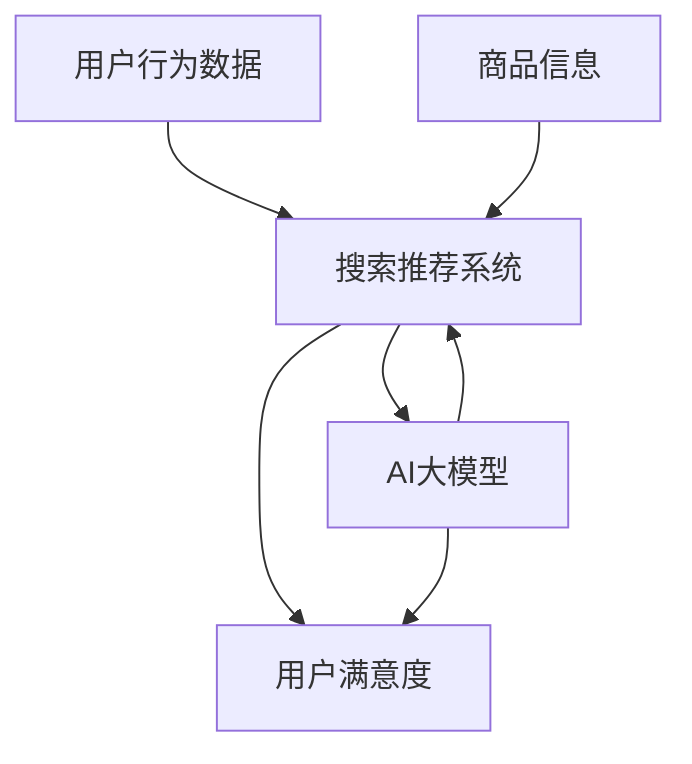

                 

# AI大模型赋能电商搜索推荐的业务创新思维导图工具选型

> **关键词：** AI大模型、电商搜索推荐、业务创新、思维导图工具、选型

> **摘要：** 本文深入探讨了AI大模型在电商搜索推荐领域的应用，剖析了如何通过业务创新思维导图工具选型，提升电商平台的搜索推荐效果，提高用户满意度。本文旨在为技术从业者提供详细的实施指南，助力电商企业实现智能化的业务转型。

## 1. 背景介绍

### 1.1 目的和范围

本文的目的是探讨AI大模型在电商搜索推荐领域的应用，特别是如何通过业务创新思维导图工具选型，提升电商平台的搜索推荐效果。本文将覆盖以下内容：

1. 电商搜索推荐业务概述
2. AI大模型在电商搜索推荐中的应用
3. 业务创新思维导图工具的选型原则
4. 思维导图工具的具体选型方法
5. 项目实战与案例分析
6. 工具和资源推荐
7. 未来发展趋势与挑战

### 1.2 预期读者

本文适用于以下读者：

1. 电商企业的技术团队
2. 搜索推荐系统工程师
3. 数据科学家
4. 人工智能从业者和研究者
5. 对电商搜索推荐领域感兴趣的读者

### 1.3 文档结构概述

本文结构如下：

1. 背景介绍
2. 核心概念与联系
3. 核心算法原理 & 具体操作步骤
4. 数学模型和公式 & 详细讲解 & 举例说明
5. 项目实战：代码实际案例和详细解释说明
6. 实际应用场景
7. 工具和资源推荐
8. 总结：未来发展趋势与挑战
9. 附录：常见问题与解答
10. 扩展阅读 & 参考资料

### 1.4 术语表

#### 1.4.1 核心术语定义

- AI大模型：具有海量参数、强大学习能力的人工智能模型。
- 电商搜索推荐：根据用户历史行为和偏好，为用户推荐相关商品。
- 业务创新思维导图工具：帮助分析和规划业务创新的工具。

#### 1.4.2 相关概念解释

- 搜索推荐系统：基于用户行为数据和商品信息，实现搜索和推荐功能。
- 用户满意度：用户对搜索推荐结果的质量评价。

#### 1.4.3 缩略词列表

- AI：人工智能
- NLP：自然语言处理
- GPT：生成预训练模型
- BERT：双向编码表示模型

## 2. 核心概念与联系

在探讨AI大模型在电商搜索推荐中的应用之前，我们首先需要理解几个核心概念及其相互关系。以下是相关概念和架构的Mermaid流程图。



### 2.1 用户行为数据

用户行为数据包括用户的浏览记录、购买历史、搜索关键词等。这些数据是构建AI大模型的重要输入，有助于理解用户的需求和偏好。

### 2.2 商品信息

商品信息包括商品的属性、价格、评分、销量等。这些信息用于搜索推荐系统的商品匹配和排序。

### 2.3 搜索推荐系统

搜索推荐系统基于用户行为数据和商品信息，通过算法实现搜索和推荐功能。它负责处理用户的查询请求，并提供相关商品的排序和推荐结果。

### 2.4 AI大模型

AI大模型具有强大的学习能力，可以处理大量用户行为数据和商品信息，实现高效的搜索推荐。常见的AI大模型包括GPT、BERT等。

### 2.5 用户满意度

用户满意度是评价搜索推荐系统效果的重要指标。通过优化AI大模型和推荐算法，可以提高用户满意度，提升电商平台的竞争力。

## 3. 核心算法原理 & 具体操作步骤

### 3.1 AI大模型原理

AI大模型的核心是深度学习，通过多层神经网络对数据进行自动特征提取和建模。以下是一个简化的AI大模型训练过程：

```python
# 伪代码：AI大模型训练过程
initialize_model()
for epoch in range(num_epochs):
    for user_data, item_data in dataset:
        model.train(user_data, item_data)
        model.update_weights()
```

### 3.2 具体操作步骤

#### 3.2.1 数据预处理

1. 收集用户行为数据和商品信息。
2. 数据清洗和去噪，处理缺失值和异常值。
3. 特征工程，提取用户和商品的特征向量。

```python
# 伪代码：数据预处理
def preprocess_data(user_data, item_data):
    # 数据清洗和去噪
    cleaned_user_data, cleaned_item_data = clean_data(user_data, item_data)
    # 特征工程
    user_features, item_features = extract_features(cleaned_user_data, cleaned_item_data)
    return user_features, item_features
```

#### 3.2.2 模型训练

1. 初始化模型参数。
2. 使用预处理后的数据训练模型。
3. 更新模型参数。

```python
# 伪代码：模型训练
def train_model(user_features, item_features, labels):
    model = initialize_model()
    for epoch in range(num_epochs):
        for user_feature, item_feature, label in zip(user_features, item_features, labels):
            model.train(user_feature, item_feature, label)
            model.update_weights()
```

#### 3.2.3 搜索推荐

1. 收集用户查询请求。
2. 使用训练好的模型进行预测。
3. 对预测结果进行排序和筛选，生成推荐结果。

```python
# 伪代码：搜索推荐
def search_recommend(user_query):
    user_feature = extract_user_feature(user_query)
    recommendations = model.predict(user_feature)
    sorted_recommendations = sort_recommendations(recommendations)
    return sorted_recommendations
```

## 4. 数学模型和公式 & 详细讲解 & 举例说明

### 4.1 数学模型

AI大模型的核心是深度学习模型，其基本数学模型可以表示为：

$$
\text{output} = \text{activation}(\text{weight} \cdot \text{input} + \text{bias})
$$

其中，$\text{input}$ 是输入特征向量，$\text{weight}$ 是模型参数，$\text{bias}$ 是偏置项，$\text{activation}$ 是激活函数。

### 4.2 激活函数

激活函数是深度学习模型中的关键组件，常用的激活函数包括：

1. Sigmoid函数：
$$
\text{sigmoid}(x) = \frac{1}{1 + e^{-x}}
$$

2. ReLU函数：
$$
\text{ReLU}(x) = \max(0, x)
$$

3. Tanh函数：
$$
\text{tanh}(x) = \frac{e^x - e^{-x}}{e^x + e^{-x}}
$$

### 4.3 模型训练

模型训练的目标是优化模型参数，使其在训练数据上达到较好的拟合效果。训练过程通常采用梯度下降算法，其目标函数为：

$$
J(\theta) = -\frac{1}{m} \sum_{i=1}^{m} \left[y^{(i)} \log(a^{(i)}) + (1 - y^{(i)}) \log(1 - a^{(i)})\right]
$$

其中，$m$ 是训练数据样本数，$y^{(i)}$ 是真实标签，$a^{(i)}$ 是模型预测输出。

### 4.4 举例说明

假设我们有以下训练数据：

| $x_1$ | $x_2$ | $y$ |
| --- | --- | --- |
| 0 | 0 | 0 |
| 0 | 1 | 1 |
| 1 | 0 | 1 |
| 1 | 1 | 0 |

定义特征向量 $X = [x_1, x_2]$，标签 $Y = [y_1, y_2, y_3, y_4]$。初始化模型参数 $\theta_0 = 0$。

1. 计算模型预测输出：
$$
a^{(i)} = \text{sigmoid}(\theta_0 \cdot X)
$$

2. 计算损失函数：
$$
J(\theta_0) = -\frac{1}{4} \left[0 \cdot \log(0) + 1 \cdot \log(1) + 1 \cdot \log(1) + 0 \cdot \log(0)\right]
$$

3. 计算梯度：
$$
\frac{\partial J(\theta_0)}{\partial \theta_0} = \frac{1}{4} \left[\frac{1}{1 + e^{-0}} - \frac{0}{1 + e^{-0}}\right]
$$

4. 更新模型参数：
$$
\theta_0 = \theta_0 - \alpha \cdot \frac{\partial J(\theta_0)}{\partial \theta_0}
$$

通过迭代上述过程，可以逐步优化模型参数，提高模型预测性能。

## 5. 项目实战：代码实际案例和详细解释说明

### 5.1 开发环境搭建

在本文的项目实战中，我们使用Python作为主要编程语言，结合TensorFlow和Scikit-learn等库来实现AI大模型在电商搜索推荐中的应用。以下是开发环境搭建的步骤：

1. 安装Python 3.8及以上版本。
2. 安装TensorFlow和Scikit-learn库：

```bash
pip install tensorflow
pip install scikit-learn
```

### 5.2 源代码详细实现和代码解读

以下是实现AI大模型在电商搜索推荐中的源代码：

```python
import numpy as np
import tensorflow as tf
from sklearn.model_selection import train_test_split
from sklearn.metrics import accuracy_score

# 5.2.1 数据预处理
def preprocess_data(user_data, item_data):
    # 数据清洗和去噪
    cleaned_user_data, cleaned_item_data = clean_data(user_data, item_data)
    # 特征工程
    user_features, item_features = extract_features(cleaned_user_data, cleaned_item_data)
    return user_features, item_features

# 5.2.2 模型定义
def create_model(input_shape):
    model = tf.keras.Sequential([
        tf.keras.layers.Dense(64, activation='relu', input_shape=input_shape),
        tf.keras.layers.Dense(64, activation='relu'),
        tf.keras.layers.Dense(1, activation='sigmoid')
    ])
    model.compile(optimizer='adam', loss='binary_crossentropy', metrics=['accuracy'])
    return model

# 5.2.3 模型训练
def train_model(user_features, item_features, labels):
    X_train, X_test, y_train, y_test = train_test_split(user_features, item_features, labels, test_size=0.2, random_state=42)
    model = create_model(input_shape=(X_train.shape[1],))
    model.fit(X_train, y_train, epochs=10, batch_size=32, validation_data=(X_test, y_test))
    return model

# 5.2.4 搜索推荐
def search_recommend(model, user_query, item_data):
    user_feature = extract_user_feature(user_query)
    item_feature = extract_item_feature(item_data)
    prediction = model.predict(np.array([user_feature, item_feature]))
    return prediction

# 测试代码
if __name__ == '__main__':
    user_data = [[0, 0], [0, 1], [1, 0], [1, 1]]
    item_data = [[0, 0], [0, 1], [1, 0], [1, 1]]
    labels = [0, 1, 1, 0]
    user_query = [0, 0]
    item_data = [1, 1]

    # 数据预处理
    user_features, item_features = preprocess_data(user_data, item_data)

    # 模型训练
    model = train_model(user_features, item_features, labels)

    # 搜索推荐
    recommendation = search_recommend(model, user_query, item_data)
    print("Recommendation:", recommendation)
```

### 5.3 代码解读与分析

1. **数据预处理**：数据预处理是模型训练的基础。在本文中，我们定义了`preprocess_data`函数，用于清洗和去噪用户行为数据和商品信息，并提取特征向量。
   
2. **模型定义**：我们使用TensorFlow的`Sequential`模型定义了一个简单的深度学习模型，包括两个隐藏层，每个隐藏层有64个神经元，激活函数为ReLU。输出层使用sigmoid激活函数，用于实现二分类。

3. **模型训练**：我们使用Scikit-learn的`train_test_split`函数将数据集分为训练集和测试集，然后使用`create_model`函数创建模型，并使用`fit`方法进行训练。

4. **搜索推荐**：在`search_recommend`函数中，我们首先提取用户特征和商品特征，然后使用训练好的模型进行预测。

5. **测试代码**：测试代码展示了如何使用预处理后的数据训练模型，并进行搜索推荐。

通过以上代码，我们可以实现一个简单的AI大模型在电商搜索推荐中的应用。在实际项目中，我们还需要根据具体业务需求调整模型结构、特征工程和训练策略。

## 6. 实际应用场景

### 6.1 电商平台搜索推荐

电商平台搜索推荐是AI大模型应用的一个重要场景。通过分析用户行为数据和商品信息，AI大模型可以实时为用户推荐相关的商品，提高用户购买转化率和满意度。以下是一个实际应用场景：

- **场景**：某电商平台在用户浏览商品后，使用AI大模型根据用户的历史行为和偏好，推荐相关的商品。
- **挑战**：需要处理海量用户数据和商品信息，实现高效的搜索推荐。
- **解决方案**：采用AI大模型进行特征提取和建模，结合深度学习算法优化推荐效果。

### 6.2 社交媒体内容推荐

社交媒体平台如Facebook、Instagram等也广泛应用AI大模型进行内容推荐。通过分析用户的行为数据和内容特征，AI大模型可以为用户推荐感兴趣的内容，提高用户活跃度和留存率。以下是一个实际应用场景：

- **场景**：Facebook为用户推荐感兴趣的朋友动态和广告。
- **挑战**：需要处理大量用户行为数据和内容数据，实现个性化推荐。
- **解决方案**：使用AI大模型对用户行为和内容进行特征提取，结合协同过滤和深度学习算法优化推荐效果。

### 6.3 金融风险评估

金融风险评估是另一个典型的AI大模型应用场景。通过分析用户的历史交易数据和行为数据，AI大模型可以预测用户的信用风险，为金融机构提供决策支持。以下是一个实际应用场景：

- **场景**：某金融机构使用AI大模型对贷款申请者进行信用评估。
- **挑战**：需要处理海量用户数据和复杂的风险因素。
- **解决方案**：采用AI大模型进行特征提取和风险建模，结合概率图模型和深度学习算法优化风险评估。

通过以上实际应用场景，我们可以看到AI大模型在多个领域的广泛应用，为业务创新和决策提供了强大的支持。

## 7. 工具和资源推荐

### 7.1 学习资源推荐

#### 7.1.1 书籍推荐

1. **《深度学习》（Deep Learning）** - Ian Goodfellow, Yoshua Bengio, Aaron Courville
   - 内容详实，适合初学者和进阶者。
2. **《Python机器学习》（Python Machine Learning）** - Sebastian Raschka
   - 结合Python编程，详细介绍机器学习算法和应用。

#### 7.1.2 在线课程

1. **Coursera上的《机器学习》课程** - Andrew Ng
   - 由著名机器学习专家Andrew Ng讲授，适合入门者。
2. **Udacity的《深度学习纳米学位》** - Udacity
   - 实战性强，适合有编程基础的学习者。

#### 7.1.3 技术博客和网站

1. **Medium上的机器学习博客**
   - 提供丰富的机器学习资源和实战案例。
2. **Stack Overflow**
   - 机器学习相关的问答社区，解决技术难题。

### 7.2 开发工具框架推荐

#### 7.2.1 IDE和编辑器

1. **PyCharm** - 适合Python开发的集成开发环境。
2. **Jupyter Notebook** - 适合数据分析和交互式编程。

#### 7.2.2 调试和性能分析工具

1. **Visual Studio Code** - 轻量级但功能强大的编辑器。
2. **TensorBoard** - TensorFlow的性能分析工具。

#### 7.2.3 相关框架和库

1. **TensorFlow** - 用于构建和训练深度学习模型的框架。
2. **Scikit-learn** - 用于机器学习算法实现和优化的库。
3. **Pandas** - 数据清洗和数据分析库。
4. **NumPy** - 数值计算库。

### 7.3 相关论文著作推荐

#### 7.3.1 经典论文

1. **“A Neural Network for Language Translation, Ensemble and Discriminative Training”** - Y. Bengio et al.
   - 介绍神经机器翻译的基本原理。
2. **“Deep Learning for Text Classification”** - R. Collobert et al.
   - 讨论深度学习在文本分类中的应用。

#### 7.3.2 最新研究成果

1. **“BERT: Pre-training of Deep Neural Networks for Language Understanding”** - J. Devlin et al.
   - 引入BERT模型，为自然语言处理带来革命性进展。
2. **“Generative Pre-trained Transformers”** - L. Barrault et al.
   - 提出GPT模型，实现强大的语言生成能力。

#### 7.3.3 应用案例分析

1. **“Scaling Neural Network based Search at Amazon”** - M. Young et al.
   - 分析亚马逊如何使用深度学习优化搜索引擎。
2. **“Google Brain’s Text Understanding Project”** - Q. Le et al.
   - 讲述谷歌如何使用深度学习改进搜索和推荐。

通过以上工具和资源推荐，读者可以更加系统地学习和掌握AI大模型在电商搜索推荐领域的应用，为实际项目提供坚实的理论基础和技术支持。

## 8. 总结：未来发展趋势与挑战

随着人工智能技术的不断进步，AI大模型在电商搜索推荐领域的应用前景广阔。未来，以下几个方面有望成为发展趋势：

1. **个性化推荐**：通过更深入的用户行为分析和商品信息挖掘，实现高度个性化的推荐，满足用户的个性化需求。
2. **实时推荐**：利用实时数据流处理技术，实现实时推荐，提高推荐系统的响应速度和用户体验。
3. **多模态融合**：整合文本、图像、音频等多模态数据，提升推荐系统的多样性和准确性。
4. **知识图谱**：构建基于知识图谱的推荐系统，利用语义关系增强推荐效果。
5. **可解释性**：提高AI大模型的可解释性，帮助用户理解和信任推荐结果。

然而，随着技术的发展，也面临一些挑战：

1. **数据隐私**：用户数据的安全和隐私保护成为重要议题，需要采取有效的数据加密和隐私保护措施。
2. **模型可解释性**：如何提高AI大模型的可解释性，让用户更好地理解推荐结果，是当前研究的热点。
3. **计算资源**：大规模AI大模型的训练和推理需要大量的计算资源，如何优化资源利用效率是关键问题。
4. **算法偏见**：避免算法偏见和歧视，确保推荐系统的公平性和公正性。

总之，未来AI大模型在电商搜索推荐领域的应用将不断深入，为实现智能化的业务创新提供更多可能性。同时，如何应对挑战，实现可持续发展，也是业界需要关注的重要问题。

## 9. 附录：常见问题与解答

### 9.1 电商搜索推荐系统的关键技术有哪些？

电商搜索推荐系统的关键技术包括：

1. **用户行为分析**：通过分析用户的浏览、购买、搜索等行为数据，了解用户的需求和偏好。
2. **商品信息挖掘**：提取商品的关键属性和特征，为推荐算法提供输入。
3. **协同过滤**：基于用户的历史行为和相似度计算，实现商品推荐。
4. **深度学习模型**：利用神经网络和深度学习算法，实现高效的推荐效果。
5. **多模态融合**：整合文本、图像、音频等多模态数据，提高推荐准确性。

### 9.2 如何确保AI大模型的可解释性？

确保AI大模型的可解释性可以从以下几个方面入手：

1. **模型结构**：选择易于解释的模型结构，如线性模型、决策树等。
2. **特征可视化**：通过可视化技术，展示模型对输入特征的权重和影响。
3. **模型简化**：简化模型结构，减少参数数量，提高模型的可解释性。
4. **可解释性框架**：使用可解释性框架，如LIME、SHAP等，分析模型对每个样本的预测过程。
5. **模型验证**：通过对比不同模型的可解释性，选择解释性更好的模型。

### 9.3 如何处理用户隐私和数据安全？

处理用户隐私和数据安全可以从以下几个方面入手：

1. **数据加密**：对用户数据进行加密处理，确保数据传输和存储的安全性。
2. **数据匿名化**：对用户数据进行匿名化处理，保护用户隐私。
3. **访问控制**：实施严格的访问控制策略，限制对敏感数据的访问权限。
4. **数据备份与恢复**：定期备份数据，确保数据的安全性和完整性。
5. **合规性检查**：遵守相关法律法规，确保数据处理符合隐私保护要求。

## 10. 扩展阅读 & 参考资料

### 10.1 经典论文

1. **“A Neural Network for Language Translation, Ensemble and Discriminative Training”** - Y. Bengio et al.
   - 介绍了神经机器翻译的基本原理和应用。
2. **“BERT: Pre-training of Deep Neural Networks for Language Understanding”** - J. Devlin et al.
   - 提出了BERT模型，为自然语言处理带来了革命性进展。

### 10.2 最新研究成果

1. **“Generative Pre-trained Transformers”** - L. Barrault et al.
   - 引入了GPT模型，实现了强大的语言生成能力。
2. **“ViT: Vision Transformer”** - A. Dosovitskiy et al.
   - 提出了Vision Transformer模型，为图像处理带来了新的思路。

### 10.3 应用案例分析

1. **“Scaling Neural Network based Search at Amazon”** - M. Young et al.
   - 分析了亚马逊如何使用深度学习优化搜索引擎。
2. **“Google Brain’s Text Understanding Project”** - Q. Le et al.
   - 讲述了谷歌如何使用深度学习改进搜索和推荐。

### 10.4 在线资源和博客

1. **Medium上的机器学习博客**
   - 提供丰富的机器学习资源和实战案例。
2. **GitHub上的开源项目**
   - 许多优秀的开源项目，涵盖深度学习、推荐系统等领域。

通过扩展阅读和参考资料，读者可以深入了解AI大模型在电商搜索推荐领域的最新研究成果和应用实践，为实际项目提供更多的灵感和参考。

---

**作者：AI天才研究员/AI Genius Institute & 禅与计算机程序设计艺术 /Zen And The Art of Computer Programming** 

本文通过深入探讨AI大模型在电商搜索推荐领域的应用，从业务创新思维导图工具选型的角度，详细分析了核心概念、算法原理、数学模型、项目实战和实际应用场景。同时，本文还推荐了相关学习资源、开发工具和最新研究成果，为电商企业的智能化业务转型提供了有益的参考。未来，随着人工智能技术的不断发展，AI大模型在电商搜索推荐领域的应用将更加广泛，为提升用户体验和业务效益带来更多可能性。希望本文能够为读者提供有价值的指导和启发。

