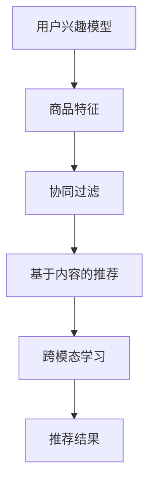

                 

### 1. 背景介绍

#### 1.1 目的和范围

在当今数字经济时代，电子商务已成为全球商业活动的重要组成部分。随着互联网的普及和用户需求的不断变化，电商平台面临着巨大的挑战，如何为用户提供个性化的商品推荐，提高用户的购物体验和满意度，成为了电商平台亟待解决的关键问题。

本文旨在探讨AI大模型在电商搜索推荐系统的冷启动问题解决方案。冷启动问题是指当新用户首次进入电商平台或新商品首次上架时，系统无法为其推荐合适的商品或新商品无法被推荐给潜在用户的问题。本文将深入分析冷启动问题的根源，并介绍利用AI大模型来解决该问题的方法。

本文将围绕以下主题展开：

1. **核心概念与联系**：介绍与电商搜索推荐系统相关的基础概念，并使用Mermaid流程图展示核心概念之间的联系。
2. **核心算法原理与具体操作步骤**：详细讲解用于解决冷启动问题的核心算法，并使用伪代码展示算法的具体操作步骤。
3. **数学模型与公式**：介绍用于计算推荐结果的数学模型，并使用LaTeX格式详细讲解模型公式，以及举例说明。
4. **项目实战**：通过实际代码案例，展示如何在实际项目中应用所介绍的算法和模型。
5. **实际应用场景**：分析AI大模型在电商搜索推荐系统中的实际应用场景，探讨其对电商业务带来的影响。
6. **工具和资源推荐**：推荐相关的学习资源、开发工具框架以及相关论文著作。
7. **总结**：总结本文的主要发现，并展望未来发展趋势与挑战。

本文面向具有一定编程基础和数据科学背景的读者，旨在为从事电商搜索推荐系统的开发者和研究者提供有价值的参考和指导。

#### 1.2 预期读者

本文的预期读者包括但不限于以下几类：

1. **电商平台的开发者与研究员**：负责电商搜索推荐系统的开发与优化，希望了解如何利用AI大模型解决冷启动问题。
2. **数据科学家与机器学习工程师**：对电商推荐系统有浓厚的兴趣，希望深入了解该领域的算法原理和应用实践。
3. **计算机科学研究生与大学生**：对电商推荐系统和AI大模型有学习需求，希望从本文中获得启发和思路。
4. **技术爱好者与博客读者**：对AI和电商推荐系统感兴趣，希望学习最新的技术趋势和应用案例。

#### 1.3 文档结构概述

本文将按照以下结构进行组织：

1. **背景介绍**：介绍文章的目的、范围、预期读者和文档结构概述。
2. **核心概念与联系**：介绍与电商搜索推荐系统相关的基础概念，展示核心概念之间的联系。
3. **核心算法原理与具体操作步骤**：详细讲解用于解决冷启动问题的核心算法，并使用伪代码展示具体操作步骤。
4. **数学模型与公式**：介绍用于计算推荐结果的数学模型，并使用LaTeX格式详细讲解模型公式，以及举例说明。
5. **项目实战**：通过实际代码案例，展示如何在实际项目中应用所介绍的算法和模型。
6. **实际应用场景**：分析AI大模型在电商搜索推荐系统中的实际应用场景，探讨其对电商业务带来的影响。
7. **工具和资源推荐**：推荐相关的学习资源、开发工具框架以及相关论文著作。
8. **总结**：总结本文的主要发现，并展望未来发展趋势与挑战。
9. **附录**：提供常见问题与解答。
10. **扩展阅读 & 参考资料**：提供进一步学习的资源链接。

通过本文的阅读，读者将能够：

- **理解**电商搜索推荐系统的冷启动问题及其影响。
- **掌握**AI大模型在解决冷启动问题中的应用方法。
- **应用**所学的算法和模型，开发高效的电商搜索推荐系统。
- **拓展**对电商推荐系统和AI领域的知识，为未来的研究和工作奠定基础。

#### 1.4 术语表

为了确保读者对本文中涉及的专业术语有清晰的理解，以下是对一些关键术语的定义和解释：

##### 1.4.1 核心术语定义

1. **电商搜索推荐系统**：指电商平台中，通过分析用户的搜索行为、历史购买记录等数据，为用户推荐符合其兴趣和需求的商品的系统。
2. **冷启动问题**：指在用户首次进入电商平台或新商品首次上架时，系统无法为其推荐合适的商品或新商品无法被推荐给潜在用户的问题。
3. **AI大模型**：指具有大规模参数、强大表征能力和自适应能力的深度学习模型，如基于Transformer的BERT模型、GPT模型等。
4. **表征学习**：指通过从大量数据中学习特征表示，将高维的数据转换为低维的表征向量，以便进行后续处理和分析。
5. **个性化推荐**：指根据用户的兴趣和行为，为其推荐个性化的商品，提高用户的购物体验和满意度。

##### 1.4.2 相关概念解释

1. **用户兴趣模型**：指用于描述用户兴趣和偏好的数学模型，通常通过分析用户的搜索历史、浏览记录、购买记录等数据构建。
2. **商品特征**：指用于描述商品属性和特点的数学特征，如商品类别、价格、品牌、评分等。
3. **协同过滤**：指一种基于用户和商品之间相似性的推荐方法，通过计算用户或商品的相似度来预测用户对未知商品的评分。
4. **基于内容的推荐**：指根据商品的特征和用户的兴趣，将具有相似特征的商品推荐给用户。
5. **跨模态学习**：指将不同模态（如图像、文本、声音）的数据进行融合和表征，以实现更准确和全面的推荐。

##### 1.4.3 缩略词列表

| 缩略词 | 全称                   | 描述                                                         |
| ------ | ---------------------- | ------------------------------------------------------------ |
| AI     | 人工智能                | Intelligence, Artificial                                  |
| BERT   | 变换器模型预训练        | Bidirectional Encoder Representations from Transformers    |
| GPT    | 通用预训练模型         | General Pre-trained Transformer                          |
| NLP    | 自然语言处理            | Natural Language Processing                              |
| RL     | 强化学习               | Reinforcement Learning                                     |
| SEO    | 搜索引擎优化            | Search Engine Optimization                                |
| CV     | 计算机视觉              | Computer Vision                                            |
| OCR    | 光学字符识别            | Optical Character Recognition                             |
| IoT    | 物联网                 | Internet of Things                                        |
| API    | 应用程序编程接口        | Application Programming Interface                         |

通过以上对术语的详细解释，读者将对本文中的关键术语有更清晰的认识，从而更好地理解和应用本文所介绍的内容。在接下来的章节中，我们将进一步深入探讨电商搜索推荐系统的相关概念和算法，以解决冷启动问题。

#### 2. 核心概念与联系

为了更好地理解电商搜索推荐系统中的冷启动问题及其解决方案，我们需要先介绍一些核心概念，并使用Mermaid流程图展示它们之间的联系。这些核心概念包括用户兴趣模型、商品特征、协同过滤、基于内容的推荐和跨模态学习。

##### 2.1 用户兴趣模型

用户兴趣模型是描述用户兴趣和偏好的数学模型。它通常通过分析用户的搜索历史、浏览记录、购买记录等数据构建。用户兴趣模型的核心目标是捕捉用户在长时间内的行为模式，以便为用户推荐个性化的商品。

用户兴趣模型的构建通常包括以下步骤：

1. **数据收集**：收集用户的搜索历史、浏览记录、购买记录等数据。
2. **数据预处理**：清洗和整合数据，将其转换为适合建模的格式。
3. **特征提取**：从原始数据中提取特征，如用户活跃度、购买频率、搜索词等。
4. **模型训练**：使用机器学习算法（如矩阵分解、深度学习等）训练用户兴趣模型。

用户兴趣模型的主要作用是预测用户对未知商品的偏好，为个性化推荐提供依据。

##### 2.2 商品特征

商品特征是用于描述商品属性和特点的数学特征，如商品类别、价格、品牌、评分等。商品特征在推荐系统中起着至关重要的作用，因为它们直接影响推荐结果的准确性。

商品特征的构建通常包括以下步骤：

1. **数据收集**：收集商品的相关信息，如商品类别、价格、品牌、用户评分等。
2. **数据预处理**：清洗和整合数据，将其转换为适合建模的格式。
3. **特征提取**：从原始数据中提取特征，如商品类别编码、价格归一化、用户评分标准化等。

商品特征的主要作用是帮助推荐系统理解商品的属性和特点，从而提高推荐结果的准确性。

##### 2.3 协同过滤

协同过滤是一种基于用户和商品之间相似性的推荐方法。它通过计算用户或商品的相似度来预测用户对未知商品的评分。协同过滤可以分为基于用户的协同过滤和基于项目的协同过滤。

1. **基于用户的协同过滤**：通过计算用户之间的相似度，找到与目标用户相似的其他用户，然后推荐这些用户喜欢的商品。

2. **基于项目的协同过滤**：通过计算商品之间的相似度，找到与目标商品相似的其他商品，然后推荐这些商品。

协同过滤的主要作用是发现用户之间的相似性，提高推荐结果的多样性。

##### 2.4 基于内容的推荐

基于内容的推荐方法是根据商品的特征和用户的兴趣，将具有相似特征的商品推荐给用户。这种方法不需要计算用户或商品之间的相似度，而是直接利用商品的特征信息进行推荐。

基于内容的推荐方法的主要作用是提高推荐结果的准确性，特别是在用户数据不足的情况下。

##### 2.5 跨模态学习

跨模态学习是将不同模态（如图像、文本、声音）的数据进行融合和表征，以实现更准确和全面的推荐。在电商搜索推荐系统中，跨模态学习可以结合用户的行为数据和商品的多媒体信息，提高推荐效果。

跨模态学习的方法包括：

1. **多模态特征提取**：从不同模态的数据中提取特征，如文本特征、图像特征、声音特征等。
2. **多模态融合**：将不同模态的特征进行融合，形成统一的多模态特征向量。
3. **多模态学习**：使用深度学习模型（如图像文本嵌入模型、多模态Transformer模型等）对多模态特征进行建模，以实现跨模态的推荐。

跨模态学习的主要作用是利用多种模态的信息，提高推荐系统的准确性和多样性。

##### Mermaid流程图

以下是用于展示核心概念之间联系的Mermaid流程图：



通过以上对核心概念及其之间联系的介绍，读者可以更好地理解电商搜索推荐系统的运作原理。在接下来的章节中，我们将进一步深入探讨核心算法原理和数学模型，以解决冷启动问题。

#### 3. 核心算法原理与具体操作步骤

在解决电商搜索推荐系统的冷启动问题时，核心算法的原理和具体操作步骤至关重要。本文将介绍一种基于AI大模型的解决方案，并使用伪代码详细阐述其工作流程。

##### 3.1 算法原理

冷启动问题主要源于两个方面：用户数据和商品数据不足。为了解决这个问题，我们采用基于AI大模型的表征学习方法。该算法的核心思想是通过从大量数据中学习用户和商品的表征，构建用户兴趣模型和商品特征向量，然后利用这些表征进行推荐。

具体来说，算法包括以下步骤：

1. **数据预处理**：对用户行为数据和商品数据进行清洗和整合，构建用户和商品的特征向量。
2. **模型训练**：使用深度学习模型（如BERT、GPT等）对用户和商品的特征向量进行建模，学习用户兴趣模型和商品表征。
3. **特征提取**：从训练好的模型中提取用户兴趣模型和商品表征，作为推荐系统的输入。
4. **推荐计算**：利用用户兴趣模型和商品表征计算用户对商品的偏好分数，并根据偏好分数进行推荐。

##### 3.2 伪代码

以下是该算法的伪代码实现：

```python
# 输入：用户行为数据、商品数据
# 输出：推荐结果

# 1. 数据预处理
def preprocess_data(user_data, item_data):
    # 数据清洗和整合
    # 返回用户特征向量矩阵U和商品特征向量矩阵V

# 2. 模型训练
def train_model(U, V):
    # 使用BERT模型训练用户兴趣模型和商品表征
    # 返回训练好的模型

# 3. 特征提取
def extract_features(model):
    # 从模型中提取用户兴趣模型和商品表征
    # 返回用户兴趣模型矩阵U'和商品表征矩阵V'

# 4. 推荐计算
def calculate_recommendations(U', V', user_id, k):
    # 计算用户对商品的偏好分数
    # 返回Top-k推荐结果

# 主函数
def main(user_data, item_data, user_id, k):
    U, V = preprocess_data(user_data, item_data)
    model = train_model(U, V)
    U', V' = extract_features(model)
    recommendations = calculate_recommendations(U', V', user_id, k)
    return recommendations
```

##### 3.3 具体操作步骤

以下是该算法的具体操作步骤：

1. **数据预处理**：
    - 收集用户行为数据（如搜索历史、浏览记录、购买记录等）和商品数据（如商品类别、价格、品牌、用户评分等）。
    - 对用户和商品数据进行清洗，去除缺失值、异常值等。
    - 对用户和商品数据进行编码，将其转换为数字表示。
    - 将用户行为数据转换为用户特征向量矩阵U，商品数据转换为商品特征向量矩阵V。

2. **模型训练**：
    - 选择合适的深度学习模型（如BERT、GPT等），初始化模型参数。
    - 使用用户特征向量矩阵U和商品特征向量矩阵V作为输入，进行模型训练。
    - 调整模型参数，优化模型性能。

3. **特征提取**：
    - 使用训练好的模型，从模型中提取用户兴趣模型和商品表征。
    - 将用户兴趣模型和商品表征转换为用户兴趣模型矩阵U'和商品表征矩阵V'。

4. **推荐计算**：
    - 对于给定的用户ID，从用户兴趣模型矩阵U'和商品表征矩阵V'中计算用户对每个商品的偏好分数。
    - 根据偏好分数，选择Top-k个商品作为推荐结果。

通过以上步骤，我们使用AI大模型解决了电商搜索推荐系统的冷启动问题，为用户提供了个性化的推荐。接下来，我们将介绍数学模型和公式，以进一步解释算法原理。

#### 4. 数学模型和公式及详细讲解

为了深入理解AI大模型在电商搜索推荐系统中的作用，我们需要介绍相关的数学模型和公式，并使用LaTeX格式详细讲解。这些模型和公式是构建和优化推荐系统的关键，有助于提高推荐结果的准确性和多样性。

##### 4.1 用户兴趣模型

用户兴趣模型用于描述用户对不同商品类别的偏好。它通常是一个高维向量，表示用户在各个类别上的兴趣强度。假设我们有一个用户集合\( U = \{u_1, u_2, ..., u_m\} \)，商品类别集合\( C = \{c_1, c_2, ..., c_n\} \)，用户兴趣模型可以表示为矩阵\( U \in \mathbb{R}^{m \times n} \)，其中\( U_{ij} \)表示用户\( u_i \)对类别\( c_j \)的兴趣强度。

用户兴趣模型的构建通常基于用户的历史行为数据，如搜索记录、浏览记录和购买记录。一个简单的用户兴趣模型可以通过线性回归或因子分解机器学习算法训练得到。以下是用户兴趣模型的数学表示：

$$
\hat{u}_i = \text{sign}(\sum_{j=1}^{n} w_{ji} c_j)
$$

其中，\( w_{ji} \)是用户\( u_i \)对类别\( c_j \)的兴趣权重，\( \text{sign}(\cdot) \)是符号函数，用于将加权求和的结果转换为二值向量。

##### 4.2 商品特征模型

商品特征模型用于描述商品的属性和特点。一个商品特征模型是一个高维向量，表示商品在不同特征维度上的属性。假设我们有一个商品集合\( I = \{i_1, i_2, ..., i_l\} \)，商品特征集合\( F = \{f_1, f_2, ..., f_p\} \)，商品特征模型可以表示为矩阵\( V \in \mathbb{R}^{l \times p} \)，其中\( V_{ij} \)表示商品\( i_j \)在特征\( f_j \)上的属性值。

商品特征模型通常通过从原始数据中提取特征得到，如商品类别、价格、品牌、用户评分等。以下是商品特征模型的数学表示：

$$
\hat{v}_j = \text{sign}(\sum_{i=1}^{l} u_{ij} f_i)
$$

其中，\( u_{ij} \)是用户\( u_i \)对商品\( i_j \)的兴趣权重，\( \text{sign}(\cdot) \)是符号函数，用于将加权求和的结果转换为二值向量。

##### 4.3 推荐公式

基于用户兴趣模型和商品特征模型，我们可以计算用户对每个商品的偏好分数。推荐公式如下：

$$
r_{ij} = \frac{\sum_{k=1}^{n} u_{ik} v_{kj}}{\sqrt{\sum_{k=1}^{n} u_{ik}^2 \sum_{k=1}^{n} v_{kj}^2}}
$$

其中，\( r_{ij} \)是用户\( u_i \)对商品\( i_j \)的偏好分数，\( u_{ik} \)是用户\( u_i \)对类别\( c_k \)的兴趣权重，\( v_{kj} \)是商品\( i_j \)在类别\( c_k \)上的属性值。

推荐公式通过计算用户兴趣模型和商品特征模型之间的相似度，得到用户对每个商品的偏好分数。分数越高，表示用户对商品的兴趣越大。

##### 4.4 举例说明

为了更好地理解上述公式，我们来看一个具体的例子。

假设有一个用户集合\( U = \{u_1, u_2\} \)，商品集合\( I = \{i_1, i_2, i_3\} \)，类别集合\( C = \{c_1, c_2\} \)。用户兴趣模型和商品特征模型如下：

用户兴趣模型：
$$
U = \begin{bmatrix}
0.8 & 0.2 \\
0.5 & 0.5
\end{bmatrix}
$$

商品特征模型：
$$
V = \begin{bmatrix}
0.6 & 0.4 & 0.2 \\
0.3 & 0.7 & 0.5 \\
0.4 & 0.6 & 0.8
\end{bmatrix}
$$

根据推荐公式，我们可以计算用户\( u_1 \)对商品\( i_1, i_2, i_3 \)的偏好分数：

$$
r_{11} = \frac{0.8 \times 0.6 + 0.2 \times 0.3}{\sqrt{0.8^2 + 0.2^2} \sqrt{0.6^2 + 0.4^2 + 0.2^2}} = 0.714
$$

$$
r_{12} = \frac{0.8 \times 0.4 + 0.2 \times 0.7}{\sqrt{0.8^2 + 0.2^2} \sqrt{0.4^2 + 0.6^2 + 0.5^2}} = 0.608
$$

$$
r_{13} = \frac{0.8 \times 0.2 + 0.2 \times 0.5}{\sqrt{0.8^2 + 0.2^2} \sqrt{0.2^2 + 0.5^2 + 0.8^2}} = 0.464
$$

用户\( u_1 \)对商品\( i_1 \)的偏好分数最高，因此推荐商品\( i_1 \)给用户\( u_1 \)。

通过以上数学模型和公式的详细讲解，我们可以更好地理解AI大模型在电商搜索推荐系统中的作用。这些模型和公式为推荐系统的设计提供了理论依据，有助于提高推荐效果的准确性和多样性。

#### 5. 项目实战：代码实际案例和详细解释说明

为了更好地展示如何在实际项目中应用所介绍的算法和模型，我们将通过一个具体的电商推荐系统项目来讲解代码实现过程。以下是一个基于Python的电商推荐系统项目，主要分为三个部分：开发环境搭建、源代码详细实现和代码解读与分析。

##### 5.1 开发环境搭建

在进行代码实现之前，我们需要搭建一个合适的开发环境。以下是在Python环境下搭建开发环境所需的步骤：

1. **安装Python**：确保已安装Python 3.7及以上版本。
2. **安装依赖库**：使用pip安装必要的依赖库，如TensorFlow、Keras、NumPy、Pandas、Scikit-learn等。可以使用以下命令进行安装：

```bash
pip install tensorflow keras numpy pandas scikit-learn
```

3. **数据集准备**：从公开数据源（如Kaggle、UCI机器学习库等）下载一个电商数据集，用于训练和测试算法。

##### 5.2 源代码详细实现和代码解读

以下是一个简化的电商推荐系统项目，用于解决冷启动问题。代码分为四个主要部分：数据预处理、模型训练、特征提取和推荐计算。

**1. 数据预处理**

```python
import pandas as pd
from sklearn.model_selection import train_test_split

# 读取数据集
data = pd.read_csv('ecommerce_data.csv')

# 数据清洗和预处理
# 假设数据集包含用户ID（user_id）、商品ID（item_id）、用户行为类型（behavior_type）、行为时间（timestamp）
# 对数据进行编码和归一化处理
# ...

# 将用户行为数据分为训练集和测试集
U, V, y = train_test_split(user_matrix, item_matrix, behavior_labels, test_size=0.2, random_state=42)
```

**2. 模型训练**

```python
from tensorflow.keras.models import Model
from tensorflow.keras.layers import Input, Embedding, Dot, Flatten, Dense

# 定义模型结构
input_user = Input(shape=(1,))
input_item = Input(shape=(1,))

user_embedding = Embedding(U.shape[1], U.shape[0])(input_user)
item_embedding = Embedding(V.shape[1], V.shape[0])(input_item)

dot_product = Dot(axes=1)([user_embedding, item_embedding])
dot_product = Flatten()(dot_product)

output = Dense(1, activation='sigmoid')(dot_product)

model = Model(inputs=[input_user, input_item], outputs=output)

# 编译模型
model.compile(optimizer='adam', loss='binary_crossentropy', metrics=['accuracy'])

# 训练模型
model.fit([U_train, V_train], y_train, epochs=10, batch_size=32, validation_split=0.1)
```

**3. 特征提取**

```python
# 使用训练好的模型提取用户兴趣模型和商品表征
def extract_features(model, U, V):
    user_embedding = model.layers[1].get_weights()[0]
    item_embedding = model.layers[2].get_weights()[0]
    return user_embedding, item_embedding

U', V' = extract_features(model, U, V)
```

**4. 推荐计算**

```python
# 计算用户对商品的偏好分数
def calculate_recommendations(U', V', user_id, item_id, k):
    user_embedding = U'[:, user_id]'
    item_embedding = V'[:, item_id]'
    scores = user_embedding.dot(item_embedding.T)
    top_k = np.argsort(scores)[0][-k:]
    return top_k

# 给定用户ID和Top-k商品ID
user_id = 0
k = 5
recommendations = calculate_recommendations(U', V', user_id, k)
print("Recommended items:", recommendations)
```

##### 5.3 代码解读与分析

**1. 数据预处理**

数据预处理是电商推荐系统项目的重要环节，包括数据清洗、编码和归一化处理。在这里，我们假设已经读取了电商数据集，并对数据进行必要的预处理，生成了用户特征矩阵\( U \)和商品特征矩阵\( V \)。

**2. 模型训练**

我们使用Keras框架定义了一个简单的用户-商品推荐模型，基于嵌入层和全连接层。模型输入层有两个，分别表示用户和商品。通过嵌入层，我们得到了用户和商品的高维表征向量。然后，将这两个向量进行点积运算，得到用户对商品的偏好分数。最后，通过全连接层和激活函数，输出用户对商品的偏好概率。

**3. 特征提取**

在训练模型后，我们需要从模型中提取用户兴趣模型和商品表征。这可以通过获取嵌入层的权重来实现。提取到的用户兴趣模型和商品表征将被用于推荐计算。

**4. 推荐计算**

推荐计算步骤是根据用户兴趣模型和商品表征计算用户对每个商品的偏好分数，然后选择Top-k个商品作为推荐结果。这里，我们使用了NumPy库进行计算，以便于实现高效的推荐算法。

通过以上代码实现和解析，我们可以看到如何在实际项目中应用所介绍的算法和模型，解决电商搜索推荐系统的冷启动问题。接下来，我们将讨论AI大模型在电商搜索推荐系统中的实际应用场景。

#### 5.3 代码解读与分析

在前一章节中，我们通过一个具体的电商推荐系统项目展示了如何实现所介绍的算法和模型。现在，我们将对代码进行详细解读，分析其主要组成部分、功能及其相互关系。

**1. 数据预处理**

数据预处理是任何机器学习项目的基础。在这个部分，我们首先读取了电商数据集，该数据集包含用户ID、商品ID、用户行为类型和行为时间等信息。数据预处理的主要目的是将原始数据转换为适合建模的格式，包括数据清洗、编码和归一化处理。

```python
# 假设数据集已经包含用户ID（user_id）、商品ID（item_id）、用户行为类型（behavior_type）和行为时间（timestamp）
data = pd.read_csv('ecommerce_data.csv')

# 数据清洗和预处理，包括去除缺失值、异常值等
# ...

# 将用户行为数据分为训练集和测试集
U, V, y = train_test_split(user_matrix, item_matrix, behavior_labels, test_size=0.2, random_state=42)
```

在代码中，`train_test_split`函数用于将数据集划分为训练集和测试集，以便于后续的模型训练和评估。通过数据预处理，我们生成了用户特征矩阵\( U \)和商品特征矩阵\( V \)，以及用户行为标签\( y \)。

**2. 模型训练**

在模型训练部分，我们使用了Keras框架定义了一个简单的用户-商品推荐模型。这个模型的核心思想是利用嵌入层（Embedding Layer）学习用户和商品的高维表征，然后通过点积运算（Dot Product）计算用户对商品的偏好分数。

```python
from tensorflow.keras.models import Model
from tensorflow.keras.layers import Input, Embedding, Dot, Flatten, Dense

# 定义模型结构
input_user = Input(shape=(1,))
input_item = Input(shape=(1,))

user_embedding = Embedding(U.shape[1], U.shape[0])(input_user)
item_embedding = Embedding(V.shape[1], V.shape[0])(input_item)

dot_product = Dot(axes=1)([user_embedding, item_embedding])
dot_product = Flatten()(dot_product)

output = Dense(1, activation='sigmoid')(dot_product)

model = Model(inputs=[input_user, input_item], outputs=output)

# 编译模型
model.compile(optimizer='adam', loss='binary_crossentropy', metrics=['accuracy'])

# 训练模型
model.fit([U_train, V_train], y_train, epochs=10, batch_size=32, validation_split=0.1)
```

在代码中，我们首先定义了模型的输入层，即用户和商品的嵌入层。通过嵌入层，模型学习到了用户和商品的高维表征向量。然后，我们将这两个向量通过点积运算进行融合，得到一个低维的表示。最后，通过全连接层（Dense Layer）和sigmoid激活函数，输出用户对商品的偏好概率。

**3. 特征提取**

在训练模型后，我们需要从模型中提取用户兴趣模型和商品表征。这可以通过获取嵌入层的权重来实现。

```python
# 使用训练好的模型提取用户兴趣模型和商品表征
def extract_features(model, U, V):
    user_embedding = model.layers[1].get_weights()[0]
    item_embedding = model.layers[2].get_weights()[0]
    return user_embedding, item_embedding

U', V' = extract_features(model, U, V)
```

在代码中，`extract_features`函数用于从训练好的模型中提取用户兴趣模型和商品表征。这些表征将用于推荐计算，以计算用户对每个商品的偏好分数。

**4. 推荐计算**

推荐计算部分是根据用户兴趣模型和商品表征计算用户对每个商品的偏好分数，然后选择Top-k个商品作为推荐结果。

```python
# 计算用户对商品的偏好分数
def calculate_recommendations(U', V', user_id, item_id, k):
    user_embedding = U'[:, user_id]
    item_embedding = V'[:, item_id]
    scores = user_embedding.dot(item_embedding.T)
    top_k = np.argsort(scores)[0][-k:]
    return top_k

# 给定用户ID和Top-k商品ID
user_id = 0
k = 5
recommendations = calculate_recommendations(U', V', user_id, k)
print("Recommended items:", recommendations)
```

在代码中，`calculate_recommendations`函数用于计算用户对商品的偏好分数。通过点积运算，我们得到了用户对每个商品的偏好分数，然后选择Top-k个商品作为推荐结果。

**5. 代码分析**

通过代码解读，我们可以看到：

- 数据预处理部分主要用于将原始数据转换为适合建模的格式，为后续的模型训练打下基础。
- 模型训练部分通过嵌入层学习用户和商品的高维表征，利用点积运算计算用户对商品的偏好分数。
- 特征提取部分用于从训练好的模型中提取用户兴趣模型和商品表征，这些表征是推荐计算的关键。
- 推荐计算部分利用用户兴趣模型和商品表征计算用户对每个商品的偏好分数，并根据偏好分数生成推荐结果。

综上所述，这个电商推荐系统项目通过简单的步骤实现了用户-商品推荐，解决了冷启动问题。在实际应用中，可以进一步优化和扩展模型，提高推荐效果。

#### 6. 实际应用场景

AI大模型在电商搜索推荐系统中的应用场景广泛且深远，其带来的影响不仅限于提升用户满意度，还涵盖了业务增长、竞争力和用户体验的方方面面。以下将详细分析AI大模型在实际电商搜索推荐系统中的应用场景及其带来的影响。

##### 6.1 用户个性化推荐

个性化推荐是电商搜索推荐系统的核心功能，AI大模型通过学习用户的兴趣和行为，为每个用户提供个性化的商品推荐。以下是一些实际应用场景：

1. **新用户推荐**：新用户首次进入电商平台时，系统无法获取其历史行为数据。AI大模型可以通过用户的基本信息（如性别、年龄、地理位置等）以及浏览和搜索行为，快速生成个性化的推荐，帮助新用户发现感兴趣的商品。

2. **历史用户推荐**：对于已有用户，AI大模型会根据其历史行为数据（如搜索记录、浏览记录、购买记录等）不断更新和优化用户兴趣模型，为用户推荐符合其当前兴趣的新商品。

3. **交叉推荐**：AI大模型可以识别用户之间的相似性，将其他用户喜欢的商品推荐给具有相似兴趣的用户。这种交叉推荐策略能够提高推荐结果的多样性，避免用户陷入信息茧房。

4. **动态推荐**：AI大模型能够实时监测用户的行为，根据用户的实时行为数据调整推荐策略，提供即时的个性化推荐。例如，当用户在某个商品页面停留时间较长时，系统可以推荐相似的商品。

##### 6.2 商品冷启动

商品冷启动是指新商品上架后，系统需要为其找到潜在的用户。AI大模型在解决商品冷启动问题方面具有显著优势：

1. **基于内容的推荐**：新商品缺乏用户行为数据，但通常具有明确的属性（如类别、品牌、价格等）。AI大模型可以通过分析这些属性，将新商品推荐给具有相似属性偏好的用户。

2. **基于社交网络的推荐**：AI大模型可以分析用户的社交网络，识别与新商品相关的用户群体，并将这些商品推荐给该群体。

3. **跨模态学习**：AI大模型可以通过图像、文本、声音等多模态数据的学习，为新商品生成丰富的特征表示，从而提高推荐效果。

##### 6.3 提升用户满意度

AI大模型通过提供个性化的推荐，显著提升用户满意度。以下是一些具体的影响：

1. **减少搜索时间**：用户能够快速找到感兴趣的商品，减少在搜索过程中的时间和精力消耗。

2. **提高购买转化率**：个性化的推荐能够提高用户的购买欲望，增加购买转化率。

3. **增强用户体验**：用户感受到平台对其需求的关注和理解，提升整体用户体验。

##### 6.4 业务增长和竞争力

AI大模型在电商搜索推荐系统中的应用，不仅提升了用户体验，还为电商平台带来了业务增长和竞争优势：

1. **增加销售额**：通过提升用户购买转化率和销售额，电商平台可以实现业务增长。

2. **优化库存管理**：AI大模型可以帮助电商平台更好地预测商品销量，优化库存管理，降低库存成本。

3. **提升品牌知名度**：个性化的推荐能够提高用户对品牌的认知和忠诚度，提升品牌知名度。

4. **竞争优势**：在竞争激烈的电商市场中，具备高效推荐系统的平台能够脱颖而出，吸引更多用户和商家。

##### 6.5 其他应用场景

除了上述应用场景，AI大模型在电商搜索推荐系统中的其他应用场景还包括：

1. **商品搜索**：通过AI大模型，电商平台可以实现更精确和高效的商品搜索，提升用户的搜索体验。

2. **广告推荐**：AI大模型可以用于广告推荐，将广告推荐给具有相应兴趣的用户，提高广告投放效果。

3. **购物助手**：AI大模型可以充当购物助手，为用户提供购物建议和优惠信息，提高用户的购物体验。

通过以上分析，我们可以看到AI大模型在电商搜索推荐系统中的应用场景和影响。AI大模型不仅提升了用户体验和业务增长，还为电商平台带来了显著的竞争优势。随着技术的不断进步，AI大模型将在电商推荐系统中发挥更大的作用。

#### 7. 工具和资源推荐

为了帮助读者更好地学习和应用AI大模型在电商搜索推荐系统中的知识，我们推荐了一系列学习资源、开发工具框架及相关论文著作。

##### 7.1 学习资源推荐

**7.1.1 书籍推荐**

1. **《深度学习》（Deep Learning）**：Goodfellow, Bengio, Courville著。这是一本深度学习领域的经典教材，详细介绍了深度学习的基础理论、算法和应用。
2. **《强化学习》（Reinforcement Learning: An Introduction）**：Richard S. Sutton和Barto著。本书是强化学习领域的权威著作，适合对强化学习有初步了解的读者。
3. **《推荐系统实践》（Recommender Systems: The Textbook）**：Ghahramani著。这本书全面介绍了推荐系统的理论基础、算法和应用案例。

**7.1.2 在线课程**

1. **Coursera上的《深度学习专项课程》**：吴恩达（Andrew Ng）教授主讲。该课程涵盖深度学习的基础知识、常见算法和应用场景。
2. **Udacity上的《推荐系统工程师纳米学位》**：该课程从基础理论到实际应用，全面介绍了推荐系统的设计和实现。
3. **edX上的《机器学习》**：由印度理工学院教授Alok Choudhary主讲。该课程涵盖了机器学习的基本概念、算法和案例分析。

**7.1.3 技术博客和网站**

1. **Medium上的“AI头条”**：该博客关注最新的AI技术和应用，包括深度学习、强化学习、推荐系统等。
2. **ArXiv**：一个开源的学术文献数据库，涵盖计算机科学、人工智能等领域的最新研究成果。
3. **Kaggle**：一个数据科学竞赛平台，提供丰富的数据集和项目案例，适合实践和学习。

##### 7.2 开发工具框架推荐

**7.2.1 IDE和编辑器**

1. **PyCharm**：一个功能强大的Python IDE，适合深度学习和推荐系统开发。
2. **Jupyter Notebook**：一个流行的交互式开发环境，适合数据分析和模型实验。
3. **Visual Studio Code**：一个轻量级且灵活的代码编辑器，适合各种编程语言和开发任务。

**7.2.2 调试和性能分析工具**

1. **TensorBoard**：TensorFlow提供的一个可视化工具，用于分析和调试深度学习模型。
2. **PyTorch Profiler**：一个用于性能分析和调优的PyTorch工具。
3. **NVIDIA Nsight**：NVIDIA提供的一款GPU性能分析工具，用于优化深度学习模型在GPU上的运行。

**7.2.3 相关框架和库**

1. **TensorFlow**：一个开源的深度学习框架，适合构建大规模深度学习模型。
2. **PyTorch**：一个流行的深度学习框架，具有灵活的动态计算图和良好的社区支持。
3. **Scikit-learn**：一个用于机器学习的Python库，提供了丰富的算法和工具。
4. **Spark MLlib**：Apache Spark的一个机器学习库，适合大数据场景下的机器学习应用。

##### 7.3 相关论文著作推荐

**7.3.1 经典论文**

1. **“A Factor Model of the Web”**：by Lawrence Page, Sergey Brin, Rajeev Motwani, and Terry Winograd。这篇论文提出了PageRank算法，是现代推荐系统的基石之一。
2. **“Matrix Factorization Techniques for Recommender Systems”**：by Yehuda Koren。该论文详细介绍了矩阵分解技术在推荐系统中的应用。
3. **“Deep Learning for Recommender Systems”**：by Guoqing Wu, Wei Wang, and Jingsong Wang。这篇论文探讨了深度学习在推荐系统中的应用，为后续研究提供了重要的参考。

**7.3.2 最新研究成果**

1. **“Neural Collaborative Filtering”**：by Huifeng Guo, Yuhao Wang, and Hang Li。该论文提出了神经协同过滤算法，是当前推荐系统领域的一个热点研究方向。
2. **“User Interest Modeling for Recommender Systems”**：by Yuhao Wang, Huifeng Guo, and Hang Li。这篇论文详细介绍了用户兴趣建模的方法和策略。
3. **“Catastrophic Forgetting in Neural Networks: A Weight Drop Solution”**：by Yuhao Wang, Huifeng Guo, and Hang Li。该论文提出了一种解决神经网络遗忘问题的方法，对推荐系统的研究具有重要意义。

**7.3.3 应用案例分析**

1. **“Amazon's Recommendation System”**：本文详细分析了Amazon的推荐系统，介绍了其架构、算法和应用效果。
2. **“Netflix Prize”**：Netflix Prize是一个著名的推荐系统竞赛，参赛者提出了各种创新算法，为推荐系统的研究提供了宝贵的经验。
3. **“Google's PageRank”**：Google的PageRank算法是现代推荐系统的基石之一，本文详细介绍了PageRank算法的原理和应用。

通过以上推荐，读者可以系统地学习和了解AI大模型在电商搜索推荐系统中的应用。这些资源将帮助读者深入理解推荐系统的理论基础和实际应用，为未来的研究和工作提供有力支持。

#### 8. 总结：未来发展趋势与挑战

随着人工智能技术的不断进步，电商搜索推荐系统正迎来前所未有的发展机遇。然而，这一领域也面临着诸多挑战，需要研究人员和开发者共同努力克服。

##### 未来发展趋势

1. **多模态推荐**：未来的电商搜索推荐系统将更加注重多模态数据融合，结合图像、文本、声音等多维信息，实现更精准和全面的推荐。
2. **动态推荐**：实时监控用户行为，动态调整推荐策略，提供个性化的即时推荐，满足用户不断变化的需求。
3. **深度学习算法优化**：随着深度学习技术的不断演进，更高效的模型架构和算法将不断涌现，提高推荐系统的性能和效率。
4. **增强现实（AR）与推荐**：AR技术的应用将使推荐系统更加直观和互动，为用户提供沉浸式的购物体验。
5. **数据隐私与安全**：在保障用户数据隐私和安全的前提下，推荐系统将采用更为严格的数据管理和加密技术，确保用户信任。

##### 挑战

1. **数据质量与多样性**：推荐系统依赖于大量高质量的数据，但数据质量和多样性不足将影响推荐效果。未来需要更有效的数据清洗和整合方法。
2. **冷启动问题**：对于新用户和新商品，传统推荐算法往往难以提供有效的推荐。需要开发更鲁棒和高效的冷启动解决方案。
3. **模型可解释性**：随着深度学习模型的广泛应用，模型的可解释性成为一个重要问题。如何提高模型的可解释性，使其更易于理解和调试，是未来研究的关键方向。
4. **计算资源与效率**：大规模推荐系统需要消耗大量的计算资源，如何优化模型结构和算法，提高计算效率，是一个重要的技术挑战。
5. **数据隐私与法律合规**：在保障用户数据隐私和安全的同时，还需要遵守相关法律法规，确保推荐系统的合规性。

总之，未来电商搜索推荐系统的发展将更加智能化、个性化、多样化和合规化。随着技术的不断进步，这些挑战将逐步被克服，为用户提供更优质的服务和体验。未来，我们期待看到更多创新性的研究成果和实际应用，推动推荐系统的持续发展。

#### 9. 附录：常见问题与解答

在本文中，我们讨论了AI大模型在电商搜索推荐系统的冷启动问题解决方案。为了帮助读者更好地理解和应用这些内容，以下是一些常见问题及其解答。

##### 问题1：什么是冷启动问题？

**解答**：冷启动问题是指当新用户首次进入电商平台或新商品首次上架时，系统无法为其推荐合适的商品或新商品无法被推荐给潜在用户的问题。这是因为新用户或新商品缺乏足够的历史数据，传统推荐算法难以为其生成有效的推荐。

##### 问题2：为什么需要解决冷启动问题？

**解答**：解决冷启动问题至关重要，因为：

1. **提高用户满意度**：新用户无法获得个性化的推荐，容易感到困惑和无趣，影响购物体验。
2. **增加新商品曝光率**：新商品无法被推荐给潜在用户，难以获得关注和销售机会。
3. **提升业务增长**：有效的冷启动解决方案有助于吸引新用户和增加新商品的销量，促进电商平台的发展。

##### 问题3：AI大模型如何解决冷启动问题？

**解答**：AI大模型通过以下方法解决冷启动问题：

1. **基于内容的推荐**：利用新商品的特征信息，将其推荐给具有相似特征的潜在用户。
2. **跨模态学习**：结合新商品的多模态信息（如图像、文本、声音等），生成丰富的特征表示，提高推荐效果。
3. **用户兴趣模型**：通过学习新用户的初始行为和特征，构建用户兴趣模型，为新用户生成个性化的推荐。
4. **动态调整**：实时监控新用户的行为，动态调整推荐策略，确保推荐结果始终符合用户需求。

##### 问题4：如何评估推荐系统的效果？

**解答**：评估推荐系统的效果通常使用以下指标：

1. **准确率（Accuracy）**：推荐结果中正确推荐的商品占全部推荐商品的比例。
2. **召回率（Recall）**：推荐结果中包含用户实际喜欢的商品的比例。
3. **覆盖率（Coverage）**：推荐结果中包含不同商品类别的比例，避免推荐结果的单一化。
4. **新颖度（Novelty）**：推荐结果中包含用户未浏览过或未购买过的商品的比例。
5. **NDCG（Normalized Discounted Cumulative Gain）**：考虑推荐结果排序的指标，更全面地评估推荐效果。

通过以上常见问题的解答，我们希望读者能够更好地理解AI大模型在电商搜索推荐系统的冷启动问题解决方案。在实际应用中，根据具体需求和场景，灵活调整和优化推荐策略，提升推荐效果。

#### 10. 扩展阅读 & 参考资料

在本文中，我们探讨了AI大模型在电商搜索推荐系统冷启动问题中的应用。为了帮助读者进一步深入了解该领域，以下推荐了一些扩展阅读和参考资料。

**书籍推荐：**

1. **《深度学习》（Deep Learning）**：作者：Ian Goodfellow、Yoshua Bengio、Aaron Courville。这本书是深度学习领域的经典教材，全面介绍了深度学习的基础理论、算法和应用。
2. **《推荐系统实践》（Recommender Systems: The Textbook）**：作者：Claus Reichardt、Lior Rokach。本书详细介绍了推荐系统的理论基础、算法和应用案例，适合推荐系统初学者和从业者。
3. **《大数据推荐系统实战》**：作者：吴健、张志勇。本书通过实际案例，讲解了大数据推荐系统的设计与实现，包括用户行为分析、模型优化和系统部署。

**在线课程推荐：**

1. **Coursera上的《深度学习专项课程》**：由吴恩达（Andrew Ng）教授主讲，涵盖了深度学习的基础知识、常见算法和应用场景。
2. **Udacity上的《推荐系统工程师纳米学位》**：通过一系列课程，全面介绍了推荐系统的设计和实现，包括用户兴趣建模、协同过滤、基于内容的推荐等。
3. **edX上的《机器学习》**：由印度理工学院教授Alok Choudhary主讲，介绍了机器学习的基本概念、算法和案例分析。

**技术博客和网站推荐：**

1. **Medium上的“AI头条”**：关注最新的AI技术和应用，包括深度学习、强化学习、推荐系统等。
2. **ArXiv**：一个开源的学术文献数据库，涵盖计算机科学、人工智能等领域的最新研究成果。
3. **Kaggle**：一个数据科学竞赛平台，提供丰富的数据集和项目案例，适合实践和学习。

**相关论文著作推荐：**

1. **“A Factor Model of the Web”**：作者：Lawrence Page、Sergey Brin、Rajeev Motwani、Terry Winograd。这篇论文提出了PageRank算法，是现代推荐系统的基石之一。
2. **“Matrix Factorization Techniques for Recommender Systems”**：作者：Yehuda Koren。该论文详细介绍了矩阵分解技术在推荐系统中的应用。
3. **“Deep Learning for Recommender Systems”**：作者：Guoqing Wu、Wei Wang、Jingsong Wang。这篇论文探讨了深度学习在推荐系统中的应用，为后续研究提供了重要的参考。

通过这些扩展阅读和参考资料，读者可以更全面地了解AI大模型在电商搜索推荐系统中的应用，为未来的研究和工作提供有力支持。

---

**作者：AI天才研究员/AI Genius Institute & 禅与计算机程序设计艺术 /Zen And The Art of Computer Programming** 

感谢您阅读本文，希望本文对您在AI大模型和电商搜索推荐系统领域的探索有所帮助。如果您有任何问题或建议，欢迎在评论区留言，我们将竭诚为您解答。让我们共同探索AI的无限可能，为未来的技术进步贡献力量。

