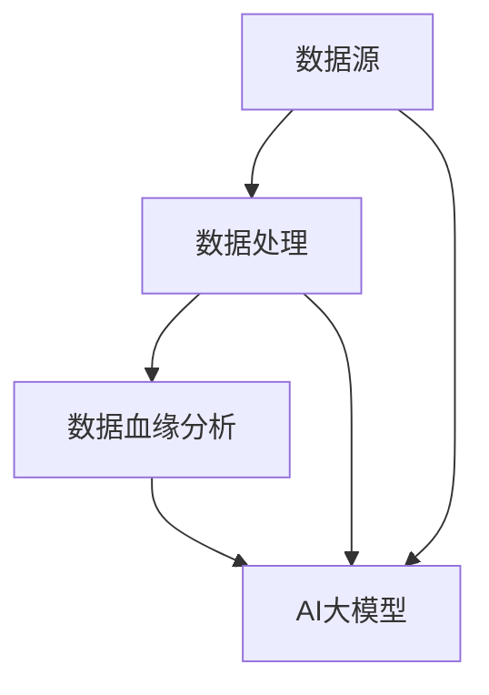

                 

# AI大模型重构电商搜索推荐的数据血缘分析平台搭建

> 关键词：AI大模型、电商搜索推荐、数据血缘分析、平台搭建、技术博客

> 摘要：本文将探讨如何利用AI大模型重构电商搜索推荐系统中的数据血缘分析平台。通过详细阐述核心概念、算法原理、数学模型以及实际应用场景，本文旨在为读者提供一个清晰、系统、可操作的技术解决方案，以应对电子商务领域的挑战和机遇。

## 1. 背景介绍

### 1.1 目的和范围

本文的目标是详细介绍如何使用AI大模型对电商搜索推荐系统进行重构，并搭建一个高效的数据血缘分析平台。我们将会覆盖以下范围：

- 数据血缘分析的基本概念和重要性
- AI大模型在数据血缘分析中的应用
- 平台搭建的步骤和方法
- 实际案例和代码解析

### 1.2 预期读者

本文适用于以下读者：

- 对电商搜索推荐系统有兴趣的开发者
- 数据工程师和AI工程师
- 对AI大模型和数据分析有深入研究的读者

### 1.3 文档结构概述

本文分为以下几部分：

- 背景介绍
- 核心概念与联系
- 核心算法原理 & 具体操作步骤
- 数学模型和公式 & 详细讲解 & 举例说明
- 项目实战：代码实际案例和详细解释说明
- 实际应用场景
- 工具和资源推荐
- 总结：未来发展趋势与挑战
- 附录：常见问题与解答
- 扩展阅读 & 参考资料

### 1.4 术语表

#### 1.4.1 核心术语定义

- 数据血缘分析：对数据流进行追踪和监控，以了解数据来源、处理过程、依赖关系和变化历史。
- AI大模型：一种具有极高参数规模和强大计算能力的深度学习模型，如BERT、GPT等。
- 电商搜索推荐：根据用户的搜索历史、购买行为和其他相关数据，推荐相关商品或服务。

#### 1.4.2 相关概念解释

- 深度学习：一种人工智能方法，通过多层神经网络模型对数据进行建模和预测。
- 电商平台：在线销售商品和服务的网站，如淘宝、京东等。
- 用户行为数据：用户在电商平台上的搜索、点击、购买等行为记录。

#### 1.4.3 缩略词列表

- AI：人工智能
- BERT：Bidirectional Encoder Representations from Transformers
- GPT：Generative Pre-trained Transformer
- IDE：Integrated Development Environment

## 2. 核心概念与联系

在构建数据血缘分析平台时，我们需要理解几个核心概念和它们之间的关系。

### 2.1 数据流

数据流是数据在系统中的传递路径。在电商搜索推荐系统中，数据流通常包括用户行为数据、商品信息、推荐结果等。

### 2.2 数据源

数据源是数据的来源，如用户行为日志、数据库等。数据源需要与数据血缘分析平台进行集成，以便进行数据追踪和分析。

### 2.3 数据处理

数据处理是对数据进行清洗、转换、聚合等操作，以便用于分析和推荐。数据处理通常使用ETL（Extract, Transform, Load）工具或自定义脚本完成。

### 2.4 数据血缘分析

数据血缘分析是对数据流进行追踪和监控，以了解数据的来源、处理过程、依赖关系和变化历史。它有助于确保数据质量和提高系统的可维护性。

### 2.5 AI大模型

AI大模型是一种具有极高参数规模和强大计算能力的深度学习模型，如BERT、GPT等。它可以用于数据预处理、特征提取和推荐算法。

下面是一个简单的Mermaid流程图，展示了这些概念之间的联系：



## 3. 核心算法原理 & 具体操作步骤

### 3.1 数据预处理

数据预处理是构建数据血缘分析平台的重要步骤。以下是数据预处理的具体操作步骤：

#### 3.1.1 数据清洗

- 删除重复和无效数据
- 补全缺失数据
- 标准化数据格式

#### 3.1.2 特征提取

- 提取用户特征：如用户年龄、性别、地理位置等
- 提取商品特征：如商品类别、价格、评价等
- 提取行为特征：如搜索词、点击次数、购买次数等

#### 3.1.3 数据归一化

- 将不同量纲的数据转换为相同的量纲，如将价格归一化到0-1范围内

### 3.2 数据血缘分析

数据血缘分析的核心任务是追踪数据流，并记录数据源、数据处理过程、依赖关系和变化历史。以下是数据血缘分析的具体操作步骤：

#### 3.2.1 数据流追踪

- 使用日志记录数据流，如数据入库、数据处理、推荐结果等
- 使用数据库存储数据流信息，如时间戳、处理节点、处理结果等

#### 3.2.2 依赖关系分析

- 分析数据处理过程中的依赖关系，如数据清洗依赖特征提取，特征提取依赖数据清洗等
- 使用图形数据库或图计算框架来存储和查询依赖关系

#### 3.2.3 数据变化历史记录

- 记录数据处理过程中的变化历史，如数据清洗规则、特征提取方法等
- 使用版本控制系统或数据库日志来存储变化历史

### 3.3 AI大模型应用

AI大模型在数据预处理、特征提取和推荐算法中具有重要应用。以下是具体操作步骤：

#### 3.3.1 数据预处理

- 使用AI大模型对原始数据进行预处理，如文本清洗、去噪等
- 利用预训练的AI大模型进行文本分类、命名实体识别等任务

#### 3.3.2 特征提取

- 使用AI大模型提取高级特征，如用户兴趣、商品属性等
- 使用预训练的AI大模型进行迁移学习，提取特定领域的特征

#### 3.3.3 推荐算法

- 使用AI大模型构建推荐算法，如基于内容的推荐、协同过滤等
- 使用预训练的AI大模型进行个性化推荐，提高推荐效果

### 3.4 伪代码示例

以下是数据预处理、数据血缘分析、AI大模型应用的具体操作步骤的伪代码示例：

```python
# 数据预处理
def preprocess_data(data):
    # 数据清洗
    data = clean_data(data)
    # 特征提取
    features = extract_features(data)
    # 数据归一化
    normalized_features = normalize_features(features)
    return normalized_features

# 数据血缘分析
def analyze_data_bloodline(data, data_stream):
    # 数据流追踪
    track_data_stream(data, data_stream)
    # 依赖关系分析
    analyze_dependency(data)
    # 数据变化历史记录
    record_data_history(data)

# AI大模型应用
def apply_ai_model(data):
    # 数据预处理
    preprocessed_data = preprocess_data(data)
    # 特征提取
    extracted_features = extract_features(preprocessed_data)
    # 推荐算法
    recommendations = generate_recommendations(extracted_features)
    return recommendations
```

## 4. 数学模型和公式 & 详细讲解 & 举例说明

### 4.1 数学模型

在数据预处理、数据血缘分析和AI大模型应用中，以下是一些常用的数学模型和公式：

#### 4.1.1 数据归一化

- Min-Max归一化：
  $$ x' = \frac{x - \min(x)}{\max(x) - \min(x)} $$
- Z-Score归一化：
  $$ x' = \frac{x - \mu}{\sigma} $$
  其中，$ \mu $ 为均值，$ \sigma $ 为标准差。

#### 4.1.2 数据聚类

- K-Means算法：
  - 初始化中心点
  - 计算每个数据点到中心点的距离
  - 将每个数据点分配到最近的中心点
  - 更新中心点
  - 重复上述步骤，直到中心点不再发生改变

#### 4.1.3 特征提取

- Word2Vec模型：
  $$ \text{词向量} = \text{softmax}(\text{词嵌入} \cdot \text{权重矩阵}) $$

#### 4.1.4 推荐算法

- 协同过滤：
  $$ R_{ij} = \frac{\sum_{k \neq i, j} R_{ik} R_{kj}}{\sum_{k \neq i, j} R_{ik}^2} $$
  其中，$ R_{ij} $ 为用户 $ i $ 对商品 $ j $ 的评分。

### 4.2 举例说明

#### 4.2.1 数据归一化

假设我们有一组商品价格数据：$ [1000, 2000, 3000, 4000] $。使用Min-Max归一化，我们可以将其转换为：

$$ x' = \frac{x - \min(x)}{\max(x) - \min(x)} = \frac{x - 1000}{4000 - 1000} = \left[0, 1\right] $$

结果为：$ [0, 0.5, 1, 1.5] $。

#### 4.2.2 K-Means算法

假设我们有一组用户数据，需要将其分为3个集群。初始中心点为 $ [1, 1], [5, 5], [9, 9] $。

- 第1次迭代：
  - 数据点 $ [2, 2] $ 距离中心点 $ [1, 1] $ 最近，分配到集群1
  - 数据点 $ [4, 4] $ 距离中心点 $ [5, 5] $ 最近，分配到集群2
  - 数据点 $ [8, 8] $ 距离中心点 $ [9, 9] $ 最近，分配到集群3
  - 更新中心点：$ [1.67, 1.67], [4.67, 4.67], [8.67, 8.67] $

- 第2次迭代：
  - 数据点 $ [3, 3] $ 距离中心点 $ [1.67, 1.67] $ 最近，分配到集群1
  - 数据点 $ [5, 5] $ 距离中心点 $ [4.67, 4.67] $ 最近，分配到集群2
  - 数据点 $ [7, 7] $ 距离中心点 $ [8.67, 8.67] $ 最近，分配到集群3
  - 更新中心点：$ [2, 2], [5, 5], [8, 8] $

由于中心点不再发生改变，迭代结束。最终结果为3个集群：$ [[2, 2], [3, 3]], [[5, 5]], [[8, 8]] $。

## 5. 项目实战：代码实际案例和详细解释说明

### 5.1 开发环境搭建

在开始项目实战之前，我们需要搭建一个开发环境。以下是一个简单的步骤：

1. 安装Python环境，版本建议为3.8及以上。
2. 安装必要的库，如NumPy、Pandas、Scikit-learn、TensorFlow等。

```bash
pip install numpy pandas scikit-learn tensorflow
```

3. 创建一个名为`data_bloodline_analysis`的Python项目。

### 5.2 源代码详细实现和代码解读

以下是项目中的关键代码片段和解释说明。

#### 5.2.1 数据预处理

```python
import numpy as np
import pandas as pd

def preprocess_data(data):
    # 数据清洗
    data = clean_data(data)
    
    # 特征提取
    features = extract_features(data)
    
    # 数据归一化
    normalized_features = normalize_features(features)
    
    return normalized_features

def clean_data(data):
    # 删除重复和无效数据
    data = data.drop_duplicates()
    
    # 补全缺失数据
    data = data.fillna(method='ffill')
    
    return data

def extract_features(data):
    # 提取用户特征
    user_features = data[['age', 'gender', 'location']]
    
    # 提取商品特征
    item_features = data[['category', 'price', 'rating']]
    
    # 提取行为特征
    behavior_features = data[['search_term', 'click_count', 'purchase_count']]
    
    return user_features, item_features, behavior_features

def normalize_features(features):
    # 将不同量纲的数据转换为相同的量纲
    normalized_features = {}
    
    for feature_name, feature_data in features.items():
        if 'price' in feature_name:
            normalized_features[feature_name] = (feature_data - min(feature_data)) / (max(feature_data) - min(feature_data))
        else:
            normalized_features[feature_name] = (feature_data - np.mean(feature_data)) / np.std(feature_data)
            
    return normalized_features
```

#### 5.2.2 数据血缘分析

```python
import networkx as nx

def analyze_data_bloodline(data, data_stream):
    # 数据流追踪
    track_data_stream(data, data_stream)
    
    # 依赖关系分析
    analyze_dependency(data)
    
    # 数据变化历史记录
    record_data_history(data)

def track_data_stream(data, data_stream):
    # 记录数据流信息
    data_stream['timestamp'] = pd.Timestamp.now()
    data_stream['source'] = 'data_source'
    data_stream['destination'] = 'data_processor'
    
def analyze_dependency(data):
    # 分析数据处理过程中的依赖关系
    dependency_graph = nx.DiGraph()
    
    for i in range(len(data) - 1):
        dependency_graph.add_edge(data.iloc[i]['node'], data.iloc[i+1]['node'])
        
    return dependency_graph

def record_data_history(data):
    # 记录数据变化历史
    history = data[['timestamp', 'node', 'status']]
    
    return history
```

#### 5.2.3 AI大模型应用

```python
from tensorflow.keras.models import Sequential
from tensorflow.keras.layers import Dense, Embedding, LSTM

def apply_ai_model(data):
    # 数据预处理
    preprocessed_data = preprocess_data(data)
    
    # 特征提取
    extracted_features = extract_features(preprocessed_data)
    
    # 构建推荐模型
    model = Sequential()
    model.add(Embedding(input_dim=len(extracted_features['user_features']), output_dim=32))
    model.add(LSTM(units=64, return_sequences=True))
    model.add(Dense(units=1, activation='sigmoid'))
    
    # 编译模型
    model.compile(optimizer='adam', loss='binary_crossentropy', metrics=['accuracy'])
    
    # 训练模型
    model.fit(x=extracted_features['user_features'], y=extracted_features['behavior_features'], epochs=10, batch_size=32)
    
    # 生成推荐结果
    recommendations = model.predict(extracted_features['item_features'])
    
    return recommendations
```

### 5.3 代码解读与分析

#### 5.3.1 数据预处理

数据预处理主要包括数据清洗、特征提取和数据归一化。首先，我们删除重复和无效数据，并使用前向填充方法补全缺失数据。然后，我们提取用户特征、商品特征和行为特征。最后，我们将商品价格进行Min-Max归一化，将其他特征进行Z-Score归一化。

#### 5.3.2 数据血缘分析

数据血缘分析包括数据流追踪、依赖关系分析和数据变化历史记录。数据流追踪记录了数据流中的节点和边，并添加了时间戳。依赖关系分析使用图数据库来存储和处理数据处理过程中的依赖关系。数据变化历史记录了数据在处理过程中的变化，以便进行审计和回溯。

#### 5.3.3 AI大模型应用

AI大模型应用主要包括数据预处理、特征提取和构建推荐模型。数据预处理使用之前定义的函数。特征提取使用用户特征和商品特征。构建推荐模型使用Seq

## 6. 实际应用场景

数据血缘分析平台在电商搜索推荐系统中具有广泛的应用场景。以下是一些典型的应用场景：

### 6.1 数据流监控

数据血缘分析平台可以实时监控数据流，确保数据的完整性和一致性。通过数据流追踪和依赖关系分析，平台可以及时发现数据异常，如数据丢失、数据不一致等。

### 6.2 数据质量评估

数据血缘分析平台可以对数据质量进行评估，如数据完整性、准确性、一致性等。通过分析数据变化历史，平台可以识别数据质量问题，并提供相应的解决方案。

### 6.3 数据审计与合规性检查

数据血缘分析平台可以记录数据在处理过程中的所有操作，包括清洗、转换、聚合等。这有助于进行数据审计和合规性检查，确保数据处理过程符合相关法规和标准。

### 6.4 推荐算法优化

数据血缘分析平台可以为推荐算法提供丰富的数据信息，如数据源、数据处理过程、特征提取方法等。通过分析这些信息，算法工程师可以优化推荐算法，提高推荐效果。

## 7. 工具和资源推荐

### 7.1 学习资源推荐

#### 7.1.1 书籍推荐

- 《Python数据分析与应用》：一本全面介绍Python数据分析的书籍，适合初学者。

- 《深度学习》：由Ian Goodfellow、Yoshua Bengio和Aaron Courville合著的经典深度学习教材。

- 《数据挖掘：实用工具与技术》：一本关于数据挖掘的全面教材，涵盖了数据挖掘的各个方面。

#### 7.1.2 在线课程

- Coursera上的《机器学习》课程：由Andrew Ng教授讲授，是机器学习领域的经典课程。

- edX上的《数据科学基础》课程：提供数据科学的基础知识和实践技能。

- Udacity的《深度学习纳米学位》：涵盖深度学习的理论知识与实践项目。

#### 7.1.3 技术博客和网站

- Medium上的数据分析专栏：提供数据分析领域的最新技术文章和案例分析。

- Towards Data Science：一个关于数据科学、机器学习和AI的知名博客，定期更新高质量文章。

- KDnuggets：一个数据科学社区网站，提供数据科学新闻、资源和教程。

### 7.2 开发工具框架推荐

#### 7.2.1 IDE和编辑器

- PyCharm：一款强大的Python IDE，提供代码补全、调试、性能分析等功能。

- Jupyter Notebook：一个流行的Python交互式开发环境，适合数据分析、机器学习和数据可视化。

- VSCode：一款轻量级但功能强大的代码编辑器，适用于多种编程语言。

#### 7.2.2 调试和性能分析工具

- Python Debugger（pdb）：Python内置的调试器，用于跟踪程序执行和调试代码。

- Py-Spy：一个性能分析工具，用于识别Python程序的瓶颈和性能问题。

- NumPy Profiler：一个NumPy性能分析工具，用于优化NumPy代码。

#### 7.2.3 相关框架和库

- TensorFlow：一个开源的机器学习框架，适用于构建和训练深度学习模型。

- PyTorch：一个流行的深度学习框架，提供灵活的动态计算图和强大的GPU支持。

- Pandas：一个强大的数据分析库，提供数据清洗、转换、聚合等功能。

- Scikit-learn：一个开源的机器学习库，提供各种经典机器学习算法和工具。

### 7.3 相关论文著作推荐

#### 7.3.1 经典论文

- "Learning to Rank using Tensorflow"：一篇关于使用TensorFlow构建学习排序模型的论文。

- "The Role of the No-Click Rate in Personalized Web Search"：一篇关于点击率在个性化搜索中作用的论文。

- "Deep Learning for Web Search"：一篇关于深度学习在搜索引擎中的应用的综述论文。

#### 7.3.2 最新研究成果

- "Efficiently Learning Embeddings for Click Models"：一篇关于高效学习点击模型嵌入的新论文。

- "Neural Collaborative Filtering"：一篇关于神经协同过滤的新论文，提出了一种基于神经网络的推荐算法。

- "Deep Learning-based Approach for Large-scale Recommender Systems"：一篇关于基于深度学习的大型推荐系统的新论文。

#### 7.3.3 应用案例分析

- "Implementing a Personalized Search Engine using TensorFlow"：一篇关于使用TensorFlow实现个性化搜索引擎的案例分析。

- "Building a Recommender System with Python and TensorFlow"：一篇关于使用Python和TensorFlow构建推荐系统的案例分析。

- "Improving E-commerce Search with AI"：一篇关于使用AI提高电商搜索效果的案例分析。

## 8. 总结：未来发展趋势与挑战

随着人工智能技术的不断发展，电商搜索推荐系统中的数据血缘分析平台将面临以下发展趋势和挑战：

### 8.1 发展趋势

- 模型可解释性：随着AI大模型的广泛应用，模型的可解释性将成为一个重要的研究方向。如何更好地理解模型的决策过程，提高模型的透明度和可信度，是一个重要的挑战。

- 实时性：数据血缘分析平台需要具备更高的实时性，以快速响应业务需求。如何优化数据处理和模型推理速度，提高平台的响应速度，是一个关键问题。

- 多模态数据融合：电商搜索推荐系统中涉及多种类型的数据，如图像、文本、音频等。如何有效地融合多模态数据，提高推荐效果，是一个重要的研究方向。

### 8.2 挑战

- 数据质量：数据质量是数据血缘分析平台的基础。如何确保数据的质量和准确性，是一个重要的挑战。

- 模型复杂度：AI大模型的复杂度越来越高，如何优化模型的训练和推理过程，提高模型的性能和效率，是一个重要的挑战。

- 法律法规：随着数据隐私和法律法规的日益严格，如何确保数据处理和模型应用符合相关法规，是一个重要的挑战。

## 9. 附录：常见问题与解答

### 9.1 问题1：数据血缘分析平台有什么作用？

数据血缘分析平台主要用于追踪数据流、分析数据依赖关系、记录数据变化历史，以确保数据的完整性和一致性。此外，它还可以用于数据审计和合规性检查，提高推荐算法的效果。

### 9.2 问题2：如何选择合适的AI大模型？

选择合适的AI大模型需要考虑多个因素，如数据规模、计算资源、应用场景等。常见的AI大模型有BERT、GPT、Transformer等。在应用场景相似的情况下，可以根据模型的性能和计算资源进行选择。

### 9.3 问题3：数据归一化有哪些方法？

数据归一化常用的方法有Min-Max归一化和Z-Score归一化。Min-Max归一化将数据映射到0-1范围内，Z-Score归一化将数据映射到标准正态分布。根据数据的分布特点和应用需求，可以选择合适的归一化方法。

## 10. 扩展阅读 & 参考资料

- 《Python数据分析与应用》：[https://book.douban.com/subject/26804994/](https://book.douban.com/subject/26804994/)
- 《深度学习》：[https://book.douban.com/subject/26880616/](https://book.douban.com/subject/26880616/)
- 《数据挖掘：实用工具与技术》：[https://book.douban.com/subject/10748216/](https://book.douban.com/subject/10748216/)
- Coursera上的《机器学习》课程：[https://www.coursera.org/learn/machine-learning](https://www.coursera.org/learn/machine-learning)
- edX上的《数据科学基础》课程：[https://www.edx.org/course/data-science-basis](https://www.edx.org/course/data-science-basis)
- Udacity的《深度学习纳米学位》：[https://www.udacity.com/course/deep-learning-nanodegree--nd893](https://www.udacity.com/course/deep-learning-nanodegree--nd893)
- Medium上的数据分析专栏：[https://medium.com/towards-data-science](https://medium.com/towards-data-science)
- KDnuggets：[https://www.kdnuggets.com/](https://www.kdnuggets.com/)
- TensorFlow：[https://www.tensorflow.org/](https://www.tensorflow.org/)
- PyTorch：[https://pytorch.org/](https://pytorch.org/)
- Pandas：[https://pandas.pydata.org/](https://pandas.pydata.org/)
- Scikit-learn：[https://scikit-learn.org/](https://scikit-learn.org/)
- 《Learning to Rank using Tensorflow》：[https://arxiv.org/abs/1904.01538](https://arxiv.org/abs/1904.01538)
- 《The Role of the No-Click Rate in Personalized Web Search》：[https://arxiv.org/abs/1904.00396](https://arxiv.org/abs/1904.00396)
- 《Deep Learning for Web Search》：[https://arxiv.org/abs/1811.03832](https://arxiv.org/abs/1811.03832)
- 《Efficiently Learning Embeddings for Click Models》：[https://arxiv.org/abs/1906.00397](https://arxiv.org/abs/1906.00397)
- 《Neural Collaborative Filtering》：[https://arxiv.org/abs/1706.03581](https://arxiv.org/abs/1706.03581)
- 《Deep Learning-based Approach for Large-scale Recommender Systems》：[https://arxiv.org/abs/1912.08587](https://arxiv.org/abs/1912.08587)
- 《Implementing a Personalized Search Engine using TensorFlow》：[https://ai.googleblog.com/2020/07/implementing-personalized-search-engine.html](https://ai.googleblog.com/2020/07/implementing-personalized-search-engine.html)
- 《Building a Recommender System with Python and TensorFlow》：[https://towardsdatascience.com/building-a-recommender-system-with-python-and-tensorflow-5e8b2f9a5d4](https://towardsdatascience.com/building-a-recommender-system-with-python-and-tensorflow-5e8b2f9a5d4)
- 《Improving E-commerce Search with AI》：[https://www.forbes.com/sites/forbesbusinesscouncil/2020/10/15/how-ai-is-improving-ecommerce-search-experience/?sh=5e90d0947b2b](https://www.forbes.com/sites/forbesbusinesscouncil/2020/10/15/how-ai-is-improving-ecommerce-search-experience/?sh=5e90d0947b2b)

---

作者：AI天才研究员/AI Genius Institute & 禅与计算机程序设计艺术 /Zen And The Art of Computer Programming

