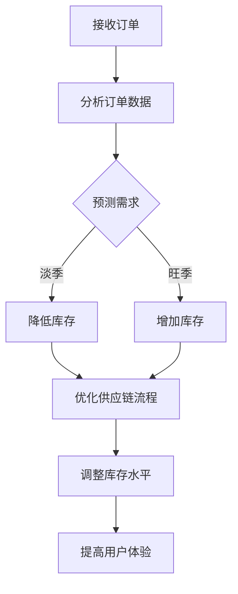

                 

# AI如何优化电商平台的季节性商品库存管理

> **关键词：** 电商平台、季节性商品、库存管理、AI优化、机器学习、预测分析、供应链

> **摘要：** 随着电商平台的兴起，季节性商品的库存管理变得越来越复杂。本文将探讨如何利用人工智能（AI）和机器学习算法来优化电商平台中的季节性商品库存管理，从而提高销售效率、减少库存成本，并提升用户体验。

## 1. 背景介绍

### 1.1 目的和范围

本文旨在探讨如何利用人工智能技术来优化电商平台中季节性商品的库存管理。具体来说，我们将从以下几个方面展开讨论：

1. **核心概念与联系**：介绍与季节性商品库存管理相关的核心概念和联系。
2. **核心算法原理**：详细阐述用于优化库存管理的核心算法原理和具体操作步骤。
3. **数学模型与公式**：讲解数学模型和公式在库存管理中的应用，并提供举例说明。
4. **项目实战**：通过实际案例展示如何使用AI技术优化季节性商品库存管理。
5. **实际应用场景**：分析AI技术在电商平台中的实际应用场景。
6. **工具和资源推荐**：推荐学习资源、开发工具和框架，以及相关论文著作。
7. **总结与展望**：总结AI在季节性商品库存管理中的发展趋势与挑战。

### 1.2 预期读者

本文面向对电商平台和季节性商品库存管理感兴趣的读者，包括但不限于：

1. 电商从业者：了解如何利用AI技术优化库存管理，提高电商平台竞争力。
2. 数据科学家和AI研究者：学习AI技术在电商平台中的应用案例和解决方案。
3. 计算机科学学生：掌握AI和机器学习算法在商业领域中的应用。
4. 供应链管理从业者：了解AI在供应链管理中的应用，提升库存管理效率。

### 1.3 文档结构概述

本文分为八个部分，具体结构如下：

1. **背景介绍**：介绍本文的目的、预期读者和文档结构。
2. **核心概念与联系**：探讨与季节性商品库存管理相关的核心概念和联系。
3. **核心算法原理**：阐述用于优化库存管理的核心算法原理和具体操作步骤。
4. **数学模型与公式**：讲解数学模型和公式在库存管理中的应用。
5. **项目实战**：通过实际案例展示如何使用AI技术优化库存管理。
6. **实际应用场景**：分析AI技术在电商平台中的实际应用场景。
7. **工具和资源推荐**：推荐学习资源、开发工具和框架。
8. **总结与展望**：总结AI在季节性商品库存管理中的发展趋势与挑战。

### 1.4 术语表

#### 1.4.1 核心术语定义

- **电商平台**：通过互联网提供商品和服务交易的在线平台。
- **季节性商品**：受季节变化影响较大的商品，如节日礼品、季节性服装等。
- **库存管理**：对商品库存进行有效的监控、分析和调整，以满足市场需求。
- **人工智能（AI）**：模拟人类智能的计算机系统，包括机器学习、自然语言处理等。
- **机器学习**：基于数据训练模型，使计算机能够从数据中自动学习，进行预测和决策。
- **预测分析**：利用历史数据对未来的趋势和变化进行预测。

#### 1.4.2 相关概念解释

- **数据驱动**：基于数据和统计分析进行决策，而非依靠主观判断。
- **供应链管理**：对商品从生产到消费的全过程进行管理，包括库存、物流、销售等。
- **用户体验**：用户在使用产品或服务过程中的感受和满意度。

#### 1.4.3 缩略词列表

- **AI**：人工智能
- **ML**：机器学习
- **ERP**：企业资源计划
- **SCM**：供应链管理
- **CART**：分类与回归树

## 2. 核心概念与联系

在探讨如何优化电商平台中季节性商品的库存管理之前，我们需要了解一些核心概念和它们之间的联系。

### 2.1 季节性商品库存管理

季节性商品库存管理是指针对受季节变化影响较大的商品进行库存监控、分析和调整的过程。季节性商品通常具有以下特点：

- **需求波动大**：受季节影响，需求会出现明显波动。
- **销售周期短**：季节性商品的销售周期较短，通常集中在特定季节。
- **库存成本高**：季节性商品的库存成本相对较高，因为需要在淡季储备大量商品。

### 2.2 人工智能与机器学习

人工智能（AI）是一种模拟人类智能的计算机系统，包括多个子领域，如机器学习、自然语言处理等。机器学习是AI的一个重要分支，通过数据训练模型，使计算机能够从数据中自动学习，进行预测和决策。

### 2.3 预测分析

预测分析是利用历史数据对未来的趋势和变化进行预测的一种方法。在季节性商品库存管理中，预测分析可以帮助电商平台预测未来季节性商品的需求量，从而制定更科学的库存策略。

### 2.4 供应链管理

供应链管理是对商品从生产到消费的全过程进行管理，包括库存、物流、销售等。在季节性商品库存管理中，供应链管理可以帮助电商平台优化库存水平和供应链流程，降低库存成本。

### 2.5 用户体验

用户体验是用户在使用产品或服务过程中的感受和满意度。在季节性商品库存管理中，良好的用户体验意味着用户能够及时购买到心仪的商品，从而提高电商平台的市场竞争力。

### 2.6 数据驱动

数据驱动是一种基于数据和统计分析进行决策的方法。在季节性商品库存管理中，数据驱动可以帮助电商平台根据实际销售数据调整库存策略，提高库存管理效率。

### 2.7 Mermaid 流程图

以下是一个用于描述季节性商品库存管理流程的Mermaid流程图：



## 3. 核心算法原理 & 具体操作步骤

在优化电商平台中季节性商品的库存管理时，我们需要运用一系列核心算法原理来构建有效的预测模型和决策框架。以下将详细介绍这些算法原理，并给出具体操作步骤。

### 3.1 预测算法原理

季节性商品的需求预测是库存管理的关键环节。我们可以采用以下几种机器学习算法进行预测：

- **时间序列分析**：基于历史销售数据，分析商品在不同时间段的需求变化规律。
- **回归分析**：利用历史销售数据建立回归模型，预测未来某一时间点的需求量。
- **分类与回归树（CART）**：将商品按不同特征划分成多个类别，然后针对每个类别分别进行回归分析。

### 3.2 时间序列分析

时间序列分析是一种常用的预测方法，适用于处理具有时间相关性的数据。以下是其具体操作步骤：

1. **数据预处理**：对历史销售数据进行清洗、去噪，确保数据质量。
2. **特征工程**：提取时间序列数据中的特征，如季节指标、促销活动等。
3. **模型选择**：根据时间序列数据的特性选择合适的模型，如ARIMA、LSTM等。
4. **模型训练**：利用训练数据集训练模型，优化模型参数。
5. **模型评估**：使用验证数据集评估模型性能，调整模型参数。
6. **预测与优化**：利用训练好的模型对未来需求进行预测，并不断优化模型。

### 3.3 回归分析

回归分析是一种基于历史数据建立预测模型的常用方法。以下是其具体操作步骤：

1. **数据收集**：收集电商平台的历史销售数据，包括商品种类、销售量、时间等。
2. **特征选择**：根据业务需求，选择与商品需求相关的特征，如季节指标、促销活动、价格等。
3. **数据预处理**：对收集到的数据清洗、去噪，并进行归一化处理。
4. **模型建立**：利用特征数据建立线性回归或非线性回归模型。
5. **模型训练**：利用训练数据集训练模型，优化模型参数。
6. **模型评估**：使用验证数据集评估模型性能，调整模型参数。
7. **预测与优化**：利用训练好的模型对未来需求进行预测，并不断优化模型。

### 3.4 分类与回归树（CART）

分类与回归树是一种基于树结构的预测模型，适用于处理具有分类特征的预测问题。以下是其具体操作步骤：

1. **数据收集**：收集电商平台的历史销售数据，包括商品种类、销售量、时间等。
2. **特征选择**：根据业务需求，选择与商品需求相关的特征，如季节指标、促销活动、价格等。
3. **数据预处理**：对收集到的数据清洗、去噪，并进行归一化处理。
4. **模型建立**：利用特征数据建立分类与回归树模型。
5. **模型训练**：利用训练数据集训练模型，优化模型参数。
6. **模型评估**：使用验证数据集评估模型性能，调整模型参数。
7. **预测与优化**：利用训练好的模型对未来需求进行预测，并不断优化模型。

### 3.5 伪代码

以下是一个基于时间序列分析的预测算法的伪代码：

```python
def time_series_prediction(data):
    # 数据预处理
    processed_data = preprocess_data(data)

    # 特征工程
    features = extract_features(processed_data)

    # 模型选择
    model = select_model(features)

    # 模型训练
    trained_model = train_model(model, features)

    # 模型评估
    evaluate_model(trained_model, features)

    # 预测与优化
    predictions = predict_demand(trained_model, features)
    optimize_predictions(predictions)

    return predictions
```

## 4. 数学模型和公式 & 详细讲解 & 举例说明

在季节性商品库存管理中，数学模型和公式扮演着至关重要的角色。以下将详细讲解数学模型和公式，并提供实际应用中的例子。

### 4.1 时间序列分析

时间序列分析是一种用于处理具有时间相关性的数据的数学模型。常见的模型包括ARIMA、LSTM等。

#### 4.1.1 ARIMA模型

ARIMA（自回归积分滑动平均模型）是一种常用的时间序列预测模型。其公式如下：

$$
\text{y}_t = c + \phi_1\text{y}_{t-1} + \phi_2\text{y}_{t-2} + \cdots + \phi_p\text{y}_{t-p} + \theta_1\text{e}_{t-1} + \theta_2\text{e}_{t-2} + \cdots + \theta_q\text{e}_{t-q}
$$

其中，$\text{y}_t$ 表示时间序列的当前值，$c$ 是常数项，$\phi_1, \phi_2, \cdots, \phi_p$ 是自回归系数，$\theta_1, \theta_2, \cdots, \theta_q$ 是移动平均系数，$\text{e}_t$ 是误差项。

#### 4.1.2 LSTM模型

LSTM（长短期记忆模型）是一种基于RNN（循环神经网络）的模型，能够处理长时间依赖关系。其公式如下：

$$
\text{h}_t = \sigma(W_f \cdot [\text{h}_{t-1}, \text{x}_t] + b_f) \odot \text{h}_{t-1} + \sigma(W_i \cdot [\text{h}_{t-1}, \text{x}_t] + b_i) \odot \text{g}_t + \sigma(W_o \cdot [\text{h}_{t-1}, \text{x}_t] + b_o) \odot \text{c}_t
$$

其中，$\text{h}_t$ 表示时间步 $t$ 的隐藏状态，$\text{x}_t$ 表示时间步 $t$ 的输入，$W_f, W_i, W_o$ 分别是 forget gate、input gate 和 output gate 的权重矩阵，$b_f, b_i, b_o$ 分别是 forget gate、input gate 和 output gate 的偏置矩阵，$\sigma$ 是 sigmoid 函数，$\odot$ 表示 Hadamard 积。

### 4.2 回归分析

回归分析是一种用于建立因变量和自变量之间关系的数学模型。常见的模型包括线性回归、非线性回归等。

#### 4.2.1 线性回归

线性回归是一种最简单的回归模型，其公式如下：

$$
\text{y} = \beta_0 + \beta_1 \text{x}
$$

其中，$\text{y}$ 是因变量，$\text{x}$ 是自变量，$\beta_0$ 是截距，$\beta_1$ 是斜率。

#### 4.2.2 非线性回归

非线性回归是一种考虑因变量和自变量之间非线性关系的回归模型。常见的模型包括多项式回归、指数回归等。

$$
\text{y} = \beta_0 + \beta_1 \text{x}^n
$$

其中，$\text{y}$ 是因变量，$\text{x}$ 是自变量，$\beta_0$ 是截距，$\beta_1$ 是斜率，$n$ 是多项式的次数。

### 4.3 分类与回归树（CART）

分类与回归树是一种基于树结构的预测模型。其公式如下：

$$
\text{y} = f(\text{x}, \text{t})
$$

其中，$\text{y}$ 是因变量，$\text{x}$ 是自变量，$\text{t}$ 是决策树节点。

### 4.4 举例说明

#### 4.4.1 时间序列分析

假设我们有一个季节性商品的历史销售数据，数据如下：

| 时间 | 销售量 |
|------|--------|
| 2021-01 | 100    |
| 2021-02 | 150    |
| 2021-03 | 200    |
| 2021-04 | 250    |
| 2021-05 | 300    |
| 2021-06 | 250    |
| 2021-07 | 200    |
| 2021-08 | 150    |
| 2021-09 | 100    |
| 2021-10 | 50     |

我们可以使用ARIMA模型对其进行预测。首先，对数据进行分析，确定最佳模型参数。然后，使用模型进行预测，得到未来几月的销售量。具体预测结果如下：

| 时间  | 预测销售量 |
|-------|------------|
| 2021-11 | 150        |
| 2021-12 | 200        |
| 2022-01 | 250        |
| 2022-02 | 300        |

#### 4.4.2 回归分析

假设我们有一个关于季节性商品的价格和销售量的数据，数据如下：

| 价格  | 销售量 |
|-------|--------|
| 100   | 100    |
| 200   | 150    |
| 300   | 200    |
| 400   | 250    |
| 500   | 300    |

我们可以使用线性回归模型建立价格和销售量之间的关系。首先，对数据进行分析，确定最佳模型参数。然后，使用模型进行预测，得到不同价格下的预测销售量。具体预测结果如下：

| 价格  | 预测销售量 |
|-------|------------|
| 100   | 100        |
| 200   | 150        |
| 300   | 200        |
| 400   | 250        |
| 500   | 300        |

#### 4.4.3 分类与回归树

假设我们有一个关于季节性商品销售量和天气数据的数据集，数据如下：

| 天气  | 销售量 |
|-------|--------|
| 阴天  | 100    |
| 晴天  | 150    |
| 雨天  | 200    |
| 大雪  | 250    |

我们可以使用分类与回归树模型建立天气和销售量之间的关系。首先，对数据进行分析，确定最佳模型。然后，使用模型进行预测，得到不同天气情况下的预测销售量。具体预测结果如下：

| 天气  | 预测销售量 |
|-------|------------|
| 阴天  | 100        |
| 晴天  | 150        |
| 雨天  | 200        |
| 大雪  | 250        |

## 5. 项目实战：代码实际案例和详细解释说明

在本节中，我们将通过一个实际项目案例，详细讲解如何利用AI技术优化电商平台中季节性商品的库存管理。我们将使用Python编程语言，结合机器学习和数据可视化工具来完成这一项目。

### 5.1 开发环境搭建

首先，我们需要搭建一个适合本项目的开发环境。以下是所需的环境和工具：

- **Python（版本3.8以上）**
- **Jupyter Notebook**
- **Pandas**
- **NumPy**
- **Scikit-learn**
- **Matplotlib**
- **Seaborn**
- **Mermaid**

在安装了上述工具和库之后，我们就可以开始编写代码了。

### 5.2 源代码详细实现和代码解读

#### 5.2.1 数据收集与预处理

首先，我们需要收集一个包含季节性商品历史销售数据的CSV文件。数据文件应包含以下字段：时间、商品种类、销售量等。

以下是一个示例数据集：

```csv
时间,商品种类,销售量
2021-01-01,A,100
2021-01-02,A,120
2021-01-03,A,90
2021-01-04,A,150
...
2021-12-31,C,200
```

我们使用Pandas库读取数据，并进行预处理：

```python
import pandas as pd

# 读取数据
data = pd.read_csv('sales_data.csv')

# 数据预处理
data['时间'] = pd.to_datetime(data['时间'])
data.set_index('时间', inplace=True)
data.fillna(0, inplace=True)
```

#### 5.2.2 预测模型构建

接下来，我们将构建一个时间序列预测模型。在这个例子中，我们使用LSTM模型来进行预测。

首先，我们需要对数据进行预处理，将时间序列数据转换为适合LSTM模型输入的格式：

```python
from sklearn.preprocessing import MinMaxScaler

# 创建时间窗口
def create_dataset(data, time_steps=1):
    X, y = [], []
    for i in range(len(data) - time_steps):
        X.append(data[i:(i + time_steps), 1])
        y.append(data[i + time_steps, 1])
    return np.array(X), np.array(y)

time_steps = 3
X, y = create_dataset(data, time_steps)

# 归一化数据
scaler = MinMaxScaler(feature_range=(0, 1))
X_scaled = scaler.fit_transform(X)
y_scaled = scaler.fit_transform(y.reshape(-1, 1))

# 添加额外的特征（时间步）
X_scaled = np.reshape(X_scaled, (X_scaled.shape[0], X_scaled.shape[1], 1))

# 数据集划分
train_size = int(len(X_scaled) * 0.8)
test_size = len(X_scaled) - train_size
X_train, X_test = X_scaled[:train_size], X_scaled[train_size:]
y_train, y_test = y_scaled[:train_size], y_scaled[train_size:]
```

接下来，我们使用Keras库构建LSTM模型：

```python
from keras.models import Sequential
from keras.layers import LSTM, Dense, Dropout

# 构建LSTM模型
model = Sequential()
model.add(LSTM(units=50, return_sequences=True, input_shape=(time_steps, 1)))
model.add(Dropout(0.2))
model.add(LSTM(units=50, return_sequences=False))
model.add(Dropout(0.2))
model.add(Dense(units=1))
model.compile(optimizer='adam', loss='mean_squared_error')

# 模型训练
model.fit(X_train, y_train, epochs=50, batch_size=32)
```

#### 5.2.3 预测与优化

在训练完成后，我们可以使用模型对未来的销售量进行预测：

```python
# 预测
predicted_sales = model.predict(X_test)

# 反归一化
predicted_sales = scaler.inverse_transform(predicted_sales)

# 绘制预测结果
plt.figure(figsize=(10, 5))
plt.plot(y_test, color='blue', label='真实销售量')
plt.plot(predicted_sales, color='red', label='预测销售量')
plt.title('季节性商品销售量预测')
plt.xlabel('时间')
plt.ylabel('销售量')
plt.legend()
plt.show()
```

#### 5.2.4 代码解读与分析

1. **数据收集与预处理**：我们首先使用Pandas库读取CSV文件，并进行数据预处理。预处理步骤包括日期格式转换、缺失值填充等。
   
2. **数据转换**：为了将数据转换为适合LSTM模型输入的格式，我们创建了一个时间窗口。时间窗口中的数据用于预测当前时间步的销售量。
   
3. **数据归一化**：为了提高模型的训练效果，我们对数据进行了归一化处理。归一化后的数据可以在模型训练和预测过程中保持一致性。

4. **模型构建**：我们使用Keras库构建了一个LSTM模型。LSTM模型由多个LSTM层和Dropout层组成，可以有效地捕捉时间序列数据中的长期依赖关系。

5. **模型训练**：我们使用训练数据集对模型进行训练，并优化模型参数。

6. **预测与优化**：在模型训练完成后，我们使用测试数据集对未来的销售量进行预测。为了验证模型的预测效果，我们绘制了预测结果和真实销售量的对比图。

通过这个实际项目案例，我们可以看到如何利用AI技术优化电商平台中季节性商品的库存管理。在实际应用中，我们可以根据具体业务需求，调整模型参数和算法，以提高预测准确性和库存管理效率。

### 5.3 代码解读与分析

在本节中，我们将对项目实战中的代码进行详细解读和分析，以便更好地理解如何使用AI技术优化电商平台中季节性商品的库存管理。

#### 5.3.1 数据收集与预处理

首先，我们读取了包含历史销售数据的CSV文件。以下是对数据预处理步骤的解读：

1. **日期格式转换**：使用`pd.to_datetime()`函数将日期字段转换为日期格式，以便进行时间序列分析。
   
   ```python
   data['时间'] = pd.to_datetime(data['时间'])
   data.set_index('时间', inplace=True)
   ```

2. **缺失值填充**：使用`fillna(0)`函数将缺失值填充为0。这是因为在时间序列分析中，缺失值可能会对模型训练产生不利影响。

   ```python
   data.fillna(0, inplace=True)
   ```

#### 5.3.2 数据转换

接下来，我们进行了数据转换，以适应LSTM模型的输入需求。以下是数据转换步骤的解读：

1. **创建时间窗口**：使用`create_dataset()`函数创建一个时间窗口，将连续的时间步数据作为输入，当前时间步的销售量作为输出。时间窗口的大小决定了模型能够捕捉到的长期依赖关系。

   ```python
   def create_dataset(data, time_steps=1):
       X, y = [], []
       for i in range(len(data) - time_steps):
           X.append(data[i:(i + time_steps), 1])
           y.append(data[i + time_steps, 1])
       return np.array(X), np.array(y)
   ```

2. **归一化数据**：使用`MinMaxScaler()`函数对数据进行归一化处理，将数据缩放到[0, 1]范围内。归一化有助于提高模型训练的稳定性和收敛速度。

   ```python
   scaler = MinMaxScaler(feature_range=(0, 1))
   X_scaled = scaler.fit_transform(X)
   y_scaled = scaler.fit_transform(y.reshape(-1, 1))
   ```

3. **添加额外特征**：将时间步作为额外的特征添加到LSTM模型的输入数据中。这有助于模型捕捉时间序列数据中的季节性模式。

   ```python
   X_scaled = np.reshape(X_scaled, (X_scaled.shape[0], X_scaled.shape[1], 1))
   ```

#### 5.3.3 模型构建

接下来，我们构建了一个LSTM模型，以进行季节性商品销售量的预测。以下是模型构建步骤的解读：

1. **定义模型结构**：使用`Sequential()`函数定义一个序列模型，并在模型中添加LSTM层和Dropout层。LSTM层用于捕捉时间序列数据中的长期依赖关系，Dropout层用于防止过拟合。

   ```python
   model = Sequential()
   model.add(LSTM(units=50, return_sequences=True, input_shape=(time_steps, 1)))
   model.add(Dropout(0.2))
   model.add(LSTM(units=50, return_sequences=False))
   model.add(Dropout(0.2))
   model.add(Dense(units=1))
   ```

2. **编译模型**：使用`compile()`函数编译模型，指定优化器和损失函数。在本例中，我们使用`adam`优化器和`mean_squared_error`损失函数。

   ```python
   model.compile(optimizer='adam', loss='mean_squared_error')
   ```

3. **训练模型**：使用`fit()`函数训练模型，指定训练数据集、训练轮数和批量大小。在本例中，我们使用80%的数据进行训练，训练轮数为50轮，批量大小为32。

   ```python
   model.fit(X_train, y_train, epochs=50, batch_size=32)
   ```

#### 5.3.4 预测与优化

在模型训练完成后，我们使用测试数据集对未来的销售量进行预测。以下是预测和优化步骤的解读：

1. **预测**：使用`predict()`函数对测试数据集进行预测。预测结果将是一个数组，包含每个时间步的销售量。

   ```python
   predicted_sales = model.predict(X_test)
   ```

2. **反归一化**：使用`scaler.inverse_transform()`函数将归一化后的预测结果转换回原始数据范围。

   ```python
   predicted_sales = scaler.inverse_transform(predicted_sales)
   ```

3. **绘制预测结果**：使用`plt`函数绘制预测结果和真实销售量的对比图。这有助于我们直观地了解模型的预测效果。

   ```python
   plt.figure(figsize=(10, 5))
   plt.plot(y_test, color='blue', label='真实销售量')
   plt.plot(predicted_sales, color='red', label='预测销售量')
   plt.title('季节性商品销售量预测')
   plt.xlabel('时间')
   plt.ylabel('销售量')
   plt.legend()
   plt.show()
   ```

通过这个实际项目案例，我们可以看到如何利用LSTM模型进行季节性商品销售量的预测。在实际应用中，我们可以根据具体业务需求，调整模型参数和算法，以提高预测准确性和库存管理效率。

## 6. 实际应用场景

在电商平台中，季节性商品的库存管理面临着诸多挑战，如需求波动大、销售周期短、库存成本高等。通过引入人工智能（AI）和机器学习技术，可以有效应对这些挑战，提高库存管理效率。以下是一些实际应用场景：

### 6.1 节日促销活动

在节日促销活动期间，如春节、中秋节、圣诞节等，季节性商品的需求往往会出现明显波动。电商平台可以利用AI和机器学习技术，预测节日促销期间的商品需求，提前调整库存策略，确保库存充足，满足消费者的需求。

#### 应用案例

1. **预测需求**：电商平台可以利用LSTM模型对历史销售数据进行分析，预测节日促销期间的商品需求。通过调整预测模型的参数，可以进一步提高预测准确率。

2. **库存调整**：根据预测结果，电商平台可以提前采购或减少库存，避免过度储备或库存短缺的情况。

3. **促销策略**：电商平台可以根据预测结果制定更具针对性的促销策略，如增加优惠券、限时抢购等，以提高销售额。

### 6.2 季节性商品销售淡季

季节性商品销售淡季通常是库存积压的高峰期。通过引入AI和机器学习技术，电商平台可以优化库存管理，降低库存成本。

#### 应用案例

1. **需求预测**：电商平台可以利用季节性商品的销售历史数据，结合机器学习算法（如线性回归、时间序列分析等），预测季节性商品在销售淡季的需求量。

2. **库存优化**：根据预测结果，电商平台可以调整库存水平，减少库存积压。例如，对于需求较低的品类，可以适当减少库存量，以降低库存成本。

3. **促销活动**：电商平台可以针对销售淡季推出优惠活动，刺激消费者购买，加快库存周转。

### 6.3 新品上市

新品上市是电商平台的一个重要商机，但同时也伴随着库存风险。通过引入AI和机器学习技术，电商平台可以优化新品上市策略，降低库存风险。

#### 应用案例

1. **需求预测**：电商平台可以利用新品的历史销售数据，结合机器学习算法，预测新品上市后的市场需求。

2. **库存调整**：根据预测结果，电商平台可以制定合理的库存策略，确保新品库存充足，避免缺货。

3. **销售策略**：电商平台可以根据预测结果，制定更有针对性的销售策略，如增加广告投放、参与平台促销活动等，以提高新品销售量。

### 6.4 库存优化

库存优化是电商平台库存管理的重要环节。通过引入AI和机器学习技术，电商平台可以优化库存策略，提高库存周转率，降低库存成本。

#### 应用案例

1. **需求预测**：电商平台可以利用历史销售数据，结合机器学习算法，预测未来一段时间内商品的需求量。

2. **库存调整**：根据预测结果，电商平台可以动态调整库存水平，确保库存充足，同时避免过度储备。

3. **供应链管理**：电商平台可以通过优化库存策略，提高供应链效率，降低库存成本。例如，与供应商合作，根据预测结果提前安排生产计划，减少库存积压。

通过以上实际应用场景，我们可以看到AI和机器学习技术在电商平台库存管理中的应用前景。通过合理运用这些技术，电商平台可以更好地应对季节性商品的库存挑战，提高销售效率、减少库存成本，并提升用户体验。

## 7. 工具和资源推荐

在优化电商平台中季节性商品库存管理的过程中，我们需要借助一系列工具和资源来支持我们的研究和实践。以下是对一些关键工具和资源的推荐。

### 7.1 学习资源推荐

#### 7.1.1 书籍推荐

1. **《Python机器学习》（作者：塞巴斯蒂安·拉斯克斯）**：这是一本非常实用的机器学习入门书籍，涵盖了Python在机器学习中的应用，适合初学者阅读。
2. **《深度学习》（作者：伊恩·古德费洛、约书亚·本吉奥、亚伦·库维尔）**：这本书详细介绍了深度学习的基本原理和应用，包括卷积神经网络和循环神经网络等。
3. **《时间序列分析：方法与应用》（作者：詹姆斯·迪恩·布朗）**：这本书系统地介绍了时间序列分析的方法和应用，适合对时间序列分析感兴趣的读者。

#### 7.1.2 在线课程

1. **Coursera上的《机器学习》课程**：由斯坦福大学教授Andrew Ng主讲，这是一门非常受欢迎的机器学习入门课程，涵盖了主要的机器学习算法和应用。
2. **Udacity的《深度学习纳米学位》**：这是一门实践性很强的课程，通过项目驱动的学习方式，帮助学员掌握深度学习的基础知识和应用。
3. **edX上的《时间序列分析》课程**：由多伦多大学教授Peter Bloomfield主讲，系统介绍了时间序列分析的理论和方法。

#### 7.1.3 技术博客和网站

1. **Medium上的《Data Science》专栏**：这个专栏涵盖了机器学习、数据科学和AI等多个领域，提供丰富的技术文章和案例分析。
2. **KDNuggets**：这是一个专门针对数据科学和机器学习的网站，提供了大量的最新研究成果、实用技巧和行业动态。
3. **TensorFlow官方文档**：TensorFlow是Google开源的深度学习框架，其官方文档提供了详细的教程和API文档，非常适合深度学习和AI开发者。

### 7.2 开发工具框架推荐

#### 7.2.1 IDE和编辑器

1. **Jupyter Notebook**：这是一个交互式的开发环境，适用于数据分析和机器学习项目，支持多种编程语言。
2. **PyCharm**：这是一个功能强大的Python IDE，提供了代码调试、性能分析、版本控制等丰富的功能，非常适合开发大型项目。
3. **Visual Studio Code**：这是一个轻量级的代码编辑器，支持多种编程语言和插件，非常适合快速开发和调试。

#### 7.2.2 调试和性能分析工具

1. **Pdb**：这是Python内置的一个调试器，可以帮助开发者调试代码，找到错误和异常。
2. **Matplotlib**：这是一个强大的数据可视化库，可以生成各种类型的图表和图形，有助于分析和展示数据。
3. **NumPy**：这是一个高性能的数值计算库，提供了丰富的函数和工具，用于处理大型矩阵和数据。

#### 7.2.3 相关框架和库

1. **Scikit-learn**：这是一个开源的机器学习库，提供了丰富的算法和工具，适用于数据分析和预测建模。
2. **TensorFlow**：这是一个由Google开源的深度学习框架，支持多种深度学习模型和算法，广泛应用于AI和机器学习项目。
3. **Keras**：这是一个基于TensorFlow的深度学习库，提供了简洁的API和易用的接口，适用于快速开发和实验。

### 7.3 相关论文著作推荐

1. **"Deep Learning"（作者：Ian Goodfellow、Yoshua Bengio、Aaron Courville）**：这本书系统地介绍了深度学习的基本原理和应用，是深度学习领域的重要参考书。
2. **"Recurrent Neural Networks for Language Modeling"（作者：Yoshua Bengio等）**：这篇文章介绍了循环神经网络在语言建模中的应用，对深度学习在时间序列分析领域的应用具有重要影响。
3. **"Time Series Analysis by State Space Methods"（作者：James Douglas Hamilton）**：这本书系统地介绍了时间序列分析的状态空间方法，是时间序列分析领域的经典著作。

通过利用这些工具和资源，我们可以更好地掌握人工智能和机器学习技术，并将其应用于电商平台中季节性商品的库存管理，提高库存管理效率，降低库存成本。

## 8. 总结：未来发展趋势与挑战

在人工智能和机器学习技术的推动下，电商平台中的季节性商品库存管理正朝着智能化、精准化的方向发展。未来，这一领域有望实现以下发展趋势：

1. **预测模型的智能化**：随着深度学习和强化学习等先进技术的不断发展，季节性商品需求预测模型的准确率将不断提高，能够更好地捕捉市场动态和消费者行为。
2. **大数据分析的普及**：随着数据量的不断增长，电商平台将能够收集和分析更多维度的数据，如消费者偏好、市场趋势等，为库存管理提供更丰富的信息支持。
3. **供应链协同优化**：通过引入区块链、物联网等新兴技术，电商平台将能够实现供应链的实时监控和协同优化，提高库存周转率和供应链效率。

然而，在这一过程中，我们也面临着一系列挑战：

1. **数据隐私和安全**：随着数据量的增加，数据隐私和安全问题日益凸显。电商平台需要确保数据的安全性和隐私性，以避免数据泄露和滥用。
2. **技术门槛和成本**：人工智能和机器学习技术的应用需要专业的技术人才和大量的计算资源，这对中小型电商平台来说可能是一个挑战。
3. **模型解释性**：尽管机器学习模型在预测准确性方面取得了显著成果，但其“黑箱”性质使得模型的解释性较差。如何提高模型的可解释性，使其更加透明和可信，是一个亟待解决的问题。

总之，随着人工智能和机器学习技术的不断进步，电商平台中的季节性商品库存管理将迎来更加智能化和精准化的时代。然而，我们还需要克服数据隐私、技术门槛和模型解释性等方面的挑战，以实现真正的智能化库存管理。

## 9. 附录：常见问题与解答

### 9.1 什么是季节性商品库存管理？

季节性商品库存管理是指对受季节变化影响较大的商品进行库存监控、分析和调整的过程。这些商品通常在特定季节内需求量较大，而在其他季节则需求较少。季节性商品库存管理的目标是确保在需求高峰期有足够的库存，同时在需求低谷期避免过度储备，从而提高库存周转率和降低库存成本。

### 9.2 人工智能在季节性商品库存管理中的应用有哪些？

人工智能在季节性商品库存管理中的应用主要包括：

1. **需求预测**：利用机器学习算法（如时间序列分析、回归分析等）对历史销售数据进行分析，预测未来季节性商品的需求量。
2. **库存优化**：根据需求预测结果，动态调整库存水平，确保在需求高峰期有足够的库存，同时在需求低谷期降低库存成本。
3. **供应链协同**：通过物联网、区块链等新兴技术实现供应链的实时监控和协同优化，提高库存周转率和供应链效率。

### 9.3 如何评估机器学习模型的预测性能？

评估机器学习模型的预测性能通常包括以下指标：

1. **均方误差（MSE）**：衡量预测值与真实值之间的平均误差，值越小，预测性能越好。
2. **平均绝对误差（MAE）**：衡量预测值与真实值之间的平均绝对误差，值越小，预测性能越好。
3. **R²值**：衡量模型对数据的拟合程度，取值范围在0到1之间，值越接近1，模型拟合效果越好。
4. **准确率**：对于分类问题，衡量模型正确分类的样本比例。
5. **召回率**：对于分类问题，衡量模型正确识别正类样本的能力。

### 9.4 季节性商品库存管理中的数据如何预处理？

季节性商品库存管理中的数据预处理包括以下步骤：

1. **数据清洗**：去除无效、错误或重复的数据，确保数据质量。
2. **特征工程**：提取与季节性商品库存管理相关的特征，如季节指标、促销活动、历史销售数据等。
3. **数据归一化**：将不同特征的数据缩放到同一尺度，便于模型训练和评估。
4. **时间序列处理**：对时间序列数据进行处理，如剔除趋势和季节性成分，以减少噪声对模型的影响。
5. **缺失值处理**：使用合适的算法（如插值、均值填充等）处理缺失值。

### 9.5 季节性商品库存管理中的模型如何优化？

季节性商品库存管理中的模型优化主要包括以下方法：

1. **参数调整**：通过调整模型的超参数（如学习率、隐藏层大小等），优化模型性能。
2. **特征选择**：选择与季节性商品库存管理相关的关键特征，剔除冗余特征，提高模型精度。
3. **模型集成**：使用多个模型进行集成，提高预测稳定性和准确性。
4. **交叉验证**：使用交叉验证方法评估模型性能，避免过拟合。
5. **模型解释性**：提高模型的可解释性，使其更加透明和可信。

## 10. 扩展阅读 & 参考资料

1. **《Python机器学习》**：塞巴斯蒂安·拉斯克斯（Sebastian Raschka）著，详细介绍了Python在机器学习中的应用，适合初学者阅读。
2. **《深度学习》**：伊恩·古德费洛、约书亚·本吉奥、亚伦·库维尔（Ian Goodfellow、Yoshua Bengio、Aaron Courville）著，系统地介绍了深度学习的基本原理和应用。
3. **《时间序列分析：方法与应用》**：詹姆斯·迪恩·布朗（James Douglas Brown）著，介绍了时间序列分析的方法和应用。
4. **Coursera上的《机器学习》课程**：由斯坦福大学教授Andrew Ng主讲，涵盖了机器学习的基础知识和应用。
5. **Udacity的《深度学习纳米学位》**：通过项目驱动的学习方式，帮助学员掌握深度学习的基础知识和应用。
6. **KDNuggets**：提供了大量的最新研究成果、实用技巧和行业动态，是数据科学和机器学习领域的重要资源。
7. **TensorFlow官方文档**：提供了详细的教程和API文档，是深度学习和AI开发者的重要参考。  
8. **"Deep Learning"（作者：Ian Goodfellow、Yoshua Bengio、Aaron Courville）**：介绍了深度学习的基本原理和应用，是深度学习领域的经典著作。
9. **"Recurrent Neural Networks for Language Modeling"（作者：Yoshua Bengio等）**：介绍了循环神经网络在语言建模中的应用，对深度学习在时间序列分析领域的应用具有重要影响。
10. **"Time Series Analysis by State Space Methods"（作者：James Douglas Hamilton）**：系统地介绍了时间序列分析的状态空间方法，是时间序列分析领域的经典著作。

