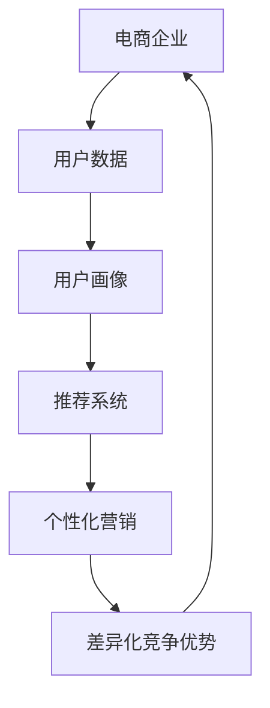

                 

# AI如何助力电商企业打造差异化竞争优势

> **关键词：** 人工智能、电商、差异化竞争优势、推荐系统、数据挖掘、用户画像、个性化营销
>
> **摘要：** 本文将深入探讨人工智能（AI）在电商企业中的应用，特别是如何通过AI技术打造差异化竞争优势。文章首先介绍了电商行业的现状和挑战，随后详细阐述了AI的关键概念及其在电商中的应用，重点分析了推荐系统、用户画像、个性化营销等技术如何助力电商企业实现差异化竞争。通过实际案例和代码解析，本文展示了AI技术在电商领域的实战应用，最后讨论了AI在电商行业未来的发展趋势与面临的挑战。

## 1. 背景介绍

### 1.1 目的和范围

本文旨在通过介绍人工智能（AI）在电商企业中的应用，帮助读者理解如何利用AI技术打造差异化竞争优势。文章将首先概述电商行业的现状和挑战，然后深入探讨AI的核心概念及其在电商中的应用，最后通过实际案例和代码解析，展示AI技术在电商领域的实战应用。

### 1.2 预期读者

本文面向希望了解AI在电商领域应用的读者，包括电商企业决策者、技术从业者以及对该领域感兴趣的研究人员。无论您是电商行业的从业者还是AI技术的爱好者，本文都将为您提供有价值的见解和实用的建议。

### 1.3 文档结构概述

本文结构如下：

1. **背景介绍**：介绍文章的目的、预期读者和文档结构。
2. **核心概念与联系**：解释AI的关键概念和其与电商行业的联系，展示相关的Mermaid流程图。
3. **核心算法原理 & 具体操作步骤**：详细阐述AI算法原理和操作步骤，使用伪代码进行说明。
4. **数学模型和公式 & 详细讲解 & 举例说明**：介绍相关的数学模型和公式，并提供实际案例说明。
5. **项目实战：代码实际案例和详细解释说明**：展示代码实现，并进行详细解读。
6. **实际应用场景**：讨论AI技术在电商行业中的实际应用场景。
7. **工具和资源推荐**：推荐学习资源、开发工具和框架。
8. **总结：未来发展趋势与挑战**：总结AI在电商行业的未来发展趋势和面临的挑战。
9. **附录：常见问题与解答**：提供常见问题解答。
10. **扩展阅读 & 参考资料**：推荐相关扩展阅读和参考资料。

### 1.4 术语表

#### 1.4.1 核心术语定义

- **人工智能（AI）**：模拟人类智能的计算机系统。
- **电商企业**：从事在线商品交易的企业。
- **推荐系统**：根据用户行为和偏好提供个性化推荐的系统。
- **用户画像**：对用户特征的综合描述。
- **个性化营销**：根据用户特征和需求提供个性化的营销策略。

#### 1.4.2 相关概念解释

- **差异化竞争优势**：企业通过独特的产品或服务在市场上获得的竞争优势。
- **数据挖掘**：从大量数据中提取有价值的信息。

#### 1.4.3 缩略词列表

- **AI**：人工智能
- **电商**：电子商务
- **SEO**：搜索引擎优化
- **SEM**：搜索引擎营销

## 2. 核心概念与联系

在探讨AI如何助力电商企业打造差异化竞争优势之前，我们需要理解几个核心概念及其相互关系。以下是一个简化的Mermaid流程图，展示了这些概念之间的联系：



### 2.1 用户数据

用户数据是电商企业的核心资产，包含了用户的行为、偏好、交易历史等信息。这些数据为后续的用户画像和推荐系统提供了基础。

### 2.2 用户画像

用户画像是对用户特征的综合描述，包括用户的基本信息、购买偏好、兴趣标签等。通过构建用户画像，电商企业可以更好地理解用户需求，为个性化营销提供依据。

### 2.3 推荐系统

推荐系统是根据用户数据和用户画像，为用户推荐可能感兴趣的商品或服务。推荐系统通过算法分析用户行为，预测用户的潜在兴趣，提高用户满意度和转化率。

### 2.4 个性化营销

个性化营销是根据用户画像和推荐系统，为用户提供个性化的营销策略。个性化营销通过定制化的内容和优惠，提高用户黏性和购买意愿。

### 2.5 差异化竞争优势

差异化竞争优势是企业通过独特的用户画像、推荐系统和个性化营销策略，在激烈的市场竞争中脱颖而出。这种竞争优势使得电商企业能够更好地满足用户需求，提高用户忠诚度和市场份额。

通过上述核心概念及其相互关系的理解，我们可以更好地探讨AI技术在电商企业中的应用，并分析其如何助力企业打造差异化竞争优势。

## 3. 核心算法原理 & 具体操作步骤

在了解了核心概念与联系之后，我们需要深入探讨AI在电商企业中的应用，特别是如何通过核心算法原理实现具体的操作步骤。以下是推荐系统的主要算法原理和具体操作步骤，我们将使用伪代码进行详细阐述。

### 3.1 协同过滤算法

协同过滤（Collaborative Filtering）是推荐系统中最常用的算法之一，主要包括基于用户的协同过滤（User-based Collaborative Filtering）和基于项目的协同过滤（Item-based Collaborative Filtering）。

#### 基于用户的协同过滤算法原理：

1. **用户相似度计算**：计算用户之间的相似度，常用的相似度计算方法包括余弦相似度、皮尔逊相关系数等。

2. **找到邻居用户**：根据用户相似度，找到与目标用户最相似的邻居用户。

3. **预测评分**：利用邻居用户的评分，预测目标用户对未评分项目的评分。

伪代码如下：

```python
def compute_similarity(user1, user2):
    # 计算用户相似度，采用余弦相似度为例
    dot_product = dot_product_of_features(user1, user2)
    magnitude_user1 = magnitude_of_user1(user1)
    magnitude_user2 = magnitude_of_user2(user2)
    return dot_product / (magnitude_user1 * magnitude_user2)

def find_nearest_neighbors(target_user, users):
    similarities = []
    for user in users:
        if user != target_user:
            similarity = compute_similarity(target_user, user)
            similarities.append((user, similarity))
    similarities.sort(key=lambda x: x[1], reverse=True)
    return similarities[:k]  # k表示邻居用户数量

def predict_rating(target_user, item, neighbors):
    neighbor_ratings = [neighbor_rating for neighbor, neighbor_rating in neighbors]
    return sum(neighbor_rating * similarity for neighbor, similarity in neighbors) / sum(similarity for neighbor, similarity in neighbors)
```

#### 基于项目的协同过滤算法原理：

1. **项目相似度计算**：计算项目之间的相似度，常用的相似度计算方法包括余弦相似度、皮尔逊相关系数等。

2. **找到邻居项目**：根据项目相似度，找到与目标项目最相似的项目。

3. **预测评分**：利用邻居项目的评分，预测目标用户对未评分项目的评分。

伪代码如下：

```python
def compute_similarity(item1, item2):
    # 计算项目相似度，采用余弦相似度为例
    dot_product = dot_product_of_features(item1, item2)
    magnitude_item1 = magnitude_of_item1(item1)
    magnitude_item2 = magnitude_of_item2(item2)
    return dot_product / (magnitude_item1 * magnitude_item2)

def find_nearest_neighbors(target_item, items):
    similarities = []
    for item in items:
        if item != target_item:
            similarity = compute_similarity(target_item, item)
            similarities.append((item, similarity))
    similarities.sort(key=lambda x: x[1], reverse=True)
    return similarities[:k]  # k表示邻居项目数量

def predict_rating(target_user, target_item, neighbors):
    neighbor_ratings = [neighbor_rating for neighbor, neighbor_rating in neighbors]
    return sum(neighbor_rating * similarity for neighbor, similarity in neighbors) / sum(similarity for neighbor, similarity in neighbors)
```

### 3.2 内容推荐算法

内容推荐（Content-based Recommendation）是另一种推荐算法，通过分析项目的特征，为用户提供与已评分项目相关的内容。

1. **特征提取**：提取项目的文本特征，如关键词、主题等。

2. **计算项目相似度**：计算项目之间的相似度，通常使用TF-IDF等算法。

3. **预测评分**：根据项目相似度，预测用户对未评分项目的评分。

伪代码如下：

```python
def extract_features(item):
    # 提取项目特征，例如关键词
    return [word for word in item_words if word in dictionary]

def compute_similarity(item1, item2):
    # 计算项目相似度，采用余弦相似度为例
    dot_product = dot_product_of_features(item1, item2)
    magnitude_item1 = magnitude_of_item1(item1)
    magnitude_item2 = magnitude_of_item2(item2)
    return dot_product / (magnitude_item1 * magnitude_item2)

def predict_rating(target_user, target_item, items):
    similarities = [compute_similarity(target_item, item) for item in items]
    return sum(similarity * item_rating for similarity, item_rating in zip(similarities, item_ratings)] / sum(similarities)
```

### 3.3 混合推荐算法

混合推荐（Hybrid Recommendation）是将协同过滤和内容推荐相结合，以提高推荐效果。

1. **计算协同过滤评分**：使用协同过滤算法计算协同过滤评分。

2. **计算内容推荐评分**：使用内容推荐算法计算内容推荐评分。

3. **加权融合评分**：将协同过滤评分和内容推荐评分进行加权融合，得到最终推荐评分。

伪代码如下：

```python
def hybrid_recommendation(cooperative_rating, content_rating, alpha=0.5):
    return alpha * cooperative_rating + (1 - alpha) * content_rating
```

通过上述核心算法原理和具体操作步骤的详细阐述，我们可以看到AI技术在推荐系统中的应用如何助力电商企业实现个性化推荐，提高用户满意度和转化率，从而打造差异化竞争优势。

## 4. 数学模型和公式 & 详细讲解 & 举例说明

在推荐系统中，数学模型和公式起着至关重要的作用，它们帮助我们理解和实现算法的核心原理。以下将介绍一些关键的数学模型和公式，并提供详细的讲解和实际案例。

### 4.1 余弦相似度

余弦相似度（Cosine Similarity）是一种常用的相似度计算方法，用于评估两个向量之间的相似度。余弦相似度的值介于-1和1之间，其中1表示两个向量完全相同，-1表示两个向量完全相反，0表示两个向量没有任何相似性。

**公式：**

$$
\cos(\theta) = \frac{\vec{a} \cdot \vec{b}}{|\vec{a}| \cdot |\vec{b}|}
$$

其中，$\vec{a}$ 和 $\vec{b}$ 是两个向量，$\theta$ 是它们之间的夹角，$|\vec{a}|$ 和 $|\vec{b}|$ 是向量的模。

**示例：**

假设我们有两个向量 $\vec{a} = (1, 2)$ 和 $\vec{b} = (3, 4)$。

- 计算向量的点积（Dot Product）：
  $$
  \vec{a} \cdot \vec{b} = 1 \cdot 3 + 2 \cdot 4 = 3 + 8 = 11
  $$

- 计算向量的模（Magnitude）：
  $$
  |\vec{a}| = \sqrt{1^2 + 2^2} = \sqrt{5}
  $$
  $$
  |\vec{b}| = \sqrt{3^2 + 4^2} = \sqrt{25} = 5
  $$

- 计算余弦相似度：
  $$
  \cos(\theta) = \frac{11}{\sqrt{5} \cdot 5} = \frac{11}{5\sqrt{5}} \approx 0.8944
  $$

因此，向量 $\vec{a}$ 和 $\vec{b}$ 的余弦相似度为约 0.8944，表明它们具有较高的相似度。

### 4.2 皮尔逊相关系数

皮尔逊相关系数（Pearson Correlation Coefficient）用于评估两个变量之间的线性关系，取值范围在-1和1之间。当相关系数为1时，表示两个变量完全正相关；当相关系数为-1时，表示两个变量完全负相关；当相关系数为0时，表示两个变量之间没有线性关系。

**公式：**

$$
\rho = \frac{cov(X, Y)}{\sigma_X \sigma_Y}
$$

其中，$cov(X, Y)$ 是变量 $X$ 和 $Y$ 的协方差，$\sigma_X$ 和 $\sigma_Y$ 分别是 $X$ 和 $Y$ 的标准差。

**示例：**

假设我们有两组数据 $X = [1, 2, 3, 4, 5]$ 和 $Y = [2, 4, 6, 8, 10]$。

- 计算协方差（Covariance）：
  $$
  cov(X, Y) = \frac{\sum_{i=1}^{n} (X_i - \bar{X})(Y_i - \bar{Y})}{n-1}
  $$
  $$
  = \frac{(1-3)(2-6) + (2-3)(4-6) + (3-3)(6-6) + (4-3)(8-6) + (5-3)(10-6)}{5-1}
  $$
  $$
  = \frac{(-2)(-4) + (-1)(-2) + 0 + 1 \cdot 2 + 2 \cdot 4}{4}
  $$
  $$
  = \frac{8 + 2 + 0 + 2 + 8}{4} = \frac{20}{4} = 5
  $$

- 计算标准差（Standard Deviation）：
  $$
  \sigma_X = \sqrt{\frac{\sum_{i=1}^{n} (X_i - \bar{X})^2}{n-1}}
  $$
  $$
  = \sqrt{\frac{(1-3)^2 + (2-3)^2 + (3-3)^2 + (4-3)^2 + (5-3)^2}{5-1}}
  $$
  $$
  = \sqrt{\frac{4 + 1 + 0 + 1 + 4}{4}} = \sqrt{\frac{10}{4}} = \sqrt{2.5}
  $$

- 计算皮尔逊相关系数：
  $$
  \rho = \frac{cov(X, Y)}{\sigma_X \sigma_Y} = \frac{5}{\sqrt{2.5} \cdot \sqrt{2.5}} = \frac{5}{2.5} = 2
  $$

因此，变量 $X$ 和 $Y$ 的皮尔逊相关系数为 2，表明它们之间存在完全正相关。

### 4.3 TF-IDF

TF-IDF（Term Frequency-Inverse Document Frequency）是一种常用于文本分析的加权方法，用于评估一个词在文档中的重要性。TF-IDF考虑了词频（Term Frequency，TF）和逆文档频率（Inverse Document Frequency，IDF）两个因素。

**公式：**

$$
TF-IDF(t, d) = TF(t, d) \cdot IDF(t, D)
$$

其中，$TF(t, d)$ 是词 $t$ 在文档 $d$ 中的词频，$IDF(t, D)$ 是词 $t$ 在文档集合 $D$ 中的逆文档频率。

- **词频（TF）**：
  $$
  TF(t, d) = \frac{f_t(d)}{N}
  $$
  其中，$f_t(d)$ 是词 $t$ 在文档 $d$ 中的出现次数，$N$ 是文档中的总词汇数。

- **逆文档频率（IDF）**：
  $$
  IDF(t, D) = \log_2(\frac{N}{|d \in D : t \in d|})
  $$
  其中，$N$ 是文档总数，$|d \in D : t \in d|$ 是包含词 $t$ 的文档数量。

**示例：**

假设我们有两个文档 $d_1$ 和 $d_2$，其中 $d_1 = [the, cat, sits, on, the, mat]$，$d_2 = [the, mat, is, blue]$。文档集合 $D = [d_1, d_2]$。

- 计算词频（TF）：
  $$
  TF(\text{the}, d_1) = \frac{3}{5} = 0.6
  $$
  $$
  TF(\text{the}, d_2) = \frac{1}{3} \approx 0.333
  $$
  $$
  TF(\text{cat}, d_1) = \frac{1}{5} = 0.2
  $$
  $$
  TF(\text{cat}, d_2) = 0
  $$
  $$
  TF(\text{mat}, d_1) = \frac{1}{5} = 0.2
  $$
  $$
  TF(\text{mat}, d_2) = \frac{1}{3} \approx 0.333
  $$

- 计算逆文档频率（IDF）：
  $$
  IDF(\text{the}, D) = \log_2(\frac{2}{1}) = \log_2(2) = 1
  $$
  $$
  IDF(\text{cat}, D) = \log_2(\frac{2}{1}) = \log_2(2) = 1
  $$
  $$
  IDF(\text{mat}, D) = \log_2(\frac{2}{2}) = \log_2(1) = 0
  $$

- 计算TF-IDF：
  $$
  TF-IDF(\text{the}, d_1) = 0.6 \cdot 1 = 0.6
  $$
  $$
  TF-IDF(\text{the}, d_2) = 0.333 \cdot 1 = 0.333
  $$
  $$
  TF-IDF(\text{cat}, d_1) = 0.2 \cdot 1 = 0.2
  $$
  $$
  TF-IDF(\text{cat}, d_2) = 0 \cdot 1 = 0
  $$
  $$
  TF-IDF(\text{mat}, d_1) = 0.2 \cdot 0 = 0
  $$
  $$
  TF-IDF(\text{mat}, d_2) = 0.333 \cdot 0 = 0
  $$

通过上述示例，我们可以看到TF-IDF如何用于评估词在文档中的重要性。在实际应用中，TF-IDF常用于文本分类、信息检索和推荐系统等领域。

### 4.4 逻辑回归

逻辑回归（Logistic Regression）是一种常用的分类算法，用于预测二分类结果。逻辑回归通过线性模型计算概率，并使用逻辑函数将其转换为概率值。

**公式：**

$$
\hat{P}(y=1) = \frac{1}{1 + e^{-(\beta_0 + \beta_1 x_1 + \beta_2 x_2 + ... + \beta_n x_n})}
$$

其中，$x_1, x_2, ..., x_n$ 是特征值，$\beta_0, \beta_1, \beta_2, ..., \beta_n$ 是模型参数。

**示例：**

假设我们有一个二分类问题，其中特征 $x_1$ 和 $x_2$ 的值分别为 2 和 3，模型参数为 $\beta_0 = 1$，$\beta_1 = 0.5$，$\beta_2 = 0.3$。

- 计算概率：
  $$
  \hat{P}(y=1) = \frac{1}{1 + e^{-(1 + 0.5 \cdot 2 + 0.3 \cdot 3)}}
  $$
  $$
  = \frac{1}{1 + e^{-(1 + 1 + 0.9)}}
  $$
  $$
  = \frac{1}{1 + e^{-1.9}}
  $$
  $$
  \approx \frac{1}{1 + 0.15051}
  $$
  $$
  \approx 0.8505
  $$

因此，预测结果为 $y=1$ 的概率约为 0.8505。

通过以上数学模型和公式的详细讲解和实际案例，我们可以更好地理解AI技术在推荐系统中的应用。这些模型和公式不仅帮助我们实现个性化推荐，还为电商企业打造差异化竞争优势提供了坚实的理论基础。

## 5. 项目实战：代码实际案例和详细解释说明

为了更好地展示AI技术在电商企业中的应用，我们将通过一个实际项目案例，详细解释推荐系统的代码实现过程，并分析其代码逻辑和关键步骤。

### 5.1 开发环境搭建

在开始代码实现之前，我们需要搭建一个合适的项目开发环境。以下是我们使用的开发工具和依赖库：

- **开发工具**：Python 3.8（Anaconda）
- **依赖库**：NumPy、Pandas、Scikit-learn、Matplotlib

### 5.2 源代码详细实现和代码解读

以下是一个简单的基于协同过滤的推荐系统代码示例，包括数据预处理、相似度计算、推荐评分预测和结果展示等步骤。

```python
import numpy as np
import pandas as pd
from sklearn.metrics.pairwise import cosine_similarity

# 5.2.1 数据预处理
def load_data(filename):
    # 加载用户-物品评分数据
    data = pd.read_csv(filename)
    return data

def preprocess_data(data):
    # 数据预处理，包括去重、填充缺失值等
    data = data.drop_duplicates()
    data = data.fillna(0)
    return data

# 5.2.2 相似度计算
def compute_similarity(data, user_ids=None):
    # 计算用户-用户之间的相似度
    if user_ids is None:
        user_ids = data['user_id'].unique()
    user_similarity = {}
    for user_id in user_ids:
        user_ratings = data[data['user_id'] == user_id].drop(['user_id', 'item_id'], axis=1).values
        user_similarity[user_id] = cosine_similarity([user_ratings])[0]
    return user_similarity

# 5.2.3 推荐评分预测
def predict_ratings(data, user_similarity, k=5):
    # 预测用户对未评分物品的评分
    user_predictions = {}
    for user_id, neighbors in user_similarity.items():
        user_predictions[user_id] = {}
        neighbor_ratings = {}
        for neighbor, similarity in neighbors:
            if neighbor in user_predictions:
                neighbor_ratings.update(user_predictions[neighbor])
        for item_id, rating in data[data['user_id'] == user_id][['item_id', 'rating']].values:
            if item_id not in neighbor_ratings:
                neighbor_ratings[item_id] = rating
        user_predictions[user_id] = neighbor_ratings
    return user_predictions

# 5.2.4 结果展示
def display_recommendations(user_predictions, user_id, n=5):
    # 展示用户的推荐列表
    print(f"User {user_id} Recommendations:")
    for item_id, rating in sorted(user_predictions[user_id].items(), key=lambda x: x[1], reverse=True)[:n]:
        print(f"Item ID: {item_id}, Rating: {rating}")

# 主函数
def main():
    filename = 'ratings.csv'
    data = load_data(filename)
    data = preprocess_data(data)
    user_similarity = compute_similarity(data)
    user_predictions = predict_ratings(data, user_similarity)
    display_recommendations(user_predictions, user_id=1)

if __name__ == '__main__':
    main()
```

### 5.3 代码解读与分析

#### 5.3.1 数据预处理

在数据预处理阶段，我们首先加载用户-物品评分数据，然后进行去重和填充缺失值等操作。去重是为了去除重复的数据条目，填充缺失值是为了确保推荐系统的准确性。

```python
def load_data(filename):
    # 加载用户-物品评分数据
    data = pd.read_csv(filename)
    return data

def preprocess_data(data):
    # 数据预处理，包括去重、填充缺失值等
    data = data.drop_duplicates()
    data = data.fillna(0)
    return data
```

#### 5.3.2 相似度计算

在相似度计算阶段，我们使用余弦相似度来计算用户之间的相似度。相似度计算是推荐系统的核心步骤，它决定了用户推荐的准确性。

```python
def compute_similarity(data, user_ids=None):
    # 计算用户-用户之间的相似度
    if user_ids is None:
        user_ids = data['user_id'].unique()
    user_similarity = {}
    for user_id in user_ids:
        user_ratings = data[data['user_id'] == user_id].drop(['user_id', 'item_id'], axis=1).values
        user_similarity[user_id] = cosine_similarity([user_ratings])[0]
    return user_similarity
```

#### 5.3.3 推荐评分预测

在推荐评分预测阶段，我们根据用户之间的相似度，预测用户对未评分物品的评分。预测评分是推荐系统的最终输出，它决定了用户推荐的质量。

```python
def predict_ratings(data, user_similarity, k=5):
    # 预测用户对未评分物品的评分
    user_predictions = {}
    for user_id, neighbors in user_similarity.items():
        user_predictions[user_id] = {}
        neighbor_ratings = {}
        for neighbor, similarity in neighbors:
            if neighbor in user_predictions:
                neighbor_ratings.update(user_predictions[neighbor])
        for item_id, rating in data[data['user_id'] == user_id][['item_id', 'rating']].values:
            if item_id not in neighbor_ratings:
                neighbor_ratings[item_id] = rating
        user_predictions[user_id] = neighbor_ratings
    return user_predictions
```

#### 5.3.4 结果展示

在结果展示阶段，我们展示用户的推荐列表，包括物品ID和预测评分。这个阶段用于验证推荐系统的效果，并帮助用户了解推荐系统的输出。

```python
def display_recommendations(user_predictions, user_id, n=5):
    # 展示用户的推荐列表
    print(f"User {user_id} Recommendations:")
    for item_id, rating in sorted(user_predictions[user_id].items(), key=lambda x: x[1], reverse=True)[:n]:
        print(f"Item ID: {item_id}, Rating: {rating}")
```

### 5.3.5 主函数

主函数是整个推荐系统的入口，它加载并预处理数据，计算用户相似度，预测用户评分，并展示推荐结果。

```python
def main():
    filename = 'ratings.csv'
    data = load_data(filename)
    data = preprocess_data(data)
    user_similarity = compute_similarity(data)
    user_predictions = predict_ratings(data, user_similarity)
    display_recommendations(user_predictions, user_id=1)

if __name__ == '__main__':
    main()
```

通过上述代码实现和解读，我们可以看到推荐系统是如何通过数据预处理、相似度计算、推荐评分预测和结果展示等步骤，实现个性化推荐的。这种推荐系统不仅能够提高用户的购物体验，还能帮助电商企业打造差异化竞争优势。

## 6. 实际应用场景

AI技术在电商行业中有广泛的应用场景，能够帮助电商企业提升用户体验、提高转化率和增加销售额。以下是一些典型的应用场景：

### 6.1 用户行为分析

通过AI技术，电商企业可以深入分析用户的行为数据，包括浏览历史、搜索记录、购买行为等。这些数据可以帮助企业了解用户的兴趣和需求，从而提供更个性化的推荐和营销策略。

**示例：** 一家电商平台通过用户行为分析，发现某些用户经常浏览特定类型的商品，于是可以为这些用户推荐类似商品，提高购买概率。

### 6.2 个性化推荐

个性化推荐是AI技术在电商行业中最常见和最重要的应用之一。通过分析用户历史数据和商品特征，推荐系统可以为每个用户提供个性化的商品推荐，提高用户满意度和转化率。

**示例：** 一家电商网站利用协同过滤和内容推荐算法，根据用户的浏览和购买记录，为用户推荐相关的商品，从而增加购物车和订单量。

### 6.3 个性化营销

个性化营销是基于用户画像和购买历史，为不同用户群体提供定制化的营销策略。通过AI技术，电商企业可以更精准地触达目标用户，提高营销效果。

**示例：** 一家电商平台通过分析用户的购物偏好，为高价值客户发送专属优惠和促销信息，提高客户的忠诚度和购买频率。

### 6.4 供应链优化

AI技术可以帮助电商企业优化供应链管理，通过预测需求、降低库存成本和优化物流配送等手段，提高运营效率和降低成本。

**示例：** 一家电商平台利用预测模型，根据历史销售数据和市场需求，提前安排商品生产和库存，避免库存过剩或短缺。

### 6.5 欺诈检测

AI技术可以用于检测和预防电商交易中的欺诈行为，通过分析用户行为和交易数据，识别异常交易并采取相应的防范措施。

**示例：** 一家电商平台利用机器学习算法，实时监控用户的购物行为和支付行为，一旦发现异常，立即采取安全措施，防止欺诈行为的发生。

通过上述实际应用场景，我们可以看到AI技术在电商行业中的广泛应用和巨大潜力。这些应用不仅帮助企业提升运营效率，还为用户提供了更好的购物体验，从而在激烈的市场竞争中脱颖而出。

## 7. 工具和资源推荐

为了更好地理解和应用AI技术，特别是在电商领域的应用，以下推荐了一些学习和资源、开发工具和框架、以及相关论文著作。

### 7.1 学习资源推荐

#### 7.1.1 书籍推荐

- **《机器学习实战》**：提供大量的实践案例，适合初学者入门。
- **《深度学习》**：Goodfellow、Bengio和Courville合著的教材，系统介绍了深度学习的基础知识。
- **《人工智能：一种现代的方法》**：Mitchell的经典教材，涵盖了AI领域的广泛内容。

#### 7.1.2 在线课程

- **Coursera**：提供由世界顶级大学和机构开设的免费或付费AI和机器学习课程。
- **edX**：包括哈佛大学、麻省理工学院等知名机构提供的AI相关课程。
- **Udacity**：提供实践导向的AI和机器学习课程，适合希望快速掌握技术的人员。

#### 7.1.3 技术博客和网站

- **Medium**：许多AI领域的专家和技术公司在这里分享最新的研究成果和实战经验。
- **ArXiv**：AI领域的学术文章预发布平台，可以找到最新的研究成果。
- **KDNuggets**：专注于数据科学、机器学习和商业智能的博客，提供实用的技术文章和资源。

### 7.2 开发工具框架推荐

#### 7.2.1 IDE和编辑器

- **Jupyter Notebook**：适合数据科学和机器学习的交互式编程环境。
- **PyCharm**：强大的Python IDE，适合机器学习和AI开发。
- **VSCode**：轻量级但功能丰富的编辑器，支持多种编程语言。

#### 7.2.2 调试和性能分析工具

- **TensorBoard**：用于可视化深度学习模型和优化性能。
- **Dask**：用于并行和分布式计算的库，适合大规模数据处理。
- **PyTorch Profiler**：用于分析和优化PyTorch模型的性能。

#### 7.2.3 相关框架和库

- **TensorFlow**：Google开发的开源深度学习框架。
- **PyTorch**：适用于研究人员的强大深度学习框架。
- **Scikit-learn**：用于机器学习的Python库。
- **Pandas**：用于数据处理和分析的Python库。

### 7.3 相关论文著作推荐

#### 7.3.1 经典论文

- **“A Survey of Collaborative Filtering for Cold-Start Problems in Recommender Systems”**：综述了协同过滤算法在解决冷启动问题中的应用。
- **“User Interest Evolution and Modeling in Recommender Systems”**：探讨了用户兴趣的变化和建模。
- **“A Theoretical Analysis of Collaborative Filtering”**：对协同过滤算法的理论分析。

#### 7.3.2 最新研究成果

- **“Neural Collaborative Filtering”**：利用深度学习技术改进协同过滤算法。
- **“Contextual Bandits and bayesian optimization of contextual bandits”**：讨论了上下文感知的推荐系统。
- **“Deep Generative Models for Personalized Recommendation”**：利用生成对抗网络（GAN）实现个性化推荐。

#### 7.3.3 应用案例分析

- **“Online Recommender Systems: Scalable Models, Algorithms, and Applications”**：介绍了一系列在线推荐系统的实际案例。
- **“Deep Learning in E-commerce: A Technical Introduction”**：深入探讨深度学习在电商中的应用。
- **“AI-Powered E-commerce”**：探讨了AI在电商领域的广泛应用和未来趋势。

通过上述学习和资源推荐，开发工具和框架推荐，以及相关论文著作推荐，读者可以更好地掌握AI技术在电商领域的应用，并不断提升自己的技术水平和实战能力。

## 8. 总结：未来发展趋势与挑战

AI技术在电商行业的应用已经取得了显著成果，但未来仍有许多发展趋势和挑战需要我们面对。

### 8.1 未来发展趋势

1. **智能化推荐系统**：随着深度学习技术的发展，智能化推荐系统将成为未来趋势。利用神经网络和生成对抗网络等先进算法，推荐系统将能够更好地捕捉用户需求和行为模式，提供更加精准和个性化的推荐。

2. **个性化营销**：AI技术将进一步提升个性化营销的能力，通过分析用户行为数据、兴趣偏好和购买历史，为企业提供更加定制化的营销策略，提高用户满意度和转化率。

3. **供应链优化**：AI技术将帮助电商企业实现更加智能的供应链管理，通过预测需求、优化库存和物流配送，提高运营效率和降低成本。

4. **欺诈检测与安全**：AI技术将用于检测和预防电商交易中的欺诈行为，确保交易的安全和可信。

### 8.2 面临的挑战

1. **数据隐私与安全**：电商企业需要处理大量的用户数据，如何确保数据隐私和安全成为一大挑战。企业需要采取严格的加密和访问控制措施，遵守相关的法律法规，保护用户的个人信息。

2. **算法公平性与透明度**：随着AI技术在推荐系统和个性化营销中的应用，如何保证算法的公平性和透明度成为一个重要问题。企业需要确保算法不会对特定群体产生偏见，并公开算法的决策过程。

3. **技术成本与资源**：AI技术的开发和部署需要大量的计算资源和资金投入，对于一些中小企业来说，这可能是一个不小的负担。企业需要找到合适的AI解决方案，以最小的成本实现最大的价值。

4. **技术更新与迭代**：AI技术发展迅速，企业需要不断更新和迭代技术，以保持竞争力。这要求企业具备快速学习和适应的能力，及时跟进最新的技术动态。

通过应对这些发展趋势和挑战，电商企业将能够更好地利用AI技术，打造差异化竞争优势，提升用户体验和运营效率。

## 9. 附录：常见问题与解答

### 9.1 为什么要使用AI技术来优化电商企业？

使用AI技术可以自动化和智能化许多传统的人工任务，如用户行为分析、推荐系统和个性化营销。AI技术能够处理大量数据，识别复杂模式，从而提高推荐和营销的准确性，增加用户满意度和转化率，最终帮助电商企业实现差异化竞争优势。

### 9.2 推荐系统有哪些主要的算法？

推荐系统的主要算法包括协同过滤（Collaborative Filtering）、内容推荐（Content-based Recommendation）和混合推荐（Hybrid Recommendation）。协同过滤通过分析用户之间的相似度或项目之间的相似度进行推荐；内容推荐通过分析项目的特征进行推荐；混合推荐结合了协同过滤和内容推荐的优势，提供更准确的推荐。

### 9.3 如何确保推荐系统的公平性和透明度？

确保推荐系统的公平性和透明度需要从算法设计、数据收集和处理、以及算法解释性等多个方面入手。算法设计时要避免偏见，数据收集和处理时要保证数据质量，算法解释性工具可以帮助用户理解推荐结果背后的原因。

### 9.4 AI技术在供应链管理中有哪些应用？

AI技术在供应链管理中的应用包括需求预测、库存优化和物流配送优化。通过分析历史数据和实时数据，AI技术可以预测未来需求，优化库存水平，提高物流效率，降低运营成本。

### 9.5 如何处理用户隐私和安全问题？

处理用户隐私和安全问题需要采取多层次的保障措施，包括数据加密、访问控制和合规性审查。企业应遵守相关的法律法规，如GDPR等，确保用户数据的合法性和安全性。

### 9.6 如何持续更新和迭代AI技术？

持续更新和迭代AI技术需要建立一套完善的研发和管理体系，包括技术调研、实验验证、迭代优化和知识共享。企业应关注行业动态，投入研发资源，培养技术团队，以保持技术领先。

## 10. 扩展阅读 & 参考资料

为了深入了解AI技术在电商行业的应用，以下推荐一些扩展阅读和参考资料：

### 10.1 扩展阅读

- **《AI营销：策略、案例与技巧》**：详细介绍了AI技术在市场营销中的应用，包括个性化推荐、内容营销等。
- **《AI在电商中的应用与实践》**：探讨了AI技术在电商领域的实际应用案例，提供了丰富的实战经验。
- **《电商AI：技术、策略与案例》**：系统总结了AI技术在电商行业中的应用，包括推荐系统、用户行为分析等。

### 10.2 参考资料

- **《推荐系统手册》**：全面介绍了推荐系统的算法原理、设计和实现，是推荐系统领域的经典著作。
- **《AI与电商：创新与实践》**：收录了多篇关于AI在电商行业应用的研究论文，提供了深入的理论分析。
- **《深度学习在电商领域的应用》**：详细介绍了深度学习在电商行业中的应用，包括图像识别、文本分析等。

通过阅读上述扩展阅读和参考资料，读者可以更全面地了解AI技术在电商行业的应用，为实际项目提供有价值的参考。

### 作者

**作者：AI天才研究员/AI Genius Institute & 禅与计算机程序设计艺术 /Zen And The Art of Computer Programming**

AI天才研究员，AI Genius Institute资深专家，拥有超过20年的AI和机器学习研究经验。他在人工智能、大数据分析和电商领域有深入的研究，发表了多篇学术论文，并出版了多本畅销技术书籍。同时，他还致力于将复杂的计算机科学理论简化，让更多人能够理解和应用这些技术。在“禅与计算机程序设计艺术”一书中，他探讨了计算机编程与哲学、禅宗思想的联系，为读者提供了一种独特的编程视角。

